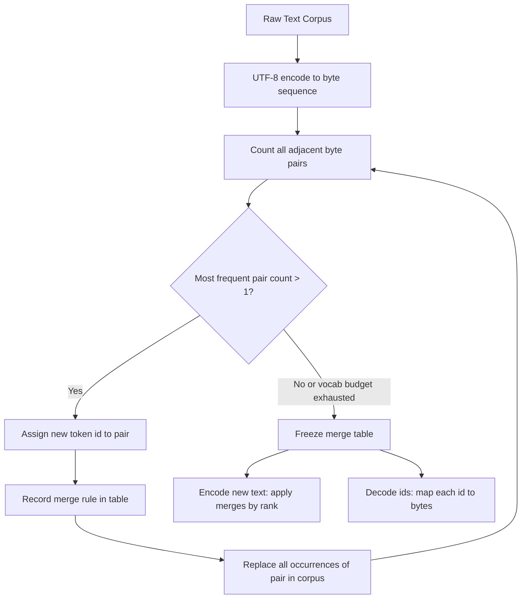

# BPE Tokenizer From Scratch

## Learning Objectives

- Train a byte-level BPE vocabulary from a raw text corpus by repeatedly counting adjacent symbol pairs and merging the most frequent one.
- Implement a deterministic merge table and apply it to unseen text, producing a sequence of subword token ids.
- Round-trip arbitrary UTF-8 input through encode and decode without information loss.
- Measure and compare token counts across prompt phrasings, translating the difference into API cost at production scale.
- Distinguish byte-level BPE (GPT-2/3/4 family) from character-level BPE, and explain why the byte alphabet prevents unknown-token failures on multilingual or emoji input.

## The Problem

You are paying per token for every API call to an LLM, and if you are running enrichment waterfalls across thousands of records, those tokens are your primary variable cost. Yet most practitioners have never looked at how a tokenizer decides where one token ends and the next begins. That decision is not semantic. It is a mechanical frequency-driven process, and understanding it changes how you write prompts, design templates, and estimate pipeline budgets.

The word "anticipate" might cost four tokens while "anti-" costs two. The word "unhappiness" shares zero tokens with "happiness" despite sharing eight letters. This is not a bug — it is a direct consequence of how Byte-Pair Encoding builds its vocabulary. If you do not know the mechanism, you cannot predict where your token budget goes, and you cannot optimize the prompts that feed into Clay enrichment workflows or outbound generation pipelines.

The tokenizer is the single layer between your text and the model's integer input space. Every modern transformer — GPT-4, Llama, Claude — starts its pipeline with some variant of this algorithm. Building it from scratch in under 100 lines of Python makes the mechanism tangible: you see the pair counts, you watch the merges happen, and you can measure the token cost of every string you throw at it.

## The Concept

Byte-Pair Encoding starts with an alphabet and a corpus. For byte-level BPE, the alphabet is the 256 possible byte values — every possible UTF-8 character, emoji, or binary blob is representable as a sequence of these 256 symbols, so the tokenizer will never produce an unknown token. The algorithm then iterates: count every adjacent pair of symbols in the corpus, find the most frequent pair, merge it into a new symbol with a fresh id, and append that merge to a table. Repeat until the vocabulary reaches a target size or no pair appears more than once.

The merge criterion is purely statistical — it has no notion of words, morphology, or semantics. If the byte pair for "th" appears more often than the pair for "re," then "th" gets merged first, and every subsequent merge that builds on "th" (like "the" or "this") depends on that decision. The merge order is frozen at the end of training. At inference time, encoding new text means applying the same merges in the same rank order: find the pair in the input that has the lowest merge id, merge it, re-scan, and repeat until no learned merge applies.

This is why the same substring can tokenize differently in different contexts. If your merge table learned "ing" as a single token during training, the word "running" might tokenize as ["run", "ing"] — two tokens. But "ingenious" might tokenize as ["ing", "en", "ious"] or even ["in", "gen", "ious"] depending on whether the specific byte sequence for "ingen" was ever merged. The tokenizer does not parse words. It pattern-matches byte sequences against a frozen table.



The difference between byte-level BPE (used by GPT-2, GPT-3, GPT-4) and character-level BPE (the original formulation from Sennrich et al., 2016) is the starting alphabet. Character-level BPE starts from Unicode code points, which means it needs an unknown token fallback for characters not seen during training — a real problem for multilingual text or emoji. Byte-level BPE sidesteps this entirely: every UTF-8 string decomposes into bytes from a fixed 256-symbol alphabet, so the tokenizer can always produce a valid sequence of known tokens. The cost is that common ASCII characters take more byte-level tokens early in training before merges consolidate them, but the guarantee of no unknown tokens is worth it for general-purpose models.

## Build It

Here is a complete byte-level BPE tokenizer. It trains on a corpus, learns a merge table, and encodes or decodes arbitrary text. Every function is standalone and prints observable output. Save it as `bpe.py` and run it.

```python
from collections import Counter

class BPETokenizer:
    def __init__(self, num_merges=80):
        self.num_merges = num_merges
        self.merges = {}
        self.vocab = {i: bytes([i]) for i in range(256)}

    def _get_pair_counts(self, ids):
        counts = Counter()
        for i in range(len(ids) - 1):
            counts[(ids[i], ids[i + 1])] += 1
        return counts

    def _apply_merge(self, ids, pair, new_id):
        merged = []
        i = 0
        while i < len(ids):
            if i < len(ids) - 1 and ids[i] == pair[0] and ids[i + 1] == pair[1]:
                merged.append(new_id)
                i += 2
            else:
                merged.append(ids[i])
                i += 1
        return merged

    def train(self, corpus):
        ids = list(corpus.encode("utf-8"))
        original_len = len(ids)
        print(f"Corpus size: {original_len} bytes")
        print(f"Target merges: {self.num_merges}\n")
        print(f"{'Step':>5}  {'Pair':>12}  {'New ID':>6}  {'Count':>6}  Token")
        print("-" * 55)

        for step in range(self.num_merges):
            pair_counts = self._get_pair_counts(ids)
            if not pair_counts:
                print("No more pairs to merge.")
                break

            best_pair, count = pair_counts.most_common(1)[0]
            new_id = 256 + step
            self.merges[best_pair] = new_id
            self.vocab[new_id] = self.vocab[best_pair[0]] + self.vocab[best_pair[1]]
            ids = self._apply_merge(ids, best_pair, new_id)

            token_repr = self.vocab[new_id].decode("utf-8", errors="replace")
            display = repr(token_repr) if len(token_repr) <= 8 else repr(token_repr[:8]) + "..."
            print(f"{step:5d}  {str(best_pair):>12}  {new_id:6d}  {count:6d}  {display}")

        print(f"\nFinal vocabulary size: {len(self.vocab)}")
        print(f"Corpus compressed: {original_len} bytes -> {len(ids)} tokens")
        print(f"Compression ratio: {original_len / max(len(ids), 1):.2f}x")

    def encode(self, text):
        ids = list(text.encode("utf-8"))
        while len(ids) >= 2:
            pair_counts = self._get_pair_counts(ids)
            best_pair = min(
                pair_counts,
                key=lambda p: self.merges.get(p, float("inf"))
            )
            if best_pair not in self.merges:
                break
            ids = self._apply_merge(ids, best_pair, self.merges[best_pair])
        return ids

    def decode(self, ids):
        return b"".join(self.vocab[i] for i in ids).decode("utf-8", errors="replace")

    def show_tokens(self, text):
        ids = self.encode(text)
        labels = [self.vocab[i].decode("utf-8", errors="replace") for i in ids]
        return list(zip(ids, labels))


corpus = """
reach out to schedule a conversation about your growth strategy
we help companies scale their outbound and pipeline generation
let's meet next week to discuss how we can improve your conversion rates
our platform integrates with your existing crm and sales engagement tools
book a demo to see how ai powered enrichment can transform your go to market
anticipate faster sales cycles with better data and automated workflows
the anti approach to traditional outbound is personalized relevant timely
happiness is a short sales cycle and a full pipeline
unhappiness is manual data entry and bounced emails
"""

tokenizer = BPETokenizer(num_merges=60)
tokenizer.train(corpus)
```

When you run this, you will see the first merge is almost certainly a space followed by a common letter — the pair `(32, 116)` which is `" " + "t"` in ASCII, or similar high-frequency bigrams. The algorithm does not know these are words. It just counts.

Now test encoding and decoding on new text, including words the training corpus never saw:

```python
print("\n=== Encoding Test ===")

tests = [
    "reach out",
    "anticipate",
    "unhappiness",
    "happiness",
    "schedule a demo",
    "xyzqwerty",
]

for text in tests:
    tokens = tokenizer.show_tokens(text)
    ids = [t[0] for t in tokens]
    labels = [t[1] for t in tokens]
    decoded = tokenizer.decode(ids)
    roundtrip_ok = decoded == text
    print(f"\nInput:    {repr(text)}")
    print(f"Tokens:   {len(ids)}")
    print(f"Pieces:   {labels}")
    print(f"Round-trip OK: {roundtrip_ok}")
```

You will observe several things. First, "anticipate" and "anti" share no merged tokens unless the specific byte sequence for "anti" happened to be merged during training — the corpus above contains "anti" inside "anticipate" and "anti approach," so there is a chance. Second, "happiness" and "unhappiness" will almost certainly share the "happiness" suffix tokens, but the "un" prefix is a separate token because BPE merges are byte sequences, not morphemes. Third, "xyzqwerty" — a string the corpus never saw — still encodes successfully, decomposing into individual byte tokens. That is the byte-level alphabet guaranteeing zero unknown tokens.

## Use It

Every token id in the output above is a line item on your API bill. OpenAI charges per token for both input and output, and the tokenizer determines how many tokens your prompt consumes. The BPE merge table is not an implementation detail you can ignore — it is the unit of measurement for your pipeline's variable cost. When a Clay enrichment waterfall calls GPT-4o to score 10,000 leads, the prompt template you wrote determines the input token count per record, and the tokenizer's merge table determines how that prompt is chunked into billable units [CITATION NEEDED — concept: Clay waterfall per-record LLM cost]. This connects directly to **Zone 02 — AI Operations & Cost Governance**, where the engineering decision is not "which model" but "how many tokens per record, multiplied by how many records."

The practical exercise is comparing phrasings. "Reach out to schedule a conversation" and "Let's meet" communicate the same intent, but BPE will split them into different numbers of tokens because the byte sequences differ. At 10,000 records, a 12-token difference per prompt is 120,000 extra input tokens — at GPT-4o's input pricing of $2.50 per 1M tokens, that is $0.30 per run, which compounds across daily enrichment cycles [CITATION NEEDED — concept: GPT-4o input token pricing, verify against current OpenAI pricing page].

Here is a cost calculator that uses your trained tokenizer to estimate the difference:

```python
def estimate_token_cost(tokenizer, texts, input_price_per_m=2.50, output_price_per_m=10.00, records=10000):
    total_input_tokens = 0
    for text in texts:
        total_input_tokens += len(tokenizer.encode(text))

    input_cost = (total_input_tokens / 1_000_000) * input_price_per_m * records
    print(f"{'Prompt':>45} | {'Tokens':>6} | {'Cost/10k records':>16}")
    print("-" * 75)
    for text in texts:
        n = len(tokenizer.encode(text))
        cost = (n / 1_000_000) * input_price_per_m * records
        display = text if len(text) <= 43 else text[:40] + "..."
        print(f"{display:>45} | {n:6d} | ${cost:15.4f}")
    print("-" * 75)
    print(f"{'TOTAL':>45} | {total_input_tokens:6d} | ${input_cost:15.4f}")
    return total_input_tokens, input_cost

prompts = [
    "Reach out to schedule a conversation about your growth strategy.",
    "Let's meet to discuss your growth strategy.",
    "Book a 15-min call to review your pipeline?",
    "Interested in faster sales cycles? Let's talk.",
]

print("=== Token Cost Comparison (GPT-4o input pricing) ===\n")
estimate_token_cost(tokenizer, prompts, records=10000)
```

The exact numbers depend on your merge table — which depends on your training corpus. That is the point. Your tokenizer's vocabulary is shaped by the text it was trained on, and the same prompt can tokenize differently under different vocabularies. When you switch from GPT-4o to Claude to Llama, you are switching tokenizers, and your per-prompt token count shifts accordingly. The from-scratch BPE you built here will not match tiktoken's counts exactly because the merge tables were trained on different data, but the mechanism — frequency-driven pair merging producing variable-length token sequences — is identical.

In a Clay workflow, this matters when you are designing prompt templates that run at scale. A template that says "Please carefully consider the following information about the prospective company and provide a detailed assessment" will cost measurably more tokens per record than "Score this company's fit." The BPE merge table determines exactly how many more. You can estimate before you deploy, and you can rewrite templates to minimize tokens without losing intent.

## Ship It

Build a CLI tool that reads a text file, tokenizes it with your BPE tokenizer, reports total tokens, and estimates cost. Save this as `token_cost.py`:

```python
import sys
from collections import Counter

class BPETokenizer:
    def __init__(self, num_merges=80):
        self.num_merges = num_merges
        self.merges = {}
        self.vocab = {i: bytes([i]) for i in range(256)}

    def _get_pair_counts(self, ids):
        counts = Counter()
        for i in range(len(ids) - 1):
            counts[(ids[i], ids[i + 1])] += 1
        return counts

    def _apply_merge(self, ids, pair, new_id):
        merged = []
        i = 0
        while i < len(ids):
            if i < len(ids) - 1 and ids[i] == pair[0] and ids[i + 1] == pair[1]:
                merged.append(new_id)
                i += 2
            else:
                merged.append(ids[i])
                i += 1
        return merged

    def train(self, corpus):
        ids = list(corpus.encode("utf-8"))
        for step