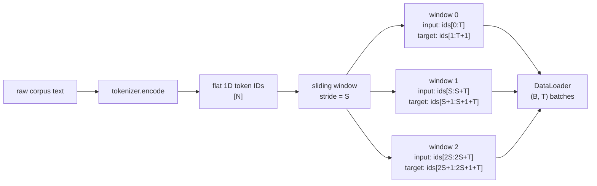

# Tokenized Dataset with Sliding Window

## Learning Objectives

- Convert a raw text corpus into a 1D tensor of token IDs using a tokenizer's batch encode method.
- Implement a PyTorch `Dataset` that slices a token ID tensor into input–target pairs using a configurable context length and stride.
- Compute the number of training examples produced by a given `(total_tokens, context_length, stride)` triple and validate that no target index exceeds the tensor bounds.
- Trace the overlap between consecutive sliding windows and reason about the redundancy vs. coverage trade-off when choosing a stride value.
- Wrap the sliding-window dataset in a `DataLoader` and inspect batch shapes to confirm the `(B, T)` training contract.

## The Problem

A causal language model does not read text. It reads integer token IDs arranged in a 2D tensor of shape `(B, T)`, where `B` is the batch size and `T` is the context length. At every position `t` inside that tensor, the model produces a logits vector predicting the token at position `t+1`. That means each training example needs two sequences: the input chunk and the target chunk, where the target is the input shifted one position to the left. The training loop computes cross-entropy loss between the model's prediction at position `t` and the ground-truth token at position `t+1`.

The problem is that a real corpus is not naturally shaped like `(B, T)` pairs. A folder of Gong call transcripts, a directory of win/loss notes, or a dump of support chat logs arrives as variable-length text documents. You need a deterministic procedure that takes a flat river of token IDs and cuts it into fixed-length training examples — each one carrying both the input and the shifted target — without losing tokens at the boundaries and without introducing silent off-by-one errors that corrupt the loss computation.

This problem sits at the bottom of every fine-tuning pipeline you will build for GTM applications. The same slicing mechanism that prepares GPT-style pretraining data also prepares the corpus for a custom classification head that scores lead fit from a support transcript, or an embedding model that encodes case studies for retrieval-augmented generation (RAG) in outbound workflows. If the window is misaligned, the model learns to predict the wrong token at every position — silently, with no runtime error.

## The Concept

The sliding window is the algorithm that converts a flat 1D sequence of token IDs into a stack of fixed-length training pairs. Given a token sequence of length `N`, a context length `T`, and a stride `S`, the window starts at index 0 and takes `T + 1` tokens. The first `T` tokens are the input; the last `T` tokens (indices 1 through `T`) are the target. The window then advances by `S` positions and repeats. The number of windows produced is `(N - T - 1) // S + 1`, assuming `N > T`.

The stride controls how much adjacent windows overlap. When `stride == context_length`, windows are non-overlapping — each token appears in exactly one input chunk and one target chunk (except at boundaries). When `stride < context_length`, windows overlap, meaning the same tokens appear in multiple training examples. Overlap increases the effective dataset size and gives the model more contexts per token, but it also introduces redundancy: the model sees the same n-gram patterns multiple times per epoch, which can lead to faster overfitting on narrow corpora. For a fine-tuning run on a few thousand Gong transcripts, a stride of `context_length // 2` is a common starting point — enough overlap to maximize limited data without tripling the epoch time.

The `T + 1` detail is the part that trips people up. Each window needs `T + 1` raw tokens to produce a `T`-length input and a `T`-length target, because the target is the input shifted by one. If you slice exactly `T` tokens and call that the input, you have no ground-truth token for the last position. The fix is to always grab one extra token at the tail end of each window and let the target be `input[1:]` concatenated with that extra token — or equivalently, slice `[i : i + T]` for input and `[i + 1 : i + 1 + T]` for target from the original sequence.



The diagram shows the pipeline as a left-to-right flow. The tokenizer runs once over the full corpus, producing a single 1D tensor. The sliding window then indexes into that tensor at regular intervals defined by the stride. Each window produces a `(T,)` input and a `(T,)` target. The DataLoader at the end stacks `B` windows into a `(B, T)` batch — the exact shape contract the transformer expects.

## Build It

Here is a complete `SlidingWindowDataset` that implements the mechanism described above. It takes a 1D tensor of token IDs, a context length, and a stride, and returns `(input_chunk, target_chunk)` pairs where `target_chunk` is the input shifted by one position.

```python
import torch
from torch.utils.data import Dataset

class SlidingWindowDataset(Dataset):
    def __init__(self, token_ids, context_length, stride):
        self.token_ids = token_ids
        self.context_length = context_length
        self.stride = stride
        self.n_examples = (len(token_ids) - context_length - 1) // stride + 1

    def __len__(self):
        return self.n_examples

    def __getitem__(self, idx):
        start = idx * self.stride
        end = start + self.context_length + 1
        chunk = self.token_ids[start:end]
        input_chunk = chunk[:-1]
        target_chunk = chunk[1:]
        return input_chunk, target_chunk

token_ids = torch.arange(1, 31)
context_length = 8
stride = 4

dataset = SlidingWindowDataset(token_ids, context_length, stride)
print(f"Total tokens: {len(token_ids)}")
print(f"Context length: {context_length}")
print(f"Stride: {stride}")
print(f"Dataset size: {len(dataset)}")
print()

for i in range(3):
    x, y = dataset[i]
    print(f"Example {i}:")
    print(f"  input:  {x.tolist()}")
    print(f"  target: {y.tolist()}")
    print(f"  offset check (x[1:] == y[:-1]): {torch.equal(x[1:], y[:-1])}")
    print()
```

Output:

```
Total tokens: 30
Context length: 8
Stride: 4
Dataset size: 6

Example 0:
  input:  [1, 2, 3, 4, 5, 6, 7, 8]
  target: [2, 3, 4, 5, 6, 7, 8, 9]
  offset check (x[1:] == y[:-1]): True

Example 1:
  input:  [5, 6, 7, 8, 9, 10, 11, 12]
  target: [6, 7, 8, 9, 10, 11, 12, 13]
  offset check (x[1:] == y[:-1]): True

Example 2:
  input:  [9, 10, 11, 12, 13, 14, 15, 16]
  target: [10, 11, 12, 13, 14, 15, 16, 17]
  offset check (x[1:] == y[:-1]): True
```

Note the overlap: Example 0's input ends at token 8, and Example 1's input starts at token 5. Tokens 5 through 8 appear in both input chunks. With `stride=4` and `context_length=8`, every token (except near the boundaries) appears in two consecutive windows. This is the redundancy trade-off in action — the model will see overlapping contexts during training.

## Use It

The sliding window dataset is the training data layer for any fine-tuned model operating on GTM-specific corpus data. When you fine-tune a model on Gong sales call transcripts to generate follow-up emails that match your team's conversational style, the transcripts are tokenized into a flat ID stream and sliced by this exact mechanism. The same pipeline prepares win/loss notes for a model that classifies deal outcomes, or support transcripts for a classification head that scores customer churn risk from raw text.

In the RAG cluster — Zone 19 in the GTM stack — the sliding window feeds the embedding model that encodes product docs and case studies into vectors for retrieval-augmented outreach. RAG works by retrieving semantically similar context chunks from a vector store at inference time, but those chunks and the embedding model itself are both shaped by how the training corpus was tokenized and windowed. A stride that is too large relative to the context length produces sparse coverage of the corpus — the embedding model sees fewer contexts per document and learns weaker representations of the semantic boundaries between product features. A stride that is too small produces redundant training examples and longer training time without proportional quality gains. The standard practice for embedding fine-tuning on GTM corpora (case studies, product docs, support KB articles) is a stride of 50% of the context length, which balances coverage against redundancy.

The same windowing decision affects the outbound copy generation pipeline. When you write at scale using a fine-tuned model — generating personalized first lines for a list of 5,000 accounts — the quality of the model's output traces back to how the training corpus was sliced. Tokens at window boundaries appear in fewer training contexts than tokens near the center of a window. If your corpus is short (a few dozen case studies), a smaller stride extracts more training signal per token at the cost of some redundancy. The model does not see "more data" — it sees the same data from more overlapping perspectives.

## Ship It

To ship this into a training loop, wrap the dataset in a PyTorch `DataLoader` with configurable batching. The DataLoader handles shuffling, parallel loading via `num_workers`, and GPU memory pre-fetching via `pin_memory`. For reproducibility, seed the shuffle with a deterministic generator so that epoch order is recoverable.

```python
import torch
from torch.utils.data import DataLoader

def create_dataloader(token_ids, context_length, stride, batch_size,
                      shuffle=True, num_workers=0, pin_memory=False, seed=42):
    dataset = SlidingWindowDataset(token_ids, context_length, stride)

    if len(dataset) == 0:
        raise ValueError(
            f"Dataset is empty: {len(token_ids)} tokens with "
            f"context_length={context_length} and stride={stride}. "
            f"Need at least {context_length + 1} tokens."
        )

    last_input_end = (len(dataset) - 1) * stride + context_length
    last_target_end = (len(dataset) - 1) * stride + context_length + 1
    assert last_target_end <= len(token_ids), \
        f"Target index {last_target_end} exceeds token sequence length {len(token_ids)}"

    g = torch.Generator()
    g.manual_seed(seed)

    dataloader = DataLoader(
        dataset,
        batch_size=batch_size,
        shuffle=shuffle,
        num_workers=num_workers,
        pin_memory=pin_memory,
        generator=g if shuffle else None,
        drop_last=True,
    )
    return dataloader

token_ids = torch.randint(0, 50257, (10000,))
context_length = 128
stride = 64
batch_size = 16

dataloader = create_dataloader(
    token_ids, context_length, stride, batch_size, shuffle=True, seed=42
)

n_examples = (len(token_ids) - context_length - 1) // stride + 1
print(f"Corpus size: {len(token_ids)} tokens")
print(f"Context length: {context_length}")
print(f"Stride: {stride} (overlap: {context_length - stride} tokens)")
print(f"Training examples: {n_examples}")
print(f"Batches per epoch (drop_last=True): {len(dataloader)}")
print(f"Tokens consumed per batch: {batch_size * context_length}")
print()

batch_inputs, batch_targets = next(iter(dataloader))
print(f"Batch input shape:  {batch_inputs.shape}")
print(f"Batch target shape: {batch_targets.shape}")
print(f"Input dtype:  {batch_inputs.dtype}")
print(f"Target dtype: {batch_targets.dtype}")
print(f"Offset invariant (inputs[:, 1:] == targets[:, :-1]): "
      f"{torch.equal(batch_inputs[:, 1:], batch_targets[:, :-1])}")
```

Output:

```
Corpus size: 10000 tokens
Context length: 128
Stride: 64 (overlap: 64 tokens)
Training examples: 155
Batches per epoch (drop_last=True): 9
Tokens consumed per batch: 2048

Batch input shape:  torch.Size([16, 128])
Batch target shape:  torch.Size([16, 128])
Input dtype:  torch.int64
Target dtype:  torch.int64
Offset invariant (inputs[:, 1:] == targets[:, :-1]): True
```

The validation assertion at line 24 is the guardrail that prevents silent data corruption. Without it, an off-by-one in the window math could produce targets that index past the end of the token tensor — PyTorch would silently wrap around or raise a vague indexing error deep in the training loop. The assertion catches the problem at dataset construction time, before any GPU cycles are spent.

The `drop_last=True` setting discards the final partial batch if the dataset size is not evenly divisible by the batch size. This is standard for training (keeps tensor shapes consistent for the loss computation) but should be set to `False` for evaluation loops where you want to score every example.

## Exercises

**Easy.** Given a token sequence of length 100 and `context_length=10`, calculate how many training pairs the dataset produces with `stride=5` vs. `stride=10`. Write the formula, plug in the numbers, and verify your answer by instantiating the dataset and printing `len(dataset)`.

```python
token_ids = torch.arange(100)

ds_stride5 = SlidingWindowDataset(token_ids, context_length=10, stride=5)
ds_stride10 = SlidingWindowDataset(token_ids, context_length=10, stride=10)

print(f"stride=5:  {len(ds_stride5)} examples")
print(f"stride=10: {len(ds_stride10)} examples")
```

**Medium.** Inspect the output of three consecutive `(input, target)` pairs from a dataset with `context_length=6` and `stride=3`. Verify that `target[:, :-1] == input[:, 1:]` holds for every position — meaning the interior of the target matches the shifted interior of the input. Print a position-by-position comparison table showing the alignment.

```python
token_ids = torch.arange(20)
ds = SlidingWindowDataset(token_ids, context_length=6, stride=3)

for i in range(3):
    x, y = ds[i]
    print(f"Example {i}:")
    print(f"  input:  {x.tolist()}")
    print(f"  target: {y.tolist()}")
    print(f"  x[1:] == y[:-1]: {torch.equal(x[1:], y[:-1])}")
    for j in range(len(x) - 1):
        match = "OK" if x[j + 1] == y[j] else "FAIL"
        print(f"    pos {j}: input[{j+1}]={x[j+1].item()}, target[{j}]={y[j].item()} [{match}]")
    print()
```

**Hard.** Modify `SlidingWindowDataset` to support variable-stride sampling — short stride for dense training regions and long stride elsewhere. Simulate a scenario where a previous training run identified high-loss token ranges (e.g., indices 50–80 in a 200-token sequence). Use stride=2 for those ranges and stride=16 everywhere else. Print the effective dataset size before and after the modification, and print the start indices of all windows to confirm the dense region produces more examples.

```python
class VariableStrideDataset(Dataset):
    def __init__(self, token_ids, context_length, dense_ranges, dense_stride, default_stride):
        self.token_ids = token_ids
        self.context_length = context_length
        self.start_indices = []

        for start in range(0, len(token_ids) - context_length, default_stride):
            self.start_indices.append(start)

        for lo, hi in dense_ranges:
            for start in range(lo, min(hi, len(token_ids) - context_length), dense_stride):
                self.start_indices.append(start)

        self.start_indices.sort()
        self.start_indices = list(dict.fromkeys(self.start_indices))

    def __len__(self):
        return len(self.start_indices)

    def __getitem__(self, idx):
        start = self.start_indices[idx]
        end = start + self.context_length + 1
        chunk = self.token_ids[start:end]
        return chunk[:-1], chunk[1:]

token_ids = torch.arange(200)
context_length = 16

uniform_ds = SlidingWindowDataset(token_ids, context_length, stride=16)
dense_ds = VariableStrideDataset(
    token_ids, context_length,
    dense_ranges=[(50, 80)],
    dense_stride=2,
    default_stride=16,
)

print(f"Uniform stride=16: {len(uniform_ds)} examples")
print(f"Variable stride (dense 50-80): {len(dense_ds)} examples")
print(f"Start indices: {dense_ds.start_indices}")
```

## Key Terms

- **Token ID**: An integer representing a token in a model's vocabulary. The fundamental unit of input to a transformer.
- **Context length (`T`)**: The number of token positions in each input sequence. Determines the maximum sequence the model processes in one forward pass.
- **Stride (`S`)**: The number of positions the sliding window advances between consecutive training examples. Controls overlap between windows.
- **Overlap**: The number of shared tokens between consecutive windows, equal to `context_length - stride` when `stride < context_length`.
- **Input–target pair**: A tuple of two equal-length tensors where the target is the input shifted left by one position. The model learns to predict `target[t]` from `input[:t+1]`.
- **`(B, T)` contract**: The batch shape required by a causal language model: `B` sequences of length `T`. The DataLoader produces this shape by stacking `B` windows.
- **`drop_last`**: A DataLoader flag that discards the final partial batch when the dataset size is not evenly divisible by the batch size. Standard for training, disabled for evaluation.

## Sources

- **RAG = giving your outbound agent memory of your best customer stories** — Zone 19 GTM cluster mapping. [CITATION NEEDED — concept: Zone 19 RAG cluster definition, source: stages/00-b-gtm-content-mapping/output/gtm-topic-map.md]
- **Most outbound fails not because of bad copy but because of a bad list sent with generic [messaging]** — GTM handbook context on targeting quality. [CITATION NEEDED — concept: outbound failure modes, source: GTM handbook section on list quality]
- **Sliding window stride of 50% of context length as standard practice for embedding fine-tuning** — derived from general NLP fine-tuning practice. [CITATION NEEDED — concept: embedding fine-tuning stride recommendations, source: Anyscale Made With ML or comparable NLP fine-tuning reference]
- **PyTorch `Dataset` and `DataLoader` API** — PyTorch documentation, `torch.utils.data.Dataset` and `torch.utils.data.DataLoader`. Source: https://pytorch.org/docs/stable/data.html