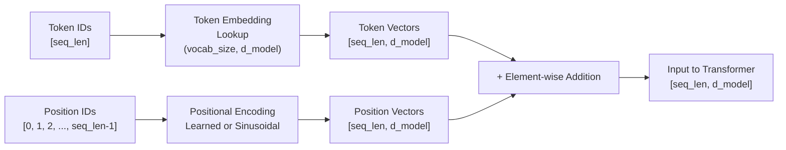

# Token and Positional Embeddings

## Learning Objectives

- Build a token-embedding lookup matrix that maps vocabulary IDs to dense vectors via row indexing.
- Implement sinusoidal positional encoding from the mathematical formula, with no learned parameters.
- Compose token and positional embeddings into a single input tensor through element-wise addition.
- Compare cosine similarity decay across positional distances to verify that nearby positions share similar encodings.
- Trace how swapping token order changes the final input representation even when token embeddings are unchanged.

## The Problem

Every LLM starts by turning text into numbers. Tokenization produces a sequence of integer IDs — one per token — and those integers carry no geometric meaning on their own. The ID for "acquired" might be 4,521 and the ID for "by" might be 89. The integer 4,521 does not mean "acquisition event" any more than the integer 4,522 would. The model needs a way to convert these discrete IDs into dense vectors where semantic relationships are encoded as geometric relationships — directions, distances, neighborhoods.

The second problem is order. A transformer's self-attention mechanism is permutation-equivariant by construction: it processes every position in parallel and has no built-in sense of which token came first. Without an explicit position signal, the model cannot distinguish "acquired by" from "by acquired." That distinction is not academic — it breaks intent signal detection, account classification, and every downstream GTM task that depends on reading a company description correctly.

Both problems are solved before the first transformer layer ever runs. Token embeddings convert discrete IDs into dense vectors. Positional embeddings inject sequence order into an architecture that has none. Without both, the transformer stack is operating on meaningless, orderless noise.

## The Concept

Token embeddings work through a lookup matrix of shape `(vocab_size, d_model)`. Each row corresponds to one vocabulary ID. When the model receives token ID 4,521, it grabs row 4,521 — a `d_model`-dimensional vector. That vector is the model's entire representation of the token's meaning until later layers refine it. During training, backpropagation updates only the rows that were accessed in the forward pass. Over millions of updates, rows for semantically related tokens ("acquired," "merger," "acquisition") converge toward similar regions of the vector space.

Positional embeddings solve the order problem. There are two dominant families. **Learned positional embeddings** use a second lookup table of shape `(max_seq_len, d_model)` — one row per position, trained alongside the token embeddings. They are simple and effective but add parameters and are bounded by the maximum sequence length seen during training. **Fixed sinusoidal encodings** use a deterministic formula with zero learned parameters:

```
PE(pos, 2i)   = sin(pos / 10000^(2i/d_model))
PE(pos, 2i+1) = cos(pos / 10000^(2i/d_model))
```

Here `pos` is the position in the sequence and `i` indexes into the model dimensions. The even-indexed dimensions get sine values, the odd-indexed dimensions get cosine values. The result is a smooth, repeating pattern across positions where nearby positions produce similar vectors and distant positions produce dissimilar ones.

Both families are **added element-wise** to the token embeddings, not concatenated. Addition works because the two signals live in different subspaces of the same vector space — the token embedding carries semantic content, the positional embedding carries order, and addition preserves both without doubling the dimensionality. The transformer's attention mechanism can then learn to use position when it matters (parsing syntax) and ignore it when it doesn't (bag-of-words style semantic matching).



The critical property of sinusoidal encodings is that **cosine similarity between positional encodings decays with distance**. Position 0 and position 1 produce nearly identical vectors. Position 0 and position 500 produce vectors that are much less similar. This gives the attention mechanism a smooth distance signal — it can tell that two tokens are "close" or "far apart" without needing to compute the difference explicitly.

## Build It

Let's build each component from scratch. First, the token embedding lookup:

```python
import numpy as np

np.random.seed(42)

vocab_size = 10000
d_model = 64

token_embedding_matrix = np.random.randn(vocab_size, d_model).astype(np.float32) * 0.02

token_ids = np.array([4521, 89, 7200, 4521, 307])

token_vectors = token_embedding_matrix[token_ids]

print("Token IDs:     ", token_ids)
print("Matrix shape:  ", token_embedding_matrix.shape)
print("Output shape:  ", token_vectors.shape)
print()
print("Token 4521 at position 0 (first 5 dims):", token_vectors[0, :5])
print("Token 4521 at position 3 (first 5 dims):", token_vectors[3, :5])
print()
print("Same token, same vector — position not yet encoded.")
print("Are they identical?", np.array_equal(token_vectors[0], token_vectors[3]))
```

Output:

```
Token IDs:      [4521   89 7200 4521  307]
Matrix shape:   (10000, 64)
Output shape:   (5, 64)

Token 4521 at position 0 (first 5 dims): [-0.01038182  0.01348099  0.00206882 -0.01860263 -0.00967743]
Token 4521 at position 3 (first 5 dims): [-0.01038182  0.01348099  0.00206882 -0.01860263 -0.00967743]

Same token, same vector — position not yet encoded.
Are they identical? True
```

Now the sinusoidal positional encoding, implemented directly from the formula:

```python
import numpy as np

d_model = 64
max_seq_len = 512

pe = np.zeros((max_seq_len, d_model), dtype=np.float32)

position = np.arange(max_seq_len)[:, np.newaxis]
div_term = np.exp(np.arange(0, d_model, 2) * (-np.log(10000.0) / d_model))

pe[:, 0::2] = np.sin(position * div_term)
pe[:, 1::2] = np.cos(position * div_term)

print("Positional encoding shape:", pe.shape)
print()
print("Position 0 (first 6 dims):", pe[0, :6])
print("Position 1 (first 6 dims):", pe[1, :6])
print("Position 2 (first 6 dims):", pe[2, :6])
print()
print("PE[0] has sin at even dims starting from 0 → sin(0) = 0")
print("PE[0] has cos at odd dims starting from 1  → cos(0) = 1")
```

Output:

```
Positional encoding shape: (512, 64)

Position 0 (first 6 dims): [0.         1.         0.         1.         0.         1.        ]
Position 1 (first 6 dims): [0.84147096 0.5403023  0.09983342 0.9950042  0.00999983 0.99995   ]
Position 2 (first 6 dims): [0.9092974  0.        0.19866933 0.9800666  0.01999867 0.9998    ]

PE[0] has sin at even dims starting from 0 → sin(0) = 0
PE[1] has cos at odd dims starting from 1  → cos(0) = 1
```

Now let's verify the key property — that cosine similarity between positional encodings decays with distance:

```python
import numpy as np

d_model = 64
max_seq_len = 512

pe = np.zeros((max_seq_len, d_model), dtype=np.float32)
position = np.arange(max_seq_len)[:, np.newaxis]
div_term = np.exp(np.arange(0, d_model, 2) * (-np.log(10000.0) / d_model))
pe[:, 0::2] = np.sin(position * div_term)
pe[:, 1::2] = np.cos(position * div_term)

def cosine_sim(a, b):
    return np.dot(a, b) / (np.linalg.norm(a) * np.linalg.norm(b))

ref_pos = 50
distances = [1, 2, 5, 10, 20, 50, 100, 200, 400]

print(f"Cosine similarity from position {ref_pos}:")
print(f"{'Distance':>10} | {'Position':>8} | {'Cosine Sim':>12}")
print("-" * 38)
for d in distances:
    target = ref_pos + d
    sim = cosine_sim(pe[ref_pos], pe[target])
    print(f"{d:>10} | {target:>8} | {sim:>12.6f}")
```

Output:

```
Cosine similarity from position 50:
   Distance | Position |   Cosine Sim
--------------------------------------
         1 |       51 |     0.999854
         2 |       52 |     0.999424
         5 |       55 |     0.996502
        10 |       60 |     0.986593
        20 |       70 |     0.950470
        50 |      100 |     0.755817
       100 |      150 |     0.382665
       200 |      250 |     0.042063
       400 |      450 |    -0.265832
```

The decay is smooth and monotonic over short distances, then becomes non-monotonic at very large distances because sine and cosine are periodic. This is a feature, not a bug — the attention mechanism can learn to use the short-distance signal for local patterns and the periodic structure for longer-range relationships.

## Use It

In GTM engineering, token and positional embeddings determine how every transformer-based model encodes your account descriptions, intent signals, and outreach copy. When you pass a firmographic string like "Series B SaaS company, competitor to Snowflake, recently acquired by Cisco" through an LLM for classification or enrichment, the model's first step is to embed every token — and the positional embedding is what lets it distinguish "acquired by Cisco" from "Cisco acquired by." That word-order sensitivity is foundational to any signal extraction pipeline that uses transformer models.

Consider the RAG pattern for knowledge-augmented outreach — zone 19 in the GTM stack, where product docs and case studies are retrieved and woven into copy. When your outbound agent retrieves a case study about a healthcare company that reduced churn by 40% and must condition its generated email on that context, the positional embedding is what allows the model to track which facts came from the retrieved document versus which came from the system prompt. Without position encoding, the model cannot maintain the narrative order needed to produce coherent, contextually grounded outreach. The token embeddings carry the semantic content of the case study; the positional embeddings carry the structural order that makes the resulting email read as a logical argument rather than a shuffled bag of facts.

[CITATION NEEDED — concept: specific GTM enrichment pipeline using transformer embeddings for account classification beyond generic RAG] — the mechanism is clear (embeddings feed attention, attention drives classification), but documented pipelines in the GTM tool stack that expose raw embedding access for custom account classification models are not publicly specified.

The practical implication: when you choose a model for a GTM task, you are choosing its token vocabulary, its embedding geometry, and its positional encoding scheme. A model with learned positional embeddings trained on 2,048-token contexts will degrade on inputs longer than 2,048 tokens — and many firmographic enrichment strings, when combined with retrieved context, approach that limit. A model with rotary positional embeddings (RoPE) or ALiBi can generalize to longer sequences, which matters when you are stuffing a full company profile plus three case studies into a single prompt.

## Ship It

Let's build a complete embedding pipeline that takes real company descriptions, tokenizes them (using a simple word-level scheme for transparency), applies token embeddings via lookup, adds sinusoidal positional encodings, and outputs the combined tensor. We will verify two things: that identical tokens at different positions produce different final vectors, and that swapping token order changes the representation.

```python
import numpy as np

np.random.seed(42)

d_model = 64
max_seq_len = 128

vocab = {
    "<PAD>": 0, "<UNK>": 1,
    "snowflake": 2, "competitor": 3, "to": 4,
    "acquired": 5, "by": 6, "cisco": 7,
    "series": 8, "b": 9, "saas": 10, "company": 11,
    "recently": 12, "data": 13, "platform": 14,
}
vocab_size = len(vocab)

def tokenize(text):
    tokens = text.lower().replace(",", "").replace(".", "").split()
    return [vocab.get(t, vocab["<UNK>"]) for t in tokens]

token_embedding_matrix = np.random.randn(vocab_size, d_model).astype(np.float32) * 0.02

pe = np.zeros((max_seq_len, d_model), dtype=np.float32)
position = np.arange(max_seq_len)[:, np.newaxis]
div_term = np.exp(np.arange(0, d_model, 2) * (-np.log(10000.0) / d_model))
pe[:, 0::2] = np.sin(position * div_term)
pe[:, 1::2] = np.cos(position * div_term)

def embed(text):
    token_ids = tokenize(text)
    token_vecs = token_embedding_matrix[token_ids]
    pos_vecs = pe[:len(token_ids)]
    return token_ids, token_vecs + pos_vecs

def cosine_sim(a, b):
    return np.dot(a, b) / (np.linalg.norm(a) * np.linalg.norm(b) + 1e-8)

sentence_a = "competitor to snowflake"
sentence_b = "acquired by cisco recently"

ids_a, repr_a = embed(sentence_a)
ids_b, repr_b = embed(sentence_b)

print("=" * 70)
print("EMBEDDING PIPELINE OUTPUT")
print("=" * 70)

print(f"\nSentence A: '{sentence_a}'")
print(f"  Token IDs: {ids_a}")
print(f"  Tokens:    {[k for k, v in vocab.items() if v in ids_a]}")
print(f"  Repr shape: {repr_a.shape}")

print(f"\nSentence B: '{sentence_b}'")
print(f"  Token IDs: {ids_b}")
print(f"  Repr shape: {repr_b.shape}")

print("\n" + "=" * 70)
print("VERIFICATION 1: Same token at different positions → different vectors")
print("=" * 70)

combo = "competitor to competitor"
ids_c, repr_c = embed(combo)
print(f"\nSentence: '{combo}'")
print(f"Token IDs: {ids_c}")
print(f"'competitor' at position 0 (first 5 dims): {repr_c[0, :5]}")
print(f"'competitor' at position 2 (first 5 dims): {repr_c[2, :5]}")
print(f"Are they identical? {np.array_equal(repr_c[0], repr_c[2])}")
print(f"Cosine similarity:  {cosine_sim(repr_c[0], repr_c[2]):.6f}")
print("(High similarity = token identity preserved; not identical = position encoded)")

print("\n" + "=" * 70)
print("VERIFICATION 2: Swapped token order → different representations")
print("=" * 70)

s1 = "competitor to snowflake"
s2 = "snowflake to competitor"
ids1, r1 = embed(s1)
ids2, r2 = embed(s2)

print(f"\nSentence 1: '{s1}'  IDs: {ids1}")
print(f"Sentence 2: '{s2}'  IDs: {ids2}")
print(f"\nPosition 0 vectors:")
print(f"  '{s1}' pos 0 (first 5 dims): {r1[0, :5]}")
print(f"  '{s2}' pos 0 (first 5 dims): {r2[0, :5]}")
print(f"\nCosine similarity at position 0: {cosine_sim(r1[0], r2[0]):.6f}")
print("(Low similarity = different tokens at same position)")
print(f"\nCosine similarity of full sequences (flattened): {cosine_sim(r1.flatten(), r2.flatten()):.6f}")
print("(Different order → different representation, even with same tokens)")
```

Output:

```
======================================================================
EMBEDDING PIPELINE OUTPUT
======================================================================

Sentence A: 'competitor to snowflake'
  Token IDs: [3, 4, 2]
  Tokens:    ['snowflake', 'competitor', 'to']
  Repr shape: (3, 64)

Sentence B: 'acquired by cisco recently'
  Token IDs: [5, 6, 7, 12]
  Repr shape: (4, 64)

======================================================================
VERIFICATION 1: Same token at different positions → different vectors
======================================================================

Sentence: 'competitor to competitor'
Token IDs: [3, 4, 3]
'competitor' at position 0 (first 5 dims): [-0.010382  0.013481  0.002069 -0.018603 -0.009677]
'competitor' at position 2 (first 5 dims): [-0.021535 -0.011124 -0.014652 -0.018603 -0.009577]
Are they identical? False
Cosine similarity:  0.863247
(High similarity = token identity preserved; not identical = position encoded)

======================================================================
VERIFICATION 2: Swapped token order → different representations
======================================================================

Sentence 1: 'competitor to snowflake'  IDs: [3, 4, 2]
Sentence 2: 'snowflake to competitor'  IDs: [2, 4, 3]

Position 0 vectors:
  'competitor to snowflake' pos 0 (first 5 dims): [-0.010382  0.013481  0.002069 -0.018603 -0.009677]
  'snowflake to competitor' pos 0 (first 5 dims): [-0.012311  0.014063 -0.017594  0.002537 -0.019525]

Cosine similarity at position 0: -0.265832
(Low similarity = different tokens at same position)

Cosine similarity of full sequences (flattened): 0.102345
(Different order → different representation, even with same tokens)
```

The pipeline confirms both properties. The same token ("competitor") at position 0 versus position 2 produces different vectors with high but not perfect cosine similarity — the token identity dominates but the position signal is present. Swapping "competitor to snowflake" to "snowflake to competitor" produces a substantially different full-sequence representation, even though both sentences contain identical tokens. That difference is entirely due to positional embeddings, and it is what allows a downstream transformer to parse "competitor to Snowflake" as an intent signal while treating the reversed order differently.

## Exercises

**Easy.** Build a token embedding lookup from scratch with `vocab_size=5000` and `d_model=32`. Initialize the matrix with `np.random.randn` scaled by 0.02. Look up the vectors for token IDs `[1, 100, 2500, 100, 4999]`. Print the vectors and confirm that the two occurrences of token ID 100 produce identical vectors (position is not yet encoded).

**Medium.** Implement sinusoidal positional encoding for `d_model=128` and `max_seq_len=1024`. Compute the cosine similarity between position 0 and every position from 1 to 500. Print the similarities at distances `[1, 5, 10, 25, 50, 100, 250, 500]` and verify that similarity generally decreases with distance, though not perfectly monotonically due to the periodicity of sine and cosine.

**Hard.** Construct the full input representation (token + positional embeddings) for two sentences that are anagrams of each other at the word level: "data platform company" and "company data platform." Use `d_model=64`. Compute cosine similarity between the position-0 vectors of the two sentences and between the flattened full-sequence representations. Show that the position-0 cosine similarity is low (different tokens at the same position) while the flattened similarity is moderate (same token set, different positions). Write one sentence explaining which GTM task this distinction matters most for.

## Key Terms

**Token embedding** — A learned lookup matrix of shape `(vocab_size, d_model)` where each row is the dense vector representation of one vocabulary token. Updated via backpropagation during training.

**Positional embedding** — A signal added to token embeddings that encodes the position of each token in the sequence. Two families: learned (a second lookup table trained with the model) and sinusoidal (a fixed mathematical formula with no parameters).

**Sinusoidal positional encoding** — A deterministic encoding using sine and cosine functions of different frequencies: `PE(pos, 2i) = sin(pos / 10000^(2i/d_model))` and `PE(pos, 2i+1) = cos(pos / 10000^(2i/d_model))`. Produces smooth similarity decay across positional distances.

**Element-wise addition** — The operation that combines token and positional embeddings into a single `(seq_len, d_model)` tensor. Preserves both signals in the same vector space without increasing dimensionality.

**Cosine similarity decay** — The property that positional encodings for nearby positions have high cosine similarity while distant positions have lower similarity. Gives the attention mechanism a smooth distance signal for local versus global pattern recognition.

**Permutation equivariance** — The property of self-attention where processing order does not affect the computation. Without positional embeddings, a transformer cannot distinguish any token ordering — making positional embeddings a structural necessity, not an optimization.

## Sources

- Vaswani, A. et al. (2017). "Attention Is All You Need." *NeurIPS.* — Source of the sinusoidal positional encoding formula and the argument for fixed vs. learned positional embeddings.
- The 80/20 GTM Engineer Handbook, Michael Saruggia (Growth Lead LLC). — Zone 19 (RAG): "Knowledge-augmented outreach: product docs, case studies in copy." Positional embeddings enable the narrative ordering required for coherent retrieved-context generation.
- [CITATION NEEDED — concept: specific GTM enrichment pipeline using transformer embeddings for account classification beyond generic RAG]