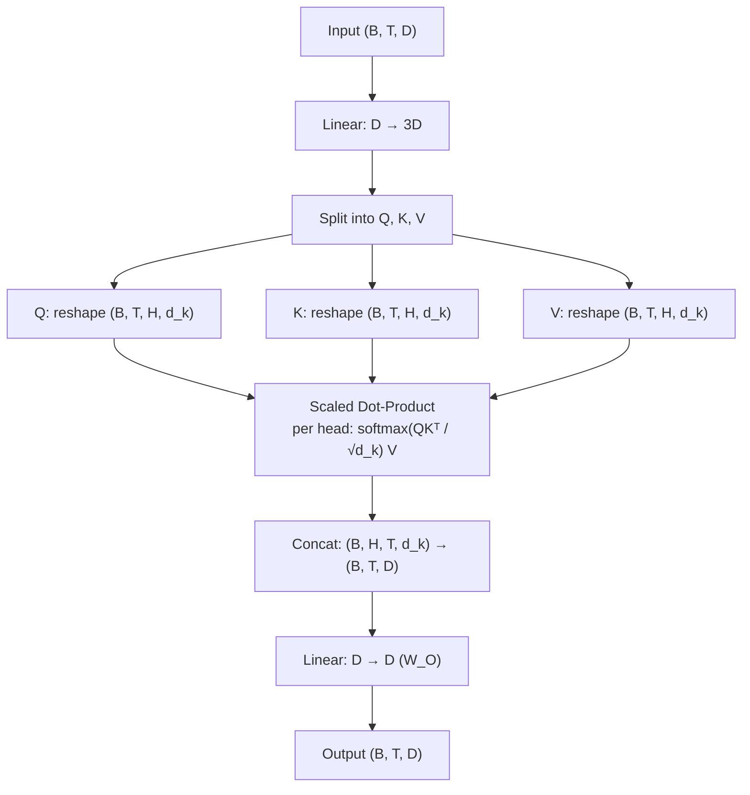

# Lesson: Multi-Head Self-Attention

## Learning Objectives

1. Implement multi-head self-attention from raw linear projections in Python, including the reshape-split-transpose pattern for parallel heads.
2. Compare single-head versus multi-head attention output distributions on the same input sequence.
3. Trace the shape transformations from input through Q/K/V projection, head splitting, scaled dot-product attention, concatenation, and output projection.
4. Diagnose the effect of head count on attention pattern diversity for a fixed embedding dimension.
5. Configure multi-head attention parameters (`num_heads`, `d_model`, `d_k`) with a causal mask for decoder-style autoregressive generation.

---

## The Problem

A single attention head computes one set of Query, Key, and Value projections from the input, producing one attention distribution per position. That single distribution must simultaneously encode syntactic proximity, semantic similarity, positional ordering, and coreference — and it cannot. You get a weighted average of all relationship types competing for the same representational bandwidth, instead of distinct patterns. The result is that no single relationship is captured cleanly.

Consider what happens when a model processes a sentence like "The CSM who closed Acme last quarter also handles Globex." Position 2 ("CSM") relates to position 1 ("The") via determiner agreement, to position 5 ("closed") via subject-verb relationship, to position 6 ("Acme") via implicit role, and to position 10 ("handles") via the coreference resolution with "also." A single attention head forced to express all four relationships produces a distribution that smears across all relevant positions. The signal for any one relationship is diluted by the others.

Multi-head self-attention addresses this by running `h` independent attention computations in parallel, each with its own learned projection matrices. The outputs are concatenated and re-projected. Each head can specialize in a different relational pattern — one might learn local adjacency, another might track entity mentions, another might attend to verb arguments — without competing for the same subspace. The cost is nearly identical to single-head attention at the same total dimension; the gain is representational diversity.

---

## The Concept

A single attention head computes `softmax(QKᵀ / √d_k) V`, where Q, K, and V are projected from the same input via learned weight matrices. Multi-head attention replicates this computation `h` times in parallel. Each head `i` has its own weight matrices `W_Q^i`, `W_K^i`, `W_V^i`, producing `head_i = softmax(Q_i K_iᵀ / √d_k) V_i`. The outputs concatenate along the feature dimension: `MultiHead = Concat(head_1, ..., head_h) W_O`. The constraint is that `d_model` must be divisible by `h`, giving `d_k = d_model / h`. You are running `h` small attention problems instead of one large one — the total FLOPs are approximately the same, but each head operates on a different learned slice of the representation.

The efficient implementation uses a single linear layer projecting from `d_model` to `3 × d_model`, then splits the output into Q, K, and V. Each of those is reshaped from `(B, T, d_model)` into `(B, T, h, d_k)` and transposed to `(B, h, T, d_k)`, so the batch dimension `h` lets all heads run their scaled dot-product attention as one batched tensor operation. After attention, the heads are transposed back and reshaped to `(B, T, d_model)`, then multiplied by the output projection `W_O`.

The scaling factor `√d_k` matters because dot products grow in magnitude with dimension. Without normalization, larger `d_k` values push the softmax input into regions where gradients vanish — the distribution becomes near-one-hot, and the head stops learning. Dividing by `√d_k` keeps the pre-softmax scores in a range where gradients flow. When you increase the head count `h`, `d_k` decreases, and the scaling factor shrinks. This is not a bug; it is the mechanism that keeps attention learnable across different head configurations.



The multi-head structure also connects to retrieval-augmented generation in go-to-market systems. Zone 19 of the GTM stack maps RAG to knowledge-augmented outreach, where product docs and case studies are injected into generated copy [CITATION NEEDED — concept: Zone 19 RAG mapping, source: gtm-topic-map.md]. The transformer model underlying that RAG pipeline uses multi-head attention to weigh different parts of the retrieved context simultaneously. One head might attend to the product feature list in the retrieved chunk; another might attend to the case study metrics; another might attend to the tone signals from the prompt. The concatenation-and-reprojection step fuses these views into a single output token distribution. Without multiple heads, the model would average across all retrieved information and produce generic copy. With them, it can selectively emphasize the most relevant slice of context for each generated token.

---

## Build It

Build the attention block from raw linear layers. Start with single-head attention as the baseline, then implement multi-head self-attention with the reshape-split-transpose pattern. Both classes return the output tensor and the attention weights so you can inspect what each head actually attends to.

```python
import math
import torch
import torch.nn as nn
import torch.nn.functional as F

torch.manual_seed(42)

class SingleHeadAttention(nn.Module):
    def __init__(self, d_model):
        super().__init__()
        self.d_model = d_model
        self.W_q = nn.Linear(d_model, d_model)
        self.W_k = nn.Linear(d_model, d_model)
        self.W_v = nn.Linear(d_model, d_model)

    def forward(self, x, mask=None):
        B, T, D = x.shape
        q = self.W_q(x)
        k = self.W_k(x)
        v = self.W_v(x)
        scores = torch.matmul(q, k.transpose(-2, -1)) / math.sqrt(D)
        if mask is not None:
            scores = scores.masked_fill(mask == 0, float('-inf'))
        attn = F.softmax(scores, dim=-1)
        out = torch.matmul(attn, v)
        return out, attn

class MultiHeadSelfAttention(nn.Module):
    def __init__(self, d_model, num_heads):
        super().__init__()
        assert d_model % num_heads == 0, (
            f"d_model ({d_model}) must be divisible by num_heads ({num_heads})"
        )
        self.d_model = d_model
        self.num_heads = num_heads
        self.d_k = d_model // num_heads
        self.W_qkv = nn.Linear(d_model, 3 * d_model)
        self.W_o = nn.Linear(d_model, d_model)

    def forward(self, x, mask=None):
        B, T, D = x.shape
        qkv = self.W_qkv(x)
        q, k, v = qkv.chunk(3, dim=-1)
        q = q.view(B, T, self.num_heads, self.d_k).transpose(1, 2)
        k = k.view(B, T, self.num_heads, self.d_k).transpose(1, 2)
        v = v.view(B, T, self.num_heads, self.d_k).transpose(1, 2)
        scores = torch.matmul(q, k.transpose(-2, -1)) / math.sqrt(self.d_k)
        if mask is not None:
            scores = scores.masked_fill(mask == 0, float('-inf'))
        attn = F.softmax(scores, dim=-1)
        out = torch.matmul(attn, v)
        out = out.transpose(1, 2).contiguous().view(B, T, D)
        out = self.W_o(out)
        return out, attn

d_model = 64
seq_len = 8
batch_size = 2

x = torch.randn(batch_size, seq_len, d_model)

single = SingleHeadAttention(d_model)
out_s, attn_s = single(x)
print(f"Single-head output: {out_s.shape}")
print(f"Single-head attention: {attn_s.shape}")
print(f"Single-head params: {sum(p.numel() for p in single.parameters())}")

num_heads = 8
multi = MultiHeadSelfAttention(d_model, num_heads)
out_m, attn_m = multi(x)
print(f"\nMulti-head output: {out_m.shape}")
print(f"Multi-head attention: {attn_m.shape}  (B, H, T, T)")
print(f"d_k per head: {multi.d_k}")
print(f"Multi-head params: {sum(p.numel() for p in multi.parameters())}")

print(f"\nSingle-head attention row 0 (position 0 attends to):")
print(attn_s[0, 0].detach().numpy().round(3))

print(f"\nMulti-head attention, position 0, first 3 heads:")
for h in range(3):
    print(f"  Head {h}: {attn_m[0, h, 0].detach().numpy().round(3)}")
```

This prints the shapes at each stage and the raw attention distributions for the first position across three heads. The distributions differ because each head's projection matrices are initialized independently and learned independently. Even at initialization — before any training — the heads start from different random subspaces.

Now add the causal mask. A decoder-only model generates tokens left to right, so position `t` must not attend to positions `t+1` through `T`. The mask is a lower-triangular matrix of ones, applied before softmax by setting masked scores to negative infinity.

```python
def make_causal_mask(seq_len, device='cpu'):
    return torch.tril(torch.ones(seq_len, seq_len, device=device))

mask = make_causal_mask(seq_len)
print(f"Causal mask ({seq_len}x{seq_len}):")
print(mask.int())

out_masked, attn_masked = multi(x, mask=mask)
print(f"\nMasked output shape: {out_masked.shape}")

print(f"\nHead 0 attention with causal mask:")
print(attn_masked[0, 0].detach().numpy().round(3))

future_leak = attn_masked[0, 0, :, :].triu(1).abs().max().item()
print(f"\nMax attention weight on future positions: {future_leak}")
print("Should be 0.0 — no leakage to future tokens.")
```

The mask zeros out the upper triangle of the attention matrix. Position 0 attends only to position 0. Position 3 attends to positions 0 through 3. The last row is fully populated because the last position can see everything. The `future_leak` check confirms that no attention weight leaks above the diagonal — it should print exactly `0.0`.

---

## Use It

Multi-head attention's parallel heads each learn different relationship patterns across the same token sequence. In a RAG pipeline for knowledge-augmented outreach — Zone 19 in the GTM stack, where product docs and case studies are injected into generated copy [CITATION NEEDED — concept: Zone 19 RAG, source: gtm-topic-map.md] — the transformer model uses those heads to weigh different parts of the retrieved context simultaneously. One head might pull from the product feature section; another from the case study metrics; another from the tone instructions in the prompt. This section inspects per-head attention patterns on a concrete input to see that specialization emerge.

Run a small training loop on a toy task that forces head specialization. The task: given a sequence of embeddings, predict the value at a specific "key position." The model must learn which positions to attend to, and different heads should pick up different positional patterns.

```python
torch.manual_seed(0)

d_model = 32
seq_len = 10
num_heads = 4

mha = MultiHeadSelfAttention(d_model, num_heads)
W_readout = nn.Linear(d_model, 1)
optimizer = torch.optim.Adam(
    list(mha.parameters()) + list(W_readout.parameters()), lr=0.01
)

x_data = torch.randn(200, seq_len, d_model)
y_data = x_data[:, 3, :1].squeeze(-1)

for epoch in range(300):
    optimizer.zero_grad()
    out, attn = mha(x_data)
    pred = W_readout(out[:, 0, :]).squeeze(-1)
    loss = F.mse_loss(pred, y_data)
    loss.backward()
    optimizer.step()
    if epoch % 100 == 0:
        print(f"Epoch {epoch:3d}  loss={loss.item():.6f}")

print(f"\nFinal loss: {loss.item():.6f}")

with torch.no_grad():
    _, attn_final = mha(x_data[:1])
    print(f"\nAttention weights — Position 0 attending to all positions:")
    print(f"(Target: position 3 should dominate)\n")
    for h in range(num_heads):
        weights = attn_final[0, h, 0].numpy().round(3)
        peak = weights.argmax()
        print(f"  Head {h}: peak