# Transformer Block from Scratch

## Learning Objectives

1. Implement a single transformer encoder block as composable sublayers: multi-head attention, feed-forward network, residual connections, and layer normalization.
2. Trace a tensor through each sublayer and print intermediate shapes to verify the data flow matches the expected dimensions at every stage.
3. Compare pre-norm vs. post-norm architectures by running identical inputs through both variants and measuring activation magnitude differences.
4. Diagnose which sublayer causes a dimensional mismatch given a printed error and shape trace.
5. Configure multi-head attention hyperparameters (`n_heads`, `d_model`, `d_ff`) and predict their effect on output shape and parameter count.

## The Problem

Every modern LLM you interact with — whether through OpenAI's API, Anthropic's Claude, or a Clay enrichment waterfall — is built from the same repeating unit: the transformer block. GPT-4 stacks roughly 120 of them. BERT stacks 12. Llama 3 stacks 32. The count varies, but the mechanism inside each block is identical. If you build one block correctly, you have built the structural unit of essentially every production language model.

The two failure modes that show up when learners stack these blocks naively are not exotic edge cases. The first is attention attending to positions it should not see (future tokens in a decoder). The second is layer normalization placed where it cannot control the residual signal as depth increases. Both produce the same symptom: the model diverges during training, or it requires learning rate warmup hacks to survive the first few hundred steps. The fix is mechanical. The block has exactly two residual paths and exactly two normalization positions. Get those right and the rest is bookkeeping.

The reason this matters for your GTM stack is direct. When you write a Clay enrichment formula that feeds a company description into an LLM and asks it to extract growth-stage signals, the text passes through a stack of these blocks. Each block refines the representation by letting every token attend to every other token, then passing that through a feed-forward layer. Understanding the internal mechanics does not make you a better prompt writer in any immediate sense — but it does let you reason about why the model handles long inputs differently than short ones, why certain tokens dominate the output, and why the model sometimes hallucinates facts that were never in the input.

## The Concept

A transformer block takes a tensor of shape `[batch, seq_len, d_model]` and returns a tensor of the same shape. Inside, it runs two sublayers: multi-head self-attention and a position-wise feed-forward network. Each sublayer is wrapped by a residual connection and a layer normalization. The ordering of the normalization relative to the sublayer is the single most consequential architectural choice in the block.

**Multi-head self-attention** computes pairwise relationships between all positions in the sequence. The input is projected three times into query, key, and value matrices. Attention scores are computed as the dot product of queries and keys, scaled by `1/sqrt(d_k)`, passed through softmax, and used to weight the values. Multiple heads run this computation in parallel on different slices of the embedding dimension, each learning a different relationship pattern — one head might attend to syntactic dependencies, another to coreference, another to positional proximity. The heads are concatenated and projected back to `d_model`.

**Residual connections** add the sublayer input directly to the sublayer output. This creates a gradient highway that allows signals from the loss function to propagate to early layers without being attenuated by repeated matrix multiplications. Without residual connections, a 12-layer stack becomes effectively untrainable because gradients vanish or explode through the chain of matrix products. With residuals, each block only needs to learn a delta — the difference between its input and its desired output — which is a much easier optimization landscape.

**Layer normalization** normalizes across the feature dimension (`d_model`) for each token independently. This stabilizes activation magnitudes so that deep stacks do not produce wildly scaling values. The critical architectural choice is *where* to place it. In **post-norm** (the original Transformer paper), normalization happens after the residual addition: `LayerNorm(x + Sublayer(x))`. In **pre-norm** (used by GPT-2, Llama, and most modern architectures), normalization happens before the sublayer: `x + Sublayer(LayerNorm(x))`. Pre-norm trains more stably at depth because the residual path carries the un-normalized signal directly through the stack, preserving gradient flow. Post-norm requires learning rate warmup to avoid early-training instability.

**Feed-forward network (FFN)** is two linear projections with a nonlinearity between them, applied to each position independently. The hidden dimension `d_ff` is typically 4× `d_model`. The FFN is where the model stores parametric knowledge — each token's representation is transformed through a learned key-value lookup implemented by the two linear layers [CITATION NEEDED — concept: FFN as key-value memory, Geva et al. 2021]. When an LLM "knows" that Paris is the capital of France, that association lives in the FFN weights, not in the attention weights.

```mermaid
flowchart TD
    subgraph Pre-Norm Block
        A1[x input] --> B1[LayerNorm]
        B1 --> C1[Multi-Head Attention]
        A1 --> D1[add: residual]
        C1 --> D1
        D1 --> E1[LayerNorm]
        E1 --> F1[Feed-Forward Network]
        D1 --> G1[add: residual]
        F1 --> G1
        G1 --> H1[output]
    end

    subgraph Post-Norm Block
        A2[x input] --> B2[Multi-Head Attention]
        A2 --> C2[add: residual]
        B2 --> C2
        C2 --> D2[LayerNorm]
        D2 --> E2[Feed-Forward Network]
        D2 --> F2[add: residual]
        E2 --> F2
        F2 --> G2[LayerNorm]
        G2 --> H2[output]
    end
```



The diagram above shows the two orderings side by side. Notice that in pre-norm, the residual connection is a clean wire from input to output — nothing touches it except addition. In post-norm, the LayerNorm sits on the residual path itself, which means it can distort the gradient signal flowing backward through the stack.

## Build It

We will build both variants — pre-norm and post-norm — in the same script, run an identical input tensor through both, and print the shape and activation statistics at every sublayer. This lets you see exactly where the two architectures diverge.

```python
import torch
import torch.nn as nn
import torch.nn.functional as F
import math

class MultiHeadAttention(nn.Module):
    def __init__(self, d_model, n_heads, causal=False):
        super().__init__()
        assert d_model % n_heads == 0, f"d_model ({d_model}) must be divisible by n_heads ({n_heads})"
        self.d_model = d_model
        self.n_heads = n_heads
        self.d_k = d_model // n_heads
        self.causal = causal
        self.q_proj = nn.Linear(d_model, d_model, bias=False)
        self.k_proj = nn.Linear(d_model, d_model, bias=False)
        self.v_proj = nn.Linear(d_model, d_model, bias=False)
        self.out_proj = nn.Linear(d_model, d_model, bias=False)

    def forward(self, x):
        B, S, D = x.shape
        q = self.q_proj(x).view(B, S, self.n_heads, self.d_k).transpose(1, 2)
        k = self.k_proj(x).view(B, S, self.n_heads, self.d_k).transpose(1, 2)
        v = self.v_proj(x).view(B, S, self.n_heads, self.d_k).transpose(1, 2)

        scores = torch.matmul(q, k.transpose(-2, -1)) / math.sqrt(self.d_k)

        if self.causal:
            mask = torch.triu(torch.ones(S, S, device=x.device), diagonal=1).bool()
            scores = scores.masked_fill(mask, float('-inf'))

        attn_weights = F.softmax(scores, dim=-1)
        attn_output = torch.matmul(attn_weights, v)
        attn_output = attn_output.transpose(1, 2).contiguous().view(B, S, D)
        return self.out_proj(attn_output)


class FeedForward(nn.Module):
    def __init__(self, d_model, d_ff):
        super().__init__()
        self.fc1 = nn.Linear(d_model, d_ff)
        self.fc2 = nn.Linear(d_ff, d_model)

    def forward(self, x):
        return self.fc2(F.gelu(self.fc1(x)))


class PreNormBlock(nn.Module):
    def __init__(self, d_model, n_heads, d_ff, causal=False):
        super().__init__()
        self.norm1 = nn.LayerNorm(d_model)
        self.attn = MultiHeadAttention(d_model, n_heads, causal=causal)
        self.norm2 = nn.LayerNorm(d_model)
        self.ffn = FeedForward(d_model, d_ff)

    def forward(self, x):
        original_shape = x.shape
        normed = self.norm1(x)
        attn_out = self.attn(normed)
        x = x + attn_out
        print(f"  After attention+residual: shape={x.shape}, mean={x.mean().item():.4f}, std={x.std().item():.4f}")

        normed2 = self.norm2(x)
        ffn_out = self.ffn(normed2)
        x = x + ffn_out
        print(f"  After FFN+residual:       shape={x.shape}, mean={x.mean().item():.4f}, std={x.std().item():.4f}")

        return x


class PostNormBlock(nn.Module):
    def __init__(self, d_model, n_heads, d_ff, causal=False):
        super().__init__()
        self.attn = MultiHeadAttention(d_model, n_heads, causal=causal)
        self.norm1 = nn.LayerNorm(d_model)
        self.ffn = FeedForward(d_model, d_ff)
        self.norm2 = nn.LayerNorm(d_model)

    def forward(self, x):
        attn_out = self.attn(x)
        x = self.norm1(x + attn_out)
        print(f"  After attention+residual+norm: shape={x.shape}, mean={x.mean().item():.4f}, std={x.std().item():.4f}")

        ffn_out = self.ffn(x)
        x = self.norm2(x + ffn_out)
        print(f"  After FFN+residual+norm:       shape={x.shape}, mean={x.mean().item():.4f}, std={x.std().item():.4f}")

        return x


d_model = 64
n_heads = 4
d_ff = 256
seq_len = 16
batch_size = 2

torch.manual_seed(42)
x = torch.randn(batch_size, seq_len, d_model)

print("=" * 60)
print("PRE-NORM BLOCK")
print("=" * 60)
prenorm = PreNormBlock(d_model, n_heads, d_ff, causal=True)
print(f"Input: shape={x.shape}, mean={x.mean().item():.4f}, std={x.std().item():.4f}")
out_pre = prenorm(x)
print(f"Output: shape={out_pre.shape}")
print(f"Pre-norm param count: {sum(p.numel() for p in prenorm.parameters()):,}")

print()
print("=" * 60)
print("POST-NORM BLOCK")
print("=" * 60)
postnorm = PostNormBlock(d_model, n_heads, d_ff, causal=True)
print(f"Input: shape={x.shape}, mean={x.mean().item():.4f}, std={x.std().item():.4f}")
out_post = postnorm(x)
print(f"Output: shape={out_post.shape}")
print(f"Post-norm param count: {sum(p.numel() for p in postnorm.parameters()):,}")

print()
print("=" * 60)
print("DIFFERENCE BETWEEN VARIANTS")
print("=" * 60)
diff = (out_pre - out_post).abs()
print(f"Mean absolute difference: {diff.mean().item():.4f}")
print(f"Max absolute difference:  {diff.max().item():.4f}")
print(f"Pre-norm output std:      {out_pre.std().item():.4f}")
print(f"Post-norm output std:     {out_post.std().item():.4f}")

print()
print("=" * 60)
print("ATTENTION WEIGHT INSPECTION")
print("=" * 60)
B, S, D = x.shape
q = prenorm.attn.q_proj(x).view(B, S, n_heads, d_model // n_heads).transpose(1, 2)
k = prenorm.attn.k_proj(x).view(B, S, n_heads, d_model // n_heads).transpose(1, 2)
scores = torch.matmul(q, k.transpose(-2, -1)) / math.sqrt(d_model // n_heads)
mask = torch.triu(torch.ones(S, S), diagonal=1).bool()
scores_masked = scores.masked_fill(mask, float('-inf'))
attn_weights = F.softmax(scores_masked, dim=-1)

print(f"Attention weights shape: {attn_weights.shape}")
print(f"Head 0, batch 0, token 0 attends to first 5 tokens: {attn_weights[0, 0, 0, :5].tolist()}")
print(f"Head 0, batch 0, token 15 attention sum: {attn_weights[0, 0, 15, :].sum().item():.4f}")
print(f"Head 1, batch 0, token 15 top-3 attended positions: {attn_weights[0, 1, 15, :].topk(3).indices.tolist()}")
```

Run this and you will see both variants process the same input, produce the same output shape, but diverge in activation statistics. The post-norm variant produces smaller output std because the final LayerNorm compresses the activation range. The pre-norm variant preserves more of the residual signal's magnitude because LayerNorm only touches the sublayer input, not the residual path itself.

The attention weight inspection at the end shows what the causal mask actually does: token 15 can attend to all 16 positions, but token 0 can only attend to itself. The softmax distribution over allowed positions tells you which tokens each head finds most relevant.

## Use It

The transformer block you just built is the same mechanism that processes text inside every LLM call in a Clay waterfall enrichment step. When you configure a Clay enrichment column that sends a company description to an LLM with a prompt like "extract the funding stage and growth signals," the text is tokenized, embedded, and passed through a stack of these blocks. The multi-head attention layer is specifically what allows the model to connect "Series B" in sentence 3 of a company description to "hiring 5 SDRs" in sentence 7 and infer that the company is in a growth phase. Each attention head learns a different cross-position relationship pattern, and the FFN layers store the parametric knowledge that maps those patterns to the output format you requested.

This maps directly to Zone 1 (Signal Capture & Enrichment) in the GTM stack. The enrichment waterfall — whether it pulls from Storeleads for e-commerce company data, from HG Insights for tech stack signals, or from scraped public pages for smaller companies — eventually funnels text into an LLM for classification and extraction. That LLM is a stack of transformer blocks. The quality of your enrichment output is bounded by what those blocks can compute, which is bounded by the architecture choices we just examined: how many heads, how many layers, pre-norm vs. post-norm, and the FFN expansion ratio.

The practical implication for GTM engineering is this: when enrichment produces a wrong classification — say, tagging a company as "enterprise" when it is clearly mid-market based on the description — the failure happened inside one of these blocks. The attention layer may have attended to the wrong tokens (weighting "Fortune 500 client" in a case study more heavily than "50 employees" in the about page), or the FFN may not have the right parametric knowledge to map "50 employees" to "mid-market." You cannot debug this at the block level from inside Clay, but understanding the mechanism tells you what to change in your prompt to steer attention toward the right tokens.

Here is a script that demonstrates how the number of attention heads changes what the block can represent, using the same input text concept but with synthetic embeddings to keep it runnable without a tokenizer:

```python
import torch
import torch.nn as nn
import math
import torch.nn.functional as F

class MultiHeadAttention(nn.Module):
    def __init__(self, d_model, n_heads, causal=False):
        super().__init__()
        self.d_model = d_model
        self.n_heads = n_heads
        self.d_k = d_model // n_heads
        self.causal = causal
        self.q_proj = nn.Linear(d_model, d_model, bias=False)
        self.k_proj = nn.Linear(d_model, d_model, bias=False)
        self.v_proj = nn.Linear(d_model, d_model, bias=False)
        self.out_proj = nn.Linear(d_model, d_model, bias=False)

    def get_attention_weights(self, x):
        B, S, D = x.shape
        q = self.q_proj(x).view(B, S, self.n_heads, self.d_k).transpose(1, 2)
        k = self.k_proj(x).view(B, S, self.n_heads, self.d_k).transpose(1, 2)
        scores = torch.matmul(q, k.transpose(-2, -1)) / math.sqrt(self.d_k)
        if self.causal:
            mask = torch.triu(torch.ones(S, S, device=x.device), diagonal=1).bool()
            scores = scores.masked_fill(mask, float('-inf'))
        return F.softmax(scores, dim=-1)

    def forward(self, x):
        weights = self.get_attention_weights(x)
        B, S, D = x.shape
        v = self.v_proj(x).view(B, S, self.n_heads, self.d_k).transpose(1, 2)
        out = torch.matmul(weights, v)
        out = out.transpose(1, 2).contiguous().view(B, S, D)
        return self.out_proj(out)

torch.manual_seed(42)
d_model = 64
seq_len = 12
batch = 1
x = torch.randn(batch, seq_len, d_model)

configs = [(1, "1 head: all dimensions in one pattern"),
           (2, "2 heads: split into 2 pattern types"),
           (4, "4 heads: split into 4 pattern types"),
           (8, "8 heads: split into 8 pattern types")]

print("Effect of head count on attention pattern diversity")
print("=" * 65)

for n_heads, label in configs:
    attn = MultiHeadAttention(d_model, n_heads, causal=True)
    weights = attn.get_attention_weights(x)

    last_token_weights = weights[0, :, -1, :]

    entropy = -(last_token_weights * (last_token_weights + 1e-10).log()).sum(dim=-1)

    focused = (last_token_weights.max(dim=-1).values > 0.3).sum().item()
    diffuse = (last_token_weights.max(dim=-1).values < 0.15).sum().item()

    print(f"\n{label}")
    print(f"  Per-head d_k: {d_model // n_heads}")
    print(f"  Mean entropy across heads: {entropy.mean().item():.4f} bits")
    print(f"  Heads focused (max weight > 0.3): {focused}/{n_heads}")
    print(f"  Heads diffuse (max weight < 0.15): {diffuse}/{n_heads}")
    print(f"  Head 0 top-3 attended for last token: {last_token_weights[0].topk(3).indices.tolist()}")

print("\n" + "=" * 65)
print("Parameter count by head configuration")
print("=" * 65)
for n_heads, _ in configs:
    attn = MultiHeadAttention(d_model, n_heads, causal=True)
    params = sum(p.numel() for p in attn.parameters())
    print(f"  {n_heads} heads: {params:,} params (unchanged — head count does not affect param count)")
```

The output shows that changing the number of heads does not change the parameter count — the projection matrices are always `d_model × d_model` regardless of how many ways you slice the output. What changes is the *capacity to represent different relationship patterns simultaneously*. More heads means each head operates on a smaller slice of the embedding (`d_k` decreases), which means each head can specialize on a narrower pattern but has less information per pattern. Fewer heads means each head sees more of the embedding but there are fewer parallel patterns. This is why production models typically use 8–32 heads: enough parallelism to capture diverse patterns, with enough `d_k` per head to not lose information.

## Ship It

Now we stack the blocks to verify they hold together at depth, and we test the one diagnostic skill that matters when a stack fails: finding the sublayer that broke. This is the same diagnostic reasoning you need when an enrichment pipeline returns garbage — you trace the data flow to find where the signal was lost.

```python
import torch
import torch.nn as nn
import math
import torch.nn.functional as F

class MultiHeadAttention(nn.Module):
    def __init__(self, d_model, n_heads, causal=False):
        super().__init__()
        self.d_model = d_model
        self.n_heads = n_heads
        self.d_k = d_model // n_heads
        self.causal = causal
        self.q_proj = nn.Linear(d_model, d_model, bias=False)
        self.k_proj = nn.Linear(d_model, d_model, bias=False)
        self.v_proj = nn.Linear(d_model, d_model, bias=False)
        self.out_proj = nn.Linear(d_model, d_model, bias=False)

    def forward(self, x):
        B, S, D = x.shape
        q = self.q_proj(x).view(B, S, self.n_heads, self.d_k).transpose(1, 2)
        k = self.k_proj(x).view(B, S, self.n_heads, self.d_k).transpose(1, 2)
        v = self.v_proj(x).view(B, S, self.n_heads, self.d_k).transpose(1, 2)
        scores = torch.matmul(q, k.transpose(-2, -1)) / math.sqrt(self.d_k)
        if self.causal:
            mask = torch.triu(torch.ones(S, S, device=x.device), diagonal=1).bool()
            scores = scores.masked_fill(mask, float('-inf'))
        weights = F.softmax(scores, dim=-1)
        out = torch.matmul(weights, v).transpose(1, 2).contiguous().view(B, S, D)
        return self.out_proj(out)

class FeedForward(nn.Module):
    def __init__(self, d_model, d_ff):
        super().__init__()
        self.fc1 = nn.Linear(d_model, d_ff)
        self.fc2 = nn.Linear(d_ff, d_model)
    def forward(self, x):
        return self.fc2(F.gelu(self.fc1(x)))

class PreNormBlock(nn.Module):
    def __init__(self, d_model, n_heads, d_ff, causal=False):
        super().__init__()
        self.norm1 = nn.LayerNorm(d_model)
        self.attn = MultiHeadAttention(d_model, n_heads, causal=causal)
        self.norm2 = nn.LayerNorm(d_model)
        self.ffn = FeedForward(d_model, d_ff)
    def forward(self, x):
        x = x + self.attn(self.norm1(x))
        x = x + self.ffn(self.norm2(x))
        return x

class PostNormBlock(nn.Module):
    def __init__(self, d_model, n_heads, d_ff, causal=False):
        super().__init__()
        self.attn = MultiHeadAttention(d_model, n_heads, causal=causal)
        self.norm1 = nn.LayerNorm(d_model)
        self.ffn = FeedForward(d_model, d_ff)
        self.norm2 = nn.LayerNorm(d_model)
    def forward(self, x):
        x = self.norm1(x + self.attn(x))
        x = self.norm2(x + self.ffn(x))
        return x

class TransformerStack(nn.Module):
    def __init__(self, block_class, n_layers, d_model, n_heads, d_ff, causal=False):
        super().__init__()
        self.layers = nn.ModuleList([
            block_class(d_model, n_heads, d_ff, causal=causal)
            for _ in range(n_layers)
        ])
    def forward(self, x):
        for i, layer in enumerate(self.layers):
            before_std = x.std().item()
            x = layer(x)
            after_std = x.std().item()
            if i < 3 or i == len(self.layers) - 1:
                print(f"  Layer {i:2d}: std before={before_std:.4f}, std after={after_std:.4f}, ratio={after_std/before_std:.4f}")
        return x

d_model = 128
n_heads = 8
d_ff = 512
seq_len = 32
batch = 4
n_layers = 12

torch.manual_seed(42)
x = torch.randn(batch, seq_len, d_model)

print("=" * 60)
print("PRE-NORM STACK: 12 layers")
print("=" * 60)
stack_pre = TransformerStack(PreNormBlock, n_layers, d_model, n_heads, d_ff, causal=True)
out_pre = stack_pre(x)
print(f"Final output std: {out_pre.std().item():.4f}")
print(f"Input std:        {x.std().item():.4f}")
print(f"Ratio:            {out_pre.std().item() / x.std().item():.4f}")

print()
print("=" * 60)
print("POST-NORM STACK: 12 layers")
print("=" * 60)
stack_post = TransformerStack(PostNormBlock, n_layers, d_model, n_heads, d_ff, causal=True)
out_post = stack_post(x)
print(f"Final output std: {out_post.std().item():.4f}")
print(f"Input std:        {x.std().item():.4f}")
print(f"Ratio:            {out_post.std().item() / x.std().item():.4f}")

print()
print("=" * 60)
print("TOTAL PARAMETER COUNTS")
print("=" * 60)
pre_params = sum(p.numel() for p in stack_pre.parameters())
post_params = sum(p.numel() for p in stack_post.parameters())
print(f"Pre-norm 12-layer stack:  {pre_params:,} params")
print(f"Post-norm 12-layer stack: {post_params:,} params")
print(f"Per-block param count:    {pre_params // n_layers:,}")

print()
print("=" * 60)
print("DIMENSION MISMATCH DIAGNOSTIC")
print("=" * 60)

def diagnose_shape_error(error_msg, expected_shapes):
    print(f"Error: {error_msg}")
    print(f"Expected shape progression: {expected_shapes}")
    if "size mismatch" in error_msg.lower() or "mat1 and mat2" in error_msg.lower():
        print("Diagnosis: Linear layer received wrong input dimension.")
        print("  Check that d_model matches across attention output and FFN input.")
        print("  Check that the residual connection adds tensors of the same shape.")
    elif "expected size" in error_msg.lower():
        print("Diagnosis: Tensor reshape failed — head count does not divide d_model.")
        print("  Check that d_model % n_heads == 0.")
    else:
        print("Diagnosis: Unknown error type. Print shapes at each sublayer to isolate.")

diagnose_shape_error(
    "mat1 and mat2 shapes cannot be multiplied (4x32x128 and 256x128)",
    {"after attention": [4, 32, 128], "FFN expects": [*, 128], "FFN fc1 weight": [256, 128]}
)

print()
print("=" * 60)
print("GRADIENT FLOW CHECK")
print("=" * 60)
x_grad = torch.randn(batch, seq_len, d_model, requires_grad=True)

out = stack_pre(x_grad)
loss = out.sum()
loss.backward()

layer_grads = []
for i, layer in enumerate(stack_pre.layers):
    max_grad = max(p.grad.abs().max().item() for p in layer.parameters() if p.grad is not None)
    layer_grads.append(max_grad)
    if i < 3 or i == n_layers - 1:
        print(f"  Layer {i:2d}: max gradient = {max_grad:.6f}")

print(f"\n  Gradient ratio (layer 0 / layer 11): {layer_grads[0] / (layer_grads[-1] + 1e-10):.4f}")
print(f"  If ratio >> 1: vanishing gradients in early layers (check residual connections)")
print(f"  If ratio << 1: exploding gradients (check learning rate and layer norm placement)")
```

The gradient flow check at the end is the diagnostic that tells you whether your stack is actually trainable. For pre-norm, the ratio of early-layer to late-layer gradients should be close to 1.0 — the residual connections carry gradient directly through the stack without attenuation. For post-norm, you will typically see this ratio diverge, which is why post-norm requires learning rate warmup.

This connects to the RAG use case (Zone 19 in the GTM topic map). When you build a RAG pipeline that retrieves customer case studies and feeds them into an outbound agent's prompt, the quality of that retrieval-augmented generation depends on the transformer stack's ability to maintain signal through 32+ layers of processing. A pre-norm architecture maintains that signal because the residual path is unobstructed. The same principle applies when the enrichment waterfall sends a 2000-character company description through the model — the early tokens' representations need to survive through the entire stack to influence the final classification, and residual connections are what make that possible.

## Exercises

1. **Modify the FFN expansion ratio.** Change `d_ff` from `4 * d_model` to `2 * d_model` and to `8 * d_model`. Run the pre-norm stack both times. Print the parameter count and the output std for each. Predict before running: which configuration will have the largest output std, and why?

2. **Break the causal mask.** In the `MultiHeadAttention.forward` method, comment out the causal masking block (the `if self.causal:` branch). Run the stack with `causal=True` set but no actual masking applied. Print the attention weights for token 0 and verify it is now attending to future tokens. This is the bug that makes a decoder model cheat during training by looking at the answer.

3. **Add a diagnostic trace function.** Write a function `trace_block(block, x)` that takes any transformer block (pre-norm or post-norm) and returns a dictionary mapping sublayer names to their output tensors: `{"norm1_output": ..., "attn_output": ..., "residual1": ..., "norm2_output": ..., "ffn_output": ..., "residual2": ...}`. Print the shape and std of each. Use this to verify that the residual connections preserve the input std approximately.

4. **Stack depth stress test.** Build pre-norm and post-norm stacks of 24 layers (double the current depth). Run the same input through both. Compare the output std ratio (`output_std / input_std`) between the two. Which architecture degrades more gracefully at depth? Back this up with the gradient flow check from Ship It.

5. **Head ablation.** Build a pre-norm block with 8 heads. Run the forward pass, then manually zero out one head's output (set its slice of the concatenated attention output to zero before the output projection). Measure how much the block's output changes. Repeat for each of the 8 heads. Which head, when ablated, causes the largest output change? This tells you which head is doing the most work for this particular input.

## Key Terms

**Transformer block** — The repeating structural unit of a transformer model. Contains one multi-head attention sublayer and one feed-forward sublayer, each wrapped by a residual connection and a layer normalization. All modern LLMs stack these.

**Multi-head self-attention** — A mechanism that computes pairwise relationships between all positions in a sequence by projecting the input into queries, keys, and values, computing scaled dot-product attention, and running multiple such computations in parallel on different slices of the embedding dimension.

**Residual connection** — An additive shortcut that passes a sublayer's input directly to its output: `x + Sublayer(x)`. Creates a gradient highway that enables training of deep stacks.

**Layer normalization** — A normalization operation applied across the feature dimension (`d_model`) for each token independently. Stabilizes activation magnitudes. Its placement (before or after the sublayer) is the defining choice between pre-norm and post-norm architectures.

**Pre-norm** — Architecture where LayerNorm is applied before the sublayer: `x + Sublayer(LayerNorm(x))`. Used by GPT-2, GPT-NeoX, Llama, and most modern LLMs. Trains stably at depth without warmup because the residual path is unobstructed.

**Post-norm** — Architecture where LayerNorm is applied after the residual addition: `LayerNorm(x + Sublayer(x))`. Used by the original Transformer paper (Vaswani et al. 2017). Requires learning rate warmup for stable training at depth.

**Feed-forward network (FFN)** — Two linear projections with a nonlinearity between them, applied to each position independently. Typically expands to 4× `d_model` then projects back. Stores parametric knowledge in the model's weights [CITATION NEEDED — concept: FFN as key-value memory, Geva et al. 2021].

**Causal mask** — A lower-triangular matrix applied to attention scores before softmax that prevents token `i` from attending to token `j > i`. Required in decoder-only models to prevent looking at future tokens during training.

**d_k (per-head dimension)** — The embedding dimension per attention head, computed as `d_model / n_heads`. Determines how much information each head can process. Lower `d_k` means more heads but less information per head.

## Sources

- Original Transformer architecture (post-norm, residual connections, multi-head attention): Vaswani, A. et al. "Attention Is All You Need." NeurIPS 2017. https://arxiv.org/abs/1706.03762
- Pre-norm training stability analysis: Xiong, R. et al. "On Layer Normalization in the Transformer Architecture." ICML 2020. https://arxiv.org/abs/2002.04745
- FFN as key-value memory: [CITATION NEEDED — concept: FFN as key-value memory,