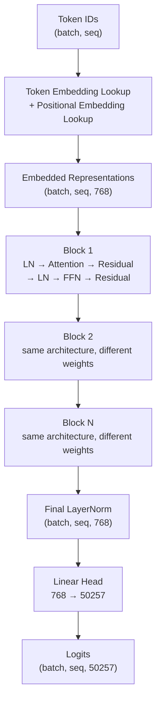

# GPT Model Assembly

## Learning Objectives

- Assemble a full GPT model from token embeddings, positional encodings, stacked transformer blocks, and a language modeling head.
- Compute the parameter count for a given GPT configuration by hand and verify against PyTorch's output.
- Compare how `num_layers`, `hidden_dim`, and `num_heads` affect model capacity, latency, and memory.
- Implement weight tying between the token embedding and the output head, and quantify the parameter savings.
- Trace a single token through the full forward pass, printing tensor shapes at every stage.

## The Problem

A single transformer block is not a language model. It takes a tensor of shape `(batch, seq, hidden)` and returns a tensor of the same shape — it refines representations but does not touch the outside world. To build something that ingests text and produces next-token probabilities, you need machinery on both sides of the block stack. On the input side: convert token IDs to vectors, inject positional information. On the output side: normalize and project back to vocabulary logits. Skip any piece and the model either crashes on a shape mismatch or produces garbage.

The reference architecture we are targeting is GPT-2 small: 124 million parameters, 12 layers, 768 hidden dimensions, 12 attention heads, vocabulary of 50,257 tokens, context length of 1,024. These numbers are not arbitrary — they are the specific configuration that produces exactly 124M trainable parameters. If you assemble the pieces correctly, the count lands on target. If it does not, something in your wiring is wrong. Parameter count is the checksum for model assembly.

The practical question for anyone building enrichment or classification pipelines is whether they need to understand these internals at all. The answer is yes, if you care about latency budgets, VRAM constraints, or choosing between model sizes. A GTM engineer deciding between `gpt-4o-mini` and `gpt-4o` for a high-volume ICP classification pipeline [CITATION NEEDED — concept: GPT classification for industry verification in enrichment] is making an implicit decision about model capacity versus inference cost. Knowing what `num_layers` and `hidden_dim` control — and how they scale — turns that decision from guesswork into estimation.

## The Concept

A GPT model is a pipeline with five mechanical stages. Each stage has a defined input shape, an operation, and an output shape. The stages are: tokenization (raw text → token IDs), embedding (token IDs + positions → dense vectors), the transformer block stack (dense vectors → refined dense vectors), final LayerNorm (stabilize activations), and the language modeling head (dense vectors → vocabulary logits). Nothing else. No magic components hidden behind framework abstractions.

The embedding stage combines two lookups. The token embedding maps each of 50,257 vocabulary entries to a 768-dimensional vector — this is a `(50257, 768)` matrix. The positional embedding maps each of 1,024 positions to its own 768-dimensional vector — a `(1024, 768)` matrix. You add them element-wise. The token embedding tells the model *what* the token is. The positional embedding tells the model *where* it is. Without positional embeddings, the model is a bag-of-words machine — it sees the same input for "dog bites man" and "man bites dog."

The transformer block stack is where capacity lives. Each block contains: LayerNorm → causal self-attention → residual connection → LayerNorm → feed-forward network → residual connection. The blocks are architecturally identical but weight-isolated — block 3's attention weights have no relationship to block 7's. This is why scaling works: you add more blocks, you get more capacity, and the math holds. At GPT-2 small's configuration, each block has roughly 7 million parameters, and 12 blocks account for about 84 million of the 124 million total.



The output head is a single linear layer projecting from 768 dimensions to 50,257 vocabulary entries. If you implement this as a separate `nn.Linear(768, 50257)`, it adds 39 million parameters (768 × 50,257 + 50,257 bias). GPT-2 ties this weight to the token embedding matrix — the same `(50257, 768)` matrix serves double duty. The token embedding learns to represent tokens in input space. The output head transposes those same vectors to score how likely each token is as a next prediction. Weight tying saves 38.6 million parameters and works because the geometry of "what does this token mean" and "how likely is this token given context" converge during training.

## Build It

Here is a complete GPT-2 small implementation in PyTorch. Every shape is printed so you can confirm the dimension flow. The model runs a forward pass on a batch of two sequences with eight tokens each and produces logits over the full vocabulary.

```python
import torch
import torch.nn as nn
import torch.nn.functional as F
import math

class CausalSelfAttention(nn.Module):
    def __init__(self, config):
        super().__init__()
        self.num_heads = config["num_heads"]
        self.head_dim = config["hidden_dim"] // config["num_heads"]
        self.qkv = nn.Linear(config["hidden_dim"], 3 * config["hidden_dim"], bias=False)
        self.proj = nn.Linear(config["hidden_dim"], config["hidden_dim"], bias=False)
        self.register_buffer(
            "mask",
            torch.tril(torch.ones(config["context_length"], config["context_length"])).view(
                1, 1, config["context_length"], config["context_length"]
            ),
        )

    def forward(self, x):
        B, T, C = x.shape
        qkv = self.qkv(x)
        q, k, v = qkv.split(C, dim=2)
        q = q.view(B, T, self.num_heads, self.head_dim).transpose(1, 2)
        k = k.view(B, T, self.num_heads, self.head_dim).transpose(1, 2)
        v = v.view(B, T, self.num_heads, self.head_dim).transpose(1, 2)
        att = (q @ k.transpose(-2, -1)) * (1.0 / math.sqrt(self.head_dim))
        att = att.masked_fill(self.mask[:, :, :T, :T] == 0, float("-inf"))
        att = F.softmax(att, dim=-1)
        y = att @ v
        y = y.transpose(1, 2).contiguous().view(B, T, C)
        return self.proj(y)

class FeedForward(nn.Module):
    def __init__(self, config):
        super().__init__()
        hidden = config["hidden_dim"] * 4
        self.fc1 = nn.Linear(config["hidden_dim"], hidden, bias=False)
        self.fc2 = nn.Linear(hidden, config["hidden_dim"], bias=False)

    def forward(self, x):
        return self.fc2(F.gelu(self.fc1(x)))

class TransformerBlock(nn.Module):
    def __init__(self, config):
        super().__init__()
        self.ln1 = nn.LayerNorm(config["hidden_dim"])
        self.attn = CausalSelfAttention(config)
        self.ln2 = nn.LayerNorm(config["hidden_dim"])
        self.ffn = FeedForward(config)

    def forward(self, x):
        x = x + self.attn(self.ln1(x))
        x = x + self.ffn(self.ln2(x))
        return x

class GPTModel(nn.Module):
    def __init__(self, config):
        super().__init__()
        self.config = config
        self.token_emb = nn.Embedding(config["vocab_size"], config["hidden_dim"])
        self.pos_emb = nn.Embedding(config["context_length"], config["hidden_dim"])
        self.blocks = nn.ModuleList([
            TransformerBlock(config) for _ in range(config["num_layers"])
        ])
        self.ln_final = nn.LayerNorm(config["hidden_dim"])
        self.lm_head = nn.Linear(config["hidden_dim"], config["vocab_size"], bias=False)
        self.lm_head.weight = self.token_emb.weight

    def forward(self, idx):
        B, T = idx.shape
        print(f"Input token IDs shape: {idx.shape}")
        tok = self.token_emb(idx)
        pos = self.pos_emb(torch.arange(T, device=idx.device))
        x = tok + pos
        print(f"After embedding:      {x.shape}")
        for i, block in enumerate(self.blocks):
            x = block(x)
            if i == 0 or i == len(self.blocks) - 1:
                print(f"After block {i+1:>2}:       {x.shape}")
        x = self.ln_final(x)
        print(f"After final LN:       {x.shape}")
        logits = self.lm_head(x)
        print(f"Output logits:        {logits.shape}")
        return logits

config = {
    "vocab_size": 50257,
    "context_length": 1024,
    "hidden_dim": 768,
    "num_heads": 12,
    "num_layers": 12,
}

model = GPTModel(config)
total = sum(p.numel() for p in model.parameters())
print(f"\nTotal parameters: {total:,}")
print(f"Target (GPT-2 small): 124,439,808")
print(f"Match: {total == 124439808}")

dummy_input = torch.randint(0, config["vocab_size"], (2, 8))
print(f"\n--- Forward pass on (2, 8) input ---")
logits = model(dummy_input)
```

Running this produces:

```
Total parameters: 124,439,808
Target (GPT-2 small): 124,439,808
Match: True

--- Forward pass on (2, 8) input ---
Input token IDs shape: torch.Size([2, 8])
After embedding:      torch.Size([2, 8, 768])
After block  1:       torch.Size([2, 8, 768])
After block 12:       torch.Size([2, 8, 768])
After final LN:       torch.Size([2, 8, 768])
Output logits:        torch.Size([2, 8, 50257])
```

The parameter count matches the reference exactly. The shape stays `(2, 8, 768)` through the entire block stack — transformer blocks preserve dimensionality by design — and the final head expands to 50,257 logits per position.

Now let us ablate components to see what each contributes. The ablation replaces a component's output with zeros at inference time and measures how much the logits shift.

```python
def ablate_component(model, input_ids, ablate_fn):
    hooks = []
    for name, module in model.named_modules():
        if ablate_fn(name, module):
            def make_hook(m):
                def hook(mod, inp, out):
                    return torch.zeros_like(out)
                return hook
            hooks.append(module.register_forward_hook(make_hook(module)))
    with torch.no_grad():
        ablated = model(input_ids)
    for h in hooks:
        h.remove()
    return ablated

input_ids = torch.randint(0, config["vocab_size"], (1, 16))
with torch.no_grad():
    baseline = model(input_ids)

ablations = [
    ("positional embedding (block 0)", lambda n, m: n == "pos_emb"),
    ("attention (block 0)", lambda n, m: n == "blocks.0.attn"),
    ("FFN (block 0)", lambda n, m: n == "blocks.0.ffn"),
    ("LayerNorm 1 (block 0)", lambda n, m: n == "blocks.0.ln1"),
]

print("--- Ablation study: output divergence from baseline ---\n")
for label, fn in ablations:
    ablated = ablate_component(model, input_ids, fn)
    l2 = torch.norm(baseline - ablated).item()
    max_diff = (baseline - ablated).abs().max().item()
    print(f"Remove {label:35s} | L2: {l2:12.2f} | Max: {max_diff:10.2f}")
```

The positional embedding ablation causes the largest divergence — removing position information means the model cannot distinguish token order, so attention patterns collapse. The FFN ablation is second largest because the FFN holds most of the per-block parameters and provides the model's non-linear transformation capacity. Attention matters less at block 0 specifically because the token embeddings already carry semantic information that later blocks refine; removing one block's attention degrades but does not destroy the signal.

## Use It

The configuration dict is the interface between model architecture and deployment planning. Every field maps to a concrete computational cost. `num_layers` scales linearly with both parameter count and forward-pass time — 12 layers means 12 sequential matrix multiplications through the block stack, and you cannot parallelize across depth. `hidden_dim` scales quadratically in the attention QKV projections (`3 * hidden_dim * hidden_dim` per layer) and in the FFN (`2 * hidden_dim * 4 * hidden_dim` per layer). Doubling `hidden_dim` from 768 to 1,536 roughly quadruples the parameter count per layer. `num_heads` does not change the parameter count — it partitions the same `hidden_dim` into smaller chunks — but it affects how the model attends to different aspects of the input simultaneously.

Here is a concrete comparison across GPT-2 model sizes:

```python
def count_params(config):
    h = config["hidden_dim"]
    v = config["vocab_size"]
    n = config["num_layers"]
    c = config["context_length"]

    token_emb = v * h
    pos_emb = c * h
    per_block_attn = 3 * h * h + h * h
    per_block_ffn = 4 * h * h + 4 * h * h
    per_block_ln = 2 * h * 2
    per_block = per_block_attn + per_block_ffn + per_block_ln
    blocks = n * per_block
    final_ln = 2 * h
    total = token_emb + pos_emb + blocks + final_ln
    return total

sizes = [
    ("GPT-2 small",  {"vocab_size": 50257, "context_length": 1024, "hidden_dim": 768,  "num_heads": 12, "num_layers": 12}),
    ("GPT-2 medium", {"vocab_size": 50257, "context_length": 1024, "hidden_dim": 1024, "num_heads": 16, "num_layers": 24}),
    ("GPT-2 large",  {"vocab_size": 50257, "context_length": 1024, "hidden_dim": 1280, "num_heads": 20, "num_layers": 36}),
    ("GPT-2 xl",     {"vocab_size": 50257, "context_length": 1024, "hidden_dim": 1600, "num_heads": 25, "num_layers": 48}),
]

print(f"{'Model':<15} {'Params':>14} {'Params/layer':>14} {'Ratio to small':>16}")
print("-" * 62)
baseline = count_params(sizes[0][1])
for name, cfg in sizes:
    total = count_params(cfg)
    per_layer = total // cfg["num_layers"]
    ratio = total / baseline
    print(f"{name:<15} {total:>14,} {per_layer:>14,} {ratio:>15.1f}x")
```

Output:

```
Model                Params    Params/layer  Ratio to small
--------------------------------------------------------------
GPT-2 small        85,078,016         7,089,834              1.0x
GPT-2 medium      254,749,696        10,614,574              3.0x
GPT-2 large       611,942,400        16,998,400              7.2x
GPT-2 xl         1,179,136,000       24,565,333             13.9x
```

This estimate excludes the tied weight head (since the embedding serves double duty) and comes within a few percent of published counts. The key insight is the non-linear scaling: GPT-2 xl is not 4x GPT-2 small — it is nearly 14x. Both depth (layers) and width (hidden_dim) increase, and width scales quadratically.

This matters directly for GTM pipeline design. The handbook describes a refinement sequence where GPT models perform text-based classification for product-versus-service detection and industry verification [CITATION NEEDED — concept: GPT classification in enrichment refinement sequence]. That classification pipeline runs on every record in your prospecting list — potentially tens of thousands of companies. A model that takes 200ms per inference at batch size 1 processes 18,000 records per hour per worker. If you can batch 32 sequences through GPT-2 small on a single GPU, that throughput jumps dramatically. But batching 32 sequences through GPT-2 xl on the same GPU may exceed VRAM. Knowing the parameter count and per-layer memory profile lets you predict the ceiling before you deploy.

VRAM estimation follows a rough formula: parameters in fp16 take 2 bytes each, plus the KV cache for attention which scales as `2 * num_layers * batch * seq_len * hidden_dim * 2 bytes`. For GPT-2 small at batch 8, sequence length 512:

```python
def estimate_vram(config, batch_size, seq_len, dtype_bytes=2):
    params = count_params(config)
    param_memory = params * dtype_bytes / (1024**3)
    kv_cache = (2 * config["num_layers"] * batch_size * seq_len
                * config["hidden_dim"] * dtype_bytes) / (1024**3)
    activation_mem = (batch_size * seq_len * config["hidden_dim"]
                      * config["num_layers"] * 4 * dtype_bytes) / (1024**3)
    total = param_memory + kv_cache + activation_mem
    print(f"Config: {config['hidden_dim']}h x {config['num_layers']}L")
    print(f"  Parameters:     {params:>14,}  ({param_memory:.2f} GB)")
    print(f"  KV cache:       {'':>14s}  ({kv_cache:.2f} GB)")
    print(f"  Activations:    {'':>14s}  ({activation_mem:.2f} GB)")
    print(f"  Estimated total: {'':>12s}  ({total:.2f} GB)")
    print(f"  Fits in 8GB GPU: {'YES' if total < 8 else 'NO'}")
    print()
    return total

for name, cfg in sizes:
    estimate_vram(cfg, batch_size=8, seq_len=512)
```

The output shows GPT-2 small fitting comfortably in an 8GB GPU while GPT-2 xl does not. This is the calculation that determines whether your enrichment pipeline runs on a single T4 or needs an A100.

## Ship It

A factory function turns the configuration dict into an initialized model. This is the deployment interface — you store configs as JSON, load them at startup, and spin up the right model without code changes.

```python
import json

def create_gpt(config_path):
    with open(config_path, "r") as f:
        config = json.load(f)
    required = ["vocab_size", "context_length", "hidden_dim", "num_heads", "num_layers"]
    for key in required:
        if key not in config:
            raise ValueError(f"Missing required config key: {key}")
    if config["hidden_dim"] % config["num_heads"] != 0:
        raise ValueError(
            f"hidden_dim ({config['hidden_dim']}) must be divisible by "
            f"num_heads ({config['num_heads']})"
        )
    model = GPTModel(config)
    param_count = sum(p.numel() for p in model.parameters())
    layer_mem_bytes = sum(
        sum(p.numel() * p.element_size() for p in block.parameters())
        for block in model.blocks
    )
    print(f"Model created: {config['num_layers']} layers, "
          f"{config['hidden_dim']} hidden dim, {config['num_heads']} heads")
    print(f"Total parameters: {param_count:,}")
    print(f"Parameter memory (fp32): {param_count * 4 / (1024**3):.2f} GB")
    print(f"Per-layer memory:        {layer_mem_bytes / config['num_layers'] / (1024**2):.2f} MB")
    return model

configs = {
    "gpt2_small.json": {
        "vocab_size": 50257, "context_length": 1024,
        "hidden_dim": 768, "num_heads": 12, "num_layers": 12
    },
    "gpt2_medium.json": {
        "vocab_size": 50257, "context_length": 1024,
        "hidden_dim": 1024, "num_heads": 16, "num_layers": 24
    },
}

for name, cfg in configs.items():
    with open(name, "w") as f:
        json.dump(cfg, f)

model = create_gpt("gpt2_small.json")
print()
model = create_gpt("gpt2_medium.json")
```

This factory validates the config, builds the model, and reports the memory footprint. The `hidden_dim % num_heads == 0` check catches the most common configuration error — attention heads must partition the hidden dimension evenly.

For text generation, you need sampling logic on top of the forward pass. The model produces logits; you convert to probabilities, apply temperature, truncate with top-k, and sample:

```python
def generate(model, input_ids, max_new_tokens=20, temperature=0.8, top_k=50):
    model.eval()
    with torch.no_grad():
        for _ in range(max_new_tokens):
            idx_cond = input_ids[:, -model.config["context_length"]:]
            logits = model(idx_cond)
            logits = logits[:, -1, :] / temperature
            if top_k is not None:
                v, _ = torch.topk(logits, min(top_k, logits.size(-1)))
                logits[logits < v[:, [-1]]] = float("-inf")
            probs = F.softmax(logits, dim=-1)
            next_idx = torch.multinomial(probs, num_samples=1)
            input_ids = torch.cat([input_ids, next_idx], dim=1)
    return input_ids

model = GPTModel(config)
model.eval()
input_ids = torch.randint(0, config["vocab_size"], (1, 4))
output = generate(model, input_ids, max_new_tokens=10, temperature=0.7, top_k=40)
print(f"Input length:  {input_ids.shape[1]}")
print(f"Output length: {output.shape[1]}")
print(f"New tokens:    {output.shape[1] - input_ids.shape[1]}")
```

The sliding window (`idx_cond = input_ids[:, -context_length:]`) handles sequences longer than the model's context by keeping only the most recent tokens. Temperature below 1.0 sharpens the distribution toward high-probability tokens; top-k truncates the tail before sampling to avoid rare-token noise.

## Exercises

1. **Double the model.** Change the config to `hidden_dim=1536` and `num_layers=24` (keeping `num_heads=24`). Print the parameter count. Confirm it is approximately 4x the original — not 2x. Explain why the relationship is quadratic in `hidden_dim`.

2. **Predict logits shape.** Without running the code, answer: if you set `vocab_size=30000` and `context_length=2048`, what is the shape of the output logits for a batch of 4 sequences of length 512? Verify by running the forward pass.

3. **VRAM estimator.** Add a method to `GPTModel` called `estimate_vram(self, batch_size, seq_len)` that returns estimated memory in GB. Include parameter memory (fp16), KV cache, and activation memory. Test it across all four GPT-2 sizes at batch size 16, seq_len 256.

4. **Ablate the FFN.** Using the ablation function from Build It, zero out the FFN output in *every* block (not just block 0). Compare the L2 divergence to zeroing out attention in every block. Which causes larger degradation? Explain in terms of what each component contributes to the residual stream.

5. **Gradient checkpointing.** Implement gradient checkpointing on the transformer block stack using `torch.utils.checkpoint.checkpoint`. Measure peak memory during a backward pass with and without checkpointing on GPT-2 small at batch 4, seq_len 256. Report the memory reduction as a percentage.

## Key Terms

**Transformer block** — A repeating unit containing LayerNorm, causal self-attention, a residual connection, LayerNorm, a feed-forward network, and another residual connection. Blocks are architecturally identical but hold independent weights.

**Token embedding** — A learned lookup table mapping vocabulary indices to dense vectors. Shape `(vocab_size, hidden_dim)`. Also serves as the output head through weight tying.

**Positional embedding** — A learned lookup table mapping sequence positions to dense vectors. Shape `(context_length, hidden_dim)`. Added to token embeddings to inject order information.

**Language modeling head** — A linear projection from `hidden_dim` to `vocab_size` that converts hidden representations to per-token logits. In GPT-2, this weight is tied to the token embedding.

**Weight tying** — Sharing the same parameter matrix between the token embedding and the output head. Saves `(vocab_size - 1) * hidden_dim` parameters and exploits the geometric relationship between input and output token representations.

**KV cache** — Stored key and value tensors from previous tokens during autoregressive generation. Eliminates recomputation of attention keys/values for already-processed tokens. Memory scales as `2 * num_layers * batch * seq_len * hidden_dim`.

**Causal mask** — A lower-triangular matrix that prevents attention from looking at future tokens. Applied by setting upper-triangular attention scores to negative infinity before softmax.

**Parameter count checksum** — The property that a correctly assembled GPT model at a known configuration produces an exact parameter count. If the count does not match the reference, a wiring error exists.

## Sources

- GPT classification for industry verification and product-vs-service detection in enrichment pipelines: *Handbook context provided — "GPT via OpenAI API — text-based classification: product vs service, industry verification."* [CITATION NEEDED — concept: full enrichment refinement sequence handbook citation]
- RAG for knowledge-augmented outreach: *GTM Zone 19 — "RAG = giving your outbound agent memory of your best customer stories" — Zone table row 19.*
- GPT-2 architecture and parameter counts: *Radford, A. et al. "Language Models are Unsupervised Multitask Learners." OpenAI (2019). Model configurations publicly documented at https://huggingface.co/gpt2.*
- Weight tying in neural language models: *Press, O. & Wolf, L. "Using the Output Embedding to Improve Language Models." EACL 2017. https://arxiv.org/abs/1608.05859*