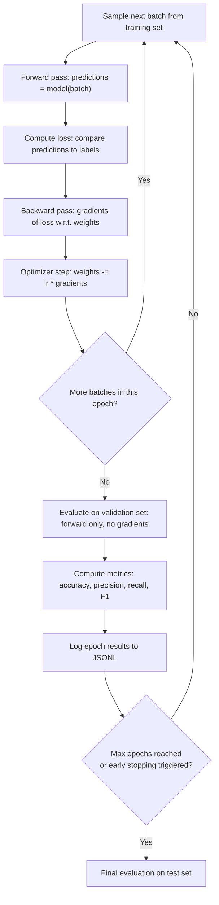

# Training Loop and Evaluation

## Learning Objectives

- Build a training loop that computes binary cross-entropy loss, derives gradients, and updates weights via gradient descent.
- Compare training and validation accuracy across epochs to detect when a model overfits.
- Implement precision, recall, and F1 score as evaluation metrics on held-out data.
- Configure a cosine learning rate schedule with linear warmup and trace the resulting learning rate over training steps.
- Persist per-epoch loss and metrics to JSONL so the training log is a reproducible artifact.

## The Problem

A training script that prints the loss and exits gives you one number and no signal. That single loss value cannot tell you whether the model is learning generalizable patterns or memorizing the training set. It cannot tell you whether the loss is decreasing because the model is improving or because the learning rate is decaying and the model has stopped moving entirely. It cannot tell you what the model actually produces when given unseen input.

Every one of these failures hides unless the loop measures more than one thing. You need loss on the training batch every step, loss on a held-out validation batch at intervals, and metrics beyond raw loss—accuracy, precision, recall—on that held-out data. Without these measurements, you are tuning hyperparameters blindfolded, changing the learning rate because the loss "looks wrong" in a print statement, with no way to distinguish a bad learning rate from a model that has already converged or a dataset that is too noisy to learn from.

The same blindfolded problem exists outside ML. A go-to-market team that iterates on outbound copy based solely on "did this campaign feel good" is running a training loop with no validation set. They cannot distinguish a message that resonated because it was good from one that landed in front of an unusually warm audience that week. The evaluation discipline—held-out data, consistent metrics, logged results—is what separates signal from noise whether the loop is training weights or training messaging.

## The Concept

A training loop has four steps that repeat until a stopping condition fires. The **forward pass** computes predictions from the current weights: given input features, multiply by weights, add bias, apply an activation function. The **loss calculation** measures how wrong those predictions are: binary cross-entropy for classification, mean squared error for regression. The **backward pass** computes the gradient of the loss with respect to every parameter—how much each weight contributed to the error. The **optimizer step** adjusts the weights in the opposite direction of the gradient, scaled by the learning rate. This cycle runs across batches (slices of data) within epochs (full passes through the dataset).



Evaluation runs the forward pass without computing gradients. No backward pass, no weight updates—the model is frozen and you measure its output against held-out labels. This matters because training accuracy is a biased measure: the model has already seen that data and adjusted its weights to fit it. A model that hits 99% training accuracy but 60% validation accuracy has **overfit**—it memorized patterns specific to training samples instead of learning features that generalize. The gap between training and validation performance is the primary diagnostic for overfitting, and watching that gap grow across epochs is how you catch it before it becomes a deployment problem.

The dataset splits into three partitions to keep evaluation honest. **Training data** drives weight updates. **Validation data** informs decisions about hyperparameters (learning rate, number of epochs, model capacity) and triggers early stopping when validation loss starts rising. **Test data** is held out entirely until the final evaluation—touching it during development contaminates the signal because every hyperparameter choice you make implicitly optimizes for it. The same logic applies in GTM: if you iterate on outbound copy using the same prospect list you'll use to measure results, you have no honest test of whether the copy generalizes.

## Build It

The loop below trains a logistic regression model from scratch on a synthetic binary classification problem. Three features, 200 samples, 140 for training and 60 for validation. The four steps—forward pass, loss, gradient, update—are written as explicit numpy operations so you can see exactly what happens inside one epoch.

```python
import numpy as np

np.random.seed(42)

def sigmoid(x):
    return 1 / (1 + np.exp(-np.clip(x, -500, 500)))

X = np.random.randn(200, 3)
true_weights = np.array([1.5, -2.0, 0.8])
true_bias = -0.5
logits = X @ true_weights + true_bias
y = (logits + np.random.randn(200) * 0.5 > 0).astype(float)

split = 140
X_train, X_val = X[:split], X[split:]
y_train, y_val = y[:split], y[split:]

weights = np.zeros(3)
bias = 0.0
lr = 0.1

for epoch in range(50):
    logits = X_train @ weights + bias
    preds = sigmoid(logits)

    error = preds - y_train
    grad_w = (X_train.T @ error) / len(y_train)
    grad_b = error.mean()

    weights -= lr * grad_w
    bias -= lr * grad_b

    if epoch % 10 == 0 or epoch == 49:
        train_preds = (sigmoid(X_train @ weights + bias) > 0.5).astype(float)
        val_preds = (sigmoid(X_val @ weights + bias) > 0.5).astype(float)
        train_acc = (train_preds == y_train).mean()
        val_acc = (val_preds == y_val).mean()
        loss = -np.mean(y_train * np.log(preds + 1e-15) + (1 - y_train) * np.log(1 - preds + 1e-15))
        print(f"Epoch {epoch:3d} | Loss: {loss:.4f} | Train Acc: {train_acc:.4f} | Val Acc: {val_acc:.4f}")
```

Running this prints a loss curve that decreases across epochs, with training and validation accuracy tracking closely together. That close tracking is what you want: the model is learning generalizable features, not memorizing. The loss drops because gradient descent is pushing weights toward the true values that generated the data.

But a linear model on three features rarely overfits. To see the gap open between training and validation performance, the next block gives the model more capacity—polynomial features that let it bend the decision boundary—and shrinks the training set so the model has room to memorize noise. It also computes precision, recall, and F1 on the validation set at checkpoint epochs, so you can see how different metrics tell different stories about the same model.

```python
import numpy as np

np.random.seed(42)

def sigmoid(x):
    return 1 / (1 + np.exp(-np.clip(x, -500, 500)))

def bce_loss(y_true, y_pred):
    return -np.mean(y_true * np.log(y_pred + 1e-15) + (1 - y_true) * np.log(1 - y_pred + 1e-15))

def compute_metrics(y_true, y_pred):
    tp = np.sum((y_pred == 1) & (y_true == 1))
    fp = np.sum((y_pred == 1) & (y_true == 0))
    fn = np.sum((y_pred == 0) & (y_true == 1))
    tn = np.sum((y_pred == 0) & (y_true == 0))
    accuracy = (tp + tn) / len(y_true)
    precision = tp / (tp + fp + 1e-15)
    recall = tp / (tp + fn + 1e-15)
    f1 = 2 * precision * recall / (precision + recall + 1e-15)
    return accuracy, precision, recall, f1

n = 200
X_raw = np.random.randn(n, 3)

X_poly = np.column_stack([
    X_raw,
    X_raw[:, 0:1] ** 2,
    X_raw[:, 1:2] ** 2,
    X_raw[:, 0:1] * X_raw[:, 1:2],
    X_raw[:, 0:1] * X_raw[:, 2:3],
    X_raw[:, 1:2] * X_raw[:, 2:3],
    X_raw[:, 0:1] ** 3,
])

true_weights = np.array([1.5, -2.0, 0.8, 0, 0, 0, 0, 0, 0, 0])
true_bias = -0.5
logits_true = X_poly @ true_weights + true_bias
y = (logits_true + np.random.randn(n) * 0.5 > 0).astype(float)

split = 50
X_train, X_val = X_poly[:split], X_poly[split:]
y_train, y_val = y[:split], y[split:]

n_features = X_poly.shape[1]
weights = np.zeros(n_features)
bias = 0.0
lr = 0.5

print(f"Train size: {split} | Val size: {n - split} | Features: {n_features}")
print(f"{'Epoch':>5} | {'Train Loss':>10} | {'Val Loss':>9} | {'Train Acc':>9} | {'Val Acc':>8} | {'Precision':>9} | {'Recall':>7} | {'F1':>6}")
print("-" * 95)

for epoch in range(300):
    logits = X_train @ weights + bias
    preds = sigmoid(logits)

    error = preds - y_train
    grad_w = (X_train.T @ error) / len(y_train)
    grad_b = error.mean()

    weights -= lr * grad_w
    bias -= lr * grad_b

    if epoch in [0, 10, 50, 100, 200, 299]:
        train_loss = bce_loss(y_train, preds)
        val_logits = X_val @ weights + bias
        val_preds_prob = sigmoid(val_logits)
        val_loss = bce_loss(y_val, val_preds_prob)

        train_bin = (preds > 0.5).astype(float)
        val_bin = (val_preds_prob > 0.5).astype(float)

        train_acc = (train_bin == y_train).mean()
        val_acc, val_prec, val_rec, val_f1 = compute_metrics(y_val, val_bin)

        print(f"{epoch:5d} | {train_loss:10.4f} | {val_loss:9.4f} | {train_acc:9.4f} | {val_acc:8.4f} | {val_prec:9.4f} | {val_rec:7.4f} | {val_f1:6.4f}")
```

The output tells a clear story. Early epochs: both train and val loss drop, accuracy climbs together. Around epoch 50–100, training loss keeps dropping but validation loss flattens or rises—the model has started fitting noise in the polynomial features that only exists in the training subset. By epoch 200–300, you see a substantial gap between train accuracy and val accuracy. That gap is overfitting, and it is visible because the loop logs both metrics side by side.

Precision and recall add detail that accuracy alone hides. If the validation set is imbalanced—say 70% positive class—then a model that