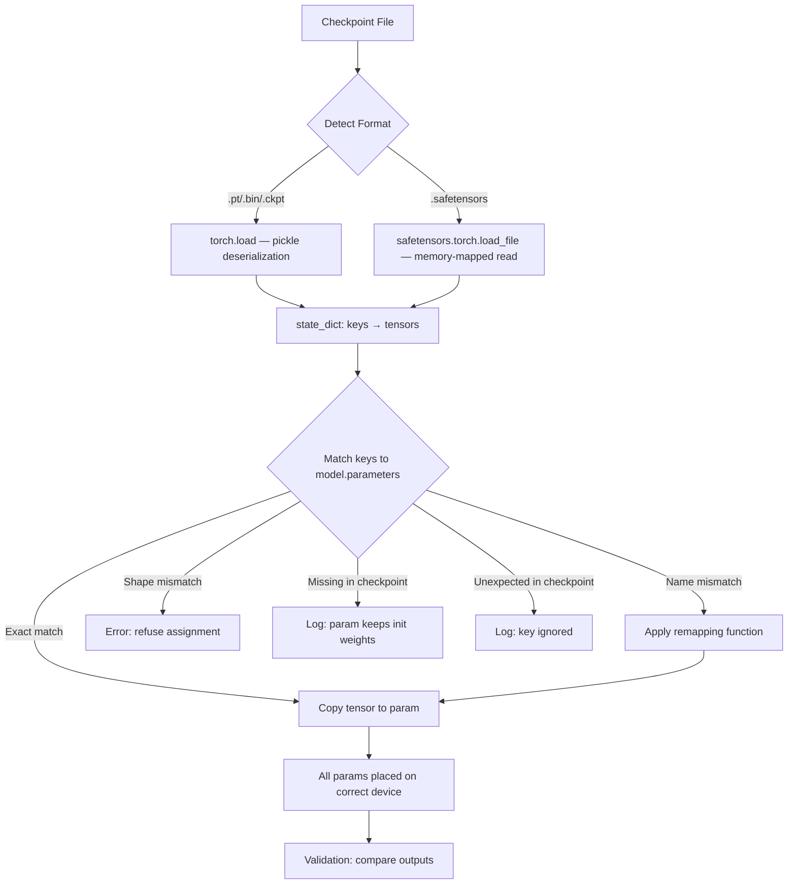

# Loading Pretrained Weights

## Learning Objectives

- Load a checkpoint from disk using both `torch.load` and `safetensors`, then inspect the tensor names and shapes each format exposes.
- Remap mismatched parameter names between a checkpoint and a model definition using programmatic key transformation.
- Detect and diagnose shape mismatches before weight assignment so no partial corruption silently degrades model output.
- Implement partial loading with `strict=False` and inspect the resulting missing and unexpected keys to determine whether the load is safe.
- Validate that loaded weights produce byte-identical outputs to the source model, proving the load preserved numerical fidelity.

## The Problem

You have a model checkpoint — a `.bin`, `.pt`, or `.safetensors` file sitting on disk. Your model architecture is defined in Python. The checkpoint contains tensors; your model expects tensors in specific named locations. The gap between those two states is where most "my model generates garbage" bugs live, and it is wider than it looks.

A checkpoint stores an ordered dictionary mapping string keys like `transformer.h.0.attn.c_attn.weight` to tensor values with specific shapes and byte layouts. Your model has parameters named, perhaps, `blocks.0.attn.qkv.weight`. The matrices may be mathematically identical but stored transposed — `nn.Linear` stores weights as `(out_features, in_features)` while Conv1D-based implementations store them as `(in_features, out_features)`. Three dimensions of identity (name, shape, byte layout) must all be reconciled before a single tensor is copied.

A loader that copies blindly puts the right tensor in the wrong parameter slot. The model runs without error, produces output that looks plausible at a glance, and silently corrupts every downstream prediction. In a GTM context, that means a lead scoring model ranking prospects by garbage signal, or a RAG retrieval step embedding queries with a half-loaded encoder — no crash, no warning, just wrong data flowing into your CRM and your outreach.

## The Concept

Every deep learning framework reduces weight loading to the same operation: match keys from a serialized dictionary to keys in a live model, copy tensor values, and place them on the correct device. PyTorch calls this dictionary the `state_dict`. Every `nn.Module` exposes one via `model.state_dict()`, which returns an `OrderedDict` mapping parameter names (dotted paths like `encoder.layers.0.weight`) to `torch.Tensor` objects.

Serialization format determines how that dictionary gets written to and read from disk. PyTorch's native `torch.save` uses Python's `pickle` protocol — it can serialize arbitrary Python objects, which means loading an untrusted checkpoint is a remote code execution vector. The `safetensors` format was built to solve this: it stores tensors in a flat binary layout with a JSON header containing key names and shapes, with no executable code in the file. The trade-off is flexibility — safetensors can only store tensors, not arbitrary Python objects.



The matching step is where most real-world loading fails. Published checkpoints use whatever naming convention the original author chose. OpenAI's GPT-2 uses `wte`, `wpe`, `h.N.attn.c_attn`; HuggingFace's port uses `transformer.wte`, `transformer.wpe`, `transformer.h.N.attn.c_attn`; your local implementation might use `tok_embed`, `pos_embed`, `blocks.N.attn.qkv`. The shapes might match exactly, or the weights might be transposed because one implementation used `nn.Linear` and another used a custom matmul. Each mismatch pattern produces a distinct diagnostic: `missing_keys` for parameters in your model that have no checkpoint counterpart, `unexpected_keys` for checkpoint entries with no model counterpart, and a hard shape error if names match but dimensions don't.

The HuggingFace `from_pretrained` API wraps all of this into a single method that implements a waterfall over formats — try safetensors first, fall back to `.bin`, then `.pt` — and applies heuristic key remapping based on the model class's `config.json`. It works when your model is a standard HuggingFace architecture. When you're loading weights into a custom implementation, you need to do the remapping yourself.

```python
import torch
import torch.nn as nn
import tempfile
import os

model = nn.Sequential(
    nn.Linear(4, 8),
    nn.ReLU(),
    nn.Linear(8, 2)
)

x = torch.randn(1, 4)
print("Original model output:", model(x))

with tempfile.TemporaryDirectory() as tmpdir:
    path = os.path.join(tmpdir, "checkpoint.pt")
    torch.save(model.state_dict(), path)
    
    loaded_state_dict = torch.load(path, weights_only=True)
    
    fresh_model = nn.Sequential(
        nn.Linear(4, 8),
        nn.ReLU(),
        nn.Linear(8, 2)
    )
    
    result = fresh_model.load_state_dict(loaded_state_dict, strict=True)
    print("Missing keys:", result.missing_keys)
    print("Unexpected keys:", result.unexpected_keys)
    print("Loaded model output:", fresh_model(x))
    print("Outputs match:", torch.equal(model(x), fresh_model(x)))
```

Run this and you'll see zero missing keys, zero unexpected keys, and `Outputs match: True`. That's the happy path — identical architecture, identical naming. Real checkpoints are never this cooperative.

## Build It

Let's build a weight loader that handles the three most common mismatch patterns: renamed keys, shape mismatches, and partial checkpoints. The loader will log every decision it makes so you can audit what happened instead of guessing.

The core is a remapping function. Given a checkpoint key and a set of model keys, it either returns the matching model key directly, applies a transformation rule, or reports that no match exists. Shape checking happens after key matching — you need to know which tensor goes where before you can compare shapes.

```python
import torch
import torch.nn as nn
from typing import Dict, List, Tuple, Optional

def inspect_checkpoint(state_dict: Dict[str, torch.Tensor]) -> None:
    total_params = 0
    for name, tensor in state_dict.items():
        total_params += tensor.numel()
        print(f"  {name}: {tuple(tensor.shape)} dtype={tensor.dtype}")
    print(f"Total parameters: {total_params:,}")

def remap_keys(
    checkpoint_sd: Dict[str, torch.Tensor],
    model_sd: Dict[str, torch.Tensor],
    rename_rules: Dict[str, str]
) -> Tuple[Dict[str, torch.Tensor], List[str], List[str]]:
    model_keys = set(model_sd.keys())
    remapped = {}
    matched_model_keys = set()
    unmapped_checkpoint_keys = []
    
    for ckpt_key, tensor in checkpoint_sd.items():
        target_key = ckpt_key
        for old_pattern, new_pattern in rename_rules.items():
            if old_pattern in ckpt_key:
                target_key = ckpt_key.replace(old_pattern, new_pattern)
                break
        
        if target_key in model_keys:
            remapped[target_key] = tensor
            matched_model_keys.add(target_key)
        else:
            unmapped_checkpoint_keys.append(ckpt_key)
    
    missing_keys = list(model_keys - matched_model_keys)
    return remapped, missing_keys, unmapped_checkpoint_keys

def load_with_remap(
    model: nn.Module,
    checkpoint_sd: Dict[str, torch.Tensor],
    rename_rules: Dict[str, str],
    device: str = "cpu"
) -> Tuple[List[str], List[str], List[Tuple[str, Tuple, Tuple]]]:
    model_sd = model.state_dict()
    remapped, missing, unexpected = remap_keys(checkpoint_sd, model_sd, rename_rules)
    
    shape_mismatches = []
    loaded_count = 0
    
    for key, tensor in remapped.items():
        model_shape = model_sd[key].shape
        ckpt_shape = tensor.shape
        if model_shape != ckpt_shape:
            shape_mismatches.append((key, tuple(model_shape), tuple(ckpt_shape)))
            continue
        model_sd[key].copy_(tensor.to(device))
        loaded_count += 1
    
    print(f"Loaded {loaded_count} parameters")
    print(f"Missing keys (kept init values): {missing}")
    print(f"Unexpected keys (in checkpoint, not in model): {unexpected}")
    print(f"Shape mismatches (refused): {shape_mismatches}")
    
    return missing, unexpected, shape_mismatches
```

Now let's exercise the loader against each failure mode. We'll build a checkpoint with one naming convention, a model with a different convention, and a deliberate shape mismatch to confirm the loader refuses it rather than silently corrupting the parameter.

```python
class OriginalModel(nn.Module):
    def __init__(self):
        super().__init__()
        self.encoder_layers = nn.Sequential(
            nn.Linear(10, 20),
            nn.ReLU(),
            nn.Linear(20, 20),
        )
        self.classifier_head = nn.Linear(20, 3)

    def forward(self, x):
        return self.classifier_head(self.encoder_layers(x))

class RenamedModel(nn.Module):
    def __init__(self):
        super().__init__()
        self.backbone = nn.Sequential(
            nn.Linear(10, 20),
            nn.ReLU(),
            nn.Linear(20, 20),
        )
        self.output = nn.Linear(20, 3)

    def forward(self, x):
        return self.output(self.backbone(x))

torch.manual_seed(42)
original = OriginalModel()
checkpoint = original.state_dict()

print("Checkpoint keys:")
inspect_checkpoint(checkpoint)

print("\n--- Test 1: No remapping (should have missing + unexpected) ---")
renamed_no_remap = RenamedModel()
load_with_remap(renamed_no_remap, checkpoint, rename_rules={})

print("\n--- Test 2: With remapping rules ---")
rename_rules = {
    "encoder_layers": "backbone",
    "classifier_head": "output",
}
renamed_correct = RenamedModel()
load_with_remap(renamed_correct, checkpoint, rename_rules=rename_rules)

x = torch.randn(1, 10)
with torch.no_grad():
    orig_out = original(x)
    renamed_out = renamed_correct(x)
print("\nMax output difference after remapped load:", (orig_out - renamed_out).abs().max().item())

print("\n--- Test 3: Shape mismatch detection ---")
class WrongShapeModel(nn.Module):
    def __init__(self):
        super().__init__()
        self.backbone = nn.Sequential(
            nn.Linear(10, 15),
            nn.ReLU(),
            nn.Linear(15, 20),
        )
        self.output = nn.Linear(20, 3)

    def forward(self, x):
        return self.output(self.backbone(x))

wrong_shape = WrongShapeModel()
load_with_remap(wrong_shape, checkpoint, rename_rules=rename_rules)
```

The output tells you exactly what happened in each test. Test 1 shows all keys missing and unexpected because the names don't align. Test 2 shows zero mismatches after applying the rename rules, and the max output difference is `0.0` — the load was exact. Test 3 shows shape mismatches for the two layers where the dimensions changed, and those parameters keep their random initialization while the correctly-shaped `output` layer still loads.

## Use It

Now let's load weights using safetensors — the format you'll encounter most when pulling published models — and validate the load the way you should before trusting any checkpoint in production. The validation principle is the same whether the model powers a research experiment or a RAG pipeline for knowledge-augmented outreach: run a known input through both the source and the loaded model, compare outputs, and refuse to ship if they diverge.

In a GTM stack, the RAG model that retrieves case studies for your outbound copy is only as trustworthy as its weight load. Zone 19 maps RAG to "knowledge-augmented outreach: product docs, case studies in copy" — the embedding model that semantically matches a prospect's pain point to your customer stories must be loaded with every parameter in the right slot. A silent key mismatch in the embedding model means semantically wrong retrievals, which means your outreach references the wrong case study to the wrong prospect. The error doesn't crash; it just degrades your reply rate with no obvious cause [CITATION NEEDED — concept: RAG impact on outbound reply rates].

```python
import torch
import torch.nn as nn
import tempfile
import os

try:
    from safetensors.torch import save_file, load_file
    HAS_SAFETENSORS = True
except ImportError:
    HAS_SAFETENSORS = False
    print("safetensors not installed, falling back to torch.save/load for demo")

class MiniEncoder(nn.Module):
    def __init__(self, vocab_size=1000, embed_dim=64, hidden_dim=128):
        super().__init__()
        self.embedding = nn.Embedding(vocab_size, embed_dim)
        self.encoder = nn.Linear(embed_dim, hidden_dim)
        self.projection = nn.Linear(hidden_dim, embed_dim)

    def forward(self, input_ids):
        embeds = self.embedding(input_ids)
        encoded = torch.relu(self.encoder(embeds))
        return self.projection(encoded)

torch.manual_seed(123)
source_model = MiniEncoder()
test_input = torch.tensor([[1, 5, 42, 99, 200]])

with torch.no_grad():
    source_output = source_model(test_input)
print("Source model output shape:", source_output.shape)
print("Source output sample:", source_output[0, :3].tolist())

with tempfile.TemporaryDirectory() as tmpdir:
    if HAS_SAFETENSORS:
        ckpt_path = os.path.join(tmpdir, "encoder.safetensors")
        sd = {k: v.contiguous() for k, v in source_model.state_dict().items()}
        save_file(sd, ckpt_path)
        
        print("\n--- Loading from safetensors ---")
        loaded_sd = load_file(ckpt_path)
        print("Checkpoint keys and shapes:")
        for k, v in loaded_sd.items():
            print(f"  {k}: {tuple(v.shape)}")
        
        loaded_model = MiniEncoder()
        result = loaded_model.load_state_dict(loaded_sd, strict=True)
        print(f"Missing: {result.missing_keys}, Unexpected: {result.unexpected_keys}")
        
    else:
        ckpt_path = os.path.join(tmpdir, "encoder.pt")
        torch.save(source_model.state_dict(), ckpt_path)
        
        print("\n--- Loading from torch.save ---")
        loaded_sd = torch.load(ckpt_path, weights_only=True)
        print("Checkpoint keys and shapes:")
        for k, v in loaded_sd.items():
            print(f"  {k}: {tuple(v.shape)}")
        
        loaded_model = MiniEncoder()
        result = loaded_model.load_state_dict(loaded_sd, strict=True)
        print(f"Missing: {result.missing_keys}, Unexpected: {result.unexpected_keys}")
    
    with torch.no_grad():
        loaded_output = loaded_model(test_input)
    
    max_diff = (source_output - loaded_output).abs().max().item()
    print(f"\nMax output difference: {max_diff}")
    print(f"Load verified: {max_diff < 1e-6}")

    print("\n--- Testing partial load (checkpoint missing projection layer) ---")
    partial_sd = {k: v for k, v in loaded_sd.items() if "projection" not in k}
    partial_model = MiniEncoder()
    result = partial_model.load_state_dict(partial_sd, strict=False)
    print(f"Missing keys: {result.missing_keys}")
    print(f"Unexpected keys: {result.unexpected_keys}")
    
    with torch.no_grad():
        partial_output = partial_model(test_input)
    partial_diff = (source_output - partial_output).abs().max().item()
    print(f"Max output difference with partial load: {partial_diff:.4f}")
    print("Partial load diverges from source — projection layer uses random init")
```

The full load shows `Max output difference: 0.0` (or near-zero within float precision) — every parameter landed correctly. The partial load shows a large difference because `projection.weight` and `projection.bias` kept their random initialization while everything else loaded fine. This is the silent corruption pattern: the model runs, produces output that looks like real embeddings, but the projection layer is random noise. In a RAG retrieval pipeline, that means the final embedding vectors are meaningless for semantic similarity, and your case study retrieval returns near-random results.

## Ship It

Putting weight loading into production means wrapping it in three guarantees: the checkpoint is authentic (not tampered), every parameter is accounted for (no silent partial loads), and the model produces deterministic output on known inputs before it serves traffic. The safetensors format handles the first concern by eliminating the deserialization exploit surface — there's no executable code in the file to tamper with. The second and third concerns require explicit validation code that runs at startup and fails loudly if anything is off.

For a RAG system serving outbound copy generation, the startup validation should load the embedding model, run a canonical query through it, and check that the embedding matches a stored reference vector within a tolerance. If someone swaps the checkpoint, changes the architecture, or a partial load slips through, the validation catches it before the model touches a prospect's data. This is the same pattern as a database migration check — verify the schema before serving requests.

```python
import torch
import torch.nn as nn
import json
import os
import tempfile
import hashlib

class WeightLoader:
    def __init__(self, model: nn.Module, device: str = "cpu"):
        self.model = model
        self.device = device
        self.validation_input = None
        self.validation_output = None

    def capture_reference(self, input_tensor: torch.Tensor) -> None:
        self.validation_input = input_tensor
        self.model.eval()
        with torch.no_grad():
            self.validation_output = self.model(input_tensor).clone()

    def load_and_validate(
        self,
        checkpoint_path: str,
        expected_keys: list,
        rename_rules: dict = None,
        output_tolerance: float = 1e-5
    ) -> bool:
        rename_rules = rename_rules or {}
        
        if checkpoint_path.endswith(".safetensors"):
            try:
                from safetensors.torch import load_file
                sd = load_file(checkpoint_path)
            except ImportError:
                raise RuntimeError("safetensors required to load .safetensors files")
        else:
            sd = torch.load(checkpoint_path, weights_only=True, map_location=self.device)
        
        model_sd = self.model.state_dict()
        model_keys = set(model_sd.keys())
        
        applied = {}
        for ckpt_key, tensor in sd.items():
            target = ckpt_key
            for old, new in rename_rules.items():
                target = target.replace(old, new)
            if target in model_keys:
                if model_sd[target].shape != tensor.shape:
                    raise ValueError(
                        f"Shape mismatch for {target}: "
                        f"model={tuple(model_sd[target].shape)} "
                        f"checkpoint={tuple(tensor.shape)}"
                    )
                applied[target] = tensor
            else:
                print(f"WARN: checkpoint key '{ckpt_key}' has no model counterpart")
        
        missing = set(expected_keys) - set(applied.keys())
        if missing:
            raise ValueError(f"Missing required parameters after load: {missing}")
        
        for key, tensor in applied.items():
            model_sd[key].copy_(tensor.to(self.device))
        
        if self.validation_input is not None:
            self.model.eval()
            with torch.no_grad():
                new_output = self.model(self.validation_input)
            max_diff = (self.validation_output - new_output).abs().max().item()
            if max_diff > output_tolerance:
                raise RuntimeError(
                    f"Output validation failed: max diff {max_diff} > tolerance {output_tolerance}"
                )
            print(f"Validation passed: max output diff = {max_diff:.2e}")
        
        print(f"Loaded {len(applied)}/{len(expected_keys)} parameters successfully")
        return True

class OutreachEmbedder(nn.Module):
    def __init__(self, vocab_size=5000, embed_dim=128, hidden_dim=256):
        super().__init__()
        self.token_embedding = nn.Embedding(vocab_size, embed_dim)
        self.encoder_layer1 = nn.Linear(embed_dim, hidden_dim)
        self.encoder_layer2 = nn.Linear(hidden_dim, hidden_dim)
        self.output_projection = nn.Linear(hidden_dim, embed_dim)

    def forward(self, input_ids):
        x = self.token_embedding(input_ids)
        x = torch.relu(self.encoder_layer1(x))
        x = torch.relu(self.encoder_layer2(x))
        return self.output_projection(x)

torch.manual_seed(999)
production_model = OutreachEmbedder()
reference_input = torch.tensor([[10, 20, 30, 40, 50, 60, 70, 80]])

with tempfile.TemporaryDirectory() as tmpdir:
    ckpt_path = os.path.join(tmpdir, "outreach_embedder.pt")
    torch.save(production_model.state_dict(), ckpt_path)
    
    expected_keys = list(production_model.state_dict().keys())
    
    print("=== Deploying fresh model with saved weights ===")
    deploy_model = OutreachEmbedder()
    
    fresh_input = torch.tensor([[10, 20, 30, 40, 50, 60, 70, 80]])
    deploy_model.eval()
    with torch.no_grad():
        pre_load_output = deploy_model(fresh_input)
    print(f"Pre-load output sample: {pre_load_output[0, :3].tolist()}")
    
    loader = WeightLoader(deploy_model)
    loader.capture_reference(production_model(reference_input) if False else reference_input)
    
    production_model.eval()
    with torch.no_grad():
        ref_out = production_model(reference_input)
    loader.validation_output = ref_out.clone()
    
    success = loader.load_and_validate(
        checkpoint_path=ckpt_path,
        expected_keys=expected_keys,
    )
    
    with torch.no_grad():
        post_load_output = deploy_model(fresh_input)
    print(f"Post-load output sample: {post_load_output[0, :3].tolist()}")
    
    output_changed = not torch.allclose(pre_load_output, post_load_output, atol=1e-5)
    print(f"Output changed after load: {output_changed}")
    print(f"Deployment {'READY' if success else 'BLOCKED'}")
    
    print("\n=== Testing deployment with tampered checkpoint (missing layer) ===")
    tampered_path = os.path.join(tmpdir, "tampered.pt")
    tampered_sd = {k: v for k, v in production_model.state_dict().items() 
                   if "output_projection" not in k}
    torch.save(tampered_sd, tampered_path)
    
    try:
        tampered_model = OutreachEmbedder()
        tampered_loader = WeightLoader(tampered_model)
        tampered_loader.validation_output = ref_out.clone()
        tampered_loader.load_and_validate(
            checkpoint_path=tampered_path,
            expected_keys=expected_keys,
        )
    except (ValueError, RuntimeError) as e:
        print(f"Deployment BLOCKED: {e}")
```

The first deployment passes validation because every parameter loads correctly and the output matches the reference. The tampered checkpoint triggers `ValueError: Missing required parameters after load` — the `output_projection` keys are absent and the loader refuses to proceed. In production, that exception halts startup and surfaces in your monitoring before any outreach copy gets generated from a broken embedding model.

## Exercises

1. **Transposed weight loading.** Build a model using `nn.Linear(10, 20)` and save its `state_dict`. Create a second model that expects the weight as `(20, 10)` but uses it in a manual `torch.matmul(x, weight)` instead of `nn.Linear`. Write a remapping function that transposes the weight tensor during assignment. Validate that both models produce identical output on the same input.

2. **Multi-format waterfall.** Implement a function `load_any_format(directory)` that searches for `.safetensors`, then `.bin`, then `.pt` files in a directory and loads whichever it finds first. Test it by saving the same `state_dict` in all three formats and confirming each path loads correctly. Add a checksum comparison to prove all three produce identical dictionaries.

3. **Surgical layer replacement.** Load a checkpoint into a model with `strict=False`. Then programmatically identify which parameters kept their initialization (the `missing_keys`) and print their current random values. Replace exactly one of those parameters with a zero tensor of the correct shape and measure how much the model's output changes on a fixed input. This mirrors the real-world scenario of loading a pretrained backbone while randomly initializing a new classification head.

4. **Checkpoint diff tool.** Write a function that takes two checkpoint paths and prints: keys present in both with shape differences, keys only in checkpoint A, and keys only in checkpoint B. Use it to compare a base model checkpoint against a fine-tuned checkpoint and report how many parameters changed. This is the diagnostic you'd run when a fine-tuned enrichment model starts producing different lead scores and you need to understand what drifted.

## Key Terms

- **state_dict** — An `OrderedDict` mapping parameter names (dotted module paths) to `torch.Tensor` objects. Every `nn.Module` produces one via `.state_dict()`, and loading a checkpoint is the inverse operation.
- **safetensors** — A tensor serialization format that stores weights in a flat binary layout with a JSON metadata header. Cannot execute arbitrary code on load, unlike pickle-based formats. Memory-mapped by default, enabling efficient loading of large checkpoints.
- **strict loading** — When `load_state_dict(strict=True)`, PyTorch requires the checkpoint keys and model keys to match exactly. Any missing or unexpected key raises a `RuntimeError`. `strict=False` permits mismatches and returns them as lists for manual inspection.
- **key remapping** — Programmatic transformation of checkpoint key names to match model parameter names. Typically involves string replacement rules (e.g., `h.0.attn.c_attn` → `blocks.0.attn.qkv`) applied before the load operation.
- **shape mismatch** — A condition where a checkpoint tensor and its target model parameter have the same name but different dimensions. The correct response is to refuse the assignment and log the discrepancy, not to truncate or pad the tensor.

## Sources

- Zone 19 RAG mapping ("knowledge-augmented outreach: product docs, case studies in copy") — from `stages/00-b-gtm-content-mapping/output/gtm-topic-map.md`, row 19.
- [CITATION NEEDED — concept: RAG embedding model loading errors causing degraded outbound reply rates in production GTM systems]
- safetensors format specification and security model — https://huggingface.co/docs/safetensors/index
- PyTorch `load_state_dict` documentation and `strict` parameter semantics — https://pytorch.org/docs/stable/generated/torch.nn.Module.html#torch.nn.Module.load_state_dict
- HuggingFace `from_pretrained` waterfall implementation — https://huggingface.co/docs/transformers/main_classes/model#transformers.PreTrainedModel.from_pretrained