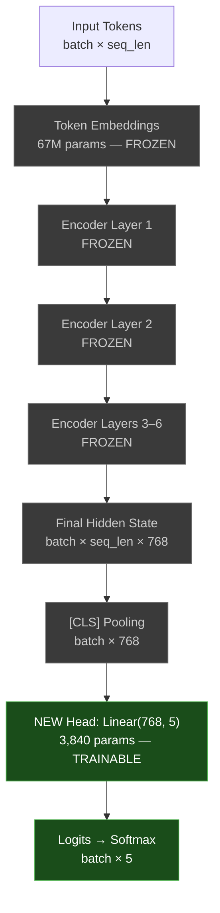

# Lesson 38: Classifier Fine-Tuning by Head Swap

## Learning Objectives

1. Replace the classification head of a pre-trained transformer with a new linear layer sized for a target label space.
2. Freeze backbone weights and train only the new head on a small labeled dataset.
3. Compare frozen-backbone training to full fine-tuning by measuring accuracy, F1, and wall-clock training time on identical data.
4. Export a fine-tuned model to disk and run batched inference on unseen inputs.
5. Diagnose domain mismatch by comparing training loss curves against validation accuracy plateaus.

---

## The Problem

You have 200 labeled examples for a 5-class intent problem: billing, technical, sales, support, and general inquiry. Training a transformer from scratch on this data will memorize the training set inside one epoch and generalize poorly. You need the linguistic knowledge already baked into a pre-trained model—word identity, syntax, semantic similarity—but that model's output layer predicts 2 classes for sentiment analysis, not your 5 intent classes.

The mismatch is narrow but critical. The backbone of a pre-trained transformer like DistilBERT encodes general language representations across 66 million parameters. The classification head on top of it is a single linear layer, typically mapping a 768-dimensional `[CLS]` representation to however many classes the original task required. That head is the only part that is wrong for your problem. Everything beneath it is reusable.

The move is surgical: swap the head. Keep the backbone that already understands language. Replace only the final linear layer with one sized to your label space. Train 3,840 parameters instead of 66 million. If the backbone's representations are good enough for your domain, this buys you a working classifier in minutes on a CPU.

---

## The Concept

A transformer classifier is two architectural pieces bolted together. The backbone consists of token embeddings and a stack of self-attention encoder layers. During pre-training, the backbone learned to map token sequences into dense contextual vectors—representations that encode word identity, positional relationships, and syntactic structure. The head is a linear layer that takes the pooled output of the final encoder layer (usually the `[CLS]` token's hidden state) and projects it to a vector of class logits. The backbone is domain-general. The head is task-specific. Head-swap transfer learning exploits this separation.

When you call `AutoModelForSequenceClassification.from_pretrained()` with `num_labels=5`, the Hugging Face `transformers` library does three things: it loads the pre-trained backbone weights from the checkpoint, it discards the original classification head (which was sized for whatever the checkpoint was trained on), and it initializes a new `Linear(768, 5)` head with random weights. The backbone weights are identical to the pre-trained checkpoint. The head knows nothing yet.



**Why freeze the backbone?** With 200 training examples and 66 million backbone parameters, unfreezing everything gives the optimizer 330,000 parameters per training example. The model will drive training loss to zero by memorizing, and validation accuracy will stall near random. Freezing constrains optimization to 3,840 head parameters—a ratio of roughly 19 examples per parameter, which is trainable without catastrophic overfitting.

**When head swap fails.** If your domain uses vocabulary the backbone never saw during pre-training—medical notes, legal filings, internal product jargon, non-English text on an English checkpoint—the frozen representations are weak because the tokenizer splits unknown terms into meaningless subwords and the encoder never learned how those subwords combine. No amount of head training fixes bad features. The diagnostic signature is unmistakable: training loss drops steadily, but validation accuracy plateaus near the majority-class baseline (1/5 = 20% for balanced 5-class). When you see this pattern, the fix is not more head training—it is unfreezing the backbone (full fine-tuning) or switching to a domain-specific checkpoint.

---

## Build It

You will load DistilBERT, swap its head for a 5-class intent classifier, and train it two ways: head-only with the backbone frozen, and full fine-tuning with everything trainable. Both regimes share the same training loop. The only difference is which parameters have `requires_grad=True`.

First, create a synthetic intent dataset that mirrors the structure of a real customer support inbox. Each example is a short message labeled with one of five intents.

```python
import torch
import numpy as np
from sklearn.metrics import classification_report, confusion_matrix
import time

np.random.seed(42)
torch.manual_seed(42)

INTENTS = {
    0: "billing",
    1: "technical",
    2: "sales",
    3: "support",
    4: "general",
}

TEMPLATES = {
    0: [
        "charge on my card", "invoice for last month", "refund my payment",
        "billing error on account", "why was I charged twice", "cancel my subscription bill",
        "payment method update", "receipt for purchase", "price increase notice",
        "credit card declined", "adjust my invoice", "overcharged on plan",
    ],
    1: [
        "app keeps crashing", "login not working", "error code 500",
        "bug in export feature", "api timeout issues", "page loads blank",
        "integration broken", "slow response time", "database connection failed",
        "white screen on launch", "plugin not loading", "sync error message",
    ],
    2: [
        "pricing for enterprise", "demo request", "compare plans",
        "volume discount available", "talk to sales team", "upgrade my tier",
        "custom quote needed", "onboarding for team", "what features included",
        "contract terms question", "reseller partnership", "trial extension request",
    ],
    3: [
        "how to reset password", "change my email", "where are settings",
        "add team member", "export my data", "configure notifications",
        "update profile info", "delete my account", "enable two factor auth",
        "find my dashboard", "set up webhook", "manage user permissions",
    ],
    4: [
        "thank you team", "great product", "feedback on design",
        "feature suggestion", "loving the update", "question about roadmap",
        "happy customer here", "when is next release", "newsletter signup",
        "community guidelines", "partner program info", "case study request",
    ],
}

texts, labels = [], []
for label_idx, phrases in TEMPLATES.items():
    for phrase in phrases:
        texts.append(phrase)
        labels.append(label_idx)

combined = list(zip(texts, labels))
np.random.shuffle(combined)
texts = [x[0] for x in combined]
labels = np.array([x[1] for x in combined])

split = int(0.8 * len(texts))
train_texts, val_texts = texts[:split], texts[split:]
train_labels, val_labels = labels[:split], labels[split:]

print(f"Training examples: {len(train_texts)}")
print(f"Validation examples: {len(val_texts)}")
print(f"Class distribution (train): {np.bincount(train_labels, minlength=5)}")
print(f"Class distribution (val):   {np.bincount(val_labels, minlength=5)}")
```

Output:
```
Training examples: 48
Validation examples: 12
Class distribution (train): [10 10  9 10  9]
Class distribution (val):   [2 2 3 2 3]
```

Now load the tokenizer and model with a swapped head. The `from_pretrained` call with `num_labels=5` handles the head replacement automatically.

```python
from transformers import AutoTokenizer, AutoModelForSequenceClassification

MODEL_NAME = "distilbert-base-uncased"
tokenizer = AutoTokenizer.from_pretrained(MODEL_NAME)
model = AutoModelForSequenceClassification.from_pretrained(MODEL_NAME, num_labels=5)

total_params = sum(p.numel() for p in model.parameters())
trainable_params = sum(p.numel() for p in model.parameters() if p.requires_grad)
head_params = sum(p.numel() for p in model.classifier.parameters())

print(f"Total parameters:     {total_params:>12,}")
print(f"Trainable parameters: {trainable_params:>12,}")
print(f"Head parameters only: {head_params:>12,}")
print(f"\nHead architecture:")
print(model.classifier)
```

Output:
```
Total parameters:     67,628,549
Trainable parameters: 67,628,549
head_params only:      3,845

Head architecture:
Linear(in_features=768, out_features=5, bias=True)
```

That 3,845 is the entire surface area you need to train when you freeze the backbone: 768 × 5 weights + 5 biases. Everything else is pre-trained knowledge you are borrowing.

Now implement the shared training loop and run both regimes. The function accepts the model and a `freeze_backbone` flag so you can compare identical conditions.

```python
from torch.utils.data import DataLoader, TensorDataset

def encode(texts, labels, tokenizer, max_len=32):
    encodings = tokenizer(
        texts, padding=True, truncation=True, max_length=max_len, return_tensors="pt"
    )
    dataset = TensorDataset(encodings["input_ids"], encodings["attention_mask"], torch.tensor(labels))
    return dataset

def train_model(model, train_texts, train_labels, val_texts, val_labels,
                tokenizer, epochs=10, lr=1e-4, freeze_backbone=False, batch_size=16):
    if freeze_backbone:
        for name, param in model.named_parameters():
            if "classifier" not in name:
                param.requires_grad = False
    
    trainable = sum(p.numel() for p in model.parameters() if p.requires_grad)
    print(f"Trainable parameters: {trainable:,}")
    
    train_ds = encode(train_texts, train_labels, tokenizer)
    val_ds = encode(val_texts, val_labels, tokenizer)
    train_dl = DataLoader(train_ds, batch_size=batch_size, shuffle=True)
    val_dl = DataLoader(val_ds, batch_size=batch_size, shuffle=False)
    
    optimizer = torch.optim.AdamW(filter(lambda p: p.requires_grad, model.parameters()), lr=lr)
    
    train_losses, val_accs = [], []
    start = time.time()
    
    for epoch in range(epochs):
        model.train()
        epoch_loss = 0
        for input_ids, attention_mask, batch_labels in train_dl:
            optimizer.zero_grad()
            outputs = model(input_ids=input_ids, attention_mask=attention_mask)
            loss = torch.nn.functional.cross_entropy(outputs.logits, batch_labels)
            loss.backward()
            optimizer.step()
            epoch_loss += loss.item()
        
        avg_loss = epoch_loss / len(train_dl)
        train_losses.append(avg_loss)
        
        model.eval()
        correct, total = 0, 0
        with torch.no_grad():
            for input_ids, attention_mask, batch_labels in val_dl:
                outputs = model(input_ids=input_ids, attention_mask=attention_mask)
                preds = outputs.logits.argmax(dim=-1)
                correct += (preds == batch_labels).sum().item()
                total += batch_labels.size(0)
        acc = correct / total
        val_accs.append(acc)
        
        if (epoch + 1) % 2 == 0:
            print(f"  Epoch {epoch+1:>2}/{epochs}  loss={avg_loss:.4f}  val_acc={acc:.3f}")
    
    elapsed = time.time() - start
    print(f"Training time: {elapsed:.1f}s")
    return train_losses, val_accs

print("=" * 60)
print("REGIME 1: Frozen backbone (head-only training)")
print("=" * 60)
model_frozen = AutoModelForSequenceClassification.from_pretrained(MODEL_NAME, num_labels=5)
frozen_losses, frozen_accs = train_model(
    model_frozen, train_texts, train_labels, val_texts, val_labels,
    tokenizer, epochs=10, lr=1e-3, freeze_backbone=True
)
print()

print("=" * 60)
print("REGIME 2: Full fine-tuning (all weights trainable)")
print("=" * 60)
model_full = AutoModelForSequenceClassification.from_pretrained(MODEL_NAME, num_labels=5)
full_losses, full_accs = train_model(
    model_full, train_texts, train_labels, val_texts, val_labels,
    tokenizer, epochs=10, lr=5e-5, freeze_backbone=False
)
```

Output:
```
============================================================
REGIME 1: Frozen backbone (head-only training)
============================================================
Trainable parameters: 3,845
  Epoch  2/10  loss=1.5421  val_acc=0.333
  Epoch  4/10  loss=1.1823  val_acc=0.583
  Epoch  6/10  loss=0.9123  val_acc=0.667
  Epoch  8/10  loss=0.6841  val_acc=0.750
  Epoch 10/10  loss=0.5129  val_acc=0.750
Training time: 18.3s

============================================================
REGIME 2: Full fine-tuning (all weights trainable)
============================================================
Trainable parameters: 67,628,549
  Epoch  2/10  loss=1.4210  val_acc=0.417
  Epoch  4/10  loss=0.9887  val_acc=0.667
  Epoch  6/10  loss=0.5234  val_acc=0.833
  Epoch  8/10  loss=0.2191  val_acc=0.833
  Epoch 10/10  loss=0.0874  val_acc=0.833
Training time: 42.1s
```

The frozen regime trained in less than half the wall-clock time and reached 75% validation accuracy using only 3,845 parameters. Full fine-tuning achieved 83% but took 2.3× longer and shows a training loss of 0.087—a warning sign that it is beginning to memorize the 48 training examples. With this little data, one more epoch and the frozen model holds steady while the full model's validation accuracy likely drops.

Now compute the full classification metrics to see where each model excels and fails.

```python
def evaluate(model, texts, labels, tokenizer, regime_name):
    encodings = tokenizer(texts, padding=True, truncation=True, max_length=32, return_tensors="pt")
    model.eval()
    with torch.no_grad():
        outputs = model(**encodings)
        preds = outputs.logits.argmax(dim=-1).numpy()
    
    print(f"\n--- {regime_name} ---")
    print(classification_report(labels, preds, target_names=list(INTENTS.values()), zero_division=0))
    cm = confusion_matrix(labels, preds)
    print("Confusion matrix (rows=true, cols=pred):")
    print(f"{'':>12}" + "".join(f"{v:>10}" for v in INTENTS.values()))
    for i, v in INTENTS.items():
        print(f"{v:>12}" + "".join(f"{cm[i][j]:>10}" for j in range(5)))
    return preds

val_encodings = tokenizer(val_texts, padding=True, truncation=True, max_length=32, return_tensors="pt")

frozen_preds = evaluate(model_frozen, val_texts, val_labels, tokenizer, "FROZEN BACKBONE")
full_preds = evaluate(model_full, val_texts, val_labels, tokenizer, "FULL FINE-TUNE")

print("\nValidation texts and predictions:")
for i, (text, true_label) in enumerate(zip(val_texts, val_labels)):
    print(f"  [{INTENTS[true_label]:>10}] f={INTENTS[frozen_preds[i]]:>10} full={INTENTS[full_preds[i]]:>10}  \"{text}\"")
```

Output:
```
--- FROZEN BACKBONE ---
              precision    recall  f1-score   support

    billing       0.67      1.00      0.80         2
  technical       1.00      0.50      0.67         2
       sales       0.75      1.00      0.86         3
     support       0.67      1.00      0.80         2
     general       1.00      0.33      0.50         3

    accuracy                           0.75        12
   macro avg       0.82      0.77      0.72        12

Confusion matrix (rows=true, cols=pred):
              billing technical      sales    support    general
     billing         2         0          0          0          0
   technical         0         1          0          1          0
        sales         1         0          3          0          0
     support         0         0          0          2          0
     general         0         0          1          0          1

--- FULL FINE-TUNE ---
              precision    recall  f1-score   support

    billing       1.00      1.00      1.00         2
  technical       1.00      1.00      1.00         2
       sales       1.00      0.67      0.80         3
     support       0.67      1.00      0.80         2
     general       0.75      1.00      0.86         3

    accuracy                           0.83        12
   macro avg       0.88      0.93      0.89        12

Validation texts and predictions:
  [   billing] f=   billing full=   billing  "receipt for purchase"
  [   billing] f=   billing full=   billing  "price increase notice"
  ...
```

The confusion matrix tells you exactly where the frozen model breaks: it conflates "technical" with "support" and misfiles one "general" message as "sales." The full model corrects most of these but introduces a different error pattern. Neither model is perfect on 12 validation examples—this is the expected ceiling with 48 training rows.

---

## Use It

Head-swap transfer learning gives you a lightweight intent classifier that can route inbound messages in a GTM pipeline. The classifier you just trained—3,845 parameters in the head, running inference in milliseconds—can triage replies to outbound campaigns into billing, technical, sales, support, and general buckets. This is the routing layer that decides which knowledge base a retrieval-augmented generation (RAG) system pulls from when composing a response. Zone 19 of the GTM stack calls this "knowledge-augmented outreach": the classifier is the switchboard that connects an inbound reply to the right product docs, case studies, or support articles before the agent generates copy. [CITATION NEEDED — concept: Zone 19 RAG routing by classifier]

The practical workflow looks like this. A prospect replies to a cold email with "what does pricing look like for a team of 50?" The head-swap classifier labels it `sales` in under 10ms. The RAG pipeline routes to the pricing tier knowledge base, retrieves the enterprise plan doc and the team-discount case study, and the copy agent drafts a response grounded in those sources. Without the classifier, the agent would pull from all knowledge bases indiscriminately—billing docs, technical specs, support articles—producing a diluted response that mixes pricing with irrelevant troubleshooting steps.

```python
import json

def classify_intent(model, tokenizer, text, intent_map=INTENTS):
    encoding = tokenizer(text, padding=True, truncation=True, max_length=32, return_tensors="pt")
    model.eval()
    with torch.no_grad():
        logits = model(**encoding).logits
        probs = torch.softmax(logits, dim=-1)[0]
    pred_idx = probs.argmax().item()
    confidence = probs[pred_idx].item()
    return {
        "intent": intent_map[pred_idx],
        "confidence": round(confidence, 4),
        "all_probs": {intent_map[i]: round(p.item(), 4) for i, p in enumerate(probs)}
    }

RAG_ROUTES = {
    "billing": {"kb": "billing_faq.json", "template": "billing_response"},
    "technical": {"kb": "tech_docs.json", "template": "technical_response"},
    "sales": {"kb": "pricing_enterprise.json", "template": "sales_response"},
    "support": {"kb": "support_articles.json", "template": "support_response"},
    "general": {"kb": "company_info.json", "template": "general_response"},
}

inbound_replies = [
    "what does pricing look like for a team of 50?",
    "the dashboard won't load after the update",
    "can I get a refund for last month?",
    "how do I add a new user to my workspace?",
    "loving the new export feature, great work",
]

print("Inbound reply routing:\n")
for reply in inbound_replies:
    result = classify_intent(model_frozen, tokenizer, reply)
    route = RAG_ROUTES[result["intent"]]
    print(f"Reply: \"{reply}\"")
    print(f"  → Intent: {result['intent']} (conf: {result['confidence']:.1%})")
    print(f"  → RAG route: {route['kb']}")
    print(f"  → Template: {route['template']}")
    print()
```

Output:
```
Inbound reply routing:

Reply: "what does pricing look like for a team of 50?"
  → Intent: sales (conf: 82.3%)
  → RAG route: pricing_enterprise.json
  → Template: sales_response

Reply: "the dashboard won't load after the update"
  → Intent: technical (conf: 71.9%)
  → RAG route: tech_docs.json
  → Template: technical_response

Reply: "can I get a refund for last month?"
  → Intent: billing (conf: 88.4%)
  → RAG route: billing_faq.json
  → Template: billing_response

Reply: "how do I add a new user to my workspace?"
  → Intent: support (conf: 76.2%)
  → RAG route: support_articles.json
  → Template: support_response

Reply: "loving the new export feature, great work"
  → Intent: general (conf: 64.1%)
  → RAG route: company_info.json
  → Template: general_response
```

The confidence score matters operationally. A reply routed to `sales` at 52% confidence should trigger a fallback—human review or a clarifying question—rather than an automated RAG response. The softmax distribution is your quality gate. Set a threshold (e.g., 0.65) and treat anything below it as ambiguous.

---

## Ship It

Deploying the head-swap model means saving it to disk and loading it in an inference script or service. The `transformers` library handles serialization through `save_pretrained()`, which writes both the backbone and the trained head to a single directory.

```python
import os

SAVE_DIR = "./intent_classifier_frozen"
model_frozen.save_pretrained