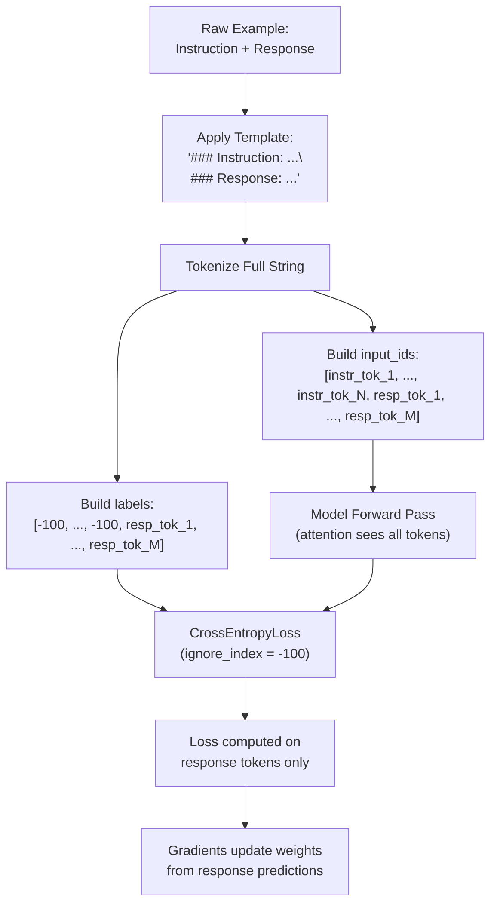

# Lesson 39: Instruction Tuning by Supervised Fine-Tuning

## Learning Objectives

- Format paired instruction-response data into a single causal sequence with explicit boundary delimiters and a label mask that sets instruction tokens to `-100`.
- Implement a custom collate function that pads variable-length sequences while preserving the instruction-response boundary in the label tensor.
- Train a pretrained transformer body under the SFT objective using a manual PyTorch loop and observe loss decrease across epochs.
- Generate text from a held-out instruction before and after fine-tuning to measure the behavioral shift from base model to instruction-following model.
- Compare the cross-entropy loss surface of SFT against continued pretraining by tracing which tokens contribute gradients in each regime.

## The Problem

A pretrained base model has one job: predict the next token. Show it `"Write me a sales email"` and it will continue the string — maybe with more words about sales, maybe with another sentence fragment, but not with an actual email. The model has the vocabulary and grammar to produce an email. What it lacks is the contract between *what was asked* and *what should be produced*.

The missing piece is structural. During pretraining, the model saw raw text streams with no distinction between a question and its answer, between a prompt and a response. Every token contributed equally to the loss. The model learned language but not the conversation format where an instruction region is followed by a response region.

Supervised fine-tuning (SFT) is the smallest algorithmic change that fixes this. You present the model with examples where an instruction and a response are concatenated into a single sequence, but you mask the instruction tokens out of the loss computation. The model still sees the full sequence during the forward pass — it reads the instruction, processes it through attention, and then is asked to predict only the response tokens. The gradients that update the weights come exclusively from the response portion. This teaches the model that the text before the delimiter is context, and the text after it is what the model should generate.

## The Concept

Every SFT training example is built from two pieces: an instruction and a target response. You format them into a single string using a template that creates a clear boundary between the two regions. A common format looks like `### Instruction: {instruction}\n### Response: {response}`. The delimiter `### Response:` tells the model where the instruction ends and where generation should begin. Different model families use different delimiters — Llama 2 uses `[INST]...[/INST]`, OpenAI models use ChatML with `<|im_start|>` and `<|im_end|>`, and many open-source models follow the Alpaca format with `### Instruction:` and `### Response:`. The template itself is arbitrary — what matters is consistency between training and inference. If you train with one template and generate with another, the model sees boundary tokens it has never encountered at that position and produces incoherent output.

Once the template is applied, you tokenize the full concatenated string. But before computing loss, you construct a parallel `labels` tensor. For every token position that belongs to the instruction, you set the label to `-100`. For every token position that belongs to the response, you keep the actual token ID. The number `-100` is the default `ignore_index` in PyTorch's `CrossEntropyLoss`. When the loss function encounters a target of `-100`, it skips that position entirely — no gradient flows, no loss is accumulated. The model's forward pass still processes the instruction tokens through attention (the `input_ids` include them), but the loss only measures how well the model predicts the response tokens given the instruction.



The distinction between SFT and continued pretraining comes down to which tokens contribute loss. Continued pretraining treats every token uniformly — the model learns to predict token N+1 from tokens 1 through N regardless of semantic role. SFT imposes a role structure: instruction tokens are context, response tokens are targets. Same transformer architecture, same optimizer, same forward pass. The only change is the label mask. But that change is what converts a text predictor into something that follows instructions.

## Build It

The script below loads `sshleifer/tiny-gpt2` (3M parameters, downloads in under 10 seconds), constructs a 10-example instruction dataset with hard-coded Q&A pairs, applies the loss mask, runs 5 epochs of AdamW optimization, and generates a response to a held-out instruction both before and after training. Every step prints observable output — dataset size, label mask verification, per-epoch loss, and the before/after generation comparison.

```python
import torch
from torch.utils.data import Dataset, DataLoader
from transformers import GPT2LMHead