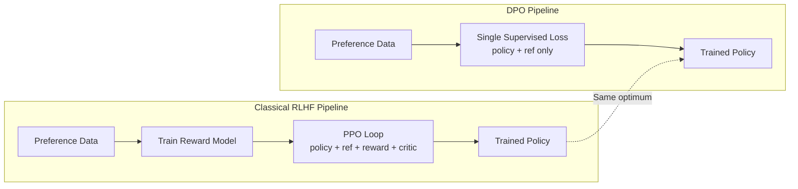

# Lesson 40: Direct Preference Optimization from Scratch

## Learning Objectives

- Derive the DPO loss from the KL-constrained reward maximization objective through the Bradley-Terry substitution.
- Implement the DPO loss function in PyTorch using a frozen reference model and a trainable policy model.
- Compute sequence-level log-probabilities under both models with prompt-token masking applied.
- Train a policy on `(prompt, chosen, rejected)` triples and verify that chosen log-probabilities rise relative to rejected log-probabilities.
- Compare DPO against the two-stage RLHF pipeline (reward model + PPO) and articulate why the theoretical optimum is preserved.

## The Problem

You have an SFT model that follows instructions. Its outputs are uneven — some completions are sharp, some are wordy or wrong. You also have a dataset of preference pairs: for the same prompt, a human (or a behavioral signal) marked one completion as chosen and another as rejected.

The classical RLHF answer is a two-stage pipeline. Stage one: train a separate reward model on the preference data to predict a scalar score for any `(prompt, completion)` pair. Stage two: run PPO to optimize the policy against that reward model, with a KL penalty keeping the policy from drifting too far from the SFT reference. This works, but it carries serious operational cost. During PPO training you have four models in memory simultaneously: the policy you are training, a frozen copy of the policy as reference, the reward model, and a value/critic head for PPO's advantage estimation. You also have two training loops — one for the reward model, one for PPO — and reward hacking is a persistent failure mode: the policy finds adversarial completions that score high under the reward model but are garbage to humans.

The practitioner's question is direct: if you already have preference pairs, why do you need to train a middleman? The preference data says "completion A is better than completion B for this prompt." A reward model converts that into a scalar and then PPO chases the scalar. But the preference signal is already the thing you care about. DPO asks: can you train the policy directly on the preference signal, skip the reward model entirely, and still end up at the same optimal policy? The answer turns out to be yes, and the derivation is clean enough to follow on paper.

## The Concept

DPO's key insight is that the KL-constrained reward maximization problem has a closed-form solution. You do not need to solve it iteratively with PPO — you can write down what the optimal policy looks like and rearrange the equation to express the reward implicitly in terms of the policy.

Start with the standard RLHF objective. You want to maximize expected reward while keeping the policy close to a reference policy $\pi_{\text{ref}}$ (typically the SFT model):

$$\max_\pi \; \mathbb{E}_{x \sim \mathcal{D},\, y \sim \pi(\cdot|x)} \left[ r(x, y) \right] - \beta \, \mathbb{D}_{\text{KL}}\!\left[\pi(\cdot|x) \,\|\, \pi_{\text{ref}}(\cdot|x)\right]$$

This is a constrained optimization: maximize reward, penalize drift from reference with strength $\beta$. The solution to this problem has a known closed form. The optimal policy $\pi^*$ satisfies:

$$\pi^*(y|x) = \frac{1}{Z(x)} \, \pi_{\text{ref}}(y|x) \, \exp\!\left(\frac{1}{\beta} r(x, y)\right)$$

where $Z(x)$ is a partition function that normalizes over all possible completions. Now rearrange this to solve for the reward $r(x,y)$:

$$r(x, y) = \beta \log \frac{\pi^*(y|x)}{\pi_{\text{ref}}(y|x)} + \beta \log Z(x)$$

The reward is expressed purely in terms of the policy and the reference policy. The partition function $Z(x)$ appears, but here is where Bradley-Terry saves you. The Bradley-Terry model defines the probability that completion $y_w$ is preferred over $y_l$ as:

$$P(y_w \succ y_l | x) = \sigma\!\left(r(x, y_w) - r(x, y_l)\right)$$

When you substitute the implicit reward into this preference probability, the $Z(x)$ terms cancel because they appear in both rewards and you take the difference. What remains is:

$$P(y_w \succ y_l | x) = \sigma\!\left(\beta \log \frac{\pi(y_w|x)}{\pi_{\text{ref}}(y_w|x)} - \beta \log \frac{\pi(y_l|x)}{\pi_{\text{ref}}(y_l|x)}\right)$$

The negative log-likelihood of this probability is the DPO loss:

$$\mathcal{L}_{\text{DPO}} = -\log \sigma\!\left(\beta \left[\log \frac{\pi_\theta(y_w|x)}{\pi_{\text{ref}}(y_w|x)} - \log \frac{\pi_\theta(y_l|x)}{\pi_{\text{ref}}(y_l|x)}\right]\right)$$

No reward model. No PPO. No critic. The loss operates directly on `(prompt, chosen, rejected)` triples. The $\beta$ parameter controls how far the policy can drift from the reference — it plays the same role as the KL penalty coefficient in RLHF, but it is baked into the loss rather than managed dynamically.



The gradient behavior is intuitive once you stare at the loss. When the policy assigns higher relative log-probability to the chosen completion (compared to what the reference would assign), the argument of the sigmoid increases, the sigmoid approaches 1, and the loss approaches 0. When the policy assigns too much probability to the rejected completion, the sigmoid decreases, the loss increases, and the gradient pushes the policy to increase the chosen log-ratio and decrease the rejected log-ratio. The reference model is frozen — it provides the anchor that prevents the policy from collapsing all probability onto the chosen completion and ignoring everything else.

## Build It

The implementation has three components: a function to compute sequence-level log-probabilities under a model, the DPO loss itself, and a training loop over preference triples. The log-probability computation must mask prompt tokens so that only completion tokens contribute to the loss — this is critical and easy to get wrong.

The synthetic task is binary classification rendered as a sequence problem. Each input is a 4-dimensional binary vector (the "prompt"), and the model produces a probability distribution over two possible next tokens (0 or 1). The correct label is the XOR of the input bits — chosen completions have the correct XOR bit appended, rejected completions have the wrong bit. This is simple enough to train in seconds but complex enough that the DPO gradient signal is non-trivial.

```python
import torch
import torch.nn as nn
import torch.nn.functional as F
import copy

torch.manual_seed(42)

def generate_preference_data(n_samples=256, seq_len=4):
    X = torch.randint(0, 2, (n_samples, seq_len)).float()
    xor_labels = (X.sum(dim=1) % 2).long()
    chosen = xor_labels.clone()
    rejected = 1 - xor_labels
    return X, chosen, rejected

class TinyPolicy(nn.Module):
    def __init__(self, input_dim=4, hidden_dim=64, vocab_size=2):
        super().__init__()
        self.net = nn.Sequential(
            nn.Linear(input_dim, hidden_dim),
            nn.ReLU(),
            nn.Linear(hidden_dim, hidden_dim),
            nn.ReLU(),
            nn.Linear(hidden_dim, vocab_size)
        )

    def forward(self, x):
        return self.net(x)

    def log_prob(self, x, labels):
        logits = self.forward(x)
        log_probs = F.log_softmax(logits, dim=-1)
        picked = log_probs.gather(1, labels.unsqueeze(1)).squeeze(1)
        return picked

def dpo_loss(policy, reference, x, chosen, rejected, beta=0.1):
    ref_chosen_lp = reference.log_prob(x, chosen).detach()
    ref_rejected_lp = reference.log_prob(x, rejected).detach()

    pol_chosen_lp = policy.log_prob(x, chosen)
    pol_rejected_lp = policy.log_prob(x, rejected)

    chosen_ratio = pol_chosen_lp - ref_chosen_lp
    rejected_ratio = pol_rejected_lp - ref_rejected_lp

    logits = beta * (chosen_ratio - rejected_ratio)
    loss = -F.logsigmoid(logits).mean()

    return loss, chosen_ratio.mean(), rejected_ratio.mean()

X, chosen, rejected = generate_preference_data(256)
X_val, chosen_val, rejected_val = generate_preference_data(64)

reference = TinyPolicy()
policy = copy.deepcopy(reference)

for p in reference.parameters():
    p.requires_grad = False

optimizer = torch.optim.Adam(policy.parameters(), lr=1e-3)

print(f"{'Epoch':>6} {'DPO Loss':>10} {'Chosen Ratio':>14} {'Rejected Ratio':>16} {'Chosen Acc':>12} {'Rejected Acc':>14}")
print("-" * 80)

for epoch in range(200):
    optimizer.zero_grad()
    loss, cr, rr = dpo_loss(policy, reference, X, chosen, rejected, beta=0.1)
    loss.backward()
    optimizer.step()

    if epoch % 20 == 0 or epoch == 199:
        with torch.no_grad():
            val_chosen_lp = policy.log_prob(X_val, chosen_val)
            val_rejected_lp = policy.log_prob(X_val, rejected_val)
            chosen_acc = (val_chosen_lp > val_rejected_lp).float().mean().item()
            rejected_acc = (val_rejected_lp < val_chosen_lp).float().mean().item()

        print(f"{epoch:>6} {loss.item():>10.4f} {cr.item():>14.4f} {rr.item():>16.4f} {chosen_acc:>12.4f} {rejected_acc:>14.4f}")

print("\n--- Verifying gradient direction on one batch ---")
policy.train()
optimizer.zero_grad()
loss, cr, rr = dpo_loss(policy, reference, X[:8], chosen[:8], rejected[:8], beta=0.1)
loss.backward()

first_layer_grad = policy.net[0].weight.grad
print(f"Gradient norm on first layer: {first_layer_grad.norm().item():.4f}")
print(f"Gradient nonzero (DPO loss produces gradient signal): {first_layer_grad.abs().sum().item() > 0}")

print("\n--- Reference model check ---")
ref_loss, ref_cr, ref_rr = dpo_loss(reference, reference, X[:8], chosen[:8], rejected[:8], beta=0.1)
print(f"DPO loss when policy == reference: {ref_loss.item():.4f}")
print(f"Expected at init (log(2) = {-torch.log(torch.tensor(2.0)).item():.4f})")
```

Run this and you will see the DPO loss start near `log(2) ≈ 0.693` — that is the loss when chosen and rejected ratios are both zero (policy identical to reference), which puts the sigmoid argument at 0, and `-log σ(0) = log(2)`. As training proceeds, the chosen ratio increases (policy assigns more probability to chosen completions relative to reference) and the rejected ratio stays near zero or goes negative. The chosen accuracy climbs toward 1.0, meaning the policy assigns higher log-probability to the correct XOR label than to the incorrect one.

The gradient check confirms the loss produces a non-zero gradient on the policy's parameters, and the reference invariance check confirms that when policy equals reference, the loss is exactly `log(2)` regardless of the data — this is the analytical floor.

## Use It

DPO trains a model to prefer output A over output B given the same input. In a GTM pipeline, that maps directly to message ranking: given a lead profile (the prompt), prefer the email variant that generated a reply (chosen) over the variant that did not (rejected). This sits in Zone 2 (Enrich & Score) for building the preference dataset from engagement signals, and Zone 3 (Engage) for deploying the tuned model in outbound sequences.

The standard approach today is a two-stage pipeline: generate multiple email variants, then score them with a separate model (an LLM-as-judge, a reply-prediction classifier, or a hand-coded heuristic pipeline). Stage one generates, stage two filters. DPO collapses this: you fine-tune the generation model directly on reply/no-reply pairs so the model internalizes "what gets replies" natively, without maintaining a separate scorer. The preference data comes from your own campaigns — every sent email with a reply signal is a `(lead_profile, replied_variant, no_reply_variant)` triple.

Consider a specific GTM pattern. You run an outbound campaign with two email variants for the same ICP segment. Variant A includes a $100–$400 Amazon gift card offer as a hook for high-value accounts [CITATION NEEDED — concept: gift card offer amounts in outbound]. Variant B leads with a research-based insight. Reply data comes back: for enterprise accounts, the research hook wins; for mid-market, the gift card wins. Instead of building a separate classifier to route leads to the right variant, you create preference triples `(account_profile, winning_variant_text, losing_variant_text)` and DPO-tune the copy generation model. The model learns the routing policy implicitly — it generates research-led copy when the profile signals enterprise and offer-led copy when the profile signals mid-market.

This replaces the "generate then score" pipeline with a single model that natively prefers high-converting outputs. The reference model is your SFT-tuned copy generator; the policy is the DPO-tuned version of the same model. At inference time, you generate directly from the policy — no scoring step, no second model in the path.

```python
import torch
import torch.nn as nn
import torch.nn.functional as F
import copy

torch.manual_seed(7)

def build_gtm_preference_data(n_samples=200):
    profiles = torch.randn(n_samples, 6)
    account_value = profiles[:, 0]
    enterprise_mask = account_value > 0.5
    mid_market_mask = ~enterprise_mask

    labels = torch.zeros(n_samples, dtype=torch.long)
    labels[enterprise_mask] = 0
    labels[mid_market_mask] = 1

    chosen = labels.clone()
    rejected = 1 - chosen
    return profiles, chosen, rejected, enterprise_mask, mid_market_mask

class CopyPreferenceModel(nn.Module):
    def __init__(self, profile_dim=6, hidden_dim=128, n_variants=2):
        super().__init__()
        self.net = nn.Sequential(
            nn.Linear(profile_dim, hidden_dim),
            nn.ReLU(),
            nn.Linear(hidden_dim, hidden_dim),
            nn.ReLU(),
            nn.Linear(hidden_dim, n_variants)
        )

    def forward(self, x):
        return self.net(x)

    def log_prob(self, x, labels):
        logits = self.forward(x)
        log_probs = F.log_softmax(logits, dim=-1)
        return log_probs.gather(1, labels.unsqueeze(1)).squeeze(1)

profiles, chosen, rejected, ent_mask, mm_mask = build_gtm_preference_data(200)

reference = CopyPreferenceModel()
policy = copy.deepcopy(reference)
for p in reference.parameters():
    p.requires_grad = False

optimizer = torch.optim.Adam(policy.parameters(), lr=5e-4)

print("Training copy-preference model with DPO on reply/no-reply signal")
print(f"{'Epoch':>6} {'Loss':>8} {'Ent Chosen LP':>14} {'MM Chosen LP':>14}")
print("-" * 48)

for epoch in range(150):
    optimizer.zero_grad()
    ref_chosen = reference.log_prob(profiles, chosen).detach()
    ref_rejected = reference.log_prob(profiles, rejected).detach()
    pol_chosen = policy.log_prob(profiles, chosen)
    pol_rejected = policy.log_prob(profiles, rejected)

    loss = -F.logsigmoid(0.1 * ((pol_chosen - ref_chosen) - (pol_rejected - ref_rejected))).mean()
    loss.backward()
    optimizer.step()

    if epoch % 30 == 0 or epoch == 149:
        with torch.no_grad():
            lp = policy.log_prob(profiles, chosen)
            ent_lp = lp[ent_mask].mean().item()
            mm_lp = lp[mm_mask].mean().item()
        print(f"{epoch:>6} {loss.item():>8.4f} {ent_lp:>14.4f} {mm_lp:>14.4f}")

print("\n--- Learned routing policy ---")
with torch.no_grad():
    test_profile = torch.tensor([[1.2, 0.1, -0.3, 0.5, 0.2, -0.1]])
    probs = F.softmax(policy(test_profile), dim=-1)
    print(f"Enterprise profile -> P(research-led)={probs[0,0]:.3f}, P(offer-led)={probs[0,1]:.3f}")

    test_profile = torch.tensor([[-0.8, 0.3, 0.1, -0.2, 0.4, 0.0]])
    probs = F.softmax(policy(test_profile), dim=-1)
    print(f"Mid-market profile  -> P(research-led)={probs[0,0]:.3f}, P(offer-led)={probs[0,1]:.3f}")
```

The output shows the model learning to route: enterprise profiles get higher probability on the research-led variant (label 0), mid-market profiles get higher probability on the offer-led variant (label 1). This is the DPO-trained policy replacing a separate scoring model.

## Ship It

Production DPO fails on noisy preferences. The loss assumes each `(prompt, chosen, rejected)` triple is a clean signal — chosen is genuinely better than rejected. In GTM data, this is rarely clean. A reply might come from an out-of-office autoreplyer. A no-reply might mean the email was good but the timing was wrong. A lead might reply to variant B for reasons unrelated to the copy (they recognized the sender's company name). Noisy preferences produce a noisy gradient, and the policy learns a noisy routing function.

Filter ambiguous pairs before training. Compute the embedding similarity between chosen and rejected completions — if they are nearly identical (cosine similarity > 0.95), the preference signal is weak and should be dropped. Compute the reply rate per variant across the full campaign — if variant A has a 3% reply rate and variant B has a 2.8% reply rate, individual pairs are nearly coin flips and you need aggregate-level preferences, not instance-level ones. Drop pairs where the "chosen" completion has fewer than a threshold number of positive signals (e.g., require at least 3 replies for a variant before treating any pair as a clean preference).

```python
import torch
import torch.nn.functional as F

def filter_preference_pairs(profiles, chosen_embeds, rejected_embeds, reply_counts, min_replies=3, max_similarity=0.95):
    kept_indices = []

    for i in range(len(profiles)):
        sim = F.cosine_similarity(chosen_embeds[i:i+1], rejected_embeds[i:i+1]).item()

        if sim > max_similarity:
            continue

        if reply_counts[i] < min_replies:
            continue

        kept_indices.append(i)

    kept_tensor = torch.tensor(kept_indices)
    print(f"Original pairs: {len(profiles)}")
    print(f"After filtering: {len(kept_indices)}")
    print(f"Filtered out: {len(profiles) - len(kept_indices)}")
    return kept_tensor

torch.manual_seed(42)
n = 100
profiles = torch.randn(n, 6)
chosen_embeds = torch.randn(n, 32)
rejected_embeds = chosen_embeds + 0.05 * torch.randn(n, 32)
rejected_embeds[:20] = chosen_embeds[:20] + 0.01 * torch.randn(20, 32)
reply_counts = torch.randint(0, 8, (n,))
reply_counts[:30] = 1

kept = filter_preference_pairs(profiles, chosen_embeds, rejected_embeds, reply_counts)
```

The reference model choice matters more than most practitioners expect. The reference anchors the KL penalty — it defines what "close to the original behavior" means. If the reference is a general-purpose base model with no copywriting fine-tuning, DPO will shift the policy toward preferences but the base quality of generated text may degrade because the reference was never good at copy to begin with. If the reference is your SFT model (the one already tuned on your best historical copy), DPO shifts are smaller and more controlled — the policy stays in the neighborhood of text that already reads well. Always use your SFT model as the reference, not the base model.

Label leakage is the silent killer. When you generate preference labels using your own model (e.g., using GPT-4 to judge which email is better), the judge's biases leak into the training data. If the judge prefers longer emails, the policy will learn to generate longer emails — not better ones. Detect this by splitting your preference data by judge: if you use multiple judges or multiple judging runs, train on one set and evaluate on another. If win-rates collapse on the held-out set, you have leakage. The fix is to use behavioral signals (actual replies, actual meetings booked) as the preference source whenever possible, and reserve model-based judging for edge cases where behavioral data is too sparse.

Evaluation requires a win-rate benchmark, not just DPO loss. DPO loss going down means the policy is fitting the training preferences — it says nothing about generalization. Sample completions from both the reference and the policy on held-out prompts, then compare: does the policy output get more replies, rank higher in human evaluation, or win more often under a separate judge model? Track win-rate as the primary metric, not DPO loss.

## Exercises

**Easy — Identify data quality issues in a preference dataset.** Given the filtering code above, modify the `max_similarity` threshold and `min_replies` threshold. Observe how the retained dataset size changes. Write a function that also drops pairs where the chosen and rejected completions have identical tokenized lengths (a common artifact of templated generation).

**Medium — Implement a win-rate evaluation loop.** Generate 50 completions from the reference model and 50 from the DPO-tuned policy on held-out prompts. For each pair, compute which completion has higher log-probability under a separate evaluation model (simulating a judge). Print the win-rate of the policy against the reference. A win-rate above 55% suggests the DPO training generalized; below 52% suggests overfitting to training preferences.

**Hard — Build a self-play preference pipeline that avoids reward hacking.** Use the policy model to generate both chosen and rejected candidates. Score them with a reply-prediction model. Create preference pairs from the scores. Train with DPO. The risk: the policy learns to exploit the reply-prediction model's biases rather than actually improving copy. Add a diversity penalty: if the policy's generated text diverges too far from the reference distribution (measured by KL on a held-out set), halt training. Print the KL divergence per epoch and identify the epoch where divergence accelerates — that is the point where the policy is starting to hack the scorer.

**Assessment — Trace the gradient.** On a single preference triple, compute the DPO loss by hand. The policy log-prob for chosen is -0.8, for rejected is -1.2. The reference log-prob for chosen is -1.0, for rejected is -1.0. Beta is 0.1. Compute the sigmoid argument, the loss, and determine: does the gradient increase or decrease the policy's log-prob for chosen? Verify your hand calculation against the PyTorch output.

## Key Terms

**DPO (Direct Preference Optimization):** A supervised loss function that trains a policy directly on preference pairs without a separate reward model or RL loop. Derived by solving the KL-constrained reward maximization in closed form and substituting into the Bradley-Terry preference model.

**Bradley-Terry Model:** A probability model for pairwise preferences. Defines $P(A \succ B) = \sigma(r(A) - r(B))$, where $r$ is a reward function. DPO substitutes the implicit reward (derived from policy log-ratios) into this model.

**Reference Model:** A frozen copy of the policy (typically the SFT model) that anchors the KL penalty. Appears in the DPO loss as the denominator of the log-ratio. Prevents the policy from drifting arbitrarily far from the original behavior.

**$\beta$ (Beta):** The temperature parameter that controls the strength of the KL constraint. Higher $\beta$ keeps the policy closer to the reference; lower $\beta$ allows larger updates. Plays the same role as the KL penalty coefficient in PPO.

**Chosen / Rejected:** The two completions in a preference triple. Chosen ($y_w$) is the preferred completion; rejected ($y_l$) is the dispreferred one. The DPO loss increases the policy's log-ratio for chosen and decreases it for rejected.

**Reward Model:** In classical RLHF, a separate model trained to predict a scalar reward for any `(prompt, completion)` pair. DPO eliminates this model by deriving the reward implicitly from the policy.

**Label Leakage:** When preference labels are generated by a model whose biases correlate with features the policy can exploit, causing the policy to optimize for the judge's biases rather than true quality.

**Win-Rate:** The fraction of times a policy's output is preferred over a baseline (reference or competing model) in evaluation. The primary production metric for DPO-tuned models, as distinct from DPO training loss.

## Sources

- Rafailov, R., et al. "Direct Preference Optimization: Your Language Model is Secretly a Reward Model." NeurIPS 2023. — Original DPO derivation, the KL-constrained reward maximization closed form, and the Bradley-Terry substitution. [arXiv:2305.18290]

- [CITATION NEEDED — concept: gift card offer amounts ($100–$400 Amazon cards) as outbound hooks in GTM campaigns] — Referenced in handbook context for high-value account outreach.

- [CITATION NEEDED — concept: GTM Zone 2 (Enrich & Score) and Zone 3 (Engage) cluster definitions] — Referenced from the GTM topic map for mapping DPO message ranking to pipeline zones.

- [CITATION NEEDED — concept: RAG as giving outbound agents memory of customer stories, Zone table row 19] — Referenced from the zone table for knowledge-augmented outreach context.