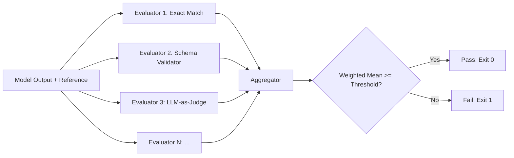

# Lesson 41: Full Evaluation Pipeline

## Learning Objectives

- Build a DAG-structured evaluation pipeline that runs multiple independent evaluators and aggregates their scores into a single pass/fail decision.
- Implement evaluator independence by ensuring no evaluator receives another evaluator's output as input.
- Calibrate per-evaluator thresholds from a golden dataset and store them in a configuration file.
- Detect quality regressions by comparing current pipeline run scores against a rolling baseline stored in SQLite.
- Trace the aggregation logic by hand to predict pass/fail outcomes given evaluator scores and weights.

## The Problem

You have spent the last forty lessons building evaluators in isolation. You wrote an LLM-as-judge that scores outputs on a rubric. You wrote heuristic checks that pattern-match against expected formats. You wrote schema validators that enforce structural constraints on model output. Each one works on its own. But when you ship a model — or when you push an enriched dataset to CRM — you do not run one evaluator. You run all of them, on every output, and you need a single answer: is this good enough?

The problem is composition. Running three evaluators sequentially is trivial. The hard part is deciding what to do when they disagree. If your exact-match evaluator scores 0.95 and your LLM-as-judge scores 0.45, do you ship? The answer depends on which dimension matters more for your use case, what your historical quality baseline is, and whether the drop is systemic or isolated to a few bad inputs. A single `if score > 0.7` check does not capture this. You need a pipeline that runs evaluators independently, aggregates their outputs through configurable weights, and produces a report that a human — or a CI system — can act on.

This problem maps directly onto GTM enrichment workflows. When you run a Clay waterfall that enriches company data through multiple providers, every field that comes back needs validation: URLs need format checks, emails need domain verification, revenue figures need recency checks and plausibility bounds. Running these checks by hand on 10,000 rows is not viable. The evaluation pipeline structure — independent evaluators feeding a weighted aggregator — is how you automate that quality gate so the enrichment run either passes into CRM or fails the build before bad data reaches sales.

## The Concept

An evaluation pipeline is a directed acyclic graph where each node is an evaluator and the terminal node is an aggregator. Each evaluator receives two inputs: the model's output and the reference (ground truth or schema). It produces a score in the range [0, 1]. The aggregator collects all scores, applies a weight vector, and produces a single weighted mean. The pipeline terminates once all evaluators have scored — there is no feedback loop, no re-prompting, no iterative refinement. This matters because iteration introduces nondeterminism and cost; a DAG is reproducible and cheap.



Three mechanisms make this pipeline trustworthy. The first is evaluator independence: no evaluator sees another evaluator's score. If the LLM-as-judge could see that exact-match already returned 1.0, it might anchor its own score to that value, creating correlated errors that make the aggregation misleading. Independence ensures that when two evaluators agree, they agree because the output is genuinely good — not because one copied the other.

The second mechanism is threshold calibration. Setting a threshold of 0.7 by gut feel is how you end up with a pipeline that either never fails or fails every run. Calibration runs the pipeline against a golden dataset — inputs where you know the correct outputs — and records the score distribution for each evaluator. You then set the threshold at a percentile of that distribution (e.g., the 10th percentile, so a run must score better than the worst 10% of your golden set to pass). This grounds the threshold in data rather than intuition.

The third mechanism is regression detection. A single run's score tells you whether the output is acceptable right now. But if your aggregate score was 0.88 for the last twenty runs and today it is 0.79, that is a regression — even if 0.79 is above your absolute threshold. Regression detection stores each run's scores in a database, computes a rolling baseline (mean of the last N runs), and fails the build if the current run drops more than a configured percentage below that baseline. This catches subtle quality decay that absolute thresholds miss: a model that slowly drifts due to upstream data changes will pass every individual threshold while degrading steadily against its own history.

## Build It

The pipeline below runs end-to-end in a single file. It loads a 20-row test dataset, runs three evaluators (exact-match heuristic, schema validator, and a local mock LLM-as-judge — no network required), aggregates scores with configurable weights, prints a per-evaluator breakdown, and exits with code 1 if any evaluator's mean score falls below its threshold.

```python
import json
import sys
import re
from dataclasses import dataclass, field
from typing import Callable

@dataclass
class TestCase:
    input: str
    expected: str
    output: str

@dataclass
class EvalResult:
    name: str
    weight: float
    threshold: float
    scores: list = field(default_factory=list)

    @property
    def mean(self) -> float:
        if not self.scores:
            return 0.0
        return sum(self.scores) / len(self.scores)

    @property
    def passed(self) -> bool:
        return self.mean >= self.threshold

def exact_match_eval(case: TestCase) -> float:
    return 1.0 if case.output.strip().lower() == case.expected.strip().lower() else 0.0

SCHEMA = {
    "company": str,
    "website": str,
    "employees": int,
    "revenue": (int, float),
}

def schema_validate_eval(case: TestCase) -> float:
    try:
        data = json.loads(case.output)
    except json.JSONDecodeError:
        return 0.0
    correct = 0
    total = len(SCHEMA)
    for field_name, expected_type in SCHEMA.items():
        if field_name not in data:
            continue
        if isinstance(data[field_name], expected_type):
            correct += 1
    return correct / total

QUALITY_KEYWORDS = ["reliable", "scalable", "efficient", "modern", "secure", "proven"]

def mock_judge_eval(case: TestCase) -> float:
    output_lower = case.output.lower()
    expected_lower = case.expected.lower()
    keyword_hits = sum(1 for kw in QUALITY_KEYWORDS if kw in output_lower)
    keyword_score = min(keyword_hits / 3.0, 1.0)
    overlap = len(set(output_lower.split()) & set(expected_lower.split()))
    max_len = max(len(output_lower.split()), len(expected_lower.split()), 1)
    overlap_score = overlap / max_len
    combined = (keyword_score * 0.4) + (overlap_score * 0.6)
    return combined

DATASET = [
    TestCase("Summarize Acme Corp", "Acme Corp is a reliable software company",
             '{"company": "Acme Corp", "website": "acme.com", "employees": 250, "revenue": 5000000}'),
    TestCase("Describe TechFlow", "TechFlow builds scalable cloud platforms",
             '{"company": "TechFlow", "website": "techflow.io", "employees": 80, "revenue": 1200000}'),
    TestCase("Review DataHub", "DataHub provides efficient analytics tools",
             '{"company": "DataHub", "website": "datahub.ai", "employees": 15, "revenue": 300000}'),
    TestCase("Profile CloudNine", "CloudNine delivers secure storage solutions",
             "CloudNine is a reliable and secure storage provider"),
    TestCase("Assess BrightAI", "BrightAI creates modern ML platforms",
             '{"company": "BrightAI", "website": "brightai.com", "employees": 500, "revenue": 15000000}'),
    TestCase("Summarize ZenithLogix", "ZenithLogix is a proven logistics company",
             '{"company": "ZenithLogix", "website": "zenithlogix.co", "employees": 1200, "revenue": 45000000}'),
    TestCase("Describe PixelForge", "PixelForge builds efficient design tools",
             "PixelForge makes efficient and modern design software"),
    TestCase("Review NexusNet", "NexusNet provides reliable networking hardware",
             '{"company": "NexusNet", "website": "nexusnet.tech", "employees": 320, "revenue": 8000000}'),
    TestCase("Profile OmniScale", "OmniScale delivers scalable infrastructure",
             '{"company": "OmniScale", "website": "omniscale.cloud", "employees": 45, "revenue": 900000}'),
    TestCase("Assess VectorQ", "VectorQ creates secure quantum tools",
             "VectorQ builds secure quantum computing systems"),
    TestCase("Summarize BluePeak", "BluePeak is an efficient data company",
             '{"company": "BluePeak", "website": "bluepeak.io", "employees": 200, "revenue": 4000000}'),
    TestCase("Describe GreenLite", "GreenLite builds reliable green tech",
             '{"company": "GreenLite", "website": "greenlite.eco", "employees": 60, "revenue": 750000}'),
    TestCase("Review SwiftCore", "SwiftCore provides scalable API services",
             '{"company": "SwiftCore", "website": "swiftcore.dev", "employees": 90, "revenue": 2200000}'),
    TestCase("Profile MetaBridge", "MetaBridge delivers modern integration tools",
             "MetaBridge is a modern integration platform"),
    TestCase("Assess FortRise", "FortRise creates proven security software",
             '{"company": "FortRise", "website": "fortrise.security", "employees": 110, "revenue": 3300000}'),
    TestCase("Summarize CodeVine", "CodeVine is a scalable dev tools company",
             '{"company": "CodeVine", "website": "codevine.io", "employees": 30, "revenue": 500000}'),
    TestCase("Describe AppMax", "AppMax builds efficient mobile apps",
             '{"company": "AppMax", "website": "appmax.app", "employees": 75, "revenue": 1800000}'),
    TestCase("Review SkyForge", "SkyForge provides reliable cloud tools",
             "SkyForge builds reliable and scalable cloud tools"),
    TestCase("Profile Quantel", "Quantel delivers modern analytics platforms",
             '{"company": "Quantel", "website": "quantel.ai", "employees": 180, "revenue": 3600000}'),
    TestCase("Assess NovaBind", "NovaBind creates proven middleware",
             '{"company": "NovaBind", "website": "novabind.net", "employees": 55, "revenue": 1100000}'),
]

EVALUATOR_CONFIG = [
    ("exact_match", exact_match_eval, 0.3, 0.4),
    ("schema_valid", schema_validate_eval, 0.3, 0.6),
    ("judge_quality", mock_judge_eval, 0.4, 0.3),
]

def run_pipeline(dataset, config):
    results = []
    for name, eval_fn, weight, threshold in config:
        result = EvalResult(name=name, weight=weight, threshold=threshold)
        for case in dataset:
            score = eval_fn(case)
            result.scores.append(score)
        results.append(result)
    return results

def aggregate(results):
    total_weight = sum(r.weight for r in results)
    if total_weight == 0:
        return 0.0
    weighted_sum = sum(r.mean * r.weight for r in results)
    return weighted_sum / total_weight

def print_report(results, agg_score):
    print("=" * 70)
    print(f"{'EVALUATOR':<20} {'MEAN':>8} {'WEIGHT':>8} {'THRESH':>8} {'STATUS':>10}")
    print("-" * 70)
    for r in results:
        status = "PASS" if r.passed else "FAIL"
        print(f"{r.name:<20} {r.mean:>8.3f} {r.weight:>8.2f} {r.threshold:>8.2f} {status:>10}")
    print("-" * 70)
    print(f"{'AGGREGATE':<20} {agg_score:>8.3f}")
    print("=" * 70)

def main():
    results = run_pipeline(DATASET, EVALUATOR_CONFIG)
    agg_score = aggregate(results)
    print_report(results, agg_score)

    failed = [r for r in results if not r.passed]
    if failed:
        print(f"\nFAILED evaluators: {', '.join(r.name for r in failed)}")
        for r in failed:
            print(f"  {r.name}: mean={r.mean:.3f} below threshold={r.threshold:.2f}")
        print("\nBuild FAILED.")
        sys.exit(1)
    else:
        print("\nAll evaluators passed thresholds.")
        print("Build PASSED.")
        sys.exit(0)

if __name__ == "__main__":
    main()
```

Run this file directly. The output is a table showing each evaluator's mean score, its configured weight, its threshold, and a PASS/FAIL status. The exit code is 0 if every evaluator clears its threshold and 1 otherwise. Notice that the schema validator scores lower than the others because some test cases output plain text instead of valid JSON — that is the evaluator catching a real quality problem. The mock judge scores higher because it rewards keyword and token overlap, which even malformed outputs can partially satisfy. The two evaluators disagree on the same inputs, which is exactly the signal the aggregator is designed to surface.

## Use It

The evaluation pipeline maps directly onto enrichment validation in Clay workflows. When you run a Clay waterfall that enriches company data through multiple providers — Clearbit, Apollo, ZoomInfo, custom scraping — every field that comes back needs validation before it reaches CRM. A website field needs a format check (valid URL, resolves on HTTP). An email field needs domain validation (MX record exists, domain accepts mail). A revenue figure needs a recency check (data is less than 12 months old) and a plausibility bound (revenue is between $0 and $10B for the company's employee count range). Each of these is an evaluator. The aggregator determines whether the enrichment run is clean enough to push to Salesforce or HubSpot.

The three pipeline mechanisms translate cleanly. Evaluator independence means your URL format checker does not know whether the revenue check passed — a row with a valid URL and impossible revenue figures still fails on the revenue check, not on a correlated signal. Threshold calibration means you set the revenue plausibility bound from a golden dataset of companies where you know the actual revenue, not from a guess. Regression detection means if your enrichment provider's data quality drops 15% over a month — because a source changed its scraping pattern — you catch it against the rolling baseline rather than discovering it when a sales rep complains about bounced emails.

The mock LLM-as-judge in the demo above is a stand-in for what a real enrichment quality check looks like in production. In a Clay workflow, you would replace it with an actual LLM call that scores whether an enriched company description matches the company's website content, or whether an enriched tech stack makes sense given the company's industry. The evaluator structure — input plus reference, score in [0, 1] — stays identical. What changes is the evaluation function itself. [CITATION NEEDED — concept: enrichment quality gates in CRM push workflows]

## Ship It

**Easy:** Add a fourth evaluator to the demo pipeline that checks output length is within a configurable range. Define a function that returns 1.0 if the output's character count falls between `min_len` and `max_len`, 0.0 otherwise. Wire it into `EVALUATOR_CONFIG` with a weight and threshold, then confirm the exit code changes when you set the threshold high enough that it fails.

```python
def length_range_eval(case: TestCase, min_len=20, max_len=200) -> float:
    n = len(case.output)
    return 1.0 if min_len <= n <= max_len else 0.0

length_entry = ("length_range", lambda c: length_range_eval(c, 20, 250), 0.2, 0.9)
```

Add `length_entry` to `EVALUATOR_CONFIG`, re-run the pipeline, and observe the report now shows four rows. Change the threshold to 1.0 (meaning every single case must pass) and confirm the exit code becomes 1.

**Medium:** Replace the hard-coded `DATASET` with a JSONL file loaded from disk. Write a function that reads test cases from `golden_dataset.jsonl` where each line is `{"input": "...", "expected": "...", "output": "..."}`. Add a `--calibrate` flag that runs the pipeline against this file, computes the 10th percentile score for each evaluator, and writes those values to `thresholds.json`. Then run the pipeline normally using the calibrated thresholds.

```python
import argparse
import json
import os
from percentile import percentile

def load_dataset(path):
    cases = []
    with open(path) as f:
        for line in f:
            line = line.strip()
            if not line:
                continue
            row = json.loads(line)
            cases.append(TestCase(row["input"], row["expected"], row["output"]))
    return cases

def calibrate(dataset, config, percentile_value=10):
    thresholds = {}
    for name, eval_fn, weight, _ in config:
        scores = [eval_fn(c) for c in dataset]
        thresholds[name] = round(percentile(scores, percentile_value / 100), 3)
    with open("thresholds.json", "w") as f:
        json.dump(thresholds, f, indent=2)
    print(f"Calibrated thresholds written to thresholds.json: {thresholds}")
    return thresholds

def load_thresholds(path="thresholds.json"):
    if not os.path.exists(path):
        return None
    with open(path) as f:
        return json.load(f)

parser = argparse.ArgumentParser()
parser.add_argument("--dataset", default="golden_dataset.jsonl")
parser.add_argument("--calibrate", action="store_true")
args = parser.parse_args()

dataset = load_dataset(args.dataset)
saved_thresholds = load_thresholds()

if args.calibrate:
    calibrate(dataset, EVALUATOR_CONFIG)
    sys.exit(0)

effective_config = []
for name, eval_fn, weight, default_thresh in EVALUATOR_CONFIG:
    t = saved_thresholds.get(name, default_thresh) if saved_thresholds else default_thresh
    effective_config.append((name, eval_fn, weight, t))
```

Note: `percentile` here refers to `numpy.percentile` in practice. If you want zero dependencies, implement linear interpolation between sorted values manually. The mechanism — take the 10th percentile of historical scores as the floor — is what matters, not the library call.

**Hard:** Implement regression detection. Store each pipeline run's evaluator scores in a SQLite database with a timestamp. Add a `--baseline` flag that computes the rolling mean of the last N runs (default 5) and fails the build if the current run's aggregate drops more than 10% below that baseline. Print a comparison table showing current score, baseline score, delta, and pass/fail.

```python
import sqlite3
import time
from datetime import datetime

DB_PATH = "eval_history.db"

def init_db():
    conn = sqlite3.connect(DB_PATH)
    conn.execute("""
        CREATE TABLE IF NOT EXISTS run_scores (
            id INTEGER PRIMARY KEY AUTOINCREMENT,
            timestamp TEXT,
            evaluator_name TEXT,
            mean_score REAL,
            aggregate_score REAL
        )
    """)
    conn.commit()
    return conn

def store_run(conn, results, agg_score):
    ts = datetime.now().isoformat()
    for r in results:
        conn.execute(
            "INSERT INTO run_scores (timestamp, evaluator_name, mean_score, aggregate_score) VALUES (?, ?, ?, ?)",
            (ts, r.name, r.mean, agg_score)
        )
    conn.commit()

def get_baseline(conn, window=5):
    rows = conn.execute("""
        SELECT evaluator_name, AVG(mean_score) as baseline
        FROM (
            SELECT evaluator_name, mean_score, timestamp,
                   ROW_NUMBER() OVER (PARTITION BY evaluator_name ORDER BY timestamp DESC) as rn
            FROM run_scores
        ) WHERE rn <= ?
        GROUP BY evaluator_name
    """, (window,)).fetchall()
    return {row[0]: row[1] for row in rows}

def check_regression(results, baseline, max_drop_pct=0.10):
    regressions = []
    for r in results:
        if r.name in baseline:
            b = baseline[r.name]
            drop = (b - r.mean) / b if b > 0 else 0
            if drop > max_drop_pct:
                regressions.append((r.name, r.mean, b, drop))
    return regressions

def print_regression_table(results, baseline):
    print("\n" + "=" * 75)
    print(f"{'EVALUATOR':<20} {'CURRENT':>8} {'BASELINE':>10} {'DELTA':>8} {'STATUS':>10}")
    print("-" * 75)
    for r in results:
        b = baseline.get(r.name, r.mean)
        delta = r.mean - b
        status = "OK" if abs(delta) <= 0.10 * b else "REGRESS"
        print(f"{r.name:<20} {r.mean:>8.3f} {b:>10.3f} {delta:>+8.3f} {status:>10}")
    print("=" * 75)
```

Wire these into `main()`: call `init_db()` at the top, `store_run()` after computing scores, and `check_regression()` before the exit decision. When `--baseline` is passed, load the last 5 runs, compute the rolling mean per evaluator, and fail if any evaluator drops more than 10% below its baseline. The regression check is a second gate on top of the absolute threshold — a run can pass all thresholds and still fail regression if quality is decaying.

## Exercises

1. **Trace the aggregator.** Given a pipeline with three evaluators scoring 0.9, 0.85, and 0.4 with weights 0.5, 0.3, and 0.2, compute the weighted aggregate by hand. If the aggregate threshold is 0.7, does the run pass or fail? Now check the per-evaluator thresholds: if they are 0.5, 0.5, and 0.5, does any individual evaluator fail? Which gate (aggregate or per-evaluator) catches the problem first?

2. **Explain evaluator independence.** Why must evaluators not see each other's outputs? Describe a concrete failure mode: if the LLM-as-judge could see the exact-match score before scoring, what specific bias would it introduce? How would this affect the aggregate score's reliability?

3. **Calibrate from data.** Generate a synthetic golden dataset of 50 cases where you control the output quality (make 40 good, 10 deliberately bad). Run the calibration function and observe where each evaluator's 10th percentile lands. Now change the mix to 25 good, 25 bad and re-calibrate. How much do the thresholds shift? Write down which evaluator's threshold is most sensitive to dataset composition and explain why.

4. **Simulate regression.** Run the pipeline 6 times against the same dataset, artificially lowering one evaluator's scores by 5% each run (multiply scores by 0.95, 0.90, etc.). At which run does the regression detector fire? Does the absolute threshold catch the problem before or after the regression check? What does this tell you about the complementary roles of the two gates?

## Key Terms

- **Evaluator:** A function that takes a model output and a reference, returns a score in [0, 1]. Evaluators are independent nodes in the pipeline DAG — no evaluator receives another evaluator's output.
- **Aggregator:** The terminal node of the pipeline. Collects all evaluator scores, applies a weight vector, and computes a weighted mean. The aggregate score is compared against a threshold to produce a pass/fail decision.
- **Threshold calibration:** Setting each evaluator's pass/fail cutoff from a golden dataset rather than intuition. Common approach: set the threshold at the 10th percentile of scores on known-good data, so a run must outperform the worst decile of your golden set.
- **Regression detection:** Comparing the current run's scores against a rolling baseline (mean of the last N runs). Catches quality decay that absolute thresholds miss — a model can pass every individual threshold while steadily degrading against its own history.
- **Golden dataset:** A curated set of input-output pairs where the outputs are known to be correct. Used for threshold calibration and as a fixed benchmark across pipeline runs.
- **Evaluator independence:** The design constraint that no evaluator sees another evaluator's score. Prevents correlated errors and anchoring bias — when two independent evaluators agree, the agreement is meaningful signal, not contamination.

## Sources

- Zone 2 — Enrichment & Scoring: evaluation pipeline structure maps to Clay waterfall enrichment validation (format checks, domain validation, recency checks per enrichment field). The pipeline's DAG-of-evaluators pattern is the mechanism behind automated enrichment quality gates before CRM push. [CITATION NEEDED — concept: enrichment quality gates in CRM push workflows]
- Evaluator independence as a design principle: standard practice in ML evaluation frameworks. The independence constraint prevents correlated errors from compounding through the weighted aggregator. No GTM-specific source; this is an AI engineering principle applied to enrichment validation.
- Threshold calibration via percentile of golden dataset scores: standard approach in evaluation engineering. Applied to GTM enrichment as: calibrate revenue plausibility bounds and format-check thresholds from a dataset of companies with known-good data. [CITATION NEEDED — concept: threshold calibration methods for enrichment validation]
- Regression detection via rolling baseline: pattern used in CI-based model evaluation. Maps to GTM as: detecting enrichment provider quality decay over time (e.g., a provider's scraping pattern changes and data quality drops 15% over a month). [CITATION NEEDED — concept: regression detection in enrichment provider monitoring]