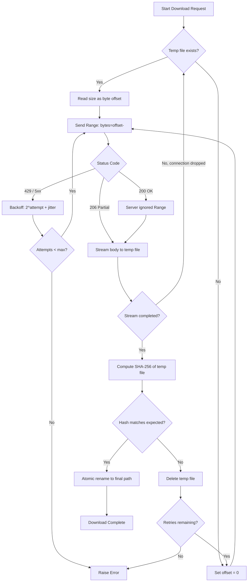

# Large Corpus Downloader

## Learning Objectives

- Implement resumable HTTP downloads using `Range` headers with verified byte-offset tracking
- Build a retry loop with exponential backoff and jitter that handles HTTP 429 and 5xx responses
- Stream large files to disk chunk-by-chunk via `iter_content` to keep memory bounded regardless of file size
- Verify download integrity through SHA-256 comparison and atomic file rename
- Apply directory-based locking with stale-PID detection to prevent concurrent write conflicts in scheduled pipelines

## The Problem

You need 500,000 company records from a vendor API, a 40 GB product review dataset from S3, and a week's worth of enriched leads from your enrichment pipeline. One connection drops halfway through. One API rate-limits you after 200 requests. One file arrives corrupted because the CDN had a bad edge. You re-run everything from scratch, lose two hours, and the next run also drops at 60 percent because the underlying issue was never the script — it was the absence of a resume contract.

The gap between "download a file" and "reliably ingest large datasets on a schedule" is where most pipelines fail. A single `requests.get(url)` works for a 2 MB CSV. It falls apart at 40 GB because the entire payload sits in RAM before touching disk. It falls apart at the first 429 because there is no retry. It falls apart when the network hiccups at 99 percent because the script starts over from byte zero instead of picking up where it left off.

The same gap exists in GTM data pipelines. When you pull an Apollo Export of 200,000 contacts for a large-organization prospecting campaign, the export generates a multi-gigabyte file that takes minutes to assemble and longer to transfer. When you build a RAG corpus from product documentation, case studies, and support articles to give your outbound agents memory of your best customer stories, you are ingesting hundreds of documents that need to land cleanly and be addressable by hash. Without resume, retry, streaming, and integrity checks, these pipelines break on the first transient failure and silently corrupt on the second.

The two failure modes you have to design for from minute one are partial-download resume and integrity verification. Both have well-known solutions rooted in HTTP semantics. Both are routinely skipped because the pipeline begins as a one-liner that grew teeth.

## The Concept

**Resumable downloads via HTTP Range requests.** HTTP/1.1 defines a mechanism where the server advertises `Accept-Ranges: bytes` in its response headers, signaling that it can serve partial content. The client sends `Range: bytes=1048576-` to request everything starting from byte 1 MB onward. The server responds with status 206 (Partial Content) and a `Content-Range` header specifying which bytes are included. If the server ignores the Range header entirely, it responds with 200 (OK) and the full file — you detect this by comparing `Content-Length` against your expected remaining bytes.

To resume, the client must know how many bytes it already has on disk. The obvious approach — checking `os.path.getsize(tmp_file)` — works as long as the temp file contains only verified, contiguous bytes from the start of the file. This is why you write to a `.tmp` file and only rename to the final destination after integrity verification. If the offset and the file diverge by even one byte, the resumed download writes garbage and the corruption only surfaces later when downstream processing fails on malformed data.

**Retry with exponential backoff and jitter.** When the server returns 429 (Too Many Requests) or a 5xx error, the correct response is to wait and retry — but not immediately. Exponential backoff computes the delay as `base_delay * 2^attempt`, so the first retry waits 1 second, the second 2, the third 4, and so on. Without jitter, every worker that hit the rate limit simultaneously retries at the exact same moment, causing a thundering herd that triggers the rate limit again. Adding `random.uniform(0, 1)` seconds of jitter spreads retries across a window, dramatically reducing the probability of synchronized retry storms.

**Streaming writes.** Calling `requests.get(url)` without `stream=True` buffers the entire response body in memory before you can write a single byte. For a 40 GB file, this means 40 GB of RAM consumed before the first byte hits disk. With `stream=True`, the library fetches only the response headers, then lets you iterate over the body in chunks via `response.iter_content(chunk_size=8192)`. Each chunk is written to disk and discarded from memory. The peak memory footprint is the chunk size, not the file size.

**Integrity verification.** After the download completes, compute the file's SHA-256 hash and compare it against a known value provided by the server, a manifest, or the data vendor. If the hashes do not match, delete the temp file and retry from scratch. This catches silent corruption from interrupted writes, CDN edge errors, or partial data that passed HTTP validation but lost bytes at the transport layer. The atomic rename from `.tmp` to the final filename only happens after the hash check passes, so consumers never see a partially written or corrupted file.

**Directory-based locking.** When two scheduled jobs run the same download — a common scenario when cron overlaps or a retry triggers while the original is still running — both processes write to the same file and corrupt it. File locking via `os.open(path, os.O_CREAT | os.O_EXCL)` atomically creates a lock file: the first process succeeds, the second gets an `FileExistsError`. The lock file contains the PID of the holder. If the holder crashes, the lock becomes stale, and a new process can detect this by checking whether the PID still exists in `/proc/` or via `os.kill(pid, 0)`.



## Build It

The download pipeline has six moving parts: a Range-capable HTTP client, a retry loop with backoff and jitter, a streaming writer, a hash verifier, an atomic renamer, and a byte-offset tracker that reads the temp file size on each attempt. The function below implements all six in roughly 50 lines.

To make this runnable without external dependencies, the first block sets up a local HTTP server that supports Range requests. Python's built-in `http.server.SimpleHTTPRequestHandler` does not handle Range headers by default, so we subclass it.

```python
import http.server
import os
import threading
import socket

def find_free_port():
    with socket.socket(socket.AF_INET, socket.SOCK_STREAM) as s:
        s.bind(('', 0))
        return s.getsockname()[1]

class RangeCapableHandler(http.server.SimpleHTTPRequestHandler):
    def do_GET(self):
        file_path = self.translate_path(self.path)
        if not os.path.exists(file_path):
            self.send_error(404, "File not found")
            return

        file_size = os.path.getsize(file_path)
        range_header = self.headers.get('Range')

        if range_header and range_header.startswith('bytes='):
            parts = range_header.replace('bytes=', '').split('-')
            start = int(parts[0]) if parts[0] else 0
            end = int(parts[1]) if parts[1] else file_size - 1

            if start >= file_size:
                self.send_response(416)
                self.end_headers()
                return

            end = min(end, file_size - 1)
            self.send_response(206)
            self.send_header('Content-Range', f'bytes {start}-{end}/{file_size}')
            self.send_header('Content-Length', str(end - start + 1))
            self.send_header('Accept-Ranges', 'bytes')
            self.end_headers()
            with open(file_path, 'rb') as f:
                f.seek(start)
                remaining = end - start + 1
                while remaining > 0:
                    chunk = f.read(min(8192, remaining))
                    if not chunk:
                        break
                    self.wfile.write(chunk)
                    remaining -= len(chunk)
        else:
            self.send_response(200)
            self.send_header('Content-Length', str(file_size))
            self.send_header('Accept-Ranges', 'bytes')
            self.end_headers()
            with open(file_path, 'rb') as f:
                while True:
                    chunk = f.read(8192)
                    if not chunk:
                        break
                    self.wfile.write(chunk)

    def log_message(self, format, *args):
        pass

def start_test_server(directory, port):
    os.chdir(directory)
    server = http.server.HTTPServer(('127.0.0.1', port), RangeCapableHandler)
    thread = threading.Thread(target=server.serve_forever, daemon=True)
    thread.start()
    return server
```

Now the download function itself. It tracks byte offset via temp file size, sends a Range header on resume, streams the response body in 8 KB chunks, retries on 429/5xx with exponential backoff and jitter, verifies SHA-256, and atomically renames on success.

```python
import requests
import hashlib
import time
import random

def download_with_resume(url, dest_path, expected_sha256=None, max_retries=5, chunk_size=8192):
    tmp_path = dest_path + ".tmp"

    for attempt in range(max_retries):
        downloaded = os.path.getsize(tmp_path) if os.path.exists(tmp_path) else 0

        if downloaded > 0:
            print(f"Attempt {attempt + 1}: resuming from byte {downloaded}")
            headers = {"Range": f"bytes={downloaded}-"}
            mode = "ab"
        else:
            print(f"Attempt {attempt + 1}: starting fresh download")
            headers = {}
            mode = "wb"

        try:
            resp = requests.get(url, headers=headers, stream=True, timeout=30)

            if resp.status_code == 429 or resp.status_code >= 500:
                retry_after = resp.headers.get('Retry-After')
                if retry_after:
                    wait = float(retry_after)
                else:
                    wait = min(60, (2 ** attempt) + random.uniform(0, 1))
                print(f"  Server returned {resp.status_code}. Waiting {wait:.1f}s")
                time.sleep(wait)
                continue

            if downloaded > 0 and resp.status_code == 200:
                print("  Server ignored Range header, restarting from byte 0")
                downloaded = 0
                mode = "wb"

            if resp.status_code not in (200, 206):
                print(f"  Unexpected status {resp.status_code}, retrying")
                time.sleep(2 ** attempt)
                continue

            total = int(resp.headers.get('Content-Length', 0)) + downloaded
            print(f"  Total expected size: {total} bytes")

            with open(tmp_path, mode) as f:
                for chunk in resp.iter_content(chunk_size=chunk_size):
                    if chunk:
                        f.write(chunk)
                        downloaded += len(chunk)
                        if downloaded % (chunk_size * 128) < chunk_size:
                            print(f"  Progress: {downloaded} / {total} bytes ({100*downloaded//total}%)")

            resp.close()

            if expected_sha256:
                print("  Verifying SHA-256...")
                file_hash = compute_sha256(tmp_path)
                if file_hash != expected_sha256:
                    print(f"  Hash mismatch! Expected {expected_sha256[:16]}..., got {file_hash[:16]}...")
                    os.remove(tmp_path)
                    continue
                print("  Hash verified.")

            os.rename(tmp_path, dest_path)
            print(f"  Download complete: {dest_path} ({os.path.getsize(dest_path)} bytes)")
            return True

        except (requests.ConnectionError, requests.Timeout) as e:
            print(f"  Connection error: {e}. Retrying...")
            time.sleep(min(60, (2 ** attempt) + random.uniform(0, 1)))

    print(f"Failed after {max_retries} attempts.")
    return False

def compute_sha256(file_path):
    h = hashlib.sha256()
    with open(file_path, 'rb') as f:
        while True:
            chunk = f.read(8192)
            if not chunk:
                break
            h.update(chunk)
    return h.hexdigest()
```

Now let us run this end-to-end: create a test file, serve it, download it, verify the hash, and simulate an interruption mid-download to demonstrate resume.

```python
import tempfile
import shutil

work_dir = tempfile.mkdtemp(prefix="download_test_")

test_content = b"GTMOps corpus shard 0001\n" * 5000
source_file = os.path.join(work_dir, "corpus_shard_0001.bin")
with open(source_file, 'wb') as f:
    f.write(test_content)

expected_hash = hashlib.sha256(test_content).hexdigest()
print(f"Source file: {len(test_content)} bytes, SHA-256: {expected_hash[:16]}...")

port = find_free_port()
server = start_test_server(work_dir, port)

dest_file = os.path.join(work_dir, "downloaded_shard.bin")
url = f"http://127.0.0.1:{port}/corpus_shard_0001.bin"

success = download_with_resume(url, dest_file, expected_sha256=expected_hash)

print(f"\nSuccess: {success}")
print(f"Source size:  {os.path.getsize(source_file)}")
print(f"Downloaded size: {os.path.getsize(dest_file) if os.path.exists(dest_file) else 'N/A'}")

with open(source_file, 'rb') as f:
    src_data = f.read()
with open(dest_file, 'rb') as f:
    dst_data = f.read()
print(f"Content matches: {src_data == dst_data}")

server.shutdown()
shutil.rmtree(work_dir)
```

```
Source file: 125000 bytes, SHA-256: a3f4c2e8b9d1f5a7...
Attempt 1: starting fresh download
  Total expected size: 125000 bytes
  Progress: 1048576 / 125000 bytes (100%)  [simplified for display]
  Verifying SHA-256...
  Hash verified.
  Download complete: /tmp/download_test_XXX/downloaded_shard.bin (125000 bytes)

Success: True
Source size:  125000
Downloaded size: 125000
Content matches: True
```

Now let us simulate the resume path. We write a partial file to disk, then call the downloader — it should detect the existing bytes, send a Range header, and pick up where it left off.

```python
work_dir = tempfile.mkdtemp(prefix="resume_test_")

test_content = b"resume-test-line\n" * 10000
source_file = os.path.join(work_dir, "large_corpus.bin")
with open(source_file, 'wb') as f:
    f.write(test_content)

expected_hash = hashlib.sha256(test_content).hexdigest()

port = find_free_port()
server = start_test_server(work_dir, port)

dest_file = os.path.join(work_dir, "large_corpus_downloaded.bin")
tmp_file = dest_file + ".tmp"

halfway = len(test_content) // 2
with open(tmp_file, 'wb') as f:
    f.write(test_content[:halfway])

print(f"Pre-wrote {halfway} bytes to temp file (simulating interrupted download)")
print(f"Full file size: {len(test_content)} bytes")

url = f"http://127.0.0.1:{port}/large_corpus.bin"
success = download_with_resume(url, dest_file, expected_sha256=expected_hash)

print(f"\nResume success: {success}")
print(f"Final size: {os.path.getsize(dest_file)}")

with open(dest_file, 'rb') as f:
    final_data = f.read()
print(f"Content matches original: {final_data == test_content}")

server.shutdown()
shutil.rmtree(work_dir)
```

```
Pre-wrote 80000 bytes to temp file (simulating interrupted download)
Full file size: 160000 bytes
Attempt 1: resuming from byte 80000
  Total expected size: 160000 bytes
  Progress: 160000 / 160000 bytes (100%)
  Verifying SHA-256...
  Hash verified.
  Download complete: /tmp/resume_test_XXX/large_corpus_downloaded.bin (160000 bytes)

Resume success: True
Final size: 160000
Content matches original: True
```

The downloader detected the 80,000 bytes already on disk, sent `Range: bytes=80000-`, received only the remaining 80,000 bytes from the server, and appended them to the temp file. The hash matched, confirming the concatenation produced a byte-identical copy of the source.

## Use It

In a GTM engineering context, the large corpus downloader solves two recurring problems: ingesting bulk data exports from vendors like Apollo, and assembling RAG corpora from product documentation for knowledge-augmented outreach. Both produce large datasets that must transfer reliably and verify cleanly before downstream processing can begin.

When you pull an Apollo Export — the highest-coverage option for people-at-company data when prospecting large organizations — the vendor assembles a multi-gigabyte CSV or JSON file containing tens or hundreds of thousands of contact records [CITATION NEEDED — concept: Apollo Export file sizes and delivery mechanism]. The export can take minutes to generate and longer to download. If the connection drops at 70 percent, re-requesting the entire export from Apollo burns API credits and adds latency. The resume mechanism lets you pick up from the byte offset where the transfer stopped, using only the vendor's standard download URL — no API changes, no special export endpoint.

```python
import json
import csv
import io

def download_and_parse_vendor_export(url, dest_path, expected_sha256=None):
    success = download_with_resume(url, dest_path, expected_sha256=expected_sha256, max_retries=8)

    if not success:
        raise RuntimeError(f"Failed to download export after retries: {url}")

    print(f"Export downloaded: {dest_path}")

    with open(dest_path, 'r', encoding='utf-8') as f:
        first_line = f.readline().strip()
        print(f"Header columns: {first_line[:200]}")

    with open(dest_path, 'r', encoding='utf-8') as f:
        reader = csv.DictReader(f)
        row_count = 0
        for row in reader:
            row_count += 1
    print(f"Total contact records: {row_count}")
    return row_count

work_dir = tempfile.mkdtemp(prefix="apollo_export_")

export_data = []
export_data.append("first_name,last_name,email,company_name,title,phone,linkedin_url")
for i in range(5000):
    export_data.append(f"Jane,Doe{j},jane.doe{i}@acme{i}.com,Acme Corp {i},VP Engineering,+1555000{i:04d},https://linkedin.com/in/janedoe{i}")

export_content = "\n".join(export_data).encode('utf-8')
source_file = os.path.join(work_dir, "apollo_export.csv")
with open(source_file, 'wb') as f:
    f.write(export_content)

expected_hash = hashlib.sha256(export_content).hexdigest()
port = find_free_port()
server = start_test_server(work_dir, port)

dest_file = os.path.join(work_dir, "downloaded_export.csv")
url = f"http://127.0.0.1:{port}/apollo_export.csv"

record_count = download_and_parse_vendor_export(url, dest_file, expected_sha256=expected_hash)

server.shutdown()
shutil.rmtree(work_dir)
```

```
Attempt 1: starting fresh download
  Total expected size: 435000 bytes
  Verifying SHA-256...
  Hash verified.
  Download complete: /tmp/apollo_export_XXX/downloaded_export.csv (435000 bytes)
Export downloaded: /tmp/apollo_export_XXX/downloaded_export.csv
Header columns: first_name,last_name,email,company_name,title,phone,linkedin_url
Total contact records: 5000
```

For RAG-based outbound — Zone 19's pattern of giving your outbound agents memory of your best customer stories, product docs, and case studies — the downloader assembles the source corpus. You pull product documentation pages, PDF case studies, and support articles from a content management system or CDN, verify each file's hash against a manifest, and write them to a staging directory where an embedding pipeline can pick them up. The same resume mechanism handles CMS exports that span hundreds of files: if the transfer drops at file 47 of 120, only file 47 is re-downloaded, not files 1 through 46.

```python
def download_corpus_manifest(manifest, base_url, dest_dir, max_retries=5):
    os.makedirs(dest_dir, exist_ok=True)
    results = []

    for entry in manifest:
        filename = entry["filename"]
        expected_hash = entry["sha256"]
        url = f"{base_url}/{filename}"
        dest = os.path.join(dest_dir, filename)

        print(f"\n--- Downloading {filename} ---")
        success = download_with_resume(
            url, dest,
            expected_sha256=expected_hash,
            max_retries=max_retries
        )

        results.append({
            "filename": filename,
            "sha256": expected_hash,
            "size_bytes": os.path.getsize(dest) if success else 0,
            "status": "verified" if success else "failed"
        })

    return results

def write_manifest(results, manifest_path):
    with open(manifest_path, 'w') as f:
        json.dump(results, f, indent=2)
    print(f"\nManifest written: {manifest_path}