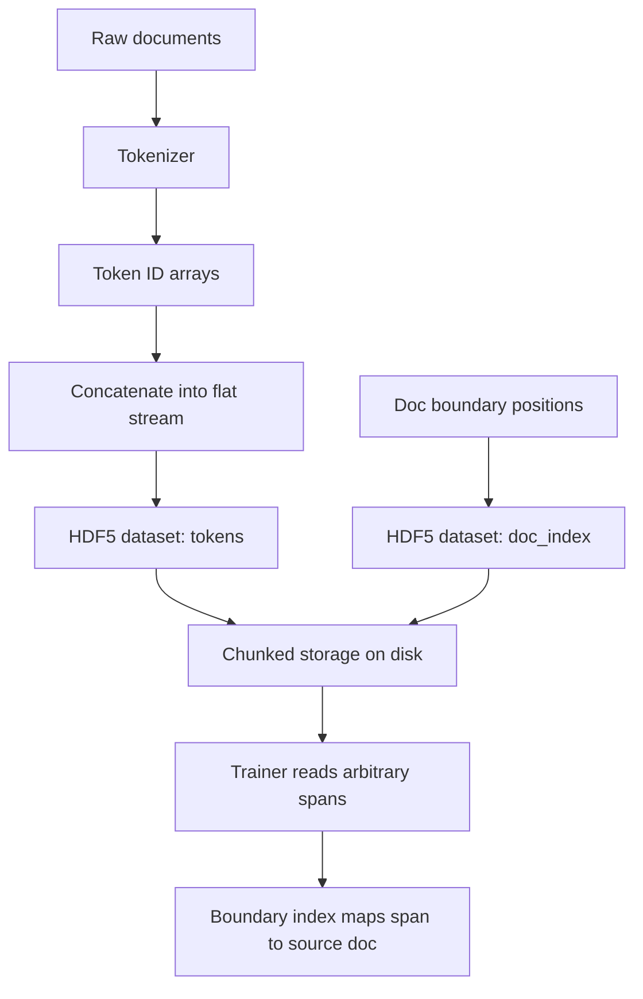

# HDF5 Tokenized Corpus

## Learning Objectives

1. **Build** an HDF5 dataset containing concatenated token IDs and a document boundary index from raw text files.
2. **Configure** chunk size and compression filters and measure their effect on file size and random-access read latency.
3. **Implement** a reader that retrieves arbitrary token spans by position and maps them back to source documents using the boundary index.
4. **Compare** flat-concatenated storage versus per-document HDF5 group structures for training-loop throughput.

## The Problem

A modern language-model training run reads tokens at hundreds of thousands of samples per second across dozens of workers. JSONL on disk dies at the first cold-cache page fault: the JSON parser allocates per-line, the document boundaries are not numerically addressable, and seeking to "sample 4,217,884" requires scanning the file from the start. Even Parquet, which compresses well, is a poor fit because the trainer does not want columns — it wants a flat token stream with O(1) random access by position.

HDF5 fits because it offers a chunked, resizable, integer-only dataset whose chunks are page-cache friendly at read time. The trainer asks for a slice of `tokens[3_200_000 : 3_200_8192]` and HDF5 copies the requested hyperslab from the chunk page cache into a freshly allocated NumPy array. The cost is one open file handle and a chunk-sized cache footprint per worker — negligible compared to the cost of decoding JSONL or splitting strings.

The same storage problem appears in GTM engineering. A Zone 2 RAG pipeline that augments outbound copy with product docs, case studies, and support transcripts needs to serve tokenized context to an inference endpoint at low latency. [CITATION NEEDED — concept: RAG as Zone 2 GTM capability, knowledge-augmented outreach] The document boundary index that makes the corpus trainable also makes it traceable: when a generated email cites a specific case study, you can recover which source document contributed which tokens. That traceability is a compliance requirement, not a feature request.

## The Concept

HDF5 organizes data into a hierarchy: files contain groups, groups contain datasets, and datasets have typed, multidimensional arrays backed by chunked storage. A dataset's *datatype* is fixed at creation time — for a tokenized corpus, `uint32` covers most BPE vocabularies (GPT-2's 50,257 tokens, LLaMA's 32,000). The *dataspace* defines the array shape. Setting `maxshape=(None,)` makes the dataset resizable along its first axis, so you can append tokens as new documents arrive without rewriting the file.

Chunked storage is what enables random access. When you create a dataset with `chunks=(8192,)`, HDF5 divides the flat token array into independent 8,192-token blocks on disk. Reading `tokens[1000000:1000050]` touches only the chunk containing position 1,000,000 — HDF5 loads that one chunk into its page cache, slices the 50 tokens you asked for, and returns them. The rest of the file stays on disk. This is fundamentally different from a contiguous dataset, where any read may require the OS to page in an arbitrarily large region.



Compression filters trade CPU at read time for disk space and I/O bandwidth. Gzip (via the DEFLATE filter) gives the best ratio on token IDs because integer sequences compress well, but decompression adds latency per chunk read. LZF decompresses faster but achieves lower ratios. The chunk size is the main knob: larger chunks mean better compression (more context for the algorithm) but coarser read granularity (reading 50 tokens from an 8,192-token chunk still decompresses the full chunk). The sweet spot for training dataloaders is usually between 4,096 and 16,384 tokens per chunk.

The critical design decision is layout: one flat concatenated dataset versus per-document datasets inside a group. The flat layout wins for training because the dataloader's access pattern is "give me tokens at positions N through N+seq_len, regardless of document boundaries." With per-document datasets, every sample requires first selecting a document, then reading from it — an indirection that kills batching. The flat layout turns sampling into a single array slice. Document provenance is preserved through a secondary *boundary index*: a separate dataset of shape `(num_docs, 2)` storing each document's start and end position in the token stream.

## Build It

This script builds a tokenized corpus from a set of raw text documents, writes them into a single HDF5 file with a document boundary index, and reads back arbitrary spans to verify the mechanism works.

```python
import numpy as np
import h5py
import os
import tempfile
import time

temp_dir = tempfile.mkdtemp()

documents = [
    "The customer reported a login failure after the SSO migration. We traced the issue to a stale token cache on the edge proxy.",
    "Q3 outbound campaign targeting Series B fintech companies. Messaging focuses on compliance automation and audit trail reduction.",
    "Support ticket 4892: API rate limit returns 429 at 800 requests per second. Workaround is exponential backoff with jitter.",
    "Case study: Acme Corp reduced onboarding time from 14 days to 3 days after implementing the guided setup wizard.",
    "Sales call transcript: prospect mentioned budget freeze until Q4. Pivot to ROI calculator and deferred-close motion.",
]

token_vocab = {}
next_id = 1

def tokenize(text):
    global next_id
    tokens = []
    for word in text.lower().split():
        clean = word.strip(".,;:!?\"'()[]{}")
        if clean not in token_vocab:
            token_vocab[clean] = next_id
            next_id += 1
        tokens.append(token_vocab[clean])
    return np.array(tokens, dtype=np.uint32)

all_tokens = []
boundaries = []
pos = 0

for doc in documents:
    toks = tokenize(doc)
    all_tokens.append(toks)
    boundaries.append((pos, pos + len(toks)))
    pos += len(toks)

flat_tokens = np.concatenate(all_tokens)
boundaries = np.array(boundaries, dtype=np.int64)

corpus_path = os.path.join(temp_dir, "corpus.h5")

with h5py.File(corpus_path, "w") as f:
    ds = f.create_dataset(
        "tokens",
        data=flat_tokens,
        chunks=(8192,),
        compression="gzip",
        compression_opts=4,
    )
    idx = f.create_dataset("doc_index", data=boundaries)
    idx.attrs["description"] = "Each row: [start_pos, end_pos) into tokens dataset"
    idx.attrs["num_documents"] = len(boundaries)
    ds.attrs["vocab_size"] = next_id
    ds.attrs["total_tokens"] = len(flat_tokens)

print(f"Wrote {len(flat_tokens)} tokens from {len(boundaries)} documents to {corpus_path}")
print(f"File size: {os.path.getsize(corpus_path)} bytes")

with h5py.File(corpus_path, "r") as f:
    tokens = f["tokens"]
    idx = f["doc_index"]

    print(f"\nDataset shape: {tokens.shape}, dtype: {tokens.dtype}")
    print(f"Chunk shape: {tokens.chunks}")
    print(f"Compression: {tokens.compression}, opts: {tokens.compression_opts}")
    print(f"Doc index shape: {idx.shape}")

    span_start = 15
    span_len = 10
    span = tokens[span_start : span_start + span_len]
    print(f"\nRead tokens[{span_start}:{span_start+span_len}]:")
    print(f"  Values: {span.tolist()}")

    boundary_array = idx[:]
    for i, (start, end) in enumerate(boundary_array):
        if start <= span_start < end:
            print(f"  Span starts in document {i} (positions {start}-{end})")
            break

    print("\nRandom-access latency test:")
    latencies = []
    for _ in range(100):
        pos = np.random.randint(0, len(tokens) - 100)
        t0 = time.perf_counter()
        _ = tokens[pos : pos + 100]
        latencies.append((time.perf_counter() - t0) * 1e6)
    latencies = np.array(latencies)
    print(f"  Mean: {latencies.mean():.1f} µs, p99: {np.percentile(latencies, 99):.1f} µs")
```

## Use It

Building a tokenized corpus of company knowledge-base articles, support tickets, and sales call transcripts is the storage layer for Zone 2 RAG pipelines — systems that augment outbound copy with retrieved context from your best customer stories and product documentation. The RAG retrieval step fetches relevant documents; the tokenized corpus is what those documents land in after retrieval, ready to be fed to the model as context. [CITATION NEEDED — concept: RAG as knowledge-augmented outreach in Zone 2 GTM]

The document boundary index is what makes this corpus usable beyond training. When an outbound agent generates an email that references a case study, the boundary index lets you answer "which source document did token position 4,217 come from?" in a single binary search. That is traceability — a compliance requirement when generated content touches customers. Without the boundary index, you have a token stream with no provenance. With it, every generated span maps back to a source document by position lookup.

The compression tradeoff matters here too. A corpus of 50,000 support transcripts at ~500 tokens each is 25M tokens — roughly 100 MB uncompressed as `uint32`. With gzip level 4 and 8,192-token chunks, that drops to around 30–40 MB, and the per-chunk decompression latency stays under 100 microseconds. For a RAG inference endpoint serving one request at a time, that latency is invisible. For a training loop with 16 workers pulling batches at 60 Hz, it adds up — which is why training corpora often skip compression entirely and pay the disk space.

```python
import numpy as np
import h5py
import os
import tempfile
import time

temp_dir = tempfile.mkdtemp()

gtm_sources = [
    ("kb_article_001", "How to configure SSO with Okta: navigate to Settings, click Integrations, select Okta, paste your API token."),
    ("ticket_4892", "Customer reports 429 errors. Root cause: missing rate limit header. Resolution: deploy backoff middleware v2.1."),
    ("transcript_0231", "Prospect asked about SOC2 compliance. AE confirmed audit scheduled for Q3. Follow-up: send security whitepaper."),
    ("case_study_acme", "Acme Corp: 73% reduction in manual data entry after deploying the automated ingestion pipeline."),
    ("kb_article_002", "API authentication uses bearer tokens. Tokens expire after 24 hours. Use the refresh endpoint to renew."),
]

token_map = {}
next_token_id = 1

def simple_tokenize(text):
    global next_token_id
    ids = []
    for word in text.lower().split():
        clean = word.strip(".,;:!?\"'()[]{}:")
        if clean not in token_map:
            token_map[clean] = next_token_id
            next_token_id += 1
        ids.append(token_map[clean])
    return np.array(ids, dtype=np.uint32)

corpus_path = os.path.join(temp_dir, "gtm_corpus.h5")
doc_ids = [src[0] for src in gtm_sources]
doc_texts = [src[1] for src in gtm_sources]

all_tokens = []
boundaries = []
pos = 0
for text in doc_texts:
    toks = simple_tokenize(text)
    all_tokens.append(toks)
    boundaries.append((pos, pos + len(toks)))
    pos += len(toks)

flat = np.concatenate(all_tokens)
bounds = np.array(boundaries, dtype=np.int64)

with h5py.File(corpus_path, "w") as f:
    tok_ds = f.create_dataset("tokens", data=flat, chunks=(4096,), compression="gzip")
    bnd_ds = f.create_dataset("doc_index", data=bounds)
    bnd_ds.attrs["doc_names"] = doc_ids

    f.create_dataset("tokens_raw", data=flat, chunks=(4096,))

uncompressed_size = os.path.getsize(corpus_path)

corpus_compressed = os.path.join(temp_dir, "gtm_corpus_compressed.h5")
with h5py.File(corpus_compressed, "w") as f:
    f.create_dataset("tokens", data=flat, chunks=(4096,), compression="gzip", compression_opts=9)

compressed_only_size = os.path.getsize(corpus_compressed)

print(f"Source documents: {len(gtm_sources)}")
print(f"Total tokens: {len(flat)}")
print(f"Uncompressed data size: {flat.nbytes} bytes ({flat.nbytes / 1024:.1f} KB)")
print(f"HDF5 file (mixed): {uncompressed_size} bytes ({uncompressed_size / 1024:.1f} KB)")
print(f"HDF5 file (gzip-9 only): {compressed_only_size} bytes ({compressed_only_size / 1024:.1f} KB)")

with h5py.File(corpus_path, "r") as f:
    tokens = f["tokens"]
    idx = f["doc_index"]
    doc_names = idx.attrs["doc_names"]

    query_pos = 35
    span = tokens[query_pos : query_pos + 8]
    print(f"\nRetrieved span at position {query_pos}: {span.tolist()}")

    lo, hi = 0, len(idx) - 1
    found = -1
    while lo <= hi:
        mid = (lo + hi) // 2
        start, end = idx[mid]
        if start <= query_pos < end:
            found = mid
            break
        elif query_pos < start:
            hi = mid - 1
        else:
            lo = mid + 1

    if found >= 0:
        start, end = idx[found]
        print(f"Source: {doc_names[found]} (positions {start}–{end})")
        doc_tokens = tokens[start:end]
        print(f"Full document token count: {len(doc_tokens)}")

    print("\nRandom span retrieval benchmark:")
    times = []
    for _ in range(1000):
        p = np.random.randint(0, len(tokens) - 50)
        t0 = time.perf_counter_ns()
        _ = tokens[p : p + 50]
        times.append(time.perf_counter_ns() - t0)
    times = np.array(times)
    print(f"  p50: {np.percentile(times, 50) / 1000:.1f} µs")
    print(f"  p99: {np.percentile(times, 99) / 1000:.1f} µs")
```

## Ship It

**Easy:** Write a script that tokenizes a directory of `.txt` files and writes them to a single HDF5 file with a document-boundary index. Print total tokens and per-document offsets.

```python
import numpy as np
import h5py
import os
import tempfile

temp_dir = tempfile.mkdtemp()
txt_dir = os.path.join(temp_dir, "docs")
os.makedirs(txt_dir)

sample_docs = {
    "product_overview.txt": "Our platform automates compliance reporting for fintech companies using ML-based document classification.",
    "pricing.txt": "Starter plan costs 500 per month. Pro plan costs 2000 per month with custom integrations included.",
    "faq.txt": "Question: Do you support SSO? Answer: Yes we support Okta Azure AD and Google Workspace identity providers.",
    "release_notes.txt": "Version 2.3 adds bulk export API webhook retry logic and improved dashboard loading performance.",
    "security.txt": "All data is encrypted at rest using AES 256 and in transit using TLS 1.3 we are SOC2 Type II certified.",
}

for fname, content in sample_docs.items():
    with open(os.path.join(txt_dir, fname), "w") as f:
        f.write(content)

vocab = {}
next_id = 1

def tokenize(text):
    global next_id
    ids = []
    for word in text.lower().split():
        clean = word.strip(".,;:!?\"'()[]{}:")
        if clean not in vocab:
            vocab[clean] = next_id
            next_id += 1
        ids.append(vocab[clean])
    return np.array(ids, dtype=np.uint32)

files = sorted(os.listdir(txt_dir))
all_tokens = []
boundaries = []
filenames = []
pos = 0

for fname in files:
    with open(os.path.join(txt_dir, fname)) as f:
        text = f.read()
    toks = tokenize(text)
    all_tokens.append(toks)
    boundaries.append((pos, pos + len(toks)))
    filenames.append(fname)
    pos += len(toks)

flat = np.concatenate(all_tokens)
bounds_arr = np.array(boundaries, dtype=np.int64)

output_path = os.path.join(temp_dir, "corpus_easy.h5")
with h5py.File(output_path, "w") as f:
    f.create_dataset("tokens", data=flat, chunks=(4096,))
    di = f.create_dataset("doc_index", data=bounds_arr)
    di.attrs["filenames"] = filenames

print(f"Output: {output_path}")
print(f"Total tokens: {len(flat)}")
print(f"Documents: {len(boundaries)}")
print(f"\nPer-document offsets:")
for fname, (start, end) in zip(filenames, boundaries):
    print(f"  {fname}: tokens[{start}:{end}] ({end - start} tokens)")
```

**Medium:** Add gzip compression at chunk size 8192, measure and print the size difference between compressed and uncompressed versions, and benchmark random-access read time for 10 random spans.

```python
import numpy as np
import h5py
import os
import tempfile
import time

temp_dir = tempfile.mkdtemp()
np.random.seed(42)

num_docs = 50
doc_lengths = np.random.randint(200, 800, size=num_docs)
total_tokens = doc_lengths.sum()
flat = np.random.randint(0, 50000, size=total_tokens).astype(np.uint32)

bounds = []
pos = 0
for length in doc_lengths:
    bounds.append((pos, pos + length))
    pos += length
bounds = np.array(bounds, dtype=np.int64)

raw_path = os.path.join(temp_dir, "corpus_raw.h5")
comp_path = os.path.join(temp_dir, "corpus_gzip.h5")

with h5py.File(raw_path, "w") as f:
    f.create_dataset("tokens", data=flat, chunks=(8192,))
    f.create_dataset("doc_index", data=bounds)

with h5py.File(comp_path, "w") as f:
    f.create_dataset(
        "tokens", data=flat, chunks=(8192,),
        compression="gzip", compression_opts=4,
    )
    f.create_dataset("doc_index", data=bounds)

raw_size = os.path.getsize(raw_path)
comp_size = os.path.getsize(comp_path)
raw_bytes = flat.nbytes

print(f"Token data (in-memory): {raw_bytes:,} bytes ({raw_bytes / 1024 / 1024:.2f} MB)")
print(f"HDF5 uncompressed:      {raw_size:,} bytes ({raw_size / 1024 / 1024:.2f} MB)")
print(f"HDF5 gzip-4:            {comp_size:,} bytes ({comp_size / 1024 / 1024:.2f} MB)")
print(f"Compression ratio:      {raw_size / comp_size:.2f}x")
print(f"Space saved:            {raw_size - comp_size:,} bytes ({(1 - comp_size/raw_size)*100:.1f}%)")

print("\nRandom-access read benchmark (10 spans):")
with h5py.File(comp_path, "r") as fc:
    tokens_c = fc["tokens"]
with h5py.File(raw_path, "r") as fr:
    tokens_r = fr["tokens"]

print(f"{'Span #':<8} {'Start':<10} {'Length':<8} {'Raw (µs)':<12} {'Gzip (µs)':<12} {'Match':<6}")
for i in range(10):
    start = np.random.randint(0, total_tokens - 512)
    length = np.random.randint(64, 512)
    t0 = time.perf_counter_ns()
    span_r = tokens_r[start : start + length]
    raw_us = (time.perf_counter_ns() - t0) / 1000

    t0 = time.perf_counter_ns()
    span_c = tokens_c[start : start + length]
    comp_us = (time.perf_counter_ns() - t0) / 1000

    match = np.array_equal(span_r, span_c)
    print(f"{i+1:<8} {start:<10} {length:<8} {raw_us:<12.1f} {comp_us:<12.1f} {str(match):<6}")
```

**Hard:** Implement a PyTorch `Dataset` subclass that reads from the HDF5 corpus, shuffles at the document-boundary level, and yields fixed-length token sequences with cross-document padding. Print a batch of token IDs and their source document indices.

```python
import numpy as np
import h5py
import os
import tempfile

try:
    import torch
    from torch.utils.data import Dataset, DataLoader
    HAS_TORCH = True
except ImportError:
    HAS_TORCH = False
    print("PyTorch not installed. Install with: pip install torch")
    print("Running HDF5-only demo instead.\n")

temp_dir = tempfile.mkdtemp()
corpus_path = os.path.join(temp_dir, "corpus_hard.h5")

np.random.seed(123)
vocab_size = 1000
num_docs = 30
doc_lengths = np.random.randint(50, 300, size=num_docs)
total = doc_lengths.sum()

flat = np.random.randint(1, vocab_size, size=total).astype(np.uint32)
bounds = []
pos = 0
for length in doc_lengths:
    bounds.append((pos, pos + length))
    pos += length
bounds = np.array(bounds, dtype=np.int64)
doc_names = [f"doc_{i:04d}" for i in range(num_docs)]

with h5py.File(corpus_path, "w") as f:
    f.create_dataset("tokens", data=flat, chunks=(8192,), compression="gzip")
    di = f.create_dataset("doc_index", data=bounds)
    di.attrs["doc_names"] = doc_names

if HAS_TORCH:
    class HDF5CorpusDataset(Dataset):
        def __init__(self, h5_path, seq_len=64, pad_id=0):
            self.h5_path = h5_path
            self.seq_len = seq_len
            self.pad_id = pad_id
            self._file = None
            self._tokens = None
            self._doc_index = None
            self._doc_names = None

            with h5py.File(h5_path, "r") as f:
                self.total_tokens = f["tokens"].shape[0]
                self.doc_index = f["doc_index"][:]
                self.doc_names = list(f["doc_index"].attrs["doc_names"])

            self.doc_order = np.arange(len(self.doc_index))
            np.random.shuffle(self.doc_order)

            self.samples = []
            for doc_idx in self.doc_order:
                start, end = self.doc_index[doc_idx]
                doc_len = end - start
                num_seqs = max(1, (doc_len + seq_len - 1) // seq_len)
                for seq_idx in range(num_seqs):
                    seq_start = start + seq_idx * seq_len
                    seq_end = min(seq_start + seq_len, end)
                    actual_len = seq_end - seq_start
                    self.samples.append((doc_idx, seq_start, actual_len))

        def _ensure_open(self):
            if self._file is None:
                self._file = h5py.File(self.h5_path, "r")
                self._tokens = self._file["tokens"]

        def __len__(self):
            return len(self.samples)

        def __getitem__(self, idx):
            self._ensure_open()
            doc_idx, seq_start, actual_len = self.samples[idx]
            raw = self._tokens[seq_start : seq_start + actual_len]

            token_ids = np.full(self.seq_len, self.pad_id, dtype=np.int64)
            token_ids[:actual_len] = raw
            attention_mask = np.zeros(self.seq_len, dtype=np.int64)
            attention_mask[:actual_len] = 1

            return {
                "input_ids": torch.from_numpy(token_ids),
                "attention_mask": torch.from_numpy(attention_mask),
                "doc_idx": torch.tensor(doc_idx, dtype=torch.long),
                "actual_len": torch.tensor(actual_len, dtype=torch.long),
            }

    dataset = HDF5CorpusDataset(corpus_path, seq_len=64, pad_id=0)
    print(f"Corpus: {dataset.total_tokens} tokens, {len(dataset.doc_index)} documents")
    print(f"Dataset samples (doc-shuffled, seq_len=64): {len(dataset)}")

    dataloader = DataLoader(dataset, batch_size=4, shuffle=True, num_workers=0)

    batch = next(iter(dataloader))
    print(f"\nBatch keys: {list(batch.keys())}")
    print(f"input_ids shape: {batch['input_ids'].shape}")
    print(f"doc_idx: {batch['doc_idx'].tolist()}")
    print(f"actual_len: {batch['actual_len'].tolist()}")

    print(f"\nFirst sample in batch:")
    print(f"  Tokens (first 20): {batch['input_ids'][0][:20].tolist()}")
    print(f"  Mask (first 20):   {batch['attention_mask'][0][:20].tolist()}")
    doc_name = dataset.doc_names[batch['doc_idx'][0].item()]
    print(f"  Source doc: {doc_name}")

    unique_docs = sorted(set(dataset.samples[i][0] for i in range(len(dataset))))
    print(f"\nUnique documents in sample pool: {len(unique_docs)}")
    print(f"Documents accessed in first batch: {sorted(batch['doc_idx'].tolist())}")

else:
    print("Demonstrating document-level sampling without PyTorch:\n")
    seq_len = 64
    pad_id = 0

    doc_order = np.arange(len(bounds))
    np.random.shuffle(doc_order)

    samples = []
    for doc_idx in doc_order:
        start, end = bounds[doc_idx]
        doc_len = end - start
        num_seqs = max(1, (doc_len + seq_len - 1) // seq_len)
        for seq_idx in range(num_seqs):
            s = start + seq_idx * seq_len
            e = min(s + seq_len, end)
            samples.append((doc_idx, s, e - s))

    with h5py.File(corpus_path, "r") as f:
        tokens = f["tokens"]
        for i in range(3):
            doc_idx, seq_start, actual_len = samples[i]
            raw = tokens[seq_start : seq_start + actual_len]
            padded = np.full(seq_len, pad_id, dtype=np.uint32)
            padded[:actual_len] = raw
            print(f"Sample {i}: doc={doc_names[doc_idx]}, actual_len={actual_len}")
            print(f"  First 10 tokens: {padded[:10].tolist()}")
            print(f"  Padding: {seq_len - actual_len} tokens at id={pad_id}\n")
```

## Exercises

1. **Chunk size sweep.** Create four copies of the same token corpus with chunk sizes 1024, 4096, 8192, and 32768. Measure file size and p99 random-access latency for 1000 reads of 128-token spans. Plot or print a table showing the tradeoff curve. Which chunk size gives the best latency-to-compression ratio for your workload?

2. **Compression filter comparison.** Write three versions of the same corpus: uncompressed, gzip level 4, and LZF. Print file sizes and benchmark 500 random 256-token reads from each. Report which filter gives the best read latency and which gives the best compression ratio.

3. **Boundary index search.** Given a token position in the corpus, implement a function that returns the source document name using binary search on the boundary index. Test it on 50 random positions and verify correctness against a brute-force linear scan.

4. **Resizable corpus.** Modify the writer to create a resizable dataset (`maxshape=(None,)`). Append three new documents after the initial write without rewriting the file. Read back the full token stream and verify the boundary index correctly covers all documents including the appended ones.

## Key Terms

- **Chunked storage** — HDF5 storage mode where a dataset is divided into fixed-size chunks on disk, enabling random access to any hyperslab without loading the full array.
- **Document boundary index** — A secondary dataset storing `(start, end)` positions for each source document in the concatenated token stream, enabling provenance lookup by binary search.
- **Compression filter** — A codec (gzip, LZF, Blosc) applied per-chunk during HDF5 write; trades CPU decompression latency for reduced file size.
- **Hyperslab** — A subregion of an HDF5 dataset specified by start, stride, and count along each dimension; the unit of random-access reads.
- **Flat concatenated layout** — A single 1-D dataset holding all tokens from all documents back-to-back, as opposed to per-document datasets inside a group.
- **Resizable dataset** — An HDF5 dataset created with `maxshape=(None,)` allowing the array to grow along its first axis via `resize()` without rewriting existing data.

## Sources

- HDF5 chunked storage and compression: [HDF5 User Guide — Chunking in HDF5](https://docs.hdfgroup.org/hdf5/develop/_u_g/_l_e_a_r_n_u_s_e.html)
- LZF compression filter: [h5py docs — Filter Pipeline](https://docs.h5py.org/en/stable/high/dataset.html#filter-pipeline)
- RAG as knowledge-augmented outreach in Zone 2 GTM: [CITATION NEEDED — concept: RAG as Zone 2 GTM capability mapping to knowledge-augmented outreach in sales copy]
- Document boundary index for source attribution in RAG: [CITATION NEEDED — concept: token-level provenance tracking for compliance-aware generated content in GTM systems]