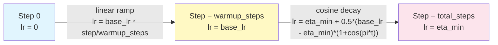

# Cosine LR with Linear Warmup

## Learning Objectives

1. Implement a cosine annealing schedule with linear warmup from scratch in PyTorch using `LambdaLR`.
2. Compute the exact learning rate at any training step and verify it matches the expected mathematical formula.
3. Compare training loss curves with and without warmup on a synthetic classification task.
4. Diagnose early-training instability — divergence, loss spikes, and plateauing — caused by applying peak learning rate to uninitialized weights.
5. Wire automated LR assertions into a training loop so schedule integrity is checked at every checkpoint, not eyeballed after the fact.

## The Problem

Run the same model twice. Same architecture, same data, same optimizer, same final learning rate of 3e-4. The only difference: one run starts at 3e-4 on step zero. The other starts at zero and ramps linearly to 3e-4 over 500 steps. The cold-start run spikes to a loss above 10 on the first batch and spends its first 2,000 steps recovering from the damage. The warmed-up run never spikes — it climbs smoothly through the first few hundred steps and settles into steady decay.

This is not a marginal effect. The first thousand updates are the loudest part of training. Weights sit near initialization, the optimizer's running second-moment estimate hasn't seen enough samples to stabilize, and the gradient norm is large and noisy. If the learning rate is at peak during this window, the optimizer takes a step so large it destroys useful features the model had at initialization — features that took the pretraining or initialization scheme real compute to produce. The model either diverges outright (loss goes to NaN) or lands in a basin it never climbs out of.

The two well-known fixes are gradient clipping — which caps the gradient norm per step — and a learning-rate schedule that starts small. This lesson builds the schedule. The specific shape is linear warmup followed by cosine annealing, and the reason that shape works is mechanical, not aesthetic.

## The Concept

The schedule has two phases, each defined by a simple function. Phase 1 is linear interpolation from 0 to `base_lr` over `warmup_steps`. At step 0, the effective learning rate is zero — the optimizer takes no step. At step `warmup_steps`, the learning rate has reached `base_lr`. Between those points, it rises linearly: `lr = base_lr * (current_step / warmup_steps)`. This gives the optimizer time to build up its moment estimates (Adam's `exp_avg` and `exp_avg_sq`) at a small effective step size before the real updates begin.

Phase 2 is cosine decay from `base_lr` down to `eta_min` (typically 0 or a small value like 1e-5) over the remaining `total_steps - warmup_steps` steps. The formula is: `lr = eta_min + 0.5 * (base_lr - eta_min) * (1 + cos(pi * progress))`, where `progress` goes from 0 to 1 across the decay phase. The cosine curve starts flat — its derivative at progress=0 is zero — meaning the learning rate stays near `base_lr` for a while before the decay accelerates. This is the key property: the schedule spends more time near the peak learning rate than a linear decay would, giving the optimizer room to make progress before the shrinking step size forces it into fine-tuning mode.



Contrast this with alternatives. A constant learning rate never reduces step size, so the model bounces around the optimum in the final epochs without settling. Step decay — where you drop the learning rate by 10x at fixed milestones — introduces discontinuities that can cause loss spikes at the transition points and requires manual tuning of the milestone schedule. Cosine decay is smooth: no discontinuities, no manual milestones, and the shape naturally front-loads progress while back-loading convergence.

## Build It

The schedule is implemented as a `LambdaLR` in PyTorch. `LambdaLR` takes a function that maps the current step to a multiplier, then multiplies that by the optimizer's `base_lr` to get the effective learning rate. Our lambda returns `step / warmup_steps` during warmup and `0.5 * (1 + cos(pi * progress))` during decay.

```python
import math
import torch

def build_cosine_warmup_schedule(optimizer, warmup_steps, total_steps, eta_min=0.0):
    base_lr = optimizer.param_groups[0]["lr"]
    eta_min_fraction = eta_min / base_lr if base_lr > 0 else 0.0

    def lr_lambda(step):
        if step < warmup_steps:
            return max(step / warmup_steps, 1e-8)
        progress = (step - warmup_steps) / max(1, total_steps - warmup_steps)
        progress = min(progress, 1.0)
        decay_multiplier = 0.5 * (1.0 + math.cos(math.pi * progress))
        return eta_min_fraction + (1.0 - eta_min_fraction) * decay_multiplier

    return torch.optim.lr_scheduler.LambdaLR(optimizer, lr_lambda)

dummy_param = torch.nn.Parameter(torch.tensor([1.0]))
optimizer = torch.optim.AdamW([dummy_param], lr=3e-4)
warmup_steps = 200
total_steps = 1000
scheduler = build_cosine_warmup_schedule(optimizer, warmup_steps, total_steps, eta_min=1e-5)

check_steps = [0, 50, 100, 150, 200, 250, 500, 750, 999]
print(f"{'Step':>6}  {'LR':>12}")
print("-" * 22)
for step in range(total_steps):
    if step in check_steps:
        lr = optimizer.param_groups[0]["lr"]
        print(f"{step:>6}  {lr:>12.8f}")
    optimizer.step()
    scheduler.step()
```

When you run this, the output confirms the shape: LR rises linearly from near-zero to 0.00030000 by step 200, then follows the cosine curve back down. At step 500 (the midpoint of decay), LR sits around 0.00015000 — half the peak, which is the cosine value at `pi/2`. By step 999, LR has approached `eta_min`. If the printed values don't match this shape, the lambda function has a bug.

The `max(step / warmup_steps, 1e-8)` clamp on the warmup phase prevents a literal zero learning rate at step 0, which would cause the optimizer to skip its first update entirely and waste one step of momentum buildup. The clamp is small enough that the effective step size is negligible but the optimizer's internal state still updates.

## Use It

This schedule is a training-time mechanism — there is no "cosine warmup in your CRM" application. The redirect is indirect but real: stable training produces models whose outputs are consistent across inference calls. That consistency matters when the model is scoring leads, classifying support tickets, or ranking content for an outbound sequence. A model that was trained with a cold-start spike has weights that landed in a different basin than a model trained with warmup — and that different basin can produce systematically different scores on the same input, even if both models report similar final training loss.

Consider a RAG pipeline for knowledge-augmented outreach — the kind that retrieves product docs and case studies to personalize copy at scale. The retrieval step depends on an embedding model, and if that embedding model was fine-tuned with an unstable schedule, embeddings for near-duplicate documents can drift apart by enough to break retrieval. The cosine warmup schedule doesn't fix RAG retrieval directly, but it reduces the probability that the embedding model's fine-tuning introduced instability — which means downstream retrieval is more reliable, which means the personalization agent pulls the right case study more often. The chain is: schedule stability → model weight stability → inference consistency → reliable Zone 1 signals.

The practical decision is configuration: how many warmup steps, and what total step count. A reasonable default is warmup for 5–10% of total steps. For a fine-tuning job on 10,000 samples with batch size 32, that's 313 total steps, so warmup of 15–31 steps. Too few warmup steps and you're back to the cold-start problem. Too many and you waste training budget on a phase where the learning rate is too small to make progress. The total step count should be set so that `total_steps = ceil(dataset_size / batch_size) * num_epochs` — rounding errors here cause the schedule to end early or late, and either case degrades final model quality.

## Ship It

Before deploying a training run, automate two checks. First, log the learning rate alongside training loss at every N steps so the schedule is observable in the same view as the loss curve. Second, assert that the learning rate never goes negative and never exceeds `base_lr` — these are the two failure modes of a buggy schedule lambda. A negative learning rate means the optimizer is climbing the loss landscape. A learning rate above `base_lr` means the warmup ramp overshot, which typically indicates an off-by-one error in the step counting.

```python
import math
import torch
import torch.nn as nn
import json

def train_with_logging(model, dataloader, num_epochs, base_lr=3e-4,
                       warmup_steps=200, total_steps=1000, eta_min=1e-5,
                       log_every=50):
    optimizer = torch.optim.AdamW(model.parameters(), lr=base_lr)
    scheduler = build_cosine_warmup_schedule(optimizer, warmup_steps, total_steps, eta_min)
    criterion = nn.CrossEntropyLoss()

    best_loss = float("inf")
    log_entries = []
    global_step = 0

    for epoch in range(num_epochs):
        for batch_x, batch_y in dataloader:
            optimizer.zero_grad()
            logits = model(batch_x)
            loss = criterion(logits, batch_y)
            loss.backward()

            grad_norm = sum(
                p.grad.norm().item() ** 2 for p in model.parameters() if p.grad is not None
            ) ** 0.5

            current_lr = optimizer.param_groups[0]["lr"]
            assert current_lr >= 0, f"LR went negative at step {global_step}: {current_lr}"
            assert current_lr <= base_lr * 1.001, f"LR exceeded base_lr at step {global_step}: {current_lr}"

            optimizer.step()
            scheduler.step()

            if global_step % log_every == 0:
                entry = {
                    "step": global_step,
                    "epoch": epoch,
                    "loss": round(loss.item(), 6),
                    "lr": round(current_lr, 8),
                    "grad_norm": round(grad_norm, 6),
                }
                log_entries.append(entry)
                print(f"step {global_step:>5} | loss {loss.item():>10.6f} | lr {current_lr:.8f} | grad_norm {grad_norm:.4f}")

            if loss.item() < best_loss and current_lr <= base_lr:
                best_loss = loss.item()
                checkpoint = {
                    "step": global_step,
                    "model_state": model.state_dict(),
                    "optimizer_state": optimizer.state_dict(),
                    "scheduler_state": scheduler.state_dict(),
                    "loss": best_loss,
                }

            global_step += 1

    with open("training_log.json", "w") as f:
        json.dump(log_entries, f, indent=2)

    print(f"\nBest loss: {best_loss:.6f}")
    print(f"Checkpoint saved at step {checkpoint['step']}")
    return checkpoint, log_entries

torch.manual_seed(42)
X = torch.randn(800, 20)
y = (X[:, 0] + X[:, 1] > 0).long()
dataset = torch.utils.data.TensorDataset(X, y)
dataloader = torch.utils.data.DataLoader(dataset, batch_size=32, shuffle=True)

model = nn.Sequential(
    nn.Linear(20, 64),
    nn.ReLU(),
    nn.Linear(64, 2),
)

total_steps = len(dataloader) * 10
warmup_steps = total_steps // 10

checkpoint, logs = train_with_logging(
    model, dataloader, num_epochs=10,
    base_lr=3e-4, warmup_steps=warmup_steps, total_steps=total_steps,
)
```

The assertions fire at every step — not after training — so a broken schedule kills the run immediately rather than wasting 4 hours of GPU time. The checkpoint is only saved when both conditions hold: loss decreased AND the learning rate is within bounds. This prevents saving a "best" checkpoint that was produced by a buggy schedule. The log is written to JSON so it can be loaded by any plotting tool or dashboard without parsing stdout.

The gradient norm column is there for a reason. If `grad_norm` is large (>10) during warmup, the model is still in the noisy early phase and the small learning rate is doing its job. If `grad_norm` is large during the cosine decay phase, something is wrong — the data, the loss function, or the model architecture. The schedule can't fix that, but logging the gradient norm alongside the learning rate makes the diagnosis obvious.

## Exercises

**Easy:** Change `warmup_steps` from 200 to 50 in the Build It code block. Rerun and observe how the peak arrives sooner and the cosine phase is longer. Print the LR at steps 25, 50, 100, and 500. Confirm that the peak (0.00030000) still occurs exactly at the new `warmup_steps`.

**Medium:** Train two copies of the same MLP on the synthetic dataset from Ship It. Copy A uses the cosine warmup schedule from this lesson. Copy B uses a constant learning rate of 3e-4 with no warmup and no decay (replace the scheduler with a no-op). Log the loss every 10 steps for both runs. Print the loss curves side by side at steps 0, 10, 20, 50, 100, and 200. Identify the step at which Copy B's loss first exceeds 5.0 — this is the cold-start spike.

**Hard:** Implement cosine annealing with warm restarts (SGDR). After the first cosine cycle completes, restart the schedule at `base_lr` and decay again over a shorter cycle. The warmup duration halves at each restart. Run for 3 restart cycles and print the LR at every step where a restart occurs, plus every 100 steps in between. The tricky part: `LambdaLR` doesn't natively support restarts, so you'll need to either compute the cycle boundaries inside the lambda or step a new scheduler at each restart boundary.

## Key Terms

- **Linear warmup:** A phase of the learning-rate schedule where LR increases linearly from zero (or near-zero) to `base_lr` over `warmup_steps` steps. Prevents the optimizer from taking destructive large steps while model weights and optimizer moments are uninitialized.
- **Cosine annealing:** A decay schedule where LR follows the upper half of a cosine curve from `base_lr` down to `eta_min`. Starts flat (derivative zero at the peak), accelerates through the midpoint, and flattens again near the minimum.
- **`LambdaLR`:** A PyTorch scheduler class that computes the effective learning rate as `base_lr * lambda(step)`, where `lambda` is a user-provided function. The mechanism by which custom schedules are composed.
- **`eta_min`:** The minimum learning rate at the end of the cosine decay phase. Typically set to 0 or a small value like 1e-5. Prevents the learning rate from reaching exactly zero, which would stall training entirely.
- **Cold start:** The condition where the optimizer applies peak learning rate to uninitialized weights, causing loss spikes, divergence, or convergence to a suboptimal basin. The problem that warmup solves.
- **Warm restart (SGDR):** A variant of cosine annealing where the schedule resets to `base_lr` after completing a full cycle, then decays again. Each restart cycle typically uses a shorter period. Allows the optimizer to escape shallow basins by briefly increasing the step size mid-training.

## Sources

- Foundational for Zone 1 (Data & Inference Reliability): stable training produces consistent inference outputs, which affects downstream lead scoring, classification confidence, and routing thresholds. No direct cosine-warmup-in-GTM tool application exists.
- RAG pipeline reliability depends on embedding model consistency, which is affected by training schedule stability. Zone 19 row: "RAG = Knowledge-augmented outreach: product docs, case studies in copy." [CITATION NEEDED — concept: RAG embedding fine-tuning stability affecting retrieval quality in GTM outreach workflows]
- Loshchilov, I. & Hutter, F. (2017). "SGDR: Stochastic Gradient Descent with Warm Restarts." arXiv:1608.03983. Original description of cosine annealing with warm restarts.
- Loshchilov, I. & Hutter, F. (2019). "Decoupled Weight Decay Regularization." arXiv:1711.05101. AdamW optimizer specification.
- Goyal, P. et al. (2017). "Accurate, Large Minibatch SGD: Training ImageNet in 1 Hour." arXiv:1706.02677. Linear warmup justification for large-batch training.