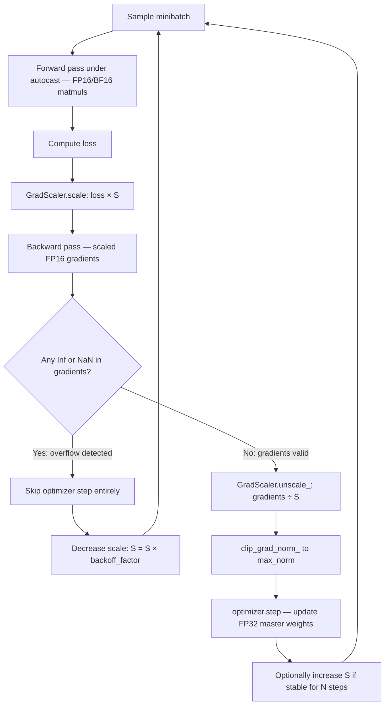

# Gradient Clipping and Mixed Precision

## Learning Objectives

1. Detect gradient explosion in training loops by computing and monitoring the global L2 gradient norm, then apply norm-based and value-based clipping to constrain updates.
2. Configure an automatic mixed precision (AMP) training loop using `torch.amp.autocast` and `torch.amp.GradScaler` with dynamic loss scaling.
3. Compare FP16, BF16, and FP32 behavior in terms of dynamic range, mantissa precision, and gradient magnitude preservation.
4. Implement a training loop that combines gradient clipping with mixed precision and logs gradient norms, scale factors, and loss at each step.
5. Evaluate training stability across precision and clipping configurations using loss curve diagnostics and overflow event counts.

## The Problem

A training run that was converging cleanly for 8,000 steps produces NaN at step 8,217. You open the logs: the loss went from 0.34 to 184,000.3 to `nan` in three steps. The culprit is a single batch where one sample has an unusual feature distribution — a sales call transcript with a token sequence length three standard deviations above the training mean — and the gradient norm spikes from 4.2 to 4,200. Without clipping, the optimizer applies a step that overwrites every weight the model learned in the previous hour of GPU time. This is gradient explosion, and it is not a rare edge case. It happens routinely in any fine-tuning run on noisy, domain-specific data: sales transcripts, CRM enrichment fields with missing values, email reply chains with inconsistent formatting.

The second problem is throughput. Every matrix multiply in FP32 uses 4 bytes per parameter. A 7B parameter model needs 28 GB just for weights in FP32, plus matching gradient storage, plus Adam optimizer state which requires 2x parameter count for momentum and variance buffers. You cannot fit that on a single 24 GB GPU without partitioning. Mixed precision stores a master weight copy in FP32 but computes forward and backward passes in FP16, cutting activation memory roughly in half and doubling throughput on tensor cores. The trade-off is that FP16 has a narrow exponent range — 5 exponent bits giving a representable range of roughly `[6e-8, 65504]` — and gradients that were numerically fine in FP32 can overflow to `Inf` or underflow to zero in FP16.

Both problems compound each other. Mixed precision training amplifies gradient instability because the FP16 backward pass has less headroom before overflow. A gradient spike that FP32 would have survived (barely) becomes `Inf` in FP16, which propagates through subsequent layers as `NaN`, which sets every weight to `NaN` at the next optimizer step. You cannot solve one problem without solving the other. Gradient clipping without mixed precision leaves throughput on the table. Mixed precision without gradient clipping turns an occasional spike into a guaranteed crash.

## The Concept

**Gradient Clipping.** Two mechanisms exist. Clip-by-value truncates each individual gradient element to `[-max_val, max_val]`. If a gradient component is 47.3 and `max_val` is 5.0, the component becomes 5.0. This is cheap — it is an elementwise `clamp` — but it distorts the gradient direction. If parameter A has a gradient of 47.3 and parameter B has a gradient of 3.1, clipping both to `[-5, 5]` makes them appear equally important (5.0 and 3.1), destroying the information that A's gradient was 15x larger. Clip-by-norm computes the global L2 norm across all parameter gradients simultaneously and rescales the entire gradient vector by `max_norm / global_norm` when `global_norm > max_norm`. If the global norm is 4,200 and `max_norm` is 1.0, every gradient component is multiplied by `1.0 / 4200 ≈ 0.000238`. Direction is preserved — every component shrinks by the same factor — and relative magnitudes are intact. This is the standard approach in production training. The PyTorch implementation is `torch.nn.utils.clip_grad_norm_`, which computes the total norm, compares to the threshold, and applies the rescaling in place.

**Mixed Precision.** The master weight copy lives in FP32. The forward pass runs in FP16 or BF16 under `autocast`, which automatically selects which operations run in half precision (matrix multiplies, convolutions — compute-bound ops that benefit from tensor cores) and which stay in FP32 (softmax, layer norm, reductions — ops where numerical stability matters more than throughput). The backward pass produces gradients in the compute dtype. The problem is that FP16 gradients can underflow: values smaller than `~6e-8` round to zero, meaning small-but-important gradient signals vanish before the optimizer sees them. Loss scaling addresses this by multiplying the loss by a large scalar `S` before backprop, which scales all gradients up by `S`. After the backward pass, you divide gradients by `S` to recover the true values. The `GradScaler` automates this: it starts with `S = 65536` and adjusts dynamically — multiplying by `growth_factor` (default 2.0) every `growth_interval` (default 2000) steps when training is stable, and dividing by `backoff_factor` (default 0.5) immediately when overflow (`Inf`/`NaN`) is detected, skipping that optimizer step entirely.

**BF16** has the same 8 exponent bits as FP32, giving it a dynamic range of roughly `[1e-38, 3e38]`. This means BF16 gradients do not underflow or overflow in any scenario where FP32 would not. Loss scaling is unnecessary with BF16. The cost is 3 fewer mantissa bits than FP16 (7 bits vs 10 bits), meaning BF16 represents values with less fractional precision. For most fine-tuning workloads, BF16 is the simpler and more stable choice when hardware supports it (Nvidia Ampere GPUs — A100, RTX 3090/4090 — and later). FP16 with `GradScaler` remains necessary on older hardware (V100, GTX series).



The pipeline above shows the critical ordering. You scale the loss before backward to prevent underflow. After backward, you check for overflow. If clean, you unscale to recover true gradient values, then clip the unscaled gradients to your configured norm, then step the optimizer. If you clip before unscaling, you are clipping the scaled (inflated) gradients, which means the clip threshold is effectively `max_norm × S` — meaningless. If you step before unscaling, you apply an update `S` times too large. The `GradScaler.unscale_(optimizer)` call reverses the scaling in place so that `clip_grad_norm_` operates on true gradient values. Then `scaler.step(optimizer)` performs the optimizer step (it internally checks once more for overflow and skips if found). Finally `scaler.update()` adjusts `S` for the next iteration.

## Build It

The first script demonstrates gradient explosion on adversarial input and shows the difference between running with and without norm-based clipping on identical batches and identical initial weights.

```python
import torch
import torch.nn as nn

torch.manual_seed(42)

def make_model():
    return nn.Sequential(
        nn.Linear(128, 256),
        nn.ReLU(),
        nn.Linear(256, 128),
        nn.ReLU(),
        nn.Linear(128, 10)
    )

def compute_grad_norm(model):
    total = 0.0
    for p in model.parameters():
        if p.grad is not None:
            total += p.grad.data.norm(2).item() ** 2
    return total ** 0.5

normal_x = torch.randn(32, 128)
normal_y = torch.randint(0, 10, (32,))
spike_x = torch.randn(32, 128) * 80
spike_y = torch.randint(0, 10, (32,))

criterion = nn.CrossEntropyLoss()
batches = [("normal", normal_x, normal_y),
           ("normal", normal_x, normal_y),
           ("adversarial", spike_x, spike_y),
           ("normal", normal_x, normal_y)]

print("=== WITHOUT CLIPPING ===")
print(f"{'Step':<6}{'Batch':<14}{'Loss':<12}{'Grad Norm':<14}{'Weight L2'}")
print("-" * 60)

model_a = make_model()
opt_a = torch.optim.SGD(model_a.parameters(), lr=0.01)

for step, (name, x, y) in enumerate(batches):
    opt_a.zero_grad()
    loss = criterion(model_a(x), y)
    loss.backward()
    gn = compute_grad_norm(model_a)
    w2 = sum(p.data.norm(2).item() ** 2 for p in model_a.parameters()) ** 0.5
    print(f"{step:<6}{name:<14}{loss.item():<12.4f}{gn:<14.2f}{w2:<.4f}")
    opt_a.step()

print("\n=== WITH NORM CLIPPING (max_norm=1.0) ===")
print(f"{'Step':<6}{'Batch':<14}{'Loss':<12}{'Norm Before':<14}{'Norm After':<14}{'Weight L2'}")
print("-" * 74)

model_b = make_model()
opt_b = torch.optim.SGD(model_b.parameters(), lr=0.01)

for step, (name, x, y) in enumerate(batches):
    opt_b.zero_grad()
    loss = criterion(model_b(x), y)
    loss.backward()
    gn_before = compute_grad_norm(model_b)

    torch.nn.utils.clip_grad_norm_(model_b.parameters(), max_norm=1.0)
    gn_after = compute_grad_norm(model_b)

    w2 = sum(p.data.norm(2).item() ** 2 for p in model_b.parameters()) ** 0.5
    print(f"{step:<6}{name:<14}{loss.item():<12.4f}{gn_before:<14.2f}{gn_after:<14.2f}{w2:<.4f}")
    opt_b.step()
```

The output will show the unclipped run's gradient norm spiking to hundreds or thousands on the adversarial batch, followed by weight L2 norms that shift dramatically. The clipped run shows the same pre-clip spike, but the post-clip norm holds at exactly 1.0 and the weight trajectory stays stable.

The second script demonstrates the mixed precision forward pass, comparing FP32 against BF16 autocast on CPU. It also exercises the `GradScaler` API to show the scale factor and overflow detection mechanism.

```python
import torch
import torch.nn as nn