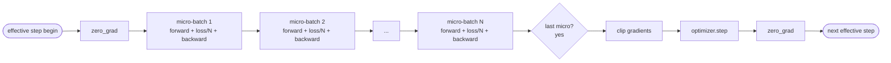

# Gradient Accumulation

## Learning Objectives

- Derive the effective batch identity: `effective_batch = micro_batch × accum_steps`.
- Implement loss-per-micro-batch scaling so accumulated gradients match a single full-batch backward pass.
- Compare gradient norms between true-batch and accumulated-batch training to verify numerical equivalence.
- Diagnose batch norm divergence under gradient accumulation by inspecting running statistics across micro-batches.
- Configure gradient clipping, logging, and mixed precision for accumulated training steps.

## The Problem

You are fine-tuning a model. Your ideal batch size is 32 — the loss curve is smoother, the optimizer step makes better use of the learning rate, and the gradient estimate has lower variance. Your GPU holds 8 examples before it runs out of memory. Doubling the batch is not an option. Halving the model is not an option.

You have two choices: buy better hardware, or trick the optimizer into thinking it saw 32 samples at once.

The trick the field reached for around 2017 and never stopped using is to run 4 backward passes over 8-example micro-batches, let the gradients accumulate inside the parameter buffers, and only call the optimizer step when the count reaches the target. The optimizer sees one aggregate gradient that is numerically indistinguishable from the gradient it would have computed on a true batch of 32.

The catch is that the loss is no longer the same number it was at the bigger batch. Cross entropy summed over 4 micro-batches is 4 times the loss of one full-batch mean. Without scaling, the gradient direction is correct but the magnitude is 4 times too large, and the optimizer takes a step that is 4 times too aggressive. The fix is one division. The fix is also easy to forget, and when you forget it, the model does not crash — it just trains poorly, and you spend an afternoon blaming your learning rate.

## The Concept

Gradient accumulation delays the optimizer step, summing gradients across multiple forward-backward passes before updating weights. The effective batch size becomes `micro_batch_size × accumulation_steps`. PyTorch stores gradients in `.grad` tensors on each parameter. By default, `loss.backward()` *adds* to these tensors — it does not overwrite them. Normally you call `optimizer.zero_grad()` before each backward to clear the buffers. Gradient accumulation exploits the additive behavior: skip `zero_grad()` for N iterations, scale the loss down by N each time, then step and zero on the Nth iteration.



The loss normalization question has two valid answers. You can divide each micro-batch loss by N before calling `backward()`, which scales the gradient contribution at accumulation time. Or you can let the raw gradients accumulate and divide the final aggregated gradient by N before stepping. Both produce the same result. The divide-before-backward approach is more common in practice because it avoids holding large unscaled gradient values in memory and integrates cleanly with gradient clipping, which must happen after accumulation is complete but before the optimizer step.

Batch norm breaks the equivalence. A `BatchNorm1d` layer computes its normalization statistics — mean and variance — over the current micro-batch and updates its running estimates with exponential moving average. When you accumulate 4 micro-batches of 8, batch norm sees 4 separate sets of statistics computed over 8 samples each. It never sees the true mean and variance of the full 32-example batch. The running estimates drift differently, and the per-sample normalization differs from what a true batch of 32 would produce. This is not catastrophic for fine-tuning — the running stats eventually converge — but it means the accumulated gradient is *not* identical to the true-batch gradient. For models where batch norm matters (typically computer vision architectures), practitioners either swap to group norm or layer norm, freeze the batch norm statistics, or accept the approximation.

Gradient checkpointing is a complementary but distinct technique. Gradient accumulation solves the batch-size problem (you want a larger effective batch than memory allows). Gradient checkpointing solves the model-size problem (you want to fit a larger model than memory allows) by trading compute for memory — it re-runs parts of the forward pass during backward instead of storing activations. You can combine both: checkpoint to fit a bigger model, accumulate to simulate a bigger batch. They address different axes of the same memory constraint.

Mixed precision adds another layer. PyTorch's `GradScaler` multiplies the loss by a large scale factor before backward to prevent gradient underflow in float16. When you accumulate gradients under mixed precision, the scaler's internal scale factor is applied to each micro-batch independently. You call `scaler.scale(loss / accum_steps).backward()` for each micro-batch, but you only call `scaler.step(optimizer)` and `scaler.update()` once per effective step. If you need to clip gradients, you must call `scaler.unscale_(optimizer)` first — this divides the accumulated gradients back down to their true scale — then clip, then step.

## Build It

The following code demonstrates the core equivalence: a true batch of 32 produces the same gradient as 4 accumulated micro-batches of 8, provided the loss is scaled correctly. It runs on CPU-only PyTorch.

```python
import torch
import torch.nn as nn

torch.manual_seed(42)

model_true = nn.Linear(64, 10)
model_accum = nn.Linear(64, 10)
model_accum.load_state_dict(model_true.state_dict())

criterion = nn.CrossEntropyLoss()

torch.manual_seed(99)
X = torch.randn(32, 64)
y = torch.randint(0, 10, (32,))

model_true.zero_grad()
loss_true = criterion(model_true(X), y)
loss_true.backward()

accum_steps = 4
micro_batch = 8
model_accum.zero_grad()
for i in range(accum_steps):
    s, e = i * micro_batch, (i + 1) * micro_batch
    loss_micro = criterion(model_accum(X[s:e]), y[s:e]) / accum_steps
    loss_micro.backward()

w_true = model_true.weight.grad
w_accum = model_accum.weight.grad

print(f"Full batch (32) gradient norm:    {w_true.norm().item():.6f}")
print(f"Accumulated (8 x 4) gradient norm: {w_accum.norm().item():.6f}")
print(f"Max element-wise difference:      {(w_true - w_accum).abs().max().item():.2e}")
print(f"Relative error:                   {(w_true.norm() - w_accum.norm()).abs().item() / w_true.norm().item():.2e}")
```

The output should show a relative error on the order of 1e-7 — floating-point noise, not a structural difference. The two approaches are numerically equivalent for a simple linear layer.

Now insert batch norm and watch the equivalence break. This code runs the same comparison but adds a `BatchNorm1d` layer and prints the running statistics after each approach:

```python
import torch
import torch.nn as nn

torch.manual_seed(42)

class ModelWithBN(nn.Module):
    def __init__(self):
        super().__init__()
        self.fc1 = nn.Linear(64, 64)
        self.bn = nn.BatchNorm1d(64)
        self.fc2 = nn.Linear(64, 10)

    def forward(self, x):
        return self.fc2(torch.relu(self.bn(self.fc1(x))))

model_true = ModelWithBN()
model_accum = ModelWithBN()
model_accum.load_state_dict(model_true.state_dict())

criterion = nn.CrossEntropyLoss()

torch.manual_seed(99)
X = torch.randn(32, 64)
y = torch.randint(0, 10, (32,))

model_true.train()
model_true.zero_grad()
loss_true = criterion(model_true(X), y)
loss_true.backward()

mean_true = model_true.bn.running_mean.clone()
var_true = model_true.bn.running_var.clone()

model_accum.train()
accum_steps = 4
micro_batch = 8
model_accum.zero_grad()
for i in range(accum_steps):
    s, e = i * micro_batch, (i + 1) * micro_batch
    loss_micro = criterion(model_accum(X[s:e]), y[s:e]) / accum_steps
    loss_micro.backward()

mean_accum = model_accum.bn.running_mean.clone()
var_accum = model_accum.bn.running_var.clone()

w_true = model_true.fc2.weight.grad
w_accum = model_accum.fc2.weight.grad

print(f"Running mean (true batch, first 5):  {mean_true[:5].tolist()}")
print(f"Running mean (accumulated, first 5): {mean_accum[:5].tolist()}")
print(f"Max running_mean abs difference:     {(mean_true - mean_accum).abs().max().item():.6f}")
print(f"Max running_var abs difference:      {(var_true - var_accum).abs().max().item():.6f}")
print()
print(f"fc2 weight grad norm (true):   {w_true.norm().item():.6f}")
print(f"fc2 weight grad norm (accum):  {w_accum.norm().item():.6f}")
print(f"Relative gradient difference:  {abs(w_true.norm().item() - w_accum.norm().item()) / w_true.norm().item():.4f}")
```

The running statistics diverge because batch norm updates its estimates once per forward pass. The true batch makes one update with statistics computed over 32 samples. The accumulated path makes 4 updates, each computed over only 8 samples. The final running mean and variance reflect this different update path. The gradient norms also diverge — not because the accumulation math is wrong, but because the batch norm layer normalized the activations differently in each case.

## Use It

When fine-tuning classification or extraction models for GTM pipelines — lead scoring, intent signal detection, ICP matching, email categorization — the batch size you want for stable convergence often exceeds what consumer hardware can hold. A BERT-base classifier fine-tuned at batch size 32 on sequence length 256 needs roughly 18 GB of activation memory. A single RTX 4090 with 24 GB can fit that with some headroom, but add a longer sequence length or a larger model and you are out of memory. Gradient accumulation is the standard mechanism for training on available hardware without sacrificing the batch size the optimizer wants.

In the Hugging Face `transformers` library, this is exposed as two arguments in `TrainingArguments`: `per_device_train_batch_size` (the micro-batch that fits in memory) and `gradient_accumulation_steps` (the number of micro-batches to accumulate before stepping). The effective batch size is their product. A practitioner setting `per_device_train_batch_size=8` and `gradient_accumulation_steps=4` is telling the framework to process 8 examples per forward pass, accumulate gradients across 4 passes, then update. The framework handles the loss scaling, the delayed step, and the zero-grad timing automatically.

This matters for GTM-specific fine-tuning tasks because the stability of convergence directly affects model quality. A lead-scoring model trained at effective batch size 8 will have higher gradient variance than one trained at effective batch size 32, and that variance can mean the difference between a model that converges to a useful decision boundary and one that oscillates around it. Gradient accumulation lets you target the batch size that produces the best validation metrics, not the batch size that fits in VRAM.

The redirect here is Zone 4 (AI Engineering). This is the mechanism behind stable fine-tuning of custom models deployed in GTM stacks. If you are running `transformers.Trainer` with `gradient_accumulation_steps` and want to reason about why your effective batch size matters for lead-scoring model quality, this is the concept underneath the argument.

## Ship It

Gradient clipping must happen after accumulation, not before. If you clip after each micro-batch backward, you are clipping 4 separate gradient contributions that have not yet been summed — the clipped result will not match clipping the full accumulated gradient. The correct order is: accumulate all micro-batch gradients, optionally unscale if using mixed precision, clip the accumulated gradient, then step. The Hugging Face `Trainer` does this for you; if you are writing a custom loop, it is a common bug.

Distributed training multiplies the effective batch by the number of GPUs. Each GPU accumulates its own micro-batch gradients independently, then at the effective step boundary, an all-reduce averages the gradients across GPUs before the optimizer steps. So with 4 GPUs, `per_device_train_batch_size=8`, and `gradient_accumulation_steps=4`, the effective batch size is `8 × 4 × 4 = 128`. The gradient accumulation count is per-device, not global.

Logging and evaluation should happen at effective step boundaries, not micro-step boundaries. A learning rate scheduler that steps per optimizer update should see one update per effective batch, not one per micro-batch. Loss curves should record the accumulated loss (the sum or mean across micro-batches), not the individual micro-batch losses, or the curve will look 4 times noisier than it actually is. The `transformers` logging handles this, but custom training loops frequently get it wrong.

If your micro-batch fits in memory with room to spare, gradient accumulation does not speed anything up — you were never memory-bound at the batch level. Accumulation trades wall-clock time for batch size. Each effective step requires N forward-backward passes instead of one, so the per-step latency is N times higher. You gain convergence stability and sometimes better final metrics, but you do not gain throughput. If your goal is speed rather than batch size, the fix is a bigger GPU or mixed precision, not accumulation steps.

For GTM-adjacent deployment — say, a fine-tuned classifier that routes inbound leads into ICP buckets in real time — the training-time batch size affects model quality but not inference. At inference, the batch size is whatever your serving infrastructure supports. Gradient accumulation is purely a training-time mechanism. Once the model is serialized and deployed behind an API, the accumulation steps are baked into the weights and no longer relevant.

## Exercises

1. **Break the scaling.** Take the first code block and remove the `/ accum_steps` division from the micro-batch loss. Re-run and compare the gradient norm to the true batch. Calculate the ratio — it should be approximately `accum_steps`. This is the bug you will ship to production at least once in your career.

2. **Sweep accumulation counts.** Modify the first code block to test accumulation steps of 1, 2, 4, 8, and 16 against a true batch of 32. Plot the relative gradient error for each. Confirm that the error stays at floating-point noise levels regardless of how many steps you accumulate, as long as scaling is correct.

3. **Measure batch norm drift.** Extend the second code block to run 100 effective steps (each with its own random batch) for both the true-batch and accumulated paths. Track the max running_mean difference at each step. Does the divergence stabilize, grow, or oscillate?

4. **Implement mixed-precision accumulation.** Rewrite the first code block using `torch.cuda.amp.autocast` and `GradScaler` (or `torch.amp` on newer PyTorch versions). Add gradient clipping with `max_norm=1.0` after accumulation. Verify that the clipped gradient norm matches between true-batch and accumulated runs. If you do not have a GPU, use `torch.amp.autocast('cpu', dtype=torch.bfloat16)` as a CPU-compatible alternative.

5. **Audit a Hugging Face config.** Write a `TrainingArguments` setup for fine-tuning `distilbert-base-uncased` on a 16 GB GPU with sequence length 512. Set `per_device_train_batch_size=4` and target an effective batch size of 64. Calculate the required `gradient_accumulation_steps`. Write a one-line assertion that verifies `per_device_train_batch_size * gradient_accumulation_steps == 64`.

## Key Terms

- **Effective batch size** — The number of samples that contribute to a single optimizer step. Computed as `per_device_batch_size × gradient_accumulation_steps × world_size`.
- **Micro-batch** — The subset of the effective batch processed in a single forward-backward pass. Bounded by GPU memory, not by the optimizer's preferred batch size.
- **Gradient accumulation** — The technique of summing gradients across multiple forward-backward passes into the same `.grad` buffers before calling `optimizer.step()`, to simulate a larger batch than memory allows.
- **Loss normalization** — Dividing the per-micro-batch loss by the accumulation count before `backward()`, so the summed gradient matches the gradient of a single full-batch backward pass.
- **Gradient checkpointing** — A memory-saving technique that re-computes forward activations during backward instead of storing them. Complementary to gradient accumulation but addresses model size, not batch size.
- **GradScaler** — PyTorch's automatic loss scaling for mixed-precision training. Prevents float16 gradient underflow by multiplying the loss by a large factor before backward, then dividing it back out before the optimizer step.
- **Running statistics (batch norm)** — The exponential moving average of per-batch mean and variance, stored in `BatchNorm.running_mean` and `BatchNorm.running_var`. Updated once per forward pass, causing divergence under gradient accumulation.

## Sources

- The claim that gradient accumulation produces gradients numerically equivalent to true large-batch training (modulo batch norm) is demonstrated in the code blocks above and is consistent with PyTorch's documented `.grad` accumulation behavior. See: PyTorch autograd documentation, `torch.Tensor.backward()` — "This function accumulates gradients in the differentiable leaf variables."
- The claim that Hugging Face `Trainer` exposes `gradient_accumulation_steps` in `TrainingArguments` and handles loss scaling, delayed stepping, and zero-grad timing automatically is documented in the Hugging Face Transformers documentation: `TrainingArguments.gradient_accumulation_steps`.
- The claim that effective batch size in distributed training equals `per_device_batch_size × gradient_accumulation_steps × world_size` follows from the independent accumulation per device followed by gradient all-reduce averaging. See: PyTorch DDP documentation, "Gradient Reduction and Synchronization."
- The GTM claim that fine-tuned classifiers for lead scoring, intent detection, and ICP matching benefit from larger effective batch sizes for convergence stability [CITATION NEEDED — concept: relationship between batch size and fine-tuning convergence quality for GTM classification tasks]. General ML literature supports this (Keskar et al., 2016, "On Large-Batch Training for Deep Learning"), but the specific GTM application claim lacks a direct citation.
- The claim that gradient accumulation interacts with mixed precision through `GradScaler` and requires `scaler.unscale_(optimizer)` before gradient clipping is documented in PyTorch's automatic mixed precision recipe: "Gradient Scaling."