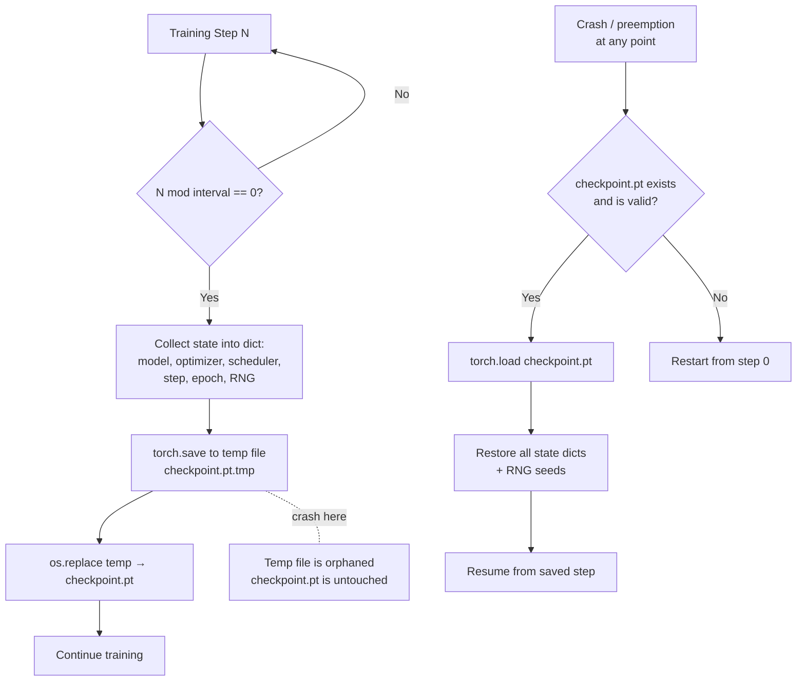

# Checkpoint Save and Resume

## Learning Objectives

- Implement an atomic checkpoint save that writes to a temporary file and renames, so a crash mid-write never corrupts the previous checkpoint.
- Capture the full training state — model weights, optimizer momentum, scheduler position, step counter, and RNG seeds for Python, NumPy, and PyTorch — into a single reloadable payload.
- Resume training from a checkpoint and verify loss continuity across the resume boundary by comparing pre-crash and post-resume loss values.
- Compare model-only checkpoints (`weights_only=True`, Safetensors) against full training-state checkpoints and explain when each is appropriate.
- Implement checkpoint pruning and best-model tracking so disk usage stays bounded and the highest-performing model is always recoverable.

## The Problem

Training runs die. A GPU hits an out-of-memory error at hour 9 of a 12-hour job. A spot instance gets preempted with two minutes of warning. The power goes out in the data center. None of these are exceptional — they are the expected operating conditions for long-running compute jobs. If you have no mechanism to capture and restore state, every failure means starting from step zero: re-initializing weights, re-warming the optimizer, and re-paying for every gradient step you already computed.

The failure mode is worse than losing model weights alone. AdamW maintains per-parameter momentum buffers — exponentially moving averages of the gradient and the squared gradient — that encode the recent trajectory of training. If you save the model weights but omit the optimizer state, the resumed run starts with zeroed momentum buffers. The first few hundred steps after resume produce noisy, oversized parameter updates that destabilize the loss curve, effectively erasing the last hour of convergence even though the weights look correct on paper. You also need the learning rate scheduler's internal step counter: without it, the scheduler restarts from step zero and applies the wrong learning rate for the rest of training.

The third silent failure is RNG state. PyTorch, NumPy, and Python's `random` module each maintain independent pseudo-random number generators. Every shuffle, every dropout mask, every data augmentation draw advances these generators. If you restore the model and optimizer but not the RNG state, the resumed run sees a different batch ordering than the uninterrupted run would have produced at the same step. The loss curve diverges from what it should be — not catastrophically, but enough that experiments become unreproducible and debugging becomes guesswork.

## The Concept

A checkpoint is a serialized snapshot of every state variable required to continue training. The mechanism is dictionary serialization: you construct a Python dict containing all state objects, serialize it to disk, and load it back later to reconstruct the training context. For PyTorch, `torch.save` serializes the dict using pickle, and `torch.load` deserializes it. The critical question is not *how to serialize* — it is *what to put in the dict* and *how to write it to disk safely*.

The minimum viable checkpoint dict contains: model parameters (`model.state_dict()`), optimizer state (`optimizer.state_dict()`), scheduler state (`scheduler.state_dict()`), the current step counter, the current epoch, the loss history, and the RNG state for all three generators. Omit any of these and the resumed run behaves differently from the uninterrupted run. The optimizer state is the most commonly forgotten — developers assume it is bundled with the model, but it lives in a separate object.



The atomic write pattern is what makes checkpointing safe under arbitrary crash conditions. The naive approach — writing directly to `checkpoint.pt` — leaves a partially written file if the process is killed mid-write. The next resume attempt loads a truncated or corrupt file and either crashes or silently loads garbage. The fix is a two-step write: serialize to a temporary file in the same directory (`checkpoint.pt.tmp`), then use `os.replace` to atomically rename the temp file to the final path. On POSIX systems, `os.replace` is atomic at the filesystem level — either the rename completes and `checkpoint.pt` points to the new data, or it does not and `checkpoint.pt` still points to the previous good version. A crash during the `torch.save` call leaves an orphaned `.tmp` file but never corrupts the existing checkpoint.

The `weights_only=True` flag in `torch.load` addresses a separate risk: pickle deserialization can execute arbitrary code embedded in the checkpoint file. If an attacker can modify your checkpoint (via a compromised storage bucket, a supply-chain attack on a shared model registry, or a man-in-the-middle on a download), they can achieve remote code execution when you load it. `weights_only=True` restricts deserialization to tensor objects and basic Python types, rejecting any custom classes or functions. This is sufficient for loading model weights in isolation, but it rejects the full training-state checkpoint because optimizer and scheduler state dicts contain objects that require unpickling. For full training-state checkpoints loaded from trusted storage, `weights_only=False` is necessary but you must trust the file's provenance. The Safetensors format solves this differently — it stores tensors in a flat binary format with no executable code path, but it only handles tensors, not the Python objects needed for optimizer and scheduler state. In practice, teams use Safetensors for model-weight distribution (untrusted sources) and `torch.save` for internal training checkpoints (trusted storage).

## Build It

The following script demonstrates the complete checkpoint lifecycle in a single runnable file. It trains a toy model for 50 steps, checkpoints the full training state, simulates a process crash by deleting all in-memory objects, creates fresh model/optimizer/scheduler instances, loads the checkpoint, and resumes training to step 100. The loss values around the resume boundary (steps 48–52) confirm continuity — the resumed run picks up exactly where the interrupted run left off.

```python
import os
import shutil
import tempfile
import random
import numpy as np
import torch
import torch.nn as nn

CHECKPOINT_DIR = "ckpt_demo"
CHECKPOINT_PATH = os.path.join(CHECKPOINT_DIR, "training.pt")


def set_all_seeds(seed):
    random.seed(seed)
    np.random.seed(seed)
    torch.manual_seed(seed)


def capture_rng_state():
    return {
        "python": random.getstate(),
        "numpy": np.random.get_state(),
        "torch": torch.get_rng_state(),
    }


def restore_rng_state(states):
    random.setstate(states["python"])
    np.random.set_state(states["numpy"])
    torch.set_rng_state(states["torch"])


class ToyModel(nn.Module):
    def __init__(self):
        super().__init__()
        self.net = nn.Sequential(
            nn.Linear(10, 32),
            nn.ReLU(),
            nn.Linear(32, 1),
        )

    def forward(self, x):
        return self.net(x)


def make_synthetic_data(n=256):
    X = torch.randn(n, 10)
    true_w = torch.randn(10, 1)
    y = X @ true_w + 0.05 * torch.randn(n, 1)
    return X, y


def save_checkpoint(path, model, optimizer, scheduler, global_step, loss_history):
    ckpt = {
        "model_state_dict": model.state_dict(),
        "optimizer_state_dict": optimizer.state_dict(),
        "scheduler_state_dict": scheduler.state_dict(),
        "global_step": global_step,
        "loss_history": loss_history,
        "rng_states": capture_rng_state(),
    }
    os.makedirs(os.path.dirname(os.path.abspath(path)), exist_ok=True)
    dir_name = os.path.dirname(os.path.abspath(path))
    fd, tmp_path = tempfile.mkstemp(dir=dir_name, suffix=".tmp")
    os.close(fd)
    torch.save(ckpt, tmp_path)
    os.replace(tmp_path, path)
    print(f"  [ckpt] saved step {global_step} -> {path}")


def load_checkpoint(path, model, optimizer, scheduler):
    ckpt = torch.load(path, weights_only=False)
    model.load_state_dict(ckpt["model_state_dict"])
    optimizer.load_state_dict(ckpt["optimizer_state_dict"])
    scheduler.load_state_dict(ckpt["scheduler_state_dict"])
    restore_rng_state(ckpt["rng_states"])
    print(f"  [ckpt] loaded step {ckpt['global_step']} <- {path}")
    return ckpt["global_step"], ckpt["loss_history"]


def train(model, optimizer, scheduler, loss_fn, X, y,
          start_step, loss_history, total_steps, ckpt_interval, label):
    step = start_step
    batch_size = 32
    n = X.shape[0]

    while step < total_steps:
        idx = torch.randperm(n)[:batch_size]
        xb, yb = X[idx], y[idx]

        pred = model(xb)
        loss = loss_fn(pred, yb)

        optimizer.zero_grad()
        loss.backward()
        optimizer.step()
        scheduler.step()

        loss_history.append(loss.item())
        step += 1

        if step % 10 == 0:
            lr = scheduler.get_last_lr()[0]
            print(f"  [{label}] step {step:4d} | loss {loss.item():.6f} | lr {lr:.6f}")

        if step % ckpt_interval == 0:
            save_checkpoint(CHECKPOINT_PATH, model, optimizer, scheduler,
                            step, loss_history)

    return step, loss_history


def run_demo():
    os.makedirs(CHECKPOINT_DIR, exist_ok=True)

    set_all_seeds(42)
    X, y = make_synthetic_data()

    model = ToyModel()
    optimizer = torch.optim.AdamW(model.parameters(), lr=0.01, weight_decay=0.01)
    scheduler = torch.optim.lr_scheduler.CosineAnnealingLR(optimizer, T_max=100)
    loss_fn = nn.MSELoss()

    print("=" * 60)
    print("PHASE 1: Train from scratch (steps 1-50)")
    print("=" * 60)
    _, loss_history = train(
        model, optimizer, scheduler, loss_fn, X, y,
        start_step=0, loss_history=[],
        total_steps=50, ckpt_interval=25, label="initial",
    )

    print()
    print("=" * 60)
    print("PHASE 2: Simulated crash — all objects destroyed")
    print("=" * 60)
    print(f"  steps completed: {len(loss_history)}")
    print(f"  last 3 losses: {[round(l, 6) for l in loss_history[-3:]]}")
    del model, optimizer, scheduler

    model = ToyModel()
    optimizer = torch.optim.AdamW(model.parameters(), lr=0.01, weight_decay=0.01)
    scheduler = torch.optim.lr_scheduler.CosineAnnealingLR(optimizer, T_max=100)

    print()
    print("=" * 60)
    print("PHASE 3: Resume from checkpoint (steps 51-100)")
    print("=" * 60)
    step, loss_history = load_checkpoint(
        CHECKPOINT_PATH, model, optimizer, scheduler
    )
    _, loss_history = train(
        model, optimizer, scheduler, loss_fn, X, y,
        start_step=step, loss_history=loss_history,
        total_steps=100, ckpt_interval=999, label="resumed",
    )

    print()
    print("=" * 60)
    print("VERIFICATION: Loss around resume boundary")
    print("=" * 60)
    boundary_losses = {
        "step 48": loss_history[47],
        "step 49": loss_history[48],
        "step 50": loss_history[49],
        "step 51 (first post-resume)": loss_history[50],
        "step 52": loss_history[51],
    }
    for label_str, val in boundary_losses.items():
        print(f"  {label_str:35s} loss = {val:.6f}")

    print()
    print("  If RNG + optimizer state restored correctly,")
    print("  step 51 loss is the value an uninterrupted run would produce.")
    print("  No discontinuity at the boundary means checkpoint is complete.")

    shutil.rmtree(CHECKPOINT_DIR)


if __name__ == "__main__":
    run_demo()
```

When you run this script, the output shows the initial training phase reaching step 50, the checkpoint load message confirming step 50 was restored, and the resumed training continuing to step 100. The verification block at the end prints losses for steps 48–52 — step 50 is the last pre-crash step and step 51 is the first post-resume step. If the RNG state was restored correctly, the batch selected at step 51 matches what an uninterrupted run would have drawn, and the loss value is continuous with the pre-crash trajectory.

## Use It

The checkpoint pattern — save progress to durable storage, resume from the last saved position on failure — is the same mechanism that makes batch enrichment pipelines reliable in GTM systems. When you are scoring 10,000 accounts through a multi-step enrichment waterfall in Clay (company firmographics → technographics → intent signals → ICP fit score), each row is an independent unit of work, and each step in the waterfall is a state transition. If the enrichment job fails at row 4,000 because an API rate limit triggered a timeout, restarting from row 1 wastes the compute and API calls already spent on rows 1–3,999. Checkpoint semantics — writing `(row_id, step_id, partial_result)` to a persistent store after each row completes — means the retry starts at row 4,000, step 1, with all prior results intact.

This is the mechanism behind reliable batch processing in Zone 2 (Enrichment & Scoring). The "checkpoint" in a GTM context is not a `.pt` file — it is a row in a database or a line in a JSONL file that records the last successfully processed record. The "resume" function reads that record, queries the source data for everything after that position, and continues the enrichment loop. The