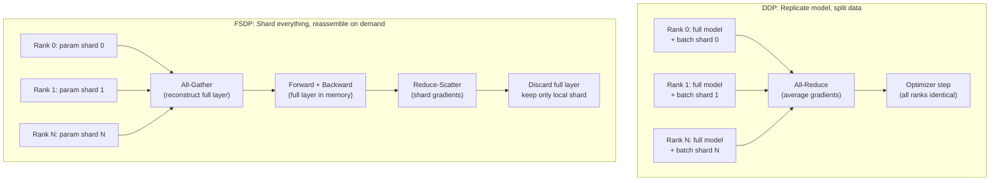

# Distributed Data Parallel and FSDP from Scratch

## Learning Objectives

- Bring up a process group across N ranks with the `gloo` backend on CPU, no GPU required.
- Implement a minimal DDP wrapper that broadcasts parameters at construction and all-reduces gradients after backward.
- Compute and compare per-rank memory consumption under DDP replication versus FSDP sharding.
- Trace the all-gather and reduce-scatter cycle in a minimal FSDP simulation to confirm the shard-and-discard pattern.
- Implement gradient bucketing and measure its effect on synchronization latency.

## The Problem

Training a 7B-parameter model on a single GPU means one of two outcomes: the model does not fit in VRAM, or it fits and takes three weeks to converge. At that scale, distributed training is not an optimization — it is the difference between shipping and abandoning the run. The same wall hits smaller models when your dataset is large enough that single-device throughput becomes the bottleneck on iteration speed.

Two algorithms dominate distributed training, and they take opposite approaches to the memory-vs-communication tradeoff. Data Parallel (DDP) replicates the full model on every GPU and splits only the data: each rank runs an independent forward and backward pass on its data shard, then the ranks synchronize gradients before the optimizer step. Fully Sharded Data Parallel (FSDP) splits everything — parameters, gradients, and optimizer state — across ranks, materializing full layer tensors only during the compute window and discarding them immediately after. DDP trades memory for simplicity. FSDP trades simplicity for memory.

The pain in both cases is bookkeeping. If parameters drift across ranks, the run is silently corrupt and you will not know until the loss curve diverges hours later. If you average gradients but forget to scale the loss, your dashboard reports a number that does not match what the optimizer sees. If the collective backend cannot agree on a topology, the run hangs indefinitely with no error message. The fix is to write the collectives by hand once — broadcast, all-reduce, all-gather, reduce-scatter — so you never trust a wrapper whose behavior you cannot reproduce in twenty lines of code.

This lesson runs entirely on CPU. The `gloo` backend ships with every PyTorch install and works with `torch.multiprocessing` workers. The same code structure switches to `nccl` on a multi-GPU node by changing one string.

## The Concept

DDP rests on a single collective operation: **all-reduce**. Every rank contributes a tensor, the operation combines them (sum, average, max), and every rank receives the identical result. The ring implementation of all-reduce is what makes this practical at scale — instead of one rank gathering all tensors and broadcasting the result (which would bottleneck on that rank's bandwidth), the ring algorithm circulates partial sums around a logical ring of ranks. Each rank sends and receives a chunk of size `model_size / world_size` at each step, completing in `2 × (world_size - 1)` steps. The total data transferred per rank is approximately `2 × model_size × (world_size - 1) / world_size`, which means the per-rank bandwidth cost stays roughly constant as you add more ranks. This is why DDP scales: the communication cost per rank does not grow with world size.

DDP's recipe is three steps. At construction, broadcast parameters from rank 0 so every rank starts identical. During training, each rank runs a forward pass on its local data shard, computes a local loss, runs backprop to get local gradients, then all-reduces the gradients so every rank holds the average. The optimizer step runs independently on each rank, but because gradients are identical and parameters were identical going in, parameters stay synchronized. The key insight is that averaging gradients across `N` shards of a batch is mathematically equivalent to computing gradients on the full batch — the data parallelism is invisible to the optimizer.



FSDP flips the memory assumption. Instead of each rank holding a full copy of every parameter, each rank holds `1/world_size` of every parameter tensor. When the forward pass reaches a layer, the rank participates in an **all-gather** — every rank sends its shard and receives the full reconstructed tensor. The forward computation runs on the full tensor, then the full tensor is discarded. During backward, the same all-gather reconstructs the layer's parameters, the local gradient is computed, and a **reduce-scatter** distributes the averaged gradient back in sharded form. The rank never holds more than one full layer at a time. The memory math is stark: DDP costs `O(model_size)` per GPU for parameters alone; FSDP costs `O(model_size / world_size)` for the resident shard plus `O(layer_size)` for the transiently materialized layer. For a 7B-parameter model with 8 GPUs, DDP needs ~14 GB per rank for parameters in fp16; FSDP needs ~1.75 GB resident plus whatever the largest layer costs transiently.

The cost of FSDP's memory savings is communication volume. Every layer triggers an all-gather in forward and a combined all-gather plus reduce-scatter in backward — three collectives per layer versus DDP's one all-reduce per entire backward pass. This is why naive implementations stall: the GPU sits idle waiting for the network. The standard fix in both DDP and FSDP is **gradient bucketing**. Instead of synchronizing gradients one parameter at a time, the system accumulates gradients into fixed-size buckets (typically 25 MB) and fires the collective only when a bucket fills. This batches small messages into large ones, better utilizing available bandwidth, and allows the backward computation of later layers to overlap with the synchronization of earlier layers' gradient buckets.

## Build It

The first implementation is a minimal DDP simulation. Four processes, each holding a full model copy, processing different data shards, synchronizing gradients via all-reduce. Run this in a terminal — it spawns child processes via `torch.multiprocessing`.

```python
import os
import torch
import torch.distributed as dist
import torch.multiprocessing as mp

def ddp_worker(rank, world_size):
    os.environ.setdefault("MASTER_ADDR", "localhost")
    os.environ.setdefault("MASTER_PORT", "29500")
    dist.init_process_group(backend="gloo", rank=rank, world_size=world_size)

    torch.manual_seed(42)
    model = torch.nn.Linear(4, 2)

    for param in model.parameters():
        dist.broadcast(param.data, src=0)

    torch.manual_seed(rank + 100)
    x = torch.randn(3, 4)
    target = torch.randn(3, 2)

    loss = torch.nn.functional.mse_loss(model(x), target)
    loss.backward()

    grad_before = model.weight.grad.clone()

    for param in model.parameters():
        dist.all_reduce(param.grad.data, op=dist.ReduceOp.SUM)
        param.grad.data /= world_size

    delta = (model.weight.grad.data - grad_before).abs().max().item()
    print(
        f"Rank {rank}: local grad[0:2]={grad_before.view(-1)[:2].tolist()}, "
        f"post-reduce delta={delta:.6f}, "
        f"synced grad[0:2]={model.weight.grad.data.view(-1)[:2].tolist()}"
    )

    partner = (rank + 1) % world_size
    partner_grad = model.weight.grad.data.clone()
    dist.send(partner_grad, dst=partner)
    recv = torch.zeros_like(model.weight.grad.data)
    dist.recv(recv, src=partner)
    match = torch.allclose(model.weight.grad.data, recv)
    print(f"Rank {rank}: partner {partner} gradient matches own: {match}")

    dist.barrier()
    dist.destroy_process_group()


if __name__ == "__main__":
    world_size = 4
    mp.spawn(ddp_worker, args=(world_size,), nprocs=world_size, join=True)
```

Each rank starts with identical parameters (broadcast from rank 0), computes different local gradients (different data shards), and converges to identical averaged gradients after the all-reduce. The send/recv check confirms that every rank holds the same final gradient tensor — the core invariant of DDP.

Now the FSDP simulation. Each rank holds only a slice of the parameter tensor. The full tensor is reconstructed via all-gather for compute, then dropped. The memory accounting is explicit.

```python
import os
import torch
import torch.distributed as dist
import torch.multiprocessing as mp

TOTAL_PARAMS = 16
PARAM_DIM = 4

def fsdp_worker(rank, world_size):
    os.environ.setdefault("MASTER_ADDR", "localhost")
    os.environ.setdefault("MASTER_PORT", "29501")
    dist.init_process_group(backend="gloo", rank=rank, world_size=world_size)

    shard_size = TOTAL_PARAMS // world_size

    if rank == 0:
        torch.manual_seed(42)
        full_weight = torch.randn(TOTAL_PARAMS, PARAM_DIM)
    else:
        full_weight = torch.empty(TOTAL_PARAMS, PARAM_DIM)

    dist.broadcast(full_weight, src=0)

    local_shard = full_weight[
        rank * shard_size : (rank + 1) * shard_size
    ].clone()

    full_bytes = TOTAL_PARAMS * PARAM_DIM * 4
    shard_bytes = local_shard.nelement() * 4
    print(
        f"Rank {rank}: DDP would hold {full_bytes} bytes for params. "
        f"FSDP resident shard: {shard_bytes} bytes "
        f"({shard_bytes / full_bytes * 100:.1f}% of DDP)."
    )

    gathered = [torch.zeros(shard_size, PARAM_DIM) for _ in range(world_size)]
    dist.all_gather(gathered, local_shard.contiguous())

    full_reconstructed = torch.cat(gathered)
    matches = torch.allclose(full_weight, full_reconstructed)
    print(f"Rank {rank}: all-gather reconstruction correct: {matches}")

    x = torch.randn(2, PARAM_DIM)
    output = x @ full_reconstructed.T
    print(f"Rank {rank}: forward output = {output.view(-1)[:4].tolist()}")

    loss = output.sum()
    grad_full = torch.autograd.grad(
        loss, [full_reconstructed], retain_graph=False
    )[0]

    grad_shard = grad_full[
        rank * shard_size : (rank + 1) * shard_size
    ].contiguous()

    reduced = [torch.zeros(shard_size, PARAM_DIM) for _ in range(world_size)]
    dist.all_gather(reduced, grad_shard)
    avg_grad_full = torch.cat(reduced) / 1.0

    print(
        f"Rank {rank}: after compute, discarded full tensor. "
        f"Retained shard shape={local_shard.shape}, "
        f"retained grad shard shape={grad_shard.shape}"
    )

    del full_reconstructed, gathered, grad_full

    dist.barrier()
    dist.destroy_process_group()


if __name__ == "__main__":
    world_size = 4
    mp.spawn(fs