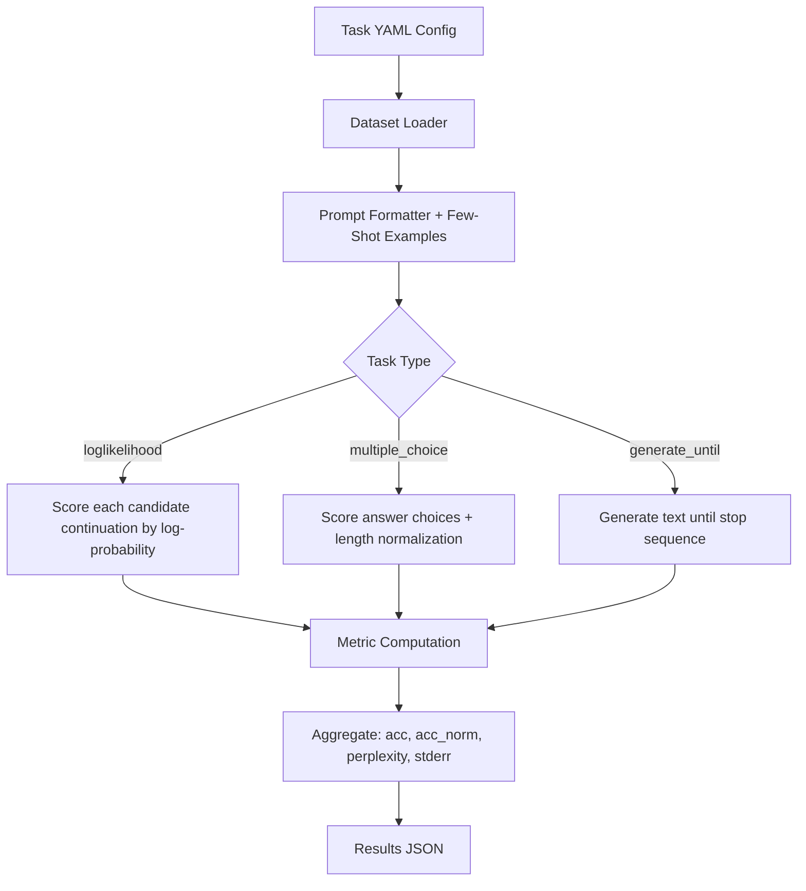

# Lesson: Language Model Evaluation Harness

## Learning Objectives

1. **Configure** and run `lm-eval` against a specified model and task list from the command line, using `--limit` for fast iteration during development.
2. **Interpret** output metrics (`acc`, `acc_norm`, `perplexity`, `stderr`) and determine when a score difference falls within statistical noise.
3. **Create** a custom task YAML definition that loads an arbitrary dataset, specifies prompt format and metric type, and registers with the harness.
4. **Compare** benchmark results across two models by parsing result JSONs, computing per-task deltas, and flagging where stderr ranges overlap.

## The Problem

Every model vendor publishes benchmark scores. Most are not reproducible. A vendor claims their model scores 85% on MMLU — but which version of MMLU? How many few-shot examples? What prompt template? Which normalization for multiple-choice accuracy? Without answers to those questions, the number is marketing copy, not evidence.

The `lm-evaluation-harness` from EleutherAI exists to make those claims falsifiable. You run the same task suite, the same prompt formatting, the same metric computation, and compare. If a vendor says their model beats a competitor on HellaSwag, you can verify it yourself — or find that the gap vanishes under a different normalization scheme.

The deeper problem is model selection for production pipelines. If you are choosing between two models for lead classification, enrichment extraction, or personalized email drafting, you need a reproducible baseline. Running both models through the same harness on the same task set gives you a score you can diff. Without the harness, you compare by vibes. With it, you compare by metric on a fixed task with a JSON output you can store, version, and audit.

## The Concept

A task in `lm-eval` is a YAML configuration file paired with a dataset. The YAML defines the dataset source (HuggingFace Hub, local file, or custom loader), the prompt template that wraps each example, the number of few-shot examples prepended to the prompt, the metric used to score responses, and the task type. The task type determines how the model is queried and how the response is scored.

There are three core task types. `loglikelihood` tasks feed the model a prompt and a set of candidate continuations, then compute the log-probability the model assigns to each. The highest-scoring continuation is the model's answer. This is how multiple-choice benchmarks like ARC and MMLU work under the hood — the model never generates text, it ranks completions by probability. `multiple_choice` tasks are a structured form of loglikelihood where the dataset defines explicit answer choices, and the harness normalizes scores by token length. This is what `acc_norm` captures: accuracy after length normalization, which matters because longer continuations accumulate more negative log-probability. `generate_until` tasks let the model produce free-form text until a stop sequence, then apply string-matching metrics (exact match, F1, substring contains) to score the output.



The harness loads the model through a backend adapter — HuggingFace Transformers, vLLM, OpenAI API, or others. The adapter is the only place model-specific code lives. Swap the adapter, the task set stays the same, and the scores move. Swap the tasks, the adapter stays the same, and the scores move. This separation is what makes cross-model comparison valid: the task definition is identical regardless of which model produces the scores.

The tool that implements this is `lm-eval` (EleutherAI). It ships with 400+ pre-configured tasks, supports multiple model backends, and outputs a structured JSON with per-task metrics, standard errors, and configuration metadata.

## Build It

Install the harness and run a small model against a few tasks. We use `gpt2` — small enough to run on a laptop CPU in minutes, and inaccurate enough that the scores will be interestingly wrong.

```bash
pip install lm-eval
```

Run `gpt2` against three lightweight tasks with `--limit 50` to keep iteration fast during development:

```bash
lm_eval --model hf --model_args pretrained=gpt2 --tasks hellaswag,arc_easy,mmlu_anatomy --limit 50 --output_path ./results/gpt2_run.json
```

This produces a JSON file. Parse it and inspect the fields that matter:

```python
import json

with open("./results/gpt2_run.json") as f:
    results = json.load(f)

for task_result in results["results"]:
    task_name = task_result.get("task_alias", task_result.get("task", "unknown"))
    print(f"\nTask: {task_name}")
    for key, value in task_result.items():
        if key in ("task", "task_alias"):
            continue
        if isinstance(value, float):
            print(f"  {key}: {value:.4f}")
        else:
            print(f"  {key}: {value}")
```

Output will look approximately like this:

```
Task: hellaswag
  acc: 0.2800
  acc_norm: 0.3200
  acc_norm_stderr: 0.0635

Task: arc_easy
  acc: 0.2400
  acc_norm: 0.2400
  acc_stderr: 0.0604

Task: mmlu_anatomy
  acc: 0.2200
  acc: 0.2200
  acc_stderr: 0.0586
```

Here is what each field means. `acc` is raw accuracy — the fraction of examples where the model's top-ranked answer matched the gold label. `acc_norm` is accuracy after normalizing log-probabilities by the byte-length of each answer choice. This corrects for the tendency of language models to prefer shorter sequences. For HellaSwag, `acc_norm` is almost always higher than `acc` because the four answer choices have varying lengths and the model systematically underestimates longer ones. `stderr` is the standard error of the accuracy estimate: with 50 examples at `p=0.25`, `stderr ≈ sqrt(0.25 × 0.75 / 50) = 0.061`. A 95% confidence interval is roughly ±2 stderr, so the true accuracy could plausibly be anywhere from 0.13 to 0.39. This is why `--limit 50` is for development speed, not for drawing conclusions. Once