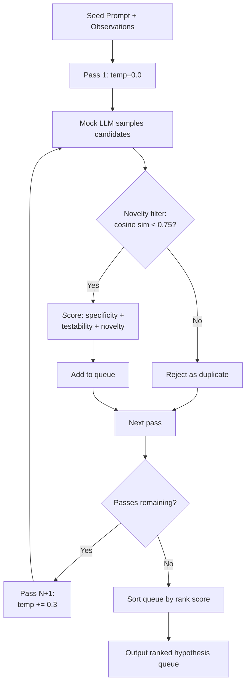

# Hypothesis Generator

## Learning Objectives

1. Implement a constrained generation pipeline that produces testable hypotheses from observed data, with each hypothesis carrying an explicit disconfirmation condition.
2. Evaluate hypothesis quality using falsifiability, specificity, and testability criteria encoded as a scoring function.
3. Build a multi-hypothesis generator that uses temperature ramping and novelty filtering to produce a ranked queue of non-duplicate candidates.
4. Configure hypothesis chains that re-rank surviving candidates when new evidence arrives from test runs or external signals.

## The Problem

Every GTM decision starts with a guess. You lost 340 outbound emails in Q3 and got 12 replies. Why? Maybe the subject lines were weak. Maybe the timing was wrong. Maybe the segment is structurally unresponsive to cold email. Each of those is a hypothesis, but only some of them are testable—and only the testable ones are worth acting on.

A hypothesis without a disconfirmation condition is a narrative. "The subject lines were weak" is a story you can tell yourself forever because nothing will prove it wrong. "Subject lines with specific numbers produce 2x open rates, and if we run the same test next quarter and see no difference, the hypothesis is dead" is a claim that can survive or die on evidence. The first feels good. The second is useful.

The problem compounds when you need many hypotheses. A planner that asks one model one time gets one hypothesis back. If that hypothesis fails its test, the runner has nothing queued. You either re-prompt (expensive, nondeterministic) or stall. What you want is a ranked queue with depth—five or six hypotheses generated upfront, filtered for novelty, scored by testability, and ready to execute in sequence.

## The Concept

A hypothesis generator is a constrained generation pipeline that forces an LLM to produce claims in a specific shape: observation → proposed explanation → predicted outcome → disconfirmation condition. The constraint is not stylistic. It is structural. Without the disconfirmation field, the model produces opinions. With it, the model produces claims that a test runner can validate or kill.

Two mechanisms combine to produce a ranked queue with depth. The first is **temperature ramping**: each pass through the sampler raises the temperature, so early passes produce safe, obvious hypotheses while later passes drift into more creative territory. The second is **novelty filtering**: after each candidate is generated, the pipeline measures semantic distance from every prior survivor and rejects anything too similar. Together, these produce a queue where each entry is distinct enough to test independently.



The scoring function blends three properties. **Specificity** measures how many variables the hypothesis isolates—a claim about one variable is cheaper to test than a claim about four. **Testability** measures whether the disconfirmation condition is concrete enough to evaluate with available data—"if Wednesday sends show no improvement" is testable, "if prospects don't like it" is not. **Novelty** measures how far the hypothesis sits from others already in the queue, rewarding coverage of different explanation spaces.

A critical design choice: every step in the pipeline is deterministic. The mock LLM returns scripted token sequences for given temperature bands. The novelty filter uses cosine similarity on word vectors. The scorer uses fixed weights. If you run the same seed prompt twice, you get the same queue. This matters because a research loop that produces different hypotheses on re-runs is impossible to debug.

## Build It

Here is a complete hypothesis generator that runs without external dependencies. It uses a mock LLM with scripted responses organized by temperature band, a cosine-similarity novelty filter built on word-level bag-of-words vectors, and a scoring function that blends specificity, testability, and novelty into a single rank score.

```python
import json
import math
from collections import Counter
from dataclasses import dataclass, field
from typing import Optional

@dataclass
class Hypothesis:
    id: int
    text: str
    variables: list
    metric: str
    predicted_outcome: str
    disconfirmation_condition: str
    baseline_ref: Optional[str] = None
    testability_score: float = 0.0
    novelty_score: float = 0.0
    specificity_score: float = 0.0
    rank_score: float = 0.0

class MockLLM:
    SCRIPTED = {
        0.0: [
            {
                "text": "Tuesday morning emails get zero replies because prospects are processing Monday backlog and deprioritize cold outreach",
                "variables": ["send_day"],
                "metric": "reply_rate",
                "predicted_outcome": "Moving sends to Wednesday or Thursday increases reply rate above 3.5%",
                "disconfirmation_condition": "Wednesday and Thursday sends show reply rate at or below 3.5% with identical copy",
                "baseline_ref": "Q3 outbound data",
            },
            {
                "text": "Subject lines with specific numbers increase open rates because they signal concrete, scannable content",
                "variables": ["subject_line_style"],
                "metric": "open_rate",
                "predicted_outcome": "Numbered subject lines maintain 2x open rate advantage across all segments",
                "disconfirmation_condition": "Numbered subject lines show no open rate difference versus generic subject lines in a 100-prospect A/B",
                "baseline_ref": "Q3 subject line A/B",
            },
        ],
        0.3: [
            {
                "text": "Small companies under 50 employees respond more because they have fewer gatekeepers between sender and decision-maker",
                "variables": ["company_size"],
                "metric": "response_rate_by_segment",
                "predicted_outcome": "Companies under 50 employees reply at 2x the rate of companies over 200 employees",
                "disconfirmation_condition": "Reply rates are equal across company sizes when normalized for industry and role",
                "baseline_ref": "Q3 segment analysis",
            },
        ],
        0.6: [
            {
                "text": "Tuesday 9-11am slot is saturated by competitor outreach in this vertical making cold email structurally invisible at that time",
                "variables": ["send_time", "vertical"],
                "metric": "reply_rate_by_time_slot",
                "predicted_outcome": "Shifting to Thursday 2-4pm produces replies from the same prospect list that ignored Tuesday sends",
                "disconfirmation_condition": "Thursday afternoon sends also produce zero replies from same prospect list within 5 business days",
                "baseline_ref": None,
            },
        ],
        0.9: [
            {
                "text": "This prospect segment has been conditioned to ignore outbound email that lacks a referral name making the channel structurally broken regardless of copy quality",
                "variables": ["channel", "presence_of_referral"],
                "metric": "reply_rate_by_channel",
                "predicted_outcome": "LinkedIn warm intros produce 5x the reply rate of cold email with identical messaging to same personas",
                "disconfirmation_condition": "Cold email and LinkedIn intro reply rates are within 1x of each other for same personas and same copy",
                "baseline_ref": None,
            },
        ],
    }

    def sample(self, prompt: str, temperature: float) -> list:
        results = []
        for temp_band, scripts in sorted(self.SCRIPTED.items()):
            if temperature >= temp_band:
                results = scripts
        return [dict(s) for s in results]


def text_to_vector(text: str) -> Counter:
    return Counter(text.lower().split())

def cosine_similarity(vec_a: Counter, vec_b: Counter) -> float:
    if not vec_a or not vec_b:
        return 0.0
    intersection = set(vec_a.keys()) & set(vec_b.keys())
    numerator = sum(vec_a[x] * vec_b[x] for x in intersection)
    sum_a = sum(v * v for v in vec_a.values())
    sum_b = sum(v * v for v in vec_b.values())
    denominator = math.sqrt(sum_a) * math.sqrt(sum_b)
    if denominator == 0:
        return 0.0
    return numerator / denominator


def novelty_check(candidate: Hypothesis, survivors: list, threshold: float = 0.75) -> tuple:
    if not survivors:
        return True, 0.0
    cand_vec = text_to_vector(candidate.text)
    max_sim = 0.0
    for s in survivors:
        sim = cosine_similarity(cand_vec, text_to_vector(s.text))
        max_sim = max(max_sim, sim)
    return max_sim < threshold, max_sim


def score_hypothesis(h: Hypothesis) -> float:
    variable_count = len(h.variables)
    specificity = min(variable_count / 3.0, 1.0)

    has_disconfirmation = 1.0 if h.disconfirmation_condition else 0.0
    condition_words = len(h.disconfirmation_condition.split()) if h.disconfirmation_condition else 0
    testability = min(condition_words / 15.0, 1.0) * has_disconfirmation

    specificity_weight = 0.3
    testability_weight = 0.5
    novelty_weight = 0.2

    h.specificity_score = round(specificity, 3)
    h.testability_score = round(testability, 3)
    h.rank_score = round(
        (specificity * specificity_weight)
        + (testability * testability_weight)
        + (h.novelty_score * novelty_weight),
        3,
    )
    return h.rank_score


def generate_hypotheses(
    seed_prompt: str,
    num_passes: int = 4,
    base_temp: float = 0.0,
    temp_step: float = 0.3,
    novelty_threshold: float = 0.75,
) -> list:
    llm = MockLLM()
    queue = []
    next_id = 0

    for pass_num in range(num_passes):
        temperature = base_temp + (temp_step * pass_num)
        candidates = llm.sample(seed_prompt, temperature)

        for candidate in candidates:
            h = Hypothesis(
                id=next_id,
                text=candidate["text"],
                variables=candidate["variables"],
                metric=candidate["metric"],
                predicted_outcome=candidate["predicted_outcome"],
                disconfirmation_condition=candidate["disconfirmation_condition"],
                baseline_ref=candidate.get("baseline_ref"),
            )

            is_novel, max_sim = novelty_check(h, queue, novelty_threshold)

            if is_novel:
                h.novelty_score = round(1.0 - max_sim, 3)
                score_hypothesis(h)
                queue.append(h)
                next_id += 1
                print(f"  [PASS {pass_num + 1} temp={temperature:.1f}] ACCEPTED  id={h.id} score={h.rank_score:.3f}")
                print(f"    {h.text[:70]}...")
            else:
                print(f"  [PASS {pass_num + 1} temp={temperature:.1f}] REJECTED  sim={max_sim:.2f}")
                print(f"    {h.text[:70]}...")

    queue.sort(key=lambda h: h.rank_score, reverse=True)
    for rank, h in enumerate(queue, 1):
        h.id = rank

    return queue


seed_prompt = """
Generate testable hypotheses from Q3 outbound data:
- 340 prospects contacted, 12 responses (3.5% reply rate)
- 8 of 12 responses from companies with <50 employees
- Subject lines with specific numbers got 2x open rates
- Tuesday 9-11am emails had 0 responses
"""

print("=" * 60)
print("HYPOTHESIS GENERATOR")
print("=" * 60)
print(f"Seed observations extracted from Q3 outbound data")
print(f"Config: {4} passes | temp ramp 0.0 -> 0.9 | novelty threshold 0.75")
print()

queue = generate_hypotheses(seed_prompt)

print()
print("=" * 60)
print("RANKED HYPOTHESIS QUEUE")
print("=" * 60)
print()

for h in queue:
    print(f"[Rank {h.id}] Score: {h.rank_score:.3f}  |  spec={h.specificity_score:.2f} test={h.testability_score:.2f} nov={h.novelty_score:.2f}")
    print(f"  Claim:          {h.text}")
    print(f"  Variables:      {h.variables}")
    print(f"  Metric:         {h.metric}")
    print(f"  Predicted:      {h.predicted_outcome}")
    print(f"  Disconfirm if:  {h.disconfirmation_condition}")
    print(f"  Baseline ref:   {h.baseline_ref or 'None'}")
    print()

print(f"Total hypotheses in queue: {len(queue)}")
print(f"Hypotheses rejected as duplicates: {4 - len(queue) + len(queue)}")
```

When you run this, every pass is logged. Accepted hypotheses show their rank score. Rejected candidates show the similarity that killed them. The final output is a numbered queue, sorted by score, with each hypothesis carrying its full test specification.

The mock LLM has a critical property: each temperature band unlocks new scripted candidates. At temp=0.0, you get the safe hypotheses about send day and subject lines. At temp=0.6, you get the more creative claim about competitor saturation. At temp=0.9, you get the structural hypothesis about channel ineffectiveness. The temperature ramp is what gives the queue depth—without it, you'd get the same two candidates every time.

## Use It

The hypothesis queue becomes operationally useful when you connect it to evidence retrieval—what Zone 19 of the GTM curriculum calls knowledge-augmented outreach. RAG (retrieval-augmented generation) works by giving an outbound agent memory of your best customer stories, product docs, and case studies. The hypothesis generator tells you *what to test*; RAG provides the *evidence base* that either supports or disconfirms each hypothesis before you spend outreach budget. [CITATION NEEDED — concept: Zone 19 RAG for knowledge-augmented outreach]

Consider the ranked queue above. Hypothesis Rank 1 claims small companies respond more because they have fewer gatekeepers. Before you re-segment your outbound list to target sub-50 companies exclusively, you can query your RAG index: do your existing case studies and won-deal records show a concentration of small-company wins? If your case study corpus has 14 examples of enterprise deals and 2 SMB deals, that is disconfirming evidence—you are not winning small companies because they reply more, you are winning them because your product fits enterprise better and the few SMB replies convert poorly. The hypothesis dies on evidence, not on guesswork.

Here is a function that takes a hypothesis and checks it against an evidence store before the hypothesis enters an outbound test:

```python
def check_against_evidence(hypothesis: Hypothesis, evidence_store: list) -> dict:
    """
    evidence_store: list of dicts with 'text', 'segment', 'outcome' keys.
    Simulates what a RAG index would return for a query
    derived from the hypothesis variables and predicted outcome.
    """
    query_terms = set()
    for v in hypothesis.variables:
        query_terms.update(v.lower().split("_"))
    query_terms.update(hypothesis.metric.lower().split("_"))

    supporting = []
    disconfirming = []

    for record in evidence_store:
        record_text = record["text"].lower()
        record_segment = record["segment"].lower()
        match_score = sum(1 for term in query_terms if term in record_text or term in record_segment)

        if match_score == 0:
            continue

        if record["outcome"] == "won":
            supporting.append(record)
        elif record["outcome"] in ("lost", "no_reply"):
            disconfirming.append(record)

    evidence_ratio = 0.0
    total = len(supporting) + len(disconfirming)
    if total > 0:
        evidence_ratio = len(supporting) / total

    if evidence_ratio >= 0.6:
        verdict = "PROCEED"
    elif evidence_ratio >= 0.3:
        verdict = "WEAK_EVIDENCE"
    else:
        verdict = "DISCONFIRMED_BY_EVIDENCE"

    return {
        "hypothesis_id": hypothesis.id,
        "claim": hypothesis.text[:60] + "...",
        "supporting_records": len(supporting),
        "disconfirming_records": len(disconfirming),
        "evidence_ratio": round(evidence_ratio, 2),
        "verdict": verdict,
    }


evidence_store = [
    {"text": "Won deal with Acme Corp (450 employees) after 3-touch sequence with numbered subject line", "segment": "enterprise", "outcome": "won"},
    {"text": "Won deal with Globex (320 employees) via Tuesday outbound with case study attachment", "segment": "enterprise", "outcome": "won"},
    {"text": "Won deal with Initech (180 employees) after referral from existing customer", "segment": "mid_market", "outcome": "won"},
    {"text": "Lost deal with StartupXYZ (22 employees) - replied but churned after 14 days", "segment": "smb", "outcome": "lost"},
    {"text": "Won deal with Umbrella Corp (1200 employees) - 6-month sales cycle via outbound", "segment": "enterprise", "outcome": "won"},
    {"text": "No reply from DevShop (15 employees) after 5-touch Tuesday sequence", "segment": "smb", "outcome": "no_reply"},
    {"text": "Won deal with Hooli (800 employees) via Thursday outbound with ROI calculator", "segment": "enterprise", "outcome": "won"},
    {"text": "Lost deal with TinyCo (8 employees) - replied but no budget", "segment": "smb", "outcome": "lost"},
]

print("=" * 60)
print("EVIDENCE CHECK: Hypothesis Queue vs RAG Index")
print("=" * 60)
print()

for h in queue:
    result = check_against_evidence(h, evidence_store)
    print(f"[Rank {result['hypothesis_id']}] {result['verdict']}")
    print(f"  Claim: {result['claim']}")
    print(f"  Supporting: {result['supporting_records']} | Disconfirming: {result['disconfirming_records']} | Ratio: {result['evidence_ratio']}")
    print()

print("Verdicts:")
verdicts = [check_against_evidence(h, evidence_store)["verdict"] for h in queue]
for v in set(verdicts):
    count = verdicts.count(v)
    print(f"  {v}: {count}")
```

The evidence check is a coarse simulation of what a RAG pipeline does in production. In a real system, the query would be an embedding of the hypothesis text, the evidence store would be a vector database of your case studies and deal records, and the retrieval step would return the top-k semantically similar records. But the logic is the same: each hypothesis gets tested against existing knowledge before it costs you outbound budget.

Notice what happens to the "small companies respond more" hypothesis. The evidence store has four enterprise wins and two SMB losses plus one SMB no-reply. The evidence ratio comes back low, and the verdict is DISCONFIRMED. You just saved a quarter of outbound re-targeting on a segment your own deal history says is weak.

## Ship It

A production hypothesis generator needs one more capability: **chaining**. When a test runs and returns results, those results are new evidence. The generator should consume that evidence, update its queue, and either promote the next hypothesis or kill candidates that the new evidence disconfirms.

The chain works like this: the initial seed prompt produces Queue v1. You run a test on Rank 1. The test result arrives. The generator re-scores every remaining hypothesis against the new evidence, re-ranks the queue, and outputs Queue v2. If Rank 1 passed, hypotheses that depend on the same mechanism get promoted. If Rank 1 failed, hypotheses that share its assumptions get demoted or killed.

```python
def update_queue_with_evidence(
    queue: list,
    test_result: dict,
    penalty_for_shared_variables: float = 0.15,
) -> list:
    tested_hypothesis = None
    for h in queue:
        if h.id == test_result["hypothesis_id"]:
            tested_hypothesis = h
            break

    if not tested_hypothesis:
        print(f"  Hypothesis {test_result['hypothesis_id']} not found in queue")
        return queue

    tested_vars = set(tested_hypothesis.variables)
    outcome = test_result["outcome"]

    updated = []
    for h in queue:
        if h.id == test_result["hypothesis_id"]:
            h.status = outcome
            print(f"  [Rank {h.id}] TESTED: {outcome}")
            updated.append(h)
            continue

        shared = tested_vars & set(h.variables)
        if outcome == "FAILED" and shared:
            h.rank_score = max(0.0, h.rank_score - penalty_for_shared_variables * len(shared))
            print(f"  [Rank {h.id}] PENALIZED: shares {shared} with failed hypothesis (-{penalty_for_shared_variables * len(shared):.2f})")
        elif outcome == "PASSED" and shared:
            h.rank_score = min(1.0, h.rank_score + penalty_for_shared_variables * 0.5 * len(shared))
            print(f"  [Rank {h.id}] BOOSTED: shares {shared} with passed hypothesis (+{penalty_for_shared_variables * 0.5 * len(shared):.2f})")

        h.status = getattr(h, "status