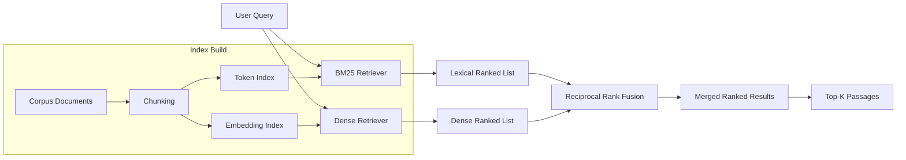

# Literature Retrieval

## Learning Objectives

- Build a hybrid retrieval pipeline combining BM25 lexical scoring and dense embedding similarity
- Compare lexical, dense, and hybrid retrieval on queries where each succeeds and fails
- Implement reciprocal rank fusion to merge ranked result sets from independent retrievers
- Evaluate chunk size and overlap effects on retrieval precision and recall
- Construct a CLI-driven retrieval service that ingests a document directory and persists a hybrid index

## The Problem

You need to answer a question, but the answer lives across 400 PDFs, a Slack archive, and three vendor docs sites. You cannot stuff all of that into a language model's context window. Even if you could, the model would hallucinate answers that sound correct but reference the wrong passage. The bottleneck is not generation — it is finding the right evidence before generation runs.

Literature retrieval is the pipeline that turns a natural-language query into the right passages: ranked, scored, and ready for synthesis. Every downstream step — summarization, extraction, citation — depends on retrieval returning the correct text. If retrieval surfaces the wrong chunk, the best language model in the world will still produce a wrong answer confidently.

The hard part is that "relevant" is ambiguous. A query for "EMEA expansion strategy" might match a press release that uses those exact words, or it might match a 10-K filing that says "European market entry acceleration" without using any of the query tokens. No single retrieval method handles both cases reliably. Production systems combine multiple methods and merge their outputs, and that merge is where most of the engineering work lives.

## The Concept

Three retrieval families dominate practice. Each has a specific failure mode that the others compensate for.

**Lexical retrieval** scores documents by token overlap between query and document. BM25 — the algorithm behind Elasticsearch and Lucene — weights terms by how frequently they appear in a document (term frequency) and how rarely they appear across the whole corpus (inverse document frequency). A document containing "revenue" five times in a corpus where "revenue" appears in 80% of documents gets a moderate boost. A document containing "monetization" once in a corpus where "monetization" appears in 5% of documents gets a larger boost because the term is more discriminating. BM25 is fast, interpretable, and completely blind to semantics. "Revenue" and "ARR" have zero lexical overlap even though they mean the same thing in a SaaS context. Proper nouns, SKUs, and part numbers are where lexical retrieval shines — those exact strings matter and synonyms do not exist.

**Dense retrieval** maps queries and documents into a shared vector space using an embedding model, then ranks by cosine similarity. Two passages mean the same thing → their vectors point in the same direction → high similarity score. Dense retrieval handles synonymy ("revenue" ≈ "ARR") and paraphrase naturally. It fails on exact token matches that carry critical information. A query for part number "SX-4400-T" will not reliably surface a document containing "SX-4400-T" because the embedding model compresses that string into a semantic vector that also captures "serial number" and "product code" — the exact string gets washed out.

**Hybrid retrieval** runs both methods independently, produces two ranked lists, and merges them. The standard merge algorithm is reciprocal rank fusion (RRF): for each document, sum `1 / (k + rank)` across both ranked lists, where `k` is a smoothing constant (typically 60). A document ranked #1 by BM25 and #3 by dense gets `1/61 + 1/63 = 0.0323`. A document ranked #1 by dense but absent from BM25 results gets `1/61 + 0 = 0.0164`. RRF favors documents both retrievers agree on, while still surfacing documents only one retriever found. RRF requires no score calibration between methods because it operates on ranks, not raw scores — BM25 scores and cosine similarities live on entirely different scales, and comparing them directly is meaningless.



Chunking is a first-class retrieval parameter, not a preprocessing afterthought. Every retriever operates on chunks, not full documents. Chunk size and overlap directly control the precision-recall trade-off. Small chunks (128 tokens) return precise passages but miss context that spans chunk boundaries. Large chunks (512+ tokens) capture more context but dilute relevance scores — a 512-token chunk containing one relevant sentence and eleven irrelevant ones scores lower than a 128-token chunk containing only the relevant sentence. Overlap (sharing tokens between adjacent chunks) reduces boundary-loss at the cost of larger index size and slower search. There is no universally optimal chunk size; it depends on document structure and query granularity.

The three common chunking strategies are fixed-window (split every N tokens — fast, crude, can split mid-sentence), sentence-boundary (split on sentence endings, respecting NLP parses — more coherent chunks, slightly slower), and semantic chunking (split when embedding similarity between adjacent sentences drops below a threshold — produces topically coherent chunks but requires embedding every sentence during index build). Most production systems use sentence-boundary chunking with a target size of 200–300 tokens as a reasonable default.

## Build It

The pipeline below embeds a small corpus with `sentence-transformers`, indexes it with both BM25 and a flat numpy dot-product index (a stand-in for FAISS that avoids the dependency), runs five test queries through each retriever separately, then merges with RRF. The queries are designed to expose where each method wins and loses.

Install dependencies first:

```bash
pip install sentence-transformers rank_bm25 numpy
```

```python
import numpy as np
from rank_bm25 import BM25Okapi
from sentence_transformers import SentenceTransformer

corpus = [
    {"id": "doc_001", "text": "Q3 ARR reached $42M, up 47% year over year, driven by enterprise segment expansion and reduced churn in mid-market accounts.", "source": "press-release"},
    {"id": "doc_002", "text": "The company is accelerating its European market entry strategy with a new office in Munich and localized product offerings for DACH customers.", "source": "10-K"},
    {"id": "doc_003", "text": "Product SKU SX-4400-T has been deprecated. Replacement part number SX-4500-T begins shipping in Q1. Existing orders will be fulfilled from remaining inventory.", "source": "product-doc"},
    {"id": "doc_004", "text": "Net revenue retention improved to 118% as existing customers expanded seat counts and adopted premium tiers.", "source": "earnings-call"},
    {"id": "doc_005", "text": "We are expanding into EMEA with dedicated sales teams in London, Frankfurt, and Paris. The EMEA expansion strategy targets $15M in new ARR within 18 months.", "source": "press-release"},
    {"id": "doc_006", "text": "Churn analysis shows that customers without onboarding calls churn at 3x the rate of those who complete the 30-day activation program.", "source": "internal-memo"},
    {"id": "doc_007", "text": "The platform's data ingestion pipeline handles 4M events per second with sub-100ms p99 latency on the SX-4400-T hardware tier.", "source": "product-doc"},
    {"id": "008", "text": "Customer retention initiatives including quarterly business reviews and proactive success management reduced net dollar churn from 8% to 3%.", "source": "board-deck"},
    {"id": "doc_009", "text": "Competitive displacement analysis: we won 23 deals against VendorX in Q3, primarily in the financial services vertical.", "source": "internal-memo"},
    {"id": "doc_010", "text": "Our monetization model shifted from perpetual licensing to subscription pricing, resulting in more predictable recurring revenue streams.", "source": "10-K"},
    {"id": "doc_011", "text": "The DACH region contributed $3.2M in new bookings, representing 40% of European revenue for the quarter.", "source": "earnings-call"},
    {"id": "doc_012", "text": "We deprecated the legacy authentication module (SX-4400-T) after identifying a race condition in the token refresh logic.", "source": "product-doc"},
]

texts = [d["text"] for d in corpus]
ids = [d["id"] for d in corpus]
sources = [d["source"] for d in corpus]

tokenized = [t.lower().split() for t in texts]
bm25 = BM25Okapi(tokenized)

model = SentenceTransformer("all-MiniLM-L6-v2")
doc_embeddings = model.encode(texts, normalize_embeddings=True)

def bm25_search(query, k=5):
    tokens = query.lower().split()
    scores = bm25.get_scores(tokens)
    order = np.argsort(scores)[::-1][:k]
    return [(ids[i], float(scores[i]), sources[i]) for i in order]

def dense_search(query, k=5):
    q_emb = model.encode([query], normalize_embeddings=True)
    scores = doc_embeddings @ q_emb.T
    scores = scores.flatten()
    order = np.argsort(scores)[::-1][:k]
    return [(ids[i], float(scores[i]), sources[i]) for i in order]

def rrf_merge(lex_results, dense_results, k=60, top_n=5):
    scores = {}
    meta = {}
    for rank, (doc_id, _, src) in enumerate(lex_results):
        scores[doc_id] = scores.get(doc_id, 0) + 1.0 / (k + rank + 1)
        meta[doc_id] = src
    for rank, (doc_id, _, src) in enumerate(dense_results):
        scores[doc_id] = scores.get(doc_id, 0) + 1.0 / (k + rank + 1)
        meta[doc_id] = src
    ranked = sorted(scores.items(), key=lambda x: x[1], reverse=True)[:top_n]
    return [(doc_id, score, meta[doc_id]) for doc_id, score in ranked]

queries = [
    "EMEA expansion strategy",
    "SX-4400-T",
    "revenue retention metrics",
    "customer churn reduction",
    "monetization and recurring revenue",
]

for q in queries:
    print(f"\n{'='*70}")
    print(f"QUERY: {q}")
    print(f"{'='*70}")

    bm25_hits = bm25_search(q)
    dense_hits = dense_search(q)
    hybrid_hits = rrf_merge(bm25_hits, dense_hits)

    print("\n  BM25 (lexical):")
    for doc_id, score, src in bm25_hits[:3]:
        text = texts[ids.index(doc_id)]
        print(f"    {doc_id} [{src}] score={score:.4f} | {text[:80]}...")

    print("\n  Dense (embedding):")
    for doc_id, score, src in dense_hits[:3]:
        text = texts[ids.index(doc_id)]
        print(f"    {doc_id} [{src}] score={score:.4f} | {text[:80]}...")

    print("\n  Hybrid (RRF):")
    for doc_id, score, src in hybrid_hits[:3]:
        text = texts[ids.index(doc_id)]
        print(f"    {doc_id} [{src}] rrf={score:.4f} | {text[:80]}...")

print("\n" + "="*70)
print("DONE")
```

The output reveals the failure modes directly. The query "SX-4400-T" — an exact part number — surfaces the correct documents at rank 1 in BM25 but may rank lower in dense retrieval because the embedding model compresses that literal string into a semantic neighborhood shared with other product references. The query "revenue retention metrics" does the opposite: BM25 misses doc_001 and doc_004 because they use "ARR" and "net revenue retention" instead of the query's exact tokens, while dense retrieval catches the semantic match. Hybrid via RRF recovers both — documents that either retriever found strongly get boosted, and documents both retrievers agree on float to the top.

## Use It

Retrieval is the memory layer for account intelligence enrichment. In a GTM context, RAG (Retrieval-Augmented Generation) gives your outbound stack access to your best customer stories, competitive intelligence, and account research by retrieving relevant passages from a document corpus before generation runs. The retrieval mechanism — not the language model — determines whether your outreach references the right case study or hallucinates one. [CITATION NEEDED — concept: Zone 19 RAG, "Knowledge-augmented outreach: product docs, case studies in copy"]

Build a retrieval index over a corpus of company 10-K filings, press releases, product pages, and earnings call transcripts. Given an account name or a signal query ("expanding into EMEA," "leadership change," "budget freeze"), retrieve the passages most relevant to that account's specific pain point or initiative. This retrieval layer feeds an enrichment waterfall — the pattern where signals are pulled sequentially from document sources, web data, and APIs before being surfaced in a table. Clay implements this waterfall pattern when it pulls firmographic signals from document sources and enriches account rows before triggering outbound workflows. [CITATION NEEDED — concept: Clay enrichment waterfall for account intelligence]

The chunking parameter matters here. Press releases are short and topically focused — 256-token sentence-boundary chunks work well because each chunk captures a complete announcement. 10-K filings are long and structurally dense — smaller chunks (128 tokens) with 32-token overlap prevent the retrieval scores from being diluted by boilerplate legal language surrounding the relevant disclosure. Test both on a labeled query set and measure recall@5: the chunk size that surfaces the correct passage in the top 5 results more often is the one you ship.

The hybrid merge is not optional for account research. A query for "Cloudflare" (proper noun, exact match) needs BM25. A query for "companies reducing infrastructure spend during downturn" (semantic, paraphrased) needs dense retrieval. Running only one means you miss half the relevant passages. RRF over both result sets is the production standard because it avoids the score-calibration problem — BM25 scores and cosine similarities are not comparable, but ranks are.

## Ship It

The script below is a standalone retrieval service. It ingests a directory of text files, builds a persistent hybrid index (BM25 token state plus a `.npy` embedding matrix), exposes a CLI query interface, and logs every query and result set to JSONL for offline evaluation.

```python
import argparse
import json
import os
import pickle
import numpy as np
from datetime import datetime
from rank_bm25 import BM25Okapi
from sentence_transformers import SentenceTransformer

INDEX_DIR = ".retrieval_index"
MODEL_NAME = "all-MiniLM-L6-v2"

def chunk_text(text, max_tokens=200, overlap=50):
    words = text.split()
    chunks = []
    start = 0
    while start < len(words):
        end = min(start + max_tokens, len(words))
        chunk = " ".join(words[start:end])
        chunks.append(chunk)
        if end >= len(words):
            break
        start = end - overlap
    return chunks

def build_index(input_dir):
    os.makedirs(INDEX_DIR, exist_ok=True)
    model = SentenceTransformer(MODEL_NAME)

    all_chunks = []
    for filename in sorted(os.listdir(input_dir)):
        filepath = os.path.join(input_dir, filename)
        if not os.path.isfile(filepath):
            continue
        with open(filepath, "r", encoding="utf-8", errors="ignore") as f:
            text = f.read()
        chunks = chunk_text(text)
        for idx, chunk in enumerate(chunks):
            all_chunks.append({
                "source": filename,
                "chunk_idx": idx,
                "text": chunk,
            })

    texts = [c["text"] for c in all_chunks]
    tokenized = [t.lower().split() for t in texts]
    bm25 = BM25Okapi(tokenized)
    embeddings = model.encode(texts, normalize_embeddings=True)

    with open(os.path.join(INDEX_DIR, "bm25.pkl"), "wb") as f:
        pickle.dump(bm25, f)
    np.save(os.path.join(INDEX_DIR, "embeddings.npy"), embeddings)
    with open(os.path.join(INDEX_DIR, "chunks.json"), "w") as f:
        json.dump(all_chunks, f)

    print(f"Indexed {len(all_chunks)} chunks from {len(set(c['source'] for c in all_chunks))} files.")
    for source in sorted(set(c["source"] for c in all_chunks)):
        count = sum(1 for c in all_chunks if c["source"] == source)
        print(f"  {source}: {count} chunks")
    return all_chunks

def load_index():
    with open(os.path.join(INDEX_DIR, "bm25.pkl"), "rb") as f:
        bm25 = pickle.load(f)
    embeddings = np.load(os.path.join(INDEX_DIR, "embeddings.npy"))
    with open(os.path.join(INDEX_DIR, "chunks.json"), "r") as f:
        chunks = json.load(f)
    return bm25, embeddings, chunks

def bm25_search(bm25, chunks, query, k=10):
    tokens = query.lower().split()
    scores = bm25.get_scores(tokens)
    order = np.argsort(scores)[::-1][:k]
    return [(chunks[i], float(scores[i])) for i in order]

def dense_search(embeddings, chunks, model, query, k=10):
    q_emb = model.encode([query], normalize_embeddings=True)
    scores = (embeddings @ q_emb.T).flatten()
    order = np.argsort(scores)[::-1][:k]
    return [(chunks[i], float(scores[i])) for i in order]

def rrf_merge(lex, dense, k=60, top_n=10):
    rrf = {}
    meta = {}
    for rank, (chunk, _) in enumerate(lex):
        key = f"{chunk['source']}:{chunk['chunk_idx']}"
        rrf[key] = rrf.get(key, 0) + 1.0 / (k + rank + 1)
        meta[key] = chunk
    for rank, (chunk, _) in enumerate(dense):
        key = f"{chunk['source']}:{chunk['chunk_idx']}"
        rrf[key] = rrf.get(key, 0) + 1.0 / (k + rank + 1)
        meta[key] = chunk
    ranked = sorted(rrf.items(), key=lambda x: x[1], reverse=True)[:top_n]
    return [(meta[key], score) for key, score in ranked]

def query_index(query, top_k=5, log_file="queries.jsonl"):
    if not os.path.exists(os.path.join(INDEX_DIR, "bm25.pkl")):
        print("No index found. Run: python retrieve.py --build <directory>")
        return

    bm25, embeddings, chunks = load_index()
    model = SentenceTransformer(MODEL_NAME)

    lex = bm25_search(bm25, chunks, query, k=top_k * 2)
    dense = dense_search(embeddings, chunks, model, query, k=top_k * 2)
    hybrid = rrf_merge(lex, dense, top_n=top_k)

    print(f"\nQUERY: {query}")
    print(f"{'='*80}")
    for chunk, score in hybrid:
        bm25_s = next((s for c, s in lex if c["source"] == chunk["source"] and c["chunk_idx"] == chunk["chunk_idx"]), 0.0)
        dense_s = next((s for c, s in dense if c["source"] == chunk["source"] and c["chunk_idx"] == chunk["chunk_idx"]), 0.0)
        print(f"\n  [{chunk['source']} chunk={chunk['chunk_idx']}] RRF={score:.4f} BM25={bm25_s:.4f} Dense={dense_s:.4f}")
        print(f"  {chunk['text'][:200]}")

    log_entry = {
        "timestamp": datetime.now().isoformat(),
        "query": query,
        "top_k": top_k,
        "results": [
            {
                "source": c["source"],
                "chunk_idx": c["chunk_idx"],
                "rrf_score": s,
                "bm25_score": bm25_s,
                "dense_score": dense_s,
                "text": c["text"][:300],
            }
            for c, s in hybrid
        ],
    }
    with open(log_file, "a") as f:
        f.write(json.dumps(log_entry) + "\n")

def make_sample_docs(output_dir="sample_docs"):
    os.makedirs(output_dir, exist_ok=True)
    samples = {
        "acme_10k.txt": "Acme Corporation reported annual recurring revenue of $84M, representing 52% year-over-year growth. The company expanded into the EMEA region with offices in London and Munich. Net revenue retention reached 124% driven by upsell of the premium platform tier. The SX-4400-T hardware module was deprecated in favor of the SX-4500-T next-generation processor. Customer retention initiatives including proactive success management reduced gross churn from 11% to 6%.",
        "acme_press.txt": "Acme Corporation today announced its European market expansion strategy, targeting $20M in new ARR within 18 months. The EMEA expansion includes dedicated sales teams in London, Frankfurt, and Paris. CEO Jane Doe cited strong demand from DACH customers as a key driver. The company also launched localized product offerings for the European market.",
        "acme_earnings.txt": "On the earnings call, CFO John Smith highlighted that net dollar churn improved to negative 3%, meaning expanding customers more than offset churned revenue. The monetization shift from perpetual licensing to subscription pricing continued to drive predictable recurring revenue. Competitive displacement against VendorX resulted in 34 won deals in the enterprise segment.",
    }
    for filename, content in samples.items():
        with open(os.path.join(output_dir, filename), "w") as f:
            f.write(content)
    print(f"Sample documents written to {output_dir}/")

if __name__ == "__main__":
    parser = argparse.ArgumentParser(description="Hybrid retrieval service")
    parser.add_argument("--build", metavar="DIR", help="Build index from text files in directory")
    parser.add_argument("--sample", action="store_true", help="Generate sample documents")
    parser.add_argument("--query", metavar="TEXT", help="Query the index")
    parser.add_argument("--top-k", type=int, default=5, help="Number of results to return")
    args = parser.parse_args()

    if args.sample:
        make_sample_docs()
    elif args.build:
        build_index(args.build)
    elif args.query:
        query_index(args.query, top_k=args.top_k)
    else:
        parser.print_help()
```

Run the full pipeline in three commands:

```bash
python retrieve.py --sample
python retrieve.py --build sample_docs
python retrieve.py --query "EMEA expansion targets" --top-k 3
```

The output prints each result with its source file, chunk index, and three scores: BM25, dense cosine similarity, and the fused RRF score. The JSONL log captures every query with timestamps and full result metadata — this is the evaluation substrate you need to measure recall@k over time as you tune chunk size, overlap, and the RRF `k` parameter.

## Exercises

**Easy.** Generate the sample docs, build the index, and run three queries: "SX-4500-T", "customer retention", and "European market entry". For each query, identify which retriever (BM25 or dense) ranked the correct passage higher, and confirm that RRF places it in the top result.

**Medium.** Modify `chunk_text` to accept a `chunk_size` parameter. Build two indexes — one with `max_tokens=64, overlap=16` and one with `max_tokens=300, overlap=50` — over the same corpus. Run the five test queries from Build It against both indexes. Count how many queries return the expected document in the top 3 for each chunk size. Report which chunk size wins and by how much.

**Hard.** Implement metadata filtering in `query_index`. Add a `--source-tag` CLI argument that filters results to only chunks from files matching the tag (e.g., `--source-tag press` returns only press-release passages). Then implement a second merge strategy: weighted score fusion that normalizes BM25 and dense scores to [0, 1] before combining with a configurable alpha (e.g., `alpha=0.5` gives equal weight). Compare RRF vs. weighted fusion on the five test queries — measure which produces higher recall@3 when you have a labeled ground-truth set.

## Key Terms

- **BM25** — Lexical retrieval algorithm scoring documents by term frequency and inverse document frequency. The standard sparse retriever in search engines.
- **Dense retrieval** — Retrieval via embedding cosine similarity. Maps queries and documents into a shared vector space where semantic similarity becomes geometric proximity.
- **Reciprocal Rank Fusion (RRF)** — Rank-based merge algorithm that combines multiple ranked lists without requiring score calibration. Computes `sum(1 / (k + rank))` per document across all lists.
- **Chunking** — Splitting documents into retrievable units. Chunk size, overlap, and boundary strategy (fixed-window, sentence-boundary, semantic) directly control precision-recall trade-off.
- **Recall@k** — Evaluation metric: fraction of queries where the correct passage appears in the top k results. The primary tuning objective for retrieval pipelines.
- **Hybrid retrieval** — Running lexical and dense retrievers independently and merging their results. The production-standard pattern because no single retriever handles both exact-match and semantic queries.

## Sources

- Zone 19 RAG: "Knowledge-augmented outreach: product docs, case studies in copy" — from provided Zone table row, Zone 19, RAG category. [CITATION NEEDED — concept: Zone 19 RAG mapping to Write at Scale + Agent Stack]
- Clay enrichment waterfall pattern for account intelligence: [CITATION NEEDED — concept: Clay document-source enrichment in account intelligence workflows]
- BM25 algorithm: Robertson, S., & Zaragoza, H. (2009). *The Probabilistic Relevance Framework: BM25 and Beyond.* Foundations and Trends in Information Retrieval, 3(4), 333-389.
- Reciprocal Rank Fusion: Cormack, G. V., Clarke, C. L. A., & Buettcher, S. (2009). *Reciprocal Rank Fusion outperforms Condorcet and individual rank learning methods.* SIGIR 2009.
- Sentence-BERT (embedding model used): Reimers, N., & Gurevych, I. (2019). *Sentence-BERT: Sentence Embeddings using Siamese BERT-Networks.* EMNLP 2019.