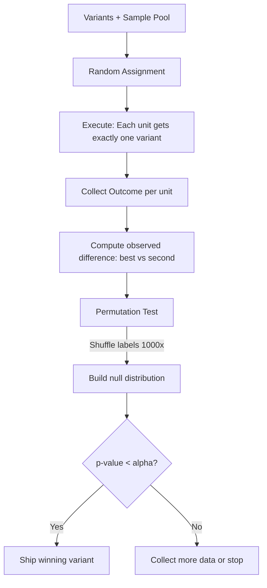

# Experiment Runner

## Learning Objectives

1. Build an experiment runner that assigns units to variants, executes them, and collects structured outcomes
2. Implement random assignment and sample splitting for fair variant comparison
3. Compute statistical significance using a permutation test over shuffled labels
4. Configure sample size, confidence thresholds, and stopping conditions for an experiment
5. Evaluate experiment output to select a winning variant with defensible quantitative evidence

## The Problem

You changed a prompt template in your enrichment workflow. Reply rates went up 3% week-over-week. Was it the prompt, or was it Tuesday? Maybe the prospect list that week was warmer. Maybe a competitor announced something that made your value proposition land harder. Without controlled comparison, you have no way to separate the change you made from everything else that moves.

This problem shows up everywhere in GTM. You rewrite a subject line and open rates tick up. You switch from firmographic to technographic scoring and conversion improves. You update the RAG retrieval pipeline feeding your outbound agent and meetings booked climb. In every case, the same question: did the change cause the improvement, or did you get lucky?

An experiment runner is the machinery that answers this question. It takes your variants, assigns each prospect to exactly one, records what happened, and runs a statistical test to tell you whether the observed difference is likely real or likely noise. The goal isn't elegance — it's honesty. Without this machinery, every optimization decision is a guess dressed up as intuition.

## The Concept

A controlled experiment has three phases: assignment, collection, and evaluation. In assignment, each unit (a prospect, an account, an email) is assigned to exactly one variant at random. Randomization is what makes the comparison fair — it spreads confounding factors evenly across variants, so any difference in outcomes is attributable to the variant itself, not to who happened to be in each group. In collection, the runner records the outcome metric for each unit: opened or didn't, replied or didn't, meeting booked or didn't. In evaluation, the runner asks whether the observed differences between variants are large enough to be unlikely under random chance.

The evaluation mechanism here is a permutation test. The idea is straightforward: if the variant assignments don't actually matter (the null hypothesis), then shuffling the labels shouldn't change the distribution of outcomes. So we shuffle the labels, recompute the difference between the top two variants, and repeat a thousand times. This builds a null distribution — what differences look like when there's no real effect. If our observed difference is larger than 95% of the shuffled differences, we have evidence the effect is real.



The permutation test is non-parametric, which means it doesn't assume your data follows a normal distribution or any other specific shape. For GTM metrics — which are often binary (opened/not opened, replied/not replied) and imbalanced (low base rates) — this matters. A t-test assumes normality; a permutation test just shuffles and counts. The cost is computation: a thousand shuffles over three hundred samples is cheap, but over ten thousand samples it adds up. For the sample sizes typical in GTM experiments (100–500 per variant), it's negligible.

One term that governs the whole experiment before it starts: minimum detectable effect (MDE). This is the smallest true difference your experiment can reliably detect given the sample size. If your MDE is 5 percentage points and the real difference between variants is 2 points, you'll likely get an inconclusive result — not because the variants are the same, but because you didn't collect enough data to see the difference. MDE is a planning tool: decide how small an effect you care about, then compute how many samples you need.

## Build It

This script defines three email subject line variants, assigns 100 simulated prospects to each, generates open/no-open outcomes with different underlying probabilities, and runs a permutation test to check whether the best variant is genuinely better than the second-best.

```python
import random
from collections import defaultdict

random.seed(42)

VARIANTS = {
    "A": {"subject": "Quick question about your Q4", "open_prob": 0.22},
    "B": {"subject": "Saw your earnings call", "open_prob": 0.31},
    "C": {"subject": "Idea for your team", "open_prob": 0.26},
}

N_PER_VARIANT = 100

assignments = []
outcomes = []

for vname, vdata in VARIANTS.items():
    for _ in range(N_PER_VARIANT):
        assignments.append(vname)
        outcomes.append(1 if random.random() < vdata["open_prob"] else 0)

def variant_rate(variant_name, labels, responses):
    mask = [l == variant_name for l in labels]
    total = sum(mask)
    opens = sum(r for r, m in zip(responses, mask) if m)
    return opens / total if total > 0 else 0.0

rates = {v: variant_rate(v, assignments, outcomes) for v in VARIANTS}
ranked = sorted(rates.items(), key=lambda x: x[1], reverse=True)

print("=== Raw Results ===")
for v, r in ranked:
    opens = int(r * N_PER_VARIANT)
    print(f"  Variant {v} ({VARIANTS[v]['subject']}): {opens}/{N_PER_VARIANT} = {r:.1%}")

best_v, best_r = ranked[0]
second_v, second_r = ranked[1]
observed_diff = best_r - second_r

print(f"\nObserved difference ({best_v} vs {second_v}): {observed_diff:.1%}")

N_SHUFFLES = 1000
extreme_count = 0

for _ in range(N_SHUFFLES):
    shuffled_labels = assignments[:]
    random.shuffle(shuffled_labels)
    s_best = variant_rate(best_v, shuffled_labels, outcomes)
    s_second = variant_rate(second_v, shuffled_labels, outcomes)
    s_diff = s_best - s_second
    if s_diff >= observed_diff:
        extreme_count += 1

p_value = extreme_count / N_SHUFFLES

print(f"\nPermutation test: {extreme_count}/{N_SHUFFLES} shuffles produced diff >= {observed_diff:.1%}")
print(f"p-value: {p_value:.4f}")

ALPHA = 0.05
if p_value < ALPHA:
    print(f"\nDECISION: Ship Variant {best_v} (p = {p_value:.4f} < {ALPHA})")
else:
    print(f"\nDECISION: Inconclusive (p = {p_value:.4f} >= {ALPHA})")
    print("Collect more data before committing.")
```

Run this and you'll see the three raw open rates, the observed gap between the top two, the permutation test result, and a decision. The seed makes it deterministic — you'll get the same numbers every time. Change the seed and you'll see the rates jitter, but the conclusion should hold if the effect is real.

Notice what the permutation test is actually