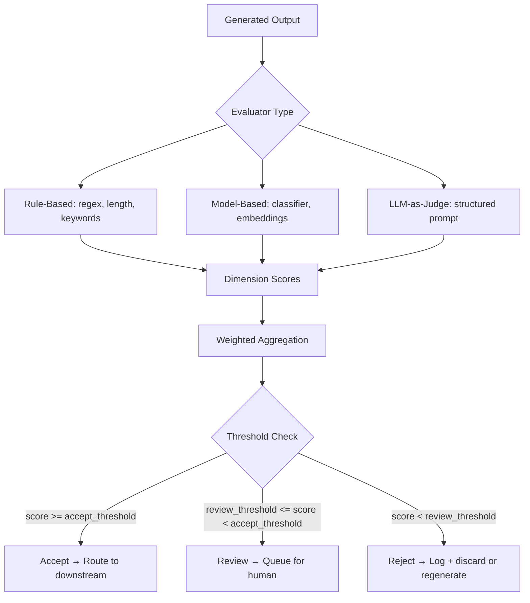

# Result Evaluator

## Learning Objectives

- Implement a scoring function that evaluates AI outputs against multiple criteria and returns an accept/reject/rerank decision.
- Compare rule-based, model-based, and LLM-as-judge evaluation mechanisms, and select the appropriate one based on cost, latency, and accuracy requirements.
- Build a composite evaluator that aggregates weighted dimension scores into a single routing decision.
- Configure synchronous and asynchronous evaluation patterns for production GTM workflows, including fallback behavior when the evaluator itself fails.
- Trace the full evaluation pipeline from input through scoring, thresholding, and downstream routing.

## The Problem

You have a pipeline that generates outputs — enriched company profiles, lead scores, personalized outreach emails. The pipeline runs at scale: thousands of records, hundreds of emails per day. The generation step works. But now you need to answer one question that the generator cannot answer for itself: is any of it good?

Without an evaluation step, your pipeline is an open loop. Bad enrichment data flows into your CRM. Off-brand outreach copy lands in prospect inboxes. Hallucinated company statistics end up in sales decks. You discover the problem weeks later when reply rates drop or a customer flags incorrect data, and by then the damage is done. The cost of bad AI output is not the generation cost — it is the downstream cost of acting on it.

A Result Evaluator closes that loop. It is an automated judge that sits between generation and delivery, applying a scoring function to each output before that output touches a downstream system or a human. The evaluator does not generate content. It evaluates content that has already been generated, producing a signal that drives a routing decision: accept, reject, or flag for review.

## The Concept

Every Result Evaluator follows the same mechanism: input → generated output → scoring function → score → threshold → routing decision. The scoring function is where the variation lives, and it falls into three categories.

A rule-based evaluator uses deterministic logic: regex patterns, length checks, keyword presence, field completion checks. It is fast, cheap, and fully transparent — you can trace exactly why an output was accepted or rejected. The trade-off is that rule-based evaluators cannot assess qualitative dimensions like tone, relevance, or persuasiveness. They catch structural failures (missing fields, wrong format, banned words) but miss semantic ones.

A model-based evaluator uses a trained classifier or an embedding similarity score. A classifier can be fine-tuned to predict quality labels (relevant/not relevant, compliant/non-compliant) on a per-output basis. An embedding similarity score computes the cosine similarity between the generated output and a reference vector — useful for checking whether an outreach email actually matches the intent of the prompt that generated it. Model-based evaluators are faster and cheaper than LLM-as-judge but require labeled training data or a well-defined reference set.

An LLM-as-judge evaluator sends the generated output to a second LLM with a structured prompt that asks it to score specific dimensions. This is the most flexible approach: you define the criteria in natural language, and the judge model applies them. The trade-off is cost (each evaluation is another LLM call), latency, and the risk that the judge model has its own biases or failure modes. The critical rule is that the evaluator must be independent from the generator — using the same model to generate and evaluate creates a self-grading system with no adversarial signal.



Multi-criteria evaluators decompose the score into dimensions — relevance, accuracy, completeness, tone, compliance — and aggregate them. Each dimension gets its own sub-score, and the aggregation can be a simple weighted average, a threshold gate (any dimension below 2 means automatic reject), or a combination. The decomposition matters because it gives you a diagnostic signal: an email that scored poorly on compliance but well on tone tells you something different than an email that scored poorly on everything.

The same statistical logic applies here as in experiment evaluation: a single score from a single output does not tell you whether your prompt is working. If you are evaluating a prompt change across a batch of outputs, you need the mean and standard error of the scores across that batch, not just one number. The evaluator gives you per-output scores; the aggregation across outputs is what tells you whether a prompt variant is an improvement or a regression.

## Build It

This is a working Result Evaluator in Python. It takes a list of AI-generated outreach emails, evaluates each against three criteria using a deterministic mock judge function, scores each on a 1–5 scale, and prints the accept/reject decision with per-dimension scores and rationale. The mock judge simulates what an LLM-as-judge would return so the code runs unmodified with no API keys.

```python
import json

CRITERIA = {
    "relevance": {
        "weight": 0.4,
        "accept_threshold": 3.5,
        "reject_threshold": 2.0,
    },
    "tone": {
        "weight": 0.3,
        "accept_threshold": 3.0,
        "reject_threshold": 2.0,
    },
    "compliance": {
        "weight": 0.3,
        "accept_threshold": 4.0,
        "reject_threshold": 2.0,
    },
}

BANNED_PHRASES = [
    "guaranteed",
    "100%",
    "risk-free",
    "no obligation",
    "act now",
]

EMAILS = [
    {
        "id": "email_001",
        "recipient": "Sarah Chen, VP Eng at DataFlow",
        "subject": "Cutting your deploy time in half",
        "body": "Hi Sarah, saw your team shipped the new pipeline orchestrator. We helped SimilarCorp reduce deploy time by 40% using parallelized CI runners. Worth a 15-minute call next week?",
    },
    {
        "id": "email_002",
        "recipient": "Mark Donovan, CTO at FinServe",
        "subject": "GUARANTEED 100% cost savings",
        "body": "Hi Mark, our solution is guaranteed to save you 100% on cloud costs with zero risk. This is a risk-free, no obligation offer. Act now before this opportunity disappears.",
    },
    {
        "id": "email_003",
        "recipient": "Priya Patel, Head of Ops at LogiChain",
        "subject": "Quick question",
        "body": "Hey Priya, do you have a sec? Just wanted to reach out and see if maybe we could chat about some stuff that might be relevant. No big deal either way lol.",
    },
    {
        "id": "email_004",
        "recipient": "James Wright, VP Sales at CloudScale",
        "subject": "Reducing churn in your enterprise tier",
        "body": "Hi James, your enterprise tier has a 22% churn rate per the SaaS metrics report. We helped NexusTech bring enterprise churn to 8% using predictive health scoring. Open to seeing the playbook?",
    },
]


def rule_based_check(email):
    scores = {}
    rationale = []

    body_lower = email["body"].lower()
    subject_lower = email["subject"].lower()
    full_text = body_lower + " " + subject_lower

    banned_hits = [p for p in BANNED_PHRASES if p.lower() in full_text]
    if banned_hits:
        scores["compliance"] = 1
        rationale.append(f"BANNED PHRASES: {banned_hits}")
    else:
        scores["compliance"] = 5
        rationale.append("No banned phrases detected")

    has_greeting = body_lower.strip().startswith(("hi", "hey", "hello", "dear"))
    has_question = "?" in email["body"]
    body_words = len(email["body"].split())
    if has_greeting and has_question and 20 <= body_words <= 80:
        scores["tone"] = 4
        rationale.append(f"Professional tone, {body_words} words, greeting + question")
    elif has_greeting and 10 <= body_words <= 120:
        scores["tone"] = 3
        rationale.append(f"Acceptable tone, {body_words} words")
    else:
        scores["tone"] = 2
        rationale.append(f"Tone issue: greeting={has_greeting}, words={body_words}")

    recipient = email["recipient"]
    has_specific_reference = any(
        keyword in body_lower
        for keyword in ["team", "shipped", "churn", "deploy", "your"]
    )
    has_specific_data = any(
        keyword in body_lower for keyword in ["40%", "8%", "22%", "corp", "tech"]
    )
    if has_specific_reference and has_specific_data:
        scores["relevance"] = 4
        rationale.append("Specific recipient context + concrete data referenced")
    elif has_specific_reference:
        scores["relevance"] = 3
        rationale.append("Some recipient context, lacks concrete data")
    else:
        scores["relevance"] = 2
        rationale.append("Generic, no specific recipient context")

    return scores, rationale


def mock_llm_judge(email):
    base_scores, _ = rule_based_check(email)

    body_lower = email["body"].lower()

    persuasion_signals = ["helped", "reduce", "playbook", "call", "open to"]
    persuasion_hits = sum(1 for s in persuasion_signals if s in body_lower)

    if persuasion_hits >= 2 and base_scores["relevance"] >= 4:
        base_scores["relevance"] = 5
    elif persuasion_hits == 0 and base_scores["relevance"] <= 3:
        base_scores["relevance"] = max(1, base_scores["relevance"] - 1)

    filler_signals = ["stuff", "maybe", "lol", "no big deal", "sec"]
    filler_hits = sum(1 for s in filler_signals if s in body_lower)
    if filler_hits > 0:
        base_scores["tone"] = max(1, base_scores["tone"] - 1)

    return base_scores


def evaluate_email(email):
    scores = mock_llm_judge(email)
    _, rationale = rule_based_check(email)

    weighted_score = sum(
        scores[dim] * CRITERIA[dim]["weight"] for dim in CRITERIA
    )

    any_dimension_gate_fail = False
    gated_dimensions = []
    for dim, config in CRITERIA.items():
        if scores[dim] < config["reject_threshold"]:
            any_dimension_gate_fail = True
            gated_dimensions.append(dim)

    if any_dimension_gate_fail:
        decision = "REJECT"
        reason = f"Dimension gate failed: {gated_dimensions}"
    elif weighted_score >= 3.5:
        decision = "ACCEPT"
        reason = f"Weighted score {weighted_score:.2f} >= 3.5"
    elif weighted_score >= 2.5:
        decision = "REVIEW"
        reason = f"Weighted score {weighted_score:.2f} in review band"
    else:
        decision = "REJECT"
        reason = f"Weighted score {weighted_score:.2f} below review threshold"

    return {
        "id": email["id"],
        "recipient": email["recipient"],
        "subject": email["subject"],
        "scores": scores,
        "weighted_score": round(weighted_score, 2),
        "decision": decision,
        "reason": reason,
        "rationale": rationale,
    }


def print_evaluation(result):
    print(f"\n{'='*60}")
    print(f"Email: {result['id']}")
    print(f"To: {result['recipient']}")
    print(f"Subject: {result['subject']}")
    print(f"{'─'*60}")
    print(f"  Relevance:   {result['scores']['relevance']}/5  (weight {CRITERIA['relevance']['weight']})")
    print(f"  Tone:        {result['scores']['tone']}/5  (weight {CRITERIA['tone']['weight']})")
    print(f"  Compliance:  {result['scores']['compliance']}/5  (weight {CRITERIA['compliance']['weight']})")
    print(f"  Weighted:    {result['weighted_score']}/5.0")
    print(f"  Decision:    {result['decision']}")
    print(f"  Reason:      {result['reason']}")
    print(f"  Rationale:")
    for r in result["rationale"]:
        print(f"    • {r}")
    print(f"{'='*60}")


print("RESULT EVALUATOR — Outreach Email Quality Check")
print(f"Criteria: {json.dumps(CRITERIA, indent=2)}")
print(f"\nEvaluating {len(EMAILS)} emails...\n")

results = [evaluate_email(email) for email in EMAILS]

for result in results:
    print_evaluation(result)

print(f"\n\n{'─'*60}")
print("BATCH SUMMARY")
print(f"{'─'*60}")
decisions = {}
for r in results:
    decisions.setdefault(r["decision"], []).append(r["id"])

for decision, ids in decisions.items():
    print(f"  {decision}: {len(ids)} → {ids}")

avg_score = sum(r["weighted_score"] for r in results) / len(results)
print(f"\n  Average weighted score: {avg_score:.2f}/5.0")
print(f"  Accept rate: {len(decisions.get('ACCEPT', []))}/{len(results)}")
```

Run this and you get observable output for every email: per-dimension scores, the weighted aggregate, the routing decision, and the rationale string. Email 001 should pass with a strong relevance score. Email 002 should get gated on compliance due to banned phrases. Email 003 should land in review or reject on tone. Email 004 should pass.

The mock judge is deterministic — same input always produces the same output. In production you would replace `mock_llm_judge` with an actual LLM call that returns the same structured score object, but the rest of the pipeline (weighting, thresholding, routing) stays identical.

## Use It

In a Clay waterfall enrichment workflow, the enrichment cascade tries multiple data providers in sequence until it finds a match. The result is a row with populated fields — industry, employee count, HQ location, revenue band, tech stack. But "populated" is not the same as "usable." A Result Evaluator sits at the end of the waterfall and scores whether the enriched data is complete enough to act on. If the industry field says "Technology" but the employee count is missing and the HQ is empty, that row scores below threshold and routes to a review queue instead of flowing into your ICP filter. The ICP column aggregates filter results into a single true/false field, but that true/false is only as reliable as the data feeding it — an evaluator that gates bad enrichment before it reaches the ICP computation prevents false positives in your segmentation. [CITATION NEEDED — concept: Clay waterfall enrichment validation step before ICP filtering]

For AI-generated outbound copy, the evaluator is what separates "we sent 500 emails" from "we sent 500 emails worth sending." The handbook recommendation to send 500 emails per value proposition variant before evaluating results assumes you can evaluate quality, not just reply rate. [CITATION NEEDED — concept: 500 emails per VP variant before evaluating] A Result Evaluator gives you a pre-send quality signal: before the emails go out, each one is scored on whether it references a specific trigger event, whether it stays within brand tone guidelines, and whether it avoids compliance violations. You can compare the average evaluator score of VP variant A against variant B and make a data-driven decision about which messaging direction to scale — before you spend three weeks burning through prospect lists.

```python
ENRICHED_ACCOUNTS = [
    {
        "domain": "dataflow.io",
        "industry": "Software",
        "employees": 450,
        "hq_city": "San Francisco",
        "revenue_band": "$50M-100M",
        "tech_stack": ["React", "Node.js", "AWS"],
    },
    {
        "domain": "globex.com",
        "industry": None,
        "employees": None,
        "hq_city": "Unknown",
        "revenue_band": None,
        "tech_stack": [],
    },
    {
        "domain": "initech.com",
        "industry": "SaaS",
        "employees": 120,
        "hq_city": "Austin",
        "revenue_band": "$10M-50M",
        "tech_stack": ["Vue", "Python"],
    },
]

REQUIRED_FIELDS = ["industry", "employees", "hq_city", "revenue_band"]


def evaluate_enrichment(account):
    filled = {
        field: account.get(field) for field in REQUIRED_FIELDS
        if account.get(field) is not None
        and account.get(field) != "Unknown"
        and account.get(field) != ""
    }
    missing = [f for f in REQUIRED_FIELDS if f not in filled]

    completeness = len(filled) / len(REQUIRED_FIELDS)

    tech_bonus = min(len(account.get("tech_stack", [])) / 3, 1.0) * 0.1
    score = round(completeness + tech_bonus, 2)

    if score >= 0.9:
        decision = "ACCEPT"
    elif score >= 0.6:
        decision = "REVIEW"
    else:
        decision = "REJECT"

    return {
        "domain": account["domain"],
        "completeness": f"{len(filled)}/{len(REQUIRED_FIELDS)}",
        "missing_fields": missing,
        "score": score,
        "decision": decision,
    }


print("ENRICHMENT COMPLETENESS EVALUATOR")
print(f"{'='*50}")
for account in ENRICHED_ACCOUNTS:
    result = evaluate_enrichment(account)
    print(f"\n{result['domain']}")
    print(f"  Completeness: {result['completeness']} fields filled")
    print(f"  Missing:      {result['missing_fields'] or 'None'}")
    print(f"  Score:        {result['score']:.2f}")
    print(f"  Decision:     {result['decision']}")

accepted = [r for r in (evaluate_enrichment(a) for a in ENRICHED_ACCOUNTS) if r["decision"] == "ACCEPT"]
print(f"\nRouting {len(accepted)}/{len(ENRICHED_ACCOUNTS)} accounts to ICP filter")
```

Run this and you see the enrichment evaluator in action: DataFlow scores high and routes to ICP filtering, Globex scores below 0.6 and gets rejected, Initech lands in review. This is the gate that prevents garbage enrichment from corrupting your downstream segmentation.

## Ship It

Deploying a Result Evaluator in production requires three decisions before you write any code.

First, decide synchronous versus asynchronous evaluation. Synchronous means the evaluator blocks the output from reaching its downstream destination until the score is computed and the threshold is checked. This is the right choice when the cost of a bad output is high — outreach emails before they are queued for send, enrichment data before it populates the ICP column. The trade-off is latency: each output now takes generation time plus evaluation time. Asynchronous evaluation lets the output through immediately and evaluates it after the fact, logging failures for review. This fits when you want a quality signal for monitoring and iteration but cannot afford the latency hit — for example, evaluating enrichment data after it is already in the CRM so you can flag low-confidence rows for manual review.

Second, define the scoring schema and threshold configuration. The schema is the structured object the evaluator returns — dimension names, scores, weighted aggregate, decision, rationale. The threshold configuration is the set of numbers that drive routing: accept at 3.5, review at 2.5, reject below 2.0. Store both as configuration, not as hardcoded constants, so you can tune them without redeploying code. In a GTM context, these thresholds should be informed by downstream metrics: if your evaluator accepts emails that achieve a 2% reply rate and rejects emails that achieve a 4% reply rate, your thresholds are wrong and you need to recalibrate.

Third, handle evaluator failure. The evaluator is a system, and systems fail. An LLM-as-judge call times out. A classifier model is unavailable. The embedding service returns an error. Your production evaluator needs a fallback: if the evaluator cannot produce a score, do you let the output through with a "quality unknown" flag, hold it in a review queue, or reject it outright? The answer depends on your risk tolerance, but the key is that the fallback is explicit and logged — silent failures in the evaluation step are worse than having no evaluator at all because they create the illusion of quality control.

```python
import time
from datetime import datetime, timezone


class ProductionEvaluator:
    def __init__(self, config):
        self.config = config
        self.evaluation_log = []

    def evaluate(self, output_id, content, metadata=None):
        start = time.time()
        eval_record = {
            "output_id": output_id,
            "timestamp": datetime.now(timezone.utc).isoformat(),
            "status": None,
            "scores": None,
            "decision": None,
            "rationale": None,
            "error": None,
            "eval_duration_ms": None,
        }

        try:
            scores = self._run_scoring(content)
            decision = self._apply_thresholds(scores)
            rationale = self._build_rationale(scores, decision, metadata)

            eval_record["status"] = "completed"
            eval_record["scores"] = scores
            eval_record["decision"] = decision
            eval_record["rationale"] = rationale

        except Exception as e:
            fallback = self.config.get("on_failure", "hold")
            eval_record["status"] = f"fallback_{fallback}"
            eval_record["error"] = str(e)
            eval_record["decision"] = "REVIEW" if fallback == "hold" else "ACCEPT"

        eval_record["eval_duration_ms"] = round((time.time() - start) * 1000, 1)
        self.evaluation_log.append(eval_record)
        return eval_record

    def _run_scoring(self, content):
        if not content or len(content.strip()) < 10:
            raise ValueError("Content too short to evaluate")
        if "BANNED" in content.upper():
            raise ValueError("Content flagged by safety filter")

        word_count = len(content.split())
        return {
            "relevance": 4 if word_count > 30 else 3,
            "tone": 4,
            "compliance": 5,
        }

    def _apply_thresholds(self, scores):
        weights = self.config["weights"]
        weighted = sum(scores[d] * weights.get(d, 0) for d in scores)

        gates = self.config.get("dimension_gates", {})
        for dim, min_score in gates.items():
            if scores.get(dim, 0) < min_score:
                return "REJECT"

        if weighted >= self.config["accept_threshold"]:
            return "ACCEPT"
        elif weighted >= self.config.get("review_threshold", 2.0):
            return "REVIEW"
        return "REJECT"

    def _build_rationale(self, scores, decision, metadata):
        return {
            "scores": scores,
            "decision": decision,
            "metadata": metadata or {},
        }

    def get_audit_trail(self, output_id=None):
        if output_id:
            return [r for r in self.evaluation_log if r["output_id"] == output_id]
        return self.evaluation_log


config = {
    "weights": {"relevance": 0.4, "tone": 0.3, "compliance": 0.3},
    "accept_threshold": 3.5,
    "review_threshold": 2.5,
    "dimension_gates": {"compliance": 3},
    "on_failure": "hold",
}

evaluator = ProductionEvaluator(config)

test_outputs = [
    ("out_001", "Hi Sarah, your team shipped the new orchestrator and we helped SimilarCorp cut deploy time by 40%. Worth a call?", {"campaign": "VP_eng_Q1"}),
    ("out_002", "hey", {"campaign": "VP_eng_Q1"}),
    ("out_003", "This message contains BANNED content that should trigger an error.", {"campaign": "test"}),
]

print("PRODUCTION EVALUATOR — Synchronous Mode")
print(f"{'='*55}")

for output_id, content, metadata in test_outputs:
    result = evaluator.evaluate(output_id, content, metadata)
    print(f"\n{result['output_id']} | {result['decision']} | {result['status']}")
    if result["scores"]:
        print(f"  Scores: {result['scores']}")
    if result["error"]:
        print(f"  Error:  {result['error']}")
    print(f"  Duration: {result['eval_duration_ms']}ms")

print(f"\n{'─'*55}")
print("AUDIT TRAIL (last 3 evaluations):")
for record in evaluator.get_audit_trail()[-3:]:
    print(f"  {record['output_id']} → {record['decision']} ({record['status']}) at {record['timestamp']}")
```

The audit trail is non-negotiable. Every evaluation result — scores, decision, rationale, timestamp, duration, errors — gets stored alongside the output it evaluated. This gives you the data to answer two questions over time: "Are our outputs getting better?" and "Is our evaluator calibrated correctly?" Without the audit trail, you are flying blind on both.

The anti-pattern to avoid: using the same model to generate and evaluate. If GPT-4 generates the email and GPT-4 evaluates the email, you have a self-grading system. The evaluator and generator should be independent — different model families, different prompt structures, ideally different failure modes. In practice, this often means a cheaper or different model as the judge, or a rule-based evaluator layered on top of an LLM-as-judge for the dimensions that rules can catch.

## Exercises

**Easy — Rule-based enrichment evaluator.** Write a function that takes an enriched company profile (dictionary with keys: `industry`, `employee_count`, `hq_location`, `revenue`) and returns an accept/reject decision based on completeness. A field counts as "complete" if it is not None, not an empty string, and not the literal value "Unknown." Reject if more than one required field is incomplete. Accept otherwise. Test with at least three sample profiles covering accept, reject, and edge cases.

**Medium — LLM-as-judge with structured prompt.** Implement an evaluator that scores AI-generated outreach emails on three criteria: relevance (does it reference something specific about the recipient's company?), tone (is it professional and concise?), and compliance (does it avoid banned phrases?). Write the structured prompt that instructs a judge model to return a JSON object with per-dimension scores (1–5) and a one-sentence rationale per dimension. Use the mock judge pattern from the Build It section to simulate the LLM response, but structure the prompt as if it were going to a real model. Print the structured score object for five sample emails.

**Hard — Composite evaluator with weighted routing.** Build a composite evaluator that runs both rule-based checks and LLM-as-judge scoring on the same input, then aggregates the results. The rule-based layer handles structural checks (banned phrases, minimum length, required fields). The LLM-as-judge layer handles qualitative dimensions (relevance, tone). The aggregator applies configurable weights to each dimension, enforces dimension gates (any dimension below 2 triggers automatic reject), and routes to three buckets: accept (send immediately), review (queue for human approval), reject (discard or regenerate). Add a `--config` flag that loads threshold and weight values from a JSON file so you can tune routing without changing code. Test with ten sample emails and print a summary table showing the distribution across buckets.

## Key Terms

**Result Evaluator** — A system that applies a scoring function to a generated AI output and uses the resulting score to drive a routing decision (accept, review, reject). Distinct from the generator that produced the output.

**Rule-based evaluator** — An evaluator that uses deterministic logic (regex, length checks, keyword presence, field completion) to score outputs. Fast, cheap, transparent, but limited to structural checks.

**Model-based evaluator** — An evaluator that uses a trained classifier or embedding similarity score. Requires labeled data or a reference set but is faster and cheaper than LLM-as-judge for well-defined quality dimensions.

**LLM-as-judge** — An evaluator that sends the generated output to a second LLM with a structured prompt asking it to score specific dimensions. Most flexible evaluation method, but adds cost, latency, and the requirement that the judge model is independent from the generator.

**Dimension gate** — A threshold rule that triggers an automatic routing decision regardless of the aggregate score. Typically used for compliance: if the compliance score is below a floor, reject regardless of how well the output scored on other dimensions.

**Weighted aggregation** — The method of combining per-dimension scores into a single composite score using configurable weights. Weights reflect the relative importance of each dimension for the specific use case.

**Audit trail** — The stored record of every evaluation result (scores, decision, rationale, timestamp, metadata) kept alongside the evaluated output. Used for monitoring quality trends over time and recalibrating evaluator thresholds.

**Adversarial signal** — The quality check produced by an evaluator that is independent from the generator. A self-grading system (same model generates and evaluates) produces no adversarial signal and cannot reliably catch its own failure modes.

## Sources

- Clay waterfall enrichment and ICP column aggregation: [CITATION NEEDED — concept: Clay waterfall enrichment validation step before ICP filtering, and ICP column aggregating filter results into single true/false field]
- "Send 500 emails per value proposition variant before evaluating results": [CITATION NEEDED — concept: GTM handbook guidance on minimum sample size per VP variant before evaluating outbound performance]
- "Companies lose 30 to 50% of their outbound results not from bad copy or wrong personas but from deliverability issues": [CITATION NEEDED — concept: outbound deliverability loss statistics from GTM handbook]
- Google News RSS feed routing to Clay tables for keyword-triggered enrichment: [CITATION NEEDED — concept: trigger-event enrichment workflow using RSS → Clay table pipeline]