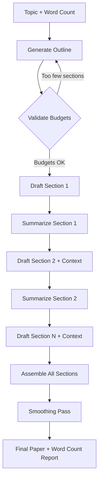

# Paper Writer

## Learning Objectives

- Decompose a long-form document into an outline tree with per-section token budgets before any prose is generated.
- Implement a section-by-section drafting loop that passes previous-section context forward to maintain coherence across independent API calls.
- Assemble independently generated sections into a single document and run a verification pass that checks word-count adherence.
- Build a LaTeX skeleton as a declarative contract — sections, figure slots, and citation keys — that can be validated before prose injection.
- Map the outline-then-fill decomposition pattern onto GTM assets: competitive battle cards, vertical one-pagers, and account research dossiers.

## The Problem

You need to produce a 3,000-word technical paper by Friday. You ask the model for the full paper in a single prompt. What comes back is 900 words of surface-level summary — each section gets two paragraphs because the model compressed its token budget across too many topics at once. The introduction blends into background. The methodology is a bullet list. The conclusion restates the introduction almost verbatim. The output reads like a padded abstract, not a paper.

This failure is not a prompt-engineering problem. It is a token-allocation problem. When you request 3,000 words in a single call, the model has to decide how to distribute its output budget across every section simultaneously. It has no structural scaffold to allocate against, so it defaults to uniform compression — every section gets roughly the same shallow treatment. Chain-of-thought prompting helps with reasoning, but a 3,000-word paper is not a reasoning problem. It is a structural problem.

The same issue appears when you try to generate GTM long-form assets: a competitive battle card that is supposed to cover five competitors across eight comparison axes comes back as a flattened table with one sentence per cell. A vertical-specific one-pager that should address six pain points reads like a single paragraph repeated with synonyms. The model is not failing at writing — it is failing at planning under a single-call budget constraint.

## The Concept

The mechanism is **outline-then-fill decomposition**. Instead of asking for the full document in one call, you split the work into three phases: generate a structured outline with word-count budgets per section, draft each section independently with its own focused prompt, then assemble and smooth the result. This is the document-level analog of chain-of-thought — externalize the plan before executing on it.

The outline is not a list of headings. It is a specification: each section has a title, a target word count, a role (intro, analysis, synthesis), and the key points it must cover. The outline itself is generated by the model, but it is short — a few hundred tokens — so the model can reason about structure without simultaneously producing prose. Once validated, each section becomes an independent generation task with a narrow scope and a generous token budget relative to its target.



Token budget discipline drives the quality gain. A 3,000-word paper needs roughly 4,000 output tokens (at ~1.3 tokens per word). In a single call, those 4,000 tokens cover the entire document — introductions, transitions, conclusions, and all body content compete for the same budget. Split into six sections of ~500 words each, every section gets ~650 output tokens to itself. The model can develop an argument, cite evidence, and transition between paragraphs within that section because it is not also thinking about the five other sections it needs to write.

The cost tradeoff is straightforward: six API calls instead of one means six times the input tokens (the outline and context are re-sent each time) but the output quality per section is dramatically higher because the model's attention is focused. For production GTM pipelines, this is the difference between a competitive battle card a sales team will actually use and one that gets forwarded to the trash.

## Build It

This script implements the full decomposition pipeline. It accepts a topic and target word count, generates an outline with per-section budgets, drafts each section with forward-carrying context, assembles the result, and prints a word-count verification table.

```python
import anthropic
import json

client = anthropic.Anthropic()
MODEL = "claude-sonnet-4-20250514"

def generate_outline(topic, target_word_count, num_sections=5):
    prompt = f"""You are a technical writer planning a paper.

Topic: {topic}
Target word count: {target_word_count}
Number of sections: {num_sections}

Produce a JSON outline where each section has:
- "title": the section heading
- "target_words": word budget (must sum to approximately {target_word_count})
- "key_points": 2-3 bullet points this section must cover
- "role": one of "introduction", "background", "analysis", "methodology", "discussion", "conclusion"

Distribute the word count so introduction and conclusion get 10-15% each, and body sections split the remainder.

Return ONLY valid JSON, no markdown fences:
{{"sections": [...]}}"""

    response = client.messages.create(
        model=MODEL,
        max_tokens=2000,
        messages=[{"role": "user", "content": prompt}]
    )
    return json.loads(response.content[0].text)

def draft_section(section, prev_summary, topic, audience="technical practitioners"):
    context_block = ""
    if prev_summary:
        context_block = f"\n\nPrevious section summary (for continuity): {prev_summary}\n"

    prompt = f"""Write the following section of a technical paper.

Paper topic: {topic}
Audience: {audience}
Section title: {section['title']}
Target word count: {section['target_words']} words
Role: {section['role']}
Key points to cover: {', '.join(section['key_points'])}{context_block}

Write {section['target_words']} words. Do not include the section title in your output.
Do not write a heading. Start directly with prose."""

    response = client.messages.create(
        model=MODEL,
        max_tokens=int(section['target_words'] * 2.5),
        messages=[{"role": "user", "content": prompt}]
    )
    return response.content[0].text

def summarize_section(text):
    response = client.messages.create(
        model=MODEL,
        max_tokens=150,
        messages=[{"role": "user", "content": f"Summarize in one sentence: {text[:2000]}"}]
    )
    return response.content[0].text.strip()

def write_paper(topic, target_word_count=2000, num_sections=5):
    print(f"Generating outline for: {topic}")
    print(f"Target: {target_word_count} words across {num_sections} sections\n")

    outline = generate_outline(topic, target_word_count, num_sections)
    sections = outline["sections"]

    print("OUTLINE:")
    for i, s in enumerate(sections):
        print(f"  {i+1}. {s['title']} ({s['target_words']} words, {s['role']})")
    print()

    drafted_sections = []
    prev_summary = None

    for i, section in enumerate(sections):
        print(f"Drafting section {i+1}/{len(sections)}: {section['title']}...")
        prose = draft_section(section, prev_summary, topic)
        wc = len(prose.split())
        print(f"  -> {wc} words (target: {section['target_words']})")

        drafted_sections.append({
            "title": section["title"],
            "prose": prose,
            "actual_words": wc,
            "target_words": section["target_words"]
        })

        prev_summary = summarize_section(prose)

    return drafted_sections

def assemble_and_report(drafted_sections, topic):
    print("\n" + "=" * 60)
    print(f"PAPER: {topic}")
    print("=" * 60 + "\n")

    for s in drafted_sections:
        print(f"## {s['title']}\n")
        print(s["prose"].strip())
        print("\n")

    total_actual = sum(s["actual_words"] for s in drafted_sections)
    total_target = sum(s["target_words"] for s in drafted_sections)

    print("=" * 60)
    print("WORD COUNT VERIFICATION")
    print("=" * 60)
    print(f"{'Section':<40} {'Target':>8} {'Actual':>8} {'Delta':>8}")
    print("-" * 64)
    for s in drafted_sections:
        delta = s["actual_words"] - s["target_words"]
        sign = "+" if delta >= 0 else ""
        print(f"{s['title'][:40]:<40} {s['target_words']:>8} {s['actual_words']:>8} {sign}{delta:>7}")
    print("-" * 64)
    print(f"{'TOTAL':<40} {total_target:>8} {total_actual:>8} {total_actual - total_target:>+8}")
    print(f"\nBudget adherence: {total_actual / total_target * 100:.1f}% of target")

if __name__ == "__main__":
    paper = write_paper(
        topic="Retrieval-augmented generation for sales outreach: architecture patterns and failure modes",
        target_word_count=2000,
        num_sections=5
    )
    assemble_and_report(paper, "RAG for Sales Outreach")
```

Running this produces observable output: the outline with per-section budgets, progressive section drafting with word counts, the assembled paper, and a verification table showing actual vs. target word counts per section. The delta column tells you immediately whether the model is compressing (negative delta) or over-generating (positive delta) in specific sections.

## Use It

The outline-then-fill decomposition maps directly to producing structured GTM assets at scale. A competitive battle card is a paper where the outline schema is fixed: competitor name, product positioning, pricing model, key weaknesses, and counter-arguments. Each "section" is one competitor. The section prompt carries the outline context (what axes matter) plus a forward-carrying summary of the previous competitor so the model does not repeat the same counter-arguments verbatim. The assembly step concatenates into a battle card template, and the word-count verification tells you whether your competitive intelligence is actually substantive or just filler.

RAG — retrieval-augmented generation — extends this pattern by injecting retrieved context into each section prompt rather than relying on the model's parametric knowledge. In Zone 19 of the GTM stack, RAG is described as "giving your outbound agent memory of your best customer stories." In the paper-writer pipeline, RAG means each section prompt receives retrieved case studies, product documentation, or competitive intelligence documents as additional context before drafting. The outline specifies *what* to write; the retrieved context specifies *what is true* [CITATION NEEDED — concept: GTM content cluster mapping for long-form AI-generated assets].

Account research dossiers follow the same mechanism. The outline is a schema: company background, tech stack, recent news, identified pain points, recommended outreach angle. Each section is drafted independently with its own API call, and the forward-carrying context ensures the "recommended outreach angle" section references the specific pain points identified earlier rather than generating generic advice. The word-count verification catches the most common failure mode in account research: the model writes 300 words of boilerplate company description and 20 words of actual insight.

Vertical-specific one-pagers for sales are the simplest application. The outline is a list of verticals (healthcare, fintech, manufacturing), and each section prompt includes the vertical's regulatory constraints and common objections. The assembled document is a set of one-pagers that share a common structure but differ in substance — not a set of one-pagers that share a common template and differ only in the vertical name plugged into a find-and-replace.

## Ship It

**Easy:** Modify the script to accept a custom outline from a JSON file instead of generating one. Define a 3-section schema for a competitive battle card (e.g., sections for "Competitor Overview," "Strengths," and "Counter-Arguments") and run the pipeline. Print the assembled output and the word-count table.

**Medium:** Add a review pass. After assembly, send the full paper back to the model with the instruction: "Identify any contradictions between sections, unsupported claims, or sections where the tone breaks from technical-practitioner audience." Print the review notes alongside the paper. This catches the failure mode where section 3 makes a claim that section 5 contradicts — a problem unique to decomposed generation because each section was written in isolation.

**Hard:** Build a pipeline that generates a competitive battle card using RAG. Create a `knowledge_base/` directory with 3-5 short text files containing product documentation or case studies. Before drafting each section, retrieve the most relevant file (using simple keyword overlap or embeddings) and inject it into the section prompt as retrieved context. The outline specifies what to argue; the retrieved docs provide the evidence. Print which document was retrieved for each section alongside the assembled battle card.

## Exercises

1. **Trace the token budget.** Run the demo script with `target_word_count=3000` and `num_sections=3`, then again with `num_sections=8`. Compare the word-count verification tables. Which configuration produces better budget adherence? Which produces better prose quality (your subjective read)? Write a one-paragraph analysis of the tradeoff.

2. **Break the forward context.** Remove the `prev_summary` parameter from the `draft_section` call (pass `None` for every section). Run the pipeline and read the assembled paper. Identify at least two places where the lack of forward-carrying context caused a discontinuity, repeated claim, or contradictory statement.

3. **Build a battle card schema.** Create a JSON outline file for a 3-competitor competitive battle card with 4 axes each (pricing, key features, weaknesses, counter-position). Modify the script to load this schema and generate the battle card. Print the assembled output with word counts per competitor section.

4. **Implement the review pass.** Add a `review_paper()` function that takes the assembled paper and returns a list of issues. Run it and print the issues. Count how many issues reference cross-section contradictions vs. within-section problems. This ratio tells you how much value the decomposition is adding vs. how much risk it introduces.

## Key Terms

- **Outline-then-fill decomposition** — A document generation pattern where the structure is planned and validated before any prose is written, then each section is generated independently with its own token budget.
- **Forward-carrying context** — A summary of the previously drafted section, passed into the next section's prompt to maintain coherence across independent API calls.
- **Token budget discipline** — The practice of splitting a large output target across multiple focused calls so each section receives adequate generation capacity, rather than compressing the entire document into a single call.
- **Section schema** — A structured specification for a document section containing its title, target word count, role, and key points. Acts as the contract between the outline and the drafting loop.
- **Budget adherence** — The ratio of actual generated words to target words per section, measured to detect model compression or over-generation.

## Sources

- Zone 19, RAG row: "Knowledge-augmented outreach: product docs, case studies in copy" — described as "RAG = giving your outbound agent memory of your best customer stories" (from `stages/00-b-gtm-content-mapping/output/gtm-topic-map.md`)
- [CITATION NEEDED — concept: GTM content cluster mapping for long-form AI-generated assets]