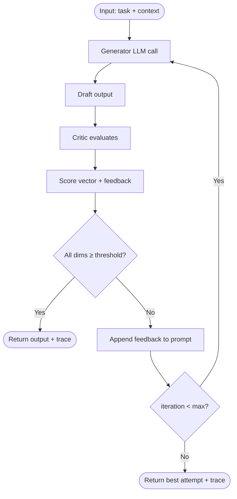

# Critic Loop

## Learning Objectives

- Implement a generate–evaluate–refine loop that scores LLM output across fixed dimensions and retries on failure.
- Detect convergence by comparing score vectors across iterations and stopping on plateau, target met, or budget exhausted.
- Compare internal critique (same model, different system prompt) against external critique (separate model or deterministic validator) on pass rate and latency.
- Track token cost and iteration count per loop cycle to production-grade the pattern for real-time GTM workflows.

## The Problem

A single-pass LLM call is a coin flip. You send a prompt, the model returns tokens, and you ship whatever it gave you. There is no quality gate between "the model produced output" and "we are using that output." For a throwaway prototype this is fine. For a pipeline that writes to a CRM, triggers a sales sequence, or personalizes outbound at scale, a single bad generation propagates downstream and you will not catch it until a prospect replies with confusion—or worse, ignores you.

The failure mode is not that the model is bad. The failure mode is that you gave it one attempt with no feedback signal. A human copywriter would draft, re-read, wince, and revise. The LLM does the same thing if you build the structure for it. The critic loop is that structure.

The pattern matters most when the output has constraints that are easy to state but hard to satisfy in a single pass: "mention the pain point, cite a metric, stay under 120 words, include a CTA, no jargon." Each constraint is a dimension the model can miss. A critic loop checks each dimension independently, feeds misses back to the generator, and retries until the output passes or the iteration budget is exhausted.

## The Concept

A critic loop has three components: a generator, a critic, and a convergence check. The generator produces output. The critic scores that output against explicit criteria. The convergence check decides whether to loop again. If the critic returns a paragraph of freeform suggestions, you have no contract—the next iteration treats the feedback as ambient context, and you cannot verify whether the revision actually addressed the criticism. If the critic returns a structured score vector, each dimension is independently trackable across iterations, and the convergence check can detect regressions: a revision that raises clarity but tanks evidence is caught because evidence scored lower than the previous round.



Two variants exist. **Internal critique** uses the same model for both generation and evaluation, with different system prompts. It is simpler to build—one API, one billing relationship, one deployment. Its blind spot is shared failure modes: if the model has a systematic bias (e.g., it cannot detect its own jargon because it was trained on jargon-heavy text), the critic inherits that bias and passes bad output.

**External critique** uses a separate model or a deterministic validator. A deterministic validator might be a regex check ("does the email contain a CTA verb?"), a length check, or a keyword scan. External critique catches blind spots the generator shares with itself, at the cost of additional infrastructure. In practice, production systems layer both: deterministic checks for things a regex can catch (length, required fields, banned words), model-based critique for semantic quality (tone, relevance, specificity).

Four variables control the loop's behavior. **Iteration cap** bounds cost—each iteration is a round-trip with token usage, so cap at 3 for most workflows. **Scoring rubric specificity** determines whether the critic is useful: "is this good?" is useless; "does the first sentence name a specific pain point? score 0–10" is actionable. **Feedback granularity** determines whether revisions are targeted or scattershot: "the CTA is missing" produces a better revision than "improve the ending." **Temperature resets** between retries prevent the model from anchoring to its previous output—set temperature slightly higher on retries to encourage divergence from the failed attempt.

Convergence is detected three ways. **Target met**: all dimensions score above threshold. **Plateau**: the score vector stops improving between rounds (the revision did not help, so more revisions will not help either). **Budget exhausted**: the iteration cap is hit. A well-tuned loop converges on target within 2 iterations on most inputs. If your loop hits the cap every time, either the generator prompt is bad or the critic rubric is too strict—calibrate on 50+ samples before deploying.

## Build It

Here is a complete, runnable critic loop in Python. It generates a cold outreach email, scores it across five dimensions, and retries with feedback until all dimensions pass or the iteration cap is hit.

```python
import anthropic
import json

client = anthropic.Anthropic()

DIMENSIONS = ["pain_point", "evidence", "brevity", "cta", "tone"]
THRESHOLD = 7
MAX_ITERATIONS = 3

def clean_json(text):
    text = text.strip()
    if text.startswith("```"):
        text = text.split("\n", 1)[1] if "\n" in text else text[3:]
    if text.endswith("```"):
        text = text.rsplit("```", 1)[0]
    return text.strip()

def generate(prospect_context, feedback=None):
    user_msg = f"""Write a cold outreach email for this prospect. Requirements:
- Open with a specific pain point in the first sentence
- Cite one concrete metric or example
- Keep under 120 words
- End with a single clear CTA (book a 15-minute call)
- Professional tone, no corporate jargon (no "synergy", "leverage", "revolutionary")

Prospect: {prospect_context}"""

    if feedback:
        user_msg += f"\n\nPrevious attempt scored below threshold on some dimensions. Revise:\n{feedback}"

    response = client.messages.create(
        model="claude-3-5-haiku-20241022",
        max_tokens=400,
        messages=[{"role": "user", "content": user_msg}]
    )
    return response.content[0].text

def critique(email):
    response = client.messages.create(
        model="claude-3-5-haiku-20241022",
        max_tokens=500,
        messages=[{"role": "user", "content": f"""Score this cold outreach email on five dimensions, each 0-10.

Email:
{email}

Return JSON only, no other text:
{{
  "pain_point": <0-10 does first sentence name a specific pain>,
  "evidence": <0-10 is there a concrete metric or example>,
  "brevity": <0-10 is it under 120 words>,
  "cta": <0-10 is there a single clear call to action>,
  "tone": <0-10 professional without jargon>,
  "feedback": "<one sentence per dimension that scored below 7>"
}}"""}]
    )
    return json.loads(clean_json(response.content[0].text))

def critic_loop(prospect_context):
    trace = []
    feedback = None

    for i in range(MAX_ITERATIONS):
        email = generate(prospect_context, feedback)
        result = critique(email)

        scores = {d: result[d] for d in DIMENSIONS}
        avg = sum(scores.values()) / len(DIMENSIONS)
        all_pass = all(scores[d] >= THRESHOLD for d in DIMENSIONS)

        trace.append({
            "iteration": i + 1,
            "email": email,
            "scores": scores,
            "average": round(avg, 1),
            "feedback": result.get("feedback", ""),
            "passed": all_pass
        })

        print(f"\n--- Iteration {i + 1} ---")
        print(f"Email preview: {email[:80]}...")
        for d in DIMENSIONS:
            status = "PASS" if scores[d] >= THRESHOLD else "FAIL"
            print(f"  {d}: {scores[d]}/10 [{status}]")
        print(f"  Average: {avg:.1f}")

        if all_pass:
            print("ALL DIMENSIONS PASSED")
            break

        feedback = result.get("feedback", "")
        if i < MAX_ITERATIONS - 1:
            print(f"  Feedback: {feedback}")

    if not trace[-1]["passed"]:
        print(f"\nHit iteration cap ({MAX_ITERATIONS}). Returning best attempt.")

    return trace

prospect = """Sarah Chen, VP Engineering at Datapipe (Series B, 80 engineers).
Stack: Kubernetes, Datadog, PagerDuty.
Known pain: on-call burnout, 3am pages for non-critical alerts."""

trace = critic_loop(prospect)
print(f"\n=== FINAL ===")
print(f"Iterations: {len(trace)}")
print(f"Converged: {trace[-1]['passed']}")
print(f"Final average: {trace[-1]['average']}")
print(f"\nFinal email:\n{trace[-1]['email']}")
```

This script makes two LLM calls per iteration: one to generate, one to critique. At most three iterations means at most six API calls per email. The trace captures every iteration's scores and feedback, which you need for debugging prompt drift and tuning thresholds.

The score vector is the contract. Notice that `pain_point` can score 9 while `brevity` scores 3—the loop does not average away weaknesses. A revision that fixes brevity but drops pain_point from 9 to 5 is a regression on pain_point, and the convergence check will catch it on the next round. This is why freeform critique ("looks pretty good, tighten it up") is insufficient: you cannot detect a regression on a dimension you never measured.

## Use It

A critic loop applied to a Clay enrichment waterfall creates a validation gate between "provider returned data" and "we write it to the CRM." In a Clay waterfall, each step queries a provider (Clearbit, Apollo, LinkedIn scraper) and writes the result to a column. Without a critic, any garbage the provider returns—wrong company description, stale employee count, mismatched industry—flows straight into your CRM and pollutes every downstream segment, scoring model, and outbound sequence that touches that record.

The critic loop sits between the enrichment result and the write. The generator is the enrichment provider (or an LLM summarizing raw provider data into a clean field). The critic is an LLM call with a rubric: "Does this company description match the website we scraped? Does the employee count fall within a plausible range for the industry? Score each 0–10." If any dimension fails, the loop re-enriches from the next provider in the waterfall, appending the critic's feedback so the retry knows what went wrong.

[CITATION NEEDED — concept: Clay enrichment waterfall with validation step between provider result and CRM write]

This maps to the **Data Enrichment & Scoring** cluster (Zone 2). The same pattern applies to outbound copy generation in the **Write at Scale** cluster: a critic loop over generated outreach emails checks for pain-point relevance, evidence specificity, and CTA clarity before the email enters a sending sequence. Without the critic, a single bad email template variant can burn through a list of 500 prospects before anyone notices the reply rate is zero.

The cost calculus is concrete. Enriching 1,000 companies with a 3-iteration critic loop costs roughly 6,000 API calls (2 per iteration, 3 iterations worst case, 1,000 records). At Claude Haiku pricing that is a few dollars. The cost of 1,000 garbage records in your CRM—inflated enrichment spend on bad data, wasted SDR time calling wrong numbers, degraded segment accuracy—is orders of magnitude higher. The critic loop is an insurance policy with a known premium.

## Ship It

Deploying a critic loop into a production GTM pipeline requires four calibrations, and skipping any of them will produce a loop that either rubber-stamps garbage or burns tokens forever.

**Token cost scales linearly with iterations.** A 3-iteration cap with two API calls per iteration means six calls per record. For batch enrichment of 10,000 companies, that is 60,000 calls. Measure the actual average iterations-to-convergence on your data before setting the cap—if 90% of records converge in 1 iteration, cap at 2 instead of 3 and cut your worst-case cost by a third.

**Critic prompt drift is the silent killer.** If the critic is too lenient, the loop exits on iteration 1 with output that would not pass human review. If the critic is too strict, every record hits the cap and you pay for three iterations of non-convergence. Calibrate on 50+ samples with human-scored ground truth: run the critic on outputs you have manually rated, and adjust the rubric wording until the critic's pass/fail decisions match human judgment within an acceptable error rate (typically 85%+ agreement).

**Latency compounds.** Each iteration is a synchronous round-trip. Three iterations with two calls each means six sequential API calls, adding 5–15 seconds to a record that would otherwise take 1 second. For real-time workflows—live chat, instant form-fill enrichment, dynamic landing page personalization—this latency is unacceptable. In those cases, use single-pass generation with async post-hoc critique: generate immediately, evaluate after the fact, and flag failures for human review or re-enrichment.

**Log every iteration, not just the final output.** The iteration trace is your audit trail for prompt improvement. When the loop fails on a new type of input, the trace tells you which dimension regressed and what the critic said about it. Without per-iteration logs, you are debugging a black box: the output is bad and you do not know whether the generator prompt is wrong, the critic rubric is misaligned, or the iteration cap is too low.

In a Clay-specific deployment, the critic loop maps to a formula column or a Claygent enrichment step that runs after each provider in the waterfall. [CITATION NEEDED — concept: Claygent AI enrichment column with conditional logic for retry] The critic's structured scores can be written to separate columns (pain_point_score, evidence_score, etc.) so you can filter and sort records by quality, not just by whether they passed the gate.

## Exercises

**Exercise 1: Single-model critic loop