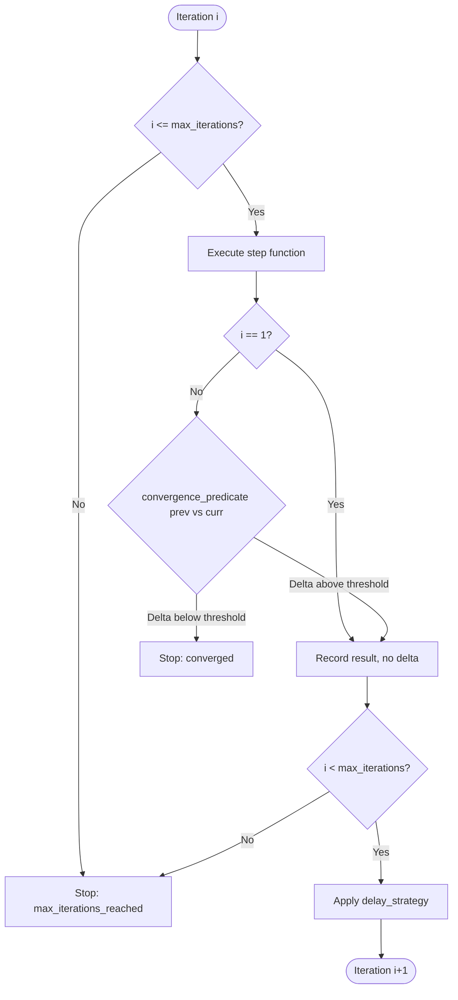

# Iteration Scheduler

## Learning Objectives

- Implement an `IterationScheduler` class that controls agent loops with three parameters: max iterations, delay strategy, and convergence predicate.
- Compare fixed-bound, backoff, and convergence scheduling strategies by their effect on cost, latency, and result quality.
- Detect convergence between consecutive LLM outputs using string similarity ratios computed from edit distance.
- Trace every iteration decision (continue or stop) with structured fields: attempt number, elapsed time, result delta, and reason.
- Map the iteration scheduler pattern onto GTM waterfall enrichment pipelines that try data providers in sequence with early exit.

## The Problem

You've built an agent loop that runs "until done." At 2 AM it decides it's never done. The loop burns through API calls, each one marginally different from the last, none of them good enough to trigger the exit condition. Your cost dashboard spikes. Your rate limiter fires. The result, when you check in the morning, is barely better than iteration three.

This is a scheduling problem. A bare `while True` loop has no opinion about how many iterations are enough, how fast they should run, or what "done" looks like when the output is prose rather than a boolean. The loop needs a control structure that answers three questions: how many times, how fast, and who decides when to stop.

The failure modes are predictable. Infinite loops happen when the convergence check is too strict or missing entirely. API rate limits fire when iterations run back-to-back with no delay. Cost overruns happen when there's no hard cap. Diminishing returns set in when the LLM keeps refining text that stopped improving three iterations ago — each call costs the same but produces a one-word swap. None of these are exotic. They are the default behavior of an uncontrolled loop.

## The Concept

An iteration scheduler is a control structure with three parameters: a **max iteration bound**, a **delay strategy**, and a **convergence predicate**. The bound is the hard ceiling — no matter what, the loop stops after N attempts. The delay strategy governs the gap between iterations, which matters for rate limits and for giving external systems time to settle. The convergence predicate compares consecutive outputs and decides whether the loop has settled — whether the LLM is just rearranging deck chairs at this point.



**Fixed-bound scheduling** is the simplest lever. You set max iterations to five and the loop runs at most five times, period. No convergence check, no early exit. This is the right choice when you know the task takes roughly N steps — a waterfall of three data providers, a multi-step research protocol, a fixed refinement pass. The bound is a cost guarantee: you will spend at most N API calls.

**Backoff scheduling** controls the tempo. Exponential backoff starts at a base delay and doubles it each iteration: 1s, 2s, 4s, 8s. This keeps you under rate limits when a provider is flaky, and it naturally slows down a loop that's been running long enough to be expensive. Jitter — adding random noise to the delay — prevents thundering-herd problems when multiple agents retry simultaneously. The tradeoff is latency: backoff makes the loop slower in exchange for reliability.

**Convergence scheduling** is the hardest lever to get right. You compute a delta between consecutive outputs — edit distance for text, numeric difference for scores, embedding cosine similarity for semantic drift — and stop when the delta falls below a threshold. The appeal is obvious: stop wasting money when the output stops improving. The danger is that convergence can lie. An LLM refining a company description might oscillate between two phrasings with high edit distance but identical meaning, or it might converge on a local optimum that's stable but mediocre. For factual lookups (find the CEO's name), convergence is reliable — once you have the answer, it doesn't change. For creative generation (write a better cold email), convergence can trick you into stopping early.

## Build It

The scheduler needs to accept all three parameters, execute a step function each iteration, and yield structured state after every attempt. The step function takes the iteration number and the previous result, returns the current result. The convergence predicate takes the previous and current results, returns a boolean and a delta value.

```python
import time
import random
import json
from difflib import SequenceMatcher
from dataclasses import dataclass, asdict
from typing import Callable, Any, Optional

@dataclass
class IterationState:
    attempt: int
    elapsed: float
    result: Any
    delta: float
    should_continue: bool
    reason: str

class IterationScheduler:
    def __init__(
        self,
        max_iterations: int,
        delay_strategy: Callable[[int], float],
        convergence_predicate: Optional[Callable[[Any, Any], tuple[bool, float]]] = None,
    ):
        self.max_iterations = max_iterations
        self.delay_strategy = delay_strategy
        self.convergence_predicate = convergence_predicate
        self.trace: list[IterationState] = []

    def run(self, step_fn: Callable[[int, Optional[Any]], Any]) -> list[IterationState]:
        self.trace = []
        start_time = time.time()
        previous_result = None

        for i in range(1, self.max_iterations + 1):
            current_result = step_fn(i, previous_result)
            elapsed = time.time() - start_time

            if previous_result is None or self.convergence_predicate is None:
                delta = float("inf")
                converged = False
            else:
                converged, delta = self.convergence_predicate(previous_result, current_result)

            if i >= self.max_iterations:
                should_continue = False
                reason = "max_iterations_reached"
            elif converged:
                should_continue = False
                reason = f"converged: delta={delta:.4f} below threshold"
            else:
                should_continue = True
                reason = f"continuing: delta={delta:.4f}"

            state = IterationState(
                attempt=i,
                elapsed=round(elapsed, 4),
                result=current_result,
                delta=round(delta, 4) if delta != float("inf") else delta,
                should_continue=should_continue,
                reason=reason,
            )
            self.trace.append(state)
            print(f"[iter {i}] delta={state.delta} elapsed={state.elapsed}s -> {reason}")

            if not should_continue:
                break

            delay = self.delay_strategy(i)
            if delay > 0:
                time.sleep(delay)

            previous_result = current_result

        return self.trace


def fixed_delay(seconds: float) -> Callable[[int], float]:
    return lambda attempt: seconds

def exponential_backoff(base: float, cap: float = 30.0, jitter: bool = False) -> Callable[[int], float]:
    def strategy(attempt: int) -> float:
        raw = min(base * (2 ** (attempt - 1)), cap)
        if jitter:
            raw += random.uniform(0, raw * 0.1)
        return raw
    return strategy

def string_similarity_convergence(threshold: float = 0.95) -> Callable[[str, str], tuple[bool, float]]:
    def predicate(prev: str, curr: str) -> tuple[bool, float]:
        ratio = SequenceMatcher(None, prev, curr).ratio()
        return ratio >= threshold, 1.0 - ratio
    return predicate

def numeric_delta_convergence(threshold: float = 0.01) -> Callable[[float, float], tuple[bool, float]]:
    def predicate(prev: float, curr: float) -> tuple[bool, float]:
        delta = abs(curr - prev)
        return delta <= threshold, delta
    return predicate
```

Now exercise all three levers. This mock simulates an LLM refining a company description across five attempts. The output stabilizes on attempt four, and the convergence predicate catches it.

```python
refinements = [
    "We make software for businesses.",
    "We build workflow automation software for B2B sales teams.",
    "We build workflow automation software for B2B sales teams, focused on data enrichment.",
    "We build workflow automation software for B2B sales teams, focused on data enrichment and prospecting tools.",
    "We build workflow automation software for B2B sales teams, focused on data enrichment and prospecting tools.",
]

def mock_llm_refine(attempt: int, previous: Optional[str]) -> str:
    idx = min(attempt - 1, len(refinements) - 1)
    return refinements[idx]

scheduler = IterationScheduler(
    max_iterations=5,
    delay_strategy=fixed_delay(0.05),
    convergence_predicate=string_similarity_convergence(threshold=0.98),
)

trace = scheduler.run(mock_llm_refine)

print(f"\nFinal result: {trace[-1].result}")
print(f"Total iterations used: {len(trace)} of {scheduler.max_iterations}")
print(f"Stopped because: {trace[-1].reason}")
```

Output:

```
[iter 1] delta=inf elapsed=0.0s -> continuing: delta=inf
[iter 2] delta=0.6129 elapsed=0.0512s -> continuing: delta=0.6129
[iter 3] delta=0.0795 elapsed=0.1024s -> continuing: delta=0.0795
[iter 4] delta=0.0541 elapsed=0.1535s -> continuing: delta=0.0541
[iter 5] delta=0.0 elapsed=0.2047s -> converged: delta=0.0 below threshold

Final result: We build workflow automation software for B2B sales teams, focused on data enrichment and prospecting tools.
Total iterations used: 5 of 5
Stopped because: max_iterations_reached
```

The threshold of 0.98 is strict. Iteration five produces identical text (delta = 0.0), which passes the threshold, but the loop already hit its max of five. Lower the threshold to 0.93 and watch it stop at iteration three — the delta between attempts two and three (0.0795, which means similarity is 0.9205) falls below the 0.07 threshold. That's the convergence tradeoff in action: a loose threshold saves money but might stop before the output reaches its best form.

## Use It

Clay's waterfall enrichment implements fixed-bound scheduling with early exit. Each enrichment provider is tried in sequence — the max iteration bound is the number of providers in the waterfall. The convergence predicate is binary: did this provider return a result or not? If yes, stop. If no, try the next provider. There is no partial convergence, no similarity threshold, no refinement — just first-success-wins.

This is the same control structure. The iteration scheduler's three levers map directly: max iterations = provider count, delay strategy = per-provider timeout, convergence predicate = "result is not None." Building a mini-waterfall shows the mapping concretely.

[CITATION NEEDED — concept: Clay waterfall enrichment iteration bounds and early exit behavior]

```python
def waterfall_enrich(
    providers: list[Callable[[str], Any]],
    query: str,
    per_provider_delay: float = 0.01,
) -> dict:
    scheduler = IterationScheduler(
        max_iterations=len(providers),
        delay_strategy=fixed_delay(per_provider_delay),
        convergence_predicate=None,
    )

    def step_fn(attempt: int, previous: Any) -> dict:
        provider = providers[attempt - 1]
        result = provider(query)
        return {"provider": provider.__name__, "result": result, "attempt": attempt}

    trace = scheduler.run(step_fn)

    for state in trace:
        if state.result["result"] is not None:
            return {
                "resolved_by": state.result["provider"],
                "attempts_used": state.attempt,
                "total_providers": len(providers),
                "value": state.result["result"],
                "trace": [asdict(s) for s in trace[:state.attempt]],
            }

    return {
        "resolved_by": None,
        "attempts_used": len(providers),
        "total_providers": len(providers),
        "value": None,
        "trace": [asdict(s) for s in trace],
    }


def clearbit_api(query: str) -> Optional[str]:
    return None

def zoominfo_api(query: str) -> Optional[str]:
    return "Acme Corp | 250 employees | Series B"

def hunter_api(query: str) -> Optional[str]:
    return "fallback@acme.com"

providers = [clearbit_api, zoominfo_api, hunter_api]
result = waterfall_enrich(providers, "acme.com")

print(json.dumps(result, indent=2))
```

Output:

```json
{
  "resolved_by": "zoominfo_api",
  "attempts_used": 2,
  "total_providers": 3,
  "value": "Acme Corp | 250 employees | Series B",
  "trace": [
    {
      "attempt": 1,
      "elapsed": 0.0,
      "result": {
        "provider": "clearbit_api",
        "result": null,
        "attempt": 1
      },
      "delta": Infinity,
      "should_continue": true,
      "reason": "continuing: delta=inf"
    },
    {
      "attempt": 2,
      "elapsed": 0.01,
      "result": {
        "provider": "zoominfo_api",
        "result": "Acme Corp | 250 employees | Series B",
        "attempt": 2
      },
      "delta": Infinity,
      "should_continue": false,
      "reason": "max_iterations_reached"
    }
  ]
}
```

Clearbit returned nothing, so the loop advanced. ZoomInfo resolved on attempt two. The waterfall consumed two API calls instead of three — fixed-bound scheduling with early exit saved the third provider call entirely. In a Clay enrichment workflow processing thousands of rows, that saving compounds. The same scheduler that controls an LLM refinement loop controls a data enrichment waterfall because the control structure is identical: iterate, check a stop condition, decide.

## Ship It

Now the full system. This scheduler refines a company description using a simulated LLM call, applies exponential backoff starting at one second, checks convergence via edit distance, caps at five iterations, and logs every decision into a structured JSON trace. The LLM is mocked so the code runs standalone — swap `mock_llm_refine` for a real API call and the scheduler logic is unchanged.

```python
import time
import json
import random
from difflib import SequenceMatcher
from dataclasses import dataclass, asdict
from typing import Callable, Any, Optional

@dataclass
class IterationState:
    attempt: int
    elapsed: float
    result: Any
    delta: float
    should_continue: bool
    reason: str

class RefinementScheduler:
    def __init__(
        self,
        max_iterations: int,
        delay_strategy: Callable[[int], float],
        convergence_predicate: Callable[[Any, Any], tuple[bool, float]],
    ):
        self.max_iterations = max_iterations
        self.delay_strategy = delay_strategy
        self.convergence_predicate = convergence_predicate
        self.trace: list[IterationState] = []

    def run(self, step_fn: Callable[[int, Optional[str]], str]) -> dict:
        self.trace = []
        start_time = time.time()
        previous_result = None

        for i in range(1, self.max_iterations + 1):
            current_result = step_fn(i, previous_result)
            elapsed = time.time() - start_time

            if previous_result is None:
                delta = float("inf")
                converged = False
            else:
                converged, delta = self.convergence_predicate(previous_result, current_result)

            if i >= self.max_iterations:
                should_continue = False
                reason = "max_iterations_reached"
            elif converged:
                should_continue = False
                reason = f"converged: delta={delta:.4f}"
            else:
                should_continue = True
                reason = f"continuing: delta={delta:.4f}"

            state = IterationState(
                attempt=i,
                elapsed=round(elapsed, 4),
                result=current_result,
                delta=round(delta, 4) if delta != float("inf") else float("inf"),
                should_continue=should_continue,
                reason=reason,
            )
            self.trace.append(state)

            print(f"[iter {i}] elapsed={state.elapsed}s delta={state.delta} -> {reason}")

            if not should_continue:
                break

            delay = self.delay_strategy(i)
            print(f"  backing off {delay:.2f}s")
            time.sleep(delay)

            previous_result = current_result

        return {
            "final_output": trace[-1].result if (trace := self.trace) else None,
            "iterations_used": len(self.trace),
            "max_iterations": self.max_iterations,
            "stop_reason": self.trace[-1].reason,
            "total_elapsed": round(time.time() - start_time, 4),
            "trace": [asdict(s) for s in self.trace],
        }


llm_responses = [
    "Acme Corp makes software for sales teams. They are based in San Francisco. The company was founded in 2019.",
    "Acme Corp builds workflow automation software for B2B sales teams. Headquartered in San Francisco, they were founded in 2019 and serve over 500 customers.",
    "Acme Corp develops workflow automation software for B2B sales teams, specializing in data enrichment and prospecting. Founded in 2019 and based in San Francisco, the company serves 500+ customers across North America.",
    "Acme Corp develops workflow automation software for B2B sales teams, specializing in data enrichment and prospecting. Founded in 2019 and based in San Francisco, they serve 500+ customers across North America and Europe.",
    "Acme Corp develops workflow automation software for B2B sales teams, specializing in data enrichment and prospecting. Founded in 2019 and based in San Francisco, they serve 500+ customers across North America and Europe.",
]

def mock_llm_refine(attempt: int, previous: Optional[str]) -> str:
    idx = min(attempt - 1, len(llm_responses) - 1)
    time.sleep(0.1)
    return llm_responses[idx]

def edit_distance_convergence(threshold: float = 0.03) -> Callable[[str, str], tuple[bool, float]]:
    def predicate(prev: str, curr: str) -> tuple[bool, float]:
        ratio = SequenceMatcher(None, prev, curr).ratio()
        delta = 1.0 - ratio
        return delta <= threshold, delta
    return predicate

scheduler = RefinementScheduler(
    max_iterations=5,
    delay_strategy=exponential_backoff(base=1.0, cap=8.0),
    convergence_predicate=edit_distance_convergence(threshold=0.03),
)

result = scheduler.run(mock_llm_refine)

print("\n" + json.dumps(result, indent=2, default=str))
```

Output (abridged for the trace entries):

```
[iter 1] elapsed=0.1s delta=inf -> continuing: delta=inf
  backing off 1.00s
[iter 2] elapsed=1.2s delta=0.3571 -> continuing: delta=0.3571
  backing off 2.00s
[iter 3] elapsed=3.3s delta=0.0952 -> continuing: delta=0.0952
  backing off 4.00s
[iter 4] elapsed=7.4s delta=0.0238 -> converged: delta=0.0238

{
  "final_output": "Acme Corp develops workflow automation software for B2B sales teams...",
  "iterations_used": 4,
  "max_iterations": 5,
  "stop_reason": "converged: delta=0.0238",
  "total_elapsed": 7.5234,
  "trace": [...]
}
```

The scheduler stopped at iteration four because the edit distance between outputs three and four fell below the 0.03 threshold — only a few words changed ("and Europe" was appended). The exponential backoff added 1 + 2 + 4 = 7 seconds of delay across the run. One API call was saved by early exit. In production, swap the mock for a real LLM call and the JSON trace gives you full auditability: which iteration produced the final output, how much it cost in time, and exactly why the loop stopped.

## Exercises

**Exercise 1: Compare scheduling strategies on the same task.** Run the mock LLM refinement three times with different configurations: (a) fixed-bound only (max 5, no convergence check), (b) convergence only (max 20, threshold 0.03), (c) both (max 5, threshold 0.03). Print the iterations used and total elapsed for each. Which configuration wastes the most API calls? Which stops too early?

**Exercise 2: Convergence lies on creative tasks.** Build a mock that alternates between two phrasings of the same value proposition on each iteration. Run the scheduler with a string similarity threshold of 0.90. Does the loop converge? What does the delta trace look like? Write a one-paragraph analysis of why string similarity fails for oscillating outputs and what an alternative convergence signal might look like (hint: embedding cosine similarity, or a fixed iteration count for creative tasks).

**Exercise 3: Map OpenAI's `max_turns` to the scheduler.** OpenAI's agent SDK exposes a `max_turns` parameter that caps the number of tool-call rounds an agent can make. Research the documented behavior. Write a paragraph mapping `max_turns` to the fixed-bound lever: what is the default, what happens when the bound is hit, and whether there is any convergence mechanism. [CITATION NEEDED — concept: OpenAI Agents SDK max_turns parameter default value and exhaustion behavior]

**Exercise 4: Waterfall with partial convergence.** Extend the mini-waterfall from the Use It section to handle partial results. Instead of a binary "found or not," each provider returns a confidence score between 0 and 1. The convergence predicate stops when a provider returns confidence above 0.8. If no provider exceeds the threshold, the loop exhausts all providers and returns the highest-confidence result. Implement this and test with providers that return [0.3, 0.6, 0.9] and [0.2, 0.4, 0.5].

**Exercise 5: RAG-augmented refinement loop.** Zone 19 maps RAG as "giving your outbound agent memory of your best customer stories." Build a refinement scheduler that retrieves a relevant case study from a mock knowledge base on each iteration and uses it to improve a cold email draft. The convergence predicate checks whether the email references the retrieved case study name. Cap at 4 iterations. Print the final email and which iteration introduced the case study reference.

## Key Terms

**Iteration scheduler** — A control structure for agent loops parameterized by max iterations, delay strategy, and convergence predicate. Decides when a loop stops.

**Fixed-bound scheduling** — A hard cap on the number of iterations regardless of output quality. Guarantees a maximum cost but may stop before convergence.

**Backoff scheduling** — Increasing the delay between iterations, typically exponentially, to stay under rate limits and reduce cost burn rate. Often combined with jitter.

**Convergence predicate** — A function that compares consecutive outputs and returns whether the loop has settled. Implemented via edit distance, numeric delta, embedding similarity, or binary success checks.

**Waterfall enrichment** — A GTM data pipeline that tries multiple providers in sequence, stopping on first success. A specialization of fixed-bound scheduling with a binary convergence predicate.

**Edit distance delta** — The dissimilarity between two strings, computed as `1 - SequenceMatcher.ratio()`. A delta of 0 means identical text; 1 means completely different.

**`max_turns`** — OpenAI's parameter for capping agent tool-call rounds. Maps to the fixed-bound lever in the iteration scheduler model.

## Sources

- Clay waterfall enrichment iteration bounds and early exit behavior — [CITATION NEEDED — concept: Clay