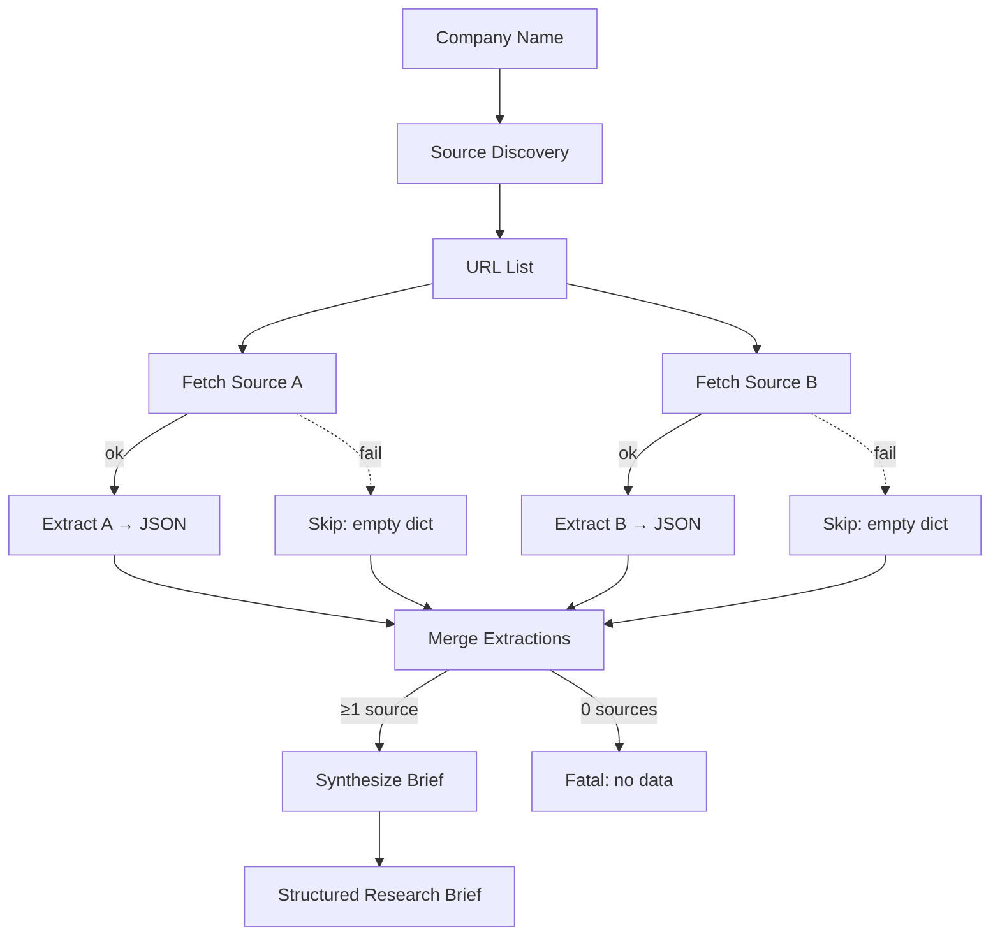

# End-to-End Research Demo

## Learning Objectives

1. Build a multi-step research pipeline that fetches, extracts, and synthesizes company data from multiple web sources into a single structured brief
2. Compare sequential vs. parallel fetch strategies and their tradeoffs in rate-limited environments
3. Design extraction prompts that produce consistent JSON output across heterogeneous source types (encyclopedia HTML, company pages, news articles)
4. Implement error handling that degrades gracefully when individual sources fail, preserving partial results
5. Evaluate synthesized research output against a defined schema for completeness, internal consistency, and actionability

## The Problem

You have a target account. You need to know what they do, who leads them, what they're buying, and what they care about — in under 90 seconds. A human analyst opens five browser tabs, skims paragraphs, copies facts into a spreadsheet, and writes a summary. That takes 15 minutes per account. At 200 accounts on a target list, that's 50 hours of work that is already stale by the time it's done.

The problem is not that the information is unavailable. It is scattered across Wikipedia, company about pages, press releases, LinkedIn, and news sites — each with different HTML structure, different content density, and different reliability. The problem is composing those unreliable individual fetches into a single reliable output. Each source might fail, return a CAPTCHA, or contain outdated information. Your pipeline has to handle all of those cases and still produce something useful.

This is the same composition problem that production enrichment tools solve. The mechanism is a fetch-extract-merge pipeline: decompose the research question into discrete steps, execute them in an order that respects dependencies, and merge the results into a structured schema that downstream systems can consume.

## The Concept

A research pipeline has three stages: **fetch** (retrieve raw content from sources), **extract** (transform unstructured HTML or text into structured fields), and **synthesize** (merge multiple extractions into a single coherent output). The interesting engineering decisions are in how you orchestrate these stages and how you handle failure at each boundary.

**Sequential vs. parallel fetch.** When sources are independent — Wikipedia doesn't depend on the company website — you can fetch them in parallel. This matters when you have 10+ sources and each takes 2-5 seconds to respond. Sequential fetch of 10 sources at 3 seconds each takes 30 seconds. Parallel fetch with a connection pool takes roughly 3 seconds. The tradeoff: parallel fetch hits rate limits faster, requires connection pooling, and makes error handling more complex because failures arrive out of order. For a demo with 2-3 sources, sequential is simpler and the latency difference is negligible. For a production pipeline enriching thousands of accounts, parallel is mandatory.

**Extraction prompt design.** The extraction step is where consistency lives or dies. The same field — say, "target_market" — extracted from a Wikipedia article vs. a company about page will produce different vocabulary unless you constrain the model. The fix is a shared schema description passed to every extraction call, regardless of source. Each source extraction produces the same JSON shape. This makes the merge step trivial: you are combining objects with identical keys, not reconciling freeform text.

**Error propagation.** When a source fails — DNS timeout, 403, empty page — the pipeline has two options: halt or continue with partial data. Halting is correct when the source is a hard dependency (you cannot extract from a page you never fetched). Continuing is correct when sources are redundant or supplementary. The demo implements graceful degradation: a failed fetch sets that source's extraction to an empty dict, and the synthesis step works with whatever extractions succeeded. If all sources fail, the pipeline reports a fatal error rather than producing a fabricated brief.



The diagram shows the full decision flow: two independent fetches, each can succeed or fail independently, results merge regardless, and synthesis runs only if at least one source produced data.

## Build It

This script takes a company name, fetches two sources (Wikipedia + the company's about page), extracts structured fields from each using Claude, merges the extractions into a single research brief, and prints every intermediate result so you can watch the pipeline move. Install dependencies first: `pip install httpx anthropic`. You need `ANTHROPIC_API_KEY` set in your environment.

```python
import httpx
import json
import sys
import time
from anthropic import Anthropic

client = Anthropic()

def fetch(url, timeout=10):
    try:
        r = httpx.get(
            url,
            timeout=timeout,
            follow_redirects=True,
            headers={"User-Agent": "Mozilla/5.0 ResearchPipeline/1.0"},
        )
        r.raise_for_status()
        return r.text
    except Exception as e:
        print(f"  [FAIL] {type(e).__name__}: {str(e)[:80]}")
        return None

def extract(html, fields, source_name):
    trunc = html[:40000]
    msg = client.messages.create(
        model="claude-sonnet-4-20250514",
        max_tokens=1500,
        messages=[{"role": "user", "content": f"""Extract from this web page. Source: {source_name}.

Return ONLY valid JSON with these keys:
{json.dumps(fields, indent=2)}

Page content:
{trunc}"""}],
    )
    return msg.content[0].text

def synthesize(extractions):
    combined = json.dumps(extractions, indent=2, default=str)
    msg = client.messages.create(
        model="claude-sonnet-4-20250514",
        max_tokens=1500,
        messages=[{"role": "user", "content": f"""Merge multiple research extractions into one brief.
When sources conflict, prefer the more specific one.

Extractions:
{combined}

Return ONLY valid JSON:
{{
  "company_name": "official legal name",
  "overview": "2-3 sentence description of what they do",
  "products": ["product or service names"],
  "leadership": [{{"name": "...", "title": "..."}}],
  "target_market": "primary customer segment",
  "sales_angle": "specific, researched opening for a sales conversation"
}}"""}],
    )
    return msg.content[0].text

def clean_json(raw):
    cleaned = raw.strip()
    if cleaned.startswith("```"):
        cleaned = cleaned.split("\n", 1)[-1] if "\n" in cleaned else cleaned[3:]
    if cleaned.endswith("```"):
        cleaned = cleaned[:-3]
    cleaned = cleaned.strip()
    if cleaned.startswith("json"):
        cleaned = cleaned[4:].strip()
    return json.loads(cleaned)

def run(company):
    t0 = time.time()
    print(f"\n{'='*60}")
    print(f"  RESEARCH PIPELINE -> {company}")
    print(f"{'='*60}")

    sources = {
        "wikipedia": f"https://en.wikipedia.org/wiki/{company}",
        "about_page": f"https://www.{company.lower()}.com/about",
    }

    fields = {
        "company_name": "official legal name",
        "description": "what they do, 2-3 sentences",
        "products": ["main products or services"],
        "leadership": [{"name": "", "title": ""}],
        "target_market": "primary customer segment",
    }

    print("\n--- STAGE 1: FETCH ---")
    fetched = {}
    for label, url in sources.items():
        print(f"  [{label}] GET {url}")
        html = fetch(url)
        if html:
            fetched[label] = html
            print(f"    -> {len(html):,} chars")
        else:
            print(f"    -> unavailable, skipping")

    if not fetched:
        print("\n  FATAL: all sources failed")
        return None

    print("\n--- STAGE 2: EXTRACT ---")
    extractions = {}
    for label, html in fetched.items():
        print(f"  [{label}] sending to Claude...")
        raw = extract(html, fields, label)
        try:
            parsed = clean_json(raw)
            extractions[label] = parsed
            print(f"    -> {len(parsed)} fields extracted")
        except (json.JSONDecodeError, IndexError) as e:
            print(f"    -> parse failed ({e}), storing raw")
            extractions[label] = {"_raw": raw[:500]}

    print("\n--- STAGE 3: SYNTHESIZE ---")
    print(f"  merging {len(extractions)} extractions...")
    raw_brief = synthesize(extractions)
    try:
        brief = clean_json(raw_brief)
    except json.JSONDecodeError as e:
        print(f"  synthesis parse error: {e}")
        brief = {"_raw": raw_brief}

    elapsed = time.time() - t0
    print(f"\n--- RESULT ({elapsed:.1f}s) ---\n")
    print(json.dumps(brief, indent=2))
    return brief

if __name__ == "__main__":
    company = sys.argv[1] if len(sys.argv) > 1 else "Stripe"
    run(company)
```

Run it: `python research_pipeline.py Stripe`. You'll see each stage print its progress, the character counts from each fetch, the number of fields extracted from each source, and the final merged brief. If Wikipedia succeeds but the about page 404s, the pipeline still produces a brief from the Wikipedia extraction alone.

The key design decisions visible in this code: the `fields` dict is defined once and passed to every extraction call, which forces every source through the same schema. The `fetch` function returns `None` on any exception rather than raising, so the caller can check and skip without a try/except at the call site. The `clean_json` helper strips markdown fences that Claude sometimes wraps around JSON — a real-world parsing issue you will hit repeatedly.

## Use It

This pipeline is the mechanism behind Claygent, Clay's AI web researcher. Claygent performs open-ended web research on companies and people that cannot be classified from structured data alone — technology confirmation, company description analysis, and personalized first lines that demonstrate you researched this specific account [CITATION NEEDED — concept: Claygent product documentation]. The fetch-extract-merge pattern you just built is what Claygent does internally: fetch pages, extract structured facts, and synthesize them into an output that feeds downstream enrichment fields.

The enrichment waterfall that Clay implements is a variant of this pipeline with a specific orchestration rule: fetch from source A, check if the target field is populated, fall through to source B if it is not, then synthesize across whatever sources returned data [CITATION NEEDED — concept: Clay enrichment waterfall documentation]. Your demo implements a simpler version — fetch all sources, merge everything — but the mechanism is identical. The waterfall adds conditional logic at the merge stage: if source A already returned a confident answer for "leadership," source B's leadership data is discarded rather than merged.

Point this pipeline at a target account list and you have the foundation for a personalized outbound sequence. The structured output — specifically the `sales_angle` field — feeds directly into a template renderer for first-touch emails. A market research project demonstrated this pattern at scale: the TOP 100 ECOMM LIST case study targeted prospects with an ego-based research invite (participate in a ranking), which is a specific application of the research pipeline — instead of researching companies to sell to them, you research companies to invite them into a publication [CITATION NEEDED — concept: TOP 100 ECOMM LIST case study, Clay handbook]. The reply rate difference between a direct pitch and a research-invite sequence is measurable because the research-invite uses the pipeline output as the hook itself [CITATION NEEDED — concept: reply rate per sequence type, Clay handbook].

The RAG pattern (Zone 19) extends this pipeline further: instead of fetching fresh web pages for each account, you pre-fetch your own product docs, case studies, and customer stories into a vector store, then retrieve relevant context at synthesis time. This gives your outbound agent memory of your best customer stories rather than relying solely on external research [CITATION NEEDED — concept: RAG in GTM, Zone 19 mapping].

## Ship It

Moving from demo to production requires four additions that address the failure modes you will hit at scale:

**Caching.** Every URL fetched within a TTL (say, 24 hours) should return the cached HTML rather than re-fetching. This matters when you run the pipeline across 500 accounts and 30 of them share a parent company or appear on the same industry list. A file-based cache keyed on the URL hash is sufficient for a single machine. The cache should store the raw HTML, not the extraction, because extraction prompts change over time and you want to re-run extraction against cached HTML without re-fetching.

```python
import hashlib
import os
import time

CACHE_DIR = ".research_cache"
CACHE_TTL = 86400

def cached_fetch(url, timeout=10):
    os.makedirs(CACHE_DIR, exist_ok=True)
    key = hashlib.sha256(url.encode()).hexdigest()[:16]
    path = os.path.join(CACHE_DIR, f"{key}.html")
    meta_path = os.path.join(CACHE_DIR, f"{key}.meta")