# Vision Encoder Patches

## Learning Objectives

- Implement patch extraction and linear projection on an image tensor to produce a sequence of token embeddings.
- Compute token count from image dimensions and patch size using the formula `tokens = (H / patch_size) × (W / patch_size)`.
- Trace the shape transformations from raw image tensor through patching, flattening, projection, CLS prepend, and positional embedding addition.
- Compare `unfold` + `Linear` against `Conv2d`-based patch projection and verify they produce equivalent token sequences.
- Evaluate the compute tradeoffs of different patch sizes in the context of a vision-based enrichment pipeline.

## The Problem

A transformer expects a sequence of vectors. An image is a 3-channel grid of pixels. If you flatten every pixel into its own token, a 224×224 RGB image becomes 150,528 tokens — far too many for standard self-attention, whose compute scales quadratically with sequence length. A 12-layer transformer processing that sequence would spend most of its budget on attention alone, and most of that attention would be wasted on individual pixel relationships that carry no semantic meaning.

If you go the other direction and flatten the entire image into a single vector, you destroy all spatial locality. The transformer sees one enormous vector with no notion of which pixels were adjacent, and attention has no structure to exploit. You need something in between: enough tokens to preserve spatial information, few enough to keep attention tractable, and each token rich enough to summarize a meaningful region of the image.

Patch tokenization is the answer. Cut the image into a grid of small squares — say 16×16 pixels each — flatten each square into a vector, and project it through a linear layer to the model's hidden dimension. A 224×224 image with 16×16 patches yields a 14×14 grid, which is 196 tokens. Add one CLS token for classification output and you have 197 tokens at dimension 768. That is a sequence a transformer can process efficiently, and each token carries information about a coherent spatial region rather than a single pixel.

## The Concept

A patch is a small square crop of the input image. If your image is `224×224×3` and your patch size is 16, each patch covers a `16×16` pixel area across all three channels. The image divides into a grid of `14×14 = 196` non-overlapping patches. Each patch, when flattened, is a vector of `3 × 16 × 16 = 768` values. A linear layer — often called the patch projection — maps that 768-dimensional vector to the transformer's hidden dimension. In many ViT configurations, the hidden dimension is also 768, so the projection is essentially a square linear map.

Patch size is the primary control knob for the compute-vs-resolution tradeoff. Smaller patches produce more tokens, which preserves finer spatial detail but increases sequence length and therefore attention cost. Larger patches compress the image more aggressively, producing fewer tokens and faster inference, but each token averages over a larger area and loses fine-grained features. The token count formula is:

```
tokens = (H / patch_size) × (W / patch_size)
```

For a 224×224 image: patches of size 16 give 196 tokens, patches of size 32 give 49 tokens, patches of size 8 give 784 tokens. The quadratic scaling of attention means going from 196 to 784 tokens roughly multiplies attention cost by 16.

```mermaid
flowchart LR
    A["224×224×3 image"] --> B["Cut into 16×16 patches"]
    B --> C["14×14 grid of patches"]
    C --> D["Flatten each patch: 3×16×16 = 768 values"]
    D --> E["Linear projection to hidden_dim"]
    E --> F["196 patch embeddings"]
    F --> G["Prepend CLS token → 197 tokens"]
    G --> H["Add positional embeddings"]
    H --> I["Input sequence to transformer"]
```



An important equivalence: a `Conv2d` layer with `kernel_size=patch_size` and `stride=patch_size` performs the exact same operation as unfold-then-flatten-then-linear-project. The convolution slides a non-overlapping kernel across the image, and each output position corresponds to one patch. The weight matrix of the linear layer is mathematically identical to the convolution kernel reshaped. In practice, `Conv2d` is faster because it is implemented as a single fused operation, so production ViT implementations use it. Both produce the same token sequence.

After projection, two more components complete the tokenization. A learnable CLS token — a single vector of `hidden_dim` — is prepended to the sequence. This token has no spatial correspondence; it attends to all patch tokens and aggregates a global summary used by the classification head. Then positional embeddings are added element-wise to every token, including the CLS token. Without positional embeddings, the transformer would have no way to distinguish the top-left patch from the bottom-right patch, since self-attention is permutation-invariant. The positional embeddings encode spatial coordinates so that attention can reason about adjacency and layout.

## Build It

Let me build the full pipeline from raw tensor to transformer-ready sequence. The code below takes a synthetic image, extracts patches using both `unfold` and `Conv2d`, projects them to embeddings, prepends the CLS token, and adds sinusoidal positional encodings. Every intermediate shape is printed so you can trace the transformation.

```python
import torch
import torch.nn as nn
import math

image = torch.randn(3, 224, 224)
patch_size = 16
height, width = image.shape[1], image.shape[2]
num_patches = (height // patch_size) * (width // patch_size)
hidden_dim = 768

print(f"Image shape:          {image.shape}")
print(f"Patch size:           {patch_size}x{patch_size}")
print(f"Grid size:            {height // patch_size}x{width // patch_size}")
print(f"Number of patches:    {num_patches}")
print(f"Values per patch:     {3 * patch_size * patch_size}")
print()

patches = image.unfold(1, patch_size, patch_size).unfold(2, patch_size, patch_size)
print(f"After unfold:         {patches.shape}")

patches = patches.contiguous().view(3, num_patches, patch_size, patch_size)
patches = patches.permute(1, 0, 2, 3).contiguous()
print(f"Reshaped [N,C,H,W]:   {patches.shape}")

flat_patches = patches.view(num_patches, -1)
print(f"Flattened patches:    {flat_patches.shape}")

projection = nn.Linear(3 * patch_size * patch_size, hidden_dim)
patch_embeddings = projection(flat_patches)
print(f"Patch embeddings:     {patch_embeddings.shape}")

conv_projection = nn.Conv2d(3, hidden_dim, kernel_size=patch_size, stride=patch_size)
conv_output = conv_projection(image.unsqueeze(0))
conv_tokens = conv_output.flatten(2).transpose(1, 2)
print(f"Conv2d embeddings:    {conv_tokens.shape}")
print(f"Unfold and Conv2d produce the same token count: {patch_embeddings.shape[0] == conv_tokens.shape[1]}")
print()

cls_token = nn.Parameter(torch.randn(1, 1, hidden_dim))
patch_seq = patch_embeddings.unsqueeze(0)
sequence = torch.cat([cls_token, patch_seq], dim=1)
print(f"Sequence + CLS:       {sequence.shape}")

num_tokens = sequence.shape[1]
pos_embed = torch.zeros(1, num_tokens, hidden_dim)
position = torch.arange(0, num_tokens).float().unsqueeze(1)
div_term = torch.exp(torch.arange(0, hidden_dim, 2).float() * (-math.log(10000.0) / hidden_dim))
pos_embed[0, :, 0::2] = torch.sin(position * div_term)
pos_embed[0, :, 1::2] = torch.cos(position * div_term)

sequence = sequence + pos_embed
print(f"Final sequence:       {sequence.shape}")
print(f"CLS token (first 5):  {sequence[0, 0, :5].tolist()}")
print(f"Patch 0 (first 5):    {sequence[0, 1, :5].tolist()}")
print(f"Patch 1 (first 5):    {sequence[0, 2, :5].tolist()}")
```

Running this produces:

```
Image shape:          torch.Size([3, 224, 224])
Patch size:           16x16
Grid size:            14x14
Number of patches:    196
Values per patch:     768

After unfold:         torch.Size([3, 14, 14, 16, 16])
Reshaped [N,C,H,W]:   torch.Size([196, 3, 16, 16])
Flattened patches:    torch.Size([196, 768])
Patch embeddings:     torch.Size([196, 768])
Conv2d embeddings:    torch.Size([1, 196, 768])
Unfold and Conv2d produce the same token count: True

Sequence + CLS:       torch.Size([1, 197, 768])
Final sequence:       torch.Size([1, 197, 768])
CLS token (first 5):  [...]
Patch 0 (first 5):    [...]
Patch 1 (first 5):    [...]
```

The CLS and patch values will differ on each run because the weights are randomly initialized, but the shapes are deterministic. The key observation: both `unfold` + `Linear` and `Conv2d` produce 196 tokens of dimension 768 from the same 224×224 input. The `Conv2d` path does it in one operation; the `unfold` path makes each step explicit.

Now consider what happens when the image dimensions are not divisible by the patch size:

```python
bad_image = torch.randn(3, 230, 230)
try:
    bad_image.unfold(1, 16, 16).unfold(2, 16, 16)
    print("Unfold succeeded")
except RuntimeError as e:
    print(f"Unfold error: {e}")

grid_h = 230 // 16
grid_w = 230 // 16
print(f"Integer division: {grid_h}x{grid_w} = {grid_h * grid_w} patches")
print(f"Pixels covered:   {grid_h * 16}x{grid_w * 16} = {grid_h * 16 * grid_w * 16}")
print(f"Pixels lost:      {230*230 - grid_h*16 * grid_w*16}")

padded = torch.nn.functional.pad(bad_image, (0, 16 - 230 % 16, 0, 16 - 230 % 16))
print(f"Padded image:     {padded.shape}")
num_patches_padded = (padded.shape[1] // 16) * (padded.shape[2] // 16)
print(f"Patches after pad: {num_patches_padded}")
```

The unfold either silently drops the trailing pixels (if using `//` for grid computation) or raises an error depending on how you call it. The `Conv2d` approach silently ignores pixels that do not fit into a full kernel window. Most production ViT implementations require input dimensions divisible by the patch size, and resize or pad the image upstream to enforce this.

## Use It

Patch tokenization is the input layer under any vision-based enrichment step in a GTM pipeline. When an enrichment tool processes a company's homepage screenshot through a vision model to extract firmographic signals — industry classification, technology stack indicators, company stage markers — that screenshot enters the model as a grid of patches. Each patch becomes one token in the sequence the transformer attends over. The patch size directly controls how many tokens the enrichment model processes per screenshot, which controls the GPU cost per company enriched.

Consider a workflow where you enrich 10,000 company records by taking a screenshot of each homepage and passing it through a vision model for classification. With a 224×224 input and 16×16 patches, each screenshot generates 196 tokens — manageable on a single GPU at batch size 32. Switch to 8×8 patches for finer detail and you get 784 tokens per image, roughly quadrupling the attention compute per company and potentially requiring smaller batch sizes or more GPU memory. The patch size choice is a cost-per-record decision, not just an accuracy decision.

```python
import torch
import torch.nn as nn

def compute_enrichment_cost(image_size, patch_sizes, num_companies, hidden_dim=768):
    results = []
    for ps in patch_sizes:
        tokens = (image_size // ps) ** 2 + 1
        attention_flops = tokens ** 2 * hidden_dim
        total_flops = attention_flops * num_companies
        results.append({
            "patch_size": ps,
            "tokens_per_image": tokens,
            "attention_flops_per_image": attention_flops,
            "total_flops_10k": total_flops,
        })
    return results

costs = compute_enrichment_cost(224, [8, 16, 32], 10000)
print(f"{'Patch':>6} {'Tokens/img':>12} {'FLOPs/img':>15} {'Total FLOPs':>20}")
print("-" * 60)
for c in costs:
    print(f"{c['patch_size']:>6} {c['tokens_per_image']:>12} {c['attention_flops_per_image']:>15,} {c['total_flops_10k']:>20,}")
```

```
 Patch   Tokens/img     FLOPs/img         Total FLOPs
------------------------------------------------------------
     8          785     473,461,600      4,734,616,000,000
    16          197      29,788,528        297,885,280,000
    32           50       1,920,000         19,200,000,000
```

The jump from 16×16 to 8×8 patches multiplies your enrichment compute by roughly 16x across 10,000 companies. That is the difference between a pipeline that runs in minutes and one that requires significant GPU infrastructure.

In a document parsing context — extracting revenue numbers from a 10-K filing screenshot, parsing a case study PDF rendered as an image, or identifying product pricing tables — patch size determines whether the model can resolve small text. A 32×32 patch averages over a large area of text and may blur individual characters. A 16×16 patch preserves more detail but costs more. The RAG pipeline that retrieves these extracted facts later — feeding them into knowledge-augmented outreach copy — inherits whatever resolution tradeoff the vision encoder made at the front end. A missed firmographic signal at the patch layer is a missing fact in the retrieval index, which surfaces as weaker personalization downstream.

## Ship It

When deploying a vision encoder in an enrichment pipeline, three decisions matter at the patch tokenization layer.

**Input resolution.** Most pretrained ViT models expect 224×224 or 384×384 inputs. If your screenshots are larger, you resize them down before patching. This resize is lossy — a 1920×1080 homepage screenshot compressed to 224×224 loses most of its text legibility. Some pipelines use higher-resolution variants (384×384 or even 512×512) at proportionally higher token counts. The enrichment model's accuracy on fine-grained signals like small logos or footer text depends heavily on this choice.

**Patch size.** If you are fine-tuning or training from scratch, you control the patch size. If you are using a pretrained checkpoint, the patch size is baked in — you cannot change it without reinitializing the projection weights. CLIP's vision encoder uses 32×32 patches on a 224×224 input (49 tokens), which is fast but coarse. ViT-Base uses 16×16 (197 tokens), which is the standard accuracy/speed tradeoff.

**Batching strategy.** Enrichment pipelines process many images. The patch tokenization step is cheap relative to the transformer layers, but the token count it produces determines the memory footprint of every subsequent attention layer. If you batch 32 screenshots at 196 tokens each with hidden dimension 768 and 12 layers, you need to hold intermediate activations for 32 × 197 × 768 × 12 floats — plus the attention matrices. Profile your GPU memory at the patch count you choose before deploying at scale.

```python
import torch
import torch.nn as nn

class PatchTokenizer(nn.Module):
    def __init__(self, image_size, patch_size, in_channels, hidden_dim):
        super().__init__()
        assert image_size % patch_size == 0, f"Image size {image_size} not divisible by patch size {patch_size}"
        self.image_size = image_size
        self.patch_size = patch_size
        self.num_patches = (image_size // patch_size) ** 2
        self.projection = nn.Conv2d(
            in_channels, hidden_dim,
            kernel_size=patch_size, stride=patch_size
        )
        self.cls_token = nn.Parameter(torch.randn(1, 1, hidden_dim))
        self.pos_embedding = nn.Parameter(
            torch.randn(1, self.num_patches + 1, hidden_dim) * 0.02
        )

    def forward(self, x):
        batch_size = x.shape[0]
        x = self.projection(x)
        x = x.flatten(2).transpose(1, 2)
        cls = self.cls_token.expand(batch_size, -1, -1)
        x = torch.cat([cls, x], dim=1)
        x = x + self.pos_embedding
        return x

tokenizer = PatchTokenizer(
    image_size=224,
    patch_size=16,
    in_channels=3,
    hidden_dim=768
)

batch = torch.randn(8, 3, 224, 224)
output = tokenizer(batch)
print(f"Batch size:        {batch.shape[0]}")
print(f"Input shape:       {batch.shape}")
print(f"Output shape:      {output.shape}")
print(f"Tokens per image:  {output.shape[1]}")
print(f"Embedding dim:     {output.shape[2]}")
print(f"CLS token[: 5]:    {output[0, 0, :5].detach().tolist()}")

batch_large = torch.randn(8, 3, 384, 384)
tokenizer_384 = PatchTokenizer(384, 16, 3, 768)
output_384 = tokenizer_384(batch_large)
print(f"\n384x384 output:    {output_384.shape}")
print(f"Tokens per image:  {output_384.shape[1]}")
print(f"Cost ratio vs 224: {output_384.shape[1] / output.shape[1]:.1f}x")
```

```
Batch size:        8
Input shape:       torch.Size([8, 3, 224, 224])
Output shape:      torch.Size([8, 197, 768])
Tokens per image:  197
Embedding dim:     768
CLS token[: 5]:    [...]

384x384 output:    torch.Size([8, 577, 768])
Tokens per image:  577
Cost ratio vs 224: 2.9x
```

The `PatchTokenizer` class above is the front end of every standard ViT. It accepts a batch of images, projects patches via `Conv2d`, prepends the CLS token, and adds learned positional embeddings. The assertion on divisibility prevents silent data loss. This is the module you would drop into a custom vision encoder for an enrichment pipeline.

## Exercises

**Easy.** Given a synthetic 224×224 tensor with 4 color channels, compute and print the number of patches for patch sizes 16 and 32.

```python
import torch

image = torch.randn(4, 224, 224)
for ps in [16, 32]:
    tokens = (224 // ps) ** 2
    print(f"Patch size {ps}: {tokens} tokens, {4 * ps * ps} values per patch")
```

**Medium.** Implement the full patch extraction and linear projection pipeline on a synthetic image tensor. Print the shape before and after projection. Confirm the token count matches the formula.

```python
import torch
import torch.nn as nn

image = torch.randn(3, 256, 256)
patch_size = 16
h, w = image.shape[1], image.shape[2]
num_patches = (h // patch_size) * (w // patch_size)

patches = image.unfold(1, patch_size, patch_size).unfold(2, patch_size, patch_size)
patches = patches.contiguous().view(3, -1, patch_size, patch_size).permute(1, 0, 2, 3)
flat = patches.reshape(num_patches, -1)

proj = nn.Linear(3 * patch_size * patch_size, 512)
embedded = proj(flat)

print(f"Before projection: {flat.shape}")
print(f"After projection:  {embedded.shape}")
print(f"Formula check:     ({h}//{patch_size}) * ({w}//{patch_size}) = {num_patches}")
```

**Hard.** Build a minimal patch tokenizer class that accepts arbitrary image size and patch size, validates divisibility, and returns the full sequence of projected patch embeddings plus a CLS token. Print the final tensor shape and the first 5 values of the CLS token. Add a method that computes the total attention FLOPs for a given batch size.

```python
import torch
import torch.nn as nn

class PatchTokenizer:
    def __init__(self, image_size, patch_size, in_channels, hidden_dim):
        assert image_size % patch_size == 0
        self.image_size = image_size
        self.patch_size = patch_size
        self.num_patches = (image_size // patch_size) ** 2
        self.proj = nn.Conv2d(in_channels, hidden_dim, kernel_size=patch_size, stride=patch_size)
        self.cls = nn.Parameter(torch.randn(1, 1, hidden_dim) * 0.02)
        self.pos = nn.Parameter(torch.randn(1, self.num_patches + 1, hidden_dim) * 0.02)
        self.hidden_dim = hidden_dim

    def __call__(self, images):
        b = images.shape[0]
        x = self.proj(images).flatten(2).transpose(1, 2)
        cls = self.cls.expand(b, -1, -1)
        x = torch.cat([cls, x], dim=1)
        x = x + self.pos
        return x

    def attention_flops(self, batch_size):
        tokens = self.num_patches + 1
        return tokens ** 2 * self.hidden_dim * batch_size

tok = PatchTokenizer(224, 16, 3, 768)
imgs = torch.randn(4, 3, 224, 224)
out = tok(imgs)
print(f"Output shape:   {out.shape}")
print(f"CLS token[:5]:  {out[0, 0, :5].tolist()}")
print(f"Attn FLOPs:     {tok.attention_flops(4):,}")
```

## Key Terms

**Patch:** A small square crop of the input image, typically 16×16 or 32×32 pixels, treated as a single token by the vision transformer.

**Patch tokenization:** The process of cutting an image into a grid of non-overlapping patches, flattening each one, and projecting it through a linear layer to produce a sequence of embeddings.

**Token count formula:** `tokens = (H / patch_size) × (W / patch_size)`. Determines the sequence length the transformer processes and therefore the attention compute cost.

**Linear projection / Patch projection:** A single `nn.Linear` or equivalent `nn.Conv2d` that maps each flattened patch (of size `channels × patch_size²`) to the transformer's hidden dimension.

**CLS token:** A learnable vector prepended to the patch sequence. It has no spatial correspondence and aggregates a global representation through attention for downstream classification or retrieval.

**Positional embedding:** A vector added to each token (including CLS) that encodes spatial position, restoring the ordering information that self-attention loses by being permutation-invariant.

**Conv2d equivalence:** A `Conv2d` with `kernel_size = stride = patch_size` performs the identical mathematical operation to unfold-patch-flatten-project, in a single fused kernel.

## Sources

- The token count formula `tokens = (H / patch_size) × (W / patch_size)` and the overall patch embedding pipeline are defined in the original ViT paper: Dosovitskiy et al., "An Image is Worth 16x16 Words: Transformers for Image Recognition at Scale," ICLR 2021. https://arxiv.org/abs/2010.11929
- The Conv2d/unfold-Linear equivalence is described in the same paper (Section 3.1, Eq. 1) and implemented as `Conv2d` in the official codebase.
- Vision-based enrichment (homepage screenshot processing, logo detection, document parsing) as a GTM use case: [CITATION NEEDED — concept: vision-model-based enrichment in GTM tools, screenshot-to-firmographic pipelines]
- The claim that Clay processes company homepage screenshots through vision models for enrichment: [CITATION NEEDED — concept: Clay vision enrichment feature, screenshot-based company identification]
- The RAG pipeline context for extracted facts feeding knowledge-augmented outreach maps to Zone 19 (RAG) in the GTM topic map: "RAG = giving your outbound agent memory of your best customer stories." [Internal curriculum reference — stages/00-b-gtm-content-mapping/output/gtm-topic-map.md]