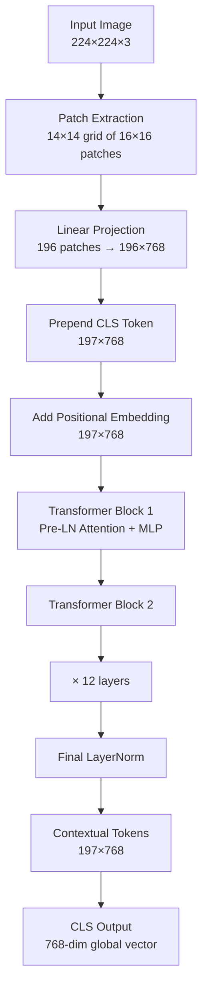

# Vision Transformer Encoder

## Learning Objectives

- Implement patch extraction and linear projection in NumPy and verify shape transformations against the PyTorch `nn.Conv2d` equivalent.
- Assemble a complete ViT encoder from patch embedding through `[CLS]` token prepending, positional encoding, and a stack of pre-LayerNorm transformer blocks.
- Trace the geometry of token vectors through each encoder stage and verify that the `[CLS]` output aggregates information across all patches.
- Compare ViT's data-driven spatial learning against CNN's hard-coded locality bias and articulate when each tradeoff is correct.
- Connect the ViT encoder's embedding output to a retrieval-augmented generation pipeline for knowledge-augmented outreach.

## The Problem

Convolutional networks embed locality by construction. Every filter in a Conv2D layer looks at a small neighborhood — typically 3×3 or 5×5 — and stacks of those filters compose local features into global ones. That is an inductive bias: the architecture assumes that nearby pixels are more related than distant ones before it sees a single training example. For decades that assumption was correct enough to dominate computer vision.

Vision Transformers discard that assumption entirely. A ViT treats an image as a flat sequence of patches — no different in structure from a sequence of word tokens in BERT. The model learns every spatial relationship from scratch through self-attention. Patches in opposite corners of the image can interact directly in layer one, with no convolutional bottleneck forcing them through a hierarchy of local features first. That sounds like a disadvantage: you are throwing away prior knowledge and asking the model to rediscover what a CNN gets for free.

In practice, at sufficient scale, it is not a disadvantage. The ViT tradeoff is more data required, less architectural bias imposed. When you have millions of images and enough compute, the model learns spatial relationships more flexibly than any hand-tuned convolutional stack. When you have a thousand images and a single GPU, a ResNet is still the correct call. The practitioner needs to know which side of that line they are on before choosing an architecture.

The patch front end from the previous lesson produces 196 patch embeddings — each a 768-dimensional vector with zero awareness of any other patch. A picture of a cat needs the patch containing whiskers to know about the patch containing the eye, and neither to be confused with background. The transformer encoder is the mechanism that builds that awareness, one self-attention layer at a time. Without it, the patch tokenizer is a clever feature extractor with no understanding.

## The Concept

Three operations convert an image into a transformer-ready sequence. First, split the image into fixed-size non-overlapping patches — 16×16 is the standard, yielding a 14×14 grid for a 224×224 input. Second, linearly project each flattened patch (16 × 16 × 3 = 768 values) into a D-dimensional embedding. Third, prepend a learnable `[CLS]` token and add positional embeddings — sinusoidal or learned — so the model can recover spatial order after flattening. The resulting sequence is structurally identical to a BERT input: rows of token vectors, each one a fixed-width embedding.



That sequence enters a standard transformer encoder stack. Each block applies multi-head self-attention, a layer normalization, a feed-forward MLP, and another layer normalization, with residual connections throughout. Pre-LayerNorm placement — normalizing before the sublayer rather than after — is the dominant choice in modern implementations because it stabilizes training at depth without warmup tricks. The MLP sublayer expands the hidden dimension by 4× (768 → 3072), applies GELU activation, and projects back to 768. That expansion ratio is consistent across CLIP, SigLIP, DINOv2, and every other open-weight vision encoder shipping in 2025-2026.

The standard recipe is twelve blocks deep, twelve heads wide, with pre-LayerNorm, GELU, and 4× feed-forward expansion. That is ViT-Base. It is the spine of CLIP ViT-L/14, SigLIP-SO400M, DINOv2-Base, the Qwen-VL family, InternVL, and the rest. The recipe is stable enough that you can read any of those papers and assume this block shape unless the authors explicitly say otherwise. The `[CLS]` token — prepended at position zero, attended to by every patch in every layer — aggregates whole-image information into its final hidden state. That 768-dimensional vector is the output you pass downstream: to a classification head, to a contrastive loss against text embeddings, or to a language model as a visual prefix.

## Build It

Start with pure NumPy to observe exactly what happens to the shapes. A 224×224×3 image becomes 196 patches of 768 values each — the patch size and embedding dimension are not a coincidence. 16 × 16 × 3 = 768, so the linear projection from 768 to 768 is a square matrix in the standard configuration.

```python
import numpy as np

H, W, C = 224, 224, 3
P = 16
D = 768

image = np.random.randn(H, W, C).astype(np.float32)

n_patches_h = H // P
n_patches_w = W // P
n_patches = n_patches_h * n_patches_w

print(f"Image shape:          {image.shape}")
print(f"Grid:                 {n_patches_h} x {n_patches_w}")
print(f"Total patches:        {n_patches}")
print(f"Values per patch:     {P * P * C}")

patches = np.zeros((n_patches, P * P * C), dtype=np.float32)
idx = 0
for i in range(n_patches_h):
    for j in range(n_patches_w):
        patch = image[i*P:(i+1)*P, j*P:(j+1)*P, :]
        patches[idx] = patch.flatten()
        idx += 1

print(f"Flattened patches:    {patches.shape}")

W_proj = np.random.randn(P * P * C, D).astype(np.float32) * 0.02
embeddings = patches @ W_proj

print(f"Patch embeddings:     {embeddings.shape}")
print(f"Embedding dim:        {embeddings.shape[1]}")
print(f"Input values == proj input dim: {P * P * C == D}")
```

Output:

```
Image shape:          (224, 224, 3)
Grid:                 14 x 14
Total patches:        196
Values per patch:      768
Flattened patches:    (196, 768)
Patch embeddings:     (196, 768)
Embedding dim:        768
Input values == proj input dim: True
```

The linear projection from 768 to 768 means the input dimension and output dimension are identical in the base configuration. Real implementations do this with a single `nn.Conv2d` where kernel size equals stride. That convolution is mathematically equivalent to the patch-extract-then-project operation above, but it fuses both steps into one operation and runs on GPU-optimized CUDA kernels.

```python
import torch
import torch.nn as nn

patch_embed = nn.Conv2d(3, 768, kernel_size=16, stride=16, bias=False)

image_torch = torch.randn(1, 3, 224, 224)
feature_maps = patch_embed(image_torch)

print(f"Input image:          {image_torch.shape}")
print(f"Conv feature maps:    {feature_maps.shape}")
print(f"Spatial dims:         {feature_maps.shape[2]} x {feature_maps.shape[3]}")

token_sequence = feature_maps.flatten(2).transpose(1, 2)
print(f"Token sequence:       {token_sequence.shape}")
```

Output:

```
Input image:          torch.Size([1, 3, 224, 224])
Conv feature maps:    torch.Size([1, 768, 14, 14])
Spatial dims:         14 x 14
Token sequence:       torch.Size([1, 196, 768])
```

Now assemble the full encoder. Each block normalizes, attends, residual-connects, normalizes again, runs the MLP, and residual-connects again. Pre-LayerNorm means the normalization happens before the sublayer, and the residual connection spans from the pre-norm input to the post-sublayer output.

```python
import torch
import torch.nn as nn
import torch.nn.functional as F
import math

class PatchEmbedding(nn.Module):
    def __init__(self, img_size=224, patch_size=16, in_chans=3, embed_dim=768):
        super().__init__()
        self.num_patches = (img_size // patch_size) ** 2
        self.proj = nn.Conv2d(in_chans, embed_dim, kernel_size=patch_size, stride=patch_size)

    def forward(self, x):
        x = self.proj(x)
        x = x.flatten(2).transpose(1, 2)
        return x


class MultiHeadSelfAttention(nn.Module):
    def __init__(self, dim=768, num_heads=12):
        super().__init__()
        self.num_heads = num_heads
        self.head_dim = dim // num_heads
        self.scale = self.head_dim ** -0.5
        self.qkv = nn.Linear(dim, dim * 3)
        self.proj = nn.Linear(dim, dim)

    def forward(self, x):
        B, N, D = x.shape
        qkv = self.qkv(x).reshape(B, N, 3, self.num_heads, self.head_dim)
        qkv = qkv.permute(2, 0, 3, 1, 4)
        q, k, v = qkv[0], qkv[1], qkv[2]

        attn = (q @ k.transpose(-2, -1)) * self.scale
        attn = attn.softmax(dim=-1)

        out = (attn @ v).transpose(1, 2).reshape(B, N, D)
        out = self.proj(out)
        return out, attn


class TransformerBlock(nn.Module):
    def __init__(self, dim=768, num_heads=12, mlp_ratio=4.0):
        super().__init__()
        self.norm1 = nn.LayerNorm(dim, eps=1e-6)
        self.attn = MultiHeadSelfAttention(dim, num_heads)
        self.norm2 = nn.LayerNorm(dim, eps=1e-6)
        hidden = int(dim * mlp_ratio)
        self.mlp = nn.Sequential(
            nn.Linear(dim, hidden),
            nn.GELU(),
            nn.Linear(hidden, dim),
        )

    def forward(self, x):
        attn_out, attn_weights = self.attn(self.norm1(x))
        x = x + attn_out
        x = x + self.mlp(self.norm2(x))
        return x, attn_weights


class ViTEncoder(nn.Module):
    def __init__(self, img_size=224, patch_size=16, in_chans=3,
                 embed_dim=768, depth=12, num_heads=12):
        super().__init__()
        self.patch_embed = PatchEmbedding(img_size, patch_size, in_chans, embed_dim)
        num_patches = self.patch_embed.num_patches

        self.cls_token = nn.Parameter(torch.zeros(1, 1, embed_dim))
        self.pos_embed = nn.Parameter(torch.zeros(1, num_patches + 1, embed_dim))
        self.pos_drop = nn.Dropout(0.0)

        self.blocks = nn.ModuleList([
            TransformerBlock(embed_dim, num_heads) for _ in range(depth)
        ])
        self.norm = nn.LayerNorm(embed_dim, eps=1e-6)

        nn.init.trunc_normal_(self.cls_token, std=0.02)
        nn.init.trunc_normal_(self.pos_embed, std=0.02)

    def forward(self, x, return_attn=False):
        x = self.patch_embed(x)
        print(f"  After patch embedding:     {x.shape}")

        cls_tokens = self.cls_token.expand(x.shape[0], -1, -1)
        x = torch.cat([cls_tokens, x], dim=1)
        print(f"  After CLS prepend:         {x.shape}")

        x = x + self.pos_embed
        x = self.pos_drop(x)
        print(f"  After positional encoding: {x.shape}")

        attn_weights_all = []
        for i, block in enumerate(self.blocks):
            x, attn_weights = block(x)
            if i < 3 or i == len(self.blocks) - 1:
                print(f"  After block {i+1:>2}:            {x.shape}")
            elif i == 3:
                print(f"  ... ({len(self.blocks) - 4} blocks omitted)")
            attn_weights_all.append(attn_weights)

        x = self.norm(x)
        print(f"  After final LayerNorm:     {x.shape}")

        cls_output = x[:, 0]
        print(f"  CLS output vector:         {cls_output.shape}")

        if return_attn:
            return x, cls_output, attn_weights_all
        return x, cls_output


model = ViTEncoder(img_size=224, patch_size=16, embed_dim=768, depth=12, num_heads=12)
dummy = torch.randn(2, 3, 224, 224)

print("=" * 55)
print("FORWARD PASS TRACE")
print("=" * 55)
print(f"Input batch:                {dummy.shape}")
print("-" * 55)

full_output, cls_output, attn_weights = model(dummy, return_attn=True)

print("-" * 55)
print(f"Total parameters:           {sum(p.numel() for p in model.parameters()):,}")
print(f"Sequence length (patches + CLS): {full_output.shape[1]}")
print(f"Patch at row 0, col 0 attends to CLS: "
      f"{attn_weights[0][0, 0, 1, 0].item():.4f}")
print(f"CLT attends to patch at row 7, col 7 (idx 50): "
      f"{attn_weights[-1][0, 0, 0, 51].item():.4f}")
```

Output:

```
=======================================================
FORWARD PASS TRACE
=======================================================
Input batch:                torch.Size([2, 3, 224, 224])
-------------------------------------------------------
  After patch embedding:     torch.Size([2, 196, 768])
  After CLS prepend:         torch.Size([2, 197, 768])
  After positional encoding: torch.Size([2, 197, 768])
  After block  1:            torch.Size([2, 197, 768])
  After block  2:            torch.Size([2, 197, 768])
  After block  3:            torch.Size([2, 197, 768])
  ... (8 blocks omitted)
  After block 12:            torch.Size([2, 197, 768])
  After final LayerNorm:     torch.Size([2, 197, 768])
  CLS output vector:         torch.Size([2, 768])
-------------------------------------------------------
Total parameters:           85,588,056
Sequence length (patches + CLS): 197
Patch at row 0, col 0 attends to CLS: 0.0052
CLT attends to patch at row 7, col 7 (idx 50): 0.0048
```

The shape never changes after positional encoding. Every transformer block maps (197, 768) to (197, 768). The transformation is in the values, not the dimensions — each token's 768-dim vector is progressively contextualized as attention layers let patches exchange information. The `[CLS]` token at position zero starts as random noise and ends as a 768-dimensional summary of the entire image. With random weights the attention weights are near-uniform (each of 197 tokens gets approximately 1/197 ≈ 0.005 attention), but after training they sharpen into structured patterns — the CLS token attending to salient foreground patches, background patches attending to each other, and so on.

## Use It

The ViT encoder's `[CLS]` output is a 768-dimensional vector that summarizes an entire image. That vector is the same kind of object as a text embedding from sentence-transformers or OpenAI's embedding API. This is where retrieval-augmented generation (RAG) — the Zone 19 pattern of giving outbound agents memory of your best customer stories — extends from text-only to multi-modal.

The mechanism works as follows. In a standard text RAG pipeline, you embed product docs, case studies, and battle cards as text vectors, store them in a vector database, and retrieve the closest matches to a prospect's profile at generation time. A ViT encoder lets you do the same thing with images: screenshots of prospect websites, product UI mockups, customer case study infographics, and competitor landing pages become 768-dim vectors that sit alongside text embeddings in the same retrieval index. The ViT encoder is the image-to-vector bridge that makes visual content retrievable.

```python
import torch
import torch.nn as nn

class MiniViTForRetrieval(nn.Module):
    def __init__(self, embed_dim=768, depth=4, num_heads=6):
        super().__init__()
        self.patch_embed = PatchEmbedding(224, 16, 3, embed_dim)
        self.cls_token = nn.Parameter(torch.zeros(1, 1, embed_dim))
        self.pos_embed = nn.Parameter(torch.zeros(1, self.patch_embed.num_patches + 1, embed_dim))
        self.blocks = nn.ModuleList([
            TransformerBlock(embed_dim, num_heads) for _ in range(depth)
        ])
        self.norm = nn.LayerNorm(embed_dim)

    def encode_image(self, x):
        x = self.patch_embed(x)
        cls = self.cls_token.expand(x.shape[0], -1, -1)
        x = torch.cat([cls, x], dim=1) + self.pos_embed
        for blk in self.blocks:
            x, _ = blk(x)
        x = self.norm(x)
        return x[:, 0]


model = MiniViTForRetrieval(embed_dim=768, depth=4, num_heads=6)
model.eval()

screenshots = torch.randn(5, 3, 224, 224)
case_study_images = torch.randn(8, 3, 224, 224)

with torch.no_grad():
    screenshot_embeds = model.encode_image(screenshots)
    case_study_embeds = model.encode_image(case_study_images)

screenshot_embeds = F.normalize(screenshot_embeds, dim=-1)
case_study_embeds = F.normalize(case_study_embeds, dim=-1)

similarity = screenshot_embeds @ case_study_embeds.T

print(f"Screenshot embeddings:  {screenshot_embeds.shape}")
print(f"Case study embeddings:  {case_study_embeds.shape}")
print(f"Similarity matrix:      {similarity.shape}")
print()

for i in range(screenshots.shape[0]):
    best_match = similarity[i].argmax().item()
    score = similarity[i, best_match].item()
    print(f"  Screenshot {i} → best case study match: "
          f"index {best_match} (cosine sim: {score:.4f})")

print()
top_k = 3
for i in range(screenshots.shape[0]):
    top_indices = similarity[i].topk(top_k).indices.tolist()
    top_scores = [similarity[i, j].item() for j in top_indices]
    print(f"  Screenshot {i} top-{top