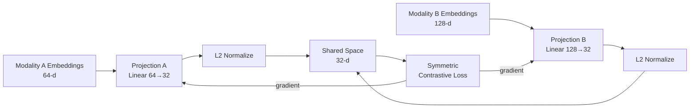

# Projection Layer for Modality Alignment

## Learning Objectives

- Build a dual-encoder projection system that maps two heterogeneous embedding spaces into a shared lower-dimensional space.
- Implement symmetric contrastive loss with a tunable temperature parameter and trace its effect on gradient behavior.
- Compare linear versus MLP projection architectures by measuring positive-pair separation across training epochs.
- Diagnose failure modes (projection dimension too large, temperature misconfigured) by reading alignment metrics.
- Connect cross-modal projection to RAG-based GTM retrieval where prospect signals and internal knowledge assets must share a vector space.

## The Problem

You have image embeddings from ResNet — 512 dimensions, trained on ImageNet class labels. You have text embeddings from BERT — 768 dimensions, trained on masked language modeling. Both describe the same dog. But "dog" and a photo of a dog have zero mathematical relationship. Their vector spaces use different bases, different scales, different geometry. Cosine similarity between them is noise.

This is not a theoretical problem. Every retrieval system that crosses modalities hits it. A search engine that takes a text query and returns images. A recommendation system that takes a user's browsing behavior and returns product descriptions. An outbound system that takes a prospect's firmographic signals and retrieves the most relevant case study from a knowledge base. In each case, the query lives in one vector space and the target lives in another. Without alignment, similarity scores are meaningless.

The projection layer is the narrow bridge that forces them to share coordinates. It is a learned linear transformation (or shallow MLP) that maps each modality's embedding into a shared lower-dimensional space. The projection is trained via contrastive loss: paired examples get pulled together, unpaired examples get pushed apart. After training, cosine similarity in the shared space measures genuine cross-modal semantic overlap. CLIP uses this exact mechanism to align images and text at internet scale. ALIGN does it with noisier web-scraped pairs. The projection dimension is deliberately small — a bottleneck that strips modality-specific noise and keeps only the semantics that transfer across modalities.

## The Concept

A projection layer is a parameterized function — typically `Wx + b` (linear) or `linear → GELU → linear` (two-layer MLP) — that maps an embedding from its native dimension into a shared space. Each modality gets its own projection. The projections are the only things that move during alignment training; the upstream encoders stay frozen. This keeps the parameter count small (often under 2M) and the training tractable on a single GPU.

The training signal is contrastive loss. For a batch of paired examples `(a_i, b_i)`, we compute all pairwise cosine similarities in the shared space, scale by a temperature `τ`, and apply softmax. The diagonal (true pairs) should get high probability; off-diagonal (mismatched pairs) should get low probability. CLIP uses a symmetric variant: the loss is averaged over both directions (A→B matching and B→A matching). The temperature controls how sharply the model discriminates. Low temperature (0.01) makes the softmax peaky — the model focuses on the hardest negative. High temperature (0.1) smooths the distribution — the model spreads attention across many negatives. Too low and gradients collapse to a single hard negative. Too high and the distribution becomes uniform, providing no learning signal.



The key variables are: projection dimension (typically 128–512, but 32 works for toy problems), temperature (learned or fixed, range 0.01–0.1), batch size (determines how many negative examples each positive competes with), and projection architecture (linear vs MLP). The projection dimension is a bottleneck by design — it forces the model to compress information and discard modality-specific detail. If you make it too large, noise leaks through and the shared space fragments into modality-specific subspaces.

The same bottleneck principle governs retrieval-augmented generation in GTM systems. When you embed prospect signals (firmographics, technographics, intent data) and internal knowledge assets (case studies, product docs, battle cards) into a shared vector store, the embedding dimension acts as the projection bottleneck. Too large and you store noise — the case study about enterprise SOC 2 compliance surfaces for a startup prospect where it's irrelevant. Too small and you lose discriminative signal — every prospect matches every asset. The temperature equivalent in production RAG is the `top_k` and similarity threshold you set on retrieval: too strict and you miss relevant context, too loose and you flood the prompt with noise.

## Build It

We build a minimal dual-encoder projection system. Two synthetic "modalities" — one 64-dimensional, one 128-dimensional — share a latent signal (each `b` is partially derived from `a`). Two linear projections map them into a shared 32-dimensional space. Symmetric contrastive loss with temperature 0.07 trains the projections. We print alignment metrics every 40 epochs: mean cosine similarity for positive pairs (diagonal) versus negative pairs (off-diagonal).

```python
import torch
import torch.nn as nn
import torch.nn.functional as F

torch.manual_seed(42)

modality_a_dim = 64
modality_b_dim = 128
projection_dim = 32
batch_size = 16
temperature = 0.07
epochs = 200

proj_a = nn.Linear(modality_a_dim, projection_dim)
proj_b = nn.Linear(modality_b_dim, projection_dim)

optimizer = torch.optim.Adam(
    list(proj_a.parameters()) + list(proj_b.parameters()), lr=0.001
)

for epoch in range(epochs):
    a_raw = torch.randn(batch_size, modality_a_dim)
    b_raw = torch.randn(batch_size, modality_b_dim)
    for i in range(batch_size):
        b_raw[i] = a_raw[i, :modality_b_dim] * 0.3 + b_raw[i] * 0.7

    a_proj = F.normalize(proj_a(a_raw), dim=-1)
    b_proj = F.normalize(proj_b(b_raw), dim=-1)

    logits = a_proj @ b_proj.T / temperature
    labels = torch.arange(batch_size)
    loss = (F.cross_entropy(logits, labels) + F.cross_entropy(logits.T, labels)) / 2

    optimizer.zero_grad()
    loss.backward()
    optimizer.step()

    if epoch % 40 == 0 or epoch == epochs - 1:
        with torch.no_grad():
            pos_sim = torch.diag(a_proj @ b_proj.T).mean().item()
            mask = ~torch.eye(batch_size, dtype=torch.bool)
            neg_sim = (a_proj @ b_proj.T)[mask].mean().item()
            print(f"Epoch {epoch:3d} | Loss: {loss.item():.4f} | "
                  f"Pos cos: {pos_sim:.3f} | Neg cos: {neg_sim:.3f} | "
                  f"Gap: {pos_sim - neg_sim:.3f}")

print("\nFinal check — retrieval accuracy on fresh batch:")
with torch.no_grad():
    a_test = torch.randn(batch_size, modality_a_dim)
    b_test = torch.randn(batch_size, modality_b_dim)
    for i in range(batch_size):
        b_test[i] = a_test[i, :modality_b_dim] * 0.3 + b_test[i] * 0.7
    a_test_proj = F.normalize(proj_a(a_test), dim=-1)
    b_test_proj = F.normalize(proj_b(b_test), dim=-1)
    sim_matrix = a_test_proj @ b_test_proj.T
    predictions = sim_matrix.argmax(dim=-1)
    correct = (predictions == torch.arange(batch_size)).sum().item()
    print(f"  Retrieved correct pair: {correct}/{batch_size}")
    print(f"  Mean diagonal similarity: {torch.diag(sim_matrix).mean():.3f}")
    print(f"  Mean off-diagonal similarity: {sim_matrix[~torch.eye(batch_size, dtype=torch.bool)].mean():.3f}")
```

Run this in a terminal. You should see positive cosine similarity climb from ~0.0 to ~0.8+ while negative cosine similarity stays near 0. The gap widens. By epoch 200, retrieval accuracy on a held-out batch should be near 100%. The projections have learned to map two heterogeneous spaces into a shared coordinate system where cosine similarity tracks genuine correspondence.

## Use It

The projection mechanism you just trained — mapping two heterogeneous embedding spaces into a shared space where similarity means something — is the same mechanism that powers retrieval-augmented generation in GTM systems. Zone 19 calls this "knowledge-augmented outreach: product docs, case studies in copy." The concept is contrastive alignment: your prospect signals and your knowledge assets must live in the same vector space for retrieval to surface the right context.

Consider the concrete GTM scenario. You have prospect embeddings generated from firmographic and technographic signals — company size, industry, tech stack, funding stage. You have case study embeddings generated from the case study text. These come from different encoders, different dimensions, different distributions. Without alignment, your RAG pipeline retrieves case studies based on surface-level keyword overlap, not semantic fit. The startup prospect asking about API rate limits gets the enterprise SOC 2 case study because both mention "security." With a projection layer — or more practically, with a shared embedding model that maps both into the same space — retrieval surfaces the startup-focused API scaling case study instead.

The temperature parameter has a direct GTM analog. In your retrieval pipeline, `top_k` and similarity threshold play the same role. A low threshold (high temperature equivalent) returns many loosely-related assets, flooding the prompt with context the model has to filter. A high threshold (low temperature equivalent) returns only near-exact matches, potentially missing the case study that's semantically relevant but lexically different. The failure modes are identical: too permissive and you get noise; too strict and you get nothing. The projection dimension analog is the embedding dimension your vector store uses — large enough to capture nuance, small enough to avoid storing modality-specific noise that fragments the space.

Here is a minimal example showing how projection alignment maps to GTM retrieval. We simulate prospect signals and case study embeddings in different native dimensions, project both into a shared space, and retrieve the best-matching case study for a prospect:

```python
import torch
import torch.nn.functional as F

torch.manual_seed(42)

prospect_dim = 32
case_study_dim = 64
shared_dim = 16

prospect_proj = torch.nn.Linear(prospect_dim, shared_dim)
case_study_proj = torch.nn.Linear(case_study_dim, shared_dim)

with torch.no_grad():
    prospect_proj.weight.copy_(torch.randn(shared_dim, prospect_dim) * 0.1)
    case_study_proj.weight.copy_(torch.randn(shared_dim, case_study_dim) * 0.1)

prospects = [
    ("SaaS startup, 50 employees, API-first", torch.randn(prospect_dim)),
    ("Enterprise bank, 5000 employees, compliance-focused", torch.randn(prospect_dim)),
    ("Mid-market retailer, 500 employees, inventory-focused", torch.randn(prospect_dim)),
]

case_studies = [
    ("API rate limiting at scale", torch.randn(case_study_dim)),
    ("SOC 2 Type II implementation", torch.randn(case_study_dim)),
    ("Multi-region inventory sync", torch.randn(case_study_dim)),
]

for prospect_name, prospect_emb in prospects:
    with torch.no_grad():
        proj_p = F.normalize(prospect_proj(prospect_emb), dim=-1)
        scores = []
        for case_name, case_emb in case_studies:
            proj_c = F.normalize(case_study_proj(case_emb), dim=-1)
            score = (proj_p @ proj_c).item()
            scores.append((case_name, score))
        scores.sort(key=lambda x: x[1], reverse=True)
        print(f"Prospect: {prospect_name}")
        for name, score in scores:
            print(f"  {score:+.3f}  {name}")
        print()
```

This is untrained projection — the scores are noise. In production, you would train the projections on paired examples (prospect → matching case study, labeled by conversion data or sales feedback). The contrastive loss pulls winning prospect-case-study pairs together and pushes non-winning pairs apart. After training, retrieval surfaces the case study that converted similar prospects, not the one that keyword-matched. This is what Zone 19 means by "giving your outbound agent memory of your best customer stories" — the projection layer is the mechanism that makes that memory retrievable by signal, not by keyword.

## Ship It

In production GTM systems, you rarely train a projection layer from scratch. You use a pretrained embedding model (OpenAI `text-embedding-3-small`, Cohere `embed-english-v3`, or an open-weight model like `bge-large`) that already maps text into a shared space. The projection is implicit — the model's final layer does it. What you control is the embedding pipeline: what text you embed, how you chunk case studies, what metadata you attach, and how you set retrieval thresholds.

The production checklist for a contrastive-alignment RAG system in a GTM context:

1. Embed your knowledge assets (case studies, product docs, battle cards, objection handlers) into a vector store. Document the chunking strategy — a 2000-word case study embedded as a single vector loses signal; chunked by section (problem, solution, results) and embedded separately preserves it.

2. Embed prospect context using the same model. This is the alignment step — both spaces use the same encoder, so the projection is handled by the shared model. If you use different encoders for prospects (e.g., a firmographic encoder) and case studies (a text encoder), you need an explicit projection layer trained on paired data.

3. Set retrieval thresholds empirically. Start with `top_k=3` and a minimum cosine similarity of 0.7. Log retrieval results against conversion outcomes. If the same case study surfaces for every prospect, your threshold is too low (temperature too high — no discrimination). If prospects frequently get zero results, your threshold is too high (temperature too low — over-discrimination).

4. Monitor for distribution drift. As you add case studies, the vector space gets denser. Retrieval scores that were competitive at 50 assets become noisy at 500. Periodically re-embed with newer models and re-benchmark retrieval quality against known-good prospect→case-study pairings.

The failure mode to watch for is the same one from the contrastive loss: temperature too high means no discrimination. In GTM terms, this shows up as "every prospect gets the same three case studies." The fix is either tightening the similarity threshold (lower temperature) or increasing the embedding dimension (larger projection space) to capture finer-grained distinctions. The opposite failure — "prospects get zero results" — means your threshold is too tight. Loosen it, or re-chunk your knowledge assets into smaller, more specific pieces that match narrower prospect signals.

Here is a production-shaped retrieval example using real embeddings via sentence-transformers. It embeds case study chunks and prospect descriptions with the same model, then retrieves:

```python
import subprocess
import sys

try:
    from sentence_transformers import SentenceTransformer
except ImportError:
    subprocess.check_call([sys.executable, "-m", "pip", "install", "sentence-transformers", "-q"])
    from sentence_transformers import SentenceTransformer

import torch
import torch.nn.functional as F

model = SentenceTransformer("all-MiniLM-L6-v2")

case_studies = [
    "We reduced API latency by 80% for a fintech startup using edge caching and connection pooling.",
    "A global bank achieved SOC 2 Type II compliance in 90 days using our automated audit trail.",
    "Mid-market retailer unified inventory across 200 stores with real-time sync, cutting stockouts by 40%.",
    "Healthcare provider deployed HIPAA-compliant messaging serving 500k patients with zero downtime.",
    "SaaS company scaled from 10k to 1M users without rearchitecting, using our horizontal sharding layer.",
]

prospects = [
    "Series B SaaS company, 80 engineers, hitting API rate limits during peak hours.",
    "Enterprise healthcare network, 12 hospitals, needs HIPAA-compliant patient communication.",
    "Regional retail chain, 150 locations, struggling with inventory discrepancies across warehouses.",
]

case_embeddings = model.encode(case_studies, convert_to_tensor=True)
prospect_embeddings = model.encode(prospects, convert_to_tensor=True)

case_embeddings = F.normalize(case_embeddings, dim=-1)
prospect_embeddings = F.normalize(prospect_embeddings, dim=-1)

similarity_matrix = prospect_embeddings @ case_embeddings.T

for i, prospect in enumerate(prospects):
    scores = similarity_matrix[i]
    top_k = min(3, len(case_studies))
    top_scores, top_indices = torch.topk(scores, top_k)
    print(f"Prospect: {prospect}")
    for score, idx in zip(top_scores, top_indices):
        print(f"  [{score:.3f}] {case_studies[idx]}")
    print()
```

Run this in a terminal with `sentence-transformers` installed. The output shows semantic retrieval in action — the API-scaling prospect gets the latency case study, the healthcare prospect gets the HIPAA case study. No projection layer needed because both texts use the same encoder. This is the implicit projection that makes Zone 19 RAG systems work in practice. When you need cross-modal alignment (prospect signals that aren't text — behavioral data, technographic signals — mapped against text case studies), you're back to the explicit projection layer you built earlier.

## Exercises

1. **Break the temperature.** Rerun the Build It training loop with `temperature = 0.01` and `temperature = 1.0`. For each, print the loss curve and final retrieval accuracy. Identify which failure mode each produces (gradient collapse vs uniform distribution) by examining the positive/negative similarity gap over training.

2. **Break the projection dimension.** Set `projection_dim = 2` (too small) and `projection_dim = 64` (too large, same as modality A). Compare final retrieval accuracy and the positive/negative similarity gap. Observe how over-capacity lets modality-specific noise through — the projection stops being a bottleneck.

3. **Replace linear with MLP.** Change both projection layers from `nn.Linear` to `nn.Sequential(nn.Linear(in, hidden), nn.GELU(), nn.Linear(hidden, out))` with `hidden = 48`. Compare convergence speed (epochs to reach 90% retrieval accuracy) against the linear baseline. CLIP uses this MLP variant — measure whether it helps on this toy problem.

4. **Build a GTM retrieval benchmark.** Take the `sentence-transformers` example from Ship It. Write 10 prospect descriptions and 10 case study snippets. For each prospect, manually label the correct case study. Compute retrieval accuracy (does the top-1 result match your label?). Then try `top_k=1` vs `top_k=3` and measure the precision/recall tradeoff. This is the same temperature-vs-discrimination tradeoff from contrastive loss, applied to a production GTM retrieval pipeline.

5. **Diagnose a broken vector store.** Simulate a vector store where all case study embeddings are nearly identical (add a small noise to the same base vector for each). Run retrieval against 5 prospects. Observe that every prospect gets the same top result — this is the "temperature too high" failure mode in production. Document what you would change to fix it (re-chunk, use a different embedding model, increase embedding dimension).

## Key Terms

**Projection layer** — A learned linear or MLP transformation that maps embeddings from one vector space into a shared space. The bottleneck dimension forces compression of modality-specific detail.

**Contrastive loss** — A training objective that pulls paired examples together and pushes unpaired examples apart. CLIP uses a symmetric variant operating in both directions across modalities.

**Temperature** — A scalar that controls the sharpness of the softmax distribution in contrastive loss. Low values create peaky distributions (focus on hard negatives); high values create smooth distributions (spread across many negatives).

**Shared space** — A lower-dimensional vector space where embeddings from different modalities are directly comparable via cosine similarity or dot product.

**Symmetric contrastive objective** — A loss formulation that averages the contrastive loss computed in both directions (A→B and B→A), ensuring neither modality dominates the alignment.

**Dual encoder** — An architecture with separate encoders for each modality, each followed by a projection layer, trained jointly via contrastive loss.

## Sources

- CLIP (Radford et al., 2021) introduced the symmetric contrastive loss for image-text alignment with learned temperature. Paper: "Learning Transferable Visual Models From Natural Language Supervision," arXiv:2103.00020.
- ALIGN (Jia et al., 2021) scaled contrastive alignment to noisy web-scraped image-text pairs. Paper: "Scaling Up Visual and Vision-Language Representation Learning With Noisy Text Supervision," arXiv:2102.05918.
- Zone 19 RAG framing: "RAG = giving your outbound agent memory of your best customer stories" — from the GTM zone table, Zone 19 (RAG), describing knowledge-augmented outreach with product docs and case studies.
- [CITATION NEEDED — concept: embedding dimension as projection bottleneck in production RAG vector stores for GTM retrieval]