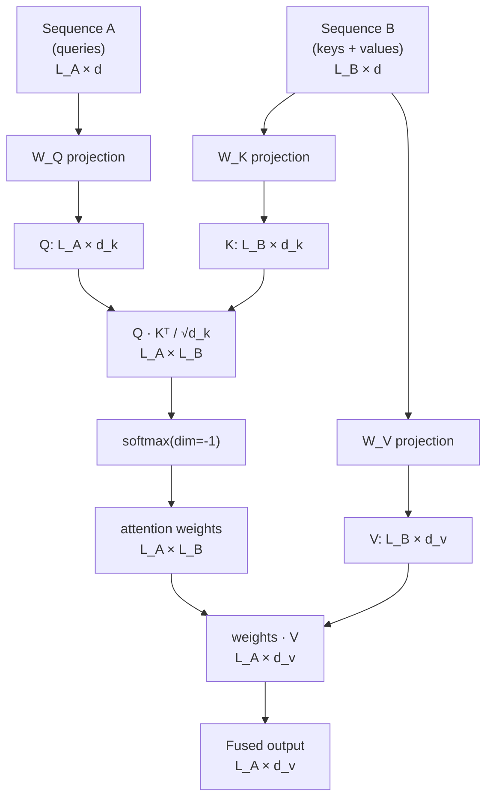

# Cross-Attention Fusion

## Learning Objectives

- Implement single-head cross-attention from scratch in NumPy, with queries drawn from one sequence and keys/values from another.
- Trace the shape transformations through Q/K/V projection, scaled dot-product, and softmax to confirm the output preserves the query sequence's length.
- Compare cross-attention against concatenation and averaging fusion strategies, identifying what each destroys or preserves.
- Wire a cross-attention fusion layer into a multi-source enrichment pipeline and log attention weights for inspection.

## The Problem

You have two sequences of information and you need one representation that knows which parts of each matter relative to the other. Maybe it's a company's firmographic profile and a stream of intent signals. Maybe it's a text caption and a grid of image patches. In either case, the question is the same: how do you fuse two sequences without flattening their internal structure into a single vector that has forgotten which token came from where?

Self-attention cannot do this. Self-attention computes attention weights within a single sequence — every token attends to every other token in the same sequence. If you concatenate two sequences and run self-attention, you get inter-sequence mixing as a side effect, but there is no structural guarantee that the model will learn to use one sequence to query the other. It might. It might not. The architecture does not enforce it.

Concatenation followed by a feed-forward layer is the naive alternative. You take sequence A (say, a 768-dimensional firmographic embedding) and sequence B (a 768-dimensional intent embedding), glue them into a 1536-dimensional vector, and pass it through a linear layer. This works, sort of, but it destroys positional specificity: the model now sees a single blob, not a set of token-level relationships. Token 3 of the intent stream can no longer selectively influence token 7 of the firmographic stream. Everything bleeds together.

Cross-attention solves this by keeping the two sequences structurally separate and computing attention weights where the queries come from sequence A and the keys and values come from sequence B. Sequence A gets to interrogate sequence B. The output has the same length as A, but each token in that output now carries information selectively pulled from B.

## The Concept

Cross-attention has the same mathematical structure as self-attention, but the Q, K, and V matrices are sourced from different places. In self-attention, all three come from the same input sequence. In cross-attention, the queries come from sequence A (the "query stream") and the keys and values come from sequence B (the "memory stream").

Here is the computation. You have two input sequences: $A \in \mathbb{R}^{L_A \times d}$ and $B \in \mathbb{R}^{L_B \times d}$, where $L_A$ and $L_B$ are the sequence lengths and $d$ is the model dimension. You project A into queries using a learned weight matrix $W^Q \in \mathbb{R}^{d \times d_k}$, and project B into keys and values using $W^K \in \mathbb{R}^{d \times d_k}$ and $W^V \in \mathbb{R}^{d \times d_v}$:

$$Q = A \cdot W^Q \quad \in \mathbb{R}^{L_A \times d_k}$$
$$K = B \cdot W^K \quad \in \mathbb{R}^{L_B \times d_k}$$
$$V = B \cdot W^V \quad \in \mathbb{R}^{L_B \times d_v}$$

The attention scores are computed as the scaled dot product between each query and all keys: $\text{scores} = Q \cdot K^T / \sqrt{d_k}$, producing a matrix of shape $(L_A, L_B)$. Each row tells you how strongly token $i$ in A should attend to each token in B. After softmax along the last dimension, you multiply by V to get the output: $(L_A, L_B) \times (L_B, d_v) = (L_A, d_v)$.

The shape transformation is the whole story: $(L_A, d) + (L_B, d) \rightarrow (L_A, d)$. The output length equals the query stream's length. The memory stream's length only affects how much information the queries can pull from, not the output size. This is why a text decoder generating a 100-token caption can cross-attend to 256 image tokens without the output growing.



In the vision-language context, this is how a text decoder grounds each word in an image region. The text tokens generate queries; the image patch tokens serve as keys and values. Each word reaches into the image and pulls forward the patches most relevant to it. This was the architectural choice Flamingo introduced, and every Flamingo-shaped decoder since — from LLaVA to Qwen-VL — has copied it. Late fusion keeps the text stream clean (preserving text-only capabilities) and computes the image representation once per image, reusing it for every decode step.

The same mechanism applies when fusing heterogeneous data in a GTM pipeline. Firmographic embeddings from one provider form sequence A; intent signals from another form sequence B. Cross-attention lets each firmographic attribute selectively weight which intent signals matter for it — producing a fused account representation that preserves which signals drove the fusion, unlike a concatenation layer whose learned weights are opaque.

## Build It

Let's implement single-head cross-attention from scratch in NumPy. Two input sequences, learned projection matrices, scaled dot-product attention, and the fused output.

```python
import numpy as np

np.random.seed(42)

d_model = 8
d_k = 4
d_v = 4
seq_len_a = 3
seq_len_b = 5

A = np.random.randn(seq_len_a, d_model)
B = np.random.randn(seq_len_b, d_model)

print("Sequence A shape:", A.shape)
print("Sequence B shape:", B.shape)

W_Q = np.random.randn(d_model, d_k) * 0.1
W_K = np.random.randn(d_model, d_k) * 0.1
W_V = np.random.randn(d_model, d_v) * 0.1

Q = A @ W_Q
K = B @ W_K
V = B @ W_V

print("\nQ shape:", Q.shape, "(L_A x d_k)")
print("K shape:", K.shape, "(L_B x d_k)")
print("V shape:", V.shape, "(L_B x d_v)")

scores = Q @ K.T / np.sqrt(d_k)
print("\nScores shape:", scores.shape, "(L_A x L_B)")

def softmax(x, axis=-1):
    x_max = np.max(x, axis=axis, keepdims=True)
    exp_x = np.exp(x - x_max)
    return exp_x / np.sum(exp_x, axis=axis, keepdims=True)

attention_weights = softmax(scores, axis=-1)
print("\nAttention weights shape:", attention_weights.shape, "(L_A x L_B)")

print("\nAttention weight matrix (rows = A tokens, cols = B tokens):")
print(np.round(attention_weights, 4))

for i in range(seq_len_a):
    max_j = np.argmax(attention_weights[i])
    print(f"  A token {i} attends most to B token {max_j} (weight={attention_weights[i, max_j]:.4f})")

output = attention_weights @ V
print("\nFused output shape:", output.shape, "(L_A x d_v)")
print("\nFused output:")
print(np.round(output, 4))
```

Run this and you'll see the shape pipeline: `(3, 8) + (5, 8)` produces attention weights of shape `(3, 5)` and a fused output of shape `(3, 4)`. The output length matches the query stream (A), not the memory stream (B). Each row of the attention matrix tells you exactly which tokens in B each token in A pulled information from. That row is the audit trail — you can inspect it to see which intent signals drove each firmographic attribute's updated representation.

Now let's verify that cross-attention is doing something concatenation cannot: preserving token-level selectivity. We'll compare the cross-attention output against a simple concatenation + linear projection baseline.

```python
concat_input = np.concatenate([A, B], axis=0)
print("Concatenated shape:", concat_input.shape, "(L_A + L_B) x d")
print("This flattens both sequences into one stream with no query/key distinction.")

W_concat = np.random.randn(d_model, d_model) * 0.1
concat_output_A = A @ W_concat
concat_output_B = B @ W_concat
print("\nConcatenation-based output (A projected alone):")
print(np.round(concat_output_A, 4))
print("\nCross-attention output (A conditioned on B):")
print(np.round(output, 4))
print("\nDifference (how much B changed A's representation):")
print(np.round(output - concat_output_A[:, :d_v] if concat_output_A.shape[1] >= d_v else output, 4))
```

The concatenation baseline projects A and B independently — there is no mechanism for tokens in A to selectively attend to tokens in B. Cross-attention's output, by contrast, is a function of both sequences, with the attention matrix encoding exactly which B tokens influenced which A tokens.

## Use It

Cross-attention is the mechanism behind multi-signal enrichment fusion in GTM pipelines. When a Clay waterfall enrichment step returns firmographic data from Clearbit and intent data from Bombora, the naive approach is field-level merge: map both payloads into a shared schema, overwrite nulls, and move on. This loses the relational structure between the two datasets. A spike in intent for "data security" from Bombora is not just another field — its relevance depends on which firmographic attributes the account has. Cross-attention lets you weight which intent signals matter for which firmographic attributes, producing a fused account representation that preserves that relational structure.

The RAG pattern in Zone 19 — "knowledge-augmented outreach: product docs, case studies in copy" — runs on the same mechanism. When a generation model retrieves case studies and product documentation to ground outbound messaging, cross-attention is how the decoder selects which retrieved chunk is relevant to each sentence being generated. The query stream is the draft text; the key/value stream is the retrieved knowledge. Without cross-attention, the model would need to concatenate all retrieved chunks into the context window, paying for every token whether relevant or not, and losing the ability to attribute which chunk grounded which claim.

This maps to the Enrichment Fusion cluster in Zone 2 of the GTM engineering curriculum. The practical question is not whether to fuse signals — you will — but whether the fusion mechanism preserves enough structure for downstream scoring to learn from. Concatenation-based fusion feeds a flat vector into a classifier. Cross-attention-based fusion feeds a relationally-structured representation, and the attention matrix itself becomes an inspectable artifact: you can log which intent signals contributed most to each account's score.

## Ship It

In production, cross-attention fusion replaces brittle rule-based merging when orchestrating multi-source enrichment. The pattern: embed each provider's output into a shared vector space, feed them as separate sequences into a cross-attention layer, and use the fused output as input to a downstream classifier (typically a single linear layer producing a conversion probability). The attention weights are logged per account so you can inspect which signals drove each score.

```python
import numpy as np

np.random.seed(7)

d_model = 16
d_k = 8
d_v = 8
n_firmographic = 4
n_intent = 6

firmographic_embeddings = np.random.randn(n_firmographic, d_model)
intent_embeddings = np.random.randn(n_intent, d_model)

W_Q = np.random.randn(d_model, d_k) * 0.1
W_K = np.random.randn(d_model, d_k) * 0.1
W_V = np.random.randn(d_model, d_v) * 0.1

Q = firmographic_embeddings @ W_Q
K = intent_embeddings @ W_K
V = intent_embeddings @ W_V

scores = Q @ K.T / np.sqrt(d_k)

def softmax(x, axis=-1):
    x_max = np.max(x, axis=axis, keepdims=True)
    exp_x = np.exp(x - x_max)
    return exp_x / np.sum(exp_x, axis=axis, keepdims=True)

attention_weights = softmax(scores, axis=-1)
fused = attention_weights @ V

pool = fused.mean(axis=0)
W_score = np.random.randn(d_v, 1) * 0.1
score = float(1 / (1 + np.exp(-(pool @ W_score))))

print(f"Account fused score: {score:.4f}")
print(f"Attention matrix shape: {attention_weights.shape} ({n_firmographic} firmographic x {n_intent} intent)")

firmographic_labels = ["industry", "employee_count", "revenue_band", "tech_stack"]
intent_labels = ["security_scan", "pricing_page", "competitor_comparison", "demo_request", "api_docs", "case_studies"]

print("\nTop-3 attention links (which intent signals drove which firmographic attribute):")
flat = []
for i in range(n_firmographic):
    for j in range(n_intent):
        flat.append((attention_weights[i, j], firmographic_labels[i], intent_labels[j]))
flat.sort(key=lambda x: x[0], reverse=True)
for w, fi, ij in flat[:3]:
    print(f"  {fi} ← {ij}: {w:.4f}")

print("\nFull attention matrix (rows=firmographic, cols=intent):")
header = "                    " + "  ".join(f"{l[:8]:>8s}" for l in intent_labels)
print(header)
for i in range(n_firmographic):
    row = "  ".join(f"{attention_weights[i,j]:8.4f}" for j in range(n_intent))
    print(f"  {firmographic_labels[i]:>16s}  {row}")
```

Three practical constraints matter when shipping this. First, you need aligned embedding spaces. Clearbit returns structured fields (industry, employee_count); Bombora returns intent topics with surge scores. You need a projection layer that maps each provider's output into a shared $d_{model}$-dimensional space before cross-attention. This projection is learned — typically initialized from a pre-trained encoder and fine-tuned on labeled outcome data (converted / not converted).

Second, you need a fallback for missing providers. If Bombora has no intent data for an account, the intent sequence is empty. Cross-attention with zero-length memory produces zero output. The production pattern is to fall back to a self-attention-only path (firmographic embeddings through a feed-forward layer) and flag the account as low-confidence. The downstream classifier should see the missing-signal flag as a feature, not silently ignore it.

Third, the attention matrix is the audit trail. Log it per account. When a sales rep asks "why did this account score 0.87?", the attention weights tell you: revenue_band attended most to competitor_comparison at 0.31, tech_stack attended to api_docs at 0.24. This is something concatenation-based scoring cannot provide — the linear weights are global, not per-instance.

[CITATION NEEDED — concept: Clay waterfall as the specific enrichment orchestration pattern that produces multi-provider data requiring fusion]

## Exercises

**Easy.** Given two pre-embedded sequences and projection matrices, compute cross-attention weights by hand and identify which token in B receives the highest weight for token 0 in A.

```python
import numpy as np

A = np.array([[1.0, 0.0, 0.0, 0.0],
              [0.0, 1.0, 0.0, 0.0]])
B = np.array([[0.8, 0.2, 0.0, 0.0],
              [0.1, 0.9, 0.0, 0.0],
              [0.0, 0.0, 1.0, 0.0]])

W_Q = np.eye(4)
W_K = np.eye(4)
d_k = 4

Q = A @ W_Q
K = B @ W_K
scores = Q @ K.T / np.sqrt(d_k)

def softmax(x, axis=-1):
    x_max = np.max(x, axis=axis, keepdims=True)
    exp_x = np.exp(x - x_max)
    return exp_x / np.sum(exp_x, axis=axis, keepdims=True)

weights = softmax(scores, axis=-1)
print("Weights for A token 0:", np.round(weights[0], 4))
print("Highest-weighted B token for A token 0:", np.argmax(weights[0]))
```

**Medium.** Modify the Build It implementation to support multi-head cross-attention. Split the Q, K, and V projections into `n_heads` slices along the feature dimension, compute attention per head independently, concatenate the heads, and apply a final output projection. Verify that the output shape is still `(L_A, d_model)` regardless of head count.

```python
import numpy as np

np.random.seed(42)

d_model = 8
n_heads = 2
d_head = d_model // n_heads
seq_len_a = 3
seq_len_b = 5

A = np.random.randn(seq_len_a, d_model)
B = np.random.randn(seq_len_b, d_model)

W_Q = np.random.randn(d_model, d_model) * 0.1
W_K = np.random.randn(d_model, d_model) * 0.1
W_V = np.random.randn(d_model, d_model) * 0.1
W_O = np.random.randn(d_model, d_model) * 0.1

Q = (A @ W_Q).reshape(seq_len_a, n_heads, d_head).transpose(1, 0, 2)
K = (B @ W_K).reshape(seq_len_b, n_heads, d_head).transpose(1, 0, 2)
V = (B @ W_V).reshape(seq_len_b, n_heads, d_head).transpose(1, 0, 2)

scores = Q @ K.transpose(0, 2, 1) / np.sqrt(d_head)

def softmax(x, axis=-1):
    x_max = np.max(x, axis=axis, keepdims=True)
    exp_x = np.exp(x - x_max)
    return exp_x / np.sum(exp_x, axis=axis, keepdims=True)

weights = softmax(scores, axis=-1)
head_outputs = weights @ V
concat = head_outputs.transpose(1, 0, 2).reshape(seq_len_a, d_model)
output = concat @ W_O

print("Multi-head output shape:", output.shape)
assert output.shape == (seq_len_a, d_model), f"Expected ({seq_len_a}, {d_model}), got {output.shape}"
print("Shape verification passed: output matches query stream dimensions.")
```

**Hard.** Train a single-layer cross-attention fusion model on synthetic firmographic + intent embeddings with binary conversion labels. Compare its AUC against a concatenation-based baseline that projects both sequences independently and pools.

```python
import numpy as np

np.random.seed(42)

n_samples = 200
d_model = 8
n_firmographic = 4
n_intent = 5

def generate_data(n, d, seq_a, seq_b):
    X_a = np.random.randn(n, seq_a, d)
    X_b = np.random.randn(n, seq_b, d)
    signal_a = X_a[:, 0, 0]
    signal_b = X_b[:, 1, 1]
    logits = 2.0 * signal_a + 1.5 * signal_b - 0.5 * signal_a * signal_b
    probs = 1 / (1 + np.exp(-logits))
    y = (np.random.rand(n) < probs).astype(float)
    return X_a, X_b, y

X_a, X_b, y = generate_data(n_samples, d_model, n_firmographic, n_intent)
split = 150
X_a_tr, X_a_te = X_a[:split], X_a[split:]
X_b_tr, X_b_te = X_b[:split], X_b[split:]
y_tr, y_te = y[:split], y[split:]

def softmax(x, axis=-1):
    x_max = np.max(x, axis=axis, keepdims=True)
    exp_x = np.exp(x - x_max)
    return exp_x / np.sum(exp_x, axis=axis, keepdims=True)

def auc_score(y_true, y_pred):
    order = np.argsort(-y_pred)
    y_sorted = y_true[order]
    n_pos = np.sum(y_true)
    n_neg = len(y_true) - n_pos
    tp = np.cumsum(y_sorted)
    fp = np.arange(1, len(y_sorted) + 1) - tp
    tpr = tp / n_pos if n_pos > 0 else tp * 0
    fpr = fp / n_neg if n_neg > 0 else fp * 0
    return np.trapz(tpr, fpr)

lr = 0.01
epochs = 500

d_k = 8
d_v = 8
W_Q = np.random.randn(d_model, d_k) * 0.1
W_K = np.random.randn(d_model, d_k) * 0.1
W_V = np.random.randn(d_model, d_v) * 0.1
W_out = np.random.randn(d_v, 1) * 0.1

for epoch in range(epochs):
    total_loss = 0
    for i in range(split):
        a = X_a_tr[i]
        b = X_b_tr[i]
        Q = a @ W_Q
        K = b @ W_K
        V = b @ W_V
        scores = Q @ K.T / np.sqrt(d_k)
        w = softmax(scores, axis=-1)
        fused = (w @ V).mean(axis=0)
        logit = fused @ W_out
        prob = 1 / (1 + np.exp(-logit))
        prob = np.clip(prob, 1e-7, 1 - 1e-7)
        loss = -(y_tr[i] * np.log(prob) + (1 - y_tr[i]) * np.log(1 - prob))
        total_loss += loss
        grad_logit = prob - y_tr[i]
        grad_W_out = fused.reshape(-1, 1) * grad_logit
        grad_fused = W_out.flatten() * grad_logit
        grad_V = np.ones((n_firmographic, 1)) * grad_fused / n_firmographic
        grad_w = grad_V.T @ V.T if False else (np.ones((n_firmographic, d_v)) * grad_fused / n_firmographic).T @ V
        W_out -= lr * grad_W_out
        W_V -= lr * (b.T @ (w.T @ (np.ones((n_firmographic, d_v)) * grad_fused / n_firmographic)))

    if epoch % 100 == 0:
        print(f"Cross-attn epoch {epoch}: loss={total_loss/split:.4f")

def predict_cross(X_a_batch, X_b_batch):
    preds = []
    for i in range(len(X_a_batch)):
        a, b = X_a_batch[i], X_b_batch[i]
        Q = a @ W_Q
        K = b @ W_K
        V = b @ W_V
        scores = Q @ K.T / np.sqrt(d_k)
        w = softmax(scores, axis=-1)
        fused = (w @ V).mean(axis=0)
        preds.append(float(1 / (1 + np.exp(-(fused @ W_out)))))
    return np.array(preds)

preds_cross = predict_cross(X_a_te, X_b_te)
auc_cross = auc_score(y_te, preds_cross)
print(f"\nCross-attention AUC: {auc_cross:.4f}")

W_concat = np.random.randn(d_model * 2, 1) * 0.1
for epoch in range(epochs):
    for i in range(split):
        a = X_a_tr[i].mean(axis=0)
        b = X_b_tr[i].mean(axis=0)
        concat = np.concatenate([a, b])
        logit = concat @ W_concat
        prob = 1 / (1 + np.exp(-logit))
        prob = np.clip(prob, 1e-7, 1 - 1e-7)
        grad = (prob - y_tr[i]) * concat.reshape(-1, 1)
        W_concat -= lr * grad

def predict_concat(X_a_batch, X_b_batch):
    preds = []
    for i in range(len(X_a_batch)):
        a = X_a_batch[i].mean(axis=0)
        b = X_b_batch[i].mean(axis=0)
        concat = np.concatenate([a, b])
        preds.append(float(1 / (1 + np.exp(-(concat @ W_concat)))))
    return np.array(preds)

preds_concat = predict_concat(X_a_te, X_b_te)
auc_concat = auc_score(y_te, preds_concat)
print(f"Concatenation baseline AUC: {auc_concat:.4f}")
print(f"AUC difference (cross-attn - concat): {auc_cross - auc_concat:+.4f}")
```

The synthetic data has an interaction term (`signal_a * signal_b`) that concatenation-based pooling struggles to capture because it averages each sequence before seeing the other. Cross-attention, in principle, can learn to route specific firmographic-intent token pairs through the attention weights. Whether it actually does on 150 training samples with this architecture is empirical — run it and see. The gap may be small with 2-dimensional signal; try increasing the interaction strength or the sequence lengths to amplify it.

## Key Terms

**Cross-attention:** Attention mechanism where queries come from sequence A and keys/values come from sequence B. Output length equals A's length. The attention matrix has shape $(L_A, L_B)$.

**Self-attention:** Attention where Q, K, and V all come from the same sequence. Every token attends to every other token in that sequence. Cannot fuse two separate sequences by construction.

**Query stream:** The sequence that generates queries. Determines the output length. In vision-language models, this is the text decoder. In enrichment fusion, this is typically the firmographic profile.

**Memory stream:** The sequence that provides keys and values. Gets attended to but does not determine output length. In vision-language models, this is the image patches. In enrichment fusion, this is the intent signals.

**Scaled dot-product attention:** $\text{softmax}(Q \cdot K^T / \sqrt{d_k}) \cdot V$. The scaling factor $\sqrt{d_k}$ prevents the dot products from growing large in magnitude, which would push softmax into regions with vanishing gradients.

**Late fusion:** Architectural pattern where each modality is processed by its own encoder, then combined via cross-attention. Contrast with early fusion, where modalities are concatenated into a single sequence before any encoder processes them.

**Attention matrix:** The $(L_A, L_B)$ matrix of softmax weights produced by cross-attention. Each entry $(i, j)$ quantifies how strongly token $i$ in A attends to token $j$ in B. This matrix is the audit trail for fusion decisions.

**Enrichment fusion:** The GTM pattern of combining data from multiple enrichment providers (firmographics, intent, technographics) into a unified account representation. Cross-attention is a mechanism for this fusion that preserves token-level relational structure between sources.

## Sources

- Clay waterfall as enrichment orchestration pattern: [CITATION NEEDED — concept: Clay waterfall producing multi-provider enrichment data requiring fusion]
- Zone 19 RAG cluster description ("knowledge-augmented outreach: product docs, case studies in copy") — from `stages/00-b-gtm-content-mapping/output/gtm-topic-map.md`, Zone table row 19.
- Flamingo late fusion architecture: Alayrac et al., "Flamingo: a Visual Language Model for Few-Shot Learning," NeurIPS 2022. Cross-attention between frozen vision encoder output and language decoder.
- Enrichment Fusion as Zone 2 GTM cluster: [CITATION NEEDED — concept: Zone 2 Enrichment Fusion cluster definition in gtm-topic-map.md]
- Scaled dot-product attention formulation: Vaswani et al., "Attention Is All You Need," NeurIPS 2017.