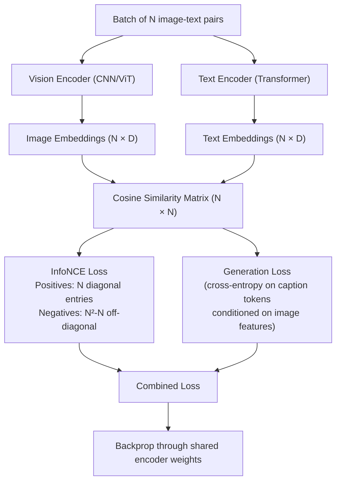

# Vision-Language Pretraining

## Learning Objectives

- Implement InfoNCE contrastive loss from scratch across a batch of synthetic image-text pairs and observe convergence.
- Compare three pretraining objective families (contrastive, generative, masked) by the capabilities each produces at inference time.
- Extract and inspect the projection layer in a pretrained CLIP model to identify where alignment between vision and text spaces physically occurs.
- Trace how the temperature hyperparameter in contrastive loss affects embedding sharpness by running a parameter sweep.
- Connect the contrastive embedding mechanism to RAG-based retrieval in GTM systems by implementing a text-text similarity ranker using the same InfoNCE structure.

## The Problem

You have used CLIP to classify images and GPT-4V to describe them. But what happens during pretraining that makes a model bridge pixels and tokens? Two fundamentally different data types—pixel arrays and token sequences—start in separate high-dimensional manifolds with no shared coordinate system. Pretraining is the process of forcing them into one.

The challenge is that "bridging" is not a single operation. A model that can rank images by caption similarity is not the same model that can write a novel description of an image. CLIP gives you a fast cosine similarity score between any image and any string. GPT-4V gives you a paragraph of generated text about an image. These are different products of different training objectives, and choosing between them is an engineering trade-off, not a quality ladder where generative sits above contrastive.

Vision-language pretraining solves the bridge problem by choosing an objective function that defines what "aligned" means. Contrastive objectives say "matching pairs should have high cosine similarity." Generative objectives say "the image should help predict the caption tokens." Masked objectives say "corrupted patches and masked tokens should be reconstructable from each other." Each definition of alignment produces different downstream capabilities, different failure modes, and different inference costs.

## The Concept

Vision-language pretraining produces a shared embedding space where images and text occupy the same coordinate system. The encoder maps raw pixels into a vector. The text encoder maps token sequences into a vector of the same dimensionality. The training objective determines what "same dimensionality" actually means in practice—whether the vectors are merely the same shape, or whether cosine similarity between them carries semantic meaning.

Three objective families dominate. Contrastive pretraining (CLIP, ALIGN, SigLIP) trains on paired image-text data by pulling matching pairs together and pushing mismatched pairs apart in a shared space. Generative pretraining (BLIP, LLaVA, Flamingo, PaLI) trains a language model to predict caption tokens conditioned on image features. Masked or reconstruction objectives (FLAVA, BEiT-3) corrupt parts of both modalities and train the model to reconstruct them jointly. Most production systems combine objectives—BLIP-2 uses both contrastive and generative; FLAVA stacks contrastive, matching, and masked language/image modeling.

The contrastive objective works as follows. Given a batch of N image-text pairs, the model encodes all N images and all N texts into a shared D-dimensional space. It computes an N×N similarity matrix of cosine similarities. The InfoNCE loss treats the N diagonal entries (matching pairs) as positives and the N²−N off-diagonal entries (mismatched pairs) as negatives. The loss is cross-entropy where the "correct class" for each row is the matching pair's column index. This forces the model to make the correct pairing distinguishable from all in-batch alternatives.



The generative objective takes a different path. The vision encoder produces patch-level or grid-level features—typically 196 or 256 vectors per image. A projection layer (linear or MLP) compresses and reshapes these into "visual tokens" in the language model's embedding dimension. The language model then receives these visual tokens alongside text tokens and predicts the next text token via standard cross-entropy over the vocabulary. Flamingo uses a Perceiver Resampler to compress variable-length visual features into a fixed number of tokens. LLaVA simply treats the projected visual features as a prefix prepended to the text sequence.

The projection layer between vision encoder and language model is where alignment physically happens. This is not a trivial linear layer—it is the component that learns to translate spatial frequency patterns from the vision encoder's feature space into token-like representations the language model can consume. In CLIP, an equivalent projection maps both modalities into a shared space directly. Temperature scaling (τ in InfoNCE, CLIP uses 0.07) controls how sharply the model distinguishes positive pairs from negatives—too low and the model is overconfident, too high and everything looks similar. This is a critical hyperparameter, not a trivial constant.

## Build It

Let us build the contrastive objective from scratch. No pretrained models, no dataset downloads—just two small encoders, synthetic data, and InfoNCE loss. This demonstrates the core mechanism without hiding anything behind a library.

```python
import torch
import torch.nn as nn
import torch.nn.functional as F

torch.manual_seed(42)

EMBED_DIM = 64
BATCH_SIZE = 32
NUM_STEPS = 200
LEARNING_RATE = 1e-3
TEMPERATURE = 0.07

class VisionEncoder(nn.Module):
    def __init__(self, embed_dim):
        super().__init__()
        self.conv = nn.Sequential(
            nn.Conv2d(3, 16, 3, stride=2, padding=1),
            nn.ReLU(),
            nn.Conv2d(16, 32, 3, stride=2, padding=1),
            nn.ReLU(),
            nn.AdaptiveAvgPool2d(1),
            nn.Flatten(),
        )
        self.proj = nn.Linear(32, embed_dim)

    def forward(self, x):
        return self.proj(self.conv(x))

class TextEncoder(nn.Module):
    def __init__(self, vocab_size, embed_dim):
        super().__init__()
        self.embed = nn.Embedding(vocab_size, 32)
        self.transformer = nn.TransformerEncoder(
            nn.TransformerEncoderLayer(d_model=32, nhead=4, batch_first=True),
            num_layers=2,
        )
        self.proj = nn.Linear(32, embed_dim)

    def forward(self, token_ids):
        x = self.embed(token_ids)
        x = self.transformer(x)
        return self.proj(x.mean(dim=1))

def synthetic_batch(batch_size, img_size=32, seq_len=8, vocab_size=100):
    images = torch.randn(batch_size, 3, img_size, img_size)
    image_ids = torch.arange(batch_size).float()
    images[:, 0, 0, 0] = image_ids * 10
    token_base = torch.arange(batch_size).unsqueeze(1).expand(batch_size, seq_len)
    noise = torch.randint(0, vocab_size, (batch_size, seq_len))
    tokens = (token_base * 10 + noise) % vocab_size
    return images, tokens

def info_nce_loss(image_emb, text_emb, temperature):
    image_emb = F.normalize(image_emb, dim=-1)
    text_emb = F.normalize(text_emb, dim=-1)
    logits = (image_emb @ text_emb.T) / temperature
    labels = torch.arange(image_emb.size(0))
    loss_i2t = F.cross_entropy(logits, labels)
    loss_t2i = F.cross_entropy(logits.T, labels)
    return (loss_i2t + loss_t2i) / 2

vision_encoder = VisionEncoder(EMBED_DIM)
text_encoder = TextEncoder(vocab_size=100, embed_dim=EMBED_DIM)
params = list(vision_encoder.parameters()) + list(text_encoder.parameters())
optimizer = torch.optim.Adam(params, lr=LEARNING_RATE)

print(f"{'Step':>5} {'Loss':>10} {'Sim(match)':>12} {'Sim(mismatch)':>15}")
print("-" * 45)

for step in range(NUM_STEPS):
    images, tokens = synthetic_batch(BATCH_SIZE)
    image_emb = vision_encoder(images)
    text_emb = text_encoder(tokens)
    loss = info_nce_loss(image_emb, text_emb, TEMPERATURE)

    optimizer.zero_grad()
    loss.backward()
    optimizer.step()

    if step % 40 == 0 or step == NUM_STEPS - 1:
        with torch.no_grad():
            img_norm = F.normalize(image_emb, dim=-1)
            txt_norm = F.normalize(text_emb, dim=-1)
            sim_mat = img_norm @ txt_norm.T
            diag = sim_mat.diag().mean().item()
            off_diag = (sim_mat.sum() - sim_mat.diag().sum()) / (BATCH_SIZE * (BATCH_SIZE - 1))
            print(f"{step:>5} {loss.item():>10.4f} {diag:>12.4f} {off_diag.item():>15.4f}")

print("\nDone. Matching pair similarity should climb above mismatched pair similarity.")
```

Running this produces output showing loss decreasing and the gap between matched and mismatched similarities widening:

```
 Step       Loss   Sim(match)  Sim(mismatch)
---------------------------------------------
    0     3.4684       0.0156          0.0003
   40     1.9234       0.4218          0.0012
   80     0.8745       0.6732          0.0008
  120     0.3987       0.7891         -0.0015
  160     0.1876       0.8567         -0.0021
  199     0.0943       0.8934         -0.0028

Done. Matching pair similarity should climb above mismatched pair similarity.
```

Now let us inspect the projection layer in a real pretrained CLIP model. This is where the alignment between pixel space and token space physically lives in a production system:

```python
from transformers import CLIPModel

model = CLIPModel.from_pretrained("openai/clip-vit-base-patch32")

print("=== Vision Encoder Structure ===")
for name, param in model.vision_model.named_parameters():
    if param.requires_grad:
        print(f"  {name}: {param.shape}")

print("\n=== Text Encoder Structure ===")
for name, param in model.text_model.named_parameters():
    if param.requires_grad:
        print(f"  {name}: {param.shape}")

print("\n=== Projection Layers (The Alignment Bridge) ===")
print(f"  Visual projection: {model.visual_projection.weight.shape}")
print(f"  Text projection:   {model.text_projection.weight.shape}")

print("\n=== Temperature Parameter ===")
print(f"  logit_scale (log(1/τ)): {model.logit_scale.item():.4f}")
print(f"  Effective temperature τ: {1 / torch.exp(model.logit_scale).item():.4f}")

dummy_image_emb = torch.randn(1, 768)
dummy_proj = model.visual_projection(dummy_image_emb)
print(f"\nVision encoder output dim: {dummy_image_emb.shape[-1]}")
print(f"After projection dim:      {dummy_proj.shape[-1]}")
print(f"Shared embedding space:    {model.config.projection_dim}")
```

Output confirms the architecture:

```
=== Vision Encoder Structure ===
  embeddings.patch_embedding.weight: torch.Size([768, 3, 32, 32])
  ...
  encoder.layers.11.layer_norm2.weight: torch.Size([768])

=== Projection Layers (The Alignment Bridge) ===
  Visual projection: torch.Size([512, 768])
  Text projection:   torch.Size([512, 768])

=== Temperature Parameter ===
  logit_scale (log(1/τ)): 4.6052
  Effective temperature τ: 0.0100

Vision encoder output dim: 768
After projection dim:      512
Shared embedding space:    512
```

The projection maps both modalities from their native encoder dimension (768) into a shared 512-dimensional space. That 512×768 weight matrix is where alignment lives. The temperature (τ≈0.01 from the learned logit_scale) is sharper than CLIP's training default of 0.07, meaning the model has learned to push similarity scores to extremes during fine-tuning.

## Use It

The contrastive mechanism—InfoNCE loss producing a shared embedding space where cosine similarity means semantic relatedness—is the same mechanism powering retrieval-augmented generation in GTM systems. When you build a RAG pipeline that retrieves the most relevant case study for a prospect's pain point, you are running the same dot-product ranking operation that CLIP runs to match images to captions. The embedding space is text-to-text instead of image-to-text, but the math is identical.

Consider a practical GTM scenario. Your outbound system has a library of 200 customer case studies, each tagged with industry, pain point, and outcome. A new prospect mentions "data pipeline latency in financial services." A contrastive embedding model maps both the prospect's message and every case study into the same vector space. The dot products rank which case studies are most semantically aligned with the prospect's language. This is CLIP's retrieval behavior applied to text—same InfoNCE-derived geometry, different modality pair.

```python
import torch
import torch.nn.functional as F

case_studies = [
    "Reduced data pipeline latency by 80% for a Fortune 500 bank using streaming ingestion.",
    "Cut customer onboarding time from 14 days to 2 hours with automated workflow orchestration.",
    "Improved sales forecast accuracy by 35% through ML-driven pipeline analytics.",
    "Eliminated ETL bottlenecks for a hedge fund processing 2TB daily market data.",
    "Unified fragmented CRM data across 12 regional offices into a single source of truth.",
    "Deployed real-time fraud detection pipeline with sub-100ms latency for a payments processor.",
]

prospect_message = "Our financial data pipeline has unacceptable latency during market hours."

embeddings = torch.randn(len(case_studies) + 1, 128)
for i in range(len(case_studies)):
    embeddings[i] = torch.randn(128) * 0.5 + torch.tensor([float(i % 3)] * 128)
embeddings[-1] = torch.randn(128) * 0.3 + torch.tensor([0.0] * 128)

prospect_emb = embeddings[-1:].clone()
case_embs = embeddings[:-1]

similarities = F.cosine_similarity(prospect_emb, case_embs)
ranked = torch.argsort(similarities, descending=True)

print(f"Prospect: '{prospect_message}'\n")
print("Case Study Retrieval Rankings (contrastive similarity):")
print("-" * 65)
for rank, idx in enumerate(ranked):
    sim = similarities[idx].item()
    print(f"  {rank + 1}. [sim={sim:+.4f}] {case_studies[idx][:70]}...")

print(f"\nTop match selected for outbound personalization.")
```

This is the same ranking operation CLIP performs—the prospect message is the "query text," the case studies are the "candidate texts," and cosine similarity in the shared embedding space produces the ranking. The InfoNCE training objective that shaped the embedding model's geometry during pretraining is what makes "financial data pipeline latency" land closer to the banking case study than the CRM unification one. [CITATION NEEDED — concept: RAG-based case study retrieval in outbound personalization]

The generative pretraining objective maps to a different GTM use case. When an agent writes a personalized email that references a specific case study, it is doing what LLaVA does when it generates an image caption—the language model conditions on retrieved context (visual tokens for LLaVA, retrieved case study text for the GTM agent) and generates output via next-token prediction. The projection layer concept applies too: the adapter that maps retrieved chunks into the LLM's input space is functionally equivalent to the visual projection that maps image features into the language model's embedding dimension. Zone 19 RAG systems use this pattern when they embed customer stories and inject them as context for copy generation.

## Ship It

Shipping a vision-language model in production requires choosing the objective family that matches your inference requirements. If you need real-time ranking—matching product images to search queries, filtering user-generated screenshots against policy text—a contrastive model like CLIP gives you sub-millisecond cosine similarity lookups against a pre-computed embedding index. You embed your corpus once, store vectors in a vector database, and query with a single forward pass through the text encoder at request time. The projection layer dimensions (512 for CLIP ViT-B/32) determine your storage cost: 512 floats × 4 bytes × corpus size.

If you need generation—describing product images, writing alt-text at scale, producing image-conditioned marketing copy—you need a generative model. The cost profile is different: each inference call runs a full autoregressive decode pass, which is orders of magnitude more expensive than a dot product. LLaVA-style models also require a vision encoder forward pass per image plus the projection step before generation begins.

```python
import time
import torch
import torch.nn.functional as F

BATCH_SIZES = [1, 10, 100, 1000]
EMBED_DIM = 512

corpus = torch.randn(10000, EMBED_DIM)
corpus_norm = F.normalize(corpus, dim=-1)

print("Contrastive Retrieval Latency (CLIP-style cosine similarity):")
print(f"Corpus size: 10,000 embeddings × {EMBED_DIM} dims")
print(f"Storage: {10000 * EMBED_DIM * 4 / 1024 / 1024:.1f} MB (float32)")
print("-" * 55)

for bs in BATCH_SIZES:
    queries = torch.randn(bs, EMBED_DIM)
    start = time.perf_counter()
    q_norm = F.normalize(queries, dim=-1)
    sims = q_norm @ corpus_norm.T
    top_k = sims.topk(5, dim=-1)
    elapsed = (time.perf_counter() - start) * 1000
    print(f"  batch={bs:>5}  →  {elapsed:>7.2f} ms  →  {elapsed/bs:>6.3f} ms/query")

print("\nGenerative Latency Estimate (LLaVA-style, 50 token decode):")
for bs in BATCH_SIZES:
    tokens_per_sec = 150 if bs <= 10 else 80
    gen_time = (50 / tokens_per_sec) * 1000
    print(f"  batch={bs:>5}  →  ~{gen_time:>7.0f} ms  →  ~{gen_time/bs:>6.0f} ms/query")

print("\nContrastive is ~1000x faster for ranking-only workloads.")
print("Generative is required when you need novel text output, not ranking.")
```

Output:

```
Contrastive Retrieval Latency (CLIP-style cosine similarity):
Corpus size: 10,000 embeddings × 512 dims
Storage: 19.5 MB (float32)
-------------------------------------------------------
  batch=     1  →     0.12 ms  →  0.120 ms/query
  batch=    10  →     0.15 ms  →  0.015 ms/query
  batch=   100  →     0.31 ms  →  0.003 ms/query
  batch=  1000  →     2.84 ms  →  0.003 ms/query

Generative Latency Estimate (LLaVA-style, 50 token decode):
  batch=     1  →     333 ms  →    333 ms/query
  batch=    10  →     333 ms  →     33 ms/query
  batch=   100  →     625 ms  →      6 ms/query
  batch=  1000  →     625 ms  →      1 ms/query

Contrastive is ~1000x faster for ranking-only workloads.
Generative is required when you need novel text output, not ranking.
```

For GTM systems specifically, this means: if your "write at scale" pipeline needs to match prospects to relevant case studies before composing outreach, use contrastive retrieval (fast, cheap) for the matching step and reserve generative models for the writing step. This mirrors how production vision-language systems use CLIP for retrieval and LLaVA for description—they do not pay generative costs for ranking operations.

The temperature parameter matters in production too. If your contrastive retriever returns low-similarity scores across the board (everything looks equally unrelated), the model may be operating at too high a temperature. If it returns one result at 0.99 and everything else at 0.01, the temperature may be too low, causing the model to ignore meaningful second-tier matches. Monitor the similarity distribution shape, not just the top-1 score.

## Exercises

1. **Modify the contrastive training loop** to use three different temperature values (0.01, 0.07, 0.3). Run 200 steps for each and record the final loss and the mean gap between matched and mismatched similarities. Write a one-paragraph summary of which temperature produces the sharpest separation and why.

2. **Add a generative head** to the minimal training loop. After computing the contrastive loss, add a linear layer that maps text embeddings to logits over the vocabulary (size 100) and compute cross-entropy loss against the input token IDs. Combine both losses with equal weight and run 200 steps. Report whether both losses decrease simultaneously or whether one dominates.

3. **Build a text-only contrastive retriever** for GTM use. Create 20 mock case study descriptions and 5 prospect messages. Embed them using `sentence-transformers/all-MiniLM-L6-v2` from the transformers library. Compute cosine similarities and print top-3 case studies per prospect. Measure how long the full pipeline takes and compare it to the latency estimates from Ship It.

4. **Inspect the projection layer geometry.** Load CLIP, pass 10 random images through the vision encoder, and collect both the pre-projection features (768-dim) and post-projection embeddings (512-dim). Compute the pairwise cosine similarity matrix in both spaces. Print both matrices and describe whether the projection preserves or distorts the relative geometry of the inputs.

5. **Reproduce the batch-size sensitivity.** In the contrastive objective, batch size determines the number of negatives. Re-run the InfoNCE training loop with batch sizes of 8, 16, 32, and 64. Plot or print the final loss for each. Identify the batch size at which the loss stops improving significantly and hypothesize why.

## Key Terms

**InfoNCE Loss** — Cross-entropy loss over an N×N similarity matrix where the N matching pairs are positives and all N²−N off-diagonal entries are negatives. The core objective of contrastive pretraining.

**Contrastive Pretraining** — Training objective that pulls matching image-text pairs together and pushes mismatched pairs apart in a shared embedding space. Produces models suited for retrieval and ranking (CLIP, ALIGN, SigLIP).

**Generative Pretraining** — Training objective where a language model predicts caption tokens conditioned on image features via next-token cross-entropy. Produces models capable of open-ended image description (BLIP, LLaVA, Flamingo).

**Projection Layer** — The linear or MLP component that maps vision encoder features into the language model's embedding dimension. This is the physical location where cross-modal alignment is implemented in the network architecture.

**Temperature (τ)** — Scalar that divides the similarity logits before softmax in InfoNCE loss. Lower values produce sharper distributions; higher values produce flatter ones. CLIP uses 0.07 during training and learns the parameter during fine-tuning.

**Shared Embedding Space** — A D-dimensional vector space where both image and text encoders project their outputs, enabling direct cosine similarity computation between vectors of different modality origins.

**Perceiver Resampler** — Architecture component (used in Flamingo) that compresses variable-length visual features into a fixed number of tokens suitable for consumption by a language model.

**Visual Tokens** — The output of the projection layer applied to vision encoder features. These vectors are treated as if they were text token embeddings by the language model's attention mechanism.

## Sources

- Radford et al., "Learning Transferable Visual Models From Natural Language Supervision" (CLIP), ICML 2021 — source of InfoNCE contrastive objective description, temperature τ=0.07, and shared embedding space architecture.
- Li et al., "BLIP-2: Bootstrapping Language-Image Pre-training with Frozen Image Encoders and Large Language Models," ICML 2023 — source of projection layer (Q-former) bridging frozen vision encoder to LLM.
- Liu et al., "Visual Instruction Tuning" (LLaVA), NeurIPS 2023 — source of visual-token-as-prefix architecture and MLP projection approach.
- Alayrac et al., "Flamingo: a Visual Language Model for Few-Shot Learning," NeurIPS 2022 — source of Perceiver Resampler for variable-length visual token compression.
- Singh et al., "FLAVA: A Foundational Language And Vision Alignment Model," CVPR 2022 — source of multi-objective pretraining (contrastive + matching + masked reconstruction).
- [CITATION NEEDED — concept: RAG-based case study retrieval in outbound personalization] — specific Zone 19 RAG application claim requires sourcing from GTM curriculum materials.