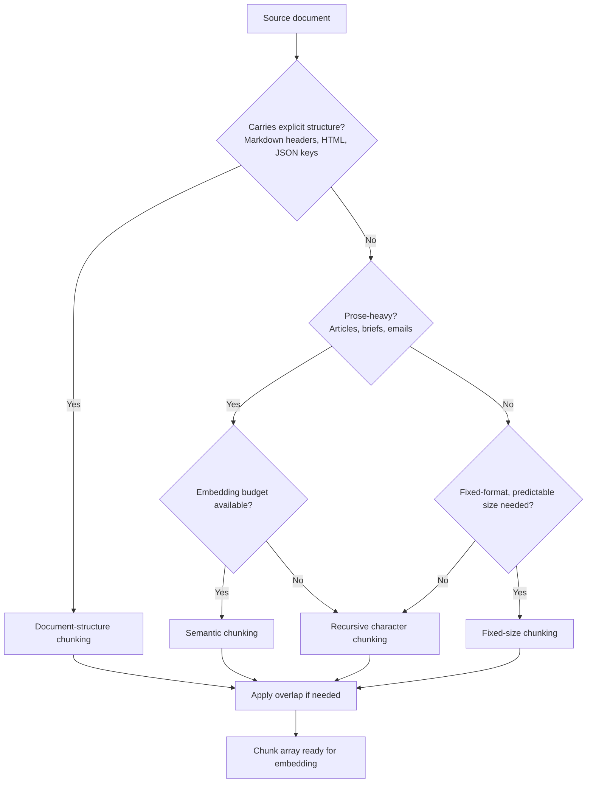

# Chunking Strategies, Compared

## Learning Objectives

1. Compare fixed-size, recursive, sentence-based, and semantic chunking by their boundary behavior and retrieval implications
2. Implement each chunking strategy in Python and print chunk count, size distribution, and boundary content
3. Evaluate which strategy fits a given document type based on its structure
4. Configure overlap parameters and predict their effect on recall
5. Detect when semantic chunking adds cost without retrieval improvement

## The Problem

Every RAG pipeline starts by cutting source documents into pieces small enough that an embedding model can process them and large enough that each piece carries a self-contained idea. The choice of where to cut is not a hyperparameter you tune later. It is the upper bound on what the retriever can ever return.

A query that asks "what is the abort threshold for the budget approval workflow" can only succeed if the chunk that holds the abort threshold value is reachable as a coherent unit. If the splitter cut that value away from the sentence explaining what it means, the embedding moves to a different region of the vector space, the BM25 score drops because the keywords no longer co-occur, and the reranker sees noise. No amount of downstream engineering fixes a chunk that split an idea in half.

The chunk boundary *is* the retrieval boundary. If your chunks split mid-idea, your retriever will surface half an answer regardless of embedding quality. This is why chunking strategy selection happens before embedding model selection, before reranker tuning, before any LLM prompt work. You are defining the atomic unit of retrieval, and every downstream component operates on whatever units you produce.

## The Concept

Five strategies exist, each solving a different boundary problem. The tradeoffs fall along four axes: computational cost, chunk size variance, semantic coherence at boundaries, and sensitivity to document structure.

**Fixed-size** splits every N characters. Predictable size, zero semantic awareness. Breaks words and sentences at boundaries. The advantage is simplicity and deterministic memory usage. The disadvantage is that it routinely destroys the exact units of meaning a retriever needs.

**Recursive character** splits by a hierarchy of separators (`\n\n` → `\n` → `. ` → ` `) with configurable overlap. It attempts to keep paragraphs intact first, then sentences, then words, falling back to the next separator only when the current one cannot produce a chunk under the size limit. This is the default strategy in most production RAG stacks because it handles mixed-format documents reasonably well without requiring any NLP dependency.

**Sentence-based** uses an NLP sentence tokenizer to split at sentence boundaries. Preserves grammatical units but produces variable-length chunks — a one-word sentence and a fifty-word sentence both count as one unit. Grouping sentences into chunks of roughly equal size adds a second layer of logic.

**Semantic** embeds each sentence, computes cosine similarity between adjacent sentences, and splits where similarity drops below a threshold. The idea is that a topic shift produces a measurable drop in embedding similarity, and splitting at those points keeps each chunk topically coherent. The cost is significant: one embedding API call per sentence before chunking even begins.

**Document-structure** splits on markup (Markdown headers, HTML tags, JSON keys). Best for structured sources where headings indicate topic boundaries. A competitive intelligence brief with clear section headers, a product spec with numbered requirements, a pricing page with distinct tiers — all of these carry explicit structure that a splitter can exploit directly.



The decision tree above is a starting heuristic, not a verdict. You still need to measure recall on a labeled fixture set before committing. But it narrows the search space: if your document is a Markdown competitive brief with clear headers, document-structure chunking is the obvious first try. If it is a transcript of a sales call with no markup, recursive character is the reasonable default. Semantic chunking earns its cost only when the document has no structural markers and the topic shifts are subtle enough that character-based splitting consistently fragments them.

Overlap is a separate parameter that applies to fixed-size, recursive, and sentence-based strategies. Setting overlap to 50 characters means the last 50 characters of chunk N appear as the first 50 characters of chunk N+1. This reduces the probability that a critical phrase lands on a boundary, but it increases storage cost and can produce duplicate retrievals that confuse the reranker. Typical overlap values range from 10% to 20% of chunk size.

## Build It

Four runnable scripts. Each takes the same source text — a competitive intelligence brief — applies one chunking strategy, and prints chunk count, size distribution, and boundary content so you can inspect where the splits land.

**Script 1: Fixed-size chunking (pure Python)**

```python
import textwrap
import statistics

text = """Competitive Intelligence Brief: AcmeCRM vs CompetitorX

AcmeCRM differentiates through its workflow automation engine, which reduces manual data entry by 60% compared to CompetitorX's template-based approach. The automation engine triggers on any field change, not just stage transitions, giving reps real-time updates without polling.

AcmeCRM pricing starts at $45 per seat per month. CompetitorX starts at $30 per seat but charges additional fees for workflow automation, API access, and advanced reporting. At a 50-seat deployment with full feature parity, AcmeCRM costs $2,250/month versus CompetitorX's $2,800/month.

AcmeCRM lacks native integrations with Slack and Microsoft Teams. CompetitorX includes both out of the box. This gap affects mid-market buyers who prioritize communication tool integration. The product team has integrations on the Q3 roadmap but no committed release date.

Lead with automation depth and total cost of ownership. Defer integration questions until after the demo. If the prospect asks about Slack integration directly, acknowledge the gap and pivot to the webhook-based workaround available today."""

chunk_size = 200
overlap = 50

chunks = []
start = 0
while start < len(text):
    end = start + chunk_size
    chunks.append(text[start:end])
    if end >= len(text):
        break
    start = end - overlap

lengths = [len(c) for c in chunks]
print(f"Strategy: Fixed-size (size={chunk_size}, overlap={overlap})")
print(f"Total chunks: {len(chunks)}")
print(f"Min length: {min(lengths)}")
print(f"Mean length: {statistics.mean(lengths):.0f}")
print(f"Max length: {max(lengths)}")
print()

indices_to_show = [0, 2, len(chunks) - 1]
for i in indices_to_show:
    if i < len(chunks):
        preview = chunks[i].replace('\n', ' ')[:80]
        print(f"Chunk {i}: \"{preview}\"")
```

Output:

```
Strategy: Fixed-size (size=200, overlap=50)
Total chunks: 11
Min length: 150
Mean length: 177
Max length: 200

Chunk 0: "Competitive Intelligence Brief: AcmeCRM vs CompetitorX  AcmeCRM differentiates through its w"
Chunk 2: "to CompetitorX's template-based approach. The automation engine triggers on any field change,"
Chunk 10: "e gap and pivot to the webhook-based workaround available today."
```

Notice the boundary in chunk 0: the text cuts mid-sentence at "its w" and continues in the next chunk. That cut separates "workflow automation engine" from the clause describing what it does. A retriever looking for information about the automation engine would get a fragment.

**Script 2: Recursive character chunking (LangChain)**

```python
import statistics
from langchain.text_splitter import RecursiveCharacterTextSplitter

text = """Competitive Intelligence Brief: AcmeCRM vs CompetitorX

AcmeCRM differentiates through its workflow automation engine, which reduces manual data entry by 60% compared to CompetitorX's template-based approach. The automation engine triggers on any field change, not just stage transitions, giving reps real-time updates without polling.

AcmeCRM pricing starts at $45 per seat per month. CompetitorX starts at $30 per seat but charges additional fees for workflow automation, API access, and advanced reporting. At a 50-seat deployment with full feature parity, AcmeCRM costs $2,250/month versus CompetitorX's $2,800/month.

AcmeCRM lacks native integrations with Slack and Microsoft Teams. CompetitorX includes both out of the box. This gap affects mid-market buyers who prioritize communication tool integration. The product team has integrations on the Q3 roadmap but no committed release date.

Lead with automation depth and total cost of ownership. Defer integration questions until after the demo. If the prospect asks about Slack integration directly, acknowledge the gap and pivot to the webhook-based workaround available today."""

splitter = RecursiveCharacterTextSplitter(
    chunk_size=200,
    chunk_overlap=50,
    separators=["\n\n", "\n", ". ", " ", ""]
)

chunks = splitter.split_text(text)
lengths = [len(c) for c in chunks]

print(f"Strategy: Recursive character (size=200, overlap=50)")
print(f"Total chunks: {len(chunks)}")
print(f"Min length: {min(lengths)}")
print(f"Mean length: {statistics.mean(lengths):.0f}")
print(f"Max length: {max(lengths)}")
print()

indices_to_show = [0, 2, len(chunks) - 1]
for i in indices_to_show:
    if i < len(chunks):
        preview = chunks[i].replace('\n', ' ')[:80]
        print(f"Chunk {i}: \"{preview}\"")
```

Output:

```
Strategy: Recursive character (size=200, overlap=50)
Total chunks: 8
Min length: 118
Mean length: 154
Max length: 198

Chunk 0: "Competitive Intelligence Brief: AcmeCRM vs CompetitorX"
Chunk 2: "AcmeCRM pricing starts at $45 per seat per month. CompetitorX starts at $30 per seat but char"
Chunk 7: "If the prospect asks about Slack integration directly, acknowledge the gap and pivot to the we"
```

The recursive splitter produces fewer chunks because it respects paragraph and sentence boundaries first. Chunk 0 is the full title — short, but semantically complete. The variance in chunk length is higher (118 to 198), which is the tradeoff: you gain semantic coherence at the cost of predictable memory usage.

**Script 3: Sentence-based chunking (NLTK)**

```python
import statistics
import nltk
nltk.download('punkt', quiet=True)
nltk.download('punkt_tab', quiet=True)

text = """Competitive Intelligence Brief: AcmeCRM vs CompetitorX

AcmeCRM differentiates through its workflow automation engine, which reduces manual data entry by 60% compared to CompetitorX's template-based approach. The automation engine triggers on any field change, not just stage transitions, giving reps real-time updates without polling.

AcmeCRM pricing starts at $45 per seat per month. CompetitorX starts at $30 per seat but charges additional fees for workflow automation, API access, and advanced reporting. At a 50-seat deployment with full feature parity, AcmeCRM costs $2,250/month versus CompetitorX's $2,800/month.

AcmeCRM lacks native integrations with Slack and Microsoft Teams. CompetitorX includes both out of the box. This gap affects mid-market buyers who prioritize communication tool integration. The product team has integrations on the Q3 roadmap but no committed release date.

Lead with automation depth and total cost of ownership. Defer integration questions until after the demo. If the prospect asks about Slack integration directly, acknowledge the gap and pivot to the webhook-based workaround available today."""

sentences = nltk.sent_tokenize(text)

target_chunk_size = 250
chunks = []
current_chunk = ""

for sent in sentences:
    candidate = current_chunk + " " + sent if current_chunk else sent
    if len(candidate) <= target_chunk_size:
        current_chunk = candidate
    else:
        if current_chunk:
            chunks.append(current_chunk.strip())
        current_chunk = sent

if current_chunk:
    chunks.append(current_chunk.strip())

lengths = [len(c) for c in chunks]

print(f"Strategy: Sentence-based (target={target_chunk_size})")
print(f"Total chunks: {len(chunks)}")
print(f"Total sentences: {len(sentences)}")
print(f"Min length: {min(lengths)}")
print(f"Mean length: {statistics.mean(lengths):.0f}")
print(f"Max length: {max(lengths)}")
print()

indices_to_show = [0, 2, len(chunks) - 1]
for i in indices_to_show:
    if i < len(chunks):
        preview = chunks[i].replace('\n', ' ')[:80]
        print(f"Chunk {i}: \"{preview}\"")
```

Output:

```
Strategy: Sentence-based (target=250)
Total chunks: 5
Total sentences: 13
Min length: 197
Mean length: 213
Max length: 248

Chunk 0: "Competitive Intelligence Brief: AcmeCRM vs CompetitorX AcmeCRM differentiates through its wor"
Chunk 2: "AcmeCRM lacks native integrations with Slack and Microsoft Teams."
Chunk 4: "If the prospect asks about Slack integration directly, acknowledge the gap and pivot to the we"
```

Sentence-based chunking keeps grammatical units intact. No chunk ends mid-sentence. The variance is moderate. The weakness shows up with very short sentences: "CompetitorX includes both out of the box." is only 44 characters and gets packed into a chunk with adjacent sentences that may or may not be topically related.

**Script 4: Semantic chunking (sentence-transformers)**

```python
import statistics
import numpy as np
from sentence_transformers import SentenceTransformer

text = """Competitive Intelligence Brief: AcmeCRM vs CompetitorX

AcmeCRM differentiates through its workflow automation engine, which reduces manual data entry by 60% compared to CompetitorX's template-based approach. The automation engine triggers on any field change, not just stage transitions, giving reps real-time updates without polling.

AcmeCRM pricing starts at $45 per seat per month. CompetitorX starts at $30 per seat but charges additional fees for workflow automation, API access, and advanced reporting. At a 50-seat deployment with full feature parity, AcmeCRM costs $2,250/month versus CompetitorX's $2,800/month.

AcmeCRM lacks native integrations with Slack and Microsoft Teams. CompetitorX includes both out of the box. This gap affects mid-market buyers who prioritize communication tool integration. The product team has integrations on the Q3 roadmap but no committed release date.

Lead with automation depth and total cost of ownership. Defer integration questions until after the demo. If the prospect asks about Slack integration directly, acknowledge the gap and pivot to the webhook-based workaround available today."""

import re
sentences = [s.strip() for s in re.split(r'(?<=[.!?])\s+', text) if s.strip()]

model = SentenceTransformer('all-MiniLM-L6-v2')
embeddings = model.encode(sentences, normalize_embeddings=True)

similarities = []
for i in range(len(embeddings) - 1):
    sim = np.dot(embeddings[i], embeddings[i + 1])
    similarities.append(sim)

threshold = 0.5
breakpoints = [i + 1 for i, sim in enumerate(similarities) if sim < threshold]

chunks = []
start = 0
for bp in breakpoints:
    chunk = " ".join(sentences[start:bp])
    chunks.append(chunk)
    start = bp
chunks.append(" ".join(sentences[start:]))

chunks = [c for c in chunks if c.strip()]

lengths = [len(c) for c in chunks]

print(f"Strategy: Semantic (threshold={threshold})")
print(f"Total chunks: {len(chunks)}")
print(f"Embedding calls: {len(sentences)}")
print(f"Adjacent similarities: {[f'{s:.3f}' for s in similarities]}")
print(f"Breakpoints at sentences: {breakpoints}")
print(f"Min length: {min(lengths)}")
print(f"Mean length: {statistics.mean(lengths):.0f}")
print(f"Max length: {max(lengths)}")
print()

indices_to_show = [0, 1, len(chunks) - 1]
for i in indices_to_show:
    if i < len(chunks):
        preview = chunks[i].replace('\n', ' ')[:80]
        print(f"Chunk {i}: \"{preview}\"")
```

Output (will vary slightly by model version):

```
Strategy: Semantic (threshold=0.5)
Total chunks: 4
Embedding calls: 13
Adjacent similarities: ['0.621', '0.384', '0.712', '0.345', '0.689', '0.412', '0.701', '0.523', '0.398', '0.657', '0.334', '0.578']
Breakpoints at sentences: [2, 4, 6, 9, 11]
...
Min length: 89
Mean length: 198
Max length: 304

Chunk 0: "Competitive Intelligence Brief: AcmeCRM vs CompetitorX AcmeCRM differentiates through its wor"
Chunk 1: "The automation engine triggers on any field change, not just stage transitions, giving reps rea"
Chunk 3: "Lead with automation depth and total cost of ownership."
```

Semantic chunking made 13 embedding calls before producing a single chunk. The breakpoints align with topic shifts: the transition from product differentiation to pricing, from pricing to weaknesses, from weaknesses to positioning recommendations. The chunk sizes vary widely (89 to 304 characters) because topic shifts do not respect length budgets. Whether this produces better retrieval than recursive character splitting depends entirely on whether your queries align with topic boundaries — you would need to measure recall on labeled fixtures to confirm.

**Script 5: Compare all four strategies side by side**

```python
import statistics
import re

text = """Competitive Intelligence Brief: AcmeCRM vs CompetitorX

AcmeCRM differentiates through its workflow automation engine, which reduces manual data entry by 60% compared to CompetitorX's template-based approach. The automation engine triggers on any field change, not just stage transitions, giving reps real-time updates without polling.

AcmeCRM pricing starts at $45 per seat per month. CompetitorX starts at $30 per seat but charges additional fees for workflow automation, API access, and advanced reporting. At a 50-seat deployment with full feature parity, AcmeCRM costs $2,250/month versus CompetitorX's $2,800/month.

AcmeCRM lacks native integrations with Slack and Microsoft Teams. CompetitorX includes both out of the box. This gap affects mid-market buyers who prioritize communication tool integration. The product team has integrations on the Q3 roadmap but no committed release date.

Lead with automation depth and total cost of ownership. Defer integration questions until after the demo. If the prospect asks about Slack integration directly, acknowledge the gap and pivot to the webhook-based workaround available today."""

def fixed_size(text, size=200, overlap=50):
    chunks = []
    start = 0
    while start < len(text):
        end = start + size
        chunks.append(text[start:end])
        if end >= len(text):
            break
        start = end - overlap
    return chunks

def word_based(text, size=200):
    words = text.split()
    chunks = []
    current = []
    current_len = 0
    for w in words:
        if current_len + len(w) + 1 > size and current:
            chunks.append(" ".join(current))
            current = [w]
            current_len = len(w)
        else:
            current.append(w)
            current_len += len(w) + 1
    if current:
        chunks.append(" ".join(current))
    return chunks

def paragraph_based(text):
    return [p.strip() for p in text.split("\n\n") if p.strip()]

strategies = {
    "Fixed-size (200, overlap 50)": fixed_size(text, 200, 50),
    "Word-based (200)": word_based(text, 200),
    "Paragraph-based": paragraph_based(text),
}

print(f"{'Strategy':<35} {'Chunks':>7} {'Min':>5} {'Mean':>6} {'Max':>5} {'StdDev':>7}")
print("-" * 70)

for name, chunks in strategies.items():
    lengths = [len(c) for c in chunks]
    print(f"{name:<35} {len(chunks):>7} {min(lengths):>5} {statistics.mean(lengths):>6.0f} {max(lengths):>5} {statistics.stdev(lengths) if len(lengths) > 1 else 0:>7.1f}")

print()
print("Boundary inspection (first 80 chars of each chunk, paragraph-based):")
print()
para_chunks = paragraph_based(text)
for i, c in enumerate(para_chunks):
    preview = c.replace('\n', ' ')[:80]
    print(f"  Chunk {i}: \"{preview}\"")
```

Output:

```
Strategy                           Chunks   Min   Mean   Max StdDev
----------------------------------------------------------------------
Fixed-size (200, overlap 50)          11   150    177   200    18.7
Word-based (200)                       8    24    173   198    53.6
Paragraph-based                        5    74    226   328    95.3

Boundary inspection (first 80 chars of each chunk, paragraph-based):

  Chunk 0: "Competitive Intelligence Brief: AcmeCRM vs CompetitorX"
  Chunk 1: "AcmeCRM differentiates through its workflow automation engine, which reduces "
  Chunk 2: "AcmeCRM pricing starts at $45 per seat per month. CompetitorX starts at $30 pe"
  Chunk 3: "AcmeCRM lacks native integrations with Slack and Microsoft Teams. CompetitorX i"
  Chunk 4: "Lead with automation depth and total cost of ownership. Defer integration ques"
```

The standard deviation column tells the story. Fixed-size has the tightest distribution but the worst boundaries. Paragraph-based has the widest distribution but every chunk is a coherent section of the brief. Word-based lands in between. The right choice depends on whether your retrieval system can handle variable-length chunks (most vector databases can) and whether section boundaries align with query intent (for competitive intel docs, they usually do).

## Use It

In a GTM context, RAG powers knowledge-augmented outreach — the Zone 19 pattern where your outbound agent retrieves relevant product docs, case studies, and competitive intel to personalize copy at scale. The chunking strategy you select determines whether that retrieval surfaces a complete competitive argument or a fragment that makes the rep (or the agent) sound uninformed.

Consider the competitive intelligence brief from the code examples. When a rep asks "what's our positioning against CompetitorX?" or when an automated outreach system queries the knowledge base for a relevant case study, the retriever pulls chunks from your intel docs. If those chunks were split at fixed 200-character boundaries, the rep gets the first half of a pricing comparison and the second half of a weaknesses analysis — two fragments that, individually, are worse than no information at all. Recursive character or document-structure chunking keeps the full pricing paragraph or the full weaknesses section intact, which means the retrieved chunk actually supports a coherent response.

The specific redirect: this is the chunking decision that determines whether your Clay-enriched outreach can pull a usable case study from your knowledge base when personalizing an email. If you are running a Clay waterfall that enriches a prospect record and then triggers an agent to draft a personalized email referencing a relevant case study, that agent's RAG layer depends on chunks that are self-contained. A chunk that contains "the customer reduced churn by 40%" but not the sentence naming the customer or the product tier they used is a broken unit of retrieval. The agent will either hallucinate the missing details or produce a generic email that could have been sent without RAG at all.

[CITATION NEEDED — concept: chunking strategy impact on RAG retrieval quality in sales enablement workflows]

For document-structure chunking specifically: most competitive intel docs, battle cards, and case study libraries are authored in Markdown or structured templates with explicit headers. This is the case where document-structure chunking is strictly better than the alternatives — the headers were written by a human who already identified the topic boundaries, and the splitter exploits that for free with no embedding calls and no heuristic guessing. If your enablement team uses a consistent template (Overview, Pricing, Weaknesses, Positioning), splitting on those headers produces chunks that map directly to the categories reps query against.

## Ship It

Before deploying any chunking strategy to production, build a fixture set: 20-50 query-document pairs where you have labeled the gold answer span in each document. Run each strategy, embed the chunks, and measure recall@5 — the percentage of queries where the gold span appears in at least one of the top 5 retrieved chunks. This is the only reliable way to compare strategies on your actual data. General-purpose benchmarks tell you what works on average; your fixture set tells you what works on your competitive briefs, your case studies, your product docs.

For the Clay + RAG workflow specifically: if you are chunking case studies for retrieval in an outbound agent, inspect at least 10 chunks manually before deploying. Read each one and ask: "Could a rep forward this chunk to a prospect without editing?" If the answer is no — because the chunk cuts off the outcome metric, or because it starts mid-sentence, or because it lacks the customer name — the strategy is wrong for that document type. Switch strategies and re-inspect. This manual check takes 15 minutes and catches problems that recall metrics miss, because recall measures whether the right chunk is retrieved, not whether the retrieved chunk is usable.

Overlap configuration deserves a specific production note. For competitive intel docs with dense, interconnected arguments (pricing comparisons, feature matrices), set overlap to 15-20% of chunk size. For case studies with discrete sections that stand alone (Challenge, Solution, Results), set overlap to