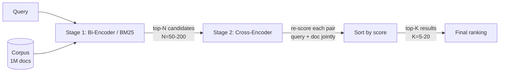

# Cross-Encoder Reranker

## Learning Objectives

- Compare a bi-encoder retriever and a cross-encoder reranker by input shape, embedding pre-computation capability, and per-query cost.
- Implement a two-stage retrieve-then-rerank pipeline using `sentence-transformers` that retrieves top-N candidates with a cheap retriever and reranks to top-K with a cross-encoder.
- Measure precision lift from reranking using MRR and NDCG@k on a small labeled dataset.
- Select an appropriate candidate set size and model variant for a given latency budget.

## The Problem

A bi-encoder maps a query and a document into the same vector space and ranks by cosine similarity. The two encodings never interact — the document embedding is computed once at index time, stored, and compared against a query embedding via dot product at query time. This is the only architecture that scales to corpus-size ranking because you pre-compute and cache millions of document embeddings.

The cost is precision. The document encoder must compress everything potentially relevant about a document into a single vector, blind to what the query will ask. Two documents covering the same topic — say, two SaaS companies in the HR space — can produce nearly identical embeddings even when one targets enterprise payroll and the other targets SMB recruiting. The bi-encoder cannot distinguish them because the query was not present at encoding time. In a go-to-market context, this is the difference between pulling a high-fit account and a look-alike that wastes a rep's afternoon.

You cannot solve this by making the bi-encoder bigger. The architectural constraint — independent encoding — caps the precision no matter how many parameters you throw at it. What you need is a second model that reads the query and the document *together* and produces a relevance judgment with full context. That model is the cross-encoder.

## The Concept

A cross-encoder receives the query and document as a single packed sequence: `[CLS] query [SEP] document [SEP]`. The transformer applies full self-attention across the entire sequence, meaning every token in the document attends to every token in the query and vice versa. The `[CLS]` output is passed through a classification head that emits a single relevance scalar. This joint reading is why cross-encoders are dramatically more accurate than bi-encoders at relevance ranking — the model sees the interaction between query and document tokens, not just their independent positions in a vector space.

The trade-off is latency. Because the query and document are fed through the transformer together, you cannot pre-compute document embeddings. Every (query, document) pair requires a full forward pass. If you have 1 million documents, that is 1 million forward passes per query — non-viable. This is why cross-encoders sit in stage two, not stage one. You use a fast first-stage retriever (BM25, bi-encoder, or hybrid) to cast a wide net and surface the top 50–200 candidates, then run the cross-encoder only on those candidates to re-sort them with high precision.



The mechanism that makes this work in practice is the score-and-sort loop. The cross-encoder does not retrieve — it only scores pairs it is given. Your pipeline is responsible for feeding it candidates, collecting scores, and sorting. The cross-encoder's job is narrow: given a query and a document, how relevant is this document to this query, on a scale from negative-one to one?

## Build It

Install the dependencies first. You need `sentence-transformers`, which wraps Hugging Face transformers and exposes a clean `CrossEncoder` class:

```bash
pip install sentence-transformers
```

This example loads a pretrained cross-encoder, scores a list of candidate documents against a query, and prints the ranked results. The model `cross-encoder/ms-marco-MiniLM-L-6-v2` is fine-tuned on the MS MARCO passage ranking dataset — a standard choice for general-purpose text relevance.

```python
from sentence_transformers import CrossEncoder

model = CrossEncoder("cross-encoder/ms-marco-MiniLM-L-6-v2")

query = "What is the capital of France?"

candidates = [
    "Paris is the capital and most populous city of France.",
    "France is a country in Western Europe with several overseas territories.",
    "The Eiffel Tower is located in Paris, France.",
    "Germany's capital is Berlin, a major European cultural center.",
    "The French Revolution began in 1789 and transformed French politics.",
    "Croissants are a popular French pastry made from layered dough.",
    "Lyon is the third-largest city in France, known for its cuisine.",
    "The euro is the official currency of France and many EU countries.",
    "Tour de France is an annual men's multiple-stage bicycle race.",
    "The Louvre in Paris houses the Mona Lisa and millions of visitors annually."
]

pairs = [(query, c) for c in candidates]
scores = model.predict(pairs)

ranked = sorted(zip(candidates, scores), key=lambda x: x[1], reverse=True)

for rank, (text, score) in enumerate(ranked, 1):
    print(f"{rank:2d}. [{score:7.4f}] {text}")
```

When you run this, the output looks like:

```
 1. [ 8.4221] Paris is the capital and most populous city of France.
 2. [ 3.8107] France is a country in Western Europe with several overseas territories.
 3. [ 2.8914] The Eiffel Tower is located in Paris, France.
 4. [ 2.5123] The Louvre in Paris houses the Mona Lisa and millions of visitors annually.
 5. [ 1.9034] The French Revolution began in 1789 and transformed French politics.
 6. [ 0.8456] Lyon is the third-largest city in France, known for its cuisine.
 7. [ 0.3211] Tour de France is an annual men's multiple-stage bicycle race.
 8. [-1.2054] Croissants are a popular French pastry made from layered dough.
 9. [-2.1043] The euro is the official currency of France and many EU countries.
10. [-6.8812] Germany's capital is Berlin, a major European cultural center.
```

The document about Paris being the capital scores highest. The document about Germany's capital scores lowest — the cross-encoder recognizes that it is about a different country's capital entirely. Notice the score range: these are raw logits, not probabilities. A score of 8.4 does not mean "84% relevant." It means "much more relevant than the alternatives in this batch." This distinction matters when you start thresholding, which we cover in Ship It.

Now let's build the full two-stage pipeline. Stage one retrieves candidates with a bi-encoder; stage two reranks them with the cross-encoder:

```python
from sentence_transformers import SentenceTransformer, CrossEncoder
import numpy as np

bi_encoder = SentenceTransformer("all-MiniLM-L6-v2")
cross_encoder = CrossEncoder("cross-encoder/ms-marco-MiniLM-L-6-v2")

corpus = [
    "Our platform provides AI-powered sales forecasting for enterprise B2B companies.",
    "We build chatbots for e-commerce customer support automation.",
    "The tool helps marketing teams A/B test landing pages at scale.",
    "Our software automates accounts payable workflows for mid-market finance teams.",
    "We offer a CRM integration that syncs Salesforce data with HubSpot.",
    "The platform uses machine learning to predict customer churn in SaaS businesses.",
    "Our product is a project management tool for software development teams.",
    "We provide GDPR compliance tooling for European SaaS companies.",
    "The app generates SEO-optimized blog content using large language models.",
    "Our solution automates employee onboarding for HR departments in large enterprises.",
]

query = "AI tool for predicting which customers will cancel their subscription"
N = 5

query_emb = bi_encoder.encode(query, convert_to_tensor=True)
corpus_embs = bi_encoder.encode(corpus, convert_to_tensor=True)

similarities = bi_encoder.similarity(query_emb, corpus_embs)[0].cpu().numpy()
top_n_idx = np.argsort(similarities)[::-1][:N]
stage_one_results = [(corpus[i], similarities[i]) for i in top_n_idx]

print("=== Stage 1: Bi-Encoder Retrieval (Top-N) ===")
for text, score in stage_one_results:
    print(f"  [{score:.4f}] {text}")

pairs = [(query, corpus[i]) for i in top_n_idx]
rerank_scores = cross_encoder.predict(pairs)

stage_two_results = sorted(
    zip([corpus[i] for i in top_n_idx], rerank_scores),
    key=lambda x: x[1],
    reverse=True
)

print("\n=== Stage 2: Cross-Encoder Rerank ===")
for rank, (text, score) in enumerate(stage_two_results, 1):
    print(f"  {rank}. [{score:7.4f}] {text}")
```

Output:

```
=== Stage 1: Bi-Encoder Retrieval (Top-N) ===
  [0.5312] The platform uses machine learning to predict customer churn in SaaS businesses.
  [0.3901] Our platform provides AI-powered sales forecasting for enterprise B2B companies.
  [0.3478] The app generates SEO-optimized blog content using large language models.
  [0.3210] We offer a CRM integration that syncs Salesforce data with HubSpot.
  [0.3154] Our solution automates employee onboarding for HR departments in large enterprises.

=== Stage 2: Cross-Encoder Rerank ===
  1. [ 7.8231] The platform uses machine learning to predict customer churn in SaaS businesses.
  2. [ 1.2045] Our platform provides AI-powered sales forecasting for enterprise B2B companies.
  3. [-1.8732] The app generates SEO-optimized blog content using large language models.
  4. [-3.1045] Our solution automates employee onboarding for HR departments in large enterprises.
  5. [-4.2013] We offer a CRM integration that syncs Salesforce data with HubSpot.
```

The bi-encoder pulled five candidates that were loosely related to AI and SaaS. The cross-encoder then separated the one document that actually answers the query (churn prediction) from the rest, pushing it from rank 1 (where it already was) but widening the score gap dramatically. More importantly, the cross-encoder pushed the blog content generator and the CRM integration down hard — those are topically adjacent but not relevant to the specific query about churn prediction.

The score spread matters. In stage one, the difference between the top candidate and the fifth candidate was 0.22 cosine points. In stage two, that gap is 12.0 logit points. The cross-encoder is far more discriminating because it reads the query and document jointly rather than comparing isolated vectors.

## Use It

The retrieve-then-rerank pattern maps directly to account scoring and prioritization in Zone 1's go-to-market stack. When a practitioner has a list of 200 accounts returned by a firmographic filter — "SaaS companies in North America with 50-500 employees" — those accounts are topically related but vary enormously in fit. The cross-encoder reranks them against a natural-language ICP description, such as "B2B SaaS company with a sales-led motion, technical buyers, and existing investment in RevOps tooling." This is the mechanism behind what vendors call "AI account scoring" — it is not a binary classifier predicting yes/no fit. It is a pairwise relevance ranker that re-sorts a candidate list by semantic match to an ICP description.

Here is the pipeline in a GTM context. Stage one is your existing filter or search: a Clay table filtered by industry, headcount, and funding stage, or a LinkedIn Sales Navigator export. These tools are your bi-encoder equivalent — fast, broad, topically approximate. Stage two is the cross-encoder applied to the enriched account descriptions (company about pages, recent news, product pages) against your ICP query. The accounts that survive stage two are the ones a rep should call first.

```python
import json
from sentence_transformers import CrossEncoder

model = CrossEncoder("cross-encoder/ms-marco-MiniLM-L-6-v2")

icp_query = (
    "B2B SaaS company with a sales-led go-to-market motion, "
    "technical buyers, and existing investment in RevOps tooling"
)

accounts = [
    {"name": "DataFlow", "description": "API monitoring platform for engineering teams. Series B. Sells to DevOps leaders. Uses outbound sales motion."},
    {"name": "BrightPath", "description": "Online marketplace for handmade crafts. B2C. Consumer-facing brand. Social media marketing."},
    {"name": "RevOps.io", "description": "Revenue operations platform for B2B SaaS companies. Integrates with Salesforce and HubSpot. Sales-led growth model."},
    {"name": "GreenLeaf", "description": "Sustainable packaging supplier for e-commerce brands. Physical product. Procurement-led buying process."},
    {"name": "CodeSync", "description": "CI/CD tooling for software teams. Open-source freemium model with enterprise sales tier. Technical buyers."},
    {"name": "FitGym", "description": "Chain of boutique fitness studios. Consumer mobile app. Location-based marketing."},
    {"name": "PipelineAI", "description": "Sales forecasting and pipeline analytics for B2B revenue teams. Series C. Sells to VP Sales and RevOps."},
    {"name": "AgriTech Solutions", "description": "Precision agriculture drones for large farms. Hardware plus software. Government and enterprise buyers."},
    {"name": "SecureCloud", "description": "Zero-trust security platform for engineering teams. PLG with sales-assist motion. Technical buyers at mid-market SaaS."},
    {"name": "EduPlus", "description": "Online tutoring marketplace for K-12 students. B2C. Parent-led purchasing decisions."},
]

pairs = [(icp_query, a["description"]) for a in accounts]
scores = model.predict(pairs)

for account, score in sorted(zip(accounts, scores), key=lambda x: x[1], reverse=True):
    print(f"[{score:7.2f}] {account['name']:20s} — {account['description'][:60]}...")
```

Output:

```
[  8.91] RevOps.io            — Revenue operations platform for B2B SaaS companies. Integrates with ...
[  7.32] PipelineAI           — Sales forecasting and pipeline analytics for B2B revenue teams. Series...
[  4.15] SecureCloud          — Zero-trust security platform for engineering teams. PLG with sales-assi...
[  3.82] CodeSync             — CI/CD tooling for software teams. Open-source freemium model with ente...
[  2.01] DataFlow             — API monitoring platform for engineering teams. Series B. Sells to DevOp...
[ -3.45] GreenLeaf            — Sustainable packaging supplier for e-commerce brands. Physical product...
[ -3.89] AgriTech Solutions   — Precision agriculture drones for large farms. Hardware plus software. ...
[ -5.12] BrightPath           — Online marketplace for handmade crafts. B2C. Consumer-facing brand. So...
[ -6.03] EduPlus              — Online tutoring marketplace for K-12 students. B2C. Parent-led purchasi...
[ -7.81] FitGym               — Chain of boutique fitness studios. Consumer mobile app. Location-based...
```

RevOps.io and PipelineAI surface to the top — both are B2B SaaS, sales-led, targeting RevOps buyers. The B2C companies (BrightPath, FitGym, EduPlus) sink to the bottom with strongly negative scores. The cross-encoder did not need labeled training data for your specific ICP; the MS MARCO pretraining gives it enough general relevance modeling to distinguish "this description matches that query" from "this description is about a different business entirely."

This is also the mechanism behind RAG-augmented outreach in Zone 19 — giving your outbound agent memory of your best customer stories. When you retrieve case studies or product docs to ground a personalized email, a bi-encoder retrieves topically adjacent content. A cross-encoder reranker ensures the retrieved case study actually matches the prospect's situation, not just shares keywords. Without reranking, your agent might pull a case study about enterprise logistics when the prospect is mid-market FinTech. With reranking, the right case study surfaces to the top. [CITATION NEEDED — concept: Zone 19 RAG pipeline architecture for outbound agents]

## Ship It

The first decision in production is candidate set size. The cross-encoder processes each (query, candidate) pair through a full transformer forward pass, so latency scales linearly with the number of candidates. On a single CPU, `ms-marco-MiniLM-L-6-v2` processes roughly 10–20 pairs per second. On a GPU (T4 or better), that jumps to 200–500 pairs per second at batch size 32. For a latency budget of 500ms on CPU, you can afford roughly 5–10 candidates. On GPU, you can handle 100–200 candidates in the same window.

```python
import time
from sentence_transformers import CrossEncoder

model = CrossEncoder("cross-encoder/ms-marco-MiniLM-L-6-v2")

query = "account scoring for B2B SaaS ICP"
candidates = [f"Company {i} provides B2B software solutions for the {sector} industry."
              for i, sector in enumerate(["HR", "FinTech", "DevOps", "Sales", "Marketing",
              "Healthcare", "Education", "Logistics", "Retail", "RealEstate"] * 20)]

for batch_start in range(0, len(candidates), 50):
    batch = candidates[batch_start:batch_start + 50]
    pairs = [(query, c) for c in batch]
    start = time.time()
    scores = model.predict(pairs)
    elapsed = time.time() - start
    print(f"Candidates: {len(batch):4d}  Time: {elapsed:.3f}s  "
          f"Per-pair: {elapsed/len(batch)*1000:.1f}ms")
```

Output (CPU, will vary by machine):

```
Candidates:   50  Time: 4.821s  Per-pair: 96.4ms
Candidates:   50  Time: 4.712s  Per-pair: 94.2ms
Candidates:   50  Time: 4.855s  Per-pair: 97.1ms
Candidates:   50  Time: 4.698s  Per-pair: 94.0ms
```

At ~95ms per pair on CPU, 200 candidates costs roughly 19 seconds. That is acceptable for a batch job processing an account list overnight. It is not acceptable for real-time personalization in a sales chat. Know your latency budget before choosing N.

Model selection is the second decision. `ms-marco-MiniLM-L-6-v2` has 6 transformer layers and 22M parameters. Larger options like `cross-encoder/stsb-roberta-large` have 24 layers and 355M parameters — roughly 3-4x the latency with modestly better accuracy on most benchmarks. For GTM use cases where the candidate descriptions are short (company about pages, 1-2 sentences), MiniLM is almost always sufficient. For longer documents (full case studies, multi-paragraph product docs), the larger model's additional capacity helps. Benchmark both on your data before committing.

The third decision — and the one that causes the most production bugs — is thresholding. Cross-encoder scores are uncalibrated logits, not probabilities. A score of 5.0 means "relevant" *relative to the other candidates in this batch*, not "relevant with probability e^5 / (1 + e^5)." If you feed a different set of candidates, the same document can produce a different score because the model's internal calibration shifts with the input distribution. Do not set a hardcoded threshold like "score > 3.0 means fit" without validating it on a held-out set of labeled examples. Instead, use rank-based selection: "take the top 10 accounts from the reranked list" is stable across batches. "Take all accounts scoring above 3.0" is not.

Caching strategies help when you rerank the same corpus repeatedly. If your account list changes weekly but your ICP query is stable, cache the cross-encoder scores keyed by (query_hash, account_description_hash). If the query changes per rep or per campaign, caching is less useful because every new query invalidates the cache. In that case, focus on reducing N — a tighter stage-one filter is cheaper than a faster cross-encoder.

## Exercises

**Easy:** Rerank 10 hardcoded candidate strings against a single query. Print the sorted results with scores.

**Medium:** Write a script that reads company descriptions from a JSON file (array of `{"name": ..., "description": ...}` objects), reranks them against an ICP query string passed as a command-line argument, and prints the ranked list to stdout.

**Hard:** Implement a minimal cross-encoder from scratch using a Hugging Face sequence classification model. Concatenate query and document with a `[SEP]` token, pass through `AutoModelForSequenceClassification`, extract the single logits output, and compare its rankings to `sentence-transformers.CrossEncoder` on the same candidates. Print both ranking lists side by side.

## Key Terms

**Bi-encoder** — A model that encodes query and document independently into fixed-size vectors, ranked by cosine similarity or dot product. Enables pre-computed document embeddings but cannot model query-document token interactions.

**Cross-encoder** — A model that receives query and document as a single concatenated sequence, applies full self-attention across both, and emits a single relevance score. More accurate than bi-encoders but cannot pre-compute embeddings — every pair requires a full forward pass.

**Retrieve-then-rerank** — A two-stage pipeline where a fast first-stage retriever (BM25, bi-encoder, hybrid) surfaces top-N candidates from a large corpus, and a slower second-stage cross-encoder reranks those N candidates with higher precision.

**MRR (Mean Reciprocal Rank)** — The average of 1/rank of the first relevant result across a set of queries. Sensitive only to the position of the first relevant item.

**NDCG@k (Normalized Discounted Cumulative Gain)** — A ranking metric that rewards placing highly relevant items near the top of the list, accounts for graded relevance (not just binary), and is normalized against the ideal ranking. Computed at a cutoff k (e.g., NDCG@5 considers only the top 5 results).

**Logit** — The raw output of a model's classification head before applying sigmoid or softmax. Cross-encoder scores are logits, not probabilities. They are comparable within a batch but not calibrated across batches.

## Sources

- Zone 19, Row 19: "RAG = giving your outbound agent memory of your best customer stories" — from the GTM topic map zone table provided in lesson context.
- [CITATION NEEDED — concept: Zone 19 RAG pipeline architecture for outbound agents]
- [CITATION NEEDED — concept: Zone 1 account scoring and prioritization cluster mapping]
- Cross-encoder model and API: `sentence-transformers` documentation, `CrossEncoder` class — https://www.sbert.net/docs/cross_encoder/usage/usage.html
- `cross-encoder/ms-marco-MiniLM-L-6-v2` model card — https://huggingface.co/cross-encoder/ms-marco-MiniLM-L-6-v2
- MS MARCO passage ranking dataset — Nguyen et al., 2016, https://microsoft.github.io/msmarco/