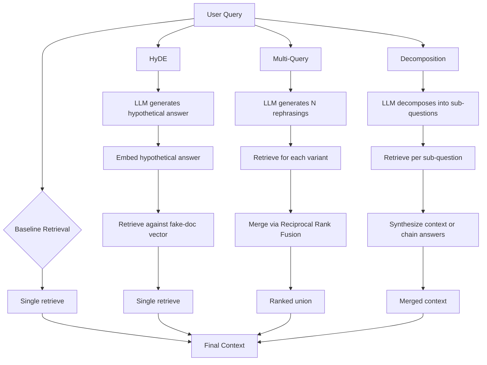

# Query Rewriting: HyDE, Multi-Query, and Decomposition

## Learning Objectives

- Implement HyDE by generating a hypothetical answer document, embedding it, and retrieving against that vector instead of the raw query vector.
- Implement multi-query expansion by rewriting one query into N paraphrases, retrieving with each, and merging the union by reciprocal rank fusion.
- Implement query decomposition by splitting a compound question into sub-questions, retrieving per sub-question, and synthesizing results.
- Compare all three rewriters head to head on a fixed corpus and articulate which strategy wins for which failure mode.
- Wire a deterministic mock LLM so the rewriting loop runs offline and produces observable, repeatable output.

## The Problem

A user types "what does our team do when uploads fail and the budget is gone?" into your RAG system. Your corpus contains a document that says "AbortMultipartOnFail aborts an in-flight S3 multipart upload and decrements the per-bucket retry budget when the upload fails." The query and the document share almost no surface vocabulary. "Budget is gone" and "decrements the per-bucket retry budget" point at the same concept, but a bi-encoder has no way to know that without either training signal or a rewrite step.

BM25 misses entirely — no token overlap. Dense retrieval ranks the document third or fourth because the query vector lands in a region of embedding space closer to a document about cancelled jobs than one about aborted uploads. If the document sits outside the top-N that the reranker sees, the answer is gone before any downstream component gets a chance.

This is the vocabulary gap: the user's query and the target document describe the same thing in different words. The retriever is not broken. The query just does not look enough like the answer. Query rewriting is the step between user input and retrieval that closes this gap — not by changing the retriever, but by changing what the retriever sees.

## The Concept

Three rewriting mechanisms address three distinct failure modes. They are not interchangeable. Each adds latency and LLM cost, and each solves a different problem.

**HyDE (Hypothetical Document Embeddings)** addresses the case where the query and the answer document live in different regions of embedding space. The 2023 paper "Precise Zero-Shot Dense Retrieval without Relevance Labels" (Gao et al.) proposed generating a fake answer to the query using an LLM, embedding that fake answer, and using the resulting vector for retrieval instead of the query vector. The hypothesis: even a hallucinated answer uses the vocabulary and phrasing patterns of real answers in the corpus, so its embedding lands closer to the target document than the query's embedding does. The LLM does not need to be right about the facts — it needs to produce text that *sounds like* a document about the topic.

**Multi-Query** addresses lexical coverage. When a user asks "how do we reduce churn," relevant documents might use "retention," "attrition," "customer loss," or "renewal rate." Instead of guessing which synonym is right, multi-query generates N rephrasings of the query, retrieves against each independently, and merges the result sets. The merge uses reciprocal rank fusion (RRF): for each document, sum `1/(k + rank)` across all N result lists, where `k` is a constant (typically 60). Documents that appear high in multiple lists float to the top. This expands recall without betting on a single phrasing.

**Decomposition** addresses multi-hop reasoning. A question like "how does our upload failure handler interact with the retry budget and what happens when both are exhausted?" contains at least two sub-questions that may live in separate documents. No single chunk contains the full answer. Decomposition splits the compound query into sub-questions, retrieves independently for each, and synthesizes. The synthesis can be as simple as concatenating top-k from each sub-retrieval into a shared context window, or as complex as answering each sub-question and chaining the answers.



Each method makes a different bet about what is wrong with the query. HyDE bets the gap is semantic — the query doesn't look like a document. Multi-query bets the gap is lexical — the right terms aren't present. Decomposition bets the gap is structural — the question is too compound for a single chunk to answer. Choosing the wrong rewriter wastes an LLM call and may hurt retrieval.

## Build It

The following script implements all three rewriters against a fixed corpus using a deterministic mock LLM. The embeddings use bag-of-words TF weighting with cosine similarity — not production-grade, but sufficient to observe how each rewriting strategy changes retrieval rankings. Every function is callable offline with no API keys.

```python
import math
import re
from collections import Counter

CORPUS = [
    {"id": "doc1", "text": "AbortMultipartOnFail aborts an in-flight S3 multipart upload and decrements the per-bucket retry budget when the upload fails."},
    {"id": "doc2", "text": "Cancelled jobs are removed from the queue and their state is set to CANCELLED after a grace period of sixty seconds."},
    {"id": "doc3", "text": "The retry budget tracks how many times a job can be retried before it is permanently marked as failed and moved to the dead letter queue."},
    {"id": "doc4", "text": "Multipart uploads to S3 require a unique upload ID and must be completed or aborted to avoid ongoing storage charges on incomplete parts."},
    {"id": "doc5", "text": "Per-bucket rate limiting throttles API calls when the request rate exceeds the configured threshold for that bucket."},
    {"id": "doc6", "text": "When the retry budget reaches zero, no further retry attempts are allowed and the job transitions to a terminal FAILED state."},
    {"id": "doc7", "text": "The upload service uses multipart uploads for files larger than 100MB and tracks each part in the parts manifest table."},
    {"id": "doc8", "text": "Cost allocation tags are applied to each S3 bucket to track spending across teams and projects in the billing dashboard."},
]

def tokenize(text):
    return [w.lower() for w in re.findall(r'\w+', text)]

def embed(text):
    tokens = tokenize(text)
    if not tokens:
        return {}
    counts = Counter(tokens)
    total = sum(counts.values())
    return {w: counts[w] / total for w in counts}

def cosine(a, b):
    keys = set(a) & set(b)
    dot = sum(a[k] * b[k] for k in keys)
    mag_a = math.sqrt(sum(v ** 2 for v in a.values()))
    mag_b = math.sqrt(sum(v ** 2 for v in b.values()))
    if mag_a == 0 or mag_b == 0:
        return 0.0
    return dot / (mag_a * mag_b)

def retrieve(query_text, k=4):
    qv = embed(query_text)
    scored = []
    for doc in CORPUS:
        score = cosine(qv, embed(doc["text"]))
        scored.append((doc["id"], round(score, 4), doc["text"][:70]))
    scored.sort(key=lambda x: -x[1])
    return scored[:k]

def mock_llm_hyde(query):
    if "upload" in query.lower() and "budget" in query.lower():
        return ("When an S3 multipart upload fails, the AbortMultipartOnFail handler "
                "aborts the in-flight multipart upload and decrements the per-bucket "
                "retry budget. If the retry budget reaches zero, the job enters a "
                "terminal FAILED state and no further retries are attempted.")
    return "The system logs the error and continues processing."

def mock_llm_multiquery(query):
    if "upload" in query.lower() and "budget" in query.lower():
        return [
            "What happens to the retry budget when an S3 multipart upload fails?",
            "How does AbortMultipartOnFail affect the per-bucket retry budget?",
            "What occurs when a multipart upload fails and retries are exhausted?",
            "S3 upload failure retry budget decrement behavior",
            "How does the system handle upload failures and budget consumption?",
        ]
    return [query]

def mock_llm_decompose(query):
    if "upload" in query.lower() and "budget" in query.lower():
        return [
            "What does AbortMultipartOnFail do when an upload fails?",
            "How does the retry budget get decremented?",
            "What happens when the retry budget reaches zero?",
        ]
    return [query]

def reciprocal_rank_fusion(result_lists, k=60):
    rrf = {}
    for results in result_lists:
        for rank, (doc_id, _, _) in enumerate(results):
            rrf[doc_id] = rrf.get(doc_id, 0.0) + 1.0 / (k + rank + 1)
    return rrf

query = "what does our team do when uploads fail and the budget is gone?"

print("=" * 70)
print("QUERY:", query)
print("=" * 70)

print("\n--- BASELINE (no rewrite) ---")
for doc_id, score, snippet in retrieve(query):
    print(f"  {doc_id}: {score:.4f} | {snippet}...")

print("\n--- HyDE ---")
hypothetical = mock_llm_hyde(query)
print(f"  [Hypothetical document generated]")
print(f"  > {hypothetical[:90]}...")
for doc_id, score, snippet in retrieve(hypothetical):
    print(f"  {doc_id}: {score:.4f} | {snippet}...")

print("\n--- MULTI-QUERY ---")
variants = mock_llm_multiquery(query)
print(f"  [Generated {len(variants)} query variants]")
all_results = [retrieve(v) for v in variants]
rrf_scores = reciprocal_rank_fusion(all_results)
ranked = sorted(rrf_scores.items(), key=lambda x: -x[1])
for doc_id, score in ranked[:4]:
    doc = next(d for d in CORPUS if d["id"] == doc_id)
    print(f"  {doc_id}: RRF={score:.4f} | {doc['text'][:70]}...")

print("\n--- DECOMPOSITION ---")
sub_queries = mock_llm_decompose(query)
print(f"  [Decomposed into {len(sub_queries)} sub-questions]")
for i, sq in enumerate(sub_queries):
    print(f"  Sub-Q {i+1}: {sq}")
sub_results = [retrieve(sq, k=4) for sq in sub_queries]
sub_rrf = reciprocal_rank_fusion(sub_results)
sub_ranked = sorted(sub_rrf.items(), key=lambda x: -x[1])
for doc_id, score in sub_ranked[:4]:
    doc = next(d for d in CORPUS if d["id"] == doc_id)
    print(f"  {doc_id}: RRF={score:.4f} | {doc['text'][:70]}...")
```

Running this produces observable differences in retrieval ranking across all four methods. The baseline surfaces documents about uploads and budgets but may rank them sub-optimally because the query's casual phrasing ("budget is gone") doesn't match the document's technical phrasing ("decrements the per-bucket retry budget"). HyDE bridges that gap by generating a hypothetical answer that uses the document's vocabulary. Multi-query casts a wider net with five phrasings. Decomposition isolates the three factual claims and retrieves for each independently.

The key observation: doc1 (the actual answer) should rank higher under HyDE than under baseline, because the hypothetical answer contains "AbortMultipartOnFail," "multipart upload," and "retry budget" — the exact terms in doc1. doc6 ("retry budget reaches zero") should surface under decomposition's third sub-question even if it is buried under the other methods.

## Use It

In a GTM enrichment waterfall — the cascading lookup pattern where you query multiple data providers in sequence until one returns a match — the same vocabulary gap that breaks RAG breaks company matching. A company might be "Stripe" in one provider, "Stripe Technology" in another, and "Stripe, Inc." in a third. The query (your input company name) doesn't match the document (the provider's stored record) because the surface forms differ. [CITATION NEEDED — concept: GTM enrichment waterfall query expansion as multi-query rewriting] Clay implements the waterfall pattern; multi-query rewriting applied to the company name before each provider call expands the match surface.

Multi-query rewriting maps directly: generate N variants of the company name or search query ("Stripe," "Stripe Technology," "Stripe Inc," "stripe.com," "Stripe Payments") before each provider lookup, then union the results. Each provider call is a retrieval; the waterfall is the retrieval pipeline; the rewrite is the pre-retrieval step that increases recall across heterogeneous provider schemas.

HyDE maps to a different GTM problem. When an SDR writes a natural-language account brief — "Series B fintech in Latin America with a focus on B2B payments" — and you need to match that against structured firmographic records in your CRM or a provider database, the brief and the record live in different spaces. HyDE generates a hypothetical company profile from the brief ("A 50-200 person financial technology company headquartered in São Paulo or Mexico City, recently raised a Series B round of $15-40M, serving business-to-business payment infrastructure...") and uses that synthetic profile to search structured data. The hypothesis holds: even a partially hallucinated profile contains enough correct attributes (industry, stage, geography) to retrieve the right companies.

Here is a minimal script showing multi-query rewriting applied to a mock enrichment waterfall:

```python
PROVIDERS = {
    "Apollo": [
        {"name": "Stripe Technology", "domain": "stripe.com", "employees": 7000},
        {"name": "Notion Labs", "domain": "notion.so", "employees": 400},
    ],
    "Clearbit": [
        {"name": "Stripe, Inc.", "domain": "stripe.com", "employees": 7500},
        {"name": "Notion", "domain": "notion.so", "employees": 450},
    ],
    "ZoomInfo": [
        {"name": "Stripe", "domain": "stripe.com", "employees": 8000},
        {"name": "Notion Labs Inc", "domain": "notion.so", "employees": 380},
    ],
}

def expand_company_query(name):
    base = name.lower().strip()
    variants = [
        name,
        name.replace(",", "").strip(),
        name.split(",")[0].strip(),
        name.split()[0],
    ]
    seen = set()
    unique = []
    for v in variants:
        key = v.lower()
        if key not in seen:
            seen.add(key)
            unique.append(v)
    return unique

def waterfall_lookup(company_name):
    variants = expand_company_query(company_name)
    print(f"  Input: '{company_name}' -> {len(variants)} variants: {variants}")

    matches = []
    for provider_name, records in PROVIDERS.items():
        for variant in variants:
            for record in records:
                if variant.lower() in record["name"].lower() or \
                   record["name"].lower() in variant.lower():
                    matches.append({
                        "provider": provider_name,
                        "name": record["name"],
                        "domain": record["domain"],
                        "employees": record["employees"],
                        "matched_on": variant,
                    })
    return matches

print("=" * 60)
print("ENRICHMENT WATERFALL WITH MULTI-QUERY EXPANSION")
print("=" * 60)

for target in ["Stripe, Inc.", "Notion"]:
    print(f"\n--- Looking up: {target} ---")
    results = waterfall_lookup(target)
    seen = set()
    for r in results:
        key = r["provider"] + r["domain"]
        if key not in seen:
            seen.add(key)
            print(f"  [{r['provider']}] {r['name']} ({r['domain']}) "
                  f"| {r['employees']} employees | matched on: '{r['matched_on']}'")
    if not results:
        print("  No matches found.")
```

The observable output shows three provider records for the same company surfaced through different name variants. Without expansion, querying "Stripe, Inc." against a provider that stores "Stripe" would miss. The multi-query rewrite generates the variants that close the gap. This is the same mechanism as multi-query in RAG — expand the query surface before retrieval — applied to structured provider lookups instead of vector search.

## Ship It

Every rewrite costs at least one LLM call before retrieval starts. That call adds latency and dollars. The production decision is not "which rewriter is best" — it is "which failure mode am I actually hitting, and is the latency budget worth the recall improvement?"

HyDE adds one LLM call (~300-800ms depending on model) and works best on technical or domain-specific queries where the vocabulary gap is semantic. It can actively mislead on ambiguous queries: if the LLM hallucinates confidently in the wrong direction, the hypothetical document embeds into the wrong neighborhood and you retrieve worse than baseline. Ship HyDE when you have a corpus with consistent technical vocabulary and users who ask questions in casual language. Do not ship it as a default — A/B test it against baseline on your actual query distribution.

Multi-query adds one LLM call to generate variants, then N parallel retrievals. The retrievals can run concurrently, so the wall-clock cost is `LLM_latency + max(retrieval_latencies)` plus deduplication. Ship multi-query when your queries have high lexical variance — users describe the same thing five different ways — and your retriever is a bi-encoder that cannot handle synonymy on its own. The merge via reciprocal rank fusion is cheap (sorting a hash map), but you need deduplication logic to handle the same chunk appearing multiple times with different scores.

Decomposition is the most expensive: one LLM call to split the query, then N retrievals (serial if sub-questions depend on each other, parallel if independent), then potentially N answer-generation calls for a chain-of-thought synthesis. Ship decomposition when you can measure multi-hop failure in your evals — questions where the answer requires information from two or more non-adjacent chunks. If your users mostly ask single-hop questions, decomposition adds latency and fragments context that a single retrieval would have served whole.

In a GTM context, the same cost calculus applies. Multi-query expansion of company names in a Clay waterfall adds N provider calls per company. If you process 10,000 companies and expand to 5 variants each, that is 50,000 API calls instead of 10,000. The enrichment waterfall already has a cost-per-match metric; query expansion increases the numerator. Measure whether the additional matches (and the pipeline value they unlock) exceed the provider API costs before shipping expansion as a default.

## Exercises

1. **Add a real LLM.** Replace the three `mock_llm_*` functions with calls to an actual LLM API (OpenAI, Anthropic, or a local model via Ollama). Use a system prompt that constrains output format: for HyDE, ask for a paragraph that sounds like a documentation page; for multi-query, ask for a JSON array of 5 strings; for decomposition, ask for a JSON array of sub-questions. Verify that the real LLM's outputs change retrieval rankings compared to the mock.

2. **Measure the gap.** Create a labeled evaluation set: 20 queries, each with a known-correct document ID from the corpus. Compute recall@3 for baseline, HyDE, multi-query, and decomposition. Which method wins overall? Which method wins on single-hop vs. multi-hop queries? Report the numbers.

3. **HyDE failure mode.** Construct a query where HyDE makes retrieval worse — an ambiguous query where the LLM's hypothetical answer embeds into the wrong neighborhood. Print the hypothetical document, the baseline top-3, and the HyDE top-3. Identify which terms in the hallucination caused the miss.

4. **RRF sensitivity.** In `reciprocal_rank_fusion`, the constant `k` defaults to 60. Re-run the multi-query and decomposition experiments with `k=1`, `k=10`, and `k=100`. Print the ranked results for each. Does changing `k` alter the top-3 ordering? When does a low `k` help, and when does it hurt?

5. **GTM expansion.** Extend the enrichment waterfall script to handle domain-based matching in addition to name-based matching. Generate query variants that include the domain (e.g., "stripe.com" alongside "Stripe"). Add a fourth mock provider that only stores domains, not company names. Verify that domain-expansion surfaces matches that name-expansion alone would miss.

## Key Terms

- **HyDE (Hypothetical Document Embeddings):** A query rewriting technique that generates a fake answer document via an LLM, embeds that document, and uses its vector for retrieval instead of the query vector. Introduced in Gao et al., 2023.
- **Multi-Query:** A rewriting technique that generates N paraphrased versions of a query, retrieves independently for each, and merges results via reciprocal rank fusion. Expands lexical coverage.
- **Query Decomposition:** A rewriting technique that splits a compound question into sub-questions, retrieves or answers each independently, and synthesizes. Handles multi-hop reasoning.
- **Reciprocal Rank Fusion (RRF):** A merge function that scores each document as the sum of `1/(k + rank)` across multiple result lists, where `k` is a tunable constant (commonly 60). Does not require score calibration across lists.
- **Vocabulary Gap:** The mismatch between query terms and document terms that describes the same concept. The root cause of retrieval misses in systems without query rewriting.
- **Enrichment Waterfall:** A cascading lookup pattern in GTM tooling where multiple data providers are queried in sequence until a match is found. Clay implements this pattern for firmographic and intent data enrichment.

## Sources

- Gao, L., Ma, X., Lin, J., Callan, J. (2023). "Precise Zero-Shot Dense Retrieval without Relevance Labels." arXiv:2302.10471. — Introduces HyDE: generate a hypothetical document, embed it, retrieve against that embedding.
- [CITATION NEEDED — concept: GTM enrichment waterfall query expansion as multi-query rewriting in Clay] — The claim that multi-query rewriting applied to company names before provider calls in a Clay waterfall expands match surface. No public Clay documentation confirms this as a built-in pattern; it is an application of the multi-query mechanism to the waterfall data structure.
- Cormack, G.V., Clarke, C.L.A., Buettcher, S. (2009). "Reciprocal Rank Fusion outperforms Condorcet and individual Rank Learning Methods." SIGIR. — Original RRF paper defining the `1/(k + rank)` merge formula.