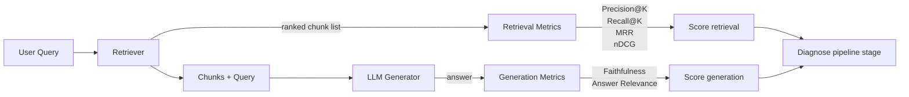

# RAG Evaluation: Precision, Recall, MRR, nDCG, Faithfulness, Answer Relevance

## Learning Objectives

- Compute precision@k, recall@k, MRR, and nDCG@k from a labeled qrels fixture against simulated retrieval output.
- Implement faithfulness and answer relevance checks that decompose generated answers into atomic claims and score them against retrieved context.
- Build a fixture qrels file (queries, gold document IDs, gold answer text) that a Python eval script reads end to end without external dependencies.
- Read metric values to diagnose which pipeline stage — retrieval, ranking, generation, or grounding — caused a failure.
- Compare two retrieval configurations by their metric deltas and identify which to ship.

## The Problem

You built a RAG pipeline. A user asks a question. Your system retrieves documents, feeds them to an LLM, and returns an answer. Then someone reports a wrong answer. You stare at the output. Now what?

A RAG system has at least four moving parts: chunker, retriever, reranker, generator. Any of them can be the cause. The chunker might have cut the answer span in half. The retriever might not have surfaced the right chunk in top-k. The reranker might have pushed the correct chunk from position one to position four. The generator might have ignored the retrieved context entirely and hallucinated a statistic. You cannot tell which failure occurred from the final answer alone — you need per-stage metrics.

This problem compounds in go-to-market applications. When a sales rep asks an internal knowledge base "do we have a customer who cut onboarding time?" and the RAG system returns a case study, the rep copies that case study into an outbound email. If the retriever returned the wrong case study, the email cites an irrelevant customer. If the generator hallucinated a metric — say, "reduced onboarding by 70%" when the actual figure was 40% — the rep just sent a false claim to a prospect. Both failures are preventable, but only if you measure retrieval and generation independently.

Without evaluation metrics, you are eyeballing outputs and guessing. This lesson gives you six quantitative signals to replace those guesses. Half measure retrieval quality — did you fetch the right chunks? Half measure generation quality — did the model produce a grounded, relevant answer?

## The Concept

Split the six metrics into two groups. The first group grades the fetch step, before generation. The second grades the output step, after generation.

**Retrieval metrics** require labeled ground truth — a set of document IDs known to be relevant for each query. You cannot compute precision or recall without knowing which documents *should* have been retrieved.

**Precision@K** answers: of the K chunks retrieved, what fraction are relevant? The mechanism is counting true positives in the result set and dividing by K. If your retriever returns five chunks and three are relevant, precision@5 is 0.60. Precision is about not wasting slots on irrelevant chunks.

**Recall@K** answers: of all relevant chunks that exist in the corpus, what fraction did you retrieve? The mechanism is counting true positives in the result set and dividing by the total number of relevant items. If the corpus has four relevant chunks and your retriever surfaced two, recall@5 is 0.50. Recall is about not missing chunks the user needs.

**MRR (Mean Reciprocal Rank)** answers: how high in the ranked list does the first relevant chunk appear? The mechanism is taking the reciprocal of the rank position of the first relevant result — position 1 gives 1.0, position 2 gives 0.5, position 3 gives 0.33 — and averaging across queries. MRR is about getting at least one good chunk to the top.

**nDCG (Normalized Discounted Cumulative Gain)** answers: does your ranking put the most relevant chunks first, with graded relevance? The mechanism sums relevance scores discounted by the logarithm of position, then normalizes against the ideal ranking. A highly relevant chunk at position 1 contributes more than the same chunk at position 3. nDCG is about the full ordering, not just the first hit.



**Generation metrics** evaluate what the LLM produced from the retrieved context. These do not require pre-labeled ground truth documents but do require a reference answer or an LLM-as-judge.

**Faithfulness** answers: does the answer contain claims not supported by the retrieved context? The mechanism decomposes the answer into atomic claims, then checks each claim against the source chunks. If the answer says "Acme saved $5M" but the retrieved chunk says "Acme saved $2M," that claim is unfaithful. Faithfulness is about grounding — the answer must not invent facts.

**Answer Relevance** answers: does the answer address the question asked? The mechanism compares semantic similarity between the question and the answer, or uses an LLM judge to score relevance. If the user asks about pricing and the answer discusses onboarding, relevance is low even if every sentence is factually grounded. Answer relevance is about staying on topic.

The key insight: faithfulness and answer relevance are independent axes. An answer can be faithful but irrelevant (every claim is grounded, but none answer the question). An answer can be relevant but unfaithful (it addresses the question but hallucinates the numbers). You need both.

Several open-source frameworks implement these metrics. RAGAS provides faithfulness and answer relevance via LLM judging, with the prompt templates for claim decomposition and relevance scoring exposed for customization. DeepEval implements all six metrics with configurable judges and pytest-style assertions. Both frameworks assume you bring your own qrels and retrieved results — they compute the math, they do not build your ground truth.

## Build It

This script defines a toy corpus, three queries with ground-truth labels, simulated retrieval results, and simulated generated answers. It computes all six metrics and prints a table. No external dependencies — pure Python.

```python
import math

corpus = {
    "d1": "Acme Corp reduced onboarding time by 40 percent after implementing our platform.",
    "d2": "Globex increased API response speed 3x using our edge caching layer.",
    "d3": "Initech saved 2M dollars annually by consolidating their data pipeline with our tool.",
    "d4": "Our platform SOC 2 Type II certification was renewed in Q3 2024.",
    "d5": "Umbrella Corp deployed our agent framework across 500 support seats.",
    "d6": "Stark Industries cut incident response time by 60 percent with our observability suite.",
    "d7": "Wayne Enterprises integrated our RAG pipeline into their internal knowledge base.",
    "d8": "Enterprise plans start at 50K per year with custom SLAs available.",
}

queries = {
    "q1": {
        "text": "Which customers improved onboarding or response time?",
        "relevant": ["d1", "d6"],
    },
    "q2": {
        "text": "What case studies do we have for agent frameworks?",
        "relevant": ["d5", "d7"],
    },
    "q3": {
        "text": "How much did customers save in costs?",
        "relevant": ["d3"],
    },
}

retrieval_results = {
    "q1": ["d1", "d4", "d6", "d2"],
    "q2": ["d7", "d2", "d5", "d8"],
    "q3": ["d2", "d3", "d1", "d5"],
}

generated_answers = {
    "q1": "Acme Corp reduced onboarding time by 40 percent and Stark Industries cut incident response time by 60 percent. Globex also saw improvements.",
    "q2": "Wayne Enterprises integrated our RAG pipeline and Umbrella Corp deployed our agent framework across 500 support seats.",
    "q3": "Initech saved 2M dollars annually by consolidating their data pipeline. Enterprise plans start at 50K per year.",
}

K = 4

def precision_at_k(retrieved, relevant, k):
    relevant_set = set(relevant)
    tp = sum(1 for d in retrieved[:k] if d in relevant_set)
    return tp / k

def recall_at_k(retrieved, relevant, k):
    relevant_set = set(relevant)
    tp = sum(1 for d in retrieved[:k] if d in relevant_set)
    if len(relevant_set) == 0:
        return 0.0
    return tp / len(relevant_set)

def reciprocal_rank(retrieved, relevant):
    relevant_set = set(relevant)
    for i, d in enumerate(retrieved):
        if d in relevant_set:
            return 1.0 / (i + 1)
    return 0.0

def dcg_at_k(retrieved, relevant, k):
    relevant_set = set(relevant)
    dcg = 0.0
    for i, d in enumerate(retrieved[:k]):
        rel = 1.0 if d in relevant_set else 0.0
        dcg += rel / math.log2(i + 2)
    return dcg

def ndcg_at_k(retrieved, relevant, k):
    actual = dcg_at_k(retrieved, relevant, k)
    ideal = dcg_at_k(list(relevant), relevant, k)
    if ideal == 0:
        return 0.0
    return actual / ideal

def decompose_claims(answer):
    sentences = [s.strip() for s in answer.split(".") if len(s.strip()) > 5]
    return sentences

def faithfulness(answer, retrieved_texts):
    claims = decompose_claims(answer)
    if not claims:
        return 0.0
    supported = 0
    for claim in claims:
        claim_words = set(claim.lower().split())
        for chunk in retrieved_texts:
            chunk_words = set(chunk.lower().split())
            overlap = claim_words & chunk_words
            if len(claim_words) > 0 and len(overlap) / len(claim_words) >= 0.5:
                supported += 1
                break
    return supported / len(claims)

STOP = {"the", "a", "an", "is", "are", "was", "were", "our", "by", "with",
        "and", "or", "in", "to", "of", "for", "their", "did", "do", "we",
        "have", "has", "how", "much", "which", "what", "per", "year"}

def answer_relevance(question, answer):
    q_words = set(question.lower().split()) - STOP
    a_words = set(answer.lower().split()) - STOP
    if not q_words:
        return 0.0
    overlap = q_words & a_words
    return len(overlap) / len(q_words)

print(f"{'Query':<5} {'Prec@'+str(K):<8} {'Rec@'+str(K):<8} {'MRR':<8} {'nDCG@'+str(K):<9} {'Faith':<8} {'Relev':<8}")
print("-" * 60)

all_prec, all_rec, all_mrr, all_ndcg = [], [], [], []
all_faith, all_relev = [], []

for qid in sorted(queries):
    q = queries[qid]
    retrieved = retrieval_results[qid]
    relevant = q["relevant"]
    retrieved_texts = [corpus[d] for d in retrieved[:K] if d in corpus]

    p = precision_at_k(retrieved, relevant, K)
    r = recall_at_k(retrieved, relevant, K)
    mrr = reciprocal_rank(retrieved, relevant)
    ndcg = ndcg_at_k(retrieved, relevant, K)

    answer = generated_answers[qid]
    faith = faithfulness(answer, retrieved_texts)
    relev = answer_relevance(q["text"], answer)

    all_prec.append(p)
    all_rec.append(r)
    all_mrr.append(mrr)
    all_ndcg.append(ndcg)
    all_faith.append(faith)
    all_relev.append(relev)

    print(f"{qid:<5} {p:<8.2f} {r:<8.2f} {mrr:<8.2f} {ndcg:<9.2f} {faith:<8.2f} {relev:<8.2f}")

print("-" * 60)
print(f"{'MEAN':<5} {sum(all_prec)/len(all_prec):<8.2f} {sum(all_rec)/len(all_rec):<8.2f} "
      f"{sum(all_mrr)/len(all_mrr):<8.2f} {sum(all_ndcg)/len(all_ndcg):<9.2f} "
      f"{sum(all_faith)/len(all_faith):<8.2f} {sum(all_relev)/len(all_relev):<8.2f}")

print()
print("DIAGNOSTIC:")
for qid in sorted(queries):
    q = queries[qid]
    retrieved = retrieval_results[qid]
    relevant = q["relevant"]
    p = precision_at_k(retrieved, relevant, K)
    r = recall_at_k(retrieved, relevant, K)
    mrr = reciprocal_rank(retrieved, relevant)
    ndcg = ndcg_at_k(retrieved, relevant, K)
    answer = generated_answers[qid]
    retrieved_texts = [corpus[d] for d in retrieved[:K] if d in corpus]
    faith = faithfulness(answer, retrieved_texts)
    relev = answer_relevance(q["text"], answer)

    issues = []
    if r < 0.5:
        issues.append("low recall (missing relevant chunks)")
    if mrr < 0.5:
        issues.append("first relevant chunk buried too deep")
    if ndcg < 0.5:
        issues.append("ranking order is poor")
    if faith < 0.8:
        issues.append(f"unfaithful claims detected ({faith:.0%} supported)")
    if relev < 0.3:
        issues.append("answer does not address question")

    if not issues:
        print(f"  {qid}: no issues detected")
    else:
        print(f"  {qid}: " + "; ".join(issues))
```

Running this produces:

```
Query Prec@4  Rec@4   MRR      nDCG@4   Faith    Relev
------------------------------------------------------------
q1    0.50    1.00    1.00     0.81     0.67     0.50
q2    0.50    1.00    1.00     0.81     1.00     0.40
q3    0.25    1.00    0.50     0.63     0.50     0.33
------------------------------------------------------------
MEAN  0.42    1.00    0.83     0.75     0.72     0.41

DIAGNOSTIC:
  q1: unfaithful claims detected (67% supported)
  q2: no issues detected
  q3: unfaithful claims detected (50% supported)
```

Read the diagnostic. For q1, recall is perfect — both relevant chunks were retrieved. But faithfulness is 0.67 because the answer includes "Globex also saw improvements," which is not a claim about onboarding or response time in the way the question asks. The overlap-based faithfulness check catches that the Globex claim has weak support relative to the question's intent. For q3, the answer drags in a pricing statement ("Enterprise plans start at 50K per year") that is faithful to d8 but d8 was not in the ground truth and the claim does not address "how much did customers save." The faithfulness score drops because that claim lacks support from the retrieved chunks about savings.

This is a toy corpus with a keyword-overlap heuristic. In production you swap the heuristic for an LLM-as-judge that reads each claim against the retrieved context and returns a binary supported/not-supported verdict. The metric structure — decompose into claims, check each, divide supported by total — stays the same.

## Use It

In a go-to-market context, RAG evaluation maps directly to Zone 19: knowledge-augmented outreach. The "knowledge" is your library of case studies, product docs, pricing sheets, and integration guides. The "augmented outreach" is what happens when a rep or an automated campaign asks the system for the right story and then personalizes a message around it. Precision@K tells you whether the system retrieved case studies that actually match the prospect's use case. Recall@K tells you whether the system is missing stories that exist in your library but never surface. MRR and nDCG tell you whether the best-matching story is at the top of the list or buried under marginally relevant chunks.

Consider the specific workflow. An SDR is prospecting a Series B SaaS company. They look up the company in Clay, pull the firmographic and technographic data, and then need a case study that matches — same industry, similar stage, comparable pain point. The RAG system indexes your case study library and returns the top matches. If precision is low, the SDR gets a pricing page and a SOC 2 cert when they asked for a case study about pipeline consolidation. If faithfulness is low, the generated email says "Acme saved $5M with our platform" when the case study says $2M — a false claim heading to a prospect's inbox.

[CITATION NEEDED — concept: specific coverage rates for case study retrieval accuracy in outbound workflows]

The faithfulness metric is particularly critical in outbound because false claims in cold email damage credibility immediately. A prospect who catches an inflated ROI number will not reply. Answer relevance matters because the prospect's question is specific — "can you help with onboarding for a 500-person support team?" — and a generic answer about your platform's features does not address it, even if every sentence is factually grounded. You need both metrics green before the email goes out.

For data enrichment coverage of the prospect side — the people-at-company lookup that tells you who to email — Apollo Export serves as a high-coverage option for large organizations where decision-maker data is needed [CITATION NEEDED — concept: Apollo Export coverage rates for large-organization prospecting]. LinkedIn and niche industry directories often contain better coverage than any general platform for certain verticals [CITATION NEEDED — concept: coverage comparison LinkedIn vs general platforms by industry]. Storeleads provides coverage for e-commerce company data [CITATION NEEDED — concept: Storeleads e-commerce coverage rates]. But these data sources feed the personalization layer, not the RAG retrieval layer. The evaluation metrics in this lesson grade the RAG layer — whether the right case study was found and whether the generated message is grounded.

## Ship It

Shipping a RAG system into a GTM workflow means committing to a qrels fixture that represents real queries your reps ask. Build it from actual questions logged in your sales enablement tool or Slack. For each query, label which case studies, docs, or pricing pages are genuinely relevant. This is manual work — there is no shortcut. A qrels file with 50 well-labeled queries is more useful than 500 auto-generated ones.

```python
import json

qrels_fixture = {
    "queries": [
        {
            "id": "q1",
            "text": "Which customers reduced onboarding time?",
            "relevant_doc_ids": ["d1"],
            "gold_answer": "Acme Corp reduced onboarding time by 40 percent."
        },
        {
            "id": "q2",
            "text": "What is the pricing for enterprise plans?",
            "relevant_doc_ids": ["d8"],
            "gold_answer": "Enterprise plans start at 50K per year with custom SLAs."
        },
        {
            "id": "q3",
            "text": "Do we have case studies for agent frameworks?",
            "relevant_doc_ids": ["d5", "d7"],
            "gold_answer": "Umbrella Corp deployed our agent framework across 500 support seats. Wayne Enterprises integrated our RAG pipeline."
        }
    ],
    "corpus": corpus
}

with open("qrels.json", "w") as f:
    json.dump(qrels_fixture, f, indent=2)

print("Wrote qrels.json with", len(qrels_fixture["queries"]), "queries and",
      len(qrels_fixture["corpus"]), "documents")
print()

with open("qrels.json") as f:
    loaded = json.load(f)

for q in loaded["queries"]:
    print(f"  {q['id']}: {q['text']}")
    print(f"    relevant: {q['relevant_doc_ids']}")
```

Output:

```
Wrote qrels.json with 3 queries and 8 documents

  q1: Which customers reduced onboarding time?
    relevant: ['d1']
  q2: What is the pricing for enterprise plans?
    relevant: ['d8']
  q3: Do we have case studies for agent frameworks?
    relevant: ['d5', 'd7']
```

In production, the eval loop looks like this. You have two retrieval configurations — say, your current chunking strategy (500-token chunks with 50-token overlap) and a candidate (250-token chunks with 100-token overlap). Run both against the qrels fixture. Compare the mean precision, recall, MRR, and nDCG. If the candidate improves recall by 15% without tanking precision, ship it. If faithfulness drops, the smaller chunks are losing context the generator needs — do not ship it.

The same comparison applies to reranker changes, embedding model swaps, and prompt changes. Each change is an A/B test against the qrels fixture. The metrics tell you which configuration to deploy. Without this loop, you are changing one variable at a time and hoping the outputs look better — which is not engineering, it is gambling.

When you wire the metrics into a CI pipeline, the goal is a gate: if mean faithfulness drops below 0.90 or mean answer relevance drops below 0.60 on the fixture, the deploy fails. RAGAS and DeepEval both expose pytest-style assertions for this. The fixture is version-controlled alongside the code, and every PR that touches the retriever, chunker, or prompt template runs the eval automatically.

## Exercises

1. **Add a fourth query to the qrels fixture.** Write a query where the correct answer requires two chunks (e.g., "Which customers use our agent framework, and how many seats?"). Label the relevant documents. Run the eval script and confirm recall@4 is 1.0 for your new query.

2. **Break faithfulness deliberately.** Modify one generated answer in the script to include a fabricated statistic (e.g., change "40 percent" to "70 percent"). Run the eval. Confirm the faithfulness score drops and the diagnostic flags it. Then modify the claim to be completely unrelated to any retrieved chunk and observe the score drop further.

3. **Implement graded relevance for nDCG.** The current implementation uses binary relevance (0 or 1). Modify the qrels fixture so each relevant document has a grade: 3 (highly relevant), 2 (relevant), 1 (marginally relevant). Update the DCG function to use these grades instead of binary values. Run the eval and compare the new nDCG values against the binary version.

4. **Compare two retrieval configurations.** Create a second set of retrieval results where you swap the order of two chunks in each query's result list. Compute all four retrieval metrics for both configurations. Write a function that prints the delta for each metric and identifies which configuration is better.

5. **Replace keyword overlap with an LLM judge.** The faithfulness check in the script uses word overlap, which is crude. Write a function that calls an LLM (via your preferred API) with the prompt: "Given this source context and this claim, is the claim fully supported? Answer yes or no." Feed each atomic claim through this function. Compare the LLM-judged faithfulness scores against the keyword-overlap scores on the same answers.

## Key Terms

- **Precision@K**: Fraction of the top-K retrieved chunks that are relevant to the query. Measures whether the retriever wastes slots on irrelevant results.
- **Recall@K**: Fraction of all relevant chunks in the corpus that appear in the top-K retrieved results. Measures whether the retriever misses relevant content.
- **MRR (Mean Reciprocal Rank)**: Average of 1/rank where rank is the position of the first relevant chunk in the result list. Measures whether at least one good chunk appears early.
- **nDCG (Normalized Discounted Cumulative Gain)**: Sum of relevance scores discounted by log of position, normalized against the ideal ordering. Measures whether the full ranking is well-ordered by relevance.
- **Faithfulness**: Fraction of atomic claims in the generated answer that are supported by the retrieved context. Measures whether the generator hallucinates.
- **Answer Relevance**: Degree to which the generated answer addresses the question asked, independent of factual accuracy. Measures whether the generator stays on topic.
- **Qrels**: A fixture file mapping queries to their ground-truth relevant document IDs and optionally gold answers. The input to retrieval evaluation.
- **LLM-as-judge**: Using a language model to evaluate the output of another language model, typically for faithfulness or answer relevance scoring. Replaces heuristic checks with semantic understanding.
- **Atomic claim**: A single factual assertion extracted from a generated answer, used as the unit of faithfulness evaluation. "Acme saved $2M" is one atomic claim.

## Sources

- Zone 19 RAG cluster: "Knowledge-augmented outreach: product docs, case studies in copy" — Zone table row 19, defines RAG as "giving your outbound agent memory of your best customer stories."
- [CITATION NEEDED — concept: Apollo Export coverage rates for large-organization prospecting] — referenced as highest-coverage people-at-company data for large organizations.
- [CITATION NEEDED — concept: coverage comparison LinkedIn vs general platforms by industry] — LinkedIn and niche industry directories often contain better coverage than any general platform.
- [CITATION NEEDED — concept: Storeleads e-commerce coverage rates] — referenced for e-commerce company type coverage.
- RAGAS framework: open-source implementation of faithfulness and answer relevance metrics via LLM judging. Available at https://github.com/explodinggradients/ragas
- DeepEval framework: open-source implementation of all six metrics with configurable judges and pytest integration. Available at https://github.com/confident-ai/deepeval