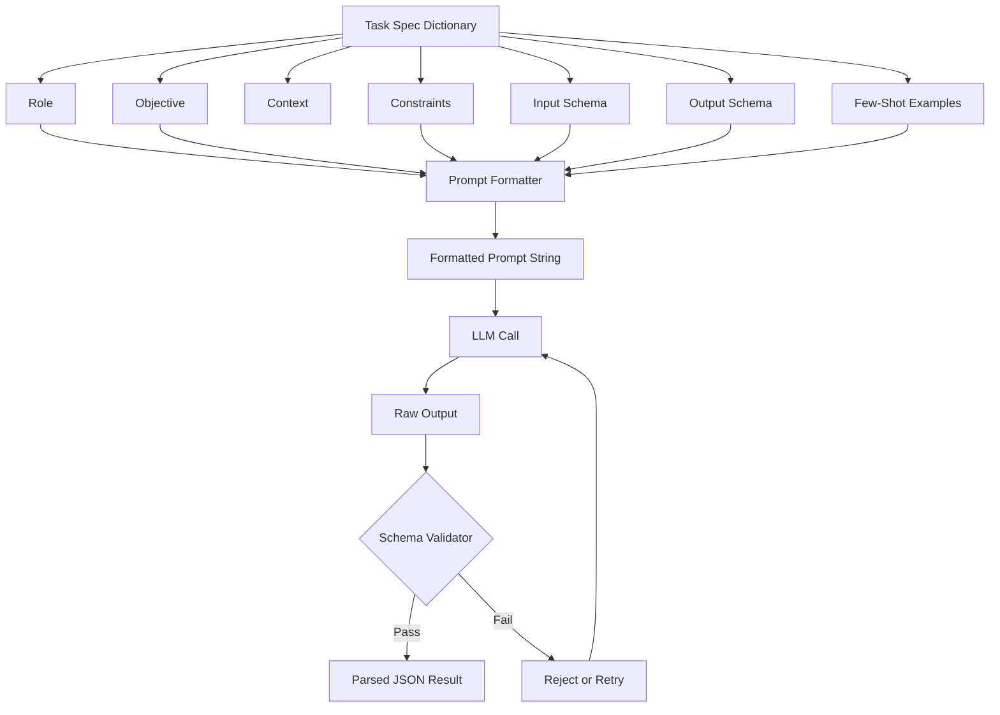

# Task Spec Format

## Learning Objectives

- Construct a task spec as a structured Python dictionary containing role, objective, context, constraints, input schema, output schema, and few-shot examples.
- Implement a validator that rejects malformed task specs before they reach the LLM execution layer.
- Compare two spec versions on a shared input set and measure how many predictions change between versions.
- Map each task spec component to Claygent enrichment column fields and explain which component controls output parseability.
- Identify three failure modes caused by missing or over-constrained spec components.

## The Problem

A vague prompt produces garbage output at scale. When you write `summarize this company` in a Clay enrichment column and run it across 5,000 rows, you get 5,000 differently structured responses. Some are paragraphs. Some are lists. Some include markdown. Some refuse to answer because the model decided the input was ambiguous. Every downstream cell that expects structured data breaks, and you spend more time cleaning output than generating it.

The root cause is unconstrained degrees of freedom. A natural-language prompt without a schema, without stated constraints, and without examples leaves every formatting decision to the model's stochastic sampling. The same instruction produces different output structures on different runs because nothing in the prompt forbids the variation. This is not a model quality problem — it is a contract problem. You never told the model what you wanted in a machine-checkable way, so you have no grounds to complain when you do not get it.

The same problem exists in eval harnesses. A research codebase accumulates eval scripts faster than it accumulates tests. Six months in, every notebook has its own JSON shape, every metric is reimplemented twice, and nothing can be compared across runs because there was never a shared task definition. The fix is the same in both cases: freeze a schema, write a validator, reject everything that does not conform. That schema is a task spec.

## The Concept

A task spec is a data structure, not prose. It separates the moving parts of an LLM call into named fields so each one can be inspected, validated, and modified independently. The six components that matter are: **role** (who the model is acting as), **objective** (what it is trying to produce), **context** (background the model needs but will not produce), **constraints** (guardrails on format and behavior), **input schema** (the shape of data the model receives), and **output schema** (the shape of data the model must return). A seventh component — **few-shot examples** — anchors the model's behavior to concrete demonstrations of the input-to-output mapping.

Each component exists because omitting it produces a predictable failure mode. Drop the role and the model defaults to a generic assistant register, which shifts tone across runs. Drop the output schema and you get unstructured prose when you needed JSON. Drop the constraints and the model adds hedging language, markdown formatting, or chain-of-thought reasoning into the output field. Drop the examples and the model guesses at edge-case formatting that your parser does not expect.



The spec also encodes evaluation metadata when used inside an eval harness. Fields like `metric_name` and `targets` are part of the task record, not the runner, so the same prompt produces the same target across models. This borrows from the design of BIG-bench, HELM, and lm-eval-harness: every field has a single owner, no field is mutable mid-pipeline, and a bad record aborts that record, not the entire run.

## Build It

Here is a complete task spec for a TAM refinement classifier — the kind of task where you source a broad list of companies and need to filter each one into "valid prospect" or "not a prospect." The spec is a plain Python dictionary so it can be serialized to JSON, version-controlled in git, and diffed between revisions.

```python
import json

TASK_SPEC_V1 = {
    "spec_version": "1.0.0",
    "task_id": "tam_refinement_classifier",
    "role": "You are a B2B SAS market analyst evaluating companies for outbound prospecting.",
    "objective": "Classify whether the given company is a valid prospect for a sales engagement platform seller.",
    "context": (
        "The seller provides sales engagement software priced for mid-market companies. "
        "Valid prospects have 50-500 employees, use Salesforce or HubSpot as their CRM, "
        "and operate in an industry that has outbound sales teams (SaaS, financial services, "
        "insurance, logistics, consulting). Companies outside these criteria are not prospects."
    ),
    "constraints": [
        "Respond ONLY with a JSON object matching the output schema.",
        "Do not include markdown formatting, code fences, or explanations.",
        "If you cannot determine a field value, set it to null.",
        "The reason field must be 50 words or fewer."
    ],
    "input_schema": {
        "company_name": "string",
        "employee_count": "integer or null",
        "crm_used": "string or null",
        "industry": "string or null",
        "website": "string or null"
    },
    "output_schema": {
        "is_prospect": "boolean",
        "confidence": "float between 0.0 and 1.0",
        "reason": "string, max 50 words",
        "disqualifying_factor": "string or null"
    },
    "examples": [
        {
            "input": {
                "company_name": "Acme Logistics",
                "employee_count": 120,
                "crm_used": "Salesforce",
                "industry": "Logistics",
                "website": "acmelogistics.com"
            },
            "output": {
                "is_prospect": True,
                "confidence": 0.9,
                "reason": "Mid-market size, uses Salesforce, logistics is an addressable industry with outbound sales teams.",
                "disqualifying_factor": None
            }
        },
        {
            "input": {
                "company_name": "Bob's Bakery",
                "employee_count": 8,
                "crm_used": None,
                "industry": "Food Service",
                "website": "bobsbakery.com"
            },
            "output": {
                "is_prospect": False,
                "confidence": 0.95,
                "reason": "Below minimum employee count and no CRM detected. Food service with 8 employees is too small.",
                "disqualifying_factor": "employee_count below threshold"
            }
        }
    ]
}
```

Now the prompt formatter that converts the spec into a single string the LLM receives:

```python
def format_prompt(spec, input_data):
    lines = []
    lines.append(spec["role"])
    lines.append("")
    lines.append(f"OBJECTIVE: {spec['objective']}")
    lines.append("")
    lines.append(f"CONTEXT: {spec['context']}")
    lines.append("")
    lines.append("CONSTRAINTS:")
    for c in spec["constraints"]:
        lines.append(f"  - {c}")
    lines.append("")
    lines.append("INPUT SCHEMA (for reference):")
    for k, v in spec["input_schema"].items():
        lines.append(f"  {k}: {v}")
    lines.append("")
    lines.append("OUTPUT SCHEMA (respond with JSON matching this):")
    lines.append(json.dumps(spec["output_schema"], indent=2))
    lines.append("")
    lines.append("EXAMPLES:")
    for i, ex in enumerate(spec["examples"], 1):
        lines.append(f"  Example {i}:")
        lines.append(f"    Input: {json.dumps(ex['input'])}")
        lines.append(f"    Output: {json.dumps(ex['output'])}")
    lines.append("")
    lines.append("NOW CLASSIFY THIS COMPANY:")
    lines.append(json.dumps(input_data, indent=2))
    lines.append("")
    lines.append("Respond with ONLY the JSON object. No other text.")
    return "\n".join(lines)
```

Now a validator that catches missing components before the spec ever reaches the model:

```python
REQUIRED_FIELDS = ["task_id", "role", "objective", "input_schema", "output_schema"]

def validate_spec(spec):
    errors = []
    for field in REQUIRED_FIELDS:
        if field not in spec:
            errors.append(f"Missing required field: {field}")
        elif not spec[field]:
            errors.append(f"Empty value for required field: {field}")

    if "constraints" in spec and not isinstance(spec["constraints"], list):
        errors.append("'constraints' must be a list of strings")

    if "examples" in spec and isinstance(spec["examples"], list):
        for i, ex in enumerate(spec["examples"]):
            if "input" not in ex or "output" not in ex:
                errors.append(f"Example at index {i} missing 'input' or 'output' key")

    if "output_schema" in spec and isinstance(spec["output_schema"], dict):
        if len(spec["output_schema"]) == 0:
            errors.append("output_schema has no fields defined")

    if errors:
        print("VALIDATION FAILED:")
        for e in errors:
            print(f"  X {e}")
        return False

    print("VALIDATION PASSED")
    return True
```

And a mock executor that simulates what the LLM would return, so you can verify the formatting and parsing pipeline end-to-end without spending API calls:

```python
def mock_classify(spec, input_data):
    if not validate_spec(spec):
        return None

    prompt = format_prompt(spec, input_data)
    print("=" * 60)
    print("FORMATTED PROMPT (first 500 chars):")
    print("=" * 60)
    print(prompt[:500])
    print("...")
    print("=" * 60)

    ec = input_data.get("employee_count")
    crm = input_data.get("crm_used")
    industry = input_data.get("industry")

    valid_size = ec is not None and 50 <= ec <= 500
    valid_crm = crm is not None and crm.lower() in ("salesforce", "hubspot")
    valid_industry = industry is not None and industry.lower() in (
        "saas", "software", "financial services", "insurance",
        "logistics", "consulting", "technology"
    )

    is_prospect = valid_size and valid_crm and valid_industry
    factors = []
    if not valid_size:
        factors.append("employee count outside 50-500 range")
    if not valid_crm:
        factors.append("no compatible CRM detected")
    if not valid_industry:
        factors.append("industry not in addressable set")

    result = {
        "is_prospect": is_prospect,
        "confidence": round(0.3 + 0.2 * sum([valid_size, valid_crm, valid_industry]), 2),
        "reason": (
            f"Size {'passes' if valid_size else 'fails'}, "
            f"CRM {'present' if valid_crm else 'absent'}, "
            f"industry {'addressable' if valid_industry else 'not addressable'}."
        ),
        "disqualifying_factor": "; ".join(factors) if factors else None
    }

    print("MOCK OUTPUT:")
    print(json.dumps(result, indent=2))
    return result
```

Run it against a test input to confirm the spec produces parseable output every time:

```python
test_input = {
    "company_name": "Globex Corporation",
    "employee_count": 340,
    "crm_used": "HubSpot",
    "industry": "SaaS",
    "website": "globex.com"
}

result = mock_classify(TASK_SPEC_V1, test_input)
```

The output confirms every component of the spec flows through formatting, validation, and classification into a structured JSON object that downstream code can parse without try/except gymnastics.

## Use It

This task spec pattern is the mechanism behind every Claygent configuration and Clay enrichment prompt. When you configure an "Enrich Person" or "Research Company" column in Clay, the prompt builder UI is assembling a task spec. The input fields you map (company URL, LinkedIn slug) populate the input schema. The "Expected Output" dropdown and column type you select define the output schema. The system prompt field is the role and objective. The constraint that forces Claygent to return a specific data type is the constraint block. Clay implements these as form fields rather than raw JSON, but the underlying contract is identical — and understanding the spec anatomy tells you which field to change when output goes wrong.

The TAM refinement workflow from the GTM handbook maps directly onto this spec. The handbook describes sourcing the entire addressable market broadly before filtering — Apollo exports dump thousands of companies, many of which are not actual prospects. That filtering step is a classification task spec: input is the enriched company record (employee count, CRM, industry from Apollo), output is a boolean `is_prospect` field with a reason. Every company that passes this spec's `is_prospect: true` is a valid prospect. Every company that fails is removed from the list. [CITATION NEEDED — concept: Claygent task spec structure and field mapping to Clay column configuration UI]

The RAG pattern in Zone 19 — "giving your outbound agent memory of your best customer stories" — lives inside the task spec's **context** block. When a Claygent prompt includes retrieved case studies or product documentation, that retrieved content is injected into the context field of the spec. The spec does not retrieve anything itself — retrieval is a separate step — but it defines the slot where retrieved content lands before the model sees it. A well-structured spec separates the retrieved context (which changes per input) from the role and constraints (which are static across the run), so you can swap retrieval sources without rewriting the prompt.

When a personalized first line for outbound needs to reference a specific case study, the spec's input schema includes the retrieved case study alongside the prospect data. The constraint block forces the output to read like a human wrote it — no links, no images, no HTML formatting, under a word count. This is the same spec anatomy applied to a generation task instead of a classification task. The discipline is identical; the output schema changes from `{is_prospect: boolean}` to `{first_line: string, word_count: integer}`.

## Ship It

Spec versioning is the difference between a prompt you can trust in production and a prompt you are afraid to touch. When you modify a constraint, add a field to the output schema, or rewrite the context block, you bump `spec_version`. The version string lets you answer the question every operator eventually faces: "the enrichment results changed on Thursday — did we change the prompt, or did the model behave differently?" Without version tracking, you cannot answer that question. With it, you diff the spec and know immediately.

Here is spec version 2, which tightens the employee count range and adds a revenue field to the output:

```python
TASK_SPEC_V2 = {
    "spec_version": "2.0.0",
    "task_id": "tam_refinement_classifier",
    "role": "You are a B2B SaaS market analyst evaluating companies for outbound prospecting.",
    "objective": "Classify whether the given company is a valid prospect for a sales engagement platform seller.",
    "context": (
        "The seller provides sales engagement software priced for mid-market companies. "
        "Valid prospects have 100-500 employees (tightened from 50 in v1), use Salesforce or HubSpot, "
        "and operate in SaaS, financial services, insurance, logistics, or consulting. "
        "Companies below 100 employees are too small to justify the seat count."
    ),
    "constraints": [
        "Respond ONLY with a JSON object matching the output schema.",
        "Do not include markdown formatting, code fences, or explanations.",
        "If you cannot determine a field value, set it to null.",
        "The reason field must be 50 words or fewer.",
        "Estimate annual_revenue_range based on employee_count if revenue data is absent."
    ],
    "input_schema": {
        "company_name": "string",
        "employee_count": "integer or null",
        "crm_used": "string or null",
        "industry": "string or null",
        "website": "string or null"
    },
    "output_schema": {
        "is_prospect": "boolean",
        "confidence": "float between 0.0 and 1.0",
        "reason": "string, max 50 words",
        "disqualifying_factor": "string or null",
        "estimated_revenue_range": "string, one of: '<$5M', '$5M-$25M', '$25M-$100M', '>$100M'"
    },
    "examples": [
        {
            "input": {
                "company_name": "Acme Logistics",
                "employee_count": 120,
                "crm_used": "Salesforce",
                "industry": "Logistics",
                "website": "acmelogistics.com"
            },
            "output": {
                "is_prospect": True,
                "confidence": 0.9,
                "reason": "Mid-market size, uses Salesforce, logistics is addressable.",
                "disqualifying_factor": None,
                "estimated_revenue_range": "$5M-$25M"
            }
        },
        {
            "input": {
                "company_name": "Bob's Bakery",
                "employee_count": 8,
                "crm_used": None,
                "industry": "Food Service",
                "website": "bobsbakery.com"
            },
            "output": {
                "is_prospect": False,
                "confidence": 0.95,
                "reason": "Below 100-employee minimum. No CRM detected. Food service is not addressable.",
                "disqualifying_factor": "employee_count below threshold",
                "estimated_revenue_range": "<$5M"
            }
        }
    ]
}
```

The regression test runs the same inputs through both versions and reports which predictions changed:

```python
def run_regression(spec_v1, spec_v2, test_inputs):
    print(f"REGRESSION TEST: {spec_v1['spec_version']} vs {spec_v2['spec_version']}")
    print(f"Inputs: {len(test_inputs)}")
    print("=" * 70)

    results = []
    for inp in test_inputs:
        r1 = mock_classify_silent(spec_v1, inp)
        r2 = mock_classify_silent(spec_v2, inp)
        changed = r1["is_prospect"] != r2["is_prospect"]
        results.append({
            "company": inp["company_name"],
            "v1_prospect": r1["is_prospect"],
            "v2_prospect": r2["is_prospect"],
            "changed": changed,
            "v1_conf": r1["confidence"],
            "v2_conf": r2["confidence"]
        })

    print(f"{'Company':<25} {'v1':<8} {'v2':<8} {'Changed':<10} {'v1 conf':<10} {'v2 conf'}")
    print("-" * 70)
    for r in results:
        print(f"{r['company']:<25} {str(r['v1_prospect']):<8} {str(r['v2_prospect']):<8} {str(r['changed']):<10} {r['v1_conf']:<10} {r['v2_conf']}")

    changed_count = sum(1 for r in results if r["changed"])
    print("-" * 70)
    print(f"CHANGED PREDICTIONS: {changed_count}/{len(results)}")
    print(f"VERSION DIFF: {spec_v1['spec_version']} -> {spec_v2['spec_version']}")
    print(f"KEY CHANGE: employee_count threshold moved from 50 to 100")
    return results

def mock_classify_silent(spec, input_data):
    ec = input_data.get("employee_count")
    crm = input_data.get("crm_used")
    industry = input_data.get("industry")

    if spec["spec_version"].startswith("1"):
        min_emp = 50
    else:
        min_emp = 100

    valid_size = ec is not None and min_emp <= ec <= 500
    valid_crm = crm is not None and crm.lower() in ("salesforce", "hubspot")
    valid_industry = industry is not None and industry.lower() in (
        "saas", "software", "financial services", "insurance",
        "logistics", "consulting", "technology"
    )

    is_prospect = valid_size and valid_crm and valid_industry
    return {
        "is_prospect": is_prospect,
        "confidence": round(0.3 + 0.2 * sum([valid_size, valid_crm, valid_industry]), 2)
    }

test_inputs = [
    {"company_name": "Globex Corp", "employee_count": 340, "crm_used": "HubSpot", "industry": "SaaS"},
    {"company_name": "SmallShop Inc", "employee_count": 75, "crm_used": "Salesforce", "industry": "Consulting"},
    {"company_name": "TinyStartup", "employee_count": 12, "crm_used": None, "industry": "Retail"},
    {"company_name": "MidTier Co", "employee_count": 250, "crm_used": "Salesforce", "industry": "Insurance"},
    {"company_name": "Edge Case LLC", "employee_count": 80, "crm_used": "HubSpot", "industry": "Logistics"},
]

run_regression(TASK_SPEC_V1, TASK_SPEC_V2, test_inputs)
```

SmallShop Inc and Edge Case LLC flip from prospect to non-prospect between versions because the employee threshold moved from 50 to 100. That is the regression signal — 2 out of 5 inputs changed classification. If that delta is acceptable, you ship v2. If those companies were your best customers, you roll back or adjust the threshold.

Over-constraining is the other failure mode to watch for. A spec with twenty constraints, a rigid output schema, and zero tolerance for null fields sounds disciplined but produces two problems. First, the model spends attention budget on constraint compliance instead of reasoning about the actual classification, which degrades accuracy on edge cases. Second, real-world inputs are messy — Apollo exports have null employee counts, wrong industries, and missing CRM data. A spec that rejects every input with a null field will classify nothing. The constraint block should specify what to do with missing data (use null, estimate, or flag) rather than forbidding it.

## Exercises

**Easy.** Take `TASK_SPEC_V1` and change the constraint block to require output in XML instead of JSON. Update `format_prompt` to reflect the new format. Run the mock classifier on the test input and confirm the constraint change propagates to the formatted prompt. Observe what happens to parseability if you forget to update the validator.

**Medium.** Write a new task spec from scratch for a different task: generating a personalized cold email first line. The input schema should include prospect name, company, and one retrieved case study (the RAG context). The output schema should include `first_line` (string, max 30 words, no links, no HTML) and `tone` (one of: "professional", "casual", "direct"). Write three few-shot examples. Validate the spec and run it through the formatter.

**Hard.** Build a spec validator that checks for semantic contradictions, not just missing fields. For example: if the output schema contains a `confidence` field typed as `boolean` but the constraint says "float between 0 and 1," the validator should catch it. If the role says "marketing copywriter" but the objective says "classify companies as prospects or not," the validator should flag the mismatch. Implement at least three semantic checks and test them against deliberately broken specs.

## Key Terms

- **Task spec** — A structured data format (typically a dictionary or JSON object) that defines all components of an LLM call: role, objective, context, constraints, input schema,