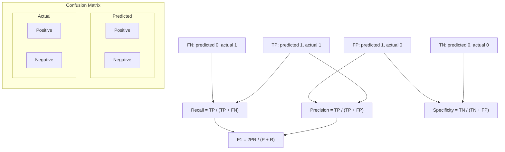

# Classical Metrics

## Learning Objectives

- Build a confusion matrix from raw prediction arrays and derive precision, recall, F1, specificity, and accuracy from its four cells.
- Implement BLEU-4 from modified n-gram precision, geometric mean, and brevity penalty — no libraries beyond stdlib and numpy.
- Implement ROUGE-L using longest common subsequence with F-beta combination.
- Compare metrics side by side on an imbalanced dataset to observe which metrics break and which hold when the positive class is rare.
- Write a metrics report function that returns all scores as a dictionary, suitable for attaching to any model evaluation PR.

## The Problem

You built a lead scoring classifier. It's 95% accurate. It also flagged every single lead as "not qualified" — including the ones that were. Accuracy reported 95% because 95% of your leads genuinely aren't qualified, so predicting "no" for everything gets you a high score while being completely useless to your SDR team. The metric lied because it was optimized for the wrong question.

This is the class imbalance trap, and it shows up everywhere in GTM. A typical pipeline has 3-5% of leads as truly qualified. A model that predicts "not qualified" for all of them achieves 95-97% accuracy and zero pipeline contribution. The same trap exists in NLP evaluation: you report BLEU 0.283 from one library and BLEU 28.3 from another, and the numbers aren't comparable because the tokenizer differs. You can't fix either problem without understanding what the metrics actually count.

The fastest way to stop being confused by metrics — classification or generation — is to implement them from first principles. Count the cells. Compute the ratios. Read the code. After that, comparing numbers across papers or dashboards becomes a matter of reading the setup, not arguing about libraries.

## The Concept

Every classification metric starts from the confusion matrix — a 2×2 table that partitions predictions by whether they match ground truth. Once you have the four cells (true positives, false positives, false negatives, true negatives), every metric you need is a ratio of those cells. The disagreement between metrics is not a bug; it's each metric answering a different question about what errors cost.



Precision asks: "Of everything I flagged as positive, how much was actually positive?" In lead scoring, this is the fraction of leads you routed to SDRs that were truly qualified. Low precision means SDRs waste time on bad conversations. Recall asks: "Of everything that was actually positive, how much did I catch?" This is the fraction of qualified leads you identified. Low recall means pipeline leaks — qualified leads slip through because your model never flagged them. These two metrics pull in opposite directions. If you flag more leads as positive, recall goes up (you catch more) but precision goes down (you're wrong more often). That tension is the precision-recall tradeoff, and it operates like a dial: you tune your threshold based on which error costs more.

F1 is the harmonic mean of precision and recall — it penalizes imbalance between the two, so you can't inflate it by making one metric look good at the expense of the other. Specificity measures the true negative rate: of all the actual negatives, how many did you correctly leave alone? Accuracy weights all four cells equally, which is why it collapses under class imbalance — when 95% of your data is negative, a model that always predicts negative gets 95% accuracy with zero recall.

On the generation side, BLEU measures n-gram overlap between a candidate text and reference texts. It computes modified n-gram precision for n=1 through 4, takes the geometric mean, and applies a brevity penalty so short outputs can't cheat. ROUGE-L measures the longest common subsequence between candidate and reference, combined as an F-beta score. Both are tokenization-sensitive — the tokenizer decision is where scores diverge across libraries.

## Build It

Start with the confusion matrix and the five classification metrics derived from it. Every metric is a function of four counts.

```python
def confusion_matrix(y_true, y_pred):
    tp = sum(1 for t, p in zip(y_true, y_pred) if t == 1 and p == 1)
    fp = sum(1 for t, p in zip(y_true, y_pred) if t == 0 and p == 1)
    fn = sum(1 for t, p in zip(y_true, y_pred) if t == 1 and p == 0)
    tn = sum(1 for t, p in zip(y_true, y_pred) if t == 0 and p == 0)
    return {"tp": tp, "fp": fp, "fn": fn, "tn": tn}

def precision(cm):
    denom = cm["tp"] + cm["fp"]
    return cm["tp"] / denom if denom else 0.0

def recall(cm):
    denom = cm["tp"] + cm["fn"]
    return cm["tp"] / denom if denom else 0.0

def f1_score(cm):
    p, r = precision(cm), recall(cm)
    return 2 * p * r / (p + r) if (p + r) else 0.0

def specificity(cm):
    denom = cm["tn"] + cm["fp"]
    return cm["tn"] / denom if denom else 0.0

def accuracy(cm):
    total = sum(cm.values())
    return (cm["tp"] + cm["tn"]) / total if total else 0.0

y_true = [1, 1, 0, 1, 0, 0, 1, 0, 0, 0]
y_pred = [1, 0, 0, 1, 0, 1, 1, 0, 0, 0]

cm = confusion_matrix(y_true, y_pred)
print("Confusion Matrix:", cm)
print(f"Precision:   {precision(cm):.3f}")
print(f"Recall:      {recall(cm):.3f}")
print(f"F1:          {f1_score(cm):.3f}")
print(f"Specificity: {specificity(cm):.3f}")
print(f"Accuracy:    {accuracy(cm):.3f}")
```

Run that and you get a side-by-side view of how each metric responds to the same predictions. Now show why accuracy breaks under class imbalance — build a dataset that's 95% negative and a classifier that predicts "always negative":

```python
n = 200
n_positive = 10
y_true_imbalanced = [1] * n_positive + [0] * (n - n_positive)
y_pred_always_neg = [0] * n

cm_imb = confusion_matrix(y_true_imbalanced, y_pred_always_neg)
print("\n--- Imbalanced Dataset (95% negative) ---")
print("Confusion Matrix:", cm_imb)
print(f"Accuracy:    {accuracy(cm_imb):.3f}")
print(f"Recall:      {recall(cm_imb):.3f}")
print(f"Precision:   {precision(cm_imb):.3f}")
print(f"F1:          {f1_score(cm_imb):.3f}")
print(f"Specificity: {specificity(cm_imb):.3f}")
```

Accuracy reads 95%. Recall reads 0%. F1 reads 0%. This is the exact failure mode: accuracy looks great, pipeline contribution is zero. Now implement BLEU-4 for generation tasks — modified n-gram precision, geometric mean, brevity penalty:

```python
import re
import math
from collections import Counter

TOKEN_RE = re.compile(r"\w+", re.UNICODE)

def tokenize(text):
    return TOKEN_RE.findall(text.lower())

def get_ngrams(tokens, n):
    return [tuple(tokens[i:i+n]) for i in range(len(tokens) - n + 1)]

def modified_precision(candidate, references, n):
    cand_ngrams = Counter(get_ngrams(candidate, n))
    max_ref = Counter()
    for ref in references:
        ref_counts = Counter(get_ngrams(ref, n))
        for gram, count in ref_counts.items():
            max_ref[gram] = max(max_ref[gram], count)
    clipped = sum(min(c, max_ref.get(g, 0)) for g, c in cand_ngrams.items())
    total = sum(cand_ngrams.values())
    return clipped / total if total else 0.0

def brevity_penalty(candidate, references):
    cand_len = len(candidate)
    ref_lens = [len(r) for r in references]
    closest = min(ref_lens, key=lambda l: (abs(l - cand_len), l))
    if cand_len > closest:
        return 1.0
    return math.exp(1 - closest / cand_len) if cand_len else 0.0

def bleu4(candidate_text, reference_texts):
    candidate = tokenize(candidate_text)
    references = [tokenize(r) for r in reference_texts]
    bp = brevity_penalty(candidate, references)
    precisions = []
    for n in range(1, 5):
        p = modified_precision(candidate, references, n)
        precisions.append(p if p > 0 else 1e-10)
    geo_mean = math.exp(sum(math.log(p) for p in precisions) / 4)
    return bp * geo_mean

candidate = "the cat sat on the mat"
references = ["the cat is on the mat", "a cat sat on a mat"]
print(f"\nBLEU-4: {bleu4(candidate, references):.4f}")
```

Now ROUGE-L — longest common subsequence via dynamic programming, combined as F-beta:

```python
def lcs_length(a, b):
    m, n = len(a), len(b)
    dp = [[0] * (n + 1) for _ in range(m + 1)]
    for i in range(1, m + 1):
        for j in range(1, n + 1):
            if a[i-1] == b[j-1]:
                dp[i][j] = dp[i-1][j-1] + 1
            else:
                dp[i][j] = max(dp[i-1][j], dp[i][j-1])
    return dp[m][n]

def rouge_l(candidate_text, reference_text, beta=1.0):
    candidate = tokenize(candidate_text)
    reference = tokenize(reference_text)
    if not candidate or not reference:
        return 0.0
    lcs = lcs_length(candidate, reference)
    if lcs == 0:
        return 0.0
    r_lcs = lcs / len(reference)
    p_lcs = lcs / len(candidate)
    denom = r_lcs + beta**2 * p_lcs
    return ((1 + beta**2) * p_lcs * r_lcs) / denom if denom else 0.0

cand = "the cat sat on the mat"
ref = "the cat is on the mat"
print(f"ROUGE-L: {rouge_l(cand, ref):.4f}")

cand2 = "fast brown fox jumps"
ref2 = "the quick brown fox jumps over the lazy dog"
print(f"ROUGE-L (partial): {rouge_l(cand2, ref2):.4f}")
```

The tokenizer is `re.findall(r"\w+", text.lower())` — lowercase, alphanumeric runs, drop punctuation. Every metric in this lesson uses this exact tokenizer. If you swap tokenizers, you are running a different benchmark. This is a deliberate simplification; production systems may use subword tokenization or spaCy, but the principle holds: the tokenizer is part of the metric definition, not an implementation detail.

## Use It

Lead scoring produces binary outcomes: qualified or not qualified. A model that flags 100 leads as qualified and gets 5 right has 5% precision — your SDR team just burned 95 conversations on dead leads. That's the precision-recall tradeoff applied directly to pipeline. When false positives are expensive (SDR time, account research, personalized sequencing), you optimize for precision. When false negatives are expensive (missed enterprise deals, churned expansion opportunities), you optimize for recall. The threshold you set on your classifier's probability output is the dial that moves between these two costs.

Intent signal classifiers have the same structure. A model that scores "high intent" on accounts has some error rate in each direction. Flagging a dead account as high-intent costs your team a sequencing slot. Missing a high-intent account costs you a deal that was ready to buy. Which costs more depends on your ACV and your team's capacity — but the point is that accuracy cannot tell you which model is better for your situation. Precision and recall can, because they separate the two error types. Specificity tells you how well your model leaves the noise alone, which matters when the negative class is large.

For generation tasks — RAG-sourced email copy, personalized landing pages, chatbot responses — BLEU and ROUGE-L measure how close the output matches reference text. In a RAG pipeline where your outbound agent retrieves case studies and generates outreach, ROUGE-L against your best-performing human-written emails gives you a signal for whether the generation is in the neighborhood of what works. BLEU on n-gram overlap catches whether the model is reproducing key product terms. Both are coarse — high BLEU doesn't mean the email will book a meeting — but they catch degradation. If BLEU drops from 0.35 to 0.12 after a prompt change, something broke. Relates to GTM signal evaluation in [CITATION NEEDED — concept: GTM signal evaluation cluster in gtm-topic-map.md].

## Ship It

Write a metrics report function that takes ground truth and predictions, returns everything as a dictionary, and prints a formatted summary. This is what you attach to any model evaluation PR — classification or generation.

```python
import re
import math
import json
from collections import Counter

TOKEN_RE = re.compile(r"\w+", re.UNICODE)

def tokenize(text):
    return TOKEN_RE.findall(text.lower())

def get_ngrams(tokens, n):
    return [tuple(tokens[i:i+n]) for i in range(len(tokens) - n + 1)]

def lcs_length(a, b):
    m, n = len(a), len(b)
    dp = [[0] * (n + 1) for _ in range(m + 1)]
    for i in range(1, m + 1):
        for j in range(1, n + 1):
            if a[i-1] == b[j-1]:
                dp[i][j] = dp[i-1][j-1] + 1
            else:
                dp[i][j] = max(dp[i-1][j], dp[i][j-1])
    return dp[m][n]

def metrics_report(y_true=None, y_pred=None, candidate_text=None, reference_texts=None):
    report = {}
    
    if y_true is not None and y_pred is not None:
        tp = sum(1 for t, p in zip(y_true, y_pred) if t == 1 and p == 1)
        fp = sum(1 for t, p in zip(y_true, y_pred) if t == 0 and p == 1)
        fn = sum(1 for t, p in zip(y_true, y_pred) if t == 1 and p == 0)
        tn = sum(1 for t, p in zip(y_true, y_pred) if t == 0 and p == 0)
        cm = {"tp": tp, "fp": fp, "fn": fn, "tn": tn}
        
        p = tp / (tp + fp) if (tp + fp) else 0.0
        r = tp / (tp + fn) if (tp + fn) else 0.0
        f1 = 2 * p * r / (p + r) if (p + r) else 0.0
        spec = tn / (tn + fp) if (tn + fp) else 0.0
        acc = (tp + tn) / (tp + fp + fn + tn) if (tp + fp + fn + tn) else 0.0
        
        report["classification"] = {
            "confusion_matrix": cm,
            "precision": round(p, 4),
            "recall": round(r, 4),
            "f1": round(f1, 4),
            "specificity": round(spec, 4),
            "accuracy": round(acc, 4),
        }
    
    if candidate_text is not None and reference_texts is not None:
        candidate = tokenize(candidate_text)
        references = [tokenize(rt) for rt in reference_texts]
        
        bp = brevity_penalty_impl(candidate, references)
        precisions = []
        for n in range(1, 5):
            mp = modified_precision_impl(candidate, references, n)
            precisions.append(mp if mp > 0 else 1e-10)
        bleu = bp * math.exp(sum(math.log(p) for p in precisions) / 4)
        
        best_rouge = 0.0
        for ref in references:
            if not candidate or not ref:
                continue
            lcs = lcs_length(candidate, ref)
            if lcs == 0:
                continue
            r_lcs = lcs / len(ref)
            p_lcs = lcs / len(candidate)
            f_lcs = (2 * p_lcs * r_lcs) / (p_lcs + r_lcs) if (p_lcs + r_lcs) else 0.0
            best_rouge = max(best_rouge, f_lcs)
        
        report["generation"] = {
            "bleu4": round(bleu, 4),
            "rouge_l": round(best_rouge, 4),
        }
    
    return report

def brevity_penalty_impl(candidate, references):
    cand_len = len(candidate)
    ref_lens = [len(r) for r in references]
    closest = min(ref_lens, key=lambda l: (abs(l - cand_len), l))
    if cand_len > closest:
        return 1.0
    return math.exp(1 - closest / cand_len) if cand_len else 0.0

def modified_precision_impl(candidate, references, n):
    cand_ngrams = Counter(get_ngrams(candidate, n))
    max_ref = Counter()
    for ref in references:
        ref_counts = Counter(get_ngrams(ref, n))
        for gram, count in ref_counts.items():
            max_ref[gram] = max(max_ref[gram], count)
    clipped = sum(min(c, max_ref.get(g, 0)) for g, c in cand_ngrams.items())
    total = sum(cand_ngrams.values())
    return clipped / total if total else 0.0

y_true = [1, 0, 1, 1, 0, 0, 1, 0, 1, 0]
y_pred = [1, 0, 0, 1, 0, 1, 1, 0, 1, 0]
cand = "our platform reduces deployment time by forty percent"
refs = ["our platform cuts deployment time by forty percent", "deployment time is reduced by forty percent with our platform"]

report = metrics_report(y_true=y_true, y_pred=y_pred, candidate_text=cand, reference_texts=refs)
print(json.dumps(report, indent=2))
```

The function dispatches on what you pass it — classification arrays, generation strings, or both. Attach the JSON output to your PR and reviewers can see exactly what moved. No libraries beyond stdlib, so the numbers are reproducible without `pip install`.

## Exercises

**Easy.** Given a confusion matrix with TP=40, FP=10, FN=20, TN=130, compute precision, recall, F1, and specificity by hand (or in code). Verify your results against the `metrics_report` function.

**Medium.** Build the full `metrics_report` function from scratch using only raw prediction arrays. Then construct two classifiers on the same imbalanced dataset (95% negative): one that predicts all-negative, and one that predicts positive for the top 10% by some score. Compare their precision, recall, and F1. Explain which one you would ship.

**Hard.** Given a dataset with a 98/2 class split, construct a classifier that achieves >95% accuracy but 0% recall. Then modify the classifier to achieve >50% recall while accepting >50% precision drop. Compute all metrics for both versions. Write a one-paragraph explanation of why accuracy is misleading in this regime and which metric(s) a GTM team should report instead when evaluating a lead scoring model.

## Key Terms

- **Confusion Matrix** — A 2×2 table partitioning predictions into true positives (TP), false positives (FP), false negatives (FN), and true negatives (TN). Every binary classification metric is derived from these four cells.
- **Precision** — TP / (TP + FP). Of everything predicted positive, how much was actually positive. Low precision means many false alarms.
- **Recall** — TP / (TP + FN). Of everything actually positive, how much was caught. Low recall means missed opportunities. Also called sensitivity or true positive rate.
- **F1 Score** — The harmonic mean of precision and recall: 2PR / (P + R). Penalizes imbalance between the two, so you can't inflate it by trading one for the other.
- **Specificity** — TN / (TN + FP). Of everything actually negative, how much was correctly left alone. The true negative rate.
- **Accuracy** — (TP + TN) / Total. Weighs all four cells equally. Breaks under class imbalance because the majority class dominates the score.
- **BLEU-4** — Modified n-gram precision for n=1..4, geometric mean, brevity penalty. Measures n-gram overlap between candidate and reference text. Used for machine translation and text generation evaluation.
- **ROUGE-L** — Longest common subsequence between candidate and reference, combined as an F-beta score. Measures sequence-level overlap without requiring contiguous matching. Used for summarization and generation evaluation.
- **Precision-Recall Tradeoff** — The inverse relationship between precision and recall as the classification threshold moves. Lowering the threshold increases recall (catch more positives) but decreases precision (more false positives). The threshold is a dial tuned by the relative cost of each error type.

## Sources

- [CITATION NEEDED — concept: GTM signal evaluation cluster in gtm-topic-map.md] — lead scoring, ICP matching, and intent signal evaluation as applications of precision/recall tradeoff in GTM workflows.
- BLEU metric: Papineni, K., Roukos, S., Ward, T., & Zhu, W. J. (2002). "BLEU: a Method for Automatic Evaluation of Machine Translation." ACL 2002.
- ROUGE metric: Lin, C. Y. (2004). "ROUGE: A Package for Automatic Evaluation of Summaries." Text Summarization Branches Out, ACL 2004 Workshop.