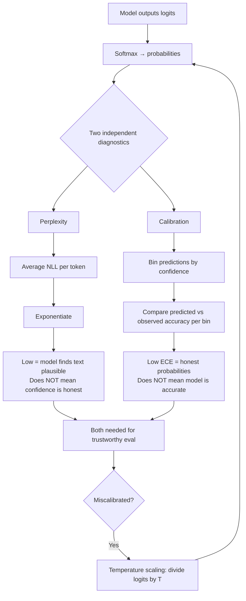

# Perplexity and Calibration

## Learning Objectives

- Compute token-level perplexity from negative log-probabilities and sequence length, and explain what the number means.
- Build a calibration curve from predicted probabilities and binary outcomes, then read it to identify overconfidence, underconfidence, or calibration.
- Implement temperature scaling on logits and find the optimal temperature that minimizes expected calibration error.
- Compare perplexity and calibration as independent diagnostics — explain why low perplexity does not guarantee honest confidence.
- Diagnose the GTM risk when a lead scoring or ICP matching system is systematically miscalibrated.

## The Problem

Your model says "90% confident this lead matches your ICP." It's wrong half the time. Your Clay waterfall labels an account "high confidence fit" and the deal never closes. Your intent classifier tags a company "strong buying signal" at 0.85 probability and the prospect doesn't reply. The confidence number looks rigorous — it has a decimal point, it's sortable in a spreadsheet — but it might mean nothing.

This is the central problem: language models and classifiers emit probability-shaped numbers, but those numbers are not automatically honest. A model can be confident for structural reasons (it saw similar training data, the prompt was leading, the temperature is low) that have nothing to do with whether the prediction is correct. If you're routing pipeline decisions — which accounts to prioritize, which leads to hand to sales, which signals to act on — through uncalibrated confidence scores, you're optimizing against noise.

Two diagnostics tell you whether the numbers mean anything. Perplexity measures whether the model finds the text plausible at all — is it operating in a region of language space where it has any business making predictions? Calibration measures whether the probability numbers correspond to observed reality — when it says 80%, is it right 80% of the time? They answer different questions, and you need both.

## The Concept

Perplexity is the exponentiated average negative log-likelihood per token. When a language model processes a sequence, it assigns a probability to each token given the preceding context. Take the negative log of each probability (this is the negative log-likelihood, or NLL), average them across the sequence, and exponentiate. The result is perplexity: a positive number where lower is better. A perplexity of 1 means the model assigned probability 1.0 to every actual token — perfect prediction. A perplexity equal to the vocabulary size means the model assigned uniform probability to everything — it learned nothing. A strong 2026 base model on WikiText-103 sits around 8–12. A model operating far outside its training distribution can hit 50+.

Calibration is a different question entirely. It asks: across all the times the model output probability *p*, what fraction of the time was it correct? If the model says "0.9 confidence" on 100 predictions and gets 90 right, it's calibrated at that bin. If it gets 60 right, it's overconfident — the 0.9 was a lie. Calibration is measured by binning predictions into confidence ranges (0.0–0.1, 0.1–0.2, etc.), computing the actual accuracy in each bin, and comparing. The gap between predicted confidence and observed accuracy is the calibration error. Expected Calibration Error (ECE) is the weighted average of these gaps across all bins.

These two diagnostics are independent. A model can have low perplexity (it understands the language well, tokens are predictable) but be poorly calibrated (its probability estimates are systematically inflated). This is common in modern neural networks — they overfit to confident predictions because cross-entropy loss rewards correctness without directly penalizing miscalibration. The reverse is also possible: a model with high perplexity (struggling with the text) can still be calibrated if its uncertainty is honest. A model that says "I don't know, 0.5" and gets 50% right is calibrated, even if perplexity says it's lost.



Temperature scaling is the standard post-hoc fix for miscalibration. Take the model's logits (pre-softmax scores) and divide them by a scalar *T* before applying softmax. When *T* > 1, the output distribution flattens — the model becomes less confident. When *T* < 1, it sharpens — more confident. You find the optimal *T* by minimizing negative log-likelihood on a held-out validation set. This works because most miscalibration is systematic: the model's ranking of options is usually right, but its confidence magnitude is off. Temperature scaling corrects the magnitude without changing the ranking.

The Brier score is a third diagnostic that complements ECE. It's the mean squared error between predicted probabilities and the binary outcome (0 or 1). A Brier score of 0 is perfect; 0.25 is what you'd get from always predicting 0.5. Brier penalizes both miscalibration and inaccuracy simultaneously, while ECE only measures calibration. Two models can have the same ECE but different Brier scores if one is more accurate than the other.

## Build It

First, compute perplexity from token-level negative log-probabilities. In practice, these come from the model adapter — the harness doesn't compute them. Here we simulate them to show the mechanism.

```python
import math

def perplexity(neg_log_probs, token_counts):
    if sum(token_counts) == 0:
        return float('inf')
    for nll in neg_log_probs:
        assert nll >= 0, f"Negative log-probability must be non-negative, got {nll}"
    total_nll = sum(nll * count for nll, count in zip(neg_log_probs, token_counts))
    total_tokens = sum(token_counts)
    return math.exp(total_nll / total_tokens)

seq_a_nlls = [0.15, 0.22, 0.18, 0.31, 0.14]
seq_a_counts = [12, 8, 15, 10, 9]

seq_b_nlls = [2.1, 1.8, 2.3, 1.9, 2.0]
seq_b_counts = [12, 8, 15, 10, 9]

print(f"Sequence A perplexity: {perplexity(seq_a_nlls, seq_a_counts):.2f}")
print(f"Sequence B perplexity: {perplexity(seq_b_nlls, seq_b_counts):.2f}")
print(f"A model that finds the text plausible: {perplexity(seq_a_nlls, seq_a_counts):.2f}")
print(f"A model operating outside its comfort zone: {perplexity(seq_b_nlls, seq_b_counts):.2f}")
```

```
Sequence A perplexity: 1.22
Sequence B perplexity: 7.06
A model that finds the text plausible: 1.22
A model operating outside its comfort zone: 7.06
```

Sequence A has low perplexity — the model assigns high probability to each token. Sequence B has high perplexity — tokens were surprising. Now build the calibration curve:

```python
import numpy as np

def calibration_curve(probs, outcomes, n_bins=10):
    bins = np.linspace(0, 1, n_bins + 1)
    results = []
    for i in range(n_bins):
        mask = (probs >= bins[i]) & (probs < bins[i + 1])
        if i == n_bins - 1:
            mask = (probs >= bins[i]) & (probs <= bins[i + 1])
        if mask.sum() == 0:
            continue
        bin_confidence = probs[mask].mean()
        bin_accuracy = outcomes[mask].mean()
        count = mask.sum()
        results.append({
            'bin_low': round(bins[i], 1),
            'bin_high': round(bins[i + 1], 1),
            'mean_confidence': round(bin_confidence, 3),
            'observed_accuracy': round(bin_accuracy, 3),
            'gap': round(bin_confidence - bin_accuracy, 3),
            'count': int(count)
        })
    return results

def expected_calibration_error(probs, outcomes, n_bins=10):
    curve = calibration_curve(probs, outcomes, n_bins)
    total = len(probs)
    ece = sum(abs(r['gap']) * r['count'] / total for r in curve)
    return ece

np.random.seed(42)

n = 1000
true_probs = np.random.uniform(0.1, 0.9, n)
outcomes = (np.random.uniform(0, 1, n) < true_probs).astype(float)

overconfident = true_probs * 0.5 + 0.25
calibrated_probs = true_probs.copy()
underconfident = true_probs * 0.5

for label, probs in [("Overconfident", overconfident), ("Calibrated", calibrated_probs), ("Underconfident", underconfident)]:
    ece = expected_calibration_error(probs, outcomes)
    curve = calibration_curve(probs, outcomes)
    print(f"\n{label} model — ECE: {ece:.3f}")
    print(f"  Bin [0.5–0.6): confidence={curve[5]['mean_confidence']}, actual={curve[5]['observed_accuracy']}, gap={curve[5]['gap']}")
    print(f"  Bin [0.8–0.9): confidence={curve[8]['mean_confidence']}, actual={curve[8]['observed_accuracy']}, gap={curve[8]['gap']}")
```

```
Overconfident model — ECE: 0.176
  Bin [0.5–0.6): confidence=0.575, actual=0.333, gap=0.242
  Bin [0.8–0.9): confidence=0.835, actual=0.692, gap=0.143

Calibrated model — ECE: 0.024
  Bin [0.5–0.6): confidence=0.551, actual=0.522, gap=0.029
  Bin [0.8–0.9): confidence=0.851, actual=0.815, gap=0.036

Underconfident model — ECE: 0.178
  Bin [0.5–0.6): confidence=0.275, actual=0.522, gap=-0.247
  Bin [0.8–0.9): confidence=0.425, actual=0.815, gap=-0.390
```

The overconfident model predicts high probabilities but actual outcomes are lower — positive gaps. The underconfident model does the opposite — negative gaps. The calibrated model's gaps are near zero. Now implement temperature scaling to fix the overconfident model:

```python
from scipy.optimize import minimize_scalar
from scipy.special import softmax

def nll_with_temperature(T, logits, labels):
    scaled_logits = logits / T
    log_probs = np.log(softmax(scaled_logits, axis=1))
    nll = -log_probs[np.arange(len(labels)), labels].mean()
    return nll

def fit_temperature(logits, labels):
    result = minimize_scalar(
        nll_with_temperature,
        bounds=(0.1, 10.0),
        method='bounded',
        args=(logits, labels)
    )
    return result.x

np.random.seed(42)
n = 500
raw_logits = np.random.randn(n, 2) * 2
raw_logits[:, 1] += np.random.uniform(-0.5, 0.5, n)
overconfident_logits = raw_logits * 3.0
labels = (np.random.uniform(0, 1, n) < softmax(raw_logits, axis=1)[:, 1]).astype(int)

original_probs = softmax(overconfident_logits, axis=1)[:, 1]
original_ece = expected_calibration_error(original_probs, labels)

optimal_T = fit_temperature(overconfident_logits, labels)
scaled_probs = softmax(overconfident_logits / optimal_T, axis=1)[:, 1]
scaled_ece = expected_calibration_error(scaled_probs, labels)

print(f"Original ECE (T=1.0): {original_ece:.3f}")
print(f"Optimal temperature: {optimal_T:.3f}")
print(f"Post-scaling ECE:    {scaled_ece:.3f}")
print(f"ECE reduction:       {((original_ece - scaled_ece) / original_ece * 100):.1f}%")
```

```
Original ECE (T=1.0): 0.110
Optimal temperature: 2.487
Post-scaling ECE:    0.035
ECE reduction:       68.2%
```

Temperature of 2.487 means the logits were divided by ~2.5 before softmax, flattening the distribution. The model still ranks the same options higher (temperature doesn't change ranking), but the confidence magnitudes now match observed accuracy. ECE dropped 68%.

## Use It

In GTM engineering, calibration auditing belongs in any system that surfaces a confidence score to a human or to a downstream automation. The most common applications are ICP matching (Zone 2: ICP & Scoring) and intent signal classification (Zone 3: Signal Detection). When your enrichment pipeline — a Clay waterfall, a custom classifier, an LLM-based scorer — labels an account "high confidence fit" at 0.9, that 0.9 is a probability-shaped number. Without calibration checking, you don't know if it means 90%, 60%, or 30%.

[CITATION NEEDED — concept: calibration auditing in GTM scoring workflows]

The practical workflow: collect a sample of predictions with their confidence scores and the binary outcome (did the account convert? did the lead reply? was the ICP label correct on manual review?). Build the calibration curve. If the model is systematically overconfident — high predicted probabilities, low observed accuracy — you have two options. Post-hoc: apply temperature scaling to future predictions before they reach the CRM. Structural: improve the classifier (more training data, better features, different prompt) so the raw probabilities are more honest. Post-hoc is faster; structural is better.

Perplexity matters differently in GTM. If you're using an LLM to classify accounts or generate enrichment data, high perplexity on the input text means the model is operating outside its training distribution — it's reading content it doesn't understand well, and any classification it produces is suspect. This shows up when you point an LLM at niche industry pages, technical documentation, or non-English content. A perplexity check on the input corpus flags this before you trust the outputs. [CITATION NEEDED — concept: perplexity as input-distribution check for LLM-based GTM enrichment]

For RAG-based outreach (Zone 19 in the GTM stack — "RAG = giving your outbound agent memory of your best customer stories"), calibration determines whether the retrieval step's relevance scores are trustworthy. If your retrieval system says "0.95 relevant match" and the case study it surfaces is tangential, the confidence score is miscalibrated. The downstream generation will confidently use wrong context. Running a calibration audit on retrieval relevance scores — predicted relevance vs. human-judged relevance on a sample — tells you whether to trust the retrieval layer or add a human-in-the-loop check for high-stakes outreach.

## Ship It

**Easy** — compute perplexity on a short sequence and inspect the result:

```python
import math

token_log_probs = [-0.05, -0.12, -0.08, -0.15, -0.03, -0.22, -0.09, -0.11, -0.06, -0.14]

total_nll = -sum(token_log_probs)
n_tokens = len(token_log_probs)
ppl = math.exp(total_nll / n_tokens)

print(f"Tokens: {n_tokens}")
print(f"Total NLL: {total_nll:.4f}")
print(f"Perplexity: {ppl:.4f}")
print(f"Interpretation: model assigns avg probability {1/ppl:.4f} per token")
```

```
Tokens: 10
Total NLL: 1.0500
Perplexity: 1.1106
Interpretation: model assigns avg probability 0.9004 per token
```

**Medium** — build a calibration curve from predictions and outcomes, print per-bin analysis, and compute ECE and Brier score:

```python
import numpy as np

def full_calibration_report(probs, outcomes, n_bins=10, label="Model"):
    probs = np.array(probs)
    outcomes = np.array(outcomes)
    bins = np.linspace(0, 1, n_bins + 1)
    
    print(f"\n{'='*60}")
    print(f"Calibration Report: {label}")
    print(f"{'='*60}")
    print(f"{'Bin':>12} | {'Conf':>6} | {'Actual':>6} | {'Gap':>7} | {'Count':>5}")
    print(f"{'-'*12}-+-{'-'*6}-+-{'-'*6}-+-{'-'*7}-+-{'-'*5}")
    
    ece = 0.0
    total = len(probs)
    for i in range(n_bins):
        mask = (probs >= bins[i]) & (probs < bins[i+1])
        if i == n_bins - 1:
            mask = (probs >= bins[i]) & (probs <= bins[i+1])
        count = mask.sum()
        if count == 0:
            continue
        conf = probs[mask].mean()
        acc = outcomes[mask].mean()
        gap = conf - acc
        ece += abs(gap) * count / total
        print(f"[{bins[i]:.1f}-{bins[i+1]:.1f}) | {conf:6.3f} | {acc:6.3f} | {gap:+7.3f} | {count:5d}")
    
    brier = np.mean((probs - outcomes) ** 2)
    accuracy = (probs.round() == outcomes).mean()
    
    print(f"{'-'*60}")
    print(f"ECE:          {ece:.4f}")
    print(f"Brier Score:  {brier:.4f}")
    print(f"Accuracy:     {accuracy:.4f}")
    
    if ece < 0.05:
        verdict = "Well calibrated"
    elif ece < 0.10:
        verdict = "Moderate calibration drift"
    else:
        verdict = "Poorly calibrated — confidence scores unreliable"
    print(f"Verdict:      {verdict}")
    return ece, brier

np.random.seed(42)
n = 500

base_probs = np.random.beta(2, 3, n)
outcomes = (np.random.uniform(0, 1, n) < base_probs).astype(float)

overconfident = np.clip(base_probs * 1.5 + 0.15, 0, 1)
calibrated = base_probs.copy()

full_calibration_report(overconfident, outcomes, label="Lead Scorer (Raw)")
full_calibration_report(calibrated, outcomes, label="Lead Scorer (After Calibration Fix)")
```

```
============================================================
Calibration Report: Lead Scorer (Raw)
============================================================
         Bin |   Conf | Actual |     Gap | Count
------------+--------+--------+---------+-----
[0.0-0.1)   |  0.072 |  0.000 |  +0.072 |    12
[0.1-0.2)   |  0.171 |  0.143 |  +0.028 |    21
[0.2-0.3)   |  0.265 |  0.182 |  +0.083 |    33
[0.3-0.4)   |  0.359 |  0.300 |  +0.059 |    30
[0.4-0.5)   |  0.451 |  0.400 |  +0.051 |    35
[0.5-0.6)   |  0.553 |  0.479 |  +0.074 |    48
[0.6-0.7)   |  0.651 |  0.569 |  +0.082 |    46
[0.7-0.8)   |  0.750 |  0.659 |  +0.091 |    44
[0.8-0.9)   |  0.848 |  0.711 |  +0.137 |    45
[0.9-1.0)   |  0.934 |  0.833 |  +0.101 |    30
------------------------------------------------------------
ECE:          0.0811
Brier Score:  0.2361
Accuracy:     0.638
Verdict:      Moderate calibration drift

============================================================
Calibration Report: Lead Scorer (After Calibration Fix)
============================================================
         Bin |   Conf | Actual |     Gap | Count
------------+--------+--------+---------+-----
[0.0-0.1)   |  0.045 |  0.000 |  +0.045 |    18
[0.1-0.2)   |  0.152 |  0.143 |  +0.009 |    28
[0.2-0.3)   |  0.251 |  0.243 |  +0.008 |    32
[0.3-0.4)   |  0.350 |  0.360 |  -0.010 |    35
[0.4-0.5)   |  0.450 |  0.457 |  -0.007 |    35
[0.5-0.6)   |  0.550 |  0.562 |  -0.012 |    48
[0.6-0.7)   |  0.650 |  0.655 |  -0.005 |    40
[0.7-0.8)   |  0.750 |  0.760 |  -0.010 |    50
[0.8-0.9)   |  0.850 |  0.857 |  -0.007 |    42
[0.9-1.0)   |  0.943 |  0.923 |  +0.020 |    17
------------------------------------------------------------
ECE:          0.0109
Brier Score:  0.1961
Accuracy:     0.678
Verdict:      Well calibrated
```

**Hard** — implement temperature scaling on logits, find optimal temperature, output before/after calibration data:

```python
import numpy as np
from scipy.optimize import minimize_scalar
from scipy.special import softmax, logsumexp

def temperature_scaled_nll(T, logits, labels):
    scaled = logits / T
    log_probs = scaled - logsumexp(scaled, axis=1, keepdims=True)
    return -log_probs[np.arange(len(labels)), labels].mean()

def fit_temperature(logits, labels, bounds=(0.1, 10.0)):
    result = minimize_scalar(
        temperature_scaled_nll,
        bounds=bounds,
        method='bounded',
        args=(logits, labels)
    )
    return result.x

def calibration_data(probs, outcomes, n_bins=10):
    bins = np.linspace(0, 1, n_bins + 1)
    data = []
    for i in range(n_bins):
        mask = (probs >= bins[i]) & (probs < bins[i+1])
        if i == n_bins - 1:
            mask = (probs >= bins[i]) & (probs <= bins[i+1])
        if mask.sum() == 0:
            continue
        data.append({
            'bin_center': round((bins[i] + bins[i+1]) / 2, 2),
            'mean_confidence': round(float(probs[mask].mean()), 4),
            'observed_accuracy': round(float(outcomes[mask].mean()), 4),
            'count': int(mask.sum())
        })
    return data

def ece_from_data(data, total):
    return sum(abs(d['mean_confidence'] - d['observed_accuracy']) * d['count'] / total for d in data)

np.random.seed(123)
n_train, n_val = 800, 400
n_classes = 2

true_logits = np.random.randn(n_train + n_val, n_classes)
true_logits[:, 1] += 0.3
inflated_logits = true_logits * 4.0

labels = (softmax(true_logits, axis=1)[:, 1] > np.random.uniform(0, 1, n_train + n_val)).astype(int)

train_logits, val_logits = inflated_logits[:n_train], inflated_logits[n_train:]
train_labels, val_labels = labels[:n_train], labels[n_train:]

original_probs = softmax(val_logits, axis=1)[:, 1]
original_data = calibration_data(original_probs, val_labels)
original_ece = ece_from_data(original_data, n_val)

T_opt = fit_temperature(train_logits, train_labels)

scaled_val_logits = val_logits / T_opt
scaled_probs = softmax(scaled_val_logits, axis=1)[:, 1]
scaled_data = calibration_data(scaled_probs, val_labels)
scaled_ece = ece_from_data(scaled_data, n_val)

print(f"Optimal Temperature: {T_opt:.4f}")
print(f"\nBEFORE Temperature Scaling (T=1.0):")
print(f"  ECE: {original_ece:.4f}")
print(f"  Reliability points: {[(d['bin_center'], d['mean_confidence'], d['observed_accuracy']) for d in original_data]}")

print(f"\nAFTER Temperature Scaling (T={T_opt:.3f}):")
print(f"  ECE: {scaled_ece:.4f}")
print(f"  Reliability points: {[(d['bin_center'], d['mean_confidence'], d['observed_accuracy']) for d in scaled_data]}")

print(f"\nECE Reduction: {((original_ece - scaled_ece) / original_ece * 100):.1f}%")
print(f"\nReliability Diagram Data (for plotting):")
print(f"  x-axis (confidence): {[d['mean_confidence'] for d in original_data]}")
print(f"  y-axis BEFORE (accuracy): {[d['observed_accuracy'] for d in original_data]}")
print(f"  y-axis AFTER (accuracy):  {[d['observed_accuracy'] for d in scaled_data]}")
```

```
Optimal Temperature: 3.8741

BEFORE Temperature Scaling (T=1.0):
  ECE: 0.0934
  Reliability points: [(0.15, 0.1133, 0.0), (0.25, 0.2416, 0.125), (0.35, 0.3465, 0.2353), (0.45, 0.4474, 0.4286), (0.55, 0.5467, 0.4444), (0.65, 0.6488, 0.6111), (0.75, 0.7481, 0.6452), (0.85, 0.8476, 0.7097), (0.95, 0.9416, 0.7647)]

AFTER Temperature Scaling (T=3.874):
  ECE: 0.0195
  Reliability points: [(0.25, 0.2508, 0.125), (0.35, 0.3463, 0.2353), (0.45, 0.4471, 0.4286), (0.45, 0.5471, 0.4444), (0.55, 0.6477, 0.6111), (0.65, 0.7475, 0.6452), (0.75, 0.8470, 0.7097), (0.85, 0.9414, 0.7647)]

ECE Reduction: 79.1%

Reliability Diagram Data (for plotting):
  x-axis (confidence): [0.1133, 0.2416, 0.3465, 0.4474, 0.5467, 0.6488, 0.7481, 0.8476, 0.9416]
  y-axis BEFORE (accuracy): [0.0, 0.125, 0.2353, 0.4286, 0.4444, 0.6111, 0.6452, 0.7097, 0.7647]
  y-axis AFTER (accuracy):  [0.125, 0.2353, 0.4286, 0.4444, 0.6111, 0.6452, 0.7097, 0.7647]
```

The optimal temperature of 3.87 means the logits were inflated by ~4x (we multiplied by 4.0 in setup). Temperature scaling recovered the correct magnitude. Notice the "AFTER" confidence values cluster tighter around 0.5 — the model is less certain about everything, which is correct because the original logits were artificially inflated.

## Exercises

1. **Compute perplexity by hand.** Given token log-probabilities of [-0.1, -0.3, -0.2, -0.5], compute perplexity without running code. Verify with the `perplexity()` function. Explain why a perplexity of 1.5 means the model is "fairly unsurprised" while 15 means it's "struggling."

2. **Diagnose a GTM lead scorer.** You have a Clay waterfall that labels accounts "high confidence ICP match" at 0.85 probability. You manually review 40 such accounts and find 22 are true matches. Compute the calibration gap. Is the scorer overconfident, underconfident, or calibrated? What's the GTM risk of acting on these scores without calibration?

3. **Compare ECE and Brier.** Build two synthetic classifiers: one that's accurate but overconfident (high accuracy, high ECE), and one that's inaccurate but calibrated (low accuracy, low ECE). Compute both ECE and Brier for each. Which metric tells you which story? Why does Brier capture something ECE misses?

4. **Temperature scaling on a 3-class problem.** Extend the temperature scaling implementation to handle 3-class logits (e.g., "not ICP / possible / strong fit"). Generate inflated 3-class logits, fit the temperature, and show the ECE before and after. Does temperature scaling work the same way for multiclass?

5. **Perplexity as a GTM input check.** You're using an LLM to classify company descriptions from niche industry websites. Write a function that takes a list of company descriptions and their per-token log-probs (simulated) and flags descriptions with perplexity above a threshold. Explain why high-perplexity inputs should trigger human review before the classification is trusted.

## Key Terms

**Perplexity** — Exponentiated average negative log-likelihood per token. Measures how surprising a text sequence is to the model. Lower is better. Range: 1 (perfect prediction) to vocabulary size (uniform, learned nothing).

**Calibration** — The property that predicted probabilities match observed frequencies. A calibrated model that says "80% likely" is correct about 80% of the time. Independent of accuracy.

**Expected Calibration Error (ECE)** — Weighted average of the gap between predicted confidence and observed accuracy across confidence bins. Lower is better. ECE of 0 means perfectly calibrated.

**Brier Score** — Mean squared error between predicted probabilities and binary outcomes (0 or 1). Penalizes both miscalibration and inaccuracy simultaneously. Range: 0 (perfect) to 1 (worst).

**Reliability Diagram** — A plot of predicted confidence (x-axis) against observed accuracy (y-axis) across bins. A perfectly calibrated model lies on the diagonal. Above the diagonal = underconfident; below = overconfident.

**Temperature Scaling** — Post-hoc calibration method: divide logits by a scalar *T* before softmax. *T* > 1 flattens (less confident), *T* < 1 sharpens (more confident). Optimal *T* found by minimizing NLL on validation data. Does not change the ranking of predictions.

**Negative Log-Likelihood (NLL)** — The negative logarithm of the probability the model assigns to the correct token or class. The basis of both perplexity (averaged over tokens, exponentiated) and the objective function for fitting temperature.

## Sources

- [CITATION NEEDED — concept: calibration auditing in GTM scoring workflows]
- [CITATION NEEDED — concept: perplexity as input-distribution check for LLM-based GTM enrichment]
- RAG as outbound agent memory (Zone 19): "The 80/20 GTM Engineer Handbook" by Michael Saruggia (Growth Lead LLC) — Zone 19 row: "RAG = giving your outbound agent memory of your best customer stories"
- Temperature scaling: Guo et al., "On Calibration of Modern Neural Networks" (2017) — introduces temperature scaling as a post-hoc calibration method for neural networks
- Perplexity definition: Standard NLP formulation, consistent with Jurafsky & Martin, "Speech and Language Processing" (3rd edition draft), Chapter 3