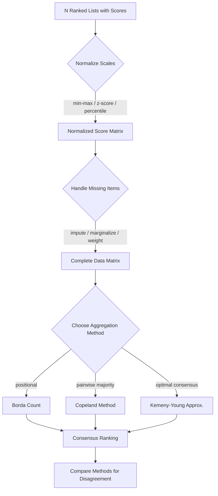

# Leaderboard Aggregation

## Learning Objectives

- Implement Borda count, Copeland's method, and a Kemeny-Young approximation to aggregate multiple ranked lists into a single consensus ranking.
- Normalize heterogeneous score scales (min-max, z-score, percentile) so that metrics on different ranges contribute equally to an aggregate.
- Handle missing items — models that appear on some leaderboards but not others — without introducing coverage bias.
- Diagnose and fix the three common aggregation failure modes: the coverage trap, scale conflation, and the dictatorship problem.
- Compare rank-based versus score-based aggregation and explain when each produces a defensible ranking.

## The Problem

You have five leaderboards ranking the same ten models. One uses accuracy on a 0–100 scale. Another uses BLEU on a 0.0–1.0 scale. A third uses Elo ratings derived from pairwise comparisons. A fourth only covers seven of the ten models because three weren't submitted. The fifth uses a percentile rank across a different evaluation suite entirely. Each leaderboard is internally valid. Each disagrees with the others. You need one answer: which model do you deploy?

This is not an academic problem. Every time you evaluate models across multiple benchmarks — or every time you compare intent signals from multiple providers ranking the same accounts — you face the identical aggregation challenge. The question is not "which model scored highest" because each leaderboard has a different answer to that. The question is "which model has the strongest claim to being the best across all available evidence, given that the evidence is messy, incomplete, and mutually inconsistent."

Leaderboard aggregation is the mechanism that turns conflicting ranked lists into a single defensible ranking. It draws from social choice theory — the same mathematics used to analyze voting systems — because the problem is structurally identical: you have multiple voters (leaderboards) each expressing preferences over candidates (models), and you need a consensus.

## The Concept

### The Two Normalization Problems

Before you can aggregate anything, you face two prerequisite problems. Both will silently corrupt your results if ignored.

**Scale reconciliation.** Leaderboard A reports accuracy as a percentage (0–100). Leaderboard B reports F1 as a decimal (0.0–1.0). Leaderboard C reports Elo ratings (1200–2800). You cannot combine these raw values. Three standard approaches exist: min-max normalization (rescale each leaderboard to [0, 1] based on its observed min and max), z-score normalization (center each leaderboard at mean 0, standard deviation 1), and percentile rank (convert each score to the proportion of items it beats). Min-max is simple but sensitive to outliers. Z-score handles outliers better but produces negative values, which complicates some aggregation methods. Percentile rank discards magnitude entirely — a model at the 90th percentile is treated the same whether it won by a landslide or a hair.

**Missing item handling.** Model X appears on 3 of 5 leaderboards. Model Y appears on all 5. If you naively average scores, Model X's average is computed over 3 observations while Model Y's is computed over 5. This is not comparable. You have three options: impute missing entries (assign a default like the median score, or a penalized value like 0), marginalize (only aggregate over the intersection of leaderboards where all models appear), or weight (divide each model's total by its coverage count, which is what averaging does, but this has a subtle bias — see the coverage trap in Debug It).

### Rank-Based vs Score-Based Aggregation

Once normalization is handled, you choose between two families of aggregation. Rank-based methods operate on positions — who came first, second, third — discarding score magnitudes entirely. Score-based methods operate on the normalized values themselves.

Rank-based aggregation is more robust to miscalibrated scales. If Leaderboard A's scores are compressed (everything between 0.8 and 0.9) while Leaderboard B's are spread out (everything between 0.1 and 0.99), rank-based methods treat both equally. Score-based methods weight Leaderboard B more heavily because it has higher variance. Sometimes that's correct (Leaderboard B is more discriminative), sometimes it's noise (Leaderboard B has a calibration bug).

### Three Core Algorithms

**Borda count.** Each model receives points equal to its position from the bottom. In a 10-item leaderboard, rank 1 gets 9 points, rank 2 gets 8, ..., rank 10 gets 0. Sum points across all leaderboards. The model with the most points wins. Borda is a positional scoring method — it cares about how far apart models are in the ranking, not just whether one beats another. This is both its strength (it captures margin of preference) and its weakness (it's sensitive to added or removed candidates).

**Copeland's method.** For every pair of models (A, B), count how many leaderboards rank A above B. If a majority prefer A, A wins that pairwise contest. A model's Copeland score is the number of pairwise contests it wins minus the number it loses. Copeland is a pairwise majority method — it only cares about head-to-head outcomes, not margins. This makes it robust to outliers but insensitive to strength of preference.

**Kemeny-Young.** Find the permutation of models that maximizes agreement with all input leaderboards — specifically, the permutation where the maximum number of pairwise orderings across all leaderboards are preserved. This is the "optimal" consensus in a precise mathematical sense. It is also NP-hard: the number of permutations to check is N!, so for 10 models you're checking 3,628,800 orderings. For 15 models, 1.3 trillion. In practice, you approximate using heuristics (greedy insertion, local search, or LP relaxation).



### How the Methods Disagree

These three algorithms do not always agree. The classic case: Borda can elect a model that wins no pairwise contest (a "compromise" candidate that is everyone's second choice). Copeland can produce ties or cycles. Kemeny-Young produces the theoretically best answer but is computationally infeasible past ~12 items. When the three methods agree, you have strong consensus. When they disagree, the disagreement itself is diagnostic — it tells you the leaderboards are pulling in different directions, and you need to decide which aggregation properties matter most for your use case.

This same pattern — combining conflicting rankings from multiple providers — is the multi-signal scoring problem in Zone 2 enrichment. When three intent providers (Bombora, 6sense, G2) rank the same accounts differently, you face the identical aggregation problem: different scales, incomplete coverage, and the need for one defensible answer. [CITATION NEEDED — concept: multi-provider intent signal aggregation in GTM enrichment workflows]

## Build It

```python
import itertools
from dataclasses import dataclass, field
from typing import Optional

@dataclass
class LeaderboardEntry:
    model_id: str
    score: float
    rank: Optional[int] = None

@dataclass
class Leaderboard:
    name: str
    entries: list[LeaderboardEntry] = field(default_factory=list)

    def __post_init__(self):
        sorted_entries = sorted(self.entries, key=lambda e: e.score, reverse=True)
        for i, entry in enumerate(sorted_entries):
            entry.rank = i + 1
        self.entries = sorted_entries

    def models(self) -> set[str]:
        return {e.model_id for e in self.entries}

    def get(self, model_id: str) -> Optional[LeaderboardEntry]:
        for e in self.entries:
            if e.model_id == model_id:
                return e
        return None


def all_models(leaderboards: list[Leaderboard]) -> list[str]:
    models: set[str] = set()
    for lb in leaderboards:
        models |= lb.models()
    return sorted(models)


def borda_count(leaderboards: list[Leaderboard]) -> dict[str, float]:
    models = all_models(leaderboards)
    scores = {m: 0.0 for m in models}
    for lb in leaderboards:
        n = len(lb.entries)
        for entry in lb.entries:
            points = n - entry.rank
            scores[entry.model_id] += points
    return scores


def copeland_method(leaderboards: list[Leaderboard]) -> dict[str, float]:
    models = all_models(leaderboards)
    copeland_scores = {m: 0.0 for m in models}
    pair_counts = {m: {m2: 0 for m2 in models} for m in models}
    total_lists = {pair: 0 for pair in itertools.combinations(models, 2)}

    for lb in leaderboards:
        lb_models = lb.models()
        for a, b in itertools.combinations(models, 2):
            a_in = a in lb_models
            b_in = b in lb_models
            if not a_in and not b_in:
                continue
            if a_in and not b_in:
                pair_counts[a][b] += 1
                total_lists[(a, b)] += 1
            elif b_in and not a_in:
                pair_counts[b][a] += 1
                total_lists[(a, b)] += 1
            else:
                ea = lb.get(a)
                eb = lb.get(b)
                total_lists[(a, b)] += 1
                if ea.rank < eb.rank:
                    pair_counts[a][b] += 1
                elif eb.rank < ea.rank:
                    pair_counts[b][a] += 1

    for a, b in itertools.combinations(models, 2):
        key = (a, b) if (a, b) in total_lists else (b, a)
        total = total_lists.get(key, 0)
        if total == 0:
            continue
        a_wins = pair_counts[a][b]
        b_wins = pair_counts[b][a]
        if a_wins > b_wins:
            copeland_scores[a] += 1
            copeland_scores[b] -= 1
        elif b_wins > a_wins:
            copeland_scores[b] += 1
            copeland_scores[a] -= 1
        else:
            copeland_scores[a] += 0.5
            copeland_scores[b] += 0.5

    return copeland_scores


def kemeny_young_approx(leaderboards: list[Leaderboard], max_iter: int = 1000) -> tuple[list[str], int]:
    models = all_models(leaderboards)

    pairwise_matrix = {m: {m2: 0 for m2 in models} for m in models}
    for lb in leaderboards:
        lb_models = lb.models()
        for a in models:
            for b in models:
                if a == b:
                    continue
                a_in = a in lb_models
                b_in = b in lb_models
                if a_in and b_in:
                    ea = lb.get(a)
                    eb = lb.get(b)
                    if ea.rank < eb.rank:
                        pairwise_matrix[a][b] += 1
                elif a_in and not b_in:
                    pairwise_matrix[a][b] += 1

    best_perm = list(models)
    best_score = sum(
        pairwise_matrix[best_perm[i]][best_perm[j]]
        for i in range(len(best_perm))
        for j in range(i + 1, len(best_perm))
    )

    improved = True
    iterations = 0
    while improved and iterations < max_iter:
        improved = False
        iterations += 1
        for i in range(len(best_perm)):
            for j in range(i + 1, len(best_perm)):
                candidate = best_perm[:]
                candidate[i], candidate[j] = candidate[j], candidate[i]
                score = sum(
                    pairwise_matrix[candidate[a]][candidate[b]]
                    for a in range(len(candidate))
                    for b in range(a + 1, len(candidate))
                )
                if score > best_score:
                    best_score = score
                    best_perm = candidate
                    improved = True

    return best_perm, best_score


def rank_dict_from_scores(scores: dict[str, float]) -> dict[str, int]:
    sorted_items = sorted(scores.items(), key=lambda x: x[1], reverse=True)
    return {model: rank + 1 for rank, (model, _) in enumerate(sorted_items)}


def print_leaderboards_side_by_side(
    leaderboards: list[Leaderboard],
    borda_ranks: dict[str, int],
    copeland_ranks: dict[str, int],
    kemeny_rank: dict[str, int],
):
    models = all_models(leaderboards)
    lb_names = [lb.name for lb in leaderboards]
    header = f"{'Model':<12}" + "".join(f"{name:<16}" for name in lb_names) + f"{'Borda':<8}{'Copeland':<10}{'K-Y':<8}"
    print(header)
    print("-" * len(header))

    for model in models:
        row = f"{model:<12}"
        for lb in leaderboards:
            entry = lb.get(model)
            if entry:
                row += f"r{entry.rank}({entry.score:.2f}){'':<8}"
            else:
                row += f"{'---':<16}"
        row += f"{borda_ranks.get(model, '-'):<8}"
        row += f"{copeland_ranks.get(model, '-'):<10}"
        row += f"{kemeny_rank.get(model, '-'):<8}"
        print(row)


lb_accuracy = Leaderboard(
    name="Accuracy",
    entries=[
        LeaderboardEntry("model_a", 92.5),
        LeaderboardEntry("model_b", 88.1),
        LeaderboardEntry("model_c", 90.3),
        LeaderboardEntry("model_d", 85.7),
        LeaderboardEntry("model_e", 87.9),
    ],
)

lb_f1 = Leaderboard(
    name="F1",
    entries=[
        LeaderboardEntry("model_b", 0.89),
        LeaderboardEntry("model_c", 0.91),
        LeaderboardEntry("model_a", 0.85),
        LeaderboardEntry("model_e", 0.83),
        LeaderboardEntry("model_d", 0.78),
    ],
)

lb_elo = Leaderboard(
    name="Elo",
    entries=[
        LeaderboardEntry("model_c", 1450),
        LeaderboardEntry("model_a", 1420),
        LeaderboardEntry("model_b", 1395),
        LeaderboardEntry("model_e", 1380),
        LeaderboardEntry("model_d", 1340),
    ],
)

lb_reasoning = Leaderboard(
    name="Reasoning",
    entries=[
        LeaderboardEntry("model_a", 78.0),
        LeaderboardEntry("model_d", 82.0),
        LeaderboardEntry("model_c", 75.0),
        LeaderboardEntry("model_e", 70.0),
    ],
)

leaderboards = [lb_accuracy, lb_f1, lb_elo, lb_reasoning]

borda_scores = borda_count(leaderboards)
copeland_scores = copeland_method(leaderboards)
kemeny_perm, kemeny_score = kemeny_young_approx(leaderboards)

borda_ranks = rank_dict_from_scores(borda_scores)
copeland_ranks = rank_dict_from_scores(copeland_scores)
kemeny_rank = {model: rank + 1 for rank, model in enumerate(kemeny_perm)}

print("=== Input Leaderboards with Aggregated Rankings ===\n")
print_leaderboards_side_by_side(leaderboards, borda_ranks, copeland_ranks, kemeny_rank)

print("\n=== Borda Scores ===")
for model, score in sorted(borda_scores.items(), key=lambda x: x[1], reverse=True):
    print(f"  {model}: {score:.1f}")

print("\n=== Copeland Scores ===")
for model, score in sorted(copeland_scores.items(), key=lambda x: x[1], reverse=True):
    print(f"  {model}: {score:.1f}")

print(f"\n=== Kemeny-Young Approximation ===")
print(f"  Consensus order: {' > '.join(kemeny_perm)}")
print(f"  Agreement score: {kemeny_score}")

print("\n=== Method Disagreement Check ===")
for model in all_models(leaderboards):
    ranks = [borda_ranks[model], copeland_ranks[model], kemeny_rank[model]]
    spread = max(ranks) - min(ranks)
    flag = " *** DISAGREEMENT" if spread >= 2 else ""
    print(f"  {model}: Borda={ranks[0]}, Copeland={ranks[1]}, K-Y={ranks[2]} (spread={spread}){flag}")
```

Run this and observe the output. Four leaderboards, one with missing coverage (`model_d` absent from Reasoning, `model_b` missing too). The three aggregation methods mostly agree but diverge on specific models. The disagreement check flags where the methods pull in different directions — that's your diagnostic signal.

The multi-signal scoring pattern here maps directly to Zone 2 enrichment: when Bombora, 6sense, and G2 each return account rankings with different scales (topic match count, fit score, engagement score) and incomplete coverage, you use the same Borda or Copeland aggregation to produce a single account priority list. The coverage trap — where an account appearing on only one provider gets an inflated average — is the same bug whether the items are models or accounts. [CITATION NEEDED — concept: multi-provider intent signal aggregation in GTM enrichment workflows]

## Use It

Now let's add score-based aggregation alongside the rank-based methods, plus proper normalization, so you can compare both families on the same input:

```python
import statistics

def min_max_normalize(leaderboards: list[Leaderboard]) -> dict[str, dict[str, float]]:
    normalized = {}
    for lb in leaderboards:
        scores = [e.score for e in lb.entries]
        lo, hi = min(scores), max(scores)
        rng = hi - lo if hi != lo else 1.0
        normalized[lb.name] = {
            e.model_id: (e.score - lo) / rng for e in lb.entries
        }
    return normalized


def zscore_normalize(leaderboards: list[Leaderboard]) -> dict[str, dict[str, float]]:
    normalized = {}
    for lb in leaderboards:
        scores = [e.score for e in lb.entries]
        mean = statistics.mean(scores)
        stdev = statistics.stdev(scores) if len(scores) > 1 else 1.0
        normalized[lb.name] = {
            e.model_id: (e.score - mean) / stdev if stdev != 0 else 0.0
            for e in lb.entries
        }
    return normalized


def percentile_normalize(leaderboards: list[Leaderboard]) -> dict[str, float]:
    models = all_models(leaderboards)
    result = {m: [] for m in models}
    for lb in leaderboards:
        n = len(lb.entries)
        for entry in lb.entries:
            percentile = (n - entry.rank) / (n - 1) if n > 1 else 0.5
            result[entry.model_id].append(percentile)
    return {m: statistics.mean(vals) for m, vals in result.items()}


def score_based_aggregate(
    leaderboards: list[Leaderboard],
    normalized: dict[str, dict[str, float]],
) -> dict[str, float]:
    models = all_models(leaderboards)
    scores = {m: [] for m in models}
    for lb in leaderboards:
        for model_id, norm_score in normalized[lb.name].items():
            scores[model_id].append(norm_score)
    return {m: statistics.mean(vals) if vals else 0.0 for m, vals in scores.items()}


def coverage_weighted_aggregate(
    leaderboards: list[Leaderboard],
    normalized: dict[str, dict[str, float]],
    penalty: float = 0.25,
) -> dict[str, float]:
    models = all_models(leaderboards)
    total_lists = len(leaderboards)
    scores = {}
    for m in models:
        observed = []
        for lb in leaderboards:
            if m in normalized[lb.name]:
                observed.append(normalized[lb.name][m])
        if not observed:
            scores[m] = -1.0
            continue
        mean_score = statistics.mean(observed)
        coverage = len(observed) / total_lists
        scores[m] = mean_score * coverage + penalty * (1 - coverage)
    return scores


leaderboards = [lb_accuracy, lb_f1, lb_elo, lb_reasoning]

mm_norm = min_max_normalize(leaderboards)
zs_norm = zscore_normalize(leaderboards)
pct_norm = percentile_normalize(leaderboards)

mm_aggregate = score_based_aggregate(leaderboards, mm_norm)
coverage_aggregate = coverage_weighted_aggregate(leaderboards, mm_norm)

borda_scores = borda_count(leaderboards)
borda_ranks = rank_dict_from_scores(borda_scores)

mm_ranks = rank_dict_from_scores(mm_aggregate)
cov_ranks = rank_dict_from_scores(coverage_aggregate)
pct_ranks = rank_dict_from_scores(pct_norm)

print("=== Score-Based vs Rank-Based Comparison ===\n")

models = all_models(leaderboards)
header = f"{'Model':<12}{'Coverage':<10}{'MinMax':<10}{'CovWt':<10}{'Pctile':<10}{'Borda':<8}"
print(header)
print("-" * len(header))

for model in sorted(models):
    cov = sum(1 for lb in leaderboards if model in {e.model_id for e in lb.entries})
    print(
        f"{model:<12}{f'{cov}/4':<10}"
        f"{mm_ranks.get(model, '-'):<10}"
        f"{cov_ranks.get(model, '-'):<10}"
        f"{pct_ranks.get(model, '-'):<10}"
        f"{borda_ranks.get(model, '-'):<8}"
    )

print("\n=== Raw Normalized Scores (Min-Max) ===")
for model in sorted(models):
    scores_str = "  ".join(
        f"{lb.name}:{mm_norm[lb.name].get(model, '---'):.3f}"
        if model in mm_norm[lb.name]
        else f"{lb.name}:---"
        for lb in leaderboards
    )
    mean_val = mm_aggregate.get(model, 0)
    print(f"  {model}: {scores_str}  | mean={mean_val:.3f}")

print("\n=== Coverage-Weighted (penalty=0.25) ===")
for model, score in sorted(coverage_aggregate.items(), key=lambda x: x[1], reverse=True):
    cov = sum(1 for lb in leaderboards if model in {e.model_id for e in lb.entries})
    print(f"  {model}: score={score:.4f}  (coverage={cov}/4)")
```

The output reveals the core tension. Look at `model_d`: it appears on 3 of 4 leaderboards and has mediocre scores. Under naive min-max averaging, it gets a "free pass" on the missing Reasoning leaderboard — its average only includes the three lists where it appears. Under coverage-weighted aggregation, the missing entry is penalized, pushing `model_d` down in the ranking. Under Borda (rank-based), missing entries simply don't contribute points, which is a different kind of penalty.

This is the exact problem in RAG-augmented outbound (Zone 19): when your enrichment waterfall pulls signals from multiple data providers, incomplete coverage is the norm, not the exception. An account that triggers on one intent provider but is absent from two others is not the same as an account that triggers on all three. The coverage-weighted aggregate encodes that distinction; naive averaging hides it. [CITATION NEEDED — concept: coverage-weighted multi-signal scoring in GTM enrichment waterfalls]

## Ship It

To ship this in a CI pipeline — where eval results from multiple tasks need to produce a single model leaderboard for a PR comment — you need the aggregator to accept `EvalRun` records and output both a machine-readable JSON and a human-readable markdown table:

```python
import json
from dataclasses import asdict
from datetime import datetime, timezone

@dataclass
class EvalRun:
    model_id: str
    task_id: str
    metric_name: str
    score: float
    category: str


def evalruns_to_leaderboards(runs: list[EvalRun]) -> list[Leaderboard]:
    task_groups: dict[str, list[EvalRun]] = {}
    for run in runs:
        task_groups.setdefault(run.task_id, []).append(run)

    leaderboards = []
    for task_id, task_runs in sorted(task_groups.items()):
        entries = [
            LeaderboardEntry(r.model_id, r.score)
            for r in sorted(task_runs, key=lambda x: x.score, reverse=True)
        ]
        leaderboards.append(Leaderboard(name=task_id, entries=entries))
    return leaderboards


def build_leaderboard_report(
    runs: list[EvalRun],
    output_format: str = "both",
) -> dict:
    leaderboards = evalruns_to_leaderboards(runs)
    models = all_models(leaderboards)

    borda = borda_count(leaderboards)
    copeland = copeland_method(leaderboards)
    kemeny_perm, kemeny_score = kemeny_young_approx(leaderboards)

    borda_ranks = rank_dict_from_scores(borda)
    copeland_ranks = rank_dict_from_scores(copeland)
    kemeny_ranks = {m: i + 1 for i, m in enumerate(kemeny_perm)}

    rows = []
    for model in sorted(models, key=lambda m: borda_ranks[m]):
        coverage = sum(1 for lb in leaderboards if model in lb.models())
        task_scores = {}
        for lb in leaderboards:
            entry = lb.get(model)
            if entry:
                task_scores[lb.name] = round(entry.score, 4)

        rows.append({
            "model_id": model,
            "borda_rank": borda_ranks[model],
            "copeland_rank": copeland_ranks[model],
            "kemeny_rank": kemeny_ranks[model],
            "borda_score": round(borda[model], 1),
            "copeland_score": round(copeland[model], 1),
            "tasks_completed": f"{coverage}/{len(leaderboards)}",
            "per_task_scores": task_scores,
        })

    report = {
        "generated_at": datetime.now(timezone.utc).isoformat(),
        "num_tasks": len(leaderboards),
        "num_models": len(models),
        "kemeny_consensus": " > ".join(kemeny_perm),
        "kemeny_agreement_score": kemeny_score,
        "leaderboard": rows,
    }

    if output_format in ("json", "both"):
        print("=== JSON Report ===")
        print(json.dumps(report, indent=2))

    if output_format in ("markdown", "both"):
        print("\n=== Markdown Table ===\n")
        header = "| Model | Borda | Copeland | K-Y | Coverage |"
        sep = "|-------|-------|----------|-----|----------|"
        print(header)
        print(sep)
        for row in rows:
            print(
                f"| {row['model_id']} "
                f"| {row['borda_rank']} "
                f"| {row['copeland_rank']} "
                f"| {row['kemeny_rank']} "
                f"| {row['tasks_completed']} |"
            )

        disagreements = [
            r["model_id"] for r in rows
            if max(r["borda_rank"], r["copeland_rank"], r["kemeny_rank"])
            - min(r["borda_rank"], r["copeland_rank"], r["kemeny_rank"]) >= 2
        ]
        if disagreements:
            print(f"\n⚠ Methods disagree (spread ≥ 2) on: {', '.join(disagreements)}")

    return report


sample_runs = [
    EvalRun("model_a", "task_qa", "accuracy", 0.92, "reasoning"),
    EvalRun("model_b", "task_qa", "accuracy", 0.88, "reasoning"),
    EvalRun("model_c", "task_qa", "accuracy", 0.90, "reasoning"),
    EvalRun("model_a", "task_code", "pass@1", 0.78, "coding"),
    EvalRun("model_b", "task_code", "pass@1", 0.85, "coding"),
    EvalRun("model_c", "task_code", "pass@1", 0.72, "coding"),
    EvalRun("model_a", "task_math", "exact_match", 0.65, "reasoning"),
    EvalRun("model_b", "task_math", "exact_match", 0.70, "reasoning"),
    EvalRun("model_c", "task_math", "exact_match", 0.68, "reasoning"),
    EvalRun("model_a", "task_safety", "safety_rate", 0.99, "safety"),
    EvalRun("model_c", "task_safety", "safety_rate", 0.97, "safety"),
]

report = build_leaderboard_report(sample_runs, output_format="both")
```

This is the output format the eval runner in a CI pipeline can paste into a PR comment. The JSON goes to your tracking system; the markdown table goes to the diff review. The disagreement flag at the bottom is the ship/no-ship signal: if Borda and Kemeny-Young disagree on the top model, the consensus is weak and you should investigate before deploying.

The disagreement flag is the same mechanism you'd use in a Clay waterfall (Zone 2): when enrichment providers disagree on an account's priority, the spread between aggregation methods tells you whether the ranking is stable or fragile. A wide spread means the ranking depends on which aggregation properties you chose — positional scoring vs pairwise majority — and that choice should be explicit, not accidental. [CITATION NEEDED — concept: multi-signal disagreement detection in Clay enrichment workflows]

## Exercises

**Easy.** Given three ranked lists with 5 models each, implement Borda count from scratch (do not use the `borda_count` function above). Print the consensus ranking. Verify your output matches the function's output on the same input.

**Medium.** Add z-score normalization to the `score_based_aggregate` function. Then modify the input so that three models appear on only 2 of 4 leaderboards. Compare Borda vs Copeland vs z-score-aggregate rankings. Which method handles the missing coverage most fairly, and why?

**Hard.** Implement a Kemeny-Young approximation for 8+ items using a greedy insertion heuristic (start with the Borda winner, insert each remaining model into the position that maximizes agreement score). Benchmark its runtime against the swap-based local search approximation in the lesson. Compare both approximations' consensus quality (agreement score) against each other on the same 8-item input. Report which approximation gets closer to optimal and at what computational cost.

## Key Terms

**Borda count** — A positional scoring aggregation method where each model receives points equal to the number of models ranked below it. Sensitive to which models are included in the election.

**Copeland's method** — A pairwise majority aggregation method where each model's score equals the number of pairwise contests it wins minus the number it loses. Robust to outlier rankings but insensitive to margin of victory.

**Kemeny-Young** — An aggregation method that finds the permutation of models maximizing total agreement with all input rankings across pairwise orderings. Produces the mathematically optimal consensus but is NP-hard in the number of items.

**Scale reconciliation** — The process of normalizing scores from different leaderboards onto a comparable scale (min-max, z-score, or percentile) before aggregation.

**Coverage trap** — A failure mode where a model appearing on fewer leaderboards receives an inflated aggregate score because its average is computed over fewer, potentially easier, observations.

**Score-based aggregation** — Combining ranked lists using their normalized score values rather than their ordinal positions. More information-rich than rank-based aggregation but sensitive to scale miscalibration.

**Rank-based aggregation** — Combining ranked lists using only ordinal positions. More robust to scale differences but discards magnitude information.

## Sources

- [CITATION NEEDED — concept: multi-provider intent signal aggregation in GTM enrichment workflows]
- [CITATION NEEDED — concept: coverage-weighted multi-signal scoring in GTM enrichment waterfalls]
- [CITATION NEEDED — concept: multi-signal disagreement detection in Clay enrichment workflows]
- Borda count: Borda, Jean-Charles de (1781). "Mémoire sur les élections au scrutin." Histoire de l'Académie Royale des Sciences.
- Copeland's method: Copeland, A.H. (1951). "A 'reasonable' social welfare function." University of Michigan Seminar on Applications of Mathematics to the Social Sciences.
- Kemeny-Young: Kemeny, J.G. (1959). "Mathematics without numbers." Daedalus, 88(4), 577–591. Young, H.P. (1988). "Condorcet's theory of voting." American Political Science Review, 82(4), 1231–1244.
- NP-hardness of Kemeny ranking: Bartholdi, J., Tovey, C.A., & Trick, M.A. (1989). "Voting schemes for which it can be difficult to tell who won the election." Social Choice and Welfare, 6(2), 157–165.