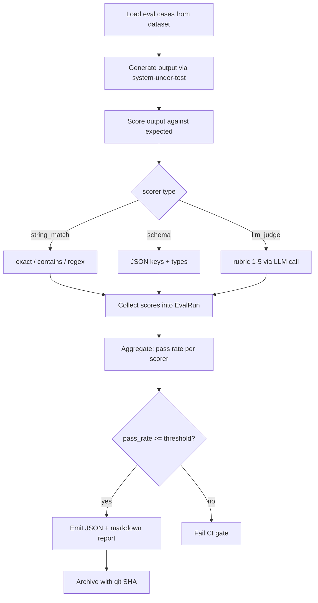

# End-to-End Eval Runner

## Learning Objectives

- Build a configurable eval runner that feeds inputs to a system-under-test, collects outputs, and scores them against multiple scorer types.
- Implement three scorer categories — string matching, JSON schema validation, and rubric-based LLM-as-judge — behind a uniform interface.
- Compose the runner into a CI gate that exits non-zero when any scorer's pass rate drops below a configured threshold.
- Compare eval runner outputs across runs to detect quality regression after prompt or model changes.
- Emit both machine-readable (JSON) and human-readable (markdown) eval reports tagged with git SHA.

## The Problem

You ship a prompt change on a Tuesday. The staging tests pass — every assertion holds. On Wednesday, a account executive notices the enrichment agent is returning company descriptions that are technically correct but tonally wrong for enterprise prospects. By Friday, three campaigns have launched with copy that reads like a chatbot wrote it in 2022. The unit tests never caught this because unit tests assert that the output is valid JSON with the right keys. They do not assert that the output is good.

The gap between "the function returned a value" and "the value is useful" is where most production LLM failures live. A single bad response is a bug you file and fix. A systematic degradation — where 15% of responses shifted from specific to generic after a prompt rewrite — is a business failure that revenue teams discover first. The eval runner exists to catch that shift before anyone outside engineering sees it.

The problem is not that you lack tests. The problem is that you have the wrong kind of test. Deterministic unit tests check structural correctness. Benchmarks check performance on static, curated datasets that may not represent your actual traffic. Neither catches the middle ground: your system still runs, still returns valid output, but the quality has drifted below the threshold your GTM team needs to trust the pipeline.

## The Concept

An eval runner is a pipeline with four stages: load cases, generate outputs, score outputs, aggregate results. Each stage is independently configurable and composable. The runner does not contain scoring logic — it orchestrates scorers registered behind a common interface. This separation is what makes the runner useful across different tasks: swap the dataset and scorers, reuse the harness.

The runner differs from a unit test suite in three ways. First, scorers return continuous scores (0.0–1.0 or 1–5), not booleans. A response that is partially correct gets partial credit, and the aggregate pass rate tells you about the distribution, not just the presence of failures. Second, the dataset represents realistic inputs, not edge cases engineered to break the system. Third, the runner produces a report you trend over time — not a single green checkmark. The eval runner is a measurement instrument, not a gate mechanism by itself. The gate is a policy you layer on top of the measurements.



Here is a minimal eval runner that demonstrates the full pipeline. Three scorers run against three cases. The `mock_generate` function stands in for your real LLM call — swap it with an API client and nothing else changes.

```python
from dataclasses import dataclass

@dataclass
class EvalCase:
    input: str
    expected: str
    metadata: dict = None

@dataclass
class CaseResult:
    case_id: int
    input: str
    output: str
    expected: str
    scores: dict

def exact_match(output: str, expected: str) -> float:
    return 1.0 if output.strip() == expected.strip() else 0.0

def contains(output: str, expected: str) -> float:
    return 1.0 if expected.lower() in output.lower() else 0.0

def llm_judge_mock(output: str, expected: str) -> float:
    output_words = set(output.lower().split())
    expected_words = set(expected.lower().split())
    if not expected_words:
        return 0.0
    overlap = len(output_words & expected_words)
    ratio = overlap / len(expected_words)
    if ratio >= 0.9:
        return 5.0
    elif ratio >= 0.7:
        return 4.0
    elif ratio >= 0.5:
        return 3.0
    elif ratio >= 0.3:
        return 2.0
    elif ratio > 0:
        return 1.0
    return 0.0

def run_eval(cases, generate_fn, scorers):
    results = []
    for i, case in enumerate(cases):
        output = generate_fn(case.input)
        scores = {name: fn(output, case.expected) for name, fn in scorers.items()}
        results.append(CaseResult(i, case.input, output, case.expected, scores))
    return results

def summarize(results, scorer_names):
    print(f"{'ID':<4} {'Output':<30} {'Expected':<20}", end="")
    for name in scorer_names:
        print(f" {name:<14}", end="")
    print()
    print("-" * 90)
    for r in results:
        print(f"{r.case_id:<4} {r.output[:28]:<30} {r.expected[:18]:<20}", end="")
        for name in scorer_names:
            print(f" {r.scores[name]:<14.2f}", end="")
        print()
    print()
    for name in scorer_names:
        vals = [r.scores[name] for r in results]
        avg = sum(vals) / len(vals)
        print(f"  {name}: avg={avg:.2f}  range=[{min(vals):.1f}, {max(vals):.1f}]")

def mock_generate(prompt):
    if "capital" in prompt.lower():
        return "Paris"
    elif "planet" in prompt.lower():
        return "Mars"
    elif "language" in prompt.lower():
        return "Python is written in the Python programming language"
    return "unknown"

cases = [
    EvalCase("What is the capital of France?", "Paris"),
    EvalCase("What is the fifth planet from the sun?", "Jupiter"),
    EvalCase("What language is Django written in?", "Python"),
]

scorers = {
    "exact_match": exact_match,
    "contains": contains,
    "judge_1to5": llm_judge_mock,
}

results = run_eval(cases, mock_generate, scorers)
summarize(results, list(scorers.keys()))
```

When you run this, the output shows case-level scores and per-scorer aggregates. Case 1 fails every scorer because Mars is wrong for "fifth planet." Case 2 fails exact_match but passes contains because the full sentence includes "Python." The judge gives it a 5 because every expected word appears. This spread — different scorers catching different failure modes — is the entire point of running multiple scorer types in one pass.

## Build It

The minimal runner hardcodes scorers and cases. Production evals need configuration: which model, which dataset, which scorers, what thresholds. This section extends the runner into a configurable pipeline with a scorer registry, threshold-based pass/fail logic, and JSON report emission.

The registry pattern decouples scorer implementation from runner logic. Each scorer is a function registered under a name. The config file references scorers by name. The runner looks them up at execution time. This means you can add a scorer without touching the runner — register it and reference it in config.

```python
import json
from dataclasses import dataclass, field
from datetime import datetime, timezone

SCORER_REGISTRY = {}

def register(name):
    def decorator(fn):
        SCORER_REGISTRY[name] = fn
        return fn
    return decorator

@register("exact_match")
def exact_match(output, expected, **kwargs):
    return 1.0 if output.strip() == expected.strip() else 0.0

@register("contains")
def contains(output, expected, **kwargs):
    return 1.0 if expected.lower() in output.lower() else 0.0

@register("regex_match")
def regex_match(output, expected, **kwargs):
    import re
    try:
        return 1.0 if re.search(expected, output) else 0.0
    except re.error:
        return 0.0

@register("json_keys_present")
def json_keys_present(output, expected, **kwargs):
    required = [k.strip() for k in expected.split(",")]
    try:
        data = json.loads(output)
    except (json.JSONDecodeError, TypeError):
        return 0.0
    if not isinstance(data, dict):
        return 0.0
    missing = [k for k in required if k not in data]
    if missing:
        return 0.0
    return 1.0

@register("llm_judge_1to5")
def llm_judge_1to5(output, expected, **kwargs):
    output_words = set(output.lower().split())
    expected_words = set(expected.lower().split())
    if not expected_words:
        return 0.0
    overlap = len(output_words & expected_words)
    ratio = overlap / len(expected_words)
    if ratio >= 0.9:
        return 5.0
    elif ratio >= 0.7:
        return 4.0
    elif ratio >= 0.5:
        return 3.0
    elif ratio >= 0.3:
        return 2.0
    elif ratio > 0:
        return 1.0
    return 0.0

@dataclass
class EvalCase:
    input: str
    expected: str
    metadata: dict = field(default_factory=dict)

@dataclass
class CaseResult:
    case_id: int
    input: str
    output: str
    expected: str
    scorer_name: str
    score: float

class EvalRunner:
    def __init__(self, config):
        self.model_id = config["model_id"]
        self.scorers = config["scorers"]
        self.pass_thresholds = config["pass_thresholds"]
        self.min_pass_rates = config["min_pass_rates"]
        self.generate_fn = config["generate_fn"]

    def run(self, cases):
        all_results = []
        for i, case in enumerate(cases):
            output = self.generate_fn(case.input)
            for scorer_name in self.scorers:
                scorer_fn = SCORER_REGISTRY[scorer_name]
                score = scorer_fn(output, case.expected)
                all_results.append(CaseResult(
                    i, case.input, output, case.expected, scorer_name, score
                ))
        return all_results

    def aggregate(self, results):
        summary = {}
        for scorer_name in self.scorers:
            scorer_results = [r for r in results if r.scorer_name == scorer_name]
            scores = [r.score for r in scorer_results]
            threshold = self.pass_thresholds[scorer_name]
            passed = sum(1 for s in scores if s >= threshold)
            total = len(scores)
            pass_rate = passed / total if total else 0.0
            min_rate = self.min_pass_rates[scorer_name]
            summary[scorer_name] = {
                "avg_score": round(sum(scores) / total, 3) if total else 0.0,
                "pass_rate": round(pass_rate, 3),
                "passed": passed,
                "total": total,
                "threshold": threshold,
                "min_pass_rate": min_rate,
                "gate_passed": pass_rate >= min_rate,
            }
        return summary

    def emit_report(self, results, summary):
        return {
            "model_id": self.model_id,
            "timestamp": datetime.now(timezone.utc).isoformat(),
            "scorers": self.scorers,
            "summary": summary,
            "results": [
                {
                    "case_id": r.case_id,
                    "input": r.input,
                    "output": r.output,
                    "expected": r.expected,
                    "scorer": r.scorer_name,
                    "score": r.score,
                }
                for r in results
            ],
        }

def mock_generate(prompt):
    p = prompt.lower()
    if "capital" in p:
        return "Paris"
    elif "planet" in p:
        return "Mars"
    elif "language" in p:
        return "Python is written in the Python programming language"
    elif "company" in p and "json" in p:
        return json.dumps({"name": "Acme Corp", "revenue": 5000000, "employees": 250})
    return "unknown"

config = {
    "model_id": "mock-enrichment-v1",
    "scorers": ["exact_match", "contains", "json_keys_present", "llm_judge_1to5"],
    "pass_thresholds": {
        "exact_match": 0.5,
        "contains": 0.5,
        "json_keys_present": 0.5,
        "llm_judge_1to5": 3.0,
    },
    "min_pass_rates": {
        "exact_match": 0