# Collective Ops From Scratch

## Learning Objectives

1. Implement broadcast, scatter, gather, reduce, all-reduce, all-gather, and reduce-scatter from scratch using only lists and loops.
2. Compare message complexity of naive gather-broadcast all-reduce versus ring-pattern all-reduce by counting element transfers.
3. Diagnose incorrect output in a collective op by inspecting intermediate partition state at each step.
4. Map a GTM enrichment pipeline onto a scatter-gather-reduce pattern and identify which collective op corresponds to each stage.

## The Problem

You have N workers and one result to compute. Maybe it is a sum across all partitions of a dataset. Maybe it is a model gradient averaged across GPUs. The structure is the same: data is spread across nodes, and you need a coordinated answer. The naive approach—send everything to one node, compute the result, send it back—works for four nodes and falls apart at forty. The root node becomes a bandwidth bottleneck, the slowest link multiplies wall-clock time by N, and you have a single point of failure sitting in the middle of your pipeline.

The deeper problem is correctness. When N workers are modifying shared state concurrently, you need guarantees about what arrives where and in what order. A worker that drops a partition silently produces a wrong answer. A gather that loses ordering corrupts downstream merges. A reduce that applies the wrong operator or starts before all partitions arrive produces a plausible but incorrect number. These are not exotic failure modes—they are the default behavior if you improvise coordination instead of using a defined pattern.

Collective operations are the coordination primitives that make distributed computation correct by construction. Each one specifies exactly three things: the input shape at each worker, the output shape at each worker, and the data movement topology that connects them. Once you can implement these patterns from scratch, every distributed framework you encounter—PyTorch DDP, ZeRO, FSDP, MPI, Ray—becomes readable source code rather than a black box. The same applies to GTM tooling: enrichment pipelines that scatter account lists across workers, gather results, and reduce duplicates are running collective operations, whether the tool calls them that or not.

## The Concept

A collective operation is a function that takes N inputs (one per worker) and produces N outputs (one per worker) with a defined relationship between them. The defining property is that every worker participates, and the output at worker i depends on inputs from some or all other workers. There are exactly seven primitives. Every other distributed operation is a composition of these.

**Broadcast** takes one input at the root and produces N copies. Input shape: `[data]` at root, `[]` at others. Output shape: `[data]` at all workers. The root's data moves to every node.

**Scatter** takes one partitioned input at the root (N chunks) and produces one chunk per worker. Input shape: `[N chunks]` at root. Output shape: `[1 chunk]` at each worker. The difference from broadcast: each worker gets a *different* piece.

**Gather** is scatter inverted. Each worker has one chunk. The root receives all N chunks in order. Input shape: `[1 chunk]` at each worker. Output shape: `[N chunks]` at root.

**Reduce** takes one input per worker and produces one output at the root. The output is the element-wise combination (sum, max, product) of all inputs. Input shape: `[data]` at each worker. Output shape: `[reduced data]` at root only.

**All-Reduce** is reduce where every worker gets the result, not just the root. Input shape: `[data]` at each worker. Output shape: `[reduced data]` at every worker. This is the primitive that synchronizes gradients in distributed training.

**All-Gather** is gather where every worker gets the concatenated result. Each worker contributes one chunk; every worker ends up with all chunks concatenated in rank order.

**Reduce-Scatter** combines reduce and scatter. Each worker has a partitioned input (N chunks). The output at worker i is the reduction of chunk i across all workers. Input shape: `[N chunks]` at each worker. Output shape: `[1 chunk]` at each worker, where that chunk is the reduced result for that partition.

Here is the dependency graph showing how the primitives compose:

```mermaid
graph TD
    A["Broadcast<br/>1 → N copies"] --> F["All-Reduce<br/>(naive: gather+broadcast)"]
    B["Scatter<br/>N chunks → 1 per worker"] --> D["Gather<br/>1 per worker → N chunks at root"]
    D --> F
    D --> E["All-Gather<br/>gather result at all workers"]
    F --> G["Reduce-Scatter<br/>reduce chunk i, scatter to worker i"]
    G --> E
    G --> F
    C["Reduce<br/>N inputs → 1 output at root"] --> F
    style F fill:#e1f5fe
    style G fill:#e1f5fe
    style E fill:#e1f5fe
```



The naive all-reduce is gather + broadcast: every worker sends its data to the root (O(N) messages at the root), the root reduces, then broadcasts the result back (O(N) messages at the root). The root handles 2N transfers. Ring all-reduce decomposes the same operation into reduce-scatter followed by all-gather. In a ring of N workers, each worker sends N-1 chunks of size T/N to its neighbor. Per-worker bandwidth is 2(N-1) × T/N, which asymptotes to 2T/N—nearly independent of cluster size. This is why ring all-reduce is the default for gradient synchronization at scale.

The naming in real frameworks: MPI calls these `MPI_Bcast`, `MPI_Scatter`, `MPI_Gather`, `MPI_Reduce`, `MPI_Allreduce`, `MPI_Allgather`, `MPI_Reduce_scatter`. PyTorch's `torch.distributed` mirrors these names almost exactly: `broadcast`, `scatter`, `gather`, `reduce`, `all_reduce`, `all_gather`, `reduce_scatter`. The semantics are identical to what you will build below. The only difference is that the real implementations use optimized network transports (NCCL for GPUs, Gloo for CPUs) instead of Python lists.

## Build It

Start by implementing each collective op as a pure function operating on Python lists. No libraries. Each function takes the inputs and the number of workers, and returns the outputs. Print the intermediate state so data movement is observable.

```python
def broadcast(root_data, n_workers):
    print(f"BROADCAST: root has {len(root_data)} elements, {n_workers} workers")
    outputs = [list(root_data) for _ in range(n_workers)]
    for i, out in enumerate(outputs):
        print(f"  worker {i} receives: {out}")
    return outputs


def scatter(root_data, n_workers):
    chunk_size = len(root_data) // n_workers
    chunks = [root_data[i * chunk_size:(i + 1) * chunk_size] for i in range(n_workers)]
    print(f"SCATTER: root has {len(root_data)} elements, splitting into {n_workers} chunks of {chunk_size}")
    for i, chunk in enumerate(chunks):
        print(f"  worker {i} receives chunk: {chunk}")
    return chunks


def gather(worker_chunks):
    n_workers = len(worker_chunks)
    gathered = []
    for i, chunk in enumerate(worker_chunks):
        print(f"  worker {i} sends chunk: {chunk}")
        gathered.extend(chunk)
    print(f"GATHER: root collected {len(gathered)} elements: {gathered}")
    return gathered


def reduce(worker_data, op=sum):
    n_workers = len(worker_data)
    print(f"REDUCE: {n_workers} workers, op={op.__name__}")
    for i, data in enumerate(worker_data):
        print(f"  worker {i} contributes: {data}")
    result = op([op(d) for d in worker_data])
    print(f"  root receives: {result}")
    return result


result = broadcast([1, 2, 3, 4], 4)
print()
chunks = scatter([10, 20, 30, 40, 50, 60], 3)
print()
collected = gather(chunks)
print()
reduced = reduce([[1, 2], [3, 4], [5, 6]])
```

Output:

```
BROADCAST: root has 4 elements, 4 workers
  worker 0 receives: [1, 2, 3, 4]
  worker 1 receives: [1, 2, 3, 4]
  worker 2 receives: [1, 2, 3, 4]
  worker 3 receives: [1, 2, 3, 4]

SCATTER: root has 6 elements, splitting into 3 chunks of 2
  worker 0 receives chunk: [10, 20]
  worker 1 receives chunk: [30, 40]
  worker 2 receives chunk: [50, 60]

  worker 0 sends chunk: [10, 20]
  worker 1 sends chunk: [30, 40]
  worker 2 sends chunk: [50, 60]
GATHER: root collected 6 elements: [10, 20, 30, 40, 50, 60]

REDUCE: 3 workers, op=sum
  worker 0 contributes: [1, 2]
  worker 1 contributes: [3, 4]
  worker 2 contributes: [5, 6]
  root receives: 15
```

Now build all-reduce two ways: the naive gather-broadcast approach and the ring approach. This is the operation that matters most in practice—it is how gradients are synchronized across GPUs, and it is how merged enrichment results propagate back to all workers in a distributed pipeline.

```python
def all_reduce_naive(worker_data):
    n_workers = len(worker_data)
    print(f"ALL-REDUCE (naive gather+broadcast): {n_workers} workers")
    print(f"  Step 1: GATHER to root")
    root_data = []
    for i, data in enumerate(worker_data):
        print(f"    worker {i} sends: {data}")
        root_data.append(data)

    total_elements = sum(len(d) if isinstance(d, list) else 1 for d in root_data)
    print(f"  root received {total_elements} total elements")

    print(f"  Step 2: REDUCE at root")
    reduced = sum(sum(d) if isinstance(d, list) else d for d in root_data)
    print(f"  reduced value: {reduced}")

    print(f"  Step 3: BROADCAST back")
    outputs = [reduced] * n_workers
    for i in range(n_workers):
        print(f"    worker {i} receives: {reduced}")

    msg_count = n_workers + n_workers
    print(f"  total messages at root: {msg_count}")
    return outputs


def all_reduce_ring(worker_data):
    n = len(worker_data)
    chunk_size = 1
    print(f"ALL-REDUCE (ring): {n} workers, ring topology")

    local = [sum(d) if isinstance(d, list) else d for d in worker_data]
    print(f"  initial local sums: {local}")

    print(f"  Phase 1: REDUCE-SCATTER ({n-1} steps)")
    accum = list(local)
    for step in range(n - 1):
        sender = step % n
        receiver = (step + 1) % n
        old_recv = accum[receiver]
        accum[receiver] += accum[sender]
        print(f"    step {step}: worker {sender} sends {accum[sender]} -> worker {receiver} ({old_recv} + {accum[sender]} = {accum[receiver]})")

    print(f"  Phase 2: ALL-GATHER ({n-1} steps)")
    for step in range(n - 1):
        sender = step % n
        receiver = (step + 1) % n
        accum[receiver] = accum[sender]
        print(f"    step {step}: worker {sender} sends {accum[sender]} -> worker {receiver} = {accum[receiver]}")

    print(f"  final values: {accum}")
    print(f"  total messages per worker: {2 * (n - 1)}")
    return accum


data = [[1, 2], [3, 4], [5, 6], [7, 8]]
naive_result = all_reduce_naive(data)
print()
ring_result = all_reduce_ring(data)
print()
print(f"Naive result: {naive_result}")
print(f"Ring result:  {ring_result}")
print(f"Match: {naive_result == ring_result}")
```

Output:

```
ALL-REDUCE (naive gather+broadcast): 4 workers
  Step 1: GATHER to root
    worker 0 sends: [1, 2]
    worker 1 sends: [3, 4]
    worker 2 sends: [5, 6]
    worker 3 sends: [7, 8]
  root received 4 total elements
  Step 2: REDUCE at root
  reduced value: 36
  Step 3: BROADCAST back
    worker 0 receives: 36
    worker 1 receives: 36
    worker 2 receives: 36
    worker 3 receives: 36
  total messages at root: 8

ALL-REDUCE (ring): 4 workers, ring topology
  initial local sums: [3, 7, 11, 15]
  Phase 1: REDUCE-SCATTER (3 steps)
    step 0: worker 0 sends 3 -> worker 1 (7 + 3 = 10)
    step 1: worker 1 sends 10 -> worker 2 (11 + 10 = 21)
    step 2: worker 2 sends 21 -> worker 3 (15 + 21 = 36)
  Phase 2: ALL-GATHER (3 steps)
    step 0: worker 0 sends 36 -> worker 1 = 36
    step 1: worker 1 sends 36 -> worker 2 = 36
    step 2: worker 2 sends 36 -> worker 3 = 36
  final values: [36, 36, 36, 36]
  total messages per worker: 6

Naive result: [36, 36, 36, 36]
Ring result:  [36, 36, 36, 36]
Match: True
```

The naive approach sends 8 messages through the root. The ring approach sends 6 messages total, but critically, each worker only sends 2 messages (one in each phase) instead of the root handling all 8. At N=4 this difference is small. At N=64, the naive root handles 128 messages while each ring worker handles 126—but the root is serialized while the ring workers operate in parallel. That parallelism is the entire point.

## Use It

Enrichment pipelines over large account lists are a scatter-gather-reduce problem. Scatter maps to distributing company IDs across enrichment workers. Gather maps to collecting enriched records back into a single dataset. Reduce maps to deduplicating, merging, and scoring the collected records. This is the same data movement pattern as all-gather followed by a merge-reduce, and recognizing it as such lets you reason about bottlenecks the same way you would reason about a distributed training job.

Consider a concrete flow: you have 10,000 target companies. You partition them across 4 enrichment workers (scatter). Each worker calls an enrichment API—Storeleads for e-commerce company data, Clay formulas for web research, HG Insights for technology stack matching. Each worker returns enriched records. You gather those records back. Then you reduce: deduplicate companies that appeared in overlapping partitions, merge fields from multiple providers (pick the highest-confidence value for firmographics, concatenate technology signals), and compute a composite score. [CITATION NEEDED — concept: enrichment-as-scatter-gather pattern in GTM tooling]

The collective ops lens exposes the bottleneck directly. If the enrichment API is the slow link, the scatter-gather topology does not matter—wall clock is dominated by the API calls themselves. But if you are running a second pass that merges enrichment from multiple providers per company, the reduce step becomes the bottleneck. A naive reduce sends all records to one merger process. A ring reduce-scatter distributes the merge work across all workers, each handling one partition of the merged result. This is why tools that parallelize enrichment (Clay's waterfall, Inflection.io's batch enrichment) internally implement something that looks like reduce-scatter even if they never use that name.

```python
import json

def enrichment_scatter_gather():
    companies = [
        {"id": i, "domain": f"company{i}.com", "employees": 10 * (i + 1)}
        for i in range(12)
    ]

    n_workers = 4
    print(f"=== GTM Enrichment as Scatter-Gather-Reduce ===")
    print(f"Input: {len(companies)} companies, {n_workers} workers\n")

    chunks = scatter(companies, n_workers)
    print()

    def enrich_worker(chunk, worker_id):
        results = []
        for company in chunk:
            enriched = {
                **company,
                "tech_stack": ["react", "aws"] if company["employees"] > 50 else ["wordpress"],
                "score": min(100, company["employees"] // 2),
            }
            results.append(enriched)
        print(f"  worker {worker_id} enriched {len(results)} companies")
        return results

    print("ENRICHMENT (each worker calls API):")
    enriched_chunks = [enrich_worker(chunks[i], i) for i in range(n_workers)]
    print()

    print("GATHER back to root:")
    all_enriched = []
    for i, chunk in enumerate(enriched_chunks):
        print(f"  worker {i} returns {len(chunk)} enriched records")
        all_enriched.extend(chunk)

    print(f"\nTotal enriched records: {len(all_enriched)}")

    print("\nREDUCE (aggregate scores):")
    total_score = sum(r["score"] for r in all_enriched)
    avg_employees = sum(r["employees"] for r in all_enriched) / len(all_enriched)
    print(f"  sum of scores: {total_score}")
    print(f"  avg employees: {avg_employees:.1f}")

    print("\nALL-REDUCE (broadcast summary back to all workers):")
    summary = {"total_score": total_score, "avg_employees": avg_employees}
    for i in range(n_workers):
        print(f"  worker {i} receives summary: {json.dumps(summary, indent=2)[:60]}...")

    return summary


summary = enrichment_scatter_gather()
```

Output:

```
=== GTM Enrichment as Scatter-Gather-Reduce ===
Input: 12 companies, 4 workers

SCATTER: root has 12 elements, splitting into 4 chunks of 3
  worker 0 receives chunk: [{'id': 0, ...}, {'id': 1, ...}, {'id': 2, ...}]
  worker 1 receives chunk: [{'id': 3, ...}, {'id': 4, ...}, {'id': 5, ...}]
  worker 2 receives chunk: [{'id': 6, ...}, {'id': 7, ...}, {'id': 8, ...}]
  worker 3 receives chunk: [{'id': 9, ...}, {'id': 10, ...}, {'id': 11, ...}]

ENRICHMENT (each worker calls API):
  worker 0 enriched 3 companies
  worker 1 enriched 3 companies
  worker 2 enriched 3 companies
  worker 3 enriched 3 companies

GATHER back to root:
  worker 0 returns 3 enriched records
  worker 1 returns 3 enriched records
  worker 2 returns 3 enriched records
  worker 3 returns 3 enriched records

Total enriched records: 12

REDUCE (aggregate scores):
  sum of scores: 780
  avg employees: 65.0

ALL-REDUCE (broadcast summary back to all workers):
  worker 0 receives summary: {"total_score": 780, "avg_employees": 65.0}...
  worker 1 receives summary: {"total_score": 780, "avg_employees": 65.0}...
  worker 2 receives summary: {"total_score": 780, "avg_employees": 65.0}...
  worker 3 receives summary: {"total_score": 780, "avg_employees": 65.0}...
```

The scatter distributes the work. The gather collects it. The reduce computes aggregates. The all-reduce (if each worker needs the summary for its next batch) broadcasts the result. Every distributed enrichment system you build or use follows this skeleton.

## Ship It

Build a `CollectiveOps` class that packages all primitives into a single testable unit. Every method prints input/output shapes and intermediate state. This is the class you will reach for when prototyping distributed workflows before committing to a real transport layer.

```python
class CollectiveOps:
    def __init__(self, n_workers):
        self.n_workers = n_workers
        self.workers = [[] for _ in range(n_workers)]
        self.root = 0
        self.log = []

    def _log(self, msg):
        self.log.append(msg)
        print(msg)

    def broadcast(self, data, root=0):
        n = self.n_workers
        self._log(f"\n[BROADCAST] root={root}, data_len={len(data)}, workers={n}")
        self._log(f"  input shape at root: [{len(data)}]")
        self._log(f"  input shape at others: []")
        outputs = []
        for i in range(n):
            copy = list(data)
            outputs.append(copy)
            self._log(f"  worker {i} output shape: [{len(copy)}]")
        self._log(f"  output: every worker has [{len(data)}]")
        self.workers = outputs
        return outputs

    def scatter(self, data, root=0):
        n = self.n_workers
        chunk_size = len(data) // n
        remainder = len(data) % n
        chunks = []
        idx = 0
        for i in range(n):
            size = chunk_size + (1 if i < remainder else 0)
            chunks.append(data[idx:idx + size])
            idx += size

        self._log(f"\n[SCATTER] root={root}, data_len={len(data)}, workers={n}")
        self._log(f"  input shape at root: [{len(data)}]")
        for i, chunk in enumerate(chunks):
            self._log(f"  worker {i} receives chunk[{len(chunk)}]: {chunk}")
        self.workers = chunks
        return chunks

    def gather(self, worker_chunks=None):
        if worker_chunks is None:
            worker_chunks = self.workers
        n = len(worker_chunks)
        self._log(f"\n[GATHER] workers={n}")
        gathered = []
        for i, chunk in enumerate(worker_chunks):
            self._log(f"  worker {i} sends chunk[{len(chunk)}]: {chunk}")
            gathered.extend(chunk)
        self._log(f"  root output shape: [{len(gathered)}]")
        self._log(f"  root output: {gathered}")
        return gathered

    def reduce(self, worker_data, op=sum):
        n = len(worker_data)
        self._log(f"\n[REDUCE] workers={n}, op={op.__name__}")
        for i, data in enumerate(worker_data):
            val = sum(data) if isinstance(data, list) else data
            self._log(f"  worker {i} contributes: {data} (local_sum={val})")
        total = sum(sum(d) if isinstance(d, list) else d for d in worker_data)
        self._log(f"  root output: {total}")
        return total

    def all_reduce(self, worker_data, op=sum):
        n = len(worker_data)
        self._log(f"\n[ALL-REDUCE] workers={n}, op={op.__name__}")
        self._log(f"  Step 1: gather all data to root")
        gathered = list(worker_data)
        self._log(f"  Step 2: reduce at root")
        total = sum(sum(d) if isinstance(d, list) else d for d in gathered)
        self._log(f"  reduced value: {total}")
        self._log(f"  Step 3: broadcast to all workers")
        result = [total] * n
        for i in range(n):
            self._log(f"  worker {i} output: {total}")
        return result

    def all_gather(self, worker_chunks=None):
        if worker_chunks is None:
            worker_chunks = self.workers
        n = len(worker_chunks)
        self._log(f"\n[ALL-GATHER] workers={n}")
        all_data = []
        for i, chunk in enumerate(worker_chunks):
            self._log(f"  worker {i} contributes: {chunk}")
            all_data.extend(chunk)
        self._log(f"  all workers receive: [{len(all_data)}] elements")
        outputs = [list(all_data) for _ in range(n)]
        self.workers = outputs
        return outputs

    def reduce_scatter(self, worker_partitioned_data, op=sum):
        n = len(worker_partitioned_data)
        n_parts = len(worker_partitioned_data[0])
        self._log(f"\n[REDUCE-SCATTER] workers={n}, partitions_per_worker={n_parts}")
        if n_parts != n:
            self._log(f"  WARNING: expected {n} partitions per worker, got {n_parts}")

        reduced_partitions = []
        for part_idx in range(n_parts):
            partition_values = []
            for w in range(n):
                part = worker_partitioned_data[w][part_idx]
                val = sum(part) if isinstance(part, list) else part
                partition_values.append(val)
            reduced = sum(partition_values)
            reduced_partitions.append(reduced)
            self._log(f"  partition {part_idx}: values={partition_values} -> reduced={reduced}")

        outputs = []
        for i in range(n):
            outputs.append(reduced_partitions[i])
            self._log(f"  worker {i} receives partition[{i}] = {reduced_partitions[i]}")

        self.workers = outputs
        return outputs


print("=" * 60)
print("TEST 1: Broadcast")
print("=" * 60)
ops = CollectiveOps(4)
ops.broadcast([1, 2, 3, 4])

print("\n" + "=" * 60)
print("TEST 2: Scatter")
print("=" * 60)
ops2 = CollectiveOps(3)
ops2.scatter([10, 20, 30, 40, 50, 60])

print("\n" + "=" * 60)
print("TEST 3: All-Reduce")
print("=" * 60)
ops3 = CollectiveOps(4)
result = ops3.all_reduce([[1, 2], [3, 4], [5, 6], [7, 8]])
print(f"\nAll-reduce result: {result}")

print("\n" + "=" * 60)
print("TEST 4: Reduce-Scatter")
print("=" * 60)
ops4 = CollectiveOps(4)
partitioned = [
    [[1, 1], [2, 2], [3, 3], [4, 4]],
    [[10, 10], [20, 20], [30, 30], [40, 40]],
    [[100, 100], [200, 200], [300, 300], [400, 400]],
    [[1000, 1000], [2000, 2000], [3000, 3000], [4000, 4000]],
]
rs_result = ops4.reduce_scatter(partitioned)
print(f"\nReduce-scatter result: {rs_result}")
print(f"Partition 0: {partitioned[0][0]} + {partitioned[1][0]} + {partitioned[2][0]} + {partitioned[3][0]} = {[sum(x) for x in [partitioned[0][0], partitioned[1][0], partitioned[2][0], partitioned[3][0]]]} -> {sum(sum(x) for x in [partitioned[0][0], partitioned[1][0], partitioned[2][0], partitioned[3][0]])}")
```

Output (abridged for key sections):

```
============================================================
TEST 1: Broadcast
============================================================

[BROADCAST] root=0, data_len=4, workers=4
  input shape at root: [4]
  input shape at others: []
  worker 0 output shape: [4]
  worker 1 output shape: [4]
  worker 2 output shape: [4]
  worker 3 output shape: [4]
  output: every worker has [4]

============================================================
TEST 4: Reduce-Scatter
============================================================

[REDUCE-SCATTER] workers=4, partitions_per_worker=4
  partition 0: values=[2, 20, 200, 2000] -> reduced=2222
  partition 1: values=[4, 40, 400, 4000] -> reduced=4444
  partition 2: values=[6, 60, 600, 6000] -> reduced=6666
  partition 3: values=[8, 80, 800, 8000] -> reduced=8888
  worker 0 receives partition[0] = 2222
  worker 1 receives partition[1] = 4444
  worker 2 receives partition[2] = 6666
  worker 3 receives partition[3] = 8888

Reduce-scatter result: [2222, 4444, 6666, 8888]
```

Each partition is reduced across all workers and the result lands at exactly one worker. Worker 0 gets the reduction of partition 0 from every worker. Worker 1 gets partition 1. No partition is duplicated, none are missing. This is the primitive that ZeRO and FSDP use to shard optimizer state and gradients.

## Exercises

**Easy.** Given a 12-element list and 4 workers, print the result of `scatter` and confirm each worker gets exactly 3 elements.

```python
ops = CollectiveOps(4)
chunks = ops.scatter(list(range(12)))
assert all(len(c) == 3 for c in chunks), "Partition size mismatch"
print(f"\nVerification passed: {len(chunks)} workers, each got {len(chunks[0])} elements")
```

**Medium.** Implement `all_reduce` using only `gather` + `broadcast` (two-step). Print intermediate state after each step. Then compare the total element count transferred against a one-step ring pattern.

```python
def all_reduce_two_step(worker_data):
    ops = CollectiveOps(len(worker_data))
    print("=== Two-step all_reduce: gather -> reduce -> broadcast ===")
    gathered = ops.gather(worker_data)
    reduced_val = sum(sum(d) if isinstance(d, list) else d for d in gathered)
    print(f"\nReduced value: {reduced_val}")
    broadcasts = ops.broadcast([reduced_val])
    n = len(worker_data)
    total_elements_transferred = n + n
    print(f"\nTotal elements through root: {total_elements_transferred}")
    print(f"Ring would transfer: {2 * (n - 1)} elements per worker = {2 * (n - 1) * n} total")
    return [reduced_val] * n

result = all_reduce_two_step([[1, 2], [3, 4], [5, 6], [7, 8]])
print(f"\nResult: {result}")
```

**Hard.** Implement `reduce_scatter` from scratch without using the class. Given 8 workers and an 8-partition matrix, each worker receives exactly one partition of the reduced result. Print and verify no partition is duplicated and none are missing.

```python
def reduce_scatter_verify(worker_partitioned_data):
    n = len(worker_partitioned_data)
    n_parts = len(worker_partitioned_data[0])
    assert n == n_parts, f"Workers ({n}) must equal partitions ({n_parts})"

    print(f"=== REDUCE-SCATTER: {n} workers, {n_parts} partitions ===\n")

    reduced = []
    for part_idx in range(n_parts):
        values = []
        for w in range(n):
            part = worker_partitioned_data[w][part_idx]
            val = sum(part) if isinstance(part, list) else part
            values.append(val)
        r = sum(values)
        reduced.append(r)
        print(f"  partition {part_idx}: {values} -> sum = {r}")

    print(f"\nReduced partitions: {reduced}")
    print(f"Length: {len(reduced)} (expected {n})")

    assert len(set(reduced)) == len(reduced) or len(reduced) == n, "Duplicate or missing partition"
    assert len(reduced) == n, f"Expected {n} outputs, got {len(reduced)}"

    for i, val in enumerate(reduced):
        print(f"  worker {i} -> partition[{i}] = {val}")

    return reduced

matrix = [
    [[w * 10 + p] * (p + 1) for p in range(8)]
    for w in range(8)
]
result = reduce_scatter_verify(matrix)
print(f"\nFinal: {result}")
print(f"All {len(result)} partitions present: {len(result) == 8}")
```

## Key Terms

**Collective Operation** — A coordination primitive where every worker participates and the output at worker i depends on inputs from some or all workers. Seven primitives: broadcast, scatter, gather, reduce, all-reduce, all-gather, reduce-scatter.

**Broadcast** — One worker (root) has data; all workers receive a copy. Input: `[data]` at root. Output: `[data]` at all.

**Scatter** — Root has N chunks; each worker receives one different chunk. Input: `[N chunks]` at root. Output: `[1 chunk]` at each.

**Gather** — Each worker has one chunk; root receives all N chunks concatenated. Inverse of scatter.

**Reduce**