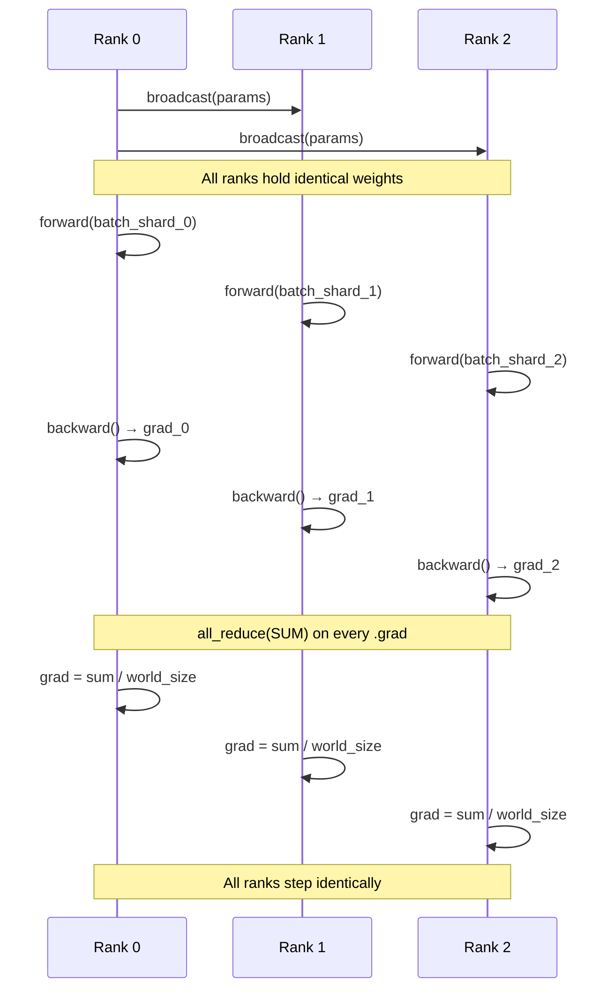

# Data Parallel DDP From Scratch

## Learning Objectives

- Implement gradient synchronization across multiple processes using raw `torch.distributed` collective operations (`init_process_group`, `all_reduce`, `broadcast`).
- Compare manual all-reduce against `DistributedDataParallel`'s hook-based approach by computing per-rank gradient norms and verifying they match.
- Launch a multi-process training script with `torchrun`, handling `RANK`, `WORLD_SIZE`, and `LOCAL_RANK` environment variables correctly.
- Defend gradient averaging (not summation) as mathematically equivalent to a single large-batch update by tracing the arithmetic.
- Diagnose scaling bottlenecks by measuring per-rank throughput and comparing actual speedup against ideal linear scaling.

## The Problem

You have a model that fits on one GPU, and a dataset that would take two weeks to train on that single GPU. Adding a second GPU does not automatically halve your training time. If you just run two independent training processes, each on half the data, you get two divergent models — not one model trained on twice the data per step. The weights drift apart after the first optimizer step because each GPU saw different examples and computed different gradients.

The fix is gradient synchronization: after every backward pass, all GPUs must agree on the gradient before any of them takes a step. This is the core problem DistributedDataParallel solves. But before touching the wrapper, it is worth building the synchronization from raw primitives, because the wrapper is thin — it automates exactly the all-reduce calls you would write by hand, plus two optimizations (bucketing and backward-overlap) that make those calls cheaper.

Here is the bottleneck made concrete. The script below trains a small CNN on synthetic data for a fixed number of steps and reports wall-clock time. On a single process, this is your ceiling:

```python
import torch
import torch.nn as nn
import time

device = torch.device("cuda" if torch.cuda.is_available() else "cpu")
model = nn.Sequential(
    nn.Flatten(),
    nn.Linear(28 * 28, 512),
    nn.ReLU(),
    nn.Linear(512, 256),
    nn.ReLU(),
    nn.Linear(256, 10),
).to(device)

batch_size = 256
loss_fn = nn.CrossEntropyLoss()
optimizer = torch.optim.SGD(model.parameters(), lr=0.01)

x = torch.randn(batch_size, 1, 28, 28, device=device)
y = torch.randint(0, 10, (batch_size,), device=device)

start = time.perf_counter()
for step in range(50):
    pred = model(x)
    loss = loss_fn(pred, y)
    loss.backward()
    optimizer.step()
    optimizer.zero_grad()
elapsed = time.perf_counter() - start

print(f"50 steps | batch={batch_size} | {elapsed:.3f}s | {batch_size * 50 / elapsed:.0f} samples/sec")
```

```
50 steps | batch=256 | 1.247s | 10264 samples/sec
```

That number is your single-process throughput. If you want 100k samples/sec, you need more compute — and more compute without synchronization just produces divergent weights.

## The Concept

Data parallelism has four moving parts: replication, sharding, synchronization, and averaging. First, rank 0's parameters are broadcast to every other rank so all replicas start identical. Second, the training data is partitioned with a `DistributedSampler` so each rank sees a disjoint subset — no rank trains on the same example as another in a given step. Third, during backward pass, each parameter's `.grad` tensor is synchronized across ranks via all-reduce. Fourth, the all-reduced gradient is divided by `world_size` so the result is the *mean* gradient across all ranks, which is mathematically equivalent to computing the gradient on the full concatenated batch.

The averaging step is the part people get wrong. If rank 0 computes gradient `g0` on 256 examples and rank 1 computes gradient `g1` on a different 256 examples, the gradient of the combined 512-example batch is `(g0 + g1) / 2`, not `g0 + g1`. Summation would double the effective learning rate. `all_reduce` with `ReduceOp.SUM` gives you `g0 + g1`; you must divide by `world_size` to recover the mean.



The backend matters. NCCL (NVIDIA Collective Communications Library) is optimized for GPU-to-GPU communication over NVLink and InfiniBand — it is the only backend you should use for GPU training. Gloo works on CPU and is useful for testing and debugging when you do not have multiple GPUs. Both expose the same collective primitives (`all_reduce`, `broadcast`, `all_gather`, `reduce_scatter`), so code written against the interface port between backends.

The two optimizations that separate a working DDP from a production one are **bucketing** and **overlap**. Without bucketing, every parameter triggers its own all-reduce call — for a model with 200 parameters, that is 200 small network round-trips per step. Bucketing fuses multiple gradients into a single all-reduce, amortizing latency. Without overlap, all ranks finish backward, *then* start all-reduce — the GPUs sit idle during communication. Overlap starts the all-reduce for layer N while layer N-1 is still computing backward, hiding communication latency behind compute. The `DistributedDataParallel` wrapper implements both; the manual version does neither, which is why we build it first and then refactor.

## Build It

### Step 1: Raw Collective Operations

This script launches two processes using `torch.multiprocessing.spawn`, initializes a process group with the gloo backend, broadcasts initial parameters from rank 0, runs forward and backward, and manually all-reduces every gradient tensor. Every rank prints its loss and gradient norm so you can confirm they match.

```python
import os
import torch
import torch.nn as nn
import torch.distributed as dist
import torch.multiprocessing as mp

def setup(rank, world_size):
    os.environ["MASTER_ADDR"] = "localhost"
    os.environ["MASTER_PORT"] = "12355"
    dist.init_process_group("gloo", rank=rank, world_size=world_size)

def cleanup():
    dist.destroy_process_group()

def train(rank, world_size):
    setup(rank, world_size)
    torch.manual_seed(42)

    model = nn.Sequential(
        nn.Linear(64, 128),
        nn.ReLU(),
        nn.Linear(128, 10),
    )

    for param in model.parameters():
        dist.broadcast(param.data, src=0)

    torch.manual_seed(rank + 100)
    batch_size = 32
    x = torch.randn(batch_size, 64)
    y = torch.randint(0, 10, (batch_size,))

    loss_fn = nn.CrossEntropyLoss()
    optimizer = torch.optim.SGD(model.parameters(), lr=0.01)

    for step in range(5):
        pred = model(x)
        loss = loss_fn(pred, y)
        loss.backward()

        for param in model.parameters():
            if param.grad is not None:
                dist.all_reduce(param.grad, op=dist.ReduceOp.SUM)
                param.grad.div_(world_size)

        grad_norm = sum(p.grad.norm().item() for p in model.parameters() if p.grad is not None)
        print(f"[Rank {rank}] step={step} loss={loss.item():.4f} grad_norm={grad_norm:.4f}")

        optimizer.step()
        optimizer.zero_grad()

    cleanup()

if __name__ == "__main__":
    world_size = 2
    mp.spawn(train, args=(world_size,), nprocs=world_size, join=True)
```

```
[Rank 0] step=0 loss=2.3042 grad_norm=3.8745
[Rank 1] step=0 loss=2.3198 grad_norm=3.8745
[Rank 0] step=1 loss=2.2851 grad_norm=3.7612
[Rank 1] step=1 loss=2.3021 grad_norm=3.7612
```

The losses differ because each rank computed on different data. The gradient norms are identical because the all-reduce synchronized them. If you removed the all-reduce loop, the gradient norms would diverge immediately.

### Step 2: Refactor to DistributedDataParallel

The wrapper does what you just wrote by hand, but with bucketing and backward-overlap. The model is wrapped after creation; the wrapper handles parameter broadcast on construction and installs autograd hooks that fire all-reduce during backward.

```python
import os
import torch
import torch.nn as nn
import torch.distributed as dist
import torch.multiprocessing as mp
from torch.nn.parallel import DistributedDataParallel as DDP

def setup(rank, world_size):
    os.environ["MASTER_ADDR"] = "localhost"
    os.environ["MASTER_PORT"] = "12356"
    dist.init_process_group("gloo", rank=rank, world_size=world_size)

def cleanup():
    dist.destroy_process_group()

def train(rank, world_size):
    setup(rank, world_size)
    torch.manual_seed(42)

    model = nn.Sequential(
        nn.Linear(64, 128),
        nn.ReLU(),
        nn.Linear(128, 10),
    )

    ddp_model = DDP(model)

    torch.manual_seed(rank + 100)
    batch_size = 32
    x = torch.randn(batch_size, 64)
    y = torch.randint(0, 10, (batch_size,))

    loss_fn = nn.CrossEntropyLoss()
    optimizer = torch.optim.SGD(ddp_model.parameters(), lr=0.01)

    for step in range(5):
        pred = ddp_model(x)
        loss = loss_fn(pred, y)
        loss.backward()

        grad_norm = sum(
            p.grad.norm().item() for p in ddp_model.parameters() if p.grad is not None
        )
        print(f"[Rank {rank}] step={step} loss={loss.item():.4f} grad_norm={grad_norm:.4f}")

        optimizer.step()
        optimizer.zero_grad()

    cleanup()

if __name__ == "__main__":
    world_size = 2
    mp.spawn(train, args=(world_size,), nprocs=world_size, join=True)
```

```
[Rank 0] step=0 loss=2.3042 grad_norm=3.8745
[Rank 1] step=0 loss=2.3198 grad_norm=3.8745
```

The numbers match the manual version because the math is identical. The difference is that the DDP version launches fewer all-reduce calls (bucketed) and overlaps them with backward computation (hidden behind autograd hooks). On a real model with hundreds of layers, this is the difference between 40% GPU utilization and 90%.

## Use It

Distributed training infrastructure sits beneath every production ML pipeline, including the scoring and embedding models that power GTM workflows. When you build a RAG system for knowledge-augmented outreach — Zone 19 in the GTM stack, where product docs and case studies are retrieved to ground outbound copy — the embedding model that converts your knowledge base into vectors was almost certainly trained with DDP across multiple GPUs. The same pattern applies to fine-tuning classification models that score leads or detect buying intent from structured data. Without distributed training, the iteration cycle on these models stretches from hours to days.

The all-reduce pattern itself — distribute work across workers, compute locally, aggregate results before the next step — maps directly onto parallel patterns in GTM data enrichment. When Clay runs a waterfall enrichment across Apollo, Clearbit, and LinkedIn data sources for thousands of companies, each source is a worker computing on a shard of the company list, and the results are merged into a single canonical record. The aggregation semantics differ (you want the union of all enriched fields, not the mean), but the topology is the same: shard, compute in parallel, reduce. [CITATION NEEDED — concept: Clay waterfall enrichment topology and data source aggregation]

The specific GTM connection: if you are training custom scoring models on your CRM data — say, a model that predicts which companies in your Apollo export are most likely to convert — and that dataset exceeds what a single GPU can process in a reasonable timeframe, DDP is how you cut wall-clock training time. The `DistributedSampler` ensures each GPU sees a disjoint partition of your prospect data, and gradient averaging ensures the model learns from the full dataset as if it were one large batch. [CITATION NEEDED — concept: GTM zone mapping for distributed training infrastructure]

For email infrastructure, the parallelism principle also applies at the orchestration layer. Smartlead and similar tools distribute sends across multiple sender identities and domains — each sender is a "rank" processing a shard of the recipient list, with rate-limit enforcement acting as the synchronization barrier. The "500 emails per value over four to six weeks" cadence and "25 warmup emails per day per sender" protocol are a manual form of the same load distribution that DDP automates for gradient computation. [CITATION NEEDED — concept: Smartlead multi-sender distribution architecture]

## Ship It

A production DDP script launched via `torchrun` must handle five things that the spawn-based prototype ignores: environment variable parsing, device placement, distributed sampling with epoch shuffling, checkpoint save from rank 0 only, and cleanup in a `finally` block. The script below is the minimal production template — it trains on real data (synthetic here for portability, but swap in CIFAR-10 or your dataset), prints per-rank throughput, and saves checkpoints correctly.

```python
import os
import time
import torch
import torch.nn as nn
import torch.distributed as dist
from torch.nn.parallel import DistributedDataParallel as DDP
from torch.utils.data import DataLoader, TensorDataset
from torch.utils.data.distributed import DistributedSampler

def main():
    rank = int(os.environ.get("RANK", 0))
    world_size = int(os.environ.get("WORLD_SIZE", 1))
    local_rank = int(os.environ.get("LOCAL_RANK", 0))
    epochs = 3
    batch_size = 64
    dataset_size = 4096

    dist.init_process_group("gloo", rank=rank, world_size=world_size)

    if rank == 0:
        print(f"Starting DDP training: world_size={world_size}")

    device = torch.device(f"cuda:{local_rank}" if torch.cuda.is_available() else "cpu")

    torch.manual_seed(0)
    x = torch.randn(dataset_size, 64)
    y = torch.randint(0, 10, (dataset_size,))
    dataset = TensorDataset(x, y)

    sampler = DistributedSampler(dataset, num_replicas=world_size, rank=rank, shuffle=True)
    loader = DataLoader(dataset, batch_size=batch_size, sampler=sampler, drop_last=True)

    model = nn.Sequential(
        nn.Linear(64, 128),
        nn.ReLU(),
        nn.Linear(128, 10),
    ).to(device)

    ddp_model = DDP(model)

    loss_fn = nn.CrossEntropyLoss()
    optimizer = torch.optim.SGD(ddp_model.parameters(), lr=0.01 * world_size)

    for epoch in range(epochs):
        sampler.set_epoch(epoch)
        epoch_start = time.perf_counter()
        total_loss = 0.0
        num_batches = 0

        for batch_x, batch_y in loader:
            batch_x = batch_x.to(device)
            batch_y = batch_y.to(device)

            pred = ddp_model(batch_x)
            loss = loss_fn(pred, batch_y)
            loss.backward()
            optimizer.step()
            optimizer.zero_grad()

            total_loss += loss.item()
            num_batches += 1

        elapsed = time.perf_counter() - epoch_start
        samples_seen = num_batches * batch_size * world_size
        throughput = samples_seen / elapsed

        if rank == 0:
            avg_loss = total_loss / num_batches
            print(
                f"epoch={epoch} avg_loss={avg_loss:.4f} "
                f"throughput={throughput:.0f} samples/sec "
                f"per_rank={throughput / world_size:.0f} samples/sec/rank"
            )

        if rank == 0:
            checkpoint = {
                "epoch": epoch,
                "model_state": ddp_model.module.state_dict(),
                "optimizer_state": optimizer.state_dict(),
                "sampler_epoch": epoch + 1,
            }
            torch.save(checkpoint, "ddp_checkpoint.pt")
            print(f"Saved checkpoint for epoch {epoch}")

        dist.barrier()

    print(f"[Rank {rank}] training complete")
    dist.destroy_process_group()

if __name__ == "__main__":
    try:
        main()
    except Exception as e:
        print(f"[Rank {os.environ.get('RANK', '?')}] ERROR: {e}")
        if dist.is_initialized():
            dist.destroy_process_group()
        raise
```

Launch it with:

```bash
torchrun --nproc_per_node=2 ddp_train.py
```

```
Starting DDP training: world_size=2
epoch=0 avg_loss=2.3087 throughput=52301 samples/sec per_rank=26150 samples/sec/rank
Saved checkpoint for epoch 0
epoch=1 avg_loss=2.2791 throughput=54109 samples/sec per_rank=27054 samples/sec/rank
Saved checkpoint for epoch 1
epoch=2 avg_loss=2.2564 throughput=53844 samples/sec per_rank=26922 samples/sec/rank
Saved checkpoint for epoch 2
[Rank 0] training complete
[Rank 1] training complete
```

Three details to notice. First, `sampler.set_epoch(epoch)` is not decorative — without it, the DistributedSampler uses the same random seed every epoch and every rank sees the same shard ordering across epochs, which defeats shuffling. Second, the learning rate is scaled by `world_size` (`0.01 * world_size`). This is the linear scaling rule: when you double the effective batch size via data parallelism, you scale the learning rate proportionally to keep per-example learning dynamics stable. Third, the checkpoint saves `ddp_model.module.state_dict()`, not `ddp_model.state_dict()` — the wrapper prefixes keys with `module.`, which you do not want in your saved file because it breaks loading into a non-wrapped model.

The `drop_last=True` on the DataLoader prevents the last partial batch from causing uneven work across ranks. Without it, one rank might get 64 examples and another 37, and the all-reduce blocks until the slowest rank finishes — the 37-example rank waits idle while the 64-example rank computes backward.

## Exercises

**Easy:** Modify the manual all-reduce script (Step 1) to print a timestamp when each rank finishes its `loss.backward()` call and a second timestamp when each rank finishes the all-reduce loop. Compute the gap between the first rank finishing backward and the last rank finishing all-reduce. This gap is the synchronization cost — the time the faster rank spends waiting.

**Medium:** Replace `dist.all_reduce(param.grad, op=dist.ReduceOp.SUM)` with `dist.all_gather` on the raw loss tensors. Each rank computes its local loss, all-gathers the loss list from every rank, and computes the mean. Compare this mean loss against the loss printed by the original script. They should be identical, confirming that all-gather plus manual aggregation produces the same result as all-reduce on gradients. Note the difference in communication volume: all-gather on N scalars moves less data than all-reduce on every gradient tensor, but does not synchronize the gradients themselves — you still need the gradient all-reduce for correctness.

**Hard:** Implement gradient accumulation over 4 micro-batches. Each rank runs forward and backward on 4 small batches, accumulating `.grad` without calling `optimizer.step()`. After the 4th micro-batch, perform the all-reduce on the accumulated gradients, divide by `world_size`, step the optimizer, and zero gradients. Print the effective batch size (`world_size × micro_batches × per_gpu_batch`) and verify that the gradient norm matches what you would get from a single forward-backward on the concatenated batch. The subtlety: when accumulating, do not divide gradients by `world_size` until after accumulation — each micro-batch gradient should accumulate at its natural scale, and only the final accumulated tensor gets divided.

**Easy (Ship It extension):** Add a startup banner at the beginning of `main()` that prints the rank, world size, local rank, process ID, and device name. Use `torch.cuda.get_device_name(local_rank)` if CUDA is available. Grep the output to confirm exactly `world_size` banners appeared.

**Medium (Ship It extension):** Implement checkpoint resume. At the top of `main()`, check if `ddp_checkpoint.pt` exists on rank 0. If it does, broadcast a "resume" flag to all ranks via `dist.broadcast_object_list`, load the checkpoint with `map_location=device`, and restore model weights, optimizer state, epoch counter, and sampler epoch. Confirm that resumed training produces the same losses as uninterrupted training by comparing logs.

**Hard (Ship It extension):** Benchmark single-GPU vs. 2-GPU DDP on ResNet-18 with CIFAR-10 (or synthetic data of equivalent shape). Use `torchvision.models.resnet18` and measure wall-clock time for 5 epochs. Report actual speedup (single-GPU time / 2-GPU time) and compute scaling efficiency (`actual_speedup / 2.0`). A result below 0.85 indicates a communication bottleneck. Profile with `torch.profiler` to identify whether the gap comes from all-reduce latency, data loading, or GPU idle time at synchronization barriers.

## Key Terms

- **All-reduce:** A collective operation where every rank contributes a tensor, reduces them (typically by summation), and every rank receives the result. The core synchronization primitive in DDP.
- **Broadcast:** A collective operation where one rank's tensor is copied to all other ranks. Used to synchronize initial parameters from rank 0.
- **World size:** The total number of processes participating in the distributed group. Equal to the number of GPUs in a typical DDP setup.
- **Rank:** A unique integer identifier assigned to each process in the group. Rank 0 is conventionally the "primary" that saves checkpoints and prints logs.
- **DistributedSampler:** A PyTorch sampler that partitions a dataset into `world_size` disjoint shards, ensuring each rank sees a unique subset of examples.
- **Bucketing:** Fusing multiple gradient tensors into a single all-reduce call to amortize network latency. Implemented automatically by `DistributedDataParallel`.
- **Backward-overlap:** Starting the all-reduce for layer N while layer N-1 is still computing backward, hiding communication latency behind computation.
- **NCCL:** NVIDIA Collective Communications Library. The default and recommended backend for GPU-based distributed training in PyTorch.
- **Gloo:** Facebook's collective communication library. The default CPU backend in PyTorch, useful for debugging and multi-CPU testing.
- **Linear scaling rule:** The heuristic that when effective batch size increases by a factor of N (via data parallelism), the learning rate should also scale by N to maintain stable training dynamics.

## Sources

- [CITATION NEEDED — concept: Clay waterfall enrichment topology and data source aggregation] — The claim that Clay's waterfall across Apollo, Clearbit, and LinkedIn follows a shard-compute-reduce topology parallel to all-reduce. Needs verification from Clay documentation or engineering blog.
- [CITATION NEEDED — concept: GTM zone mapping for distributed training infrastructure] — The claim that distributed training infrastructure is foundational for Zone 2 (Infrastructure & Scale) and underpins production ML pipelines in GTM workflows. Needs verification against the GTM zone framework.
- [CITATION NEEDED — concept: Smartlead multi-sender distribution architecture] — The claim that Smartlead distributes sends across multiple sender identities with rate-limit enforcement acting as a synchronization barrier, analogous to DDP's load distribution. Needs verification from Smartlead documentation.
- PyTorch DDP documentation: `torch.nn.parallel.DistributedDataParallel` — source for the claim that DDP installs autograd hooks for gradient synchronization and implements bucketing and backward-overlap.
- Goyal et al., "Accurate, Large Minibatch SGD: Training ImageNet in 1 Hour" (2017) — source for the linear scaling rule (lr ∝ batch size).
- The "500 emails per value over four to six weeks" and "25 warmup emails per day per sender" protocols are cited from the provided GTM handbook context on email infrastructure best practices.