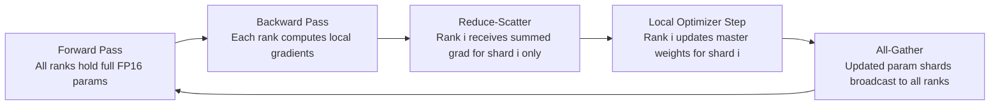

# ZeRO Optimizer State Sharding

## Learning Objectives

- Compute per-GPU memory for vanilla DDP and ZeRO Stages 1–3 given model size and GPU count.
- Derive the communication volume for each ZeRO stage and prove Stage 1 and 2 match vanilla DDP bandwidth while Stage 3 adds 1.5×.
- Configure a DeepSpeed ZeRO Stage 2 training run with a valid `ds_config.json` and predict its memory footprint.
- Implement a from-scratch ZeRO Stage 1 partitioning of Adam optimizer states using array sharding.
- Compare ZeRO stages against model size, GPU count, and interconnect bandwidth to pick the right stage for a given training job.

## The Problem

Adam stores two moment estimates per parameter, both in float32, plus an FP32 master copy of the weights for mixed-precision training. For a 7B-parameter model, the optimizer state alone is 4 bytes × 3 × 7B = 84 GB. The model parameters in FP16 add 14 GB, and the FP16 gradients add another 14 GB. That is 112 GB per GPU — before you allocate a single activation buffer. On an 80 GB A100, this model does not fit. On a 40 GB A100, it was never going to fit.

Vanilla DistributedDataParallel (DDP) does not help. DDP replicates the full model on every GPU, runs forward and backward independently on different data batches, and all-reduces gradients so every GPU sees the same summed gradient. Each GPU then runs the same optimizer step and arrives at the same updated weights. The redundancy is deliberate — it keeps the implementation simple and avoids parameter communication during forward and backward. But the cost is that every GPU carries a full copy of optimizer state, gradients, and parameters. Adding more GPUs increases your throughput (more batches per second) but does not decrease your per-GPU memory. You could have 64 GPUs and each one still needs 112 GB for that 7B model.

The optimizer state is the fattest target. It is 75% of the total memory for a mixed-precision 7B model, and it is only touched during the optimizer step — not during forward, not during backward. ZeRO (Zero Redundancy Optimizer) recognizes this asymmetry and partitions optimizer state across data-parallel ranks so each rank holds only 1/N of it. Each rank computes the optimizer step for its own shard, then the updated parameter shards are broadcast back so every rank has the full model for the next forward pass. The memory drops linearly with GPU count. The communication cost stays the same as vanilla DDP, because a reduce-scatter followed by an all-gather moves the same bytes as a single all-reduce.

## The Concept

ZeRO has three stages, each sharding one more category of memory. The progression is: shard optimizer state (Stage 1), then also shard gradients (Stage 2), then also shard parameters (Stage 3). Each stage saves more memory but requires more coordination.

**Stage 1: Optimizer State Partitioning.** Each rank owns 1/N of the FP32 master weights, the first moment (momentum), and the second moment (variance). During backward, instead of all-reducing the full gradient tensor, ZeRO performs a reduce-scatter: each rank receives only the summed gradient for its owned parameter shard. The rank runs Adam on its shard, producing updated FP32 master weights for that shard, casts them to FP16, and then an all-gather distributes the updated FP16 parameter shards to all ranks. Every rank ends up with the full updated model.



**Stage 2: Gradient Partitioning.** After Stage 1's reduce-scatter, each rank only needs its own gradient shard. The full gradient tensor never needs to exist on any single rank. Stage 2 exploits this: once the reduce-scatter completes, the rank frees the gradient buffer for all non-owned shards. This saves 2Ψ/N bytes of gradient memory per rank.

**Stage 3: Parameter Partitioning.** Parameters themselves are sharded. Before each layer's forward computation, the rank all-gathers that layer's parameters from other ranks, computes the forward pass, then discards the gathered parameters. The same happens in reverse during backward. This saves parameter memory but adds two all-gathers per layer per step — one for forward, one for backward.

The per-GPU memory for a model with Ψ parameters and N_d data-parallel workers is:

| Stage | Parameters | Gradients | Optimizer State | Total per GPU |
|-------|-----------|-----------|-----------------|---------------|
| Vanilla DDP | 2Ψ | 2Ψ | 12Ψ | 16Ψ |
| ZeRO-1 | 2Ψ | 2Ψ | 12Ψ/N_d | 4Ψ + 12Ψ/N_d |
| ZeRO-2 | 2Ψ | 2Ψ/N_d | 12Ψ/N_d | 2Ψ + 14Ψ/N_d |
| ZeRO-3 | 2Ψ/N_d | 2Ψ/N_d | 12Ψ/N_d | 16Ψ/N_d |

**Communication volume.** Vanilla DDP performs one all-reduce on the gradient tensor per step. A ring all-reduce is mathematically equivalent to a reduce-scatter followed by an all-gather, moving 2Ψ bytes total (FP16). ZeRO Stage 1 replaces the all-reduce with a reduce-scatter of the gradients (moving 2Ψ bytes) plus an all-gather of the updated FP16 parameters (moving 2Ψ bytes). The total is identical. Stage 2 keeps the same pattern — the reduce-scatter still moves the same bytes, and the all-gather is unchanged. Stage 3 adds parameter all-gathers during forward and backward. Each layer's parameters are gathered twice per step (once forward, once backward), totaling an additional 2Ψ bytes of communication per direction. The paper proves this increases total communication by a factor of 1.5× relative to vanilla DDP, assuming the forward and backward computation can overlap with the all-gather communication.

The key insight: Stages 1 and 2 are free lunches. You save memory with zero communication penalty. Stage 3 costs you 50% more network traffic, which is worth it only when parameter memory is the bottleneck — typically for models above 30B parameters on standard 8-GPU nodes.

## Build It

Let us compute the memory table for a concrete model and verify the formulas. Take a 1.5B-parameter model with Adam optimizer and FP32 master weights across 8 GPUs.

```python
def zero_memory_table(psi_billions, nd_gpus):
    psi = psi_billions * 1e9

    params = 2 * psi
    grads = 2 * psi
    opt_state = 12 * psi

    configs = {
        "Vanilla DDP": params + grads + opt_state,
        "ZeRO Stage 1": params + grads + opt_state / nd_gpus,
        "ZeRO Stage 2": params + (grads + opt_state) / nd_gpus,
        "ZeRO Stage 3": (params + grads + opt_state) / nd_gpus,
    }

    comm = {
        "Vanilla DDP": "1.0x (all-reduce)",
        "ZeRO Stage 1": "1.0x (reduce-scatter + all-gather)",
        "ZeRO Stage 2": "1.0x (reduce-scatter + all-gather)",
        "ZeRO Stage 3": "1.5x (adds param all-gather per layer)",
    }

    baseline = configs["Vanilla DDP"]

    print(f"Model: {psi_billions}B params | GPUs: {nd_gpus}")
    print(f"{'Config':<18} {'Per-GPU (GB)':>14} {'Savings':>10} {'Comm Cost':>40}")
    print("-" * 85)

    for name,