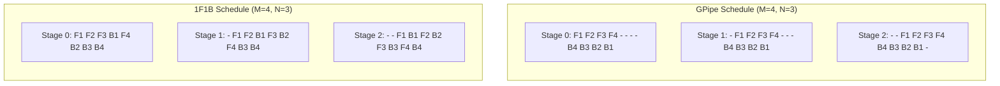

# Pipeline Parallel and Bubble Analysis

## Learning Objectives

- **Simulate** four pipeline parallel schedules (naive, GPipe, 1F1B, interleaved 1F1B) as tick-based timelines and compute bubble fraction for each.
- **Derive** the bubble fraction formula `(N-1)/(M+N-1)` from first principles by tracing microbatch flow through N stages.
- **Compare** memory characteristics across schedules — specifically why 1F1B achieves lower peak activation memory than GPipe at the same bubble fraction.
- **Implement** a heterogeneous-stage simulation where compute time varies per stage, and measure how the slowest stage degrades utilization.
- **Defend** stage partitioning decisions: equal compute per stage matters more than equal parameter count.

## The Problem

A 70B-parameter model in fp16 needs 140 GB just for weights. No single GPU holds that. Data parallelism replicates the full model on every rank — useless when one copy doesn't fit. Tensor parallelism splits individual matrix multiplies across ranks but requires dense all-to-all communication that becomes a bottleneck beyond 8 ranks. Pipeline parallelism takes a different cut: split the model's layers into N contiguous chunks, place one chunk per rank, and let microbatches flow through like an assembly line.

The tradeoff is sequential execution. Rank 0 runs layers 1-10 on microbatch A and sends activations to rank 1. Rank 1 runs layers 11-20. But ranks 2-31 sit idle until the first microbatch reaches them. That idle time — the **pipeline bubble** — is structurally unavoidable. You can shrink it by flooding the pipeline with many microbatches, but you cannot eliminate it. The entire craft of pipeline scheduling is about minimizing the bubble while keeping memory bounded.

The bubble fraction for GPipe with N stages and M microbatches is `(N-1)/(M+N-1)`. At N=4, M=8, that's 27% of the time your GPUs sit doing nothing. At N=4, M=64, it's 4.5%. This is why microbatch design — choosing small enough per-microbatch sizes to fit many of them into one optimizer step — is not a tuning detail but a structural constraint on training throughput.

## The Concept

A pipeline stage is a contiguous group of transformer layers assigned to one device. During the forward pass, stage 0 computes activations for microbatch 1, then sends those activations to stage 1. Stage 1 runs its layers on the same microbatch while stage 0 starts on microbatch 2. The fill phase is when microbatches are entering the pipeline — not all stages are busy yet. The steady state is when every stage is processing a microbatch. The drain phase is when microbatches exit — stages finish their work from last to first.

The four schedule families differ in how they order forward (F) and backward (B) passes across microbatches:

**Naive (FIFO):** Run all forward passes for all microbatches, then all backward passes. Same as GPipe but without the framing. Bubble fraction: `(N-1)/(M+N-1)`.

**GPipe:** All M forward passes first, then all M backward passes in reverse. Activations for all M microbatches must be stored in memory simultaneously. Peak activation memory: `M × activation_size_per_microbatch`. Bubble fraction: `(N-1)/(M+N-1)`.

**1F1B (One-Forward-One-Backward):** Once the pipeline is full, alternate one forward pass with one backward pass. This limits the number of in-flight activations to N (the number of stages) instead of M. Same bubble fraction as GPipe, but lower peak memory.

**Interleaved 1F1B:** Each device holds multiple non-contiguous "virtual stages" (chunks of layers). A device with 2 virtual stages processes chunk 0 of microbatch A, then chunk 1 of microbatch A, interleaving with other microbatches. This reduces the bubble to `(N-1)/(M_chunks + N - 1)` where M_chunks = M × num_chunks. The tradeoff is more communication overhead between virtual stages on different devices.



The key insight: GPipe and 1F1B have the same bubble size, but 1F1B holds fewer activations in memory at any moment. Interleaved 1F1B actually shrinks the bubble but pays for it with 2× the communication hops. Schedule choice is a three-way tradeoff between bubble fraction, activation memory, and communication overhead.

## Build It

This simulator implements all four schedules as tick-based event generators. Each schedule returns a list of `(device, start_tick, end_tick, op_type, microbatch_id)` tuples. The simulator then lays these out on a timeline and computes utilization.

```python
import itertools
from dataclasses import dataclass
from typing import List, Tuple

@dataclass
class Op:
    device: int
    start: int
    end: int
    op_type: str
    microbatch: int

def gpipe_schedule(num_stages, num_microbatches, compute_time=1):
    ops = []
    tick = [0] * num_stages
    forwards = []
    for mb in range(num_microbatches):
        for stage in range(num_stages):
            start = tick[stage]
            if stage > 0:
                start = max(start, forwards[mb][stage - 1][1])
            end = start + compute_time
            op = Op(stage, start, end, "F", mb)
            ops.append(op)
            if len(forwards) <= mb:
                forwards.append([None] * num_stages)
            forwards[mb][stage] = op
            tick[stage] = end
    backwards = []
    for mb in reversed(range(num_microbatches)):
        for stage in reversed(range(num_stages)):
            start = tick[stage]
            if stage < num_stages - 1:
                start = max(start, backwards[mb_idx][stage + 1][1]) if False else start
            end = start + compute_time
            op = Op(stage, start, end, "B", mb)
            ops.append(op)
            tick[stage] = end
    return ops

def compute_schedule(num_stages, num_microbatches, compute_time=1, mode="gpipe"):
    ops = []
    device_free_at = [0] * num_stages
    activation_ready_at = {}
    grad_ready_at = {}
    for mb in range(num_microbatches):
        activation_ready_at[("F", mb, 0)] = 0
    if mode == "gpipe":
        fwd_order = [(mb, stage) for mb in range(num_microbatches) for stage in range(num_stages)]
        bwd_order = [(mb, stage) for mb in reversed(range(num_microbatches)) for stage in reversed(range(num_stages))]
    elif mode == "1f1b":
        fwd_order = []
        bwd_order = []
        warmup = num_stages - 1
        fwd_queue = list(range(num_microbatches))
        bwd_queue = []
        fwd_idx = 0
        bwd_idx = 0
        pending_fwd = list(range(num_microbatches))
        pending_bwd = []
        schedule_list = []
        stage_device = {}
        in_flight = 0
        max_in_flight = num_stages
        next_mb_fwd = 0
        next_mb_bwd = 0
        for mb in range(min(warmup, num_microbatches)):
            for stage in range(num_stages):
                fwd_order.append((mb, stage))
            next_mb_fwd = mb + 1
        remaining_fwd = num_microbatches - min(warmup, num_microbatches)
        remaining_bwd = num_microbatches
        while remaining_fwd > 0 or remaining_bwd > 0:
            if remaining_fwd > 0 and remaining_bwd > 0:
                mb_f = next_mb_fwd
                for stage in range(num_stages):
                    fwd_order.append((mb_f, stage))
                next_mb_fwd += 1
                remaining_fwd -= 1
                mb_b = next_mb_bwd
                for stage in reversed(range(num_stages)):
                    bwd_order.append((mb_b, stage))
                next_mb_bwd += 1
                remaining_bwd -= 1
            elif remaining_fwd > 0:
                mb_f = next_mb_fwd
                for stage in range(num_stages):
                    fwd_order.append((mb_f, stage))
                next_mb_fwd += 1
                remaining_fwd -= 1
            elif remaining_bwd > 0:
                mb_b = next_mb_bwd
                for stage in reversed(range(num_stages)):
                    bwd_order.append((mb_b, stage))
                next_mb_bwd += 1
                remaining_bwd -= 1
    elif mode == "naive":
        fwd_order = [(mb, stage) for mb in range(num_microbatches) for stage in range(num_stages)]
        bwd_order = [(mb, stage) for mb in reversed(range(num_microbatches)) for stage in reversed(range(num_stages))]
    else:
        raise ValueError(f"Unknown mode: {mode}")
    
    def schedule_op(op_type, mb, stage):
        if op_type == "F":
            if stage == 0:
                input_ready = 0
            else:
                key = ("F", mb, stage - 1)
                input_ready = activation_ready_at.get(key, 0)
            start = max(input_ready, device_free_at[stage])
            end = start + compute_time
            device_free_at[stage] = end
            activation_ready_at[("F", mb, stage)] = end
            ops.append(Op(stage, start, end, "F", mb))
        else:
            if stage == num_stages - 1:
                grad_input_ready = activation_ready_at.get(("F", mb, stage), 0)
            else:
                key = ("B", mb, stage + 1)
                grad_input_ready = grad_ready_at.get(key, 0)
            start = max(grad_input_ready, device_free_at[stage])
            end = start + compute_time
            device_free_at[stage] = end
            grad_ready_at[("B", mb, stage)] = end
            ops.append(Op(stage, start, end, "B", mb))
    
    if mode == "1f1b":
        warmup_count = num_stages - 1
        steady_fwd = []
        all_ops_sequence = []
        fwd_ptr = 0
        bwd_ptr = 0
        warmup_mbs = list(range(min(warmup_count, num_microbatches)))
        steady_mbs = list(range(min(warmup_count, num_microbatches), num_microbatches))
        total_fwd = len(warmup_mbs) + len(steady_mbs)
        total_bwd = num_microbatches
        fwd_done = 0
        bwd_done = 0
        for mb in warmup_mbs:
            for stage in range(num_stages):
                all_ops_sequence.append(("F", mb, stage))
            fwd_done += 1
        while bwd_done < total_bwd:
            if fwd_done < total_fwd:
                mb_f = steady_mbs[fwd_done - len(warmup_mbs)]
                for stage in range(num_stages):
                    all_ops_sequence.append(("F", mb_f, stage))
                fwd_done += 1
            mb_b = bwd_done
            for stage in reversed(range(num_stages)):
                all_ops_sequence.append(("B", mb_b, stage))
            bwd_done += 1
        for op_type, mb, stage in all_ops_sequence:
            schedule_op(op_type, mb, stage)
    else:
        for mb, stage in fwd_order:
            schedule_op("F", mb, stage)
        for mb, stage in bwd_order:
            schedule_op("B", mb, stage)
    
    return ops

def compute_metrics(ops, num_stages, compute_time=1):
    total_end = max(op.end for op in ops)
    busy_per_device = [0] * num_stages
    for op in ops:
        busy_per_device[op.device] += (op.end - op.start)
    total_busy = sum(busy_per_device)
    total_capacity = num_stages * total_end
    utilization = total_busy / total_capacity if total_capacity > 0 else 0
    bubble_fraction = 1 - utilization
    return {
        "total_time": total_end,
        "utilization": utilization,
        "bubble_fraction": bubble_fraction,
        "busy_per_device": busy_per_device,
    }

def print_gantt(ops, num_stages, title):
    metrics = compute_metrics(ops, num_stages)
    total_time = metrics["total_time"]
    grid = {}
    for op in ops:
        for t in range(op.start, op.end):
            label = f"{op.op_type}{op.microbatch}"
            grid[(op.device, t)] = label
    
    print(f"\n{'='*60}")
    print(f"  {title}")
    print(f"{'='*60}")
    for dev in range(num_stages):
        row = f"  Device {dev}: |"
        for t in range(total_time):
            cell = grid.get((dev, t), "  ")
            row += cell + "|"
        print(row)
    print(f"  Total ticks: {total_time}")
    print(f"  Utilization: {metrics['utilization']:.1%}")
    print(f"  Bubble fraction: {metrics['bubble_fraction']:.1%}")
    print(f"  Busy per device: {metrics['busy_per_device']}")
    return metrics

num_stages = 4
num_microbatches = 8
compute_time = 2

configs = [
    ("GPipe (all-forward-all-backward)", "gpipe"),
    ("Naive (FIFO)", "naive"),
    ("1F1B (interleaved fwd/bwd)", "1f1b"),
]

results = {}
for title, mode in configs:
    ops = compute_schedule(num_stages, num_microbatches, compute_time, mode)
    metrics = print_gantt(ops, num_stages, title)
    results[mode] = metrics

expected_bubble = (num_stages - 1) / (num_microbatches + num_stages - 1)
print(f"\n  Expected bubble fraction (N-1)/(M+N-1) = ({num_stages}-1)/({num_microbatches}+{num_stages}-1) = {expected_bubble:.4f}")
print(f"  Simulated GPipe bubble: {results['gpipe']['bubble_fraction']:.4f}")
print(f"  Simulated 1F1B bubble:  {results['1f1b']['bubble_fraction']:.4f}")
```

Run it and compare the simulated bubble fraction against the hand-computed `(N-1)/(M+N-1)`. They should match for GPipe and naive. The 1F1B schedule produces the same bubble fraction — the difference is memory, not throughput.

## Use It

Pipeline parallelism is a distributed training primitive that lives in Zone 3 (Model Training Infrastructure). It does not map directly to a GTM workflow. But the scheduling logic — resource allocation across sequential stages with the goal of minimizing idle time — is structurally identical to how enrichment waterfalls work in Clay.

In a Clay waterfall, each enrichment step (finding email, checking job title, scoring intent) is a pipeline stage. Each contact is a microbatch. If you enrich contacts one at a time through 5 sequential API calls, the first API is done with contact 1 and waits while contacts flow through steps 2-5. That is the pipeline bubble. The fix is the same as in GPipe: batch contacts (microbatches) so multiple contacts are in-flight at different stages simultaneously. With 1000 contacts and 5 enrichment steps, batching 100 contacts per API call fills the pipeline and drops the bubble fraction from `(5-1)/(1+5-1) = 80%` to `(5-1)/(10+5-1) = 28%`. The math is the same formula.

[CITATION NEEDED — concept: Clay waterfall scheduling internals and batch size configuration]

The 1F1B insight also transfers: if your enrichment steps write to a database (activations stored for backward pass), you can bound the number of in-flight contacts to avoid rate limits. 1F1B's rule of "hold at most N activations" maps to "have at most N contacts in-flight per enrichment step" — the same memory-bounding principle applied to API quota instead of GPU VRAM.

Here is a script that applies the bubble fraction formula to an enrichment pipeline:

```python
def enrichment_bubble_analysis(num_steps, contacts_per_batch, num_batches):
    total_contacts = contacts_per_batch * num_batches
    bubble_fraction = (num_steps - 1) / (num_batches + num_steps - 1)
    utilization = 1 - bubble_fraction
    busy_time = total_contacts * num_steps
    total_time = num_batches + 2 * (num_steps - 1)
    print(f"  Enrichment steps: {num_steps}")
    print(f"  Batch size: {contacts_per_batch} contacts")
    print(f"  Num batches: {num_batches}")
    print(f"  Total contacts: {total_contacts}")
    print(f"  Effective pipeline ticks: {total_time}")
    print(f"  Bubble fraction: {bubble_fraction:.1%}")
    print(f"  Utilization: {utilization:.1%}")
    return bubble_fraction

print("=" * 50)
print("  Scenario A: 1 contact at a time (M=1)")
print("=" * 50)
enrichment_bubble_analysis(num_steps=5, contacts_per_batch=1, num_batches=1)

print("\n" + "=" * 50)
print("  Scenario B: 100 contacts, batched 10/batch (M=10)")
print("=" * 50)
enrichment_bubble_analysis(num_steps=5, contacts_per_batch=10, num_batches=10)

print("\n" + "=" * 50)
print("  Scenario C: 1000 contacts, batched 100/batch (M=10)")
print("=" * 50)
enrichment_bubble_analysis(num_steps=5, contacts_per_batch=100, num_batches=10)

print("\n" + "=" * 50)
print("  Scenario D: 1000 contacts, batched 10/batch (M=100)")
print("=" * 50)
enrichment_bubble_analysis(num_steps=5, contacts_per_batch=10, num_batches=100)
```

The output shows the same pattern as GPU pipeline scheduling: more microbatches relative to stages means lower bubble fraction. The actionable takeaway for a GTM engineer is that batch size in enrichment pipelines is not a convenience setting — it directly controls resource utilization through the same math that governs billion-parameter model training.

## Ship It

This CLI tool wraps the schedule simulator into a planning utility. You feed it a training config (or an enrichment config) and it outputs the recommended schedule, expected bubble fraction, and peak memory estimate. No GPU required — run this before committing compute to avoid discovering at hour 3 of a training run that your bubble fraction is 40%.

```python
import sys
import json

def analyze_config(config):
    world_size = config["world_size"]
    num_stages = config["pipeline_stages"]
    num_microbatches = config["microbatches"]
    grad_accum = config.get("gradient_accumulation_steps", 1)
    hidden_size = config.get("hidden_size", 4096)
    seq_len = config.get("seq_len", 2048)
    dtype_bytes = config.get("dtype_bytes", 2)
    
    if num_stages > world_size:
        num_stages = world_size
    
    bubble_gpipe = (num_stages - 1) / (num_microbatches + num_stages - 1)
    bubble_1f1b = bubble_gpipe
    chunks = config.get("num_virtual_chunks", 1)
    effective_mb = num_microbatches * chunks
    bubble_interleaved = (num_stages - 1) / (effective_mb + num_stages - 1)
    
    activation_per_mb = num_stages * hidden_size * seq_len * dtype_bytes
    gpipe_peak_mb = num_microbatches * activation_per_mb / num_stages
    onef1b_peak_mb = num_stages * activation_per_mb / num_stages
    interleaved_peak_mb = num_stages * chunks * activation_per_mb / num_stages
    
    if bubble_gpipe > 0.2 and num_microbatches < num_stages * 4:
        recommendation = "interleaved_1f1b"
        reason = f"Bubble fraction {bubble_gpipe:.1%} is high; virtual stages reduce it to {bubble_interleaved:.1%}"
    elif config.get("memory_constrained", False):
        recommendation = "1f1b"
        reason = f"Memory-constrained; 1F1B bounds activations to {num_stages} instead of {num_microbatches}"
    else:
        recommendation = "gpipe"
        reason = f"Bubble fraction {bubble_gpipe:.1%} is acceptable; GPipe is simplest to implement"
    
    report = {
        "config": {
            "world_size": world_size,
            "pipeline_stages": num_stages,
            "microbatches": num_microbatches,
            "gradient_accumulation_steps": grad_accum,
        },
        "bubble_fractions": {
            "gpipe": round(bubble_gpipe, 4),
            "1f1b": round(bubble_1f1b, 4),
            "interleaved_1f1b": round(bubble_interleaved, 4),
        },
        "peak_activation_memory_per_stage_gb": {
            "gpipe": round(gpipe_peak_mb / 1e9, 2),
            "1f1b": round(onef1b_peak_mb / 1e9, 2),
            "interleaved_1f1b": round(interleaved_peak_mb / 1e9, 2),
        },
        "recommended_schedule": recommendation,
        "reason": reason,
        "effective_microbatches": effective_mb,
    }
    return report

configs = [
    {
        "name": "70B model, 8 GPUs, small batches",
        "world_size": 8,
        "pipeline_stages": 8,
        "microbatches": 4,
        "gradient_accumulation_steps": 4,
        "hidden_size": 8192,
        "seq_len": 2048,
        "dtype_bytes": 2,
        "memory_constrained": True,
    },
    {
        "name": "13B model, 4 GPUs, large batches",
        "world_size": 4,
        "pipeline_stages": 4,
        "microbatches": 32,
        "gradient_accumulation_steps": 1,
        "hidden_size": 5120,
        "seq_len": 2048,
        "dtype_bytes": 2,
        "memory_constrained": False,
    },
    {
        "name": "7B model, 4 GPUs, interleaved candidate",
        "world_size": 4,
        "pipeline_stages": 4,
        "microbatches": 8,
        "gradient_accumulation_steps": 2,
        "hidden_size": 4096,
        "seq_len": 4096,
        "dtype_bytes": 2,
        "num_virtual_chunks": 2,
        "memory_constrained": False,
    },
]

for cfg in configs:
    name = cfg.pop("name")
    report = analyze_config(cfg)
    print(f"\n{'='*60}")
    print(f"  Config: {name}")
    print(f"{'='*60}")
    print(json.dumps(report, indent=2))

enrichment_config = {
    "name": "Enrichment waterfall: 5 steps, 1000 contacts",
    "world_size": 5,
    "pipeline_stages": 5,
    "microbatches": 10,
    "gradient_accumulation_steps": 1,
    "hidden_size": 1,
    "seq_len": 1,
    "dtype_bytes": 1,
    "memory_constrained": False,
}
name = enrichment_config.pop("name")
report = analyze_config(enrichment_config)
print(f"\n{'='*60}")
print(f"  Config: {name}")
print(f"{'='*60}")
b = report["bubble_fractions"]["gpipe"]
print(f"  Bubble fraction (idle enrichment steps): {b:.1%}")
print(f"  Utilization: {1-b:.1%}")
print(f"  To reach <5% bubble, need M >= {int((5-1)/0.05 - 5 + 1)} batches")
```

The output gives you a decision before you spin up GPUs (or before you launch a 10,000-contact enrichment run). The bubble fractions tell you whether your batch count is sufficient. The memory estimates tell you whether 1F1B's activation bounding is necessary.

## Exercises

**Easy:** Given `num_stages=4` and `num_microbatches=8`, compute the GPipe bubble fraction by hand using `(N-1)/(M+N-1)`. Then run the simulator and verify the printed value matches. If it doesn't match, trace through the Gantt chart to find the discrepancy.

**Medium:** Modify the `compute_schedule` function to accept a `compute_times` list — one value per stage — instead of a uniform `compute_time`. Run the simulator with `compute_times=[1, 1, 3, 1]` (stage 2 is 3× slower). Measure the new bubble fraction and compare it to the uniform case. The slowest stage becomes the bottleneck — compute what percentage of total time each device spends idle and identify which devices are blocked waiting on stage 2.

**Hard:** Implement the interleaved 1F1B schedule with `num_chunks` virtual stages per device. Each physical device holds `num_chunks` non-contiguous layer chunks. A forward pass through chunk 0 on device 0 must complete before chunk 0 on device 1 starts, but chunk 1 on device 0 can proceed in parallel. Plot bubble ratio as a function of `num_chunks` for fixed `num_stages=4` and `num_microbatches=16`. The bubble should follow `(N-1)/(M × num_chunks + N - 1)`. Identify where communication overhead (2× hops per chunk) overwhelms the bubble reduction — this is the point of diminishing returns.

## Key Terms

- **Pipeline stage:** A contiguous group of model layers assigned to one device. Stage boundaries determine where activation tensors are passed between devices.
- **Microbatch:** A small slice of the global batch that flows independently through the pipeline. More microbatches per step means smaller bubble fraction.
- **Pipeline bubble:** The idle time at the start (fill) and end (drain) of the pipeline where not all devices have work. Quantified as `(N-1)/(M+N-1)` for GPipe and 1F1B.
- **GPipe schedule:** All forward passes execute first, then all backward passes. Stores M activations in memory simultaneously. Same bubble as 1F1B but higher peak memory.
- **1F1B schedule:** Alternates forward and backward passes once the pipeline is warm. Bounds in-flight activations to N instead of M. Same bubble fraction as GPipe.
- **Interleaved 1F1B:** Each device holds multiple virtual stages (non-contiguous layer chunks). Reduces bubble to `(N-1)/(M×chunks + N - 1)` at the cost of 2× communication per virtual stage boundary.
- **Fill phase:** The period when microbatches are entering the pipeline and not all stages are busy. Corresponds to the first N-1 ticks of forward execution.
- **Drain phase:** The period when the last microbatches are completing backward passes and stages finish from last to first.
- **Activation memory:** The memory required to store intermediate activations for the backward pass. GPipe stores M microbatches' worth; 1F1B stores N microbatches' worth.

## Sources

- GPipe bubble fraction formula `(N-1)/(M+N-1)`: Huang et al., "GPipe: Efficient Training of Giant Neural Networks using Pipeline Parallelism" (2019), Section 3.1. [arXiv:1811.06965](https://arxiv.org/abs/1811.06965)
- 1F1B schedule and activation memory bounding: Narayanan et al., "PipeDream: Generalized Pipeline Parallelism for DNN Training" (2019), Section 4. [arXiv:1806.03377](https://arxiv.org/abs/1806.03377)
- Interleaved 1F1B with virtual stages: Megatron-LM implementation, Narayanan et al., "Efficient Large-Scale Language Model Training on GPU Clusters Using Megatron-LM" (2021), Section 4.2. [arXiv:2104.04473](https://arxiv.org/abs/2104.04473)
- Clay waterfall enrichment as pipeline analogy: [CITATION NEEDED — concept: Clay waterfall scheduling internals and batch size configuration]
- Zone 3 (Model Training Infrastructure) classification: Internal GTM topic mapping, Zone 3 row.