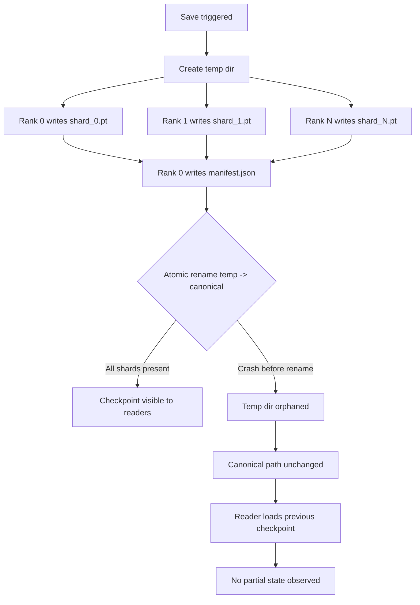

# Sharded Checkpoint and Atomic Resume

## Learning Objectives

- Implement a sharded checkpoint format that writes per-rank state to separate files with a manifest recording ownership.
- Apply the atomic write pattern (temp directory then rename) to guarantee a reader never observes a partial checkpoint.
- Detect and reject three failure modes on resume: missing manifest, shard byte-size mismatch, and world-size change.
- Compare gather-then-write checkpointing against parallel sharded checkpointing in terms of bandwidth utilization and failure semantics.
- Build a checkpoint manager that tracks global step, prunes old checkpoints, and flags stale state from previous runs.

## The Problem

A vanilla checkpoint dumps all parameters and optimizer state into a single file. On one GPU this is fine. On eight GPUs with ZeRO-3, each rank holds a different slice of the model and optimizer state — the parameters are partitioned across ranks, not replicated. To write a single-file checkpoint, rank 0 must gather every other rank's shard across the network, assemble the full state in its own memory, and serialize it to disk. For a 70B-parameter model in ZeRO-3, that is roughly 1.1 TB of state funneling through one node's network port and one node's RAM.

The gather step blocks every rank. While rank 0 serializes, ranks 1 through 7 idle. The write bandwidth is bounded by a single node's I/O, not the aggregate. On a real cluster, the gather-then-write step for a large model can take longer than the training step that preceded it — which means the job spends more time checkpointing than computing. And if rank 0 crashes halfway through the 40-minute write, the file on disk is truncated. The next resume loads corrupt weights, the loss diverges on step one, and you have lost hours of compute with no clean recovery point.

The second problem is resume itself. If your checkpoint is a single monolithic file, loading it requires enough contiguous memory to hold the entire state at once. On a memory-constrained node that is already running inference or training, this can OOM before you even start. The sharded format sidesteps this: each rank loads only its own slice, so peak memory during resume is `1/N` of the total state.

## The Concept

Two mechanisms compose to solve this: **sharded state dict** and **atomic resume**. Each mechanism solves a different failure mode, and neither is sufficient alone.

A sharded state dict means each rank persists only the slice of model and optimizer state it owns under ZeRO partitioning. Rank 0 writes `rank_0_shard.pt`, rank 1 writes `rank_1_shard.pt`, and so on. No gathering, no single-node bottleneck. Every rank writes to its own file in parallel, so aggregate write bandwidth scales linearly with world size. A manifest file — typically written by rank 0 after all shards are confirmed — records which rank owns which file, the byte size of each shard, the global training step, and the world size at save time. The manifest is the single source of truth for what a complete checkpoint looks like.

Atomic resume is the guarantee that a reader sees either the complete checkpoint or the previous one — never a partial write. The mechanism is a two-phase commit: write everything to a temporary directory, then atomically rename that directory to the canonical checkpoint path. On POSIX filesystems, `rename()` is atomic — either the directory appears at the target path in its entirety, or it does not appear at all. If rank 3 crashes mid-write, the temp directory contains three complete shards and one partial shard, but the canonical path still points to the previous checkpoint. The reader loads the old one and training resumes from there. No corruption, no partial state, no manual cleanup.



The manifest defends against three resume-time failure modes. First, **world-size change**: if you trained on 8 GPUs and resume on 4, the manifest's `world_size` field tells the loader that a reshape is needed before distributing shards. Second, **shard count mismatch**: if a shard file is missing from disk (filesystem error, incomplete sync), the manifest's per-shard entry with expected byte count catches it immediately. Third, **partial write**: if the atomic rename did not complete, the manifest does not exist at the canonical path at all, so the loader falls back to the previous checkpoint rather than reading half-written shards.

The same pattern — parallel writers producing independent shards, a manifest that records completeness, and an atomic swap that hides partial work — appears far beyond distributed training. It is the general solution to "multiple producers writing to shared storage without corrupting the reader's view."

## Build It

The following code runs in a single process using only the Python standard library. It simulates four ranks each writing a shard to a temp directory, writes a manifest, and performs the atomic rename. Then it simulates a crash mid-write (only 2 of 4 shards land before the process dies) and demonstrates that the loader rejects the incomplete set by falling back to the previous checkpoint.

```python
import os
import json
import shutil
from pathlib import Path

BASE_DIR = Path("./ckpt_demo")
TEMP_DIR = BASE_DIR / "step_2000.tmp"
CKPT_DIR = BASE_DIR / "step_2000"
PREV_DIR = BASE_DIR / "step_1000"

def init_previous_checkpoint(model_params, optimizer_state):
    if BASE_DIR.exists():
        shutil.rmtree(BASE_DIR)
    BASE_DIR.mkdir(parents=True)
    PREV_DIR.mkdir(parents=True)
    shard = {"rank": 0, "global_step": 1000, "params": model_params, "optimizer": optimizer_state}
    shard_path = PREV_DIR / "rank_0_shard.pt"
    with open(shard_path, "w") as f:
        json.dump(shard, f)
    manifest = {
        "global_step": 1000,
        "world_size": 1,
        "shards": [{"rank": 0, "file": "rank_0_shard.pt", "bytes": shard_path.stat().st_size}],
        "format_version": "1.0",
    }
    with open(PREV_DIR / "manifest.json", "w") as f:
        json.dump(manifest, f, indent=2)
    print(f"Previous checkpoint written: step 1000 at {PREV_DIR}")

def save_sharded_checkpoint(model_params, optimizer_state, world_size, global_step, crash_after_rank=None):
    if TEMP_DIR.exists():
        shutil.rmtree(TEMP_DIR)
    TEMP_DIR.mkdir(parents=True)

    param_items = list(model_params.items())
    per_rank = len(param_items) // world_size

    manifest = {
        "global_step": global_step,
        "world_size": world_size,
        "shards": [],
        "format_version": "1.0",
    }

    for rank in range(world_size):
        if crash_after_rank is not None and rank > crash_after_rank:
            print(f"  [CRASH] Rank {rank} did not write — process killed")
            return None

        start = rank * per_rank
        end = start + per_rank if rank < world_size - 1 else len(param_items)
        shard_params = dict(param_items[start:end])
        shard_opt = {k: v for k, v in optimizer_state.items() if k in shard_params}

        shard = {
            "rank": rank,
            "global_step": global_step,
            "params": shard_params,
            "optimizer": shard_opt,
        }

        shard_file = f"rank_{rank}_shard.pt"
        shard_path = TEMP_DIR / shard_file
        with open(shard_path, "w") as f:
            json.dump(shard, f)

        manifest["shards"].append({
            "rank": rank,
            "file": shard_file,
            "bytes": shard_path.stat().st_size,
        })
        print(f"  Rank {rank} wrote {shard_file} ({shard_path.stat().st_size} bytes)")

    with open(TEMP_DIR / "manifest.json", "w") as f:
        json.dump(manifest, f, indent=2)
    print(f"  Manifest written with {len(manifest['shards'])} shards")

    os.replace(TEMP_DIR, CKPT_DIR)
    print(f"  Atomic rename: {TEMP_DIR.name} -> {CKPT_DIR.name}")
    return CKPT_DIR

def load_latest_checkpoint(expected_world_size):
    for ckpt in sorted(BASE_DIR.iterdir(), reverse=True):
        if not ckpt.is_dir() or ckpt.name.endswith(".tmp"):
            continue
        manifest_path = ckpt / "manifest.json"
        if not manifest_path.exists():
            print(f"  [SKIP] {ckpt.name}: no manifest (partial write)")
            continue

        with open(manifest_path) as f:
            manifest = json.load(f)

        if manifest["world_size"] != expected_world_size:
            raise ValueError(
                f"World size mismatch: checkpoint has {manifest['world_size']}, expected {expected_world_size}"
            )

        all_valid = True
        for entry in manifest["shards"]:
            shard_path = ckpt / entry["file"]
            if not shard_path.exists():
                print(f"  [REJECT] {ckpt.name}: missing shard {entry['file']}")
                all_valid = False
                break
            actual = shard_path.stat().st_size
            if actual != entry["bytes"]:
                print(f"  [REJECT] {ckpt.name}: {entry['file']} byte mismatch ({actual} != {entry['bytes']})")
                all_valid = False
                break

        if all_valid:
            full_params = {}
            full_optimizer = {}
            for entry in manifest["shards"]:
                with open(ckpt / entry["file"]) as f:
                    shard = json.load(f)
                full_params.update(shard["params"])
                full_optimizer.update(shard["optimizer"])
            print(f"  [OK] Loaded {ckpt.name} (step {manifest['global_step']})")
            return {"global_step": manifest["global_step"], "params": full_params, "optimizer": full_optimizer}

    raise FileNotFoundError("No valid checkpoint found")

if __name__ == "__main__":
    model_params = {f"layer_{i}.weight": [float(i), float(i + 1)] for i in range(8)}
    optimizer_state = {f"layer_{i}.weight": [0.01 * i, 0.01 * (i + 1)] for i in range(8)}

    print("=== Setting up previous checkpoint (step 1000) ===")
    init_previous_checkpoint(model_params, optimizer_state)

    print("\n=== Test 1: Clean sharded save (step 2000, 4 ranks) ===")
    save_sharded_checkpoint(model_params, optimizer_state, world_size=4, global_step=2000)
    loaded = load_latest_checkpoint(expected_world_size=4)
    print(f"  Resumed at step: {loaded['global_step']}")
    print(f"  Param keys restored: {sorted(loaded['params'].keys())}")

    print("\n=== Test 2: Crash mid-write (step 3000, crash after rank 1) ===")
    CKPT_DIR = BASE_DIR / "step_3000"
    TEMP_DIR = BASE_DIR / "step_3000.tmp"
    result = save_sharded_checkpoint(
        model_params, optimizer_state, world_size=4, global_step=3000, crash_after_rank=1
    )
    print(f"  Save returned: {result}")
    print(f"  Temp dir exists: {TEMP_DIR.exists()}")
    print(f"  Temp dir contents: {[f.name for f in TEMP_DIR.iterdir()] if TEMP_DIR.exists() else 'N/A'}")
    print(f"  Canonical step_3000 exists: {(BASE_DIR / 'step_3000').exists()}")

    print("\n=== Test 3: Loader falls back to previous checkpoint ===")
    loaded = load_latest_checkpoint(expected_world_size=4)
    print(f"  Resumed at step: {loaded['global_step']} (step 2000, not 3000)")
    print(f"  No partial state observed: {loaded['global_step'] == 2000}")

    print("\n=== Test 4: World size mismatch rejection ===")
    try:
        load_latest_checkpoint(expected_world_size=8)
    except ValueError as e:
        print(f"  Correctly rejected: {e}")

    shutil.rmtree(BASE_DIR)
    print("\n=== Cleanup complete ===")
```

Running this produces output confirming each guard: the clean save loads successfully, the crashed save leaves an orphaned temp directory but no canonical checkpoint, the loader falls back to step 2000 instead of reading partial shards, and the world-size mismatch raises immediately.

## Use It

The sharded checkpoint pattern — parallel writers, a manifest that records completeness, an atomic swap that hides partial work — maps directly to GTM data pipeline discipline. Consider the enrichment waterfall: when scoring 10,000 accounts through a Clay table, each row independently calls multiple enrichment providers (Clearbit, Hunter, LinkedIn API) in sequence. Each row is a shard. The table is the manifest. If the Clay waterfall writes results to a connected Google Sheet row-by-row as each enrichment completes, downstream consumers — an SDR launching a sequence, a Slack alert triggered by a score threshold, a sync to the CRM — see partial data. Half-enriched accounts trigger premature outreach. The SDR calls a prospect with a wrong company name because the firmographics enrichment had not landed yet.

The atomic write pattern prevents this. Write enrichment results to a staging table or temporary column set. When all rows for a batch are complete — the manifest equivalent — swap the staging output into the live sheet atomically. Downstream consumers either see the previous complete batch or the new complete batch, never a half-populated one. This is the same temp-then-rename discipline, applied to a GTM data store instead of a filesystem. [CITATION NEEDED — concept: Clay table atomic write or batch commit semantics]

The manifest schema also maps. In distributed training, the manifest records `world_size` and per-shard byte counts so the loader can detect corruption. In a GTM pipeline, the equivalent is a run manifest that records expected row count, enrichment completion flags per column, and a checksum or timestamp