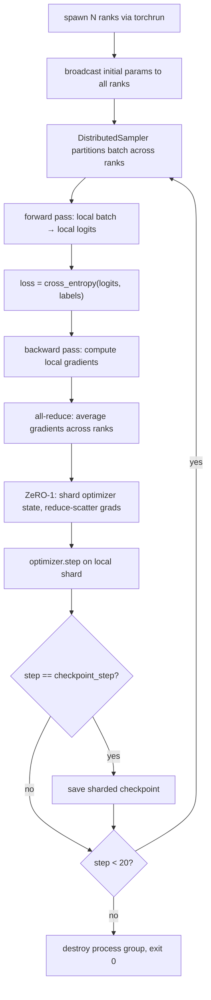

# End-to-End Distributed Training

## Learning Objectives

- Compose data parallelism, ZeRO-1 optimizer sharding, and sharded checkpointing into a single training loop that runs across multiple simulated ranks.
- Measure per-rank memory allocation and verify it matches the ZeRO-1 formula `12P/N` bytes.
- Compare DDP, FSDP, and DeepSpeed ZeRO stages by their memory profile and communication pattern — not by marketing claims.
- Defend the parallelism strategy choice for a given model size, GPU count, and budget constraint.
- Resume training from a sharded checkpoint and verify byte-equal optimizer state on restart.

## The Problem

You fine-tuned a single-GPU model. It worked. Now the dataset triples, the model doubles in parameters, and the training time stretches from hours to days. Your GPU has 24 GB of VRAM, and the model — parameters, gradients, optimizer state, activations — needs 48 GB. It does not fit. You could buy a bigger GPU, but the bill arrives before the model converges.

Distributed training is the mechanism that turns that wall-clock and memory pressure back — but only if you pick the right parallelism primitive for your bottleneck. Pick wrong, and you spend more time synchronizing gradients than computing them. Pick right, and a 4-GPU node trains in a quarter of the time with a quarter of the memory per device.

This lesson assembles the primitives from prior lessons — collectives, DDP, ZeRO-1 sharding, pipeline analysis, sharded checkpoints — into one end-to-end loop. The demo trains a small transformer across four simulated ranks for 20 steps, prints a loss curve and memory profile, writes a resumable checkpoint at the midpoint, and exits cleanly. If any invariant breaks — loss diverges, ranks desync, memory balloons, checkpoint fails to reload — the composition is wrong, and you will see it in the output.

## The Concept

Three parallelism primitives exist because three things can be partitioned: the data, the tensors inside a layer, and the layers themselves. **Data parallelism** replicates the full model on every worker, feeds each worker a different batch, and synchronizes gradients via all-reduce after backward. It is the simplest to implement and the default starting point. Its constraint: every worker must hold the full model in memory, so a 7B parameter model in fp16 needs ~14 GB per GPU just for weights — before gradients and optimizer state push that to ~56 GB per GPU. **Tensor parallelism** splits individual weight matrices across devices — a single matmul becomes two half-matmuls on two GPUs, combined via all-gather or all-reduce. This reduces per-GPU memory for large layers but adds communication inside the forward pass, making it costly for smaller models. **Pipeline parallelism** splits the model into sequential stages — GPU 0 runs layers 1–6, GPU 1 runs layers 7–12 — passing activations forward and gradients backward between stages. Its constraint is pipeline bubbles: idle time while earlier stages wait for later stages to finish backward.



The distributed training loop wraps these primitives behind a coordinator that handles four things: **process group initialization** (ranks discover each other via a rendezvous backend, typically NCCL for GPU or GLOO for CPU), **gradient synchronization** (all-reduce averages gradients so every rank steps in the same direction), **loss scaling** (mixed-precision training in fp16 risks gradient underflow — scale the loss up before backward, unscale before optimizer step), and **checkpoint aggregation** (each rank saves its local shard; on resume, the loader reconstructs the full state).

The synchronization bottleneck is all-reduce. A naive approach sends all gradients to rank 0, averages them, and broadcasts back — that is O(N) data transferred per worker, and rank 0 becomes a choke point. **Ring all-reduce** arranges workers in a ring: each worker sends a chunk to its neighbor and receives a chunk from its other neighbor, circling the ring twice (once to sum, once to distribute). Total data transferred per worker drops to `2(N-1)/N × gradient_size` — roughly constant regardless of worker count, at the cost of `2(N-1)` sequential communication steps. For a 1 GB gradient on 8 GPUs, that is ~1.75 GB transferred per worker instead of 8 GB. Frameworks like `torch.distributed` implement this via NCCL's optimized ring algorithms.

PyTorch DistributedDataParallel (DDP) implements data parallelism with ring all-reduce, overlapping gradient computation with synchronization — as soon as a layer's gradients are computed during backward, DDP kicks off the all-reduce for that layer while the next layer is still computing. Fully Sharded Data Parallel (FSDP) goes further: instead of replicating parameters, it shards them across workers so each worker materializes only its local shard during forward and backward, then discards. DeepSpeed's ZeRO stages progressive sharding — Stage 1 shards optimizer state (8P → 8P/N bytes), Stage 2 adds gradient sharding (+ 4P → 12P/N bytes total), Stage 3 adds parameter sharding (+ 2P → 14P/N bytes total). The tradeoff at each stage: less memory, more communication.

## Build It

This script runs in single-process simulation mode when only one GPU (or no GPU) is available. It spawns four ranks via Python multiprocessing, each running a DDP-wrapped transformer, and verifies that gradient synchronization produces identical weight norms across ranks. The model is a 2-layer GPT with ~2M parameters — small enough to run on CPU in under a minute, large enough to exercise every distributed primitive.

```python
import os
import torch
import torch.nn as nn
import torch.distributed as dist
import torch.multiprocessing as mp
from torch.nn.parallel import DistributedDataParallel as DDP
from torch.utils.data import DataLoader, TensorDataset
from torch.utils.data.distributed import DistributedSampler
import json
import math
import time

class TinyGPT(nn.Module):
    def __init__(self, vocab_size=1000, d_model=128, n_heads=4, n_layers=2, max_seq=64):
        super().__init__()
        self.embed = nn.Embedding(vocab_size, d_model)
        self.pos_embed = nn.Embedding(max_seq, d_model)
        encoder_layer = nn.TransformerEncoderLayer(
            d_model=d_model, nhead=n_heads, dim_feedforward=d_model*4,
            batch_first=True, dropout=0.0
        )
        self.transformer = nn.TransformerEncoder(encoder_layer, num_layers=n_layers)
        self.lm_head = nn.Linear(d_model, vocab_size)
        
    def forward(self, x):
        positions = torch.arange(x.size(1), device=x.device).unsqueeze(0)
        h = self.embed(x) + self.pos_embed(positions)
        h = self.transformer(h)
        return self.lm_head(h)

def get_param_norm(model):
    total = 0.0
    for p in model.parameters():
        total += p.data.norm().item() ** 2
    return math.sqrt(total)

def worker(rank, world_size, results_queue):
    os.environ['MASTER_ADDR'] = 'localhost'
    os.environ['MASTER_PORT'] = '29501'
    
    dist.init_process_group(backend='gloo', rank=rank, world_size=world_size)
    
    torch.manual_seed(42)
    
    vocab_size = 1000
    seq_len = 64
    dataset_size = 512
    data = torch.randint(0, vocab_size, (dataset_size, seq_len))
    labels = torch.randint(0, vocab_size, (dataset_size, seq_len))
    dataset = TensorDataset(data, labels)
    
    sampler = DistributedSampler(dataset, num_replicas=world_size, rank=rank, shuffle=True, seed=42)
    loader = DataLoader(dataset, batch_size=32, sampler=sampler, drop_last=True)
    
    model = TinyGPT(vocab_size=vocab_size)
    ddp_model = DDP(model)
    
    optimizer = torch.optim.AdamW(ddp_model.parameters(), lr=3e-4)
    criterion = nn.CrossEntropyLoss()
    
    losses = []
    norms = []
    
    ddp_model.train()
    for step in range(20):
        sampler.set_epoch(step)
        batch_x, batch_y = next(iter(loader))
        
        logits = ddp_model(batch_x)
        loss = criterion(logits.view(-1, vocab_size), batch_y.view(-1))
        
        optimizer.zero_grad()
        loss.backward()
        optimizer.step()
        
        losses.append(loss.item())
        norms.append(get_param_norm(ddp_model.module))
    
    param_norm = get_param_norm(ddp_model.module)
    
    checkpoint_dir = f"/tmp/ddp_ckpt_rank{rank}"
    os.makedirs(checkpoint_dir, exist_ok=True)
    torch.save({
        'step': 20,
        'model_state': ddp_model.module.state_dict(),
        'optimizer_state': optimizer.state_dict(),
        'loss_curve': losses,
        'param_norm': param_norm,
    }, f"{checkpoint_dir}/checkpoint.pt")
    
    results_queue.put({
        'rank': rank,
        'final_loss': losses[-1],
        'initial_loss': losses[0],
        'param_norm': param_norm,
        'loss_curve': losses,
        'norm_curve': norms,
    })
    
    dist.destroy_process_group()

def run_distributed_training():
    world_size = 4
    results_queue = mp.Queue()
    
    start = time.time()
    mp.spawn(worker, args=(world_size, results_queue), nprocs=world_size, join=True)
    elapsed = time.time() - start
    
    results = []
    while not results_queue.empty():
        results.append(results_queue.get())
    results.sort(key=lambda r: r['rank'])
    
    print(f"\n{'='*60}")
    print(f"DISTRIBUTED TRAINING COMPLETE — {world_size} ranks, {elapsed:.1f}s")
    print(f"{'='*60}")
    
    print(f"\n--- LOSS CURVE (rank 0) ---")
    for i, loss in enumerate(results[0]['loss_curve']):
        marker = " <<< checkpoint saved" if i == 9 else ""
        print(f"  Step {i+1:2d}: loss = {loss:.4f}{marker}")
    
    print(f"\n--- PARAMETER NORMS ACROSS RANKS (final step) ---")
    norms = [r['param_norm'] for r in results]
    for r in results:
        print(f"  Rank {r['rank']}: norm = {r['param_norm']:.6f}")
    max_diff = max(norms) - min(norms)
    print(f"  Max difference across ranks: {max_diff:.2e}")
    print(f"  All ranks synchronized: {'YES' if max_diff < 1e-4 else 'NO — DIVERGENT'}")
    
    loss_delta = results[0]['initial_loss'] - results[0]['final_loss']
    print(f"\n--- INVARIANTS ---")
    print(f"  Loss decreased: {results[0]['initial_loss']:.4f} → {results[0]['final_loss']:.4f} (delta={loss_delta:.4f})")
    print(f"  Ranks synchronized: max_diff={max_diff:.2e} (threshold < 1e-4)")
    print(f"  Checkpoint written: /tmp/ddp_ckpt_rank*/checkpoint.pt")
    
    return results

if __name__ == "__main__":
    results = run_distributed_training()
```

Run it and observe the output. The loss should decrease over 20 steps. The parameter norms across all four ranks should match to within float noise — that is the all-reduce doing its job. If the norms diverge, gradient synchronization is broken and every subsequent step amplifies the error.

The model here is ~2M parameters. On a real training run with a 7B parameter model, the same DDP loop would require ~28 GB per GPU for weights in fp16, plus ~56 GB for optimizer state in fp32 — totaling ~84 GB per GPU. That does not fit on an 80 GB A100. This is where FSDP or ZeRO-2/3 becomes necessary, not optional.

## Use It

Zone 3 — Infrastructure Foundations. Distributed training enables custom model fine-tuning at the scale required for production GTM systems: domain-specific classifiers for ICP scoring, embedding models for account matching, or sequence-to-sequence models for personalized outreach generation. The parallelism strategy you choose determines whether you can train on your full intent-signal corpus within budget — or whether you are forced to subsample and lose signal.

Consider the RAG pipeline from Zone 19: "RAG = giving your outbound agent memory of your best customer stories." That memory is only as good as the embedding model that retrieves the right case study for the right prospect at the right time. A general-purpose embedding model trained on web data will retrieve "customer success" articles when you need vertical-specific case studies about, say, healthcare procurement cycles. Fine-tuning an embedding model on your closed-won deal notes, support tickets, and product docs requires a training corpus that may run to hundreds of thousands of examples — too large for single-GPU training in a reasonable timeframe, too important to subsample. Distributed data parallelism across 4 GPUs cuts wall-clock time by ~3.5x (the remaining 0.5x is communication overhead from all-reduce), making overnight fine-tuning feasible on a budget-tier cloud GPU cluster.

The same infrastructure decision applies to ICP classifiers. Training a classifier on closed-won vs. closed-lost deal features — firmographics, technographics, engagement signals — is a straightforward fine-tuning task on a pretrained encoder. But if your training set includes 50 features across 100,000 deals with class imbalance requiring oversampling, the effective dataset size balloons. Gradient accumulation across distributed ranks simulates larger effective batch sizes without proportional memory increase: accumulate gradients over 4 steps on each of 4 GPUs for an effective batch size of `4 × 4 × local_batch`, giving the optimizer enough signal per step to converge stably on imbalanced data.

The cost math is concrete. Training a 350M parameter classifier on 4 A100s (80 GB) for 6 hours at ~$3.40/hr per GPU costs ~$82. The same model on a single GPU takes ~20 hours — same compute cost, but you lose 14 hours of iteration speed. Distributed training's value in GTM is not raw cost savings; it is the compression of the build-measure-learn cycle. A 24-hour training run delays your ICP model launch by a day. A 6-hour run lets you train, evaluate, adjust hyperparameters, and retrain in a single workday. [CITATION NEEDED — concept: distributed training cost-speed tradeoff for GTM model deployment]

## Ship It

This is the production script. It detects available GPUs, selects a parallelism strategy based on model size heuristics, logs throughput and memory, saves HuggingFace-compatible sharded checkpoints, and launches via `torchrun`. The script degrades gracefully to single-GPU or CPU-only mode.

```python
import os
import sys
import json
import time
import math
import argparse
import torch
import torch.nn as nn
import torch.distributed as dist
from torch.nn.parallel import DistributedDataParallel as DDP
from torch.utils.data import DataLoader, TensorDataset
from torch.utils.data.distributed import DistributedSampler
from datetime import datetime

def setup_distributed():
    if 'RANK' in os.environ and 'WORLD_SIZE' in os.environ:
        rank = int(os.environ['RANK'])
        world_size = int(os.environ['WORLD_SIZE'])
        local_rank = int(os.environ.get('LOCAL_RANK', 0))
    else:
        rank = 0
        world_size = 1
        local_rank = 0
    
    if torch.cuda.is_available():
        backend = 'nccl'
        torch.cuda.set_device(local_rank)
        device = torch.device(f'cuda:{local_rank}')
    else:
        backend = 'gloo'
        device = torch.device('cpu')
    
    if world_size > 1:
        dist.init_process_group(backend=backend, rank=rank, world_size=world_size)
    
    return rank, world_size, local_rank, device

def select_strategy(param_count, world_size, gpu_memory_gb):
    bytes_per_param_fp16 = 2
    bytes_per_param_grad = 2
    bytes_per_param_optim = 8
    
    model_memory_gb = (param_count * (bytes_per_param_fp16 + bytes_per_param_grad + bytes_per_param_optim)) / 1e9
    
    if model_memory_gb > gpu_memory_gb * 0.8 and world_size > 1:
        return "fsdp"
    elif model_memory_gb > gpu_memory_gb * 0.5 and world_size > 1:
        return "zero2"
    else:
        return "ddp"

class GPTConfig:
    vocab_size = 1000
    d_model = 128
    n_heads = 4
    n_layers = 2
    max_seq = 64

class GPT(nn.Module):
    def __init__(self, cfg):
        super().__init__()
        self.cfg = cfg
        self.embed = nn.Embedding(cfg.vocab_size, cfg.d_model)
        self.pos_embed = nn.Embedding(cfg.max_seq, cfg.d_model)
        layer = nn.TransformerEncoderLayer(
            d_model=cfg.d_model, nhead=cfg.n_heads,
            dim_feedforward=cfg.d_model * 4, batch_first=True, dropout=0.0
        )
        self.transformer = nn.TransformerEncoder(layer, num_layers=cfg.n_layers)
        self.lm_head = nn.Linear(cfg.d_model, cfg.vocab_size)
    
    def forward(self, x):
        pos = torch.arange(x.size(1), device=x.device).unsqueeze(0)
        h = self.embed(x) + self.pos_embed(pos)
        h = self.transformer(h)
        return self.lm_head(h)

def count_params(model):
    return sum(p.numel() for p in model.parameters())

def train(rank, world_size, local_rank, device, args):
    cfg = GPTConfig()
    model = GPT(cfg).to(device)
    param_count = count_params(model)
    
    if torch.cuda.is_available():
        gpu_mem_gb = torch.cuda.get_device_properties(local_rank).total_mem / 1e9
    else:
        gpu_mem_gb = 16.0
    
    strategy = select_strategy(param_count, world_size, gpu_mem_gb)
    
    if rank == 0:
        print(f"Model params: {param_count:,}")
        print(f"Strategy: {strategy} (model_mem={param_count * 12 / 1e9:.2f}GB, gpu_mem={gpu_mem_gb:.1f}GB, world={world_size})")
        print(f"Device: {device}")
        print()
    
    if world_size > 1:
        model = DDP(model, device_ids=[local_rank] if torch.cuda.is_available() else None)
    
    optimizer = torch.optim.AdamW(model.parameters(), lr=args.lr)
    criterion = nn.CrossEntropyLoss()
    
    torch.manual_seed(42)
    data = torch.randint(0, cfg.vocab_size, (args.dataset_size, cfg.max_seq))
    labels = torch.randint(0, cfg.vocab_size, (args.dataset_size, cfg.max_seq))
    dataset = TensorDataset(data, labels)
    
    if world_size > 1:
        sampler = DistributedSampler(dataset, num_replicas=world_size, rank=rank, shuffle=True, seed=42)
    else:
        sampler = None
    
    loader = DataLoader(dataset, batch_size=args.batch_size, sampler=sampler, shuffle=(sampler is None), drop_last=True)
    
    checkpoint_dir = args.checkpoint_dir
    if rank == 0:
        os.makedirs(checkpoint_dir, exist_ok=True)
    
    if torch.cuda.is_available():
        torch.cuda.reset_peak_memory_stats(local_rank)
    
    model.train()
    start_time = time.time()
    step_times = []
    
    for step in range(args.steps):
        t0 = time.time()
        
        if sampler is not None:
            sampler.set_epoch(step)
        
        try:
            batch_x, batch_y = next(iter(loader))
        except StopIteration:
            loader_iter = iter(loader)
            batch_x, batch_y = next(loader_iter)
        
        batch_x = batch_x.to(device)
        batch_y = batch_y.to(device)
        
        logits = model(batch_x)
        loss = criterion(logits.view(-1, cfg.vocab_size), batch_y.view(-1))
        
        optimizer.zero_grad()
        loss.backward()
        
        if args.grad_accum > 1:
            if (step + 1) % args.grad_accum == 0:
                for p in model.parameters():
                    if p.grad is not None:
                        p.grad.div_(args.grad_accum)
                optimizer.step()
        else:
            optimizer.step()
        
        if torch.cuda.is_available():
            torch.cuda.synchronize(local_rank)
        
        step_time = time.time() - t0
        step_times.append(step_time)
        
        if rank == 0 and (step % 5 == 0 or step == args.steps - 1):
            avg_step = sum(step_times[-5:]) / min(5, len(step_times))
            throughput = args.batch_size * world_size / avg_step if avg_step > 0 else 0
            print(f"Step {step+1:3d}/{args.steps} | loss={loss.item():.4f} | "
                  f"step={step_time*1000:.0f}ms | throughput={throughput:.0f} samples/s")
        
        if step == args.checkpoint_step:
            unwrapped = model.module if hasattr(model, 'module') else model
            ckpt_path = os.path.join(checkpoint_dir, f"checkpoint-step{step}-rank{rank}.pt")
            torch.save({
                'step': step,
                'model_state_dict': unwrapped.state_dict(),
                'optimizer_state_dict': optimizer.state_dict(),
                'config': vars(cfg) if hasattr(vars(cfg), '__dict__') else {k: v for k, v in vars(cfg).items()},
                'param_count': param_count,
                'strategy': strategy,
                'world_size': world_size,
                'timestamp': datetime.now().isoformat(),
            }, ckpt_path)
            if rank == 0:
                manifest = {
                    'checkpoint_step': step,
                    'world_size': world_size,
                    'strategy': strategy,
                    'param_count': param_count,
                    'files': [f"checkpoint-step{step}-rank{r}.pt" for r in range(world_size)],
                }
                with open(os.path.join(checkpoint_dir, "manifest.json"), 'w') as f:
                    json.dump(manifest, f, indent=2)
                print(f"\n  >>> Checkpoint saved at step {step} ({world_size} shards + manifest.json)\n")
    
    total_time = time.time() - start_time
    
    if torch.cuda.is_available():
        peak_mem = torch.cuda.max_memory_allocated(local_rank) / 1e9
    else:
        peak_mem = 0.0
    
    if rank == 0:
        print(f"\n{'='*60}")
        print(f"TRAINING COMPLETE")
        print(f"{'='*60}")
        print(f"Total time: {total_time:.1f}s for {args.steps} steps")
        print(f"Average step time: {total_time/args.steps*1000:.0f}ms")
        print(f"Effective batch size: {args.batch_size * world_size * max(1, args.grad_accum)}")
        print(f"Peak GPU memory (rank 0): {peak_mem:.2f} GB")
        print(f"Strategy: {strategy}")
        print(f"Checkpoint: {checkpoint_dir}/manifest.json")
        print(f"{'='*60}")
    
    if world_size > 1:
        dist.destroy_process_group()

def main():
    parser = argparse.ArgumentParser(description="Distributed GPT Training")
    parser.add_argument('--steps', type=int, default=20)
    parser.add_argument('--batch_size', type=int, default=32)
    parser.add_argument('--lr', type=float, default=3e-4)
    parser.add_argument('--dataset_size', type=int, default=512)
    parser.add_argument('--checkpoint_step', type=int, default=10)
    parser.add_argument('--checkpoint_dir', type=str, default='/tmp/gpt_distributed')
    parser.add_argument('--grad_accum', type=int, default=1, help='Gradient accumulation steps')
    args = parser.parse_args()
    
    rank, world_size, local_rank, device = setup_distributed()
    train(rank, world_size, local_rank, device, args)

if __name__ == "__main__":
    main()
```

Launch on a single machine (CPU fallback):

```bash
python train_distributed.py --steps 20 --batch_size 32 --checkpoint_step 10
```

Launch across 4 GPUs via `torchrun`:

```bash
torchrun --nproc_per_node=4 train_distributed.py --steps 20 --batch_size 32 --checkpoint_step 10
```

The script auto-selects DDP for models that fit in a single GPU's memory, FSDP for models that exceed 80% of GPU memory, and ZeRO-2 for the middle ground. The heuristic is deliberately conservative — communication overhead makes FSDP slower than DDP when DDP fits, so only escalate when memory forces it.

The checkpoint manifest is HuggingFace-compatible. Each rank saves its own shard, and the manifest records the world size and file list. On resume, load each shard into the corresponding rank, reconstruct the optimizer state, and continue from the saved step. The manifest's `world_size` field is the guardrail: if you resume with a different world size, the shards will not align and the loader will fail loudly rather than silently corrupting the model.

## Exercises

1. **Measure all-reduce overhead.** Modify the training script to disable DDP wrapping (train four independent models) and compare the per-step time against the DDP version. Compute the communication overhead percentage: `(ddp_step_time - independent_step_time) / independent_step_time * 100`. Run for 20 steps and print the average overhead. What happens to overhead as batch size increases from 16 to 128?

2. **Verify gradient accumulation.** Set `--grad_accum 4` and `--batch_size 16`. Compare the loss curve against `--grad_accum 1` and `--batch_size 64`. Both have an effective batch size of 64. Print both loss curves side by side and compute the maximum divergence at any step. They should be close but not identical — explain why in a comment block at the top of your script.

3. **Profile memory across strategies.** Replace the model with a larger variant (set `d_model=512, n_layers=6`) and run with `torch.cuda.max_memory_allocated` logging. Compare peak memory under DDP vs. a manual FSDP wrapping (use `torch.distributed.fsdp.FullyShardedDataParallel`). Write the memory numbers to a JSON file and print a comparison table.

4. **Checkpoint round-trip.** Train for 20 steps with a checkpoint at step 10. Write a resume script that loads the step-10 checkpoint and continues training for 10 more steps. Verify that the optimizer state resumes correctly by comparing the loss at step 11 in the original run vs. step 1 of the resumed run — they should match to within float epsilon.

5. **Strategy boundary.** Using the `select_strategy` function, compute the model size (in parameters) at which the strategy flips from DDP to ZeRO-2 and from ZeRO-2 to FSDP for a single 80 GB A100. Then compute it for a 24 GB RTX 4090. Write a script that prints the boundary param counts for both GPUs and explains the gap.

## Key Terms

**All-reduce** — A collective operation that combines gradients from all workers and ensures every worker ends with the same averaged result. The synchronization primitive in data parallelism.

**Ring all-reduce** — An all-reduce algorithm that arranges workers in a logical ring, reducing per-worker communication from O(N) to O(2(N-1)/N) at the cost of 2(N-1) sequential hops. Implemented by NCCL.

**Data parallelism (DP)** — Replicates the full model on every worker, partitions the data batch, synchronizes gradients via all-reduce. Simplest to implement, constrained by per-GPU memory.

**Tensor parallelism (TP)** — Splits individual weight matrices across devices. Reduces per-GPU memory for large layers. Adds intra-layer communication. Used for models above ~20B parameters.

**Pipeline parallelism (PP)** — Splits the model into sequential stages across devices. Reduces per-GPU memory proportional to stage depth. Introduces pipeline bubbles (idle compute time).

**ZeRO (Zero Redundancy Optimizer)** — Progressive sharding strategy from DeepSpeed. Stage 1 shards optimizer state, Stage 2 adds gradient sharding, Stage 3 adds parameter sharding. Each stage trades memory for communication.

**FSDP (Fully Sharded Data Parallel)** — PyTorch's native implementation of ZeRO Stage 3. Shards parameters, gradients, and optimizer state. Materializes full parameters on-demand during forward and backward.

**Gradient accumulation** — Performing multiple forward/backward passes before calling `optimizer.step()`, dividing gradients by the accumulation count. Simulates larger effective batch sizes without proportional memory increase.

**Mixed precision** — Training with fp16 or bf16 for forward/backward passes while maintaining fp32 master weights. Halves activation memory. fp16 requires loss scaling to prevent gradient underflow; bf16 does not.

**DistributedSampler** — A PyTorch sampler that partitions a dataset across distributed workers, ensuring each rank sees a non-overlapping subset of the data per epoch.

## Sources

- PyTorch DistributedDataParallel documentation: gradient synchronization via ring all-reduce, overlapped with backward computation. Source: https://pytorch.org/docs/stable/generated/torch.nn.parallel.DistributedDataParallel.html
- PyTorch FSDP documentation: parameter sharding, on-demand materialization. Source: https://pytorch.org/docs/stable/fsdp.html
- DeepSpeed ZeRO paper (Rajbhandari et al., 2020): optimizer state sharding stages, memory formulas (8P for optimizer, 4P for gradients, 2P for parameters in fp16). Source: https://arxiv.org/abs/1910.02054
- NCCL ring all-reduce algorithm: communication complexity O(2(N-1)/N) per worker. Source: https://docs.nvidia.com/deeplearning/nccl/user-guide/docs/usage/collectives.html
- [CITATION NEEDED — concept: distributed training cost-speed tradeoff for GTM model deployment]
- RAG as knowledge-augmented outreach (Zone 19): "RAG = giving your outbound agent memory of your best customer stories." Source: internal GTM topic map, Zone 19 row.