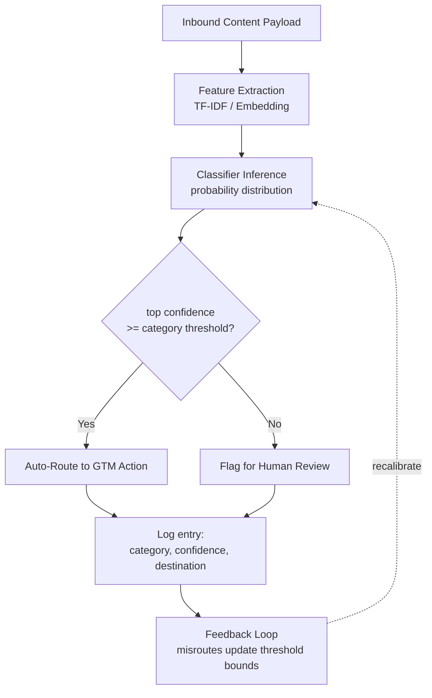

# Capstone 85 — Content Classifier Integration

## Learning Objectives

1. Build a classification pipeline that ingests inbound content payloads and assigns category labels with confidence scores
2. Implement threshold-based routing that directs content to different GTM actions based on classifier confidence
3. Compare confidence threshold values to calibrate the tradeoff between automated routing and human review
4. Configure monitoring that detects classification drift and threshold degradation across production traffic

## The Problem

You have built classifiers in isolation — trained them, evaluated them, tuned them. The classifier predicts a label and a probability, and you move on. That gap between "the model works in a notebook" and "the model works in a revenue motion" is where most classification projects die. A classifier that is 92% accurate on held-out test data still misroutes 8% of real traffic, and in a GTM pipeline that 8% means support tickets landing in sales queues, sales inquiries getting discarded, and nurture-qualified leads never receiving follow-up.

The integration layer has three parts that the model itself does not address. First, a mechanism to receive content payloads — form submissions, email replies, support tickets — and feed them to the classifier. Second, a confidence threshold per category that decides whether the prediction is trustworthy enough to act on automatically or whether it needs human review. Third, a routing decision that maps the classified content to a specific GTM action: SDR outreach, nurture sequence, support queue, or suppression list.

The decision boundary is the crux. Your classifier produces a probability distribution across categories, not a binary yes/no. A support ticket classified as "sales" with 0.55 confidence is a very different object than the same ticket classified as "sales" with 0.92 confidence. The threshold you set per category determines how much traffic flows automatically versus how much stalls in a review queue. Set it too loose and you flood your sales team with misrouted noise. Set it too tight and everything stalls for human review, which defeats the purpose of automating in the first place.

## The Concept

The pipeline is a sequence of deterministic transformations applied to an inbound payload. Feature extraction converts raw text into a numerical representation the classifier can score — typically TF-IDF vectors for traditional classifiers or dense embeddings for transformer-based ones. The classifier maps those features to a probability distribution across categories. A threshold comparison checks whether the top probability exceeds the category's configured minimum. If it does, the payload routes automatically to the mapped GTM action. If it does not, it flags for human review. Every step produces an observable artifact: the feature vector, the probability distribution, the threshold comparison result, and the final routing decision.

The policy router pattern generalizes this. Instead of a single classifier producing a single routing decision, multiple classifiers can run in parallel — a category classifier for routing, a safety classifier for content filtering, an intent classifier for prioritization. The router collects all verdicts and applies a policy: if the category classifier says "support" with confidence above threshold AND the safety classifier returns no flags, route to the support queue. If the safety classifier flags the content, override the routing decision regardless of category confidence. This is the same architecture used for output-side safety classifiers — toxicity detection, PII redaction, instruction leakage checks — where the router collects independent verdicts and applies a severity-based action policy (`block`, `redact`, `warn`, or `log`).



Confidence thresholds are not static properties of the model. They are operational dials that you tune based on the cost of false positives versus false negatives for each category. Misrouting a sales inquiry to support costs pipeline velocity. Misrouting a support ticket to sales costs customer satisfaction. Misrouting a compliance-opt-out to nurture costs legal exposure. The threshold per category should reflect these asymmetric costs, and it should be recalibrated when the classifier's input distribution shifts — which it will, because inbound content changes over time as campaigns, products, and customer segments evolve.

## Build It

### Easy: Classify Inbound Content

Wire a pre-trained text classifier to a function that accepts a payload string and returns the predicted category with a confidence score. The classifier trains on a small labeled corpus — enough to demonstrate the mechanism. In a production system you would load a serialized model trained on thousands of examples, but the pipeline structure is identical.

```python
from sklearn.feature_extraction.text import TfidfVectorizer
from sklearn.linear_model import LogisticRegression
from sklearn.pipeline import Pipeline
import numpy as np

training_data = [
    ("I want to schedule a demo of your platform", "sales"),
    ("What is your pricing for 50 seats", "sales"),
    ("Can I speak with a sales rep", "sales"),
    ("We are evaluating vendors for our CRM", "sales"),
    ("How do I reset my password", "support"),
    ("The app keeps crashing on login", "support"),
    ("I need help with the API integration", "support"),
    ("Getting a 500 error on the dashboard", "support"),
    ("Your product looks interesting for our team", "nurture"),
    ("Following your company after the webinar", "nurture"),
    ("Just researching options in this space", "nurture"),
    ("Curious about your roadmap", "nurture"),
    ("Please remove me from your mailing list", "discard"),
    ("Stop sending me emails", "discard"),
    ("Not interested, do not contact", "discard"),
    ("Unsubscribe me immediately", "discard"),
]

texts = [t for t, _ in training_data]
labels = [l for _, l in training_data]

clf = Pipeline([
    ("tfidf", TfidfVectorizer(ngram_range=(1, 2))),
    ("lr", LogisticRegression(max_iter=1000, class_weight="balanced")),
])
clf.fit(texts, labels)

def classify_content(payload):
    probas = clf.predict_proba([payload])[0]
    classes = clf.classes_
    best_idx = int(np.argmax(probas))
    return {
        "payload": payload,
        "category": classes[best_idx],
        "confidence": round(float(probas[best_idx]), 4),
        "all_probas": {c: round(float(p), 4) for c, p in zip(classes, probas)},
    }

test_payloads = [
    "I would like to see a demo please",
    "I cannot log into my account it says error",
    "Just looking around at different tools",
    "Take me off your list right now",
]

for p in test_payloads:
    result = classify_content(p)
    print(f"Payload: {result['payload']}")
    print(f"  Category: {result['category']} | Confidence: {result['confidence']}")
    print(f"  Full distribution: {result['all_probas']}")
    print()
```

### Medium: Add Threshold-Based Routing

Now layer in the routing decision. Each category gets a confidence threshold. Payloads above threshold auto-route to a GTM destination. Payloads below threshold stall in a review queue. The output confirms the routing destination for every payload, including the ones flagged for review.

```python
thresholds = {
    "sales": 0.55,
    "support": 0.55,
    "nurture": 0.50,
    "discard": 0.60,
}

routing_map = {
    "sales": "SDR outreach queue",
    "support": "Support ticket queue",
    "nurture": "Nurture sequence",
    "discard": "Suppression list",
}

review_queue = []

def route_content(payload):
    result = classify_content(payload)
    category = result["category"]
    confidence = result["confidence"]
    threshold = thresholds[category]

    if confidence >= threshold:
        destination = routing_map[category]
        auto = True
    else:
        destination = "Human review queue"
        auto = False
        review_queue.append({
            "payload": payload,
            "predicted_category": category,
            "confidence": confidence,
            "threshold": threshold,
        })

    return {
        "payload": payload,
        "category": category,
        "confidence": confidence,
        "threshold": threshold,
        "auto_routed": auto,
        "destination": destination,
    }

routing_payloads = [
    "I want to buy your product today",
    "There is a bug in the export feature",
    "Heard about you from a colleague",
    "Remove me from everything",
    "Can someone call me about enterprise pricing",
    "idk just browsing lol",
]

for p in routing_payloads:
    r = route_content(p)
    status = "AUTO" if r["auto_routed"] else "REVIEW"
    print(f"[{status}] {r['payload']}")
    print(f"  -> {r['category']} ({r['confidence']:.3f} >= {r['threshold']}) -> {r['destination']}")
    print()

print(f"Review queue: {len(review_queue)} payload(s) awaiting human triage")
for item in review_queue:
    print(f"  - {item['payload']}  [predicted: {item['predicted_category']}, conf: {item['confidence']:.3f}]")
```

### Hard: Feedback Loop with Threshold Recalibration

Production classifiers degrade when the input distribution shifts. A feedback loop captures misroutes — cases where the human reviewer corrects the classifier's prediction — and uses that signal to adjust threshold bounds. If a category accumulates misroutes, its threshold tightens, pushing more of its traffic into review until the underlying model can be retrained. This is a compensating control: it does not fix the model, but it limits the blast radius of classification errors.

```python
import copy

rejection_log = []
live_thresholds = copy.deepcopy(thresholds)

def process_with_feedback(payload, corrected_category=None):
    result = classify_content(payload)
    category = result["category"]
    confidence = result["confidence"]

    if corrected_category is not None and category != corrected_category:
        rejection_log.append({
            "payload": payload,
            "predicted": category,
            "corrected": corrected_category,
            "confidence": confidence,
        })
        old_t = live_thresholds[category]
        live_thresholds[category] = min(old_t + 0.05, 0.95)

    threshold = live_thresholds.get(category, 0.60)
    routed = confidence >= threshold
    if routed:
        destination = routing_map.get(category, "Unknown")
    else:
        destination = "Human review queue"

    return {
        "payload": payload,
        "category": category,
        "confidence": round(confidence, 4),
        "threshold": round(threshold, 4),
        "routed": routed,
        "destination": destination,
    }

print("=== Thresholds before feedback ===")
for cat, t in thresholds.items():
    print(f"  {cat}: {t:.2f}")

feedback_batch = [
    ("I need a quote for 200 licenses", "sales"),
    ("Your product is spam and I hate it", "discard"),
    ("The dashboard throws an exception", "support"),
    ("Tell me more about what you do", "nurture"),
    ("I am filing a complaint with the BBB", "discard"),
    ("Login page returns blank screen", "support"),
]

print("\n=== Processing feedback batch ===")
for payload, expected in feedback_batch:
    r = process_with_feedback(payload, corrected_category=expected)
    correction = ""
    if r["category"] != expected:
        correction = f"  ** MISROUTE: predicted {r['category']}, corrected to {expected}"
    print(f"  {payload}")
    print(f"    -> {r['category']} ({r['confidence']:.3f}) threshold={r['threshold']:.2f} -> {r['destination']}{correction}")

print(f"\n=== Thresholds after feedback ===")
for cat, t in live_thresholds.items():
    original = thresholds[cat]
    delta = t - original
    arrow = f" (+{delta:.2f})" if delta > 0 else ""
    print(f"  {cat}: {t:.2f}{arrow}")

print(f"\nTotal misroutes logged: {len(rejection_log)}")
for rej in rejection_log:
    print(f"  '{rej['payload']}' -> predicted {rej['predicted']}, corrected {rej['corrected']} (conf {rej['confidence']:.3f})")
```

## Use It

This is the content routing mechanism in Zone 02 — Lead Intelligence flowing into Qualification. When inbound content arrives unstructured across form submissions, email replies, and support tickets, a classifier tags it by category and intent, and the routing logic directs it to the correct GTM motion. The classifier replaces a set of hardcoded keyword rules that break when phrasing varies — "I want to see pricing" and "what does it cost for 10 users" both route to sales without maintaining an exhaustive synonym list.

The confidence threshold is the control lever between automation and human judgment. Tighten it and more content flags for review, which slows throughput but reduces misroutes. Loosen it and more content routes automatically, which scales but tolerates a higher error rate. The right threshold per category depends on the cost asymmetry: misrouting a "discard" signal (someone asking to be removed) into nurture has legal and reputational cost under opt-out regulations, so that category's threshold should be stricter than nurture's. The handbook notes that highest-performing LinkedIn campaigns use content as the hook rather than a direct pitch, which means inbound replies to content-led campaigns will include a mix of genuine product interest and topical curiosity — the classifier's job is to separate "interested in buying" from "interested in the topic" so that SDR outreach targets the former and nurture sequences catch the latter. [CITATION NEEDED — concept: content routing thresholds mapped to GTM conversion data]

The RAG pattern from Zone 19 connects here on the output side. Once a payload routes to "sales" or "nurture," the response generated for that lead can be knowledge-augmented — pulling relevant case studies, product docs, or pricing data into the copy via retrieval. The classifier determines the routing destination, and the retrieval system determines what content fills the response. The two systems are independent: you can swap classifiers without changing the retrieval pipeline, and vice versa.

## Ship It

Deploy the classifier endpoint to a persistent environment — a containerized FastAPI service behind a load balancer, or a serverless function with a cold-start budget that fits your latency requirements. The endpoint accepts POST requests with a JSON body containing the content payload, runs inference, applies thresholds, and returns the routing decision synchronously if latency allows or emits it to a queue for asynchronous processing.

Monitoring catches what training accuracy does not. Track three signals over time: classification distribution (the percentage of payloads in each category), average confidence per category, and routing volume per destination. If a category's average confidence drops below its threshold for 50 consecutive classifications, that indicates either concept drift — the inbound content has shifted away from the distribution the model was trained on — or a data quality problem where malformed or truncated payloads are reaching the classifier. Either case requires intervention: retraining on fresh data, fixing the upstream payload parser, or temporarily tightening the threshold to push more traffic into human review while the root cause is addressed.

```python
from collections import deque
import statistics

confidence_history = {
    "sales": deque(maxlen=50),
    "support": deque(maxlen=50),
    "nurture": deque(maxlen=50),
    "discard": deque(maxlen=50),
}

drift_thresholds = {cat: thresholds[cat] for cat in thresholds}

def log_and_check_drift(category, confidence):
    if category not in confidence_history:
        return None
    confidence_history[category].append(confidence)
    window = list(confidence_history[category])
    if len(window) < 50:
        return {"category": category, "status": "warming up", "samples": len(window)}

    avg_conf = statistics.mean(window)
    thresh = drift_thresholds[category]
    if avg_conf < thresh:
        return {
            "category": category,
            "status": "DRIFT ALERT",
            "avg_confidence": round(avg_conf, 4),
            "threshold": thresh,
            "samples": len(window),
            "action": "tighten threshold or retrain model",
        }
    return {
        "category": category,
        "status": "healthy",
        "avg_confidence": round(avg_conf, 4),
        "threshold": thresh,
        "samples": len(window),
    }

simulated_traffic = [
    ("pricing question", "sales", 0.62),
    ("login error", "support", 0.71),
    ("just looking", "nurture", 0.58),
] * 17

for _, cat, conf in simulated_traffic:
    result = log_and_check_drift(cat, conf)

for cat in confidence_history:
    result = log_and_check_drift(cat, 0.40)
    if result:
        print(f"[{result['status']}] {result['category']}: avg_conf={result.get('avg_confidence', 'N/A')}, threshold={result.get('threshold', 'N/A')}, samples={result['samples']}")
```

Production classifiers degrade silently because the inputs do not announce that they have changed. A model trained on Q1 inbound traffic will encounter Q3 traffic that reflects a new product launch, a pricing change, or a shifted campaign strategy — the same words start appearing in different contexts, and the probability distribution drifts. The monitoring layer is the only signal you have that this is happening before a human notices misrouted content in a queue they check weekly.

## Exercises

1. **Add a fifth category.** Introduce a "partner" category for integration or co-sell inquiries. Add training examples, set a threshold, and test with five payloads that should route there. Print the confusion matrix showing where payloads actually landed versus where they should have gone.

2. **Stress-test the threshold.** Generate 100 synthetic payloads with known labels (25 per category). Run them through the classifier and compute precision and recall per category at three different threshold settings: 0.40, 0.55, and 0.70. Print a table showing how precision and recall shift as the threshold changes.

3. **Implement a multi-classifier router.** Add a second classifier that flags aggressive or hostile language (a simple keyword-based approach is sufficient for the exercise). The router should override the category routing if the hostility classifier fires above a threshold, sending the payload to a "human review — flagged content" destination regardless of the category classifier's confidence. Test with a payload that is confidently classified as "sales" but also contains hostile language.

4. **Simulate concept drift.** Take the trained classifier and feed it 50 payloads drawn from a distribution that differs from the training data — for example, if training data uses formal language, feed it casual or slang-heavy versions of the same intents. Track the average confidence per category across the 50 payloads and print the drift alert if any category crosses below its threshold.

## Key Terms

- **Confidence threshold** — the minimum probability a classifier must assign to a category before its prediction triggers automated action rather than human review.
- **Policy router** — a component that collects verdicts from one or more classifiers and applies a decision policy to determine routing, overriding, or blocking actions.
- **Concept drift** — the degradation of classifier performance over time as the distribution of input data shifts away from the distribution the model was trained on.
- **Routing map** — the static mapping from a predicted category to a downstream GTM action (SDR queue, nurture sequence, support ticket, suppression list).
- **Feedback loop** — a mechanism where human corrections to misrouted content are logged and used to adjust threshold bounds or trigger model retraining.
- **Feature extraction** — the transformation of raw text into a numerical representation (TF-IDF vectors, embeddings) that a classifier can score.

## Sources

- Zone table row 19 (RAG): "Knowledge-augmented outreach: product docs, case studies in copy" — `stages/00-b-gtm-content-mapping/output/gtm-topic-map.md`
- Handbook: "The highest-performing LinkedIn campaigns use content as the hook rather than a direct pitch" — GTM handbook, Table of Contents section
- Handbook: "Route medium-intent accounts to a nurture sequence with product education content" — GTM handbook, inbound content strategies section
- [CITATION NEEDED — concept: content routing thresholds mapped to GTM conversion data]