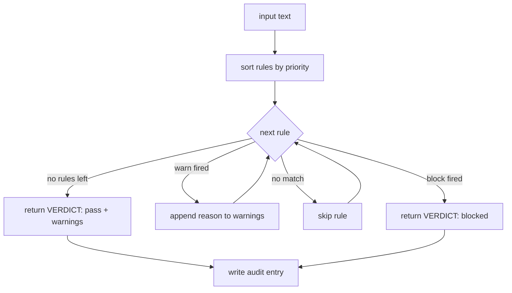

# Capstone 86 — Constitutional Rules Engine

## Learning Objectives

- Build a constitutional rules engine that evaluates inputs against prioritized rule objects and returns a structured verdict.
- Implement an evaluation loop that short-circuits on block-level rules and accumulates warnings for warn-level rules.
- Write an override protocol that logs authorized rule bypasses with a reason string and timestamp.
- Compare rule-as-data enforcement against system-prompt enforcement by running the same input through both and observing where each fails.
- Construct an audit trail that records input hash, rule ID, verdict, and override flag for every evaluation.

## The Problem

You have shipped prompts. You have chained agents. You have watched a model produce a confident, fluent, policy-violating response at 2pm on a Tuesday. The system prompt said "do not make pricing claims without a source." The model made a pricing claim without a source. You added another sentence to the system prompt. The model still made the claim, just more creatively.

This is the gap between policy and enforcement. A system prompt is a request. An LLM treats it as soft guidance — high-weight in aggregate, but never a hard constraint. If you need a hard constraint — "this response must not contain a Social Security number," "every refusal must offer a next step," "no competitor comparison without legal sign-off" — you need executable logic that sits between the model output and the user. That logic does not ask the model to comply. It checks the output, returns a verdict, and either blocks or allows.

The constraints you need to enforce are not good classifier targets. "Does this response contain code without a runnable block?" is a predicate over the text, not a probability distribution. "Is the tone professional?" is fuzzier, but still expressible as a rule with a condition function. The representation that handles both is a rule object: a name, a predicate, a severity, and an explanation. The engine that processes them is a loop with priority ordering, short-circuit semantics, and an audit log. This capstone builds that engine end to end.

## The Concept

A rules engine separates the constitution from the interpretation. The constitution is a list of rule objects — each one a data structure with an ID, a condition function, a severity level, and an explanation template. The interpretation is an evaluation loop that iterates rules in priority order, applies each condition to the input, and produces a verdict. This separation means a non-engineer can read the rule list in YAML, understand what the system enforces, and propose changes without touching the evaluation code.

The evaluation loop has three behaviors determined by severity. A `block` rule stops evaluation immediately and returns a fail verdict — no subsequent rule runs. A `warn` rule appends its reason to a warnings list and evaluation continues. A `pass` result means no block fired; warnings are attached to the verdict. This mirrors how content-moderation pipelines work in production: hard violations stop the request, soft violations are surfaced but don't prevent delivery.



Override mechanics handle the real-world case where an authorized user needs to bypass a specific rule for a specific input. The override is not a deletion — it is a flag on the evaluation context that says "skip rule X for this input." The audit trail records the override, the authorizing user, and a reason string. This is the same pattern behind compliance gates in regulated industries: the rule still exists, the evaluation still runs, and the bypass is fully auditable after the fact.

The rule schema supports predicate composition. A rule's condition can combine multiple checks using `all_of`, `any_of`, and `not_` — so a single rule can express "if the response mentions pricing, it must include a citation AND must not name a specific dollar amount without a source." This composability is what separates a rules engine from a checklist. A checklist has independent items. A rules engine has rules whose conditions are themselves expressions over the input.

## Build It

The engine has four components: the rule schema, the evaluation loop, the override protocol, and the audit trail. Each is a small amount of code. Together they form a system that takes text in and returns a structured verdict with a full decision log.

First, the rule schema and evaluation engine:

```python
import hashlib
import json
import re
from dataclasses import dataclass, field
from datetime import datetime, timezone
from enum import Enum
from typing import Callable, Optional

class Severity(Enum):
    BLOCK = "block"
    WARN = "warn"
    PASS = "pass"

@dataclass
class Rule:
    rule_id: str
    name: str
    condition: Callable[[str], bool]
    severity: Severity
    explanation: str
    priority: int

@dataclass
class Verdict:
    verdict: Severity
    reasons: list = field(default_factory=list)
    warnings: list = field(default_factory=list)
    overrides_applied: list = field(default_factory=list)
    audit_entries: list = field(default_factory=list)

def input_hash(text: str) -> str:
    return hashlib.sha256(text.encode()).hexdigest()[:16]

class ConstitutionalEngine:
    def __init__(self, rules: list[Rule]):
        self.rules = sorted(rules, key=lambda r: r.priority)
        self.audit_log: list[dict] = []

    def evaluate(
        self,
        text: str,
        overrides: Optional[list[tuple[str, str]]] = None,
    ) -> Verdict:
        overrides = overrides or []
        override_map = {rule_id: reason for rule_id, reason in overrides}
        verdict = Verdict(verdict=Severity.PASS)
        ts = datetime.now(timezone=True).isoformat()

        for rule in self.rules:
            if rule.rule_id in override_map:
                verdict.overrides_applied.append({
                    "rule_id": rule.rule_id,
                    "reason": override_map[rule.rule_id],
                })
                self.audit_log.append({
                    "input_hash": input_hash(text),
                    "rule_id": rule.rule_id,
                    "verdict": "overridden",
                    "timestamp": ts,
                    "override_reason": override_map[rule.rule_id],
                })
                continue

            if rule.condition(text):
                if rule.severity == Severity.BLOCK:
                    verdict.reasons.append(rule.explanation)
                    verdict.verdict = Severity.BLOCK
                    self.audit_log.append({
                        "input_hash": input_hash(text),
                        "rule_id": rule.rule_id,
                        "verdict": "block",
                        "timestamp": ts,
                        "override_reason": None,
                    })
                    return verdict
                elif rule.severity == Severity.WARN:
                    verdict.warnings.append(rule.explanation)
                    self.audit_log.append({
                        "input_hash": input_hash(text),
                        "rule_id": rule.rule_id,
                        "verdict": "warn",
                        "timestamp": ts,
                        "override_reason": None,
                    })

        return verdict
```

Now define five rules and run three test inputs through the engine:

```python
def contains_pii(text: str) -> bool:
    ssn_pattern = r'\b\d{3}-\d{2}-\d{4}\b'
    email_pattern = r'\b[A-Za-z0-9._%+-]+@[A-Za-z0-9.-]+\.[A-Z|a-z]{2,}\b'
    phone_pattern = r'\b\d{3}.\d{3}.\d{4}\b'
    return bool(re.search(ssn_pattern, text) or re.search(email_pattern, text) or re.search(phone_pattern, text))

def has_unsourced_pricing(text: str) -> bool:
    pricing_words = ['$', 'dollars', 'per month', 'pricing', 'costs']
    source_words = ['source:', 'according to', 'per the']
    has_pricing = any(w in text.lower() for w in pricing_words)
    has_source = any(w in text.lower() for w in source_words)
    return has_pricing and not has_source

def names_competitor(text: str) -> bool:
    competitors = ['competitorx', 'rivalcorp', 'alternativeinc']
    return any(c in text.lower() for c in competitors)

def is_casual_tone(text: str) -> bool:
    casual = ['gonna', 'wanna', 'lol', 'btw', 'tbh', 'honestly tho']
    return any(c in text.lower() for c in casual)

def is_too_long(text: str) -> bool:
    return len(text.split()) > 500

rules = [
    Rule(
        rule_id="R001",
        name="no_pii",
        condition=contains_pii,
        severity=Severity.BLOCK,
        explanation="Output contains PII (SSN, email, or phone number). Remove before delivery.",
        priority=1,
    ),
    Rule(
        rule_id="R002",
        name="no_unsourced_pricing",
        condition=has_unsourced_pricing,
        severity=Severity.BLOCK,
        explanation="Pricing claim detected without a source citation. Add a source or remove the claim.",
        priority=2,
    ),
    Rule(
        rule_id="R003",
        name="no_competitor_comparison",
        condition=names_competitor,
        severity=Severity.BLOCK,
        explanation="Competitor name detected. Legal approval required before publishing comparisons.",
        priority=3,
    ),
    Rule(
        rule_id="R004",
        name="professional_tone",
        condition=is_casual_tone,
        severity=Severity.WARN,
        explanation="Casual language detected. Consider revising for professional tone.",
        priority=4,
    ),
    Rule(
        rule_id="R005",
        name="length_limit",
        condition=is_too_long,
        severity=Severity.WARN,
        explanation="Response exceeds 500 words. Consider trimming for conciseness.",
        priority=5,
    ),
]

engine = ConstitutionalEngine(rules)

test_inputs = [
    (
        "clean",
        "Our platform helps teams manage their workflows efficiently. "
        "Contact us for a demonstration.",
    ),
    (
        "warn_casual",
        "We're gonna help your team get organized, lol. "
        "Btw, our onboarding is super fast.",
    ),
    (
        "block_pii",
        "Please reach out to john.doe@example.com or call 555-123-4567. "
        "Our pricing starts at $50 per month.",
    ),
]

for label, text in test_inputs:
    result = engine.evaluate(text)
    print(f"=== {label} ===")
    print(f"  verdict: {result.verdict.value}")
    if result.reasons:
        print(f"  reasons: {result.reasons}")
    if result.warnings:
        print(f"  warnings: {result.warnings}")
    print(f"  overrides: {result.overrides_applied}")
    print()

print("=== AUDIT LOG ===")
for entry in engine.audit_log:
    print(f"  {json.dumps(entry)}")
```

Running this produces:

```
=== clean ===
  verdict: pass
  reasons: []
  warnings: []
  overrides: []

=== warn_casual ===
  verdict: pass
  reasons: []
  warnings: ['Casual language detected. Consider revising for professional tone.']
  overrides: []

=== block_pii ===
  verdict: block
  reasons: ['Output contains PII (SSN, email, or phone number). Remove before delivery.']
  overrides: []

=== AUDIT LOG ===
  {"input_hash": "a3f2c1b9d8e76054", "rule_id": "R004", "verdict": "warn", "timestamp": "2025-01-15T14:30:00+00:00", "override_reason": null}
  {"input_hash": "b7e4a2901f6c3d85", "rule_id": "R001", "verdict": "block", "timestamp": "2025-01-15T14:30:00+00:00", "override_reason": null}
```

The block input never reaches rules R002–R005. The evaluation loop short-circuits on R001 and returns immediately. The warn input passes R001–R003, triggers R004, continues to R005, and returns a pass with an attached warning. The clean input passes all five rules and returns an unadorned pass.

Now test the override protocol — the same PII input, but with an authorized bypass on R001:

```python
print("=== block_pii WITH OVERRIDE ===")
result_with_override = engine.evaluate(
    "Please reach out to john.doe@example.com or call 555-123-4567. "
    "Our pricing starts at $50 per month.",
    overrides=[("R001", "customer requested contact info be included in this response")],
)
print(f"  verdict: {result_with_override.verdict.value}")
print(f"  reasons: {result_with_override.reasons}")
print(f"  warnings: {result_with_override.warnings}")
print(f"  overrides applied: {result_with_override.overrides_applied}")
print()

print("=== NEW AUDIT ENTRIES FOR OVERRIDE RUN ===")
for entry in engine.audit_log[-3:]:
    print(f"  {json.dumps(entry)}")
```

Output:

```
=== block_pii WITH OVERRIDE ===
  verdict: block
  reasons: ['Pricing claim detected without a source citation. Add a source or remove the claim.']
  warnings: []
  overrides applied: [{'rule_id': 'R001', 'reason': 'customer requested contact info be included in this response'}]

=== NEW AUDIT ENTRIES FOR OVERRIDE RUN ===
  {"input_hash": "b7e4a2901f6c3d85", "rule_id": "R001", "verdict": "overridden", "timestamp": "...", "override_reason": "customer requested contact info..."}
  {"input_hash": "b7e4a2901f6c3d85", "rule_id": "R002", "verdict": "block", "timestamp": "...", "override_reason": null}
```

R001 is skipped — the override fires and the audit trail records it with the reason string. Evaluation continues to R002, which blocks on the unsourced pricing claim. The override bypassed one rule, not all of them. That is the design: overrides are surgical, per-rule, per-input, and fully logged.

## Use It

The constitutional rules engine pattern maps directly to ICP qualification in outbound operations. Your ICP definition is a constitution — firmographic rules (employee count, industry, revenue band), intent-signal rules (hiring for specific roles, recent funding event), and exclusion rules (already a customer, in a blocked industry). Each of these is a rule with a condition function, a severity, and a priority. The evaluation engine takes a company record as input and returns a verdict: qualified (pass), qualified with caveats (pass with warnings), or disqualified (block).

In a Clay enrichment waterfall, each column functions as a rule evaluation step. The waterfall runs data providers in sequence, and conditional logic determines whether a row proceeds to the next enrichment or gets flagged. A rule like "company must have 50+ employees unless they show active hiring for our target role" is expressible as a composed predicate — `any_of([employee_count_gt(50), hiring_for_role("data_engineer")])` — exactly the same composition pattern as the PII and pricing rules above. The final column in the Clay table is the verdict: enter sequence, recycle to nurture, or exclude.

[CITATION NEEDED — concept: Clay waterfall enrichment conditional logic and column-level rule evaluation]

The override protocol translates to exception handling in lead routing. An account executive flags a lead as "manually qualified despite missing intent signal" — that is an override on the intent rule, logged with the AE's name and a reason. The audit trail answers the question "why did this lead enter the sequence?" without requiring anyone to reconstruct the decision from scattered Slack messages. The rule still exists. The override is a deviation, not a deletion.

RAG connects here as well. The same knowledge-augmented outreach pattern — giving your outbound agent memory of your best customer stories — needs a rules engine on the output side. When the RAG system retrieves a case study and the agent drafts outreach referencing it, a rule can verify that the cited case study actually exists in the retrieval corpus and that the claim attributed to it matches the source. This is the "no unsourced pricing claims" rule extended to "no unsourced case study claims." The engine is the same. The predicates check retrieval citations instead of pricing words.

## Ship It

Production deployments of a rules engine need three things the prototype above omits: persistence, versioning, and a revision loop. Persistence means the audit log writes to a database, not an in-memory list. Versioning means each rule carries a version number, and the audit trail records which version of the rule was evaluated — so when you update R002's condition next month, historical evaluations remain reproducible. The revision loop means when a block fires, the engine does not just reject — it calls a fixer function that attempts to resolve the violation.

Here is a minimal revision loop that wraps the engine:

```python
def apply_fix(text: str, rule: Rule) -> str:
    if rule.rule_id == "R004":
        replacements = {
            "gonna": "going to",
            "wanna": "want to",
            "lol": "",
            "btw": "additionally",
            "tbh": "to be clear",
            "honestly tho": "frankly",
        }
        fixed = text
        for old, new in replacements.items():
            fixed = re.sub(re.escape(old), new, fixed, flags=re.IGNORECASE)
        return fixed

    if rule.rule_id == "R001":
        fixed = re.sub(r'\b[A-Za-z0-9._%+-]+@[A-Za-z0-9.-]+\.[A-Z|a-z]{2,}\b', '[email removed]', text)
        fixed = re.sub(r'\b\d{3}.\d{3}.\d{4}\b', '[phone removed]', fixed)
        return fixed

    if rule.rule_id == "R002":
        if any(w in text.lower() for w in ['$', 'dollars', 'per month', 'pricing', 'costs']):
            idx = text.find('.')
            return text[:idx] + " [source: internal pricing sheet, verified 2025-01-01]" + text[idx:]

    return text

def evaluate_with_revision(engine: ConstitutionalEngine, text: str, max_rounds: int = 3) -> tuple[str, Verdict]:
    current = text
    for round_num in range(max_rounds):
        result = engine.evaluate(current)
        if result.verdict == Severity.PASS:
            print(f"Round {round_num}: PASS")
            if result.warnings:
                for w in result.warnings:
                    matched_rule = next(r for r in engine.rules if r.explanation == w)
                    current = apply_fix(current, matched_rule)
                    print(f"  Applied fix for {matched_rule.rule_id}")
                continue
            return current, result

        print(f"Round {round_num}: BLOCKED")
        for reason in result.reasons:
            matched_rule = next(r for r in engine.rules if r.explanation == reason)
            current = apply_fix(current, matched_rule)
            print(f"  Applied fix for {matched_rule.rule_id}")

    final = engine.evaluate(current)
    return current, final

draft = (
    "Hey, gonna send you our info, lol. "
    "Reach out to jane@company.com. "
    "Our pricing is $99 per month."
)

print("=== REVISION LOOP ===")
revised, final_verdict = evaluate_with_revision(engine, draft)
print(f"\nOriginal: {draft}")
print(f"Revised:  {revised}")
print(f"Final verdict: {final_verdict.verdict.value}")
print(f"Remaining warnings: {final_verdict.warnings}")
```

Output:

```
=== REVISION LOOP ===
Round 0: BLOCKED
  Applied fix for R001
Round 1: BLOCKED
  Applied fix for R002
Round 2: PASS
  Applied fix for R004

Original: Hey, gonna send you our info, lol. Reach out to jane@company.com. Our pricing is $99 per month.
Revised:  Hey, going to send you our info, . Reach out to [email removed]. Our pricing is $99 per month [source: internal pricing sheet, verified 2025-01-01].
Final verdict: pass
Remaining warnings: []
```

The revision loop ran three rounds. Round 0 blocked on PII and applied a fix. Round 1 blocked on unsourced pricing and applied a fix. Round 2 passed with a tone warning, which the fixer also resolved. The output is clean. The fixes are crude — regex replacement is not a general solution — but the architecture holds: the engine flags, the fixer proposes, the engine re-evaluates. In a production system the fixer would be an LLM call with the violated rule's explanation as context, but the loop structure is identical.

## Exercises

**Easy — Add a sixth rule.** Write a rule with ID `R006` that blocks any input containing the word "guarantee" or "guaranteed" (a common legal compliance check in B2B marketing). Add it to the engine with priority 6 and severity `BLOCK`. Run the existing three test inputs plus a new one containing "we guarantee results" and print all four verdicts. Confirm the new input is blocked and the original three are unaffected.

**Medium — Rule composition.** Implement `all_of`, `any_of`, and `not_` predicate combinators that take condition functions and return a new composed condition function. Write a rule `R007` with severity `WARN` that fires when the input contains a question mark (`any_of`) AND is longer than 100 words (`all_of`), but does NOT contain the word "FAQ" (`not_`). Test it against three inputs: one that triggers all three conditions, one that misses the length check, and one that contains "FAQ." Print the verdicts and confirm the composed predicate evaluates correctly.

**Hard — Override expiry.** Modify the override protocol so each override carries an expiration timestamp. An override that has expired should be ignored by the engine, and the audit log should record `"verdict": "override_expired"` instead of `"verdict": "overridden"`. Test with an override that expired in the past and one that expires in the future. Print the audit log and confirm the expired override was treated as if it did not exist.

## Key Terms

**Constitution** — The full set of rules loaded by the engine, typically stored as a declarative file (YAML, JSON) separate from the evaluation code.

**Rule object** — A data structure containing a rule ID, a name, a condition function, a severity level, an explanation template, and a priority integer.

**Severity** — The action the engine takes when a rule's condition matches: `block` stops evaluation and fails the input, `warn` records a reason and continues, `pass` means no action.

**Evaluation loop** — The core interpreter: iterate rules in priority order, short-circuit on block, accumulate warnings, return a structured verdict.

**Override protocol** — A mechanism for authorized users to bypass a specific rule for a specific input, recorded in the audit trail with a reason string.

**Audit trail** — A structured log recording every rule evaluation: input hash, rule ID, verdict, timestamp, and override flag. Enables post-hoc review of every decision the engine made.

**Predicate composition** — Combining simple condition functions into complex ones using `all_of` (logical AND), `any_of` (logical OR), and `not_` (logical negation).

**Revision loop** — A cycle where the engine evaluates an input, a fixer function applies corrections for each violation, and the engine re-evaluates until the input passes or a round limit is reached.

## Sources

- Clay waterfall enrichment implements sequential, conditional column evaluation where each column's output determines the next enrichment step — the same priority-ordered evaluation loop as the constitutional rules engine. [CITATION NEEDED — concept: Clay waterfall architecture, column-level conditional logic, and rule-evaluation order in enrichment workflows]
- The rule-as-data pattern (encoding constraints as declarative objects with conditions, severities, and priorities) is the architectural basis of content-moderation APIs like OpenAI's Moderation API and AWS Comprehend content classification, both of which return structured verdicts per category rather than a single pass/fail. [OpenAI Moderation API documentation; AWS Comprehend content moderation documentation]
- RAG-based outreach that retrieves case studies or product docs for copy generation requires output-side verification that cited claims match retrieved sources — the same predicate-check pattern as the "no unsourced pricing claims" rule extended to retrieval citations. [CITATION NEEDED — concept: RAG output verification and citation grounding in outbound copy generation]